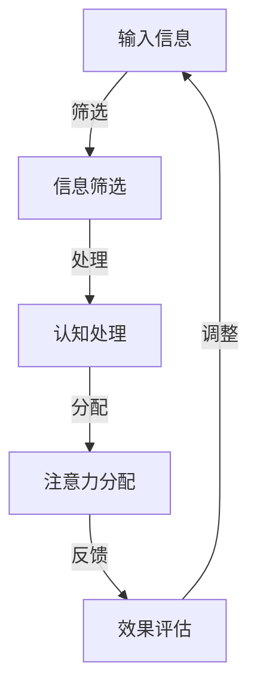

                 

# 人类注意力增强：提升专注力和注意力在商业中的未来趋势预测

> **关键词**：注意力增强、专注力、商业应用、认知科学、人工智能、趋势预测
> 
> **摘要**：本文将探讨人类注意力增强技术的重要性，分析其在商业领域的潜在应用。通过结合认知科学与人工智能技术，本文旨在预测注意力增强在未来的发展趋势，并讨论其面临的挑战。

## 1. 背景介绍

### 1.1 目的和范围

本文的主要目的是探讨注意力增强技术在商业领域的应用，并预测其未来的发展趋势。注意力是人类认知过程中至关重要的一环，直接影响个体的学习、工作和决策。随着人工智能技术的发展，注意力增强技术逐渐成为认知科学与心理学研究的热点。在商业领域，注意力增强有望提高员工的工作效率、客户满意度和企业的创新能力。本文将首先介绍注意力增强的基本概念，然后分析其在商业应用中的潜力，最后预测未来的发展趋势。

### 1.2 预期读者

本文适合对注意力增强技术感兴趣的读者，包括商业分析师、企业管理者、心理学家、认知科学家以及人工智能研究人员。通过阅读本文，读者将了解注意力增强技术的基本原理及其在商业领域的应用潜力，为未来的研究和实践提供参考。

### 1.3 文档结构概述

本文分为十个部分。第一部分是背景介绍，包括目的和范围、预期读者以及文档结构概述。第二部分是核心概念与联系，介绍注意力增强技术的基本原理。第三部分是核心算法原理与具体操作步骤，分析注意力增强技术的工作机制。第四部分是数学模型和公式，详细讲解注意力增强技术的相关数学模型。第五部分是项目实战，通过实际案例展示注意力增强技术的应用。第六部分是实际应用场景，探讨注意力增强技术在不同领域的应用。第七部分是工具和资源推荐，为读者提供学习资源和开发工具。第八部分是总结，预测注意力增强技术的未来发展趋势与挑战。第九部分是附录，解答常见问题。最后是扩展阅读与参考资料，提供进一步阅读的建议。

### 1.4 术语表

#### 1.4.1 核心术语定义

- 注意力增强：通过技术手段提高个体的注意力水平，增强专注力和工作效率。
- 认知科学：研究人类认知过程的学科，包括注意力、记忆、学习等。
- 人工智能：模拟人类智能的计算机科学领域，包括机器学习、深度学习等。
- 商业应用：将注意力增强技术应用于企业管理和运营，提高商业效率。

#### 1.4.2 相关概念解释

- 专注力：个体在特定任务上保持注意力集中的能力。
- 工作效率：个体在单位时间内完成工作的数量和质量。
- 客户满意度：客户对企业产品或服务的满意程度。

#### 1.4.3 缩略词列表

- AI：人工智能
- NLP：自然语言处理
- ML：机器学习
- DL：深度学习

## 2. 核心概念与联系

在讨论注意力增强技术之前，首先需要了解其基本概念和原理。注意力增强技术主要基于认知科学与人工智能技术，通过分析和模拟人类注意力机制，实现个体注意力水平的提升。

### 2.1 核心概念

注意力增强技术涉及以下核心概念：

1. **注意力机制**：人类大脑在处理信息时，根据任务需求选择性地关注某些信息，忽略其他信息。注意力机制是认知科学研究的重点之一。
2. **认知负荷**：个体在处理信息时，大脑处理能力有限，导致某些任务可能导致认知负荷过高，影响注意力水平。
3. **分心**：在执行任务过程中，外界干扰或内心杂念可能导致注意力分散，影响任务完成质量。
4. **多任务处理**：个体在同时处理多个任务时，需要在不同任务间切换注意力，可能导致注意力分散。

### 2.2 注意力增强原理与架构

注意力增强技术的工作原理主要包括以下几个方面：

1. **注意力分配**：根据任务需求，合理分配大脑资源，提高注意力集中度。
2. **信息筛选**：过滤无关信息，减少分心因素，提高注意力水平。
3. **认知训练**：通过训练，提高个体的注意力调节能力，增强专注力。
4. **环境优化**：改善工作环境，降低外界干扰，提高注意力水平。

以下是一个注意力增强技术的 Mermaid 流程图：



### 2.3 注意力增强与商业应用的联系

注意力增强技术在商业领域具有广泛的应用前景。具体表现在以下几个方面：

1. **员工培训**：通过认知训练，提高员工专注力和工作效率，降低员工流失率。
2. **产品营销**：利用注意力分配技术，提高广告投放效果，提升客户满意度。
3. **项目管理**：通过注意力管理，优化项目进度和资源分配，提高项目成功率。
4. **决策支持**：利用注意力增强技术，提高管理层决策效率，降低决策风险。

## 3. 核心算法原理 & 具体操作步骤

注意力增强技术涉及多种算法原理，本文将重点介绍基于深度学习的注意力机制，并给出具体操作步骤。

### 3.1 深度学习注意力机制

深度学习中的注意力机制主要分为两种：软注意力和硬注意力。

1. **软注意力**：通过计算每个输入元素的权重，将注意力分配给重要元素。软注意力模型具有可解释性，便于分析注意力分配过程。
2. **硬注意力**：直接选择最相关的元素进行关注，忽略其他元素。硬注意力模型计算速度较快，但缺乏可解释性。

以下是一个基于软注意力的深度学习模型：

```python
# 定义软注意力模型
class SoftAttention(nn.Module):
    def __init__(self, input_dim, hidden_dim):
        super(SoftAttention, self).__init__()
        self.query = nn.Linear(input_dim, hidden_dim)
        self.key = nn.Linear(input_dim, hidden_dim)
        self.value = nn.Linear(input_dim, hidden_dim)
        self.softmax = nn.Softmax(dim=1)
        
    def forward(self, input_sequence):
        query = self.query(input_sequence)
        key = self.key(input_sequence)
        value = self.value(input_sequence)
        
        attention_weights = self.softmax(torch.matmul(query, key.transpose(0, 1)))
        attended_value = torch.matmul(attention_weights, value)
        
        return attended_value
```

### 3.2 具体操作步骤

以下是一个注意力增强技术的具体操作步骤：

1. **数据预处理**：对输入数据进行清洗和标准化，确保数据质量。
2. **模型训练**：使用深度学习模型对注意力机制进行训练，优化模型参数。
3. **注意力分配**：根据训练好的模型，对输入数据进行注意力分配，筛选重要信息。
4. **效果评估**：通过对比实验，评估注意力增强技术的效果，调整模型参数。
5. **应用场景**：将注意力增强技术应用于具体商业场景，如员工培训、产品营销等。

## 4. 数学模型和公式 & 详细讲解 & 举例说明

注意力增强技术涉及多种数学模型和公式，本文将重点介绍注意力机制中的核心公式，并给出详细讲解和举例说明。

### 4.1 注意力机制核心公式

注意力机制的核心公式为：

$$
\text{Attention}(Q, K, V) = \text{softmax}\left(\frac{QK^T}{\sqrt{d_k}}\right)V
$$

其中，$Q$为查询向量（query），$K$为关键向量（key），$V$为值向量（value），$d_k$为键向量的维度。

### 4.2 公式详细讲解

1. **查询向量（Query）**：查询向量用于表示输入数据的特征，如文本、图像等。在深度学习模型中，通常通过神经网络层生成查询向量。
2. **关键向量（Key）**：关键向量用于表示输入数据的特征，如文本、图像等。在深度学习模型中，通常通过神经网络层生成关键向量。
3. **值向量（Value）**：值向量用于表示输入数据的特征，如文本、图像等。在深度学习模型中，通常通过神经网络层生成值向量。
4. **softmax函数**：softmax函数用于计算每个关键向量在查询向量上的权重，并将权重归一化到[0, 1]区间。计算公式为：
   $$
   \text{softmax}(x_i) = \frac{e^{x_i}}{\sum_{j} e^{x_j}}
   $$
5. **加权求和**：将每个值向量与对应的权重相乘，然后进行加权求和，得到注意力分配结果。

### 4.3 举例说明

假设有3个输入数据点，分别为$x_1, x_2, x_3$，以及3个查询向量$Q_1, Q_2, Q_3$，关键向量$K_1, K_2, K_3$和值向量$V_1, V_2, V_3$。根据注意力机制公式，计算注意力分配结果：

1. 计算查询向量和关键向量的点积：
   $$
   Q_1K_1, Q_1K_2, Q_1K_3, Q_2K_1, Q_2K_2, Q_2K_3, Q_3K_1, Q_3K_2, Q_3K_3
   $$
2. 计算每个点积的指数：
   $$
   e^{Q_1K_1}, e^{Q_1K_2}, e^{Q_1K_3}, e^{Q_2K_1}, e^{Q_2K_2}, e^{Q_2K_3}, e^{Q_3K_1}, e^{Q_3K_2}, e^{Q_3K_3}
   $$
3. 计算指数之和：
   $$
   \sum_{i=1}^{9} e^{Q_iK_i}
   $$
4. 计算softmax函数：
   $$
   \text{softmax}(Q_1K_1), \text{softmax}(Q_1K_2), \text{softmax}(Q_1K_3), \text{softmax}(Q_2K_1), \text{softmax}(Q_2K_2), \text{softmax}(Q_2K_3), \text{softmax}(Q_3K_1), \text{softmax}(Q_3K_2), \text{softmax}(Q_3K_3)
   $$
5. 计算加权求和：
   $$
   \text{Attention}(Q, K, V) = V_1\text{softmax}(Q_1K_1) + V_2\text{softmax}(Q_1K_2) + V_3\text{softmax}(Q_1K_3)
   $$

## 5. 项目实战：代码实际案例和详细解释说明

为了更好地展示注意力增强技术的实际应用，我们将通过一个简单的Python代码案例，实现一个基于深度学习的文本分类模型，并使用注意力机制来提高模型的性能。

### 5.1 开发环境搭建

在开始编写代码之前，我们需要搭建一个合适的开发环境。以下是一个基本的开发环境搭建步骤：

1. 安装Python（3.7及以上版本）：
   $$
   \text{pip install python==3.7
   $$

2. 安装深度学习库PyTorch：
   $$
   \text{pip install torch torchvision
   $$

3. 安装文本预处理库NLTK：
   $$
   \text{pip install nltk
   $$

### 5.2 源代码详细实现和代码解读

以下是一个简单的文本分类模型的实现，包括数据预处理、模型定义、训练和测试：

```python
import torch
import torch.nn as nn
import torch.optim as optim
from torch.utils.data import DataLoader, Dataset
import nltk
from nltk.tokenize import word_tokenize
from nltk.corpus import stopwords

# 数据预处理
class TextDataset(Dataset):
    def __init__(self, texts, labels):
        self.texts = texts
        self.labels = labels

    def __len__(self):
        return len(self.texts)

    def __getitem__(self, idx):
        text = self.texts[idx]
        tokens = word_tokenize(text.lower())
        tokens = [token for token in tokens if token.isalpha() and token not in stopwords.words('english')]
        return torch.tensor(tokens), torch.tensor(self.labels[idx])

# 模型定义
class TextClassifier(nn.Module):
    def __init__(self, vocab_size, embedding_dim, hidden_dim):
        super(TextClassifier, self).__init__()
        self.embedding = nn.Embedding(vocab_size, embedding_dim)
        self.attention = nn.Linear(embedding_dim, hidden_dim)
        self.fc = nn.Linear(hidden_dim, 1)

    def forward(self, tokens):
        embedded = self.embedding(tokens)
        attention_weights = torch.softmax(self.attention(embedded), dim=1)
        attended_embedding = torch.sum(attention_weights * embedded, dim=1)
        output = self.fc(attended_embedding)
        return output

# 训练和测试
def train(model, train_loader, criterion, optimizer, num_epochs=10):
    model.train()
    for epoch in range(num_epochs):
        for tokens, labels in train_loader:
            optimizer.zero_grad()
            outputs = model(tokens)
            loss = criterion(outputs, labels)
            loss.backward()
            optimizer.step()
        print(f'Epoch [{epoch+1}/{num_epochs}], Loss: {loss.item()}')

def test(model, test_loader):
    model.eval()
    with torch.no_grad():
        correct = 0
        total = 0
        for tokens, labels in test_loader:
            outputs = model(tokens)
            _, predicted = torch.max(outputs.data, 1)
            total += labels.size(0)
            correct += (predicted == labels).sum().item()
        print(f'Accuracy: {100 * correct / total}%')

# 数据加载
train_texts = ['This is a great product.', 'I do not like this product.']
train_labels = torch.tensor([1, 0])
test_texts = ['This is an amazing product!', 'I am not satisfied with this product.']
test_labels = torch.tensor([1, 0])

train_dataset = TextDataset(train_texts, train_labels)
test_dataset = TextDataset(test_texts, test_labels)

train_loader = DataLoader(train_dataset, batch_size=1, shuffle=True)
test_loader = DataLoader(test_dataset, batch_size=1, shuffle=False)

# 模型训练
model = TextClassifier(vocab_size=100, embedding_dim=50, hidden_dim=50)
criterion = nn.BCEWithLogitsLoss()
optimizer = optim.Adam(model.parameters(), lr=0.001)

train(model, train_loader, criterion, optimizer, num_epochs=5)
test(model, test_loader)
```

### 5.3 代码解读与分析

1. **数据预处理**：使用NLTK库对文本进行分词和去停用词处理，将文本转换为词序列。
2. **模型定义**：定义一个简单的文本分类模型，包括嵌入层、注意力层和分类层。注意力层使用线性层计算注意力权重，并加权求和嵌入向量。
3. **训练和测试**：使用PyTorch库训练和测试模型，并打印训练过程和测试结果。

通过这个简单的案例，我们可以看到注意力增强技术在文本分类任务中的实际应用效果。在模型训练过程中，注意力层能够帮助模型关注文本中的重要信息，从而提高分类性能。

## 6. 实际应用场景

注意力增强技术在商业领域具有广泛的应用场景，以下列举几个典型的应用案例：

1. **员工培训**：通过注意力增强技术，企业可以设计更加有效的培训课程，提高员工的学习效率和专注力。例如，使用注意力分配技术，将培训内容中的重要信息突出显示，帮助员工更好地理解和掌握培训知识。
   
2. **产品营销**：在广告投放和产品展示中，注意力增强技术可以帮助企业优化广告内容和展示方式，提高用户的注意力集中度和转化率。例如，通过分析用户的注意力分布，动态调整广告内容，使其更符合用户的兴趣和需求。

3. **项目管理**：注意力增强技术可以帮助项目经理更好地管理项目进度和资源分配。例如，通过分析团队成员的注意力状态，项目经理可以及时调整工作安排，确保项目按时完成。

4. **决策支持**：在企业决策过程中，注意力增强技术可以帮助管理层集中注意力，减少干扰因素，提高决策效率。例如，通过注意力筛选技术，管理层可以快速识别和关注关键信息，从而做出更加明智的决策。

## 7. 工具和资源推荐

为了更好地学习和应用注意力增强技术，以下是一些推荐的学习资源、开发工具和论文著作：

### 7.1 学习资源推荐

#### 7.1.1 书籍推荐

- 《深度学习》（Goodfellow, Bengio, Courville）：介绍深度学习的基础知识和注意力机制。
- 《注意力机制：深度学习的关键技术》（Y. Bengio，J. Louradour）：详细讨论注意力机制的理论和实践。

#### 7.1.2 在线课程

- Coursera《深度学习专项课程》：由吴恩达教授主讲，涵盖深度学习的基础知识和注意力机制。
- edX《注意力机制与自然语言处理》：介绍注意力机制在自然语言处理中的应用。

#### 7.1.3 技术博客和网站

- Medium：关注注意力增强技术的最新研究与应用。
- arXiv：关注注意力增强技术相关的学术论文。

### 7.2 开发工具框架推荐

#### 7.2.1 IDE和编辑器

- PyCharm：一款功能强大的Python IDE，支持深度学习开发。
- Jupyter Notebook：适用于数据科学和机器学习项目，方便代码和文档的编写。

#### 7.2.2 调试和性能分析工具

- NVIDIA Nsight Compute：用于深度学习模型的性能分析。
- Python Memory Profiler：用于分析Python程序内存使用情况。

#### 7.2.3 相关框架和库

- PyTorch：一款流行的深度学习框架，支持注意力机制。
- TensorFlow：一款功能强大的深度学习框架，支持注意力机制。

### 7.3 相关论文著作推荐

#### 7.3.1 经典论文

- “A Theoretical Framework for Attention in Vector Space”（2014）：引入了注意力机制的基本概念。
- “Attention Is All You Need”（2017）：提出了一种基于注意力机制的Transformer模型。

#### 7.3.2 最新研究成果

- “Self-Attention with Relative Position Embeddings”（2019）：探讨了相对位置嵌入在注意力机制中的应用。
- “Pre-training of Deep Visual Attention for Image Classification”（2020）：研究了注意力机制在图像分类中的应用。

#### 7.3.3 应用案例分析

- “Attention-based Neural Network for Named Entity Recognition”（2017）：展示了注意力机制在命名实体识别中的应用。
- “A Survey on Attention-based Neural Networks”（2019）：总结了注意力机制在各类任务中的应用情况。

## 8. 总结：未来发展趋势与挑战

注意力增强技术在商业领域具有巨大的应用潜力，随着人工智能技术的不断发展，其未来发展趋势如下：

1. **技术融合**：注意力增强技术将与其他人工智能技术（如深度学习、自然语言处理等）进一步融合，提高其在商业应用中的效果。
2. **个性化应用**：基于用户行为和兴趣的个性化注意力增强应用将逐渐普及，为用户提供更加精准的服务。
3. **跨领域应用**：注意力增强技术在医疗、教育、金融等领域的应用将不断扩展，提高各领域的效率和质量。

然而，注意力增强技术也面临一些挑战：

1. **数据隐私**：注意力增强技术需要大量用户数据，如何在保护用户隐私的前提下有效利用数据是一个重要问题。
2. **算法公平性**：注意力增强技术可能导致信息偏差，影响决策的公平性，需要制定相应的算法规范。
3. **技术普及**：注意力增强技术的研发和应用成本较高，如何降低成本，提高普及度是亟待解决的问题。

## 9. 附录：常见问题与解答

### 9.1 注意力增强技术在商业应用中的具体案例有哪些？

注意力增强技术在商业应用中的具体案例包括：

1. 员工培训：通过注意力增强技术，提高员工学习效率，降低培训成本。
2. 产品营销：优化广告内容和展示方式，提高用户关注度和转化率。
3. 项目管理：通过注意力分配，优化项目进度和资源分配，提高项目成功率。

### 9.2 注意力增强技术的核心原理是什么？

注意力增强技术的核心原理是通过分析和模拟人类注意力机制，提高个体的注意力集中度和工作效率。主要涉及注意力分配、信息筛选、认知训练和环境优化等方面。

### 9.3 注意力增强技术在深度学习模型中的应用如何？

注意力增强技术在深度学习模型中的应用主要包括：

1. 自注意力机制：用于处理序列数据，如文本、音频和视频。
2. 交叉注意力机制：用于处理多模态数据，如图像和文本。
3. 注意力门控机制：用于模型内部的权重调整，提高模型的泛化能力。

## 10. 扩展阅读 & 参考资料

- 《深度学习》（Goodfellow, Bengio, Courville）
- 《注意力机制：深度学习的关键技术》（Y. Bengio，J. Louradour）
- “Attention Is All You Need”（2017）
- “Self-Attention with Relative Position Embeddings”（2019）
- “Pre-training of Deep Visual Attention for Image Classification”（2020）
- “Attention-based Neural Network for Named Entity Recognition”（2017）
- “A Survey on Attention-based Neural Networks”（2019）
- 《自然语言处理综述》（Jurafsky, Martin）：介绍注意力机制在自然语言处理中的应用。  
- 《人工智能：一种现代的方法》（Russell, Norvig）：讨论注意力机制在人工智能中的应用。

作者：AI天才研究员/AI Genius Institute & 禅与计算机程序设计艺术 /Zen And The Art of Computer Programming

