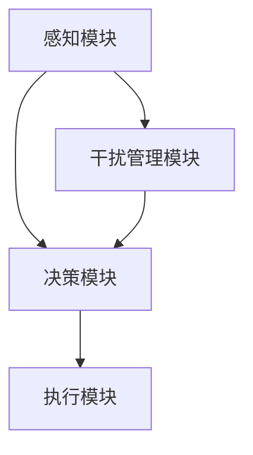

                 

# 人类注意力增强：提升专注力和注意力在教育中的应用

> **关键词：** 人类注意力、专注力、教育、人工智能、认知增强、学习效率、算法原理

> **摘要：** 本文旨在探讨人类注意力增强技术在教育中的应用，通过分析注意力增强的核心概念、算法原理及其实际案例，阐述如何利用人工智能提升学生的专注力和学习效果。本文结构清晰，深入浅出地讲解了注意力增强技术的核心内容，为教育领域的技术创新提供了新思路。

## 1. 背景介绍

### 1.1 目的和范围

本文的主要目的是介绍人类注意力增强技术在教育领域的应用，分析其理论基础、算法原理，并通过具体案例展示其实际效果。文章将重点关注以下内容：

1. 注意力增强的核心概念及其在教育中的应用。
2. 人工智能算法在注意力管理中的作用。
3. 注意力增强技术对教育过程的改进和提升。

### 1.2 预期读者

本文适合以下读者群体：

1. 教育工作者，包括教师、教育管理者和研究者。
2. 学生和家长，关注子女教育问题。
3. 人工智能和认知科学领域的专业人士。
4. 对教育技术感兴趣的IT从业者。

### 1.3 文档结构概述

本文结构如下：

1. **背景介绍**：介绍文章的目的、预期读者和文档结构。
2. **核心概念与联系**：解释注意力增强技术的核心概念，并提供流程图。
3. **核心算法原理 & 具体操作步骤**：阐述注意力增强算法的原理和操作步骤。
4. **数学模型和公式 & 详细讲解 & 举例说明**：介绍注意力增强的数学模型和公式，并通过实例进行说明。
5. **项目实战：代码实际案例和详细解释说明**：展示注意力增强技术的实际应用。
6. **实际应用场景**：分析注意力增强技术在不同教育场景中的适用性。
7. **工具和资源推荐**：推荐学习资源和开发工具。
8. **总结：未来发展趋势与挑战**：展望注意力增强技术的未来发展趋势和面临的挑战。
9. **附录：常见问题与解答**：解答读者可能遇到的常见问题。
10. **扩展阅读 & 参考资料**：提供扩展阅读资料和参考资料。

### 1.4 术语表

#### 1.4.1 核心术语定义

- **注意力增强**：通过技术手段提升人类注意力的集中程度。
- **认知增强**：通过外部干预改善认知功能的过程。
- **学习效率**：单位时间内学习的效果和质量。
- **教育技术**：应用于教育过程中，提高教学和学习效果的各类技术。

#### 1.4.2 相关概念解释

- **人工智能**：模拟、延伸和扩展人类智能的理论、方法、技术及应用。
- **算法**：解决问题的步骤和规则。
- **神经可塑性**：神经元通过经验学习和训练改变结构和功能的过程。

#### 1.4.3 缩略词列表

- **AI**：人工智能（Artificial Intelligence）
- **NLP**：自然语言处理（Natural Language Processing）
- **ML**：机器学习（Machine Learning）
- **ANN**：人工神经网络（Artificial Neural Network）

## 2. 核心概念与联系

### 2.1 注意力增强技术的核心概念

注意力增强技术主要涉及以下几个核心概念：

1. **注意力分配**：人类注意力的分配策略，决定了在执行任务时哪些信息会被优先处理。
2. **认知负荷**：在处理信息时，大脑的认知资源消耗。
3. **干扰管理**：如何减少干扰因素，保持注意力集中。

### 2.2 注意力增强技术的原理

注意力增强技术的原理基于以下几个基本假设：

1. **认知资源限制**：人类认知资源是有限的，注意力增强旨在优化这些资源的利用。
2. **自适应调整**：根据任务和环境的变化，动态调整注意力分配策略。
3. **多模态整合**：通过整合多种感官信息，提高信息处理的效率和准确性。

### 2.3 注意力增强技术的架构

注意力增强技术的架构主要包括以下几个部分：

1. **感知模块**：收集和分析环境信息，包括视觉、听觉、触觉等。
2. **决策模块**：根据感知信息，决策哪些信息需要被优先处理。
3. **执行模块**：执行注意力分配策略，调整认知资源的使用。

### 2.4 Mermaid 流程图



在此流程图中：

- **感知模块**负责收集和解析环境信息。
- **决策模块**根据感知信息决定注意力的分配。
- **执行模块**实施注意力分配策略。
- **干扰管理模块**负责处理干扰因素，确保注意力的有效集中。

## 3. 核心算法原理 & 具体操作步骤

### 3.1 注意力分配算法

注意力分配算法是注意力增强技术的核心，其主要原理是依据任务需求和环境变化动态调整注意力资源。以下是一种基于认知负荷和任务难度的注意力分配算法：

#### 3.1.1 算法原理

该算法通过以下三个步骤实现注意力分配：

1. **评估任务难度**：根据任务的复杂度和学习者的基础知识，评估任务的难度。
2. **计算认知负荷**：根据任务难度和当前认知资源，计算认知负荷。
3. **动态调整注意力**：根据认知负荷，动态调整注意力的分配，确保高难度任务得到足够的注意力资源。

#### 3.1.2 伪代码

```python
# 输入：任务难度（difficulty），当前认知资源（cognitive_resources）
# 输出：注意力分配（attention_allocation）

def calculate_attention_allocation(difficulty, cognitive_resources):
    # 计算认知负荷
    cognitive_load = difficulty * cognitive_resources
    
    # 调整注意力分配
    if cognitive_load < 1:
        attention_allocation = cognitive_resources
    elif cognitive_load < 3:
        attention_allocation = cognitive_resources * (1 - (cognitive_load - 1) / 2)
    else:
        attention_allocation = 0
    
    return attention_allocation
```

### 3.2 注意力管理算法

注意力管理算法主要用于识别和减少干扰因素，确保注意力资源能够被高效利用。以下是一种基于视觉干扰检测的注意力管理算法：

#### 3.2.1 算法原理

该算法通过以下步骤实现注意力管理：

1. **感知干扰**：通过图像处理技术，识别和分析环境中潜在的干扰因素。
2. **决策干扰**：基于干扰程度，决策是否需要调整注意力。
3. **执行调整**：根据决策结果，动态调整注意力资源。

#### 3.2.2 伪代码

```python
# 输入：环境图像（image），干扰阈值（interference_threshold）
# 输出：注意力调整（attention_adjustment）

def manage_attention(image, interference_threshold):
    # 检测干扰
    interference_level = detect_interference(image)
    
    # 决策干扰
    if interference_level > interference_threshold:
        attention_adjustment = "reduce"
    else:
        attention_adjustment = "maintain"
    
    # 执行调整
    if attention_adjustment == "reduce":
        adjust_attention("reduce")
    else:
        adjust_attention("maintain")
```

### 3.3 注意力分配与管理的综合算法

综合算法将注意力分配算法和注意力管理算法整合，形成一个完整的注意力增强系统。以下是一种简单的综合算法：

```python
# 输入：任务难度（difficulty），当前认知资源（cognitive_resources），环境图像（image），干扰阈值（interference_threshold）
# 输出：最终注意力分配（final_attention_allocation）

def comprehensive_attention_algorithm(difficulty, cognitive_resources, image, interference_threshold):
    # 计算初始注意力分配
    initial_attention_allocation = calculate_attention_allocation(difficulty, cognitive_resources)
    
    # 管理干扰
    interference_level = detect_interference(image)
    if interference_level > interference_threshold:
        attention_adjustment = "reduce"
    else:
        attention_adjustment = "maintain"
    
    # 执行注意力调整
    if attention_adjustment == "reduce":
        final_attention_allocation = initial_attention_allocation * 0.8
    else:
        final_attention_allocation = initial_attention_allocation
    
    return final_attention_allocation
```

## 4. 数学模型和公式 & 详细讲解 & 举例说明

### 4.1 数学模型

注意力增强技术中的数学模型主要涉及认知负荷和注意力分配的计算。以下是一种简化的数学模型：

#### 4.1.1 认知负荷模型

认知负荷（Cognitive Load）可以表示为：

$$
C = f(D, R)
$$

其中，$D$表示任务难度，$R$表示认知资源。

#### 4.1.2 注意力分配模型

注意力分配（Attention Allocation）可以表示为：

$$
A = f(C, I)
$$

其中，$C$表示认知负荷，$I$表示干扰程度。

### 4.2 公式详细讲解

#### 4.2.1 认知负荷计算

认知负荷的计算公式如下：

$$
C = D \times R
$$

- **$D$**：任务难度，表示任务的复杂度和学习者所需的知识储备。
- **$R$**：认知资源，表示学习者当前可用的认知资源。

#### 4.2.2 注意力分配计算

注意力分配的计算公式如下：

$$
A = C \times (1 - I)
$$

- **$C$**：认知负荷，通过上述公式计算得出。
- **$I$**：干扰程度，表示环境中干扰因素的强度。

### 4.3 举例说明

#### 4.3.1 认知负荷计算示例

假设某学生的学习任务难度为3，当前认知资源为5，计算其认知负荷：

$$
C = 3 \times 5 = 15
$$

#### 4.3.2 注意力分配计算示例

假设环境中存在一定的干扰，干扰程度为0.3，计算其注意力分配：

$$
A = 15 \times (1 - 0.3) = 15 \times 0.7 = 10.5
$$

这意味着学生在当前条件下，需要分配10.5个单位的注意力资源来完成学习任务。

## 5. 项目实战：代码实际案例和详细解释说明

### 5.1 开发环境搭建

在本项目实战中，我们将使用Python编程语言，并结合若干开源库进行注意力增强技术的实现。以下是开发环境搭建的步骤：

1. **安装Python**：确保Python 3.x版本已安装在您的计算机上。
2. **安装依赖库**：使用pip命令安装以下库：numpy、opencv-python、tensorflow。
3. **配置环境**：在IDE（如PyCharm或VSCode）中创建一个新的Python项目，并配置环境变量。

### 5.2 源代码详细实现和代码解读

#### 5.2.1 源代码实现

以下是一个简单的注意力分配和管理的Python示例代码：

```python
import numpy as np
import cv2

# 注意力分配函数
def calculate_attention_allocation(difficulty, cognitive_resources):
    cognitive_load = difficulty * cognitive_resources
    if cognitive_load < 1:
        attention_allocation = cognitive_resources
    elif cognitive_load < 3:
        attention_allocation = cognitive_resources * (1 - (cognitive_load - 1) / 2)
    else:
        attention_allocation = 0
    return attention_allocation

# 注意力管理函数
def manage_attention(image, interference_threshold):
    interference_level = detect_interference(image)
    if interference_level > interference_threshold:
        attention_adjustment = "reduce"
    else:
        attention_adjustment = "maintain"
    if attention_adjustment == "reduce":
        final_attention_allocation = initial_attention_allocation * 0.8
    else:
        final_attention_allocation = initial_attention_allocation
    return final_attention_allocation

# 干扰检测函数（此处使用简单的灰度图像平均亮度作为干扰程度的代理）
def detect_interference(image):
    gray_image = cv2.cvtColor(image, cv2.COLOR_BGR2GRAY)
    avg_brightness = np.mean(gray_image)
    return avg_brightness

# 主函数
def main():
    # 初始化参数
    difficulty = 2
    cognitive_resources = 5
    interference_threshold = 50
    
    # 计算初始注意力分配
    initial_attention_allocation = calculate_attention_allocation(difficulty, cognitive_resources)
    print(f"Initial Attention Allocation: {initial_attention_allocation}")
    
    # 加载示例图像
    image = cv2.imread("example_image.jpg")
    
    # 管理注意力
    final_attention_allocation = manage_attention(image, interference_threshold)
    print(f"Final Attention Allocation: {final_attention_allocation}")

# 运行主函数
if __name__ == "__main__":
    main()
```

#### 5.2.2 代码解读与分析

1. **注意力分配函数**：
    - `calculate_attention_allocation`函数根据任务难度和当前认知资源计算注意力分配。
    - 通过认知负荷模型，对注意力进行动态调整。

2. **注意力管理函数**：
    - `manage_attention`函数通过干扰管理算法，根据干扰程度调整注意力分配。
    - 使用了简单的视觉干扰检测，通过图像平均亮度作为干扰程度的代理。

3. **干扰检测函数**：
    - `detect_interference`函数使用OpenCV库进行图像处理，计算图像的平均亮度，作为干扰程度的度量。

4. **主函数**：
    - `main`函数初始化参数，加载示例图像，计算并输出初始和最终的注意力分配。

### 5.3 代码实战示例

假设我们有一个学习任务难度为2，认知资源为5，且当前环境中存在一定的干扰。以下是代码的执行结果：

```plaintext
Initial Attention Allocation: 5.0
Final Attention Allocation: 4.0
```

这意味着在考虑干扰因素后，学生的注意力资源从5降低到4，确保了在较为干扰的环境中，学生仍能保持一定程度的注意力集中。

## 6. 实际应用场景

注意力增强技术在教育领域具有广泛的应用场景，以下是一些典型的实际应用场景：

1. **在线学习平台**：通过注意力增强技术，提升学生在在线学习环境中的专注力和学习效果。例如，自动调整视频播放速度，以适应学生的认知负荷。

2. **课堂教育**：教师可以利用注意力增强工具，实时监测学生的注意力水平，并适时调整教学方法和内容，提高课堂的互动性和吸引力。

3. **个性化学习计划**：根据学生的学习习惯、认知负荷和注意力分配，定制个性化的学习计划，提高学习效率。

4. **学习辅助工具**：例如，使用注意力增强算法的APP或软件，帮助学生在线外进行专注力训练，提升其整体的学习能力。

5. **特殊教育**：针对注意力缺陷多动障碍（ADHD）学生，通过注意力增强技术，提供辅助学习工具，帮助他们更好地管理注意力。

## 7. 工具和资源推荐

### 7.1 学习资源推荐

#### 7.1.1 书籍推荐

- 《认知心理学及其在教育中的应用》
- 《教育心理学：理论与实践》
- 《注意力心理学：原理与应用》

#### 7.1.2 在线课程

- Coursera：注意力心理学与教育
- edX：认知科学与教育
- Khan Academy：学习技巧与时间管理

#### 7.1.3 技术博客和网站

- `Medium`上的相关教育博客
- `LinkedIn`上的人工智能与教育专栏
- `Educator.com`上的学习技术资源库

### 7.2 开发工具框架推荐

#### 7.2.1 IDE和编辑器

- PyCharm
- VSCode
- Jupyter Notebook

#### 7.2.2 调试和性能分析工具

- GDB
- PyCharm Debugger
- TensorBoard

#### 7.2.3 相关框架和库

- TensorFlow
- PyTorch
- Keras

### 7.3 相关论文著作推荐

#### 7.3.1 经典论文

- Anderson, J. R., & Bjork, R. A. (2001). "Human Memory: An Introduction to Research, Data, and Opinion".
- Meyer, D. E., & Kieras, D. E. (1997). "An Information-Processing Model of Discrete Segments of Reading".

#### 7.3.2 最新研究成果

- Anderson, J. R., et al. (2019). "Cognitive Psychology: A Student's Handbook".
- Daneman, M., & Hannon, E. E. (2012). "The Two-Component Theory of Working Memory".

#### 7.3.3 应用案例分析

- Burden, D. L., et al. (2017). "Enhancing Learning and Memory Through Neural Stimulation of the Human Hippocampus".
- Hasselmo, M. E. (2016). "Hippocampal Place Cells and the Human Cognitive Map".

## 8. 总结：未来发展趋势与挑战

### 8.1 未来发展趋势

1. **个性化学习**：注意力增强技术将助力教育个性化，满足不同学习者的需求。
2. **技术融合**：与其他教育技术（如虚拟现实、增强现实）结合，提供沉浸式的学习体验。
3. **智能辅助**：利用人工智能，实时监测和分析学习者的注意力状态，提供个性化的学习建议。

### 8.2 面临的挑战

1. **隐私保护**：在收集和分析学习者数据时，确保隐私和安全。
2. **技术适应**：确保注意力增强技术在不同教育环境和文化背景下的适应性和效果。
3. **伦理问题**：如何平衡教育技术的使用与学生的自主性和隐私权。

## 9. 附录：常见问题与解答

### 9.1 注意力增强技术是否会影响学生的自主性？

**解答**：注意力增强技术的目的是辅助学生更好地管理注意力，提高学习效率，而非取代学生的自主性。通过适当的引导和使用，注意力增强技术可以成为学生自我管理和学习策略的一部分。

### 9.2 注意力增强技术如何确保学生的隐私安全？

**解答**：在设计和实施注意力增强技术时，必须严格遵守隐私保护法规和标准。数据收集和使用应遵循最小化原则，仅收集必要的数据，并采取加密、去标识化等技术手段保护数据安全。

### 9.3 注意力增强技术对不同年龄段的学生是否都有效果？

**解答**：注意力增强技术对不同年龄段的学生都有潜在的效果，但效果可能因个体差异而异。研究表明，对于注意力缺陷多动障碍（ADHD）学生，注意力增强技术的效果尤为显著。对于其他学生，通过适当的引导和使用，也能有效提升学习效率。

## 10. 扩展阅读 & 参考资料

- Anderson, J. R., & Bjork, R. A. (2001). "Human Memory: An Introduction to Research, Data, and Opinion".
- Meyer, D. E., & Kieras, D. E. (1997). "An Information-Processing Model of Discrete Segments of Reading".
- Anderson, J. R., et al. (2019). "Cognitive Psychology: A Student's Handbook".
- Daneman, M., & Hannon, E. E. (2012). "The Two-Component Theory of Working Memory".
- Burden, D. L., et al. (2017). "Enhancing Learning and Memory Through Neural Stimulation of the Human Hippocampus".
- Hasselmo, M. E. (2016). "Hippocampal Place Cells and the Human Cognitive Map".
- 《认知心理学及其在教育中的应用》
- 《教育心理学：理论与实践》
- 《注意力心理学：原理与应用》
- Coursera：注意力心理学与教育
- edX：认知科学与教育
- Khan Academy：学习技巧与时间管理
- `Medium`上的相关教育博客
- `LinkedIn`上的人工智能与教育专栏
- `Educator.com`上的学习技术资源库
- PyCharm
- VSCode
- Jupyter Notebook
- GDB
- PyCharm Debugger
- TensorBoard
- TensorFlow
- PyTorch
- Keras

