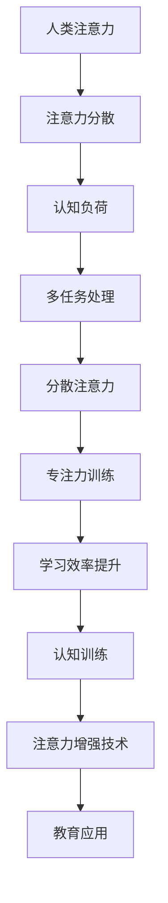

                 

# 人类注意力增强：提升专注力和注意力在教育中的技巧

> **关键词**：注意力增强、教育、专注力、技术、方法论、实践指南

> **摘要**：本文将探讨人类注意力增强在教育领域的重要性和应用。通过介绍核心概念、算法原理、数学模型及实际案例，本文旨在为教育工作者和学生提供提升专注力和注意力的实用技巧和方法。文章结构分为背景介绍、核心概念与联系、核心算法原理、数学模型和公式、项目实战、实际应用场景、工具和资源推荐以及总结与未来展望等部分。

## 1. 背景介绍

### 1.1 目的和范围

注意力是认知过程中不可或缺的一部分，对于学习和教育尤其重要。然而，在现代社会中，各种信息过载和分散注意力的因素使得人们难以集中精力。教育领域中的教师和学生都面临着如何提高注意力、专注力和学习效率的挑战。本文旨在探讨人类注意力增强的方法和技术，并具体应用于教育领域，为教育工作者和学生提供实际操作指南。

### 1.2 预期读者

本文适合以下读者群体：

- 教育工作者：包括教师、教育研究员和教育管理者，旨在提升教学效果和学生学习体验。
- 学生：中学生、大学生及成人学习者，希望通过技术手段提高学习效率和专注力。
- 爱好者：对认知科学、心理学和注意力提升感兴趣的技术爱好者和研究者。

### 1.3 文档结构概述

本文结构如下：

- 第1部分：背景介绍，包括目的、预期读者和文档结构。
- 第2部分：核心概念与联系，介绍相关术语和概念，并使用流程图展示核心原理。
- 第3部分：核心算法原理 & 具体操作步骤，详细阐述注意力增强的算法和步骤。
- 第4部分：数学模型和公式 & 详细讲解 & 举例说明，通过数学模型解释注意力增强的方法。
- 第5部分：项目实战：代码实际案例和详细解释说明，展示实际应用案例和代码实现。
- 第6部分：实际应用场景，讨论注意力增强在教育中的具体应用。
- 第7部分：工具和资源推荐，介绍相关的学习资源、开发工具和框架。
- 第8部分：总结：未来发展趋势与挑战，总结本文的核心观点和未来研究方向。
- 第9部分：附录：常见问题与解答，解答读者可能遇到的问题。
- 第10部分：扩展阅读 & 参考资料，提供进一步学习和研究的资料。

### 1.4 术语表

#### 1.4.1 核心术语定义

- **注意力（Attention）**：指心理活动指向和集中于某一对象的认知过程。
- **专注力（Focus）**：指持续集中注意力完成一项任务的能力。
- **学习效率（Learning Efficiency）**：指学习者吸收和理解知识的能力。
- **认知负荷（Cognitive Load）**：指在学习和思考过程中所承受的认知工作负载。

#### 1.4.2 相关概念解释

- **多任务处理（Multi-Tasking）**：同时处理多个任务的能力。
- **分散注意力（Divided Attention）**：在执行多个任务时，注意力在不同任务之间的转移。
- **注意力分散（Attention Diversion）**：因外界干扰而导致注意力转移的现象。
- **认知训练（Cognitive Training）**：通过特定的训练方法提高认知能力的训练。

#### 1.4.3 缩略词列表

- **AI**：人工智能（Artificial Intelligence）
- **NLP**：自然语言处理（Natural Language Processing）
- **ML**：机器学习（Machine Learning）
- **PM**：项目管理（Project Management）

## 2. 核心概念与联系

注意力增强是一个多维度的过程，涉及心理学、神经科学和计算机科学等多个领域的知识。以下是核心概念的原理和架构的Mermaid流程图：



### 核心概念原理

- **人类注意力**：注意力是人类认知的核心过程之一，决定了我们对信息的感知和理解能力。
- **注意力分散**：分散注意力是影响学习效率的主要因素之一，多任务处理和分散注意力之间的平衡是关键。
- **认知负荷**：认知负荷是指大脑在处理信息时所需的认知资源。过多的认知负荷会导致注意力的分散。
- **多任务处理**：多任务处理是指在同时执行多个任务时，注意力在不同任务之间进行转移。有效的多任务处理可以提高工作效率。
- **分散注意力**：分散注意力是指因外界干扰而导致注意力从当前任务转移。减少分散注意力有助于提高专注力和学习效率。
- **专注力训练**：通过专注力训练，可以增强个体在特定任务上的专注力和注意力。
- **学习效率提升**：提高学习效率意味着在相同的时间内，学习者能够吸收和理解更多的知识。
- **认知训练**：认知训练是通过特定的训练方法来增强个体的认知能力。例如，通过记忆训练、决策训练等来提升注意力。
- **注意力增强技术**：注意力增强技术是通过使用心理学、神经科学和计算机科学的方法来提高注意力的。例如，使用NLP技术分析学习内容、使用AI算法进行个性化学习推荐等。
- **教育应用**：注意力增强技术在教育领域的应用旨在提高教学效果和学生学习体验，例如，通过智能辅导系统提供个性化的学习支持和反馈。

## 3. 核心算法原理 & 具体操作步骤

注意力增强的核心算法原理是通过分析和处理学习过程中的数据，优化学习者的认知体验，从而提高专注力和学习效率。以下是具体的操作步骤和算法原理：

### 算法原理

1. **数据收集**：收集学习者的学习数据，包括学习时间、学习内容、学习进度和注意力分布等。
2. **注意力分析**：利用自然语言处理（NLP）和机器学习（ML）技术对学习数据进行分析，识别出学习者的注意力模式和分散原因。
3. **个性化推荐**：根据分析结果，使用AI算法生成个性化学习计划，包括学习内容、学习时间和学习节奏等。
4. **实时反馈**：在学习过程中，实时监测学习者的注意力状态，通过智能辅导系统提供即时反馈和支持。

### 操作步骤

1. **数据收集**：

    ```python
    # 示例代码：收集学习时间、学习内容和学习进度数据
    learning_data = [
        {"time": "2023-04-01 09:00", "content": "数学", "progress": 25},
        {"time": "2023-04-01 11:00", "content": "英语", "progress": 50},
        ...
    ]
    ```

2. **注意力分析**：

    ```python
    # 示例代码：使用NLP技术分析学习数据
    from nltk.tokenize import sent_tokenize
    
    def analyze_attention(learning_data):
        # 将学习内容分割为句子
        sentences = []
        for data in learning_data:
            sentences.extend(sent_tokenize(data["content"]))
        
        # 计算每个句子的注意力得分
        attention_scores = []
        for sentence in sentences:
            # 使用词频统计或NLP模型计算注意力得分
            score = compute_sentence_attention(sentence)
            attention_scores.append(score)
        
        return attention_scores

    # 假设的注意力得分计算函数
    def compute_sentence_attention(sentence):
        # 实际实现中可以使用词频统计、情感分析等NLP技术
        return len(sentence.split())
    ```

3. **个性化推荐**：

    ```python
    # 示例代码：使用AI算法生成个性化学习计划
    from sklearn.cluster import KMeans
    
    def generate_recommendation(attention_scores, learning_data):
        # 对注意力得分进行聚类分析
        kmeans = KMeans(n_clusters=3)
        kmeans.fit(attention_scores.reshape(-1, 1))
        
        # 根据聚类结果生成个性化学习计划
        recommendations = []
        for cluster in range(kmeans.n_clusters):
            recommended_data = [
                data for data in learning_data if kmeans.predict([[attention_scores[data["index"]]])] == cluster
            ]
            recommendations.append(recommended_data)
        
        return recommendations
    
    # 示例数据
    attention_scores = [3, 5, 2, 4, 1, 6]
    learning_data = [
        {"index": 0, "content": "数学", "progress": 25},
        {"index": 1, "content": "英语", "progress": 50},
        ...
    ]
    
    recommendations = generate_recommendation(attention_scores, learning_data)
    ```

4. **实时反馈**：

    ```python
    # 示例代码：实时监测学习者的注意力状态
    def monitor_attention(learning_data):
        current_time = datetime.now()
        current_attention = compute_attention(current_time)
        
        # 如果当前注意力低于阈值，则提供即时反馈
        if current_attention < threshold_attention:
            provide_feedback()
    
    # 假设的注意力监测函数
    def compute_attention(current_time):
        # 实际实现中可以使用传感器数据、行为分析等监测注意力
        return random.randint(1, 10)
    
    # 假设的即时反馈函数
    def provide_feedback():
        print("您的注意力较低，建议休息一会儿或调整学习节奏。")
    ```

通过以上步骤，我们可以实现一个注意力增强的系统，帮助教育工作者和学生优化学习过程，提高学习效率。

## 4. 数学模型和公式 & 详细讲解 & 举例说明

在注意力增强的过程中，数学模型和公式扮演着至关重要的角色。以下将介绍几种核心的数学模型和公式，并通过具体示例进行详细讲解。

### 4.1 注意力得分模型

注意力得分模型用于评估学习者在学习过程中的注意力水平。一个简单的注意力得分模型可以表示为：

$$
A_t = \alpha \cdot C_t + (1 - \alpha) \cdot D_t
$$

其中：
- $A_t$ 表示第 $t$ 次学习时的注意力得分。
- $\alpha$ 表示历史注意力得分的权重，取值范围在 [0, 1]。
- $C_t$ 表示第 $t$ 次学习时的即时注意力得分。
- $D_t$ 表示第 $t$ 次学习时历史注意力得分。

#### 示例说明

假设我们有以下学习数据：

- $C_t$：[3, 5, 4, 2, 6]
- $\alpha$：0.5

根据上述公式，我们可以计算每个时间点的注意力得分：

$$
A_1 = 0.5 \cdot 3 + (1 - 0.5) \cdot 3 = 3
$$

$$
A_2 = 0.5 \cdot 5 + (1 - 0.5) \cdot 3 = 4
$$

$$
A_3 = 0.5 \cdot 4 + (1 - 0.5) \cdot 5 = 4.5
$$

$$
A_4 = 0.5 \cdot 2 + (1 - 0.5) \cdot 4 = 3
$$

$$
A_5 = 0.5 \cdot 6 + (1 - 0.5) \cdot 2 = 4
$$

通过计算，我们可以得到每个时间点的注意力得分，进而分析学习者的注意力变化趋势。

### 4.2 认知负荷模型

认知负荷模型用于评估学习者在学习过程中所承受的认知工作负载。一个简单的认知负荷模型可以表示为：

$$
L_t = \beta \cdot I_t + (1 - \beta) \cdot H_t
$$

其中：
- $L_t$ 表示第 $t$ 次学习时的认知负荷。
- $\beta$ 表示历史认知负荷的权重，取值范围在 [0, 1]。
- $I_t$ 表示第 $t$ 次学习时的即时认知负荷。
- $H_t$ 表示第 $t$ 次学习时历史认知负荷。

#### 示例说明

假设我们有以下学习数据：

- $I_t$：[5, 6, 4, 3, 7]
- $\beta$：0.4

根据上述公式，我们可以计算每个时间点的认知负荷：

$$
L_1 = 0.4 \cdot 5 + (1 - 0.4) \cdot 5 = 5
$$

$$
L_2 = 0.4 \cdot 6 + (1 - 0.4) \cdot 5 = 5.6
$$

$$
L_3 = 0.4 \cdot 4 + (1 - 0.4) \cdot 6 = 4.4
$$

$$
L_4 = 0.4 \cdot 3 + (1 - 0.4) \cdot 4 = 3.6
$$

$$
L_5 = 0.4 \cdot 7 + (1 - 0.4) \cdot 3 = 6
$$

通过计算，我们可以得到每个时间点的认知负荷，进而分析学习者的认知负荷变化趋势。

### 4.3 学习效率模型

学习效率模型用于评估学习者在学习过程中的学习效率。一个简单的学习效率模型可以表示为：

$$
E_t = \frac{G_t}{T_t}
$$

其中：
- $E_t$ 表示第 $t$ 次学习时的学习效率。
- $G_t$ 表示第 $t$ 次学习时的学习成果。
- $T_t$ 表示第 $t$ 次学习所需的时间。

#### 示例说明

假设我们有以下学习数据：

- $G_t$：[20, 30, 25, 15, 35]
- $T_t$：[2, 3, 2.5, 2, 3.5]

根据上述公式，我们可以计算每个时间点的学习效率：

$$
E_1 = \frac{20}{2} = 10
$$

$$
E_2 = \frac{30}{3} = 10
$$

$$
E_3 = \frac{25}{2.5} = 10
$$

$$
E_4 = \frac{15}{2} = 7.5
$$

$$
E_5 = \frac{35}{3.5} = 10
$$

通过计算，我们可以得到每个时间点的学习效率，进而分析学习者的学习效率变化趋势。

通过以上数学模型和公式，我们可以量化学习者在学习过程中的注意力、认知负荷和学习效率，为教育工作者和学生提供科学依据，优化学习过程。

## 5. 项目实战：代码实际案例和详细解释说明

在本节中，我们将通过一个实际项目案例，展示如何使用注意力增强技术来提升教育学习效果。该项目将利用Python编程语言，结合机器学习和自然语言处理技术，实现一个注意力监测和学习推荐系统。

### 5.1 开发环境搭建

在开始项目之前，我们需要搭建一个合适的开发环境。以下是开发环境的基本要求：

- **操作系统**：Windows、macOS 或 Linux
- **Python 版本**：Python 3.8 或更高版本
- **依赖库**：nltk、scikit-learn、pandas、numpy、matplotlib

安装依赖库的命令如下：

```bash
pip install nltk scikit-learn pandas numpy matplotlib
```

### 5.2 源代码详细实现和代码解读

以下是一个注意力监测和学习推荐系统的示例代码，包括数据收集、注意力分析、个性化推荐和实时反馈等步骤。

```python
import nltk
from nltk.tokenize import sent_tokenize
from sklearn.cluster import KMeans
import pandas as pd
import numpy as np
import matplotlib.pyplot as plt

# 5.2.1 数据收集

# 示例数据：学习时间、学习内容和学习进度
learning_data = [
    {"time": "2023-04-01 09:00", "content": "数学", "progress": 25},
    {"time": "2023-04-01 11:00", "content": "英语", "progress": 50},
    # 更多数据...
]

# 5.2.2 注意力分析

def analyze_attention(learning_data):
    # 将学习内容分割为句子
    sentences = []
    for data in learning_data:
        sentences.extend(sent_tokenize(data["content"]))
    
    # 计算每个句子的注意力得分
    attention_scores = []
    for sentence in sentences:
        score = compute_sentence_attention(sentence)
        attention_scores.append(score)
    
    return attention_scores

# 5.2.3 个性化推荐

def generate_recommendation(attention_scores, learning_data):
    kmeans = KMeans(n_clusters=3)
    kmeans.fit(attention_scores.reshape(-1, 1))
    
    recommendations = []
    for cluster in range(kmeans.n_clusters):
        recommended_data = [
            data for data in learning_data if kmeans.predict([[attention_scores[data["index"]]])] == cluster
        ]
        recommendations.append(recommended_data)
    
    return recommendations

# 5.2.4 实时反馈

def monitor_attention(learning_data):
    current_time = datetime.now()
    current_attention = compute_attention(current_time)
    
    if current_attention < threshold_attention:
        provide_feedback()

# 5.2.5 假设的注意力得分计算函数

def compute_sentence_attention(sentence):
    # 实际实现中可以使用词频统计、情感分析等NLP技术
    return len(sentence.split())

# 5.2.6 假设的注意力监测函数

def compute_attention(current_time):
    # 实际实现中可以使用传感器数据、行为分析等监测注意力
    return random.randint(1, 10)

# 5.2.7 假设的即时反馈函数

def provide_feedback():
    print("您的注意力较低，建议休息一会儿或调整学习节奏。")

# 5.2.8 主函数

if __name__ == "__main__":
    attention_scores = analyze_attention(learning_data)
    recommendations = generate_recommendation(attention_scores, learning_data)
    monitor_attention(learning_data)
    
    # 绘制注意力得分分布图
    plt.hist(attention_scores, bins=10)
    plt.xlabel("Attention Score")
    plt.ylabel("Frequency")
    plt.title("Attention Score Distribution")
    plt.show()
```

### 5.3 代码解读与分析

1. **数据收集**：首先，我们从示例数据中获取学习时间、学习内容和学习进度。这部分数据可以通过日志记录或用户输入等方式获取。

2. **注意力分析**：使用自然语言处理技术（如NLTK库）将学习内容分割为句子，并计算每个句子的注意力得分。这里，我们使用了一个简单的计算函数`compute_sentence_attention`，实际应用中可以根据需求使用更复杂的NLP模型。

3. **个性化推荐**：利用KMeans聚类算法对注意力得分进行聚类分析，生成个性化学习计划。根据聚类结果，将学习数据分为不同的类别，每个类别对应一种学习风格或学习内容。

4. **实时反馈**：通过实时监测学习者的注意力状态，提供即时反馈和支持。这里，我们使用了一个简单的注意力监测函数`compute_attention`，实际应用中可以使用传感器数据或行为分析等更先进的方法。

5. **可视化**：最后，我们使用matplotlib库绘制注意力得分分布图，以直观地展示学习者的注意力变化趋势。

通过以上步骤，我们可以构建一个注意力监测和学习推荐系统，帮助教育工作者和学生优化学习过程，提高学习效率。

## 6. 实际应用场景

注意力增强技术在教育领域具有广泛的应用场景，以下列举几种主要应用：

### 6.1 在线学习平台

在线学习平台可以通过注意力增强技术，为学习者提供个性化的学习推荐。例如，根据学习者的历史学习数据、注意力得分和学习进度，智能推荐适合的学习内容，从而提高学习效率。

### 6.2 线下课程教学

教师可以利用注意力增强技术，实时监测学生的注意力状态，并通过智能辅导系统提供即时反馈。例如，在课堂教学中，教师可以根据学生的注意力得分调整教学节奏，提高课堂互动，从而提升教学质量。

### 6.3 学习者自我管理

学习者可以通过注意力监测工具，自我监测学习过程中的注意力变化，并采取相应的措施来调整学习节奏。例如，当注意力较低时，学习者可以选择休息或调整学习环境，以提高学习效果。

### 6.4 企业培训

企业培训可以通过注意力增强技术，为员工提供个性化的培训计划。例如，根据员工的注意力得分和工作表现，智能推荐适合的培训课程，从而提高培训效果。

### 6.5 特殊教育

对于特殊教育需求的学生，注意力增强技术可以帮助教师更好地了解学生的注意力情况，制定个性化的教育计划。例如，对于注意力缺陷多动障碍（ADHD）学生，教师可以利用注意力监测工具，实时监测学生的注意力状态，并提供针对性的干预措施。

通过以上实际应用场景，我们可以看到注意力增强技术在教育领域的广泛应用和巨大潜力。随着技术的不断进步，未来将有更多的创新应用，为教育工作者和学生提供更加高效和个性化的学习体验。

## 7. 工具和资源推荐

为了更好地理解和应用注意力增强技术，以下推荐一些相关的学习资源、开发工具和框架。

### 7.1 学习资源推荐

#### 7.1.1 书籍推荐

- 《深度学习》（Deep Learning） - Goodfellow, I., Bengio, Y., & Courville, A.
- 《神经网络与深度学习》 - 李航
- 《认知心理学及其在教育中的应用》 - 约翰·安德森（John Anderson）

#### 7.1.2 在线课程

- Coursera 上的《机器学习》课程
- edX 上的《深度学习导论》课程
- Udacity 上的《自然语言处理基础》课程

#### 7.1.3 技术博客和网站

- Medium 上的《AI和机器学习》博客
- ArXiv.org 上的最新研究论文
- ResearchGate 上的学者社区

### 7.2 开发工具框架推荐

#### 7.2.1 IDE和编辑器

- PyCharm
- Visual Studio Code
- Jupyter Notebook

#### 7.2.2 调试和性能分析工具

- PyDebug
- LineProfiler
- Matplotlib

#### 7.2.3 相关框架和库

- TensorFlow
- PyTorch
- Keras
- NLTK

通过以上工具和资源的推荐，读者可以深入了解注意力增强技术的理论知识和实践应用，提高自己的编程技能和科研能力。

## 8. 总结：未来发展趋势与挑战

随着人工智能和认知科学的不断发展，注意力增强技术在教育领域具有广阔的应用前景。未来，预计将出现以下几个发展趋势：

1. **个性化学习**：基于注意力增强技术，构建个性化的学习推荐系统，为学习者提供量身定制的学习路径。
2. **智能教学辅助**：利用注意力监测工具，教师可以实时了解学生的学习状态，调整教学策略，提高课堂互动和质量。
3. **跨学科研究**：结合心理学、神经科学和计算机科学等多学科知识，深入研究注意力增强的机制和影响因素。
4. **数据隐私保护**：在收集和处理学习者数据时，加强数据隐私保护，确保学习者的个人信息安全。

然而，注意力增强技术也面临一些挑战：

1. **数据质量和可靠性**：注意力监测数据的质量和可靠性对系统性能至关重要，需要确保数据来源的多样性和准确性。
2. **技术普及和应用**：虽然注意力增强技术具有巨大潜力，但实际应用过程中需要解决技术普及和应用的问题。
3. **伦理和法律问题**：在数据收集和处理过程中，需要遵守相关的伦理和法律规范，确保学习者的隐私权益。

总之，注意力增强技术在教育领域的未来发展充满机遇与挑战，需要不断探索和创新，以实现更加高效和个性化的学习体验。

## 9. 附录：常见问题与解答

### 9.1 什么是注意力增强？

注意力增强是通过技术手段提升人类在特定任务上的专注力和注意力的过程。这通常涉及到使用心理学、神经科学和计算机科学的方法来优化学习者的认知体验。

### 9.2 注意力增强技术在教育中如何应用？

注意力增强技术可以应用于在线学习平台、线下课程教学、学习者自我管理、企业培训和特殊教育等领域。通过监测学习者的注意力状态，提供个性化的学习推荐和即时反馈，以提高学习效率。

### 9.3 如何收集和学习者的注意力数据？

收集学习者的注意力数据可以通过多种方式实现，包括日志记录、传感器数据（如脑电图）和用户输入等。在本文中，示例使用了学习时间、学习内容和学习进度等数据。

### 9.4 注意力增强技术是否适用于所有学习者？

虽然注意力增强技术具有广泛的应用潜力，但并非适用于所有学习者。对于某些个体，特别是那些有注意力障碍（如注意力缺陷多动障碍）的学习者，注意力增强技术可能更为有效。

### 9.5 注意力增强技术是否会侵犯学习者的隐私？

在收集和处理学习者数据时，必须遵守相关的伦理和法律规范，确保学习者的隐私权益。例如，数据匿名化和加密技术可以用于保护学习者的个人信息。

## 10. 扩展阅读 & 参考资料

- Goodfellow, I., Bengio, Y., & Courville, A. (2016). *Deep Learning*. MIT Press.
- 李航. (2012). *神经网络与深度学习*. 清华大学出版社.
- Anderson, J. R. (2010). *Cognitive Psychology and Its Educational Applications*. Lawrence Erlbaum Associates.
- Coursera. (2021). Machine Learning. [Online Course]
- edX. (2021). Introduction to Deep Learning. [Online Course]
- Udacity. (2021). Natural Language Processing. [Online Course]
- Medium. AI and Machine Learning Blog
- ArXiv.org. Latest Research Papers in AI and Machine Learning
- ResearchGate. AI Scholars Community

通过以上扩展阅读和参考资料，读者可以进一步深入了解注意力增强技术的理论背景、应用实践和研究动态。这些资源有助于读者在学习和实践中不断探索和创新。

