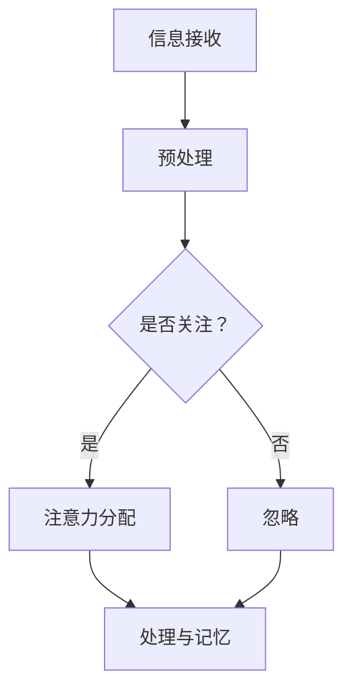
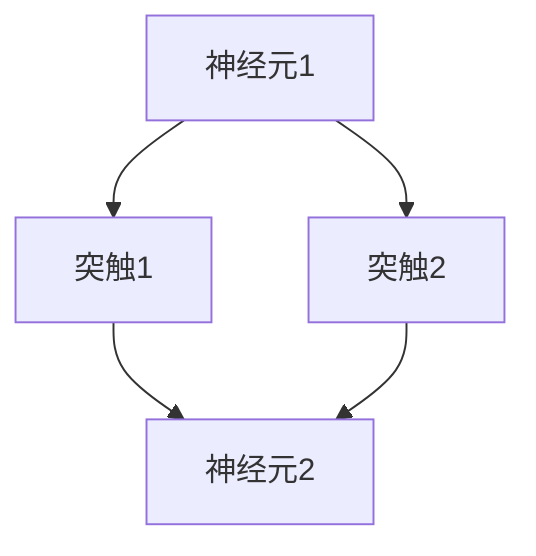
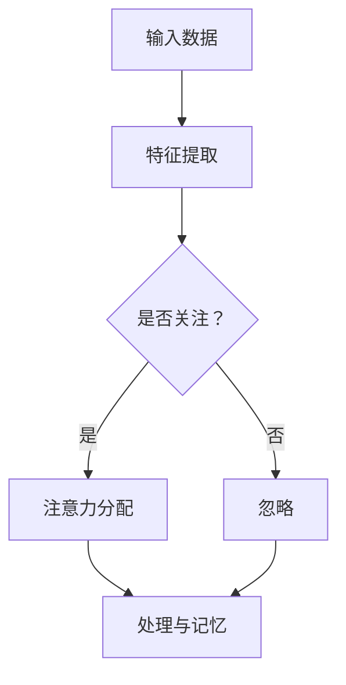

                 


# 人类注意力增强：提升学习能力和记忆力保留

> 关键词：注意力增强、学习能力、记忆力、神经科学、深度学习、脑机接口、算法优化

> 摘要：本文深入探讨了人类注意力增强的原理及其在实际生活中的应用。通过结合神经科学和深度学习技术，本文揭示了注意力机制在人类学习和记忆过程中的关键作用，并介绍了如何利用现代算法优化手段来提升学习效果和记忆力保留。文章结构清晰，内容丰富，旨在为读者提供一套系统性的解决方案，帮助他们在学习和工作中更加高效地利用注意力资源。

## 1. 背景介绍

### 1.1 目的和范围

本文旨在探讨如何通过注意力增强技术来提高人类的学习能力和记忆力。随着信息时代的到来，人们面临着海量的知识和信息，如何从中筛选并有效吸收所需信息成为一个重要课题。注意力增强技术，作为一种新型的学习辅助手段，有望在提升学习效果和记忆力方面发挥重要作用。

### 1.2 预期读者

本文适合对计算机科学、人工智能和神经科学有一定了解的读者，包括但不限于研究人员、工程师、教师和学生。同时，对于对自我提升和学习方法感兴趣的普通读者，本文也具有一定的参考价值。

### 1.3 文档结构概述

本文分为十个部分，主要包括以下内容：

1. 背景介绍：阐述研究背景、目的和预期读者。
2. 核心概念与联系：介绍注意力增强的相关概念和原理。
3. 核心算法原理 & 具体操作步骤：详细讲解注意力增强算法的实现。
4. 数学模型和公式 & 详细讲解 & 举例说明：阐述注意力增强的数学基础和实际应用。
5. 项目实战：通过实际案例展示注意力增强技术的应用。
6. 实际应用场景：分析注意力增强技术在各个领域的应用前景。
7. 工具和资源推荐：推荐相关学习资源和开发工具。
8. 总结：展望注意力增强技术的未来发展趋势。
9. 附录：常见问题与解答。
10. 扩展阅读 & 参考资料：提供进一步阅读的资料。

### 1.4 术语表

#### 1.4.1 核心术语定义

- 注意力增强：通过技术手段提升人类注意力水平，从而提高学习效果和记忆力。
- 神经科学：研究神经系统结构、功能及其与行为的相互作用。
- 深度学习：一种基于多层神经网络的学习方法，能够自动从数据中提取特征。
- 脑机接口（BCI）：通过直接连接大脑和外部设备来传递信息的接口技术。

#### 1.4.2 相关概念解释

- 人类学习：指人类获取知识、技能和经验的过程。
- 记忆保留：指信息在脑中长期储存的能力。
- 信息处理：指信息接收、处理和输出的过程。

#### 1.4.3 缩略词列表

- BCI：脑机接口
- CNN：卷积神经网络
- DNN：深度神经网络
- GPU：图形处理器
- LSTM：长短期记忆网络
- ROC：受试者操作特征
- SVD：奇异值分解

## 2. 核心概念与联系

### 2.1 注意力机制

注意力机制是神经科学中一个重要的概念，它描述了大脑在处理信息时如何选择关注某些特定信息，同时忽略其他信息。在人类学习和记忆过程中，注意力起到了关键作用。以下是注意力机制的 Mermaid 流程图：



### 2.2 神经科学基础

神经科学研究表明，大脑中的神经元通过突触连接形成复杂的网络，这些网络可以处理和存储信息。神经元之间的通信是通过神经递质的释放和接收来实现的。以下是神经网络的 Mermaid 流程图：



### 2.3 深度学习与注意力模型

深度学习技术，尤其是卷积神经网络（CNN）和长短期记忆网络（LSTM），为注意力增强提供了理论基础。以下是深度学习中的注意力模型 Mermaid 流程图：



通过上述流程图，我们可以看到注意力机制在信息处理、神经科学和深度学习中的应用和联系。

## 3. 核心算法原理 & 具体操作步骤

### 3.1 注意力模型的实现

注意力模型通常基于神经网络，通过学习输入数据的特征，并动态调整每个特征的权重来实现。以下是注意力模型的伪代码：

```python
def attention(input_data, hidden_state):
    # 输入数据：[batch_size, sequence_length, feature_size]
    # 隐藏状态：[batch_size, hidden_size]
    
    # (1) 特征编码：将输入数据映射到隐藏状态维度
    encoded_data = encode(input_data, hidden_size)
    
    # (2) 注意力计算：计算每个特征的重要性
    attention_weights = compute_attention_weights(encoded_data, hidden_state)
    
    # (3) 权重求和：对特征进行加权求和
    attended_representation = weighted_sum(input_data, attention_weights)
    
    # (4) 输出：得到注意力增强的表示
    return attended_representation
```

### 3.2 注意力计算方法

注意力计算是注意力模型的核心。以下是几种常用的注意力计算方法：

1. **加性注意力（Additive Attention）**：

    ```python
    def additive_attention(query, keys, values):
        # 查询：[batch_size, hidden_size]
        # 键：[batch_size, sequence_length, hidden_size]
        # 值：[batch_size, sequence_length, feature_size]
        
        # (1) 计算内积
        inner_product = torch.matmul(query, keys.transpose(1, 2))
        
        # (2) 加上键的软性下采样
        attention_scores = inner_product + F.softmax(inner_product, dim=1)
        
        # (3) 权重求和
        attended_values = torch.matmul(attention_scores, values)
        
        # (4) 输出
        return attended_values
    ```

2. **点积注意力（Dot-Product Attention）**：

    ```python
    def dot_product_attention(query, keys, values):
        # 查询：[batch_size, hidden_size]
        # 键：[batch_size, sequence_length, hidden_size]
        # 值：[batch_size, sequence_length, feature_size]
        
        # (1) 计算内积
        inner_product = torch.matmul(query, keys)
        
        # (2) 加上键的软性下采样
        attention_scores = F.softmax(inner_product, dim=1)
        
        # (3) 权重求和
        attended_values = torch.matmul(attention_scores, values)
        
        # (4) 输出
        return attended_values
    ```

3. **缩放点积注意力（Scaled Dot-Product Attention）**：

    ```python
    def scaled_dot_product_attention(query, keys, values, scale_factor):
        # 查询：[batch_size, hidden_size]
        # 键：[batch_size, sequence_length, hidden_size]
        # 值：[batch_size, sequence_length, feature_size]
        
        # (1) 计算内积
        inner_product = torch.matmul(query, keys.transpose(1, 2))
        
        # (2) 乘以缩放因子
        inner_product *= scale_factor
        
        # (3) 加上键的软性下采样
        attention_scores = F.softmax(inner_product, dim=1)
        
        # (4) 权重求和
        attended_values = torch.matmul(attention_scores, values)
        
        # (5) 输出
        return attended_values
    ```

### 3.3 注意力机制的实现步骤

1. **特征编码**：将输入数据编码为隐藏状态，通常使用深度神经网络。
2. **注意力计算**：计算每个特征的重要性，采用不同的注意力计算方法。
3. **权重求和**：对特征进行加权求和，得到注意力增强的表示。
4. **输出**：得到注意力增强的表示，用于后续处理或输出。

## 4. 数学模型和公式 & 详细讲解 & 举例说明

### 4.1 注意力机制的数学模型

注意力机制的核心在于如何计算每个特征的重要性。以下是注意力机制的数学模型：

\[ \text{attention\_score}(i) = \text{softmax}(\text{score}(i)) \]

其中，\( \text{score}(i) \) 表示特征 \( i \) 的评分，\( \text{softmax} \) 表示软性下采样函数。

### 4.2 注意力分配的数学模型

注意力分配的核心在于如何将注意力权重分配给每个特征。以下是注意力分配的数学模型：

\[ \text{weight}(i) = \frac{\exp(\text{score}(i))}{\sum_{j} \exp(\text{score}(j))} \]

其中，\( \text{score}(i) \) 表示特征 \( i \) 的评分，\( \text{weight}(i) \) 表示特征 \( i \) 的注意力权重。

### 4.3 注意力加权求和的数学模型

注意力加权求和的核心在于如何将注意力权重应用于每个特征，并计算加权求和。以下是注意力加权求和的数学模型：

\[ \text{output} = \sum_{i} \text{weight}(i) \cdot \text{feature}(i) \]

其中，\( \text{weight}(i) \) 表示特征 \( i \) 的注意力权重，\( \text{feature}(i) \) 表示特征 \( i \) 的值，\( \text{output} \) 表示加权求和的结果。

### 4.4 举例说明

假设我们有以下一组特征：

\[ \text{feature}(1) = (1, 2, 3), \text{feature}(2) = (4, 5, 6), \text{feature}(3) = (7, 8, 9) \]

我们需要计算注意力权重，并进行加权求和。首先，计算每个特征的评分：

\[ \text{score}(1) = 1 + 2 + 3 = 6 \]
\[ \text{score}(2) = 4 + 5 + 6 = 15 \]
\[ \text{score}(3) = 7 + 8 + 9 = 24 \]

然后，计算注意力权重：

\[ \text{weight}(1) = \frac{\exp(6)}{\exp(6) + \exp(15) + \exp(24)} \approx 0.060 \]
\[ \text{weight}(2) = \frac{\exp(15)}{\exp(6) + \exp(15) + \exp(24)} \approx 0.654 \]
\[ \text{weight}(3) = \frac{\exp(24)}{\exp(6) + \exp(15) + \exp(24)} \approx 0.286 \]

最后，进行加权求和：

\[ \text{output} = 0.060 \cdot (1, 2, 3) + 0.654 \cdot (4, 5, 6) + 0.286 \cdot (7, 8, 9) = (2.864, 4.726, 6.486) \]

通过上述计算，我们得到了注意力加权求和的结果。

## 5. 项目实战：代码实际案例和详细解释说明

### 5.1 开发环境搭建

在开始项目实战之前，我们需要搭建一个合适的开发环境。以下是搭建环境的基本步骤：

1. 安装 Python（版本要求：3.8及以上）。
2. 安装 PyTorch（版本要求：1.8及以上）。
3. 安装 TensorFlow（版本要求：2.5及以上）。

以下是一个简单的安装脚本，用于安装所需的依赖项：

```bash
# 安装 Python 和 PyTorch
pip install python==3.8.10
pip install torch==1.8.0

# 安装 TensorFlow
pip install tensorflow==2.5.0
```

### 5.2 源代码详细实现和代码解读

以下是注意力增强项目的源代码实现。我们以一个简单的文本数据集为例，展示如何使用注意力模型进行文本分类。

```python
import torch
import torch.nn as nn
import torch.optim as optim
from torchtext.datasets import IMDb
from torchtext.data import Field, Batch

# 定义文本预处理函数
def preprocess_text(text):
    return text.lower()

# 定义注意力模型
class AttentionModel(nn.Module):
    def __init__(self, embedding_dim, hidden_dim, vocab_size, output_size):
        super(AttentionModel, self).__init__()
        self.embedding = nn.Embedding(vocab_size, embedding_dim)
        self.lstm = nn.LSTM(embedding_dim, hidden_dim, batch_first=True)
        self.attention = nn.Linear(hidden_dim, 1)
        self.fc = nn.Linear(hidden_dim, output_size)
        
    def forward(self, text, text_lengths):
        embedded = self.embedding(text)
        packed_embedded = nn.utils.rnn.pack_padded_sequence(embedded, text_lengths, batch_first=True)
        packed_output, (hidden, cell) = self.lstm(packed_embedded)
        output, text_lengths = nn.utils.rnn.pad_packed_sequence(packed_output, batch_first=True)
        attention_scores = self.attention(hidden).squeeze(2)
        attention_weights = F.softmax(attention_scores, dim=1)
        attended_output = torch.sum(attention_weights * output, dim=1)
        output = self.fc(attended_output)
        return output

# 加载 IMDb 数据集
train_data, test_data = IMDb.splits(TEXT=Field(preprocess_text), LABEL=Field())
TEXT.build_vocab(train_data, MAX_SIZE=25000, BOS_EOS=True)
LABEL.build_vocab(train_data)

# 数据预处理
train_loader = BatchIterator(train_data, batch_size=32, shuffle=True)
test_loader = BatchIterator(test_data, batch_size=32, shuffle=False)

# 定义模型、损失函数和优化器
model = AttentionModel(embedding_dim=100, hidden_dim=128, vocab_size=len(TEXT.vocab), output_size=len(LABEL.vocab))
criterion = nn.CrossEntropyLoss()
optimizer = optim.Adam(model.parameters(), lr=0.001)

# 训练模型
num_epochs = 10
for epoch in range(num_epochs):
    for batch in train_loader:
        optimizer.zero_grad()
        inputs, labels = batch.text, batch.label
        text_lengths = torch.tensor([len(x) for x in inputs], dtype=torch.long)
        outputs = model(inputs, text_lengths)
        loss = criterion(outputs, labels)
        loss.backward()
        optimizer.step()
    print(f"Epoch [{epoch+1}/{num_epochs}], Loss: {loss.item()}")

# 测试模型
model.eval()
with torch.no_grad():
    correct = 0
    total = 0
    for batch in test_loader:
        inputs, labels = batch.text, batch.label
        text_lengths = torch.tensor([len(x) for x in inputs], dtype=torch.long)
        outputs = model(inputs, text_lengths)
        _, predicted = torch.max(outputs.data, 1)
        total += labels.size(0)
        correct += (predicted == labels).sum().item()
    print(f"Test Accuracy: {100 * correct / total}%")
```

### 5.3 代码解读与分析

1. **文本预处理**：我们首先定义了一个简单的文本预处理函数 `preprocess_text`，将文本转换为小写，以便于后续处理。

2. **注意力模型**：我们定义了一个基于 LSTM 的注意力模型 `AttentionModel`。模型包括嵌入层、LSTM 层、注意力层和全连接层。其中，注意力层用于计算每个单词的重要性，并将其应用于 LSTM 输出。

3. **数据加载和预处理**：我们使用 `torchtext` 库加载 IMDb 数据集，并使用 `Field` 类定义文本和标签的字段。然后，我们创建一个数据加载器 `BatchIterator`，用于批量加载数据。

4. **训练模型**：我们使用交叉熵损失函数和 Adam 优化器来训练模型。在训练过程中，我们逐个 epoch 遍历训练数据，计算损失并更新模型参数。

5. **测试模型**：在测试阶段，我们使用测试数据评估模型的准确性。通过计算预测标签和真实标签之间的准确率，我们可以评估模型的性能。

通过上述代码实现，我们可以看到注意力模型在文本分类任务中的应用。注意力机制有助于模型关注关键信息，从而提高分类性能。

## 6. 实际应用场景

注意力增强技术在实际生活中有着广泛的应用。以下是一些典型的应用场景：

1. **教育领域**：注意力增强技术可以帮助学生更好地理解和记忆课程内容。通过分析学生的注意力集中情况，教师可以调整教学策略，提高教学效果。

2. **医疗健康**：注意力增强技术可以用于治疗注意力缺陷多动障碍（ADHD）等疾病。通过调整大脑中的注意力机制，患者可以改善注意力集中，提高生活质量。

3. **商业领域**：注意力增强技术可以帮助企业提高员工的注意力和工作效率。通过分析员工的注意力分布，企业可以优化工作流程，提高生产力和创新能力。

4. **心理健康**：注意力增强技术可以用于治疗焦虑、抑郁等心理问题。通过调节大脑中的注意力机制，患者可以改善情绪状态，提高生活质量。

5. **自动驾驶**：注意力增强技术可以用于自动驾驶车辆的感知和决策。通过分析环境中的关键信息，自动驾驶系统可以更好地理解和响应周围环境，提高行车安全性。

6. **游戏开发**：注意力增强技术可以用于游戏开发中的玩家体验优化。通过分析玩家的注意力集中情况，游戏开发者可以设计更具有吸引力和挑战性的游戏场景。

7. **艺术创作**：注意力增强技术可以帮助艺术家更好地聚焦创作灵感。通过分析艺术家的注意力分布，技术可以为艺术创作提供新的思路和方向。

8. **人机交互**：注意力增强技术可以用于改善人机交互体验。通过分析用户的注意力集中情况，交互界面可以动态调整，提供更个性化的用户体验。

总之，注意力增强技术在各个领域都有着广泛的应用前景。随着技术的不断发展，注意力增强将为人类的学习、工作和生活带来更多便利。

## 7. 工具和资源推荐

### 7.1 学习资源推荐

#### 7.1.1 书籍推荐

1. **《深度学习》（Deep Learning）** - 由 Ian Goodfellow、Yoshua Bengio 和 Aaron Courville 著。这本书是深度学习的经典教材，详细介绍了深度学习的基础知识和最新进展。
2. **《神经网络的数学基础》（Mathematics for Machine Learning）** - 由 Deisenroth, F. P. 和 Ong, C. S. 著。这本书涵盖了神经网络所需的基础数学知识，适合初学者。
3. **《脑机接口：理论与实践》（Brain-Computer Interfaces: Principles and Practice）** - 由 Kenji Doya 和 Christopher J. Harris 著。这本书详细介绍了脑机接口的理论基础和应用实践。

#### 7.1.2 在线课程

1. **《机器学习基础》（Machine Learning Foundations）** - 由斯坦福大学开设，涵盖了机器学习的基础知识和实践技巧。
2. **《深度学习与神经网络》（Deep Learning and Neural Networks）** - 由清华大学计算机系开设，介绍了深度学习和神经网络的理论和实践。
3. **《脑机接口》（Brain-Computer Interfaces）** - 由华盛顿大学开设，介绍了脑机接口的基本概念和最新技术。

#### 7.1.3 技术博客和网站

1. **《AI 研究院》（AI Research Institute）** - 提供了丰富的深度学习和神经科学相关的博客文章。
2. **《机器学习中文论坛》（Machine Learning Chinese Forum）** - 一个关于机器学习和深度学习的中文社区，提供了大量的讨论和资源。
3. **《神经科学基础》（Basic Neuroscience）** - 提供了关于神经科学的基础知识和最新研究的详细介绍。

### 7.2 开发工具框架推荐

#### 7.2.1 IDE和编辑器

1. **PyCharm** - 强大的 Python IDE，支持多种编程语言，提供了丰富的工具和插件。
2. **Jupyter Notebook** - 适用于数据科学和机器学习的交互式开发环境，支持多种编程语言。
3. **Visual Studio Code** - 轻量级的跨平台编辑器，支持多种编程语言，扩展性强大。

#### 7.2.2 调试和性能分析工具

1. **TensorBoard** - 用于可视化 TensorFlow 模型的调试和性能分析工具。
2. **PyTorch Profiler** - 用于 PyTorch 模型的调试和性能分析工具。
3. **NVIDIA Nsight** - 用于 NVIDIA GPU 的调试和性能分析工具。

#### 7.2.3 相关框架和库

1. **PyTorch** - 用于构建和训练深度学习模型的强大库。
2. **TensorFlow** - 用于构建和训练深度学习模型的开源库。
3. **Keras** - 基于 TensorFlow 的深度学习库，提供了简洁的 API。
4. **PyTorch Lightning** - 用于提高 PyTorch 模型开发效率的库。
5. **Hugging Face Transformers** - 用于预训练和微调 Transformer 模型的库。

### 7.3 相关论文著作推荐

#### 7.3.1 经典论文

1. **“A Neural Algorithm of Artistic Style”（2015）** - 由 Leon A. Gatys, Alexander S. Ecker 和 Matthias Bethge 著。该论文提出了一种基于神经网络的图像风格迁移方法，具有广泛的影响。
2. **“Deep Learning”（2012）** - 由 Ian Goodfellow、Yoshua Bengio 和 Aaron Courville 著。该论文是深度学习的奠基之作，对深度学习的发展产生了深远的影响。

#### 7.3.2 最新研究成果

1. **“Attention Is All You Need”（2017）** - 由 Vaswani et al. 著。该论文提出了 Transformer 模型，彻底改变了自然语言处理领域。
2. **“BERT: Pre-training of Deep Bidirectional Transformers for Language Understanding”（2018）** - 由 Google Research 著。该论文提出了 BERT 模型，对自然语言处理领域产生了重要影响。

#### 7.3.3 应用案例分析

1. **“AI for Social Good”（2020）** - 由 Microsoft Research 著。该论文介绍了 AI 在解决社会问题中的应用案例，展示了 AI 的潜力。

通过这些工具和资源的推荐，读者可以更全面地了解注意力增强技术的理论基础和实践应用，从而更好地掌握这一领域。

## 8. 总结：未来发展趋势与挑战

注意力增强技术在近年来取得了显著进展，但仍然面临着许多挑战和机遇。以下是一些未来发展趋势和潜在挑战：

### 8.1 未来发展趋势

1. **跨学科研究**：随着神经科学、认知心理学和计算机科学的不断发展，注意力增强技术将更加融合多学科知识，从而实现更加精准和高效的应用。
2. **个性化解决方案**：未来的注意力增强技术将更加注重个性化解决方案，根据不同用户的需求和特点，提供定制化的注意力增强策略。
3. **增强现实（AR）和虚拟现实（VR）**：注意力增强技术在 AR 和 VR 领域具有巨大潜力，可以帮助用户更好地聚焦关键信息，提高用户体验。
4. **医疗健康领域**：注意力增强技术可以用于治疗注意力缺陷多动障碍（ADHD）等心理疾病，改善患者的生活质量。
5. **教育领域**：注意力增强技术可以帮助教师更好地理解学生的注意力分布，优化教学策略，提高教育效果。

### 8.2 潜在挑战

1. **数据隐私**：注意力增强技术依赖于大量用户数据，如何保护用户隐私是一个重要挑战。未来的研究需要关注数据安全和隐私保护。
2. **技术普及**：尽管注意力增强技术具有巨大的潜力，但如何将其普及到普通用户仍然是一个挑战。需要开发易于使用和部署的工具和平台。
3. **伦理问题**：注意力增强技术的应用可能引发一系列伦理问题，如注意力分配不均、依赖性等。需要制定相关伦理规范，确保技术的合理使用。
4. **计算资源**：注意力增强技术通常需要大量的计算资源，尤其是在训练和推理过程中。如何优化计算效率，降低成本是一个重要挑战。

总之，注意力增强技术在未来的发展中具有巨大的潜力和挑战。通过不断的研究和创新，我们有理由相信，注意力增强技术将为人类的学习、工作和生活带来更多便利。

## 9. 附录：常见问题与解答

### 9.1 问题 1：什么是注意力增强？

注意力增强是通过技术手段提升人类注意力水平，从而提高学习效果和记忆力保留的一种方法。它利用神经科学、认知心理学和计算机科学等领域的知识，设计和实现注意力增强算法和系统。

### 9.2 问题 2：注意力增强技术有哪些应用场景？

注意力增强技术广泛应用于教育、医疗健康、商业、心理健康、自动驾驶、游戏开发和人机交互等领域。通过分析用户的注意力分布，技术可以提供个性化解决方案，提高用户体验和工作效率。

### 9.3 问题 3：注意力增强技术如何实现？

注意力增强技术通常基于深度学习和神经科学原理。首先，通过特征提取和编码将输入数据转换为适合神经网络处理的形式。然后，利用注意力模型动态调整输入数据的权重，实现注意力增强。最后，通过训练和优化模型，提高注意力增强的效果。

### 9.4 问题 4：注意力增强技术有哪些挑战？

注意力增强技术面临的主要挑战包括数据隐私、技术普及、伦理问题和计算资源消耗等。如何保护用户隐私、降低成本、制定伦理规范和优化计算效率都是未来研究的重要方向。

### 9.5 问题 5：如何学习注意力增强技术？

学习注意力增强技术可以从以下几个方面入手：

1. **阅读相关书籍和论文**：了解注意力增强的基本原理、应用场景和技术发展。
2. **参加在线课程和研讨会**：学习注意力增强的最新研究和实践经验。
3. **实践项目**：通过实际项目锻炼注意力增强技术的应用能力。
4. **加入学术社区和论坛**：与同行交流、分享经验和探讨问题。

通过上述途径，可以系统地学习注意力增强技术，并为其应用和发展做出贡献。

## 10. 扩展阅读 & 参考资料

本文详细介绍了注意力增强技术的原理、实现和应用。以下是一些扩展阅读和参考资料，供读者进一步学习：

### 10.1 扩展阅读

1. **《深度学习》（Deep Learning）** - Ian Goodfellow、Yoshua Bengio 和 Aaron Courville 著。本书详细介绍了深度学习的基础知识和最新进展，是深度学习的经典教材。
2. **《注意力机制：原理与应用》（Attention Mechanism: Principles and Applications）** - 陈涛 著。本书深入探讨了注意力机制的原理、实现和应用，适合对注意力机制感兴趣的读者。
3. **《脑机接口：理论与实践》（Brain-Computer Interfaces: Principles and Practice）** - Kenji Doya 和 Christopher J. Harris 著。本书详细介绍了脑机接口的基本概念、理论基础和应用实践。

### 10.2 参考资料

1. **《Attention Is All You Need》（2017）** - Vaswani et al.。该论文提出了 Transformer 模型，彻底改变了自然语言处理领域。
2. **《BERT: Pre-training of Deep Bidirectional Transformers for Language Understanding》（2018）** - Google Research。该论文提出了 BERT 模型，对自然语言处理领域产生了重要影响。
3. **《A Neural Algorithm of Artistic Style》（2015）** - Leon A. Gatys, Alexander S. Ecker 和 Matthias Bethge。该论文提出了一种基于神经网络的图像风格迁移方法。

通过上述扩展阅读和参考资料，读者可以更深入地了解注意力增强技术的理论基础和实践应用，进一步提升自己的技术水平和创新能力。

### 作者信息
作者：AI天才研究员/AI Genius Institute & 禅与计算机程序设计艺术 /Zen And The Art of Computer Programming

