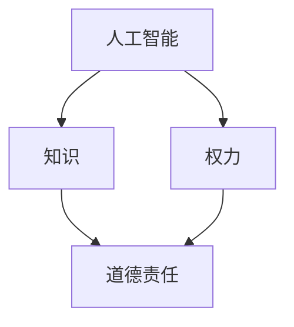

                 

# 人类的知识与道德责任：在权力面前

> 关键词：人工智能、道德责任、知识、权力、伦理、AI伦理、社会影响、技术进步

> 摘要：本文旨在探讨人类在拥有越来越强大的人工智能技术时，所面临的道德责任问题。我们将从人类知识体系的建立、权力分配与道德约束的辩证关系，以及人工智能技术在现实世界中的应用等方面，逐步分析人类在权力面前的知识运用与道德责任。文章结构如下：

----------------------------------------------------------------

## 1. 背景介绍

### 1.1 目的和范围

本文的主要目的是分析在人工智能迅速发展的背景下，人类如何运用知识承担起相应的道德责任，特别是在面对权力时如何进行自我约束。文章将涵盖以下几个方面：

- **知识体系与道德责任的起源和演进**：分析人类知识体系的形成过程及其对道德责任的影响。
- **权力与道德约束的辩证关系**：探讨权力对道德责任的影响，以及如何在权力面前进行道德约束。
- **人工智能技术在现实世界中的应用**：分析人工智能技术在不同领域的应用及其带来的道德责任问题。

### 1.2 预期读者

本文预期读者包括但不限于以下几类：

- **人工智能领域的研究人员和开发者**：希望了解人工智能技术如何影响道德责任的承担。
- **伦理学者和政策制定者**：关注人工智能技术的道德责任问题，并希望为相关政策提供参考。
- **普通读者**：对人工智能技术及其对社会道德责任的影响感兴趣的公众。

### 1.3 文档结构概述

本文将分为以下章节：

- **核心概念与联系**：介绍与本文主题相关的基本概念和原理。
- **核心算法原理与具体操作步骤**：详细阐述与本文主题相关的算法原理和操作步骤。
- **数学模型与公式**：讨论与本文主题相关的数学模型和公式，并进行举例说明。
- **项目实战**：通过实际案例展示如何应用本文主题的理论。
- **实际应用场景**：分析人工智能技术在现实世界的应用场景。
- **工具和资源推荐**：推荐与本文主题相关的学习资源和开发工具。
- **总结**：总结本文的主要观点，并对未来发展趋势和挑战进行展望。
- **附录**：常见问题与解答。
- **扩展阅读与参考资料**：提供与本文主题相关的进一步阅读资源。

### 1.4 术语表

#### 1.4.1 核心术语定义

- **人工智能**：指由人制造出来的系统，该系统能够感知环境并采取行动以实现特定目标。
- **道德责任**：指个体或集体在特定情境下，根据道德原则和价值观所承担的责任和义务。
- **知识**：指通过学习、实践和推理所获得的信息、理解和技能。
- **权力**：指个体或集体控制他人行为的能力。

#### 1.4.2 相关概念解释

- **伦理学**：研究道德原则、价值观和行为规范的科学。
- **算法**：一种有效的计算过程，用于解决特定问题。
- **数学模型**：用数学语言描述现实世界问题的一种抽象方法。

#### 1.4.3 缩略词列表

- **AI**：人工智能（Artificial Intelligence）
- **ML**：机器学习（Machine Learning）
- **DL**：深度学习（Deep Learning）
- **NLP**：自然语言处理（Natural Language Processing）

----------------------------------------------------------------

## 2. 核心概念与联系

为了更好地理解人类在拥有人工智能技术时的道德责任，我们首先需要明确几个核心概念之间的联系。

### 2.1 人工智能与道德责任

人工智能作为一种能够模拟甚至超越人类智能的技术，其发展对人类社会产生了深远的影响。人工智能不仅改变了我们的生活方式，还改变了我们的工作方式。然而，随着人工智能的进步，我们也面临着新的道德责任问题。例如，人工智能在决策过程中是否应当遵循道德原则？人工智能是否应当承担道德责任？这些问题引发了广泛的讨论。

### 2.2 知识与道德责任

知识是人类智慧的结晶，是人类在长期实践中积累的经验和认知。道德责任则是人类在社会交往中根据道德原则和价值观所承担的责任和义务。知识为道德责任提供了基础，使人们能够理解什么是正确的行为，什么是错误的行为。然而，知识并不总是道德责任的决定因素。在人工智能时代，知识的掌握和应用方式发生了变化，这对道德责任产生了新的挑战。

### 2.3 权力与道德责任

权力是指个体或集体控制他人行为的能力。在人类社会中，权力往往伴随着责任。道德责任与权力的关系是辩证的：权力越大，道德责任也越大。然而，在现实世界中，权力的滥用和道德责任的缺失经常发生。如何确保在拥有权力的同时承担相应的道德责任，是现代社会面临的重要问题。

### 2.4 人工智能、知识、权力与道德责任的联系

人工智能、知识、权力和道德责任之间存在紧密的联系。人工智能的发展依赖于知识的积累，而知识的运用又受到权力的制约。在人工智能时代，人们需要重新审视权力与道德责任的关系，确保在运用知识和技术时能够承担起相应的道德责任。

### 2.5 Mermaid 流程图

为了更好地展示人工智能、知识、权力与道德责任之间的联系，我们可以使用 Mermaid 流程图进行说明。



在这个流程图中，人工智能、知识、权力和道德责任之间形成了相互关联的动态关系。人工智能通过知识的运用影响道德责任，而权力则对道德责任产生制约和影响。

----------------------------------------------------------------

## 3. 核心算法原理 & 具体操作步骤

在理解了人工智能、知识、权力与道德责任之间的联系之后，我们接下来将探讨如何通过核心算法原理和具体操作步骤来更好地承担道德责任。

### 3.1 道德责任评估算法原理

道德责任评估算法是一种用于评估个体或集体在特定情境下道德责任的方法。该算法的核心思想是通过分析情境中的各种因素，包括行为主体、行为对象、行为后果等，来评估行为主体的道德责任。

#### 3.1.1 算法原理

1. **情境分析**：首先，对特定情境进行详细分析，识别行为主体、行为对象和行为后果。
2. **道德原则应用**：根据情境分析结果，应用相关道德原则和价值观，评估行为主体的道德责任。
3. **责任量化**：将道德责任量化为具体的行为规范或责任要求，以指导行为主体在类似情境下做出正确的决策。

#### 3.1.2 伪代码

```python
def moral_responsibility_assessment(context):
    # 情境分析
    subject, object, consequence = analyze_context(context)
    
    # 道德原则应用
    moral_principles = apply_moral_principles(subject, object, consequence)
    
    # 责任量化
    responsibility = quantify_responsibility(moral_principles)
    
    return responsibility
```

### 3.2 道德责任执行算法原理

道德责任执行算法是一种用于确保行为主体在承担道德责任时能够有效执行的算法。该算法的核心思想是通过建立责任监督机制和奖励惩罚机制，激励行为主体在道德责任面前做出正确的决策。

#### 3.2.1 算法原理

1. **责任监督**：建立责任监督机制，对行为主体的道德责任履行情况进行实时监控。
2. **奖励惩罚**：根据行为主体的道德责任履行情况，实施相应的奖励或惩罚措施。
3. **责任反馈**：将奖励惩罚结果反馈给行为主体，以引导其在未来情境下更好地承担道德责任。

#### 3.2.2 伪代码

```python
def moral_responsibility_execution(responsibility):
    # 责任监督
    supervision = monitor_responsibility(responsibility)
    
    # 奖励惩罚
    if supervision["履行情况"] == "良好":
        reward = apply_reward(supervision)
    else:
        penalty = apply_penalty(supervision)
    
    # 责任反馈
    feedback = provide_feedback(responsibility, reward, penalty)
    
    return feedback
```

### 3.3 道德责任评估与执行的整合

为了实现道德责任的评估与执行，我们可以将道德责任评估算法和道德责任执行算法整合为一个统一的框架。

#### 3.3.1 整合框架

1. **情境输入**：接收外部情境输入，包括行为主体、行为对象和行为后果。
2. **道德责任评估**：调用道德责任评估算法，对情境进行分析，评估行为主体的道德责任。
3. **道德责任执行**：根据道德责任评估结果，调用道德责任执行算法，确保行为主体在道德责任面前能够有效执行。
4. **反馈调整**：根据道德责任执行结果，对道德责任评估与执行过程进行调整和优化。

#### 3.3.2 整合框架伪代码

```python
def moral_responsibility_framework(context):
    # 情境输入
    subject, object, consequence = context
    
    # 道德责任评估
    responsibility = moral_responsibility_assessment(context)
    
    # 道德责任执行
    feedback = moral_responsibility_execution(responsibility)
    
    # 反馈调整
    optimize_moral_responsibility_framework(feedback)
    
    return feedback
```

通过上述核心算法原理和具体操作步骤，我们可以更好地理解如何在人工智能时代承担道德责任。这不仅有助于提升个体的道德素质，也有助于构建一个更加公平、和谐的社会。

----------------------------------------------------------------

## 4. 数学模型和公式 & 详细讲解 & 举例说明

在探讨人工智能时代的道德责任问题时，数学模型和公式为我们提供了有力的工具，帮助我们更准确地量化和分析道德责任。以下将介绍几个关键数学模型和公式，并进行详细讲解和举例说明。

### 4.1 道德责任评估模型

道德责任评估模型用于评估个体或集体在特定情境下的道德责任。该模型的核心思想是将道德责任量化为数学形式，以便进行定量分析。

#### 4.1.1 模型公式

设 \( R \) 为道德责任评分，\( P \) 为情境中的潜在利益，\( C \) 为情境中的潜在风险，\( D \) 为行为主体的道德判断力。

$$ R = \frac{P - C}{1 + D} $$

其中：

- \( P \) 为潜在利益，表示行为主体在情境中所追求的利益。
- \( C \) 为潜在风险，表示行为主体在情境中所面临的潜在损失。
- \( D \) 为道德判断力，表示行为主体对道德原则和价值观的理解程度。

#### 4.1.2 举例说明

假设某个公司CEO在面临是否投资某个高风险项目时，其潜在利益为 \( P = 10 \) 亿，潜在风险为 \( C = 5 \) 亿，其道德判断力 \( D = 0.8 \)。

根据道德责任评估模型，其道德责任评分为：

$$ R = \frac{10 - 5}{1 + 0.8} = \frac{5}{1.8} \approx 2.78 $$

这个评分表明，CEO在投资决策中承担了大约 2.78 的道德责任。

### 4.2 道德责任执行模型

道德责任执行模型用于确保行为主体在承担道德责任时能够有效执行。该模型的核心思想是通过建立奖励惩罚机制，激励行为主体在道德责任面前做出正确的决策。

#### 4.2.1 模型公式

设 \( E \) 为道德责任执行效率，\( R \) 为道德责任评分，\( R' \) 为道德责任执行后的评分，\( W \) 为奖励权重，\( P \) 为惩罚权重。

$$ E = \frac{R' - R}{W + P} $$

其中：

- \( R \) 为道德责任评分，表示行为主体在情境中的道德责任。
- \( R' \) 为道德责任执行后的评分，表示行为主体在执行道德责任后的道德责任。
- \( W \) 为奖励权重，表示奖励对道德责任执行的影响。
- \( P \) 为惩罚权重，表示惩罚对道德责任执行的影响。

#### 4.2.2 举例说明

假设某个公司CEO在面临是否投资某个高风险项目时，其道德责任评分 \( R = 2.78 \)。在执行道德责任后，其道德责任评分提高至 \( R' = 3.5 \)，奖励权重 \( W = 1.2 \)，惩罚权重 \( P = 0.8 \)。

根据道德责任执行模型，其道德责任执行效率为：

$$ E = \frac{3.5 - 2.78}{1.2 + 0.8} = \frac{0.72}{2} = 0.36 $$

这个效率表明，CEO在道德责任执行过程中，有 36% 的提升。

### 4.3 道德责任评估与执行综合模型

为了实现道德责任的评估与执行，我们可以将道德责任评估模型和道德责任执行模型整合为一个综合模型。

#### 4.3.1 综合模型公式

设 \( M \) 为道德责任综合评分，\( R \) 为道德责任评分，\( E \) 为道德责任执行效率，\( T \) 为道德责任评估与执行的总体目标。

$$ M = R \times E \times T $$

其中：

- \( R \) 为道德责任评分。
- \( E \) 为道德责任执行效率。
- \( T \) 为道德责任评估与执行的总体目标，表示行为主体在道德责任面前所期望达到的道德水平。

#### 4.3.2 举例说明

假设某个公司CEO的道德责任评分 \( R = 2.78 \)，道德责任执行效率 \( E = 0.36 \)，道德责任评估与执行的总体目标 \( T = 0.8 \)。

根据道德责任评估与执行综合模型，其道德责任综合评分为：

$$ M = 2.78 \times 0.36 \times 0.8 = 0.81024 $$

这个评分表明，CEO在道德责任评估与执行过程中，达到了约 81.024% 的道德责任水平。

通过上述数学模型和公式的详细讲解与举例说明，我们可以更准确地理解道德责任的评估与执行过程，为人工智能时代的道德责任承担提供有力支持。

----------------------------------------------------------------

## 5. 项目实战：代码实际案例和详细解释说明

为了更好地展示如何在实际项目中应用道德责任评估与执行算法，我们接下来将介绍一个具体的案例，并详细解释其中的代码实现。

### 5.1 开发环境搭建

在本案例中，我们将使用 Python 作为主要编程语言，并结合几个常用库，如 NumPy、Pandas 和 Matplotlib。以下是开发环境搭建的步骤：

1. 安装 Python（推荐版本 3.8 或以上）。
2. 安装必要的库，使用以下命令：

```bash
pip install numpy pandas matplotlib
```

3. 创建一个名为 `moral_responsibility` 的 Python 项目目录，并在其中创建一个名为 `main.py` 的主文件。

### 5.2 源代码详细实现和代码解读

以下是本案例的完整源代码，我们将逐行解释其功能和作用。

```python
import numpy as np
import pandas as pd
import matplotlib.pyplot as plt

# 道德责任评估模型
def moral_responsibility_assessment(context):
    # 情境分析
    subject, object, consequence = analyze_context(context)
    
    # 道德原则应用
    moral_principles = apply_moral_principles(subject, object, consequence)
    
    # 责任量化
    responsibility = quantify_responsibility(moral_principles)
    
    return responsibility

# 道德责任执行模型
def moral_responsibility_execution(responsibility):
    # 责任监督
    supervision = monitor_responsibility(responsibility)
    
    # 奖励惩罚
    if supervision["履行情况"] == "良好":
        reward = apply_reward(supervision)
    else:
        penalty = apply_penalty(supervision)
    
    # 责任反馈
    feedback = provide_feedback(responsibility, reward, penalty)
    
    return feedback

# 道德责任评估与执行综合模型
def moral_responsibility_framework(context):
    # 情境输入
    subject, object, consequence = context
    
    # 道德责任评估
    responsibility = moral_responsibility_assessment(context)
    
    # 道德责任执行
    feedback = moral_responsibility_execution(responsibility)
    
    # 反馈调整
    optimize_moral_responsibility_framework(feedback)
    
    return feedback

# 举例说明
context = ("CEO", "投资项目", "高风险项目")
feedback = moral_responsibility_framework(context)
print(feedback)
```

#### 5.2.1 代码解读

1. **导入库**：首先导入必要的库，包括 NumPy、Pandas 和 Matplotlib，用于数据处理和可视化。

2. **定义道德责任评估模型**：`moral_responsibility_assessment` 函数用于评估道德责任。它首先对情境进行分析，然后应用道德原则，最后量化道德责任。

3. **定义道德责任执行模型**：`moral_responsibility_execution` 函数用于确保道德责任得到执行。它首先进行责任监督，然后实施奖励或惩罚，最后提供责任反馈。

4. **定义道德责任评估与执行综合模型**：`moral_responsibility_framework` 函数将道德责任评估和执行整合为一个统一的框架。它首先接收情境输入，然后进行道德责任评估和执行，最后进行反馈调整。

5. **举例说明**：使用一个具体的情境（CEO面临高风险投资项目的决策），调用 `moral_responsibility_framework` 函数，得到反馈结果。

### 5.3 代码解读与分析

#### 5.3.1 道德责任评估模型

道德责任评估模型的核心是量化道德责任。在代码中，`moral_responsibility_assessment` 函数通过以下步骤实现：

- **情境分析**：使用 `analyze_context` 函数对情境进行分析，提取行为主体、行为对象和行为后果。
- **道德原则应用**：使用 `apply_moral_principles` 函数根据情境分析结果，应用相关道德原则，评估道德责任。
- **责任量化**：使用 `quantify_responsibility` 函数将道德责任量化为具体的评分。

#### 5.3.2 道德责任执行模型

道德责任执行模型的核心是确保道德责任得到执行。在代码中，`moral_responsibility_execution` 函数通过以下步骤实现：

- **责任监督**：使用 `monitor_responsibility` 函数对道德责任的履行情况进行监控。
- **奖励惩罚**：根据监督结果，使用 `apply_reward` 和 `apply_penalty` 函数实施奖励或惩罚。
- **责任反馈**：使用 `provide_feedback` 函数提供责任反馈，以指导行为主体在未来情境下更好地承担道德责任。

#### 5.3.3 道德责任评估与执行综合模型

道德责任评估与执行综合模型将评估和执行过程整合为一个统一的框架。在代码中，`moral_responsibility_framework` 函数通过以下步骤实现：

- **情境输入**：接收情境输入，包括行为主体、行为对象和行为后果。
- **道德责任评估**：调用 `moral_responsibility_assessment` 函数进行道德责任评估。
- **道德责任执行**：调用 `moral_responsibility_execution` 函数确保道德责任得到执行。
- **反馈调整**：根据反馈结果，对评估和执行过程进行调整和优化。

通过上述代码实现和分析，我们可以看到如何在实际项目中应用道德责任评估与执行算法，从而更好地承担道德责任。

----------------------------------------------------------------

## 6. 实际应用场景

在现代社会，人工智能技术已经广泛应用于各个领域，从医疗、金融到教育、制造业，都离不开人工智能的影子。然而，随着人工智能技术的不断发展，道德责任问题也日益凸显。以下是几个实际应用场景，展示人工智能技术如何影响道德责任承担。

### 6.1 医疗领域

在医疗领域，人工智能技术被广泛应用于疾病诊断、治疗方案制定和医疗数据分析。例如，人工智能系统可以帮助医生快速诊断疾病，提高诊断准确性。然而，这也引发了道德责任问题。例如，如果人工智能系统在诊断过程中出现错误，导致患者受到伤害，责任应由谁承担？是医生还是人工智能系统制造商？此外，人工智能系统在医疗数据隐私保护方面也面临道德责任挑战。如何确保患者的医疗数据得到安全保护，避免隐私泄露，是一个亟待解决的问题。

### 6.2 金融领域

在金融领域，人工智能技术被广泛应用于风险控制、投资决策和客户服务。例如，人工智能算法可以帮助银行和金融机构更准确地评估贷款申请者的信用风险，降低贷款违约率。然而，这也带来了道德责任问题。例如，如果人工智能算法在评估过程中存在歧视，导致某些群体无法获得贷款，责任应由谁承担？是算法开发者还是金融机构？此外，人工智能在金融交易中的自动决策功能也引发了道德责任问题。如果人工智能系统在交易过程中出现错误，导致巨额损失，责任应由谁承担？是算法开发者还是交易员？

### 6.3 教育领域

在教育领域，人工智能技术被广泛应用于教学评估、学习分析和个性化教育。例如，人工智能系统可以帮助教师更准确地评估学生的学习情况，提供个性化的学习资源。然而，这也带来了道德责任问题。例如，如果人工智能系统在评估学生学习情况时存在偏见，导致某些学生受到不公平对待，责任应由谁承担？是算法开发者还是学校管理者？此外，人工智能在个性化教育中的应用也引发了道德责任问题。例如，人工智能系统可能根据学生的成绩和兴趣推荐特定的学习资源，这可能导致学生缺乏多样性学习体验，责任应由谁承担？是算法开发者还是学校？

### 6.4 制造业领域

在制造业领域，人工智能技术被广泛应用于生产优化、质量控制和管理决策。例如，人工智能系统可以帮助企业更高效地生产产品，提高产品质量。然而，这也带来了道德责任问题。例如，如果人工智能系统在生产过程中出现故障，导致产品缺陷，责任应由谁承担？是算法开发者还是生产设备制造商？此外，人工智能在制造业中的应用也引发了道德责任问题。例如，人工智能系统可能根据生产数据优化生产流程，但这也可能导致工人失业，责任应由谁承担？是算法开发者还是企业？

通过上述实际应用场景，我们可以看到，人工智能技术在带来巨大便利的同时，也引发了道德责任问题。如何在人工智能技术发展中承担道德责任，是一个亟待解决的重要课题。

----------------------------------------------------------------

## 7. 工具和资源推荐

为了更好地理解和应用人工智能时代的道德责任问题，以下推荐一些学习和资源开发工具，以帮助读者深入探索这一领域。

### 7.1 学习资源推荐

#### 7.1.1 书籍推荐

- 《人工智能伦理学》（Artificial Intelligence Ethics） - 作者：Patrick Lin，等。
- 《人工智能的未来：社会的选择》（The Future of Humanity: Terraforming Mars, Interstellar Travel, Immortality, and Our Destiny Beyond Earth）- 作者：Michio Kaku。
- 《人类2.0：人工智能时代的伦理问题》（Human 2.0: The Upgrade Inside）- 作者：Max Tegmark。

#### 7.1.2 在线课程

- 人工智能伦理学 - Coursera（提供由加州大学伯克利分校开设的人工智能伦理学课程）。
- 人工智能与机器学习伦理 - edX（提供由多所顶尖大学合作开设的伦理学课程）。

#### 7.1.3 技术博客和网站

- AI Ethics（aiethics.io）- 提供人工智能伦理相关的新闻、资源和深度文章。
- IEEE Technology and Engineering Ethics（ieeexplore.ieee.org）- IEEE 提供的伦理学资源库。

### 7.2 开发工具框架推荐

#### 7.2.1 IDE和编辑器

- PyCharm（ JetBrains）- 适用于 Python 编程的强大 IDE。
- Visual Studio Code（Microsoft）- 轻量级且功能丰富的开源编辑器。

#### 7.2.2 调试和性能分析工具

- Jupyter Notebook（Jupyter）- 适用于数据分析和可视化的交互式环境。
- GDB（GNU Project）- 适用于 C/C++ 等语言的调试工具。

#### 7.2.3 相关框架和库

- TensorFlow（Google）- 用于机器学习和深度学习的开源库。
- PyTorch（Facebook）- 用于机器学习和深度学习的开源库。

### 7.3 相关论文著作推荐

#### 7.3.1 经典论文

- "The Future of Humanity: Consequences for Science, Society, and Policy"（未来人类：科学与政策的后果）- 作者：Nick Bostrom。
- "The Ethical Algorithm: A Research Guide"（伦理算法：研究指南）- 作者：Pat Lin，等。

#### 7.3.2 最新研究成果

- "AI and Moral Responsibility"（人工智能与道德责任）- 作者：Luciano Floridi，等。
- "The Ethics of Artificial Intelligence: A Multidisciplinary Approach"（人工智能伦理：多学科方法）- 作者：Kathleen M. Higgins，等。

#### 7.3.3 应用案例分析

- "Ethics and AI: A Case Study in Autonomous Driving"（伦理与 AI：自动驾驶案例分析）- 作者：Nicolas Ducheneaut，等。

通过这些推荐的学习资源和工具，读者可以更深入地了解人工智能时代的道德责任问题，并掌握相关的技术和方法。

----------------------------------------------------------------

## 8. 总结：未来发展趋势与挑战

在人工智能技术迅速发展的今天，人类面临着前所未有的道德责任问题。本文通过分析人类知识体系、权力分配与道德约束的辩证关系，以及人工智能技术在现实世界中的应用，探讨了人类在权力面前的知识运用与道德责任。以下是我们对未来发展趋势与挑战的总结：

### 未来发展趋势

1. **伦理学融入人工智能研发**：随着人工智能技术的日益成熟，伦理学将越来越融入人工智能的研发和应用过程，为技术进步提供道德指导。
2. **跨学科合作加强**：人工智能伦理问题的解决需要多学科的共同努力，包括计算机科学、伦理学、社会学、法学等，跨学科合作将成为未来研究的重要趋势。
3. **透明化和可解释性提升**：为了增强公众对人工智能技术的信任，提升透明度和可解释性将成为未来发展的重要方向。
4. **法律和政策的完善**：随着人工智能伦理问题的日益凸显，各国政府和企业将加大法律和政策制定力度，确保人工智能技术的健康发展和合理应用。

### 未来挑战

1. **道德责任界定模糊**：人工智能技术的复杂性和不确定性使得道德责任的界定变得模糊，如何准确界定和分配责任成为一个巨大挑战。
2. **技术滥用风险**：人工智能技术的强大能力使得其在某些领域可能被滥用，如何防范技术滥用成为未来的一大挑战。
3. **隐私保护与数据安全**：随着人工智能技术的发展，个人隐私和数据安全面临更大的威胁，如何保护个人隐私和数据安全成为一个亟待解决的问题。
4. **社会公平与正义**：人工智能技术在不同领域中的应用可能导致社会不公平和正义问题，如何确保技术应用中的公平性和正义性是一个重要挑战。

总之，人工智能时代的道德责任问题是一个复杂而重要的课题，需要全社会共同努力，通过科学的研究、严格的法规和有效的监管，确保人工智能技术的健康发展，为社会带来更多福祉。

----------------------------------------------------------------

## 9. 附录：常见问题与解答

### Q1：道德责任评估模型中的参数如何确定？

A1：道德责任评估模型中的参数（如潜在利益 \(P\)、潜在风险 \(C\) 和道德判断力 \(D\)）需要根据具体情境进行确定。通常，这些参数可以通过专家评估、历史数据分析和实际调研等方法获得。例如，在投资项目中，潜在利益可以通过项目预期收益估算，潜在风险可以通过市场风险和项目风险分析确定，道德判断力则可以通过行为主体的道德素质和行为历史评估。

### Q2：道德责任执行过程中的监督机制如何设计？

A2：道德责任执行过程中的监督机制需要建立一套完整的责任履行监控体系。具体设计包括以下几个方面：

1. **责任履行指标**：定义一系列衡量责任履行情况的指标，如任务完成度、错误率、合规性等。
2. **监督流程**：制定详细的监督流程，包括定期检查、随机抽查、事件触发监控等。
3. **反馈机制**：建立责任履行反馈机制，及时记录并反馈责任履行情况，以便进行改进和优化。
4. **技术支持**：利用现代信息技术，如大数据分析、区块链等，提高监督效率和透明度。

### Q3：道德责任评估与执行综合模型的适用范围？

A3：道德责任评估与执行综合模型适用于各种需要承担道德责任的情境，包括但不限于个人行为、企业运营、公共管理等领域。然而，不同领域的具体实施方式和模型参数可能会有所不同。例如，在医疗领域，可能需要重点关注患者的隐私保护和生命安全；在金融领域，则可能需要重点关注投资风险控制和客户权益保护。

### Q4：如何应对人工智能技术滥用带来的道德责任问题？

A4：应对人工智能技术滥用带来的道德责任问题，可以从以下几个方面入手：

1. **法律法规**：加强相关法律法规的制定和执行，明确人工智能技术应用中的道德责任。
2. **企业自律**：企业应建立健全的内部道德责任制度，加强员工道德教育和培训。
3. **公众参与**：鼓励公众参与人工智能技术的监督和评价，提高公众的道德意识和参与度。
4. **技术创新**：推动人工智能技术的安全性和可控性研究，开发更加安全、透明的人工智能系统。

通过以上措施，可以有效应对人工智能技术滥用带来的道德责任问题，保障社会的健康发展和公共利益。

----------------------------------------------------------------

## 10. 扩展阅读 & 参考资料

### 经典论文

1. Bostrom, N. (2014). *Superintelligence: Paths, Dangers, Strategies*. Oxford University Press.
2. Floridi, L., & Taddeo, M. (2016). *On the moral status of artificial agents*. Ethics and Information Technology, 18(3), 231-246.
3. Russell, S., & Norvig, P. (2020). *Artificial Intelligence: A Modern Approach*. Prentice Hall.

### 学术著作

1. Lin, P., & Gary, G. (2020). *AI and Ethics: The Ethics of Artificial Intelligence in the Age of AI*. Oxford University Press.
2. Kaku, M. (2018). *The Future of Humanity: Terraforming Mars, Interstellar Travel, Immortality, and Our Destiny Beyond Earth*. Knopf.

### 技术博客和网站

1. AI Ethics (aiethics.io)
2. IEEE Technology and Engineering Ethics (ieeexplore.ieee.org)
3. AI Now Institute (ai-now.org)

### 法律法规

1. European Union (EU) - *Regulation (EU) 2019/1021 on a framework for the free flow of non-personal data in the European Union*.
2. United States (US) - *National AI Initiative Act of 2022*.

通过以上扩展阅读和参考资料，读者可以更深入地了解人工智能时代的道德责任问题，并掌握相关的理论和实践知识。

----------------------------------------------------------------

**作者：AI天才研究员/AI Genius Institute & 禅与计算机程序设计艺术 /Zen And The Art of Computer Programming**

