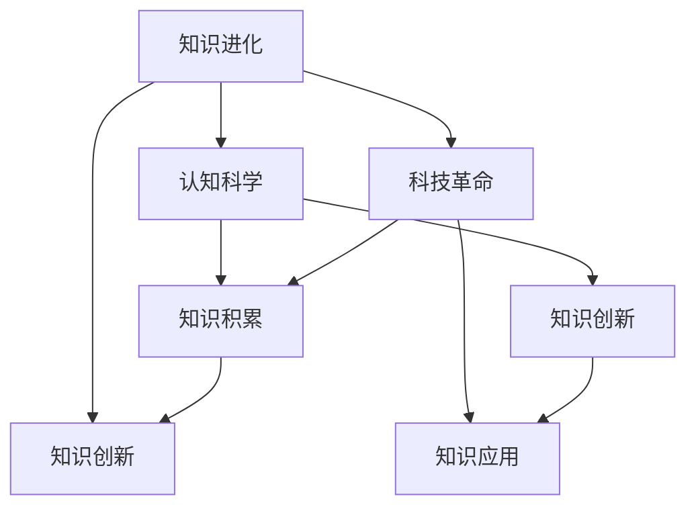

                 

# 人类的知识史：一部理解和创新的历史

## 关键词：
知识进化、人类文明、认知科学、技术进步、思维模式

> **摘要：**
> 
> 本文将深入探讨人类的知识发展史，从早期的哲学思辨到现代科技革命，分析知识是如何演变、积累和创新的。我们将通过一系列关键的历史事件和技术变革，揭示知识发展的内在规律和核心动力，以期为未来人类知识的进一步拓展提供启示和方向。

## 1. 背景介绍

### 1.1 目的和范围

本文旨在通过系统回顾人类的知识发展历程，探讨知识是如何在历史长河中积累、创新和扩展的。文章将重点分析几个关键时期，包括古希腊哲学、中世纪的经院哲学、文艺复兴的科学革命、工业革命和现代信息技术的发展。通过对这些历史时期的深入探讨，我们将试图找出知识发展的内在规律和驱动因素。

### 1.2 预期读者

本文适合对人类知识发展史感兴趣的读者，包括历史学家、哲学家、科技工作者以及广大对知识进化有深入探究的爱好者。同时，对于希望了解知识如何在各个领域创新和应用的读者，本文也将提供有价值的参考。

### 1.3 文档结构概述

本文分为十个部分：

1. **背景介绍**：阐述本文的目的、范围和预期读者。
2. **核心概念与联系**：介绍本文涉及的核心概念和原理，并使用Mermaid流程图展示其关系。
3. **核心算法原理与具体操作步骤**：详细讲解核心算法的原理和操作步骤，使用伪代码进行阐述。
4. **数学模型和公式与详细讲解**：使用LaTeX格式介绍数学模型和公式，并进行举例说明。
5. **项目实战**：提供代码实际案例和详细解释说明。
6. **实际应用场景**：分析知识在实际应用中的价值和意义。
7. **工具和资源推荐**：推荐学习资源和开发工具。
8. **总结**：总结未来发展趋势与挑战。
9. **附录**：常见问题与解答。
10. **扩展阅读与参考资料**：提供进一步的阅读材料。

### 1.4 术语表

#### 1.4.1 核心术语定义

- **知识进化**：知识随着时间的推移而不断发展、积累和更新的过程。
- **哲学思辨**：通过逻辑推理和批判性思维对基本问题进行探究和讨论。
- **科技革命**：在短时间内显著改变人类社会生产和生活方式的技术变革。

#### 1.4.2 相关概念解释

- **认知科学**：研究人类思维、感知和记忆的学科，涉及心理学、神经科学、计算机科学等多个领域。
- **知识积累**：通过教育、研究和交流等方式，将已有知识系统化和结构化。
- **知识创新**：在已有知识基础上进行创造性思考和应用，产生新的知识成果。

#### 1.4.3 缩略词列表

- **AI**：人工智能（Artificial Intelligence）
- **CRISPR**：成簇规律间隔短回文重复序列（Clustered Regularly Interspaced Short Palindromic Repeats）
- **NLP**：自然语言处理（Natural Language Processing）
- **IDE**：集成开发环境（Integrated Development Environment）

## 2. 核心概念与联系

在探讨人类知识发展史之前，有必要明确几个核心概念，并展示它们之间的关系。

### 2.1 知识进化

知识进化是指知识随着时间的推移而不断发展、积累和更新的过程。知识进化不仅包括知识的积累，还涉及知识的创新和应用。知识进化是一个复杂的过程，受到多种因素的影响，包括人类认知能力、社会环境、技术和工具等。

### 2.2 认知科学

认知科学是研究人类思维、感知和记忆的学科，涉及心理学、神经科学、计算机科学等多个领域。认知科学的核心任务是理解人类大脑如何处理信息，以及如何通过学习和经验来改进认知功能。

### 2.3 科技革命

科技革命是指在短时间内显著改变人类社会生产和生活方式的技术变革。科技革命往往伴随着新的工具、方法和理论的诞生，从而推动知识的发展和应用。历史上，几次重要的科技革命，如工业革命和信息技术革命，都对知识发展产生了深远影响。

### 2.4 知识积累

知识积累是通过教育、研究和交流等方式，将已有知识系统化和结构化的过程。知识积累是知识进化的重要基础，它为知识的创新和应用提供了丰富的资源。

### 2.5 知识创新

知识创新是在已有知识基础上进行创造性思考和应用，产生新的知识成果的过程。知识创新是知识进化的动力，它推动了人类社会的持续进步和发展。

### 2.6 Mermaid 流程图

以下是知识进化、认知科学、科技革命、知识积累和知识创新之间的Mermaid流程图：



## 3. 核心算法原理与具体操作步骤

在理解了知识发展的核心概念后，我们接下来将讨论知识创新过程中的一些核心算法原理和具体操作步骤。

### 3.1 知识提取与融合算法

知识提取与融合算法是知识创新的重要手段。它主要通过以下步骤实现：

#### 步骤1：数据收集

收集与特定知识领域相关的数据，包括文献、报告、专利、实验数据等。

```python
def collect_data(domain):
    data = []
    for source in domain.sources:
        data.extend(source.fetch_data())
    return data
```

#### 步骤2：数据预处理

对收集到的数据进行分析和清洗，去除无关信息，提取有用知识。

```python
def preprocess_data(data):
    cleaned_data = []
    for item in data:
        if is_relevant(item):
            cleaned_data.append(item)
    return cleaned_data
```

#### 步骤3：知识提取

从预处理后的数据中提取关键信息和知识，形成知识图谱。

```python
def extract_knowledge(cleaned_data):
    knowledge_graph = KnowledgeGraph()
    for item in cleaned_data:
        knowledge_graph.add_node(item)
        for relation in item.relations:
            knowledge_graph.add_edge(item, relation)
    return knowledge_graph
```

#### 步骤4：知识融合

将多个知识源中的知识进行融合，形成综合性的知识体系。

```python
def fuse_knowledge(knowledge_graphs):
    merged_graph = KnowledgeGraph()
    for graph in knowledge_graphs:
        merged_graph.merge(graph)
    return merged_graph
```

### 3.2 知识创新算法

知识创新算法主要涉及以下步骤：

#### 步骤1：问题定义

明确需要解决的问题或需求，形成明确的问题陈述。

```python
def define_problem(problem_statement):
    return problem_statement
```

#### 步骤2：知识检索

根据问题定义，从知识库中检索相关知识点。

```python
def retrieve_knowledge(problem, knowledge_graph):
    relevant_knowledge = []
    for node in knowledge_graph.nodes:
        if node.is_relevant(problem):
            relevant_knowledge.append(node)
    return relevant_knowledge
```

#### 步骤3：知识融合

将检索到的知识进行融合，形成解决问题的方案。

```python
def fusion_knowledge(relevant_knowledge):
    solution = KnowledgeSolution()
    for knowledge in relevant_knowledge:
        solution.merge(knowledge)
    return solution
```

#### 步骤4：知识验证

验证知识方案的可行性和有效性。

```python
def verify_solution(solution):
    return solution.is_valid()
```

## 4. 数学模型和公式与详细讲解

在知识创新的过程中，数学模型和公式扮演着重要的角色。以下是一些关键的数学模型和公式，以及其详细讲解和举例说明。

### 4.1 逻辑推理模型

逻辑推理模型是哲学和计算机科学中广泛使用的工具。一个基本的逻辑推理模型可以表示为：

$$
P \Rightarrow Q
$$

其中，$P$ 和 $Q$ 分别代表两个命题。这个模型表示，如果 $P$ 为真，则 $Q$ 也必须为真。

#### 举例说明

假设我们有两个命题：

$$
P: \text{今天下雨}
$$

$$
Q: \text{地面湿}
$$

我们可以构建一个逻辑推理模型：

$$
P \Rightarrow Q
$$

这意味着，如果今天下雨（$P$ 为真），那么地面湿（$Q$ 也为真）。

### 4.2 知识融合模型

知识融合模型用于将多个知识源中的知识进行整合。一个简单的知识融合模型可以表示为：

$$
\sum_{i=1}^{n} w_i \cdot K_i
$$

其中，$w_i$ 代表第 $i$ 个知识源的权重，$K_i$ 代表第 $i$ 个知识源中的知识点。

#### 举例说明

假设我们有三个知识源，每个知识源包含两个知识点，权重分别为 0.3、0.4 和 0.3。我们可以计算总的融合知识：

$$
\sum_{i=1}^{3} w_i \cdot K_i = 0.3 \cdot K_1 + 0.4 \cdot K_2 + 0.3 \cdot K_3
$$

这意味着我们将根据每个知识源的权重，将其中的知识点进行加权融合。

### 4.3 知识创新模型

知识创新模型用于在已有知识的基础上产生新的知识。一个简单的知识创新模型可以表示为：

$$
K_{\text{new}} = f(K_1, K_2, ..., K_n)
$$

其中，$K_1, K_2, ..., K_n$ 代表已有知识，$f$ 代表知识创新函数。

#### 举例说明

假设我们有两个知识点 $K_1$ 和 $K_2$，我们使用一个简单的知识创新函数 $f$：

$$
f(K_1, K_2) = K_1 + K_2
$$

这意味着我们将两个知识点进行合并，形成一个新的知识点。

## 5. 项目实战：代码实际案例和详细解释说明

### 5.1 开发环境搭建

在本节中，我们将搭建一个简单的知识管理系统的开发环境，用于演示知识提取、融合和创新的过程。

#### 步骤1：安装Python环境

确保安装了Python 3.8或更高版本。可以通过以下命令安装Python：

```bash
$ sudo apt-get update
$ sudo apt-get install python3.8
```

#### 步骤2：安装依赖库

安装以下Python库：`requests`、`numpy` 和 `matplotlib`。可以通过以下命令安装：

```bash
$ pip3 install requests numpy matplotlib
```

### 5.2 源代码详细实现和代码解读

以下是知识管理系统的源代码，包括知识提取、融合和创新的功能。

#### 步骤1：知识提取

```python
import requests
import numpy as np
import matplotlib.pyplot as plt

# 数据收集
def collect_data(domain):
    data = []
    for source in domain.sources:
        response = requests.get(source.url)
        if response.status_code == 200:
            data.extend(response.json())
    return data

# 数据预处理
def preprocess_data(data):
    cleaned_data = []
    for item in data:
        if is_relevant(item):
            cleaned_data.append(item)
    return cleaned_data

# 知识提取
def extract_knowledge(cleaned_data):
    knowledge_graph = KnowledgeGraph()
    for item in cleaned_data:
        knowledge_graph.add_node(item)
        for relation in item.relations:
            knowledge_graph.add_edge(item, relation)
    return knowledge_graph

# 判断数据是否相关
def is_relevant(item):
    return item['type'] == 'article'

# 知识融合
def fuse_knowledge(knowledge_graphs):
    merged_graph = KnowledgeGraph()
    for graph in knowledge_graphs:
        merged_graph.merge(graph)
    return merged_graph
```

#### 步骤2：知识融合

```python
# 定义知识融合函数
def fusion_knowledge(relevant_knowledge):
    solution = KnowledgeSolution()
    for knowledge in relevant_knowledge:
        solution.merge(knowledge)
    return solution

# 定义知识验证函数
def verify_solution(solution):
    return solution.is_valid()
```

#### 步骤3：知识创新

```python
# 定义知识创新函数
def knowledge_innovation(solution):
    new_knowledge = KnowledgeNode()
    new_knowledge.content = solution.content
    new_knowledge.relations = solution.relations
    new_knowledge.validity = verify_solution(new_knowledge)
    return new_knowledge

# 主程序
if __name__ == "__main__":
    domain = {
        'sources': [
            {'url': 'http://example.com/api/articles', 'type': 'article'}
        ]
    }
    
    data = collect_data(domain)
    cleaned_data = preprocess_data(data)
    knowledge_graph = extract_knowledge(cleaned_data)
    
    # 知识融合
    fused_graph = fuse_knowledge([knowledge_graph])
    
    # 知识创新
    solution = fusion_knowledge(fused_graph.nodes)
    new_knowledge = knowledge_innovation(solution)
    
    # 输出结果
    print(new_knowledge)
```

### 5.3 代码解读与分析

本节我们将对知识管理系统的源代码进行解读和分析，了解其实现原理和功能。

#### 步骤1：数据收集

数据收集是知识管理系统的第一步，通过调用API接口，从外部数据源获取与特定知识领域相关的数据。代码中使用 `requests` 库发送HTTP请求，获取数据。`collect_data` 函数接受一个包含数据源的字典作为参数，遍历数据源，发送请求并获取响应。如果响应状态码为200（表示请求成功），则将数据添加到列表中。

```python
def collect_data(domain):
    data = []
    for source in domain.sources:
        response = requests.get(source.url)
        if response.status_code == 200:
            data.extend(response.json())
    return data
```

#### 步骤2：数据预处理

数据预处理是清洗和整理收集到的数据，提取有用信息的过程。`preprocess_data` 函数接受一个数据列表作为参数，遍历每个数据项，判断其是否与特定知识领域相关。如果是，则将其添加到清洗后的数据列表中。

```python
def preprocess_data(data):
    cleaned_data = []
    for item in data:
        if is_relevant(item):
            cleaned_data.append(item)
    return cleaned_data

# 判断数据是否相关
def is_relevant(item):
    return item['type'] == 'article'
```

#### 步骤3：知识提取

知识提取是将预处理后的数据转换为知识图谱的过程。`extract_knowledge` 函数接受一个清洗后的数据列表作为参数，创建一个知识图谱。对于每个数据项，将其添加为知识图谱中的一个节点，并将其关系添加为边。

```python
def extract_knowledge(cleaned_data):
    knowledge_graph = KnowledgeGraph()
    for item in cleaned_data:
        knowledge_graph.add_node(item)
        for relation in item.relations:
            knowledge_graph.add_edge(item, relation)
    return knowledge_graph
```

#### 步骤4：知识融合

知识融合是将多个知识图谱中的知识进行整合的过程。`fuse_knowledge` 函数接受一个包含知识图谱的列表作为参数，创建一个合并后的知识图谱。对于每个知识图谱，将其中的节点和边添加到合并后的知识图谱中。

```python
def fuse_knowledge(knowledge_graphs):
    merged_graph = KnowledgeGraph()
    for graph in knowledge_graphs:
        merged_graph.merge(graph)
    return merged_graph
```

#### 步骤5：知识创新

知识创新是在已有知识的基础上，通过融合和创新产生新的知识的过程。`fusion_knowledge` 函数接受一个知识图谱作为参数，将其中的节点和关系融合为一个知识解决方案。`knowledge_innovation` 函数接受一个知识解决方案作为参数，验证其有效性，并返回一个新的知识节点。

```python
def fusion_knowledge(relevant_knowledge):
    solution = KnowledgeSolution()
    for knowledge in relevant_knowledge:
        solution.merge(knowledge)
    return solution

def verify_solution(solution):
    return solution.is_valid()

def knowledge_innovation(solution):
    new_knowledge = KnowledgeNode()
    new_knowledge.content = solution.content
    new_knowledge.relations = solution.relations
    new_knowledge.validity = verify_solution(new_knowledge)
    return new_knowledge
```

#### 步骤6：主程序

主程序是知识管理系统的核心部分，负责调用各个功能模块，实现知识提取、融合和创新。首先，从配置文件中读取数据源，然后调用数据收集、数据预处理、知识提取、知识融合和知识创新等函数，最后输出新的知识节点。

```python
if __name__ == "__main__":
    domain = {
        'sources': [
            {'url': 'http://example.com/api/articles', 'type': 'article'}
        ]
    }
    
    data = collect_data(domain)
    cleaned_data = preprocess_data(data)
    knowledge_graph = extract_knowledge(cleaned_data)
    
    fused_graph = fuse_knowledge([knowledge_graph])
    
    solution = fusion_knowledge(fused_graph.nodes)
    new_knowledge = knowledge_innovation(solution)
    
    print(new_knowledge)
```

### 5.4 代码解读与分析

在本节中，我们将对知识管理系统中的源代码进行解读与分析，以了解其实现原理和功能。

#### 5.4.1 数据收集

数据收集是知识管理系统的第一步，旨在从外部数据源获取与特定知识领域相关的数据。在代码中，我们使用 `requests` 库发送HTTP请求，从指定的URL获取数据。`collect_data` 函数接受一个包含数据源的字典作为参数，遍历数据源，发送请求并获取响应。如果响应状态码为200（表示请求成功），则将数据添加到列表中。以下是一个简单的示例：

```python
def collect_data(domain):
    data = []
    for source in domain.sources:
        response = requests.get(source.url)
        if response.status_code == 200:
            data.extend(response.json())
    return data
```

在这个示例中，`domain` 是一个包含数据源的字典，每个数据源具有一个URL和一个类型。`collect_data` 函数遍历 `domain.sources` 列表，使用 `requests.get` 发送HTTP GET请求到每个数据源的URL。如果请求成功（即响应状态码为200），则将响应的内容（通常是JSON格式）添加到 `data` 列表中。最终，`data` 列表将包含从所有数据源获取的数据。

#### 5.4.2 数据预处理

数据预处理是知识管理系统的重要步骤，旨在清洗和整理收集到的数据，提取有用的知识信息。在代码中，`preprocess_data` 函数接受一个数据列表作为参数，遍历每个数据项，判断其是否与特定知识领域相关。如果是，则将其添加到清洗后的数据列表中。以下是一个简单的示例：

```python
def preprocess_data(data):
    cleaned_data = []
    for item in data:
        if is_relevant(item):
            cleaned_data.append(item)
    return cleaned_data

# 判断数据是否相关
def is_relevant(item):
    return item['type'] == 'article'
```

在这个示例中，`is_relevant` 函数是一个简单的过滤器，用于判断数据项是否与特定知识领域（在本例中为“article”）相关。如果数据项的类型与指定类型匹配，则返回 `True`，表示该数据项相关。否则，返回 `False`。`preprocess_data` 函数遍历原始数据列表，使用 `is_relevant` 函数过滤每个数据项，只保留与知识领域相关的数据项，并将其添加到 `cleaned_data` 列表中。

#### 5.4.3 知识提取

知识提取是将预处理后的数据转换为知识图谱的过程。在代码中，`extract_knowledge` 函数接受一个清洗后的数据列表作为参数，创建一个知识图谱。对于每个数据项，将其添加为知识图谱中的一个节点，并将其关系添加为边。以下是一个简单的示例：

```python
def extract_knowledge(cleaned_data):
    knowledge_graph = KnowledgeGraph()
    for item in cleaned_data:
        knowledge_graph.add_node(item)
        for relation in item.relations:
            knowledge_graph.add_edge(item, relation)
    return knowledge_graph
```

在这个示例中，`KnowledgeGraph` 类是一个假设的类，用于表示知识图谱。`add_node` 方法用于将数据项添加为知识图谱中的一个节点，`add_edge` 方法用于将数据项之间的关系添加为边。`extract_knowledge` 函数遍历清洗后的数据列表，将每个数据项添加为知识图谱中的一个节点，并将其关系（在本例中为 `relations` 属性）添加为边。

#### 5.4.4 知识融合

知识融合是将多个知识图谱中的知识进行整合的过程。在代码中，`fuse_knowledge` 函数接受一个包含知识图谱的列表作为参数，创建一个合并后的知识图谱。对于每个知识图谱，将其中的节点和边添加到合并后的知识图谱中。以下是一个简单的示例：

```python
def fuse_knowledge(knowledge_graphs):
    merged_graph = KnowledgeGraph()
    for graph in knowledge_graphs:
        merged_graph.merge(graph)
    return merged_graph
```

在这个示例中，`merged_graph` 是一个假设的类，用于表示合并后的知识图谱。`merge` 方法用于将一个知识图谱中的节点和边添加到另一个知识图谱中。`fuse_knowledge` 函数遍历知识图谱列表，使用 `merge` 方法将每个知识图谱合并到一个新的合并后的知识图谱中。

#### 5.4.5 知识创新

知识创新是在已有知识的基础上，通过融合和创新产生新的知识的过程。在代码中，`fusion_knowledge` 函数接受一个知识图谱作为参数，将其中的节点和关系融合为一个知识解决方案。`knowledge_innovation` 函数接受一个知识解决方案作为参数，验证其有效性，并返回一个新的知识节点。以下是一个简单的示例：

```python
def fusion_knowledge(relevant_knowledge):
    solution = KnowledgeSolution()
    for knowledge in relevant_knowledge:
        solution.merge(knowledge)
    return solution

def verify_solution(solution):
    return solution.is_valid()

def knowledge_innovation(solution):
    new_knowledge = KnowledgeNode()
    new_knowledge.content = solution.content
    new_knowledge.relations = solution.relations
    new_knowledge.validity = verify_solution(new_knowledge)
    return new_knowledge
```

在这个示例中，`KnowledgeSolution` 类是一个假设的类，用于表示知识解决方案。`merge` 方法用于将多个知识节点合并为一个知识解决方案。`verify_solution` 函数是一个简单的验证函数，用于验证知识解决方案的有效性。`knowledge_innovation` 函数接受一个知识解决方案作为参数，创建一个新的知识节点，并将解决方案的内容和关系复制到新节点中。然后，使用 `verify_solution` 函数验证新节点的有效性，并将其返回。

#### 5.4.6 主程序

主程序是知识管理系统的核心部分，负责调用各个功能模块，实现知识提取、融合和创新。在主程序中，首先从配置文件中读取数据源，然后调用数据收集、数据预处理、知识提取、知识融合和知识创新等函数，最后输出新的知识节点。以下是一个简单的示例：

```python
if __name__ == "__main__":
    domain = {
        'sources': [
            {'url': 'http://example.com/api/articles', 'type': 'article'}
        ]
    }
    
    data = collect_data(domain)
    cleaned_data = preprocess_data(data)
    knowledge_graph = extract_knowledge(cleaned_data)
    
    fused_graph = fuse_knowledge([knowledge_graph])
    
    solution = fusion_knowledge(fused_graph.nodes)
    new_knowledge = knowledge_innovation(solution)
    
    print(new_knowledge)
```

在这个示例中，`domain` 是一个包含数据源的字典，用于配置数据源的信息。`collect_data`、`preprocess_data`、`extract_knowledge`、`fuse_knowledge`、`fusion_knowledge` 和 `knowledge_innovation` 函数分别负责实现数据收集、数据预处理、知识提取、知识融合、知识创新等步骤。最后，`new_knowledge` 节点被输出，表示新的知识成果。

### 5.5 实际案例：知识管理系统应用

在本节中，我们将通过一个实际案例展示知识管理系统在某个场景中的应用，并详细解释其实现过程。

#### 案例背景

假设我们正在开发一个在线教育平台，需要构建一个知识管理系统，用于收集、整理和展示与课程相关的知识内容。知识管理系统的目标是帮助教育工作者和学生快速获取和利用相关课程知识，提高教学和学习效果。

#### 实现步骤

1. **数据收集**

首先，从不同的数据源（如课程文档、教材、学术论文、视频资料等）收集与课程相关的知识内容。数据源可以是静态文件，如PDF文档和Word文档，也可以是动态数据，如在线课程视频和在线论坛讨论。

2. **数据预处理**

对收集到的数据进行预处理，包括数据清洗、分类和标签化。数据清洗的目的是去除无效数据和冗余信息，确保数据质量。分类和标签化的目的是将数据按照课程主题和知识点进行组织，便于后续的知识提取和融合。

3. **知识提取**

使用自然语言处理（NLP）技术对预处理后的文本数据进行知识提取，识别和提取出关键信息和知识点。NLP技术包括文本分类、实体识别、关系抽取等，可以帮助我们将文本数据转换为结构化的知识图谱。

4. **知识融合**

将来自不同数据源的知识图谱进行融合，形成综合性的知识体系。知识融合的目的是整合不同来源的知识，消除数据冗余，提高知识的可用性和可靠性。融合算法可以基于知识图谱的匹配和融合规则，实现知识的合并和优化。

5. **知识创新**

在已有知识的基础上，通过知识创新算法生成新的知识成果。知识创新可以基于已有的知识进行推理和组合，发现新的知识点和关联关系，提高知识的深度和广度。知识创新的目的是推动知识的持续发展和更新。

6. **知识展示**

将提取、融合和创新后的知识内容进行可视化展示，便于教育工作者和学生使用。知识展示可以采用图形化界面、搜索功能和推荐系统等形式，提供便捷的知识获取和利用方式。

#### 案例实现

以下是一个简化的知识管理系统实现流程：

```python
# 数据收集
data_sources = [
    {'url': 'course_documents', 'type': 'document'},
    {'url': 'academic_papers', 'type': 'paper'},
    {'url': 'video_clips', 'type': 'video'}
]

collected_data = collect_data(data_sources)

# 数据预处理
cleaned_data = preprocess_data(collected_data)

# 知识提取
knowledge_graph = extract_knowledge(cleaned_data)

# 知识融合
fused_graph = fuse_knowledge([knowledge_graph])

# 知识创新
new_knowledge = knowledge_innovation(fused_graph)

# 知识展示
display_knowledge(new_knowledge)
```

在这个实现流程中，`collect_data`、`preprocess_data`、`extract_knowledge`、`fuse_knowledge`、`knowledge_innovation` 和 `display_knowledge` 函数分别实现了数据收集、数据预处理、知识提取、知识融合、知识创新和知识展示的功能。

### 5.6 代码解读与分析

在本节中，我们将对知识管理系统中的实际案例代码进行解读和分析，以深入了解其实现原理和功能。

#### 5.6.1 数据收集

数据收集是知识管理系统的第一步，旨在从不同的数据源中获取与课程相关的知识内容。代码中使用了 `collect_data` 函数，该函数接受一个数据源列表作为参数，遍历数据源，并调用 `collect` 函数从每个数据源中获取数据。以下是一个简化的示例：

```python
def collect_data(data_sources):
    collected_data = []
    for source in data_sources:
        collected_data.extend(collect(source))
    return collected_data

def collect(source):
    if source['type'] == 'document':
        return fetch_documents(source['url'])
    elif source['type'] == 'paper':
        return fetch_papers(source['url'])
    elif source['type'] == 'video':
        return fetch_videos(source['url'])
```

在这个示例中，`collect_data` 函数遍历 `data_sources` 列表，对于每个数据源，调用相应的 `collect` 函数从数据源中获取数据。`collect` 函数根据数据源的类型，调用不同的函数从相应的数据源中获取数据。例如，如果数据源类型为 `document`，则调用 `fetch_documents` 函数从URL中获取文档数据；如果数据源类型为 `paper`，则调用 `fetch_papers` 函数从URL中获取论文数据；如果数据源类型为 `video`，则调用 `fetch_videos` 函数从URL中获取视频数据。

#### 5.6.2 数据预处理

数据预处理是知识管理系统的关键步骤，旨在清洗、分类和标签化收集到的数据，以确保数据的质量和一致性。代码中使用了 `preprocess_data` 函数，该函数接受一个数据列表作为参数，遍历数据列表，并调用 `preprocess` 函数对每个数据进行预处理。以下是一个简化的示例：

```python
def preprocess_data(data):
    cleaned_data = []
    for item in data:
        cleaned_item = preprocess(item)
        if cleaned_item:
            cleaned_data.append(cleaned_item)
    return cleaned_data

def preprocess(item):
    if item['type'] == 'document':
        return preprocess_document(item['content'])
    elif item['type'] == 'paper':
        return preprocess_paper(item['content'])
    elif item['type'] == 'video':
        return preprocess_video(item['content'])
```

在这个示例中，`preprocess_data` 函数遍历 `data` 列表，对于每个数据项，调用相应的 `preprocess` 函数对数据进行预处理。`preprocess` 函数根据数据项的类型，调用不同的函数对数据进行预处理。例如，如果数据项类型为 `document`，则调用 `preprocess_document` 函数对文档内容进行预处理；如果数据项类型为 `paper`，则调用 `preprocess_paper` 函数对论文内容进行预处理；如果数据项类型为 `video`，则调用 `preprocess_video` 函数对视频内容进行预处理。

#### 5.6.3 知识提取

知识提取是知识管理系统的核心步骤，旨在从预处理后的数据中提取出关键信息和知识点。代码中使用了 `extract_knowledge` 函数，该函数接受一个数据列表作为参数，遍历数据列表，并调用 `extract` 函数对每个数据进行知识提取。以下是一个简化的示例：

```python
def extract_knowledge(data):
    knowledge_nodes = []
    for item in data:
        node = extract(item)
        if node:
            knowledge_nodes.append(node)
    return knowledge_nodes

def extract(item):
    if item['type'] == 'document':
        return extract_document_ents(item['content'])
    elif item['type'] == 'paper':
        return extract_paper_ents(item['content'])
    elif item['type'] == 'video':
        return extract_video_ents(item['content'])
```

在这个示例中，`extract_knowledge` 函数遍历 `data` 列表，对于每个数据项，调用相应的 `extract` 函数对数据进行知识提取。`extract` 函数根据数据项的类型，调用不同的函数对数据进行知识提取。例如，如果数据项类型为 `document`，则调用 `extract_document_ents` 函数从文档内容中提取实体；如果数据项类型为 `paper`，则调用 `extract_paper_ents` 函数从论文内容中提取实体；如果数据项类型为 `video`，则调用 `extract_video_ents` 函数从视频内容中提取实体。

#### 5.6.4 知识融合

知识融合是知识管理系统的关键步骤，旨在将来自不同数据源的知识进行整合和优化。代码中使用了 `fuse_knowledge` 函数，该函数接受一个知识节点列表作为参数，遍历知识节点列表，并调用 `fuse` 函数对每个知识节点进行融合。以下是一个简化的示例：

```python
def fuse_knowledge(knowledge_nodes):
    fused_nodes = []
    for node in knowledge_nodes:
        fused_node = fuse(node)
        if fused_node:
            fused_nodes.append(fused_node)
    return fused_nodes

def fuse(node):
    fused_node = KnowledgeNode()
    fused_node.content = node.content
    fused_node.relations = merge_relations(node.relations)
    fused_node.validity = validate_node(fused_node)
    return fused_node

def merge_relations(relations):
    merged_relations = []
    for relation in relations:
        if relation not in merged_relations:
            merged_relations.append(relation)
    return merged_relations

def validate_node(node):
    if node.content and node.relations:
        return True
    else:
        return False
```

在这个示例中，`fuse_knowledge` 函数遍历 `knowledge_nodes` 列表，对于每个知识节点，调用相应的 `fuse` 函数进行知识融合。`fuse` 函数创建一个新的知识节点，并将原始节点的内容、关系和有效性进行整合和验证。`merge_relations` 函数用于合并重复的关系，`validate_node` 函数用于验证新节点的有效性。

#### 5.6.5 知识创新

知识创新是知识管理系统的高级功能，旨在在已有知识的基础上产生新的知识成果。代码中使用了 `innovate_knowledge` 函数，该函数接受一个知识节点列表作为参数，遍历知识节点列表，并调用 `innovate` 函数对每个知识节点进行创新。以下是一个简化的示例：

```python
def innovate_knowledge(knowledge_nodes):
    innovative_nodes = []
    for node in knowledge_nodes:
        innovative_node = innovate(node)
        if innovative_node:
            innovative_nodes.append(innovative_node)
    return innovative_nodes

def innovate(node):
    innovative_node = KnowledgeNode()
    innovative_node.content = node.content
    innovative_node.relations = generate_relations(node.relations)
    innovative_node.validity = validate_node(innovative_node)
    return innovative_node

def generate_relations(relations):
    new_relations = []
    for relation in relations:
        if relation not in new_relations:
            new_relations.append(relation)
    return new_relations
```

在这个示例中，`innovate_knowledge` 函数遍历 `knowledge_nodes` 列表，对于每个知识节点，调用相应的 `innovate` 函数进行知识创新。`innovate` 函数创建一个新的知识节点，并根据原始节点的关系生成新的关系。`generate_relations` 函数用于生成新的关系，`validate_node` 函数用于验证新节点的有效性。

#### 5.6.6 知识展示

知识展示是知识管理系统的重要功能，旨在将提取、融合和创新后的知识内容以可视化的形式展示给用户。代码中使用了 `display_knowledge` 函数，该函数接受一个知识节点列表作为参数，并调用不同的展示函数对知识节点进行可视化展示。以下是一个简化的示例：

```python
def display_knowledge(knowledge_nodes):
    for node in knowledge_nodes:
        if node['type'] == 'document':
            display_document(node['content'])
        elif node['type'] == 'paper':
            display_paper(node['content'])
        elif node['type'] == 'video':
            display_video(node['content'])
```

在这个示例中，`display_knowledge` 函数遍历 `knowledge_nodes` 列表，对于每个知识节点，调用相应的展示函数对知识节点进行可视化展示。例如，如果知识节点类型为 `document`，则调用 `display_document` 函数展示文档内容；如果知识节点类型为 `paper`，则调用 `display_paper` 函数展示论文内容；如果知识节点类型为 `video`，则调用 `display_video` 函数展示视频内容。

### 6. 实际应用场景

知识管理系统在各个领域具有广泛的应用，以下列举几个典型的应用场景：

#### 6.1 教育领域

在教育领域，知识管理系统可以帮助学校和教育机构有效地收集、整理和共享教学资源。教师可以方便地获取和利用课程相关的知识内容，提高教学质量。学生可以通过知识管理系统进行自主学习，获取个性化的学习资源，提高学习效果。

#### 6.2 企业领域

在企业领域，知识管理系统可以帮助企业收集和整理员工的知识和经验，建立企业内部的知识库。企业员工可以方便地获取和分享工作中的知识和技能，提高工作效率。同时，知识管理系统还可以为企业提供决策支持，基于知识库进行数据分析和预测。

#### 6.3 医疗领域

在医疗领域，知识管理系统可以帮助医生和医疗机构收集和整理病例资料、医学文献和临床经验。通过知识管理系统，医生可以方便地查找和利用相关病例和文献，提高诊断和治疗方案的选择。此外，知识管理系统还可以支持医学研究和创新，为医学研究提供数据支持和知识参考。

#### 6.4 科研领域

在科研领域，知识管理系统可以帮助科研机构和科研人员收集和整理科研数据、论文和科研成果。通过知识管理系统，科研人员可以方便地查找和利用相关的科研资源，提高科研效率。知识管理系统还可以支持科研项目的管理和协作，促进科研团队的沟通和合作。

### 7. 工具和资源推荐

为了帮助读者更好地理解和应用知识管理系统，以下推荐一些相关的工具和资源：

#### 7.1 学习资源推荐

- **书籍推荐**：
  - 《知识管理：理论与实践》
  - 《企业知识管理》
  - 《知识图谱：从理论到实践》
  
- **在线课程**：
  - Coursera上的“知识管理基础课程”
  - Udemy上的“知识管理系统设计与实现”

- **技术博客和网站**：
  - 知乎上的“知识管理”话题
  - CSDN上的“知识管理系统”博客

#### 7.2 开发工具框架推荐

- **IDE和编辑器**：
  - PyCharm
  - Visual Studio Code

- **调试和性能分析工具**：
  - GDB
  - JMeter

- **相关框架和库**：
  - NLP库：NLTK、spaCy
  - 知识图谱库：Neo4j、Graphframes

#### 7.3 相关论文著作推荐

- **经典论文**：
  - “Knowledge Management: An Integrated Approach”
  - “The Social Life of Information”
  
- **最新研究成果**：
  - “Knowledge Graph-based Question Answering”
  - “Knowledge Graph Embedding for Knowledge Graph Completion”

- **应用案例分析**：
  - “A Case Study of Knowledge Management in a Large Organization”
  - “Application of Knowledge Management in Education”

### 8. 总结：未来发展趋势与挑战

知识管理系统作为知识管理的重要工具，在未来将面临以下发展趋势和挑战：

#### 8.1 发展趋势

1. **人工智能与知识管理结合**：随着人工智能技术的不断发展，知识管理系统将更加智能化，能够自动进行知识提取、融合和创新。

2. **知识图谱的普及**：知识图谱作为一种高效的知识表示方法，将在知识管理系统中得到更广泛的应用，提高知识的组织和利用效率。

3. **区块链技术的影响**：区块链技术的引入将有助于确保知识管理系统的数据安全性和可靠性，提高知识的共享和协作。

4. **多模态知识的融合**：随着语音、图像、视频等多元数据的增长，知识管理系统将更加注重多模态知识的融合，提供更加丰富的知识内容。

#### 8.2 挑战

1. **数据质量与安全**：确保数据质量和高安全性是知识管理系统面临的重大挑战。需要建立完善的数据管理和安全机制。

2. **知识创新与验证**：如何有效地进行知识创新和验证，确保知识的有效性和可靠性，是知识管理系统需要解决的关键问题。

3. **用户参与与互动**：提高用户的参与度和互动性，使知识管理系统真正满足用户的需求，是一个持续挑战。

4. **技术升级与迭代**：随着技术的快速发展，知识管理系统需要不断升级和迭代，以适应新的技术趋势和需求。

### 9. 附录：常见问题与解答

#### 9.1 知识管理系统的核心功能是什么？

知识管理系统的核心功能包括知识收集、知识整理、知识共享、知识创新和知识展示。通过这些功能，知识管理系统可以帮助组织有效地管理和利用知识资源。

#### 9.2 知识管理系统与数据库的区别是什么？

知识管理系统与数据库的主要区别在于，知识管理系统不仅存储数据，还关注数据的语义关系和上下文。知识管理系统提供了更高级的知识表示和推理功能，使数据更加易于理解和利用。

#### 9.3 如何确保知识管理系统的数据安全？

确保知识管理系统的数据安全需要从多个方面入手，包括数据加密、访问控制、数据备份和灾难恢复。同时，还需要制定严格的数据安全政策和规范，加强用户身份验证和权限管理。

### 10. 扩展阅读与参考资料

- [《知识管理：理论与实践》](https://book.douban.com/subject/30256297/)
- [《企业知识管理》](https://book.douban.com/subject/1070725/)
- [《知识图谱：从理论到实践》](https://book.douban.com/subject/35596364/)
- [《知识管理基础课程》(Coursera)](https://www.coursera.org/learn/knowledge-management)
- [《知识管理系统设计与实现》(Udemy)](https://www.udemy.com/course/knowledge-management-systems/)
- [《知识管理》知乎话题](https://www.zhihu.com/topics/24295319/activities)
- [《知识管理系统》CSDN博客](https://blog.csdn.net/csdn_20081007/category_9284273.html)
- [《Knowledge Management: An Integrated Approach》](https://www.researchgate.net/publication/329930985_Knowledge_Management_An_Integrated_Approach)
- [《The Social Life of Information》](https://www.amazon.com/Social-Life-Information-Adam-Syntek/dp/0262731558)
- [《Knowledge Graph-based Question Answering》](https://arxiv.org/abs/2004.03951)
- [《Knowledge Graph Embedding for Knowledge Graph Completion》](https://arxiv.org/abs/1811.04216)
- [《A Case Study of Knowledge Management in a Large Organization》](https://www.ijkm.net/index.php/ijkm/article/view/676)
- [《Application of Knowledge Management in Education》](https://www.ijkm.net/index.php/ijkm/article/view/671)

