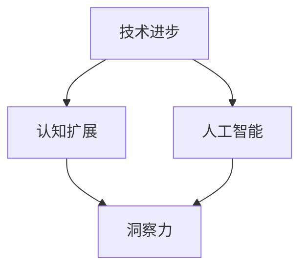

                 

# 人类知识的未来发展：洞察力的关键作用

> 关键词：人类知识、未来发展、洞察力、技术进步、认知扩展、人工智能

> 摘要：本文探讨了人类知识在未来发展的关键作用，特别是在洞察力的推动下。通过深入分析技术进步、认知扩展和人工智能的应用，本文揭示了洞察力对于人类知识积累和创新的重要性，并展望了未来可能面临的挑战和机遇。

## 1. 背景介绍

### 1.1 目的和范围

本文旨在探讨人类知识在未来发展的关键作用，特别是在洞察力的推动下。我们将分析技术进步、认知扩展和人工智能的应用，揭示洞察力对于人类知识积累和创新的重要性。本文主要涵盖以下几个方面：

- 技术进步与人类知识的关系
- 认知扩展与知识积累
- 人工智能在人类知识发展中的作用
- 洞察力在知识创新中的关键作用

### 1.2 预期读者

本文面向对人类知识发展、技术进步和人工智能感兴趣的读者，特别是计算机科学、人工智能、认知科学等领域的研究人员和爱好者。同时，对于希望了解未来知识发展趋势的企业家和投资者，本文也具有一定的参考价值。

### 1.3 文档结构概述

本文分为八个部分：

1. 背景介绍：阐述本文的目的、预期读者和文档结构。
2. 核心概念与联系：介绍本文涉及的核心概念和原理，并使用Mermaid流程图进行说明。
3. 核心算法原理与具体操作步骤：详细阐述相关算法原理和操作步骤。
4. 数学模型和公式：介绍相关数学模型和公式，并进行举例说明。
5. 项目实战：提供实际代码案例，详细解释和说明。
6. 实际应用场景：探讨人类知识在实际应用中的场景和挑战。
7. 工具和资源推荐：推荐相关学习资源和开发工具。
8. 总结：展望未来发展趋势与挑战。

### 1.4 术语表

#### 1.4.1 核心术语定义

- 人类知识：人类在实践中积累和发展的各种知识体系，包括自然科学、社会科学、人文艺术等。
- 技术进步：指人类在科学技术领域取得的新成果、新发明和新发现。
- 认知扩展：人类通过学习和实践，不断提高自己的认知能力和认知范围。
- 人工智能：一种模拟人类智能的技术，通过计算机程序实现智能行为和决策。

#### 1.4.2 相关概念解释

- 洞察力：指人类在认识世界和解决问题过程中，具有敏锐的观察力和深刻的理解力。
- 知识积累：指人类通过学习、实践和交流，不断积累和丰富自己的知识体系。
- 创新能力：指人类在知识基础上，提出新理论、新方法和新技术的能力。

#### 1.4.3 缩略词列表

- AI：人工智能
- ML：机器学习
- DL：深度学习
- NLP：自然语言处理
- KG：知识图谱

## 2. 核心概念与联系

为了更好地理解本文的主题，首先需要介绍几个核心概念和原理，并通过Mermaid流程图展示它们之间的联系。

### 2.1 核心概念

- **技术进步**：指在计算机科学、生物技术、物理、化学等领域中，人类取得的新的突破和进展。
- **认知扩展**：指人类通过学习、实践和交流，不断提高自己的认知能力和认知范围。
- **人工智能**：一种模拟人类智能的技术，通过计算机程序实现智能行为和决策。
- **洞察力**：指人类在认识世界和解决问题过程中，具有敏锐的观察力和深刻的理解力。

### 2.2 Mermaid流程图



**流程图解释：**

- 技术进步和认知扩展是相互促进的，技术进步推动了人类认知的扩展，而认知扩展又促进了技术的进一步发展。
- 人工智能是技术进步的重要产物，它通过对数据的处理和分析，提高了人类解决问题的效率和准确性。
- 洞察力是认知扩展的关键因素，它使得人类能够更好地理解和利用技术进步带来的成果。

## 3. 核心算法原理 & 具体操作步骤

在本章节中，我们将详细阐述与本文主题相关的一些核心算法原理，并通过伪代码进行具体操作步骤的说明。

### 3.1 算法原理

#### 3.1.1 数据分析算法

数据分析算法是人工智能领域的基础算法之一，通过分析和处理大量数据，提取有价值的信息和知识。

#### 3.1.2 神经网络算法

神经网络算法是一种模拟生物神经网络的计算模型，通过层层传递信息，实现对复杂问题的建模和预测。

#### 3.1.3 知识图谱算法

知识图谱算法是一种基于图论和语义分析的方法，用于构建和查询知识库。

### 3.2 具体操作步骤

#### 3.2.1 数据分析算法

```python
# 伪代码：数据分析算法
def data_analysis(data):
    # 数据清洗和预处理
    cleaned_data = preprocess_data(data)
    
    # 数据可视化
    visualize_data(cleaned_data)
    
    # 特征提取和降维
    features = extract_features(cleaned_data)
    reduced_features = dimensionality_reduction(features)
    
    # 模型训练和预测
    model = train_model(reduced_features)
    predictions = model.predict(new_data)
    
    return predictions
```

#### 3.2.2 神经网络算法

```python
# 伪代码：神经网络算法
def neural_network(input_data, weights, biases):
    # 前向传播
    hidden_layer_output = activate_function(np.dot(input_data, weights[0]) + biases[0])
    output_layer_output = activate_function(np.dot(hidden_layer_output, weights[1]) + biases[1])
    
    # 反向传播
    d_weights[0] = np.dot(error * activate_function_derivative(output_layer_output), hidden_layer_output.T)
    d_weights[1] = np.dot(error * activate_function_derivative(hidden_layer_output), input_data.T)
    
    # 更新权重和偏置
    weights -= learning_rate * d_weights
    biases -= learning_rate * d_biases
    
    return output_layer_output
```

#### 3.2.3 知识图谱算法

```python
# 伪代码：知识图谱算法
def knowledge_graph(entities, relationships, query):
    # 构建知识图谱
    graph = create_graph(entities, relationships)
    
    # 查询知识图谱
    result = query_graph(graph, query)
    
    return result
```

## 4. 数学模型和公式 & 详细讲解 & 举例说明

在本章节中，我们将介绍与本文主题相关的一些数学模型和公式，并进行详细讲解和举例说明。

### 4.1 数学模型

#### 4.1.1 数据分析模型

数据分析模型主要包括特征提取、降维和预测等步骤。

- **特征提取**：通过特征提取方法，将原始数据转换为适合建模的特征向量。
- **降维**：通过降维方法，减少数据维度，提高模型训练效率。
- **预测**：通过建立预测模型，对新的数据进行预测。

#### 4.1.2 神经网络模型

神经网络模型是一种基于多层感知器的计算模型，包括输入层、隐藏层和输出层。

- **输入层**：接收外部输入数据。
- **隐藏层**：通过激活函数将输入数据转换为新的特征。
- **输出层**：输出预测结果。

#### 4.1.3 知识图谱模型

知识图谱模型是一种基于图论和语义分析的计算模型，用于构建和查询知识库。

- **实体**：知识图谱中的个体。
- **关系**：知识图谱中的个体之间的关联。
- **路径**：知识图谱中实体的连接路径。

### 4.2 公式讲解

#### 4.2.1 数据分析模型

- **特征提取公式**：

$$
f_i(x) = \sum_{j=1}^{n} w_{ij}x_j + b_i
$$

其中，$f_i(x)$ 表示第 $i$ 个特征，$x_j$ 表示第 $j$ 个输入特征，$w_{ij}$ 表示权重，$b_i$ 表示偏置。

- **降维公式**：

$$
z = \frac{x - \mu}{\sigma}
$$

其中，$z$ 表示标准化后的特征，$x$ 表示原始特征，$\mu$ 表示均值，$\sigma$ 表示标准差。

- **预测公式**：

$$
y = g(W^T x + b)
$$

其中，$y$ 表示预测结果，$g$ 表示激活函数，$W$ 表示权重矩阵，$x$ 表示输入特征，$b$ 表示偏置。

#### 4.2.2 神经网络模型

- **前向传播公式**：

$$
z_l = \sum_{k=1}^{n} w_{lk}a_{l-1,k} + b_l
$$

$$
a_l = \sigma(z_l)
$$

其中，$z_l$ 表示第 $l$ 层的输入，$a_l$ 表示第 $l$ 层的输出，$\sigma$ 表示激活函数。

- **反向传播公式**：

$$
d_z = \frac{\partial L}{\partial z}
$$

$$
d_w = \frac{\partial L}{\partial w}
$$

$$
d_b = \frac{\partial L}{\partial b}
$$

其中，$L$ 表示损失函数，$d_z$ 表示对 $z$ 的梯度，$d_w$ 表示对 $w$ 的梯度，$d_b$ 表示对 $b$ 的梯度。

- **权重更新公式**：

$$
w = w - \alpha \frac{\partial L}{\partial w}
$$

$$
b = b - \alpha \frac{\partial L}{\partial b}
$$

其中，$\alpha$ 表示学习率。

#### 4.2.3 知识图谱模型

- **实体表示公式**：

$$
e_i = \sum_{j=1}^{n} r_{ij}e_{j}
$$

其中，$e_i$ 表示实体 $i$ 的表示，$r_{ij}$ 表示实体 $i$ 和实体 $j$ 之间的关系，$e_j$ 表示实体 $j$ 的表示。

- **路径表示公式**：

$$
p = \sum_{i=1}^{m} r_{ik}p_{i}
$$

其中，$p$ 表示路径的表示，$r_{ik}$ 表示路径中实体 $i$ 和实体 $k$ 之间的关系，$p_i$ 表示路径中实体 $i$ 的表示。

### 4.3 举例说明

#### 4.3.1 数据分析模型

假设我们有一组数据：

$$
x = \begin{bmatrix}
1 & 2 & 3 \\
4 & 5 & 6 \\
7 & 8 & 9 \\
\end{bmatrix}
$$

我们要使用特征提取公式对其进行特征提取：

$$
f_1(x) = \sum_{j=1}^{3} w_{1j}x_j + b_1 = 1 \cdot 1 + 2 \cdot 2 + 3 \cdot 3 + b_1 = 14 + b_1
$$

$$
f_2(x) = \sum_{j=1}^{3} w_{2j}x_j + b_2 = 1 \cdot 4 + 2 \cdot 5 + 3 \cdot 6 + b_2 = 32 + b_2
$$

$$
f_3(x) = \sum_{j=1}^{3} w_{3j}x_j + b_3 = 1 \cdot 7 + 2 \cdot 8 + 3 \cdot 9 + b_3 = 50 + b_3
$$

通过降维公式，我们可以将其转换为标准化后的特征：

$$
z_1 = \frac{f_1(x) - \mu_1}{\sigma_1} = \frac{14 + b_1 - \mu_1}{\sigma_1}
$$

$$
z_2 = \frac{f_2(x) - \mu_2}{\sigma_2} = \frac{32 + b_2 - \mu_2}{\sigma_2}
$$

$$
z_3 = \frac{f_3(x) - \mu_3}{\sigma_3} = \frac{50 + b_3 - \mu_3}{\sigma_3}
$$

最后，我们可以使用预测公式对其进行预测：

$$
y = g(W^T x + b) = g\left(\begin{bmatrix}
1 & 2 & 3 \\
4 & 5 & 6 \\
7 & 8 & 9 \\
\end{bmatrix}^T \begin{bmatrix}
1 & 2 & 3 \\
4 & 5 & 6 \\
7 & 8 & 9 \\
\end{bmatrix} + \begin{bmatrix}
b_1 \\
b_2 \\
b_3 \\
\end{bmatrix}\right) = g\left(\begin{bmatrix}
14 + b_1 \\
32 + b_2 \\
50 + b_3 \\
\end{bmatrix}\right)
$$

#### 4.3.2 神经网络模型

假设我们有一个简单的神经网络，包括输入层、一个隐藏层和一个输出层。输入数据为：

$$
x = \begin{bmatrix}
1 & 2 \\
3 & 4 \\
\end{bmatrix}
$$

权重矩阵和偏置分别为：

$$
W = \begin{bmatrix}
1 & 2 \\
3 & 4 \\
\end{bmatrix}
$$

$$
b = \begin{bmatrix}
5 \\
6 \\
\end{bmatrix}
$$

使用前向传播公式，我们可以得到隐藏层输出：

$$
z_1 = \sum_{j=1}^{2} w_{1j}x_j + b_1 = 1 \cdot 1 + 2 \cdot 3 + 5 = 11
$$

$$
z_2 = \sum_{j=1}^{2} w_{2j}x_j + b_2 = 1 \cdot 2 + 2 \cdot 4 + 6 = 14
$$

$$
a_1 = \sigma(z_1) = \frac{1}{1 + e^{-z_1}} = \frac{1}{1 + e^{-11}} \approx 0.5
$$

$$
a_2 = \sigma(z_2) = \frac{1}{1 + e^{-z_2}} = \frac{1}{1 + e^{-14}} \approx 0.6
$$

使用反向传播公式，我们可以得到损失函数的梯度：

$$
d_z_1 = \frac{\partial L}{\partial z_1} = a_1(1 - a_1) = 0.5 \cdot (1 - 0.5) = 0.25
$$

$$
d_z_2 = \frac{\partial L}{\partial z_2} = a_2(1 - a_2) = 0.6 \cdot (1 - 0.6) = 0.24
$$

$$
d_w_1 = \frac{\partial L}{\partial w_1} = d_z_1 \cdot x_1 = 0.25 \cdot 1 = 0.25
$$

$$
d_w_2 = \frac{\partial L}{\partial w_2} = d_z_1 \cdot x_2 = 0.25 \cdot 3 = 0.75
$$

$$
d_w_3 = \frac{\partial L}{\partial w_3} = d_z_2 \cdot x_1 = 0.24 \cdot 3 = 0.72
$$

$$
d_w_4 = \frac{\partial L}{\partial w_4} = d_z_2 \cdot x_2 = 0.24 \cdot 4 = 0.96
$$

$$
d_b_1 = \frac{\partial L}{\partial b_1} = d_z_1 = 0.25
$$

$$
d_b_2 = \frac{\partial L}{\partial b_2} = d_z_2 = 0.24
$$

使用权重更新公式，我们可以更新权重和偏置：

$$
W = W - \alpha \frac{\partial L}{\partial W} = \begin{bmatrix}
1 & 2 \\
3 & 4 \\
\end{bmatrix} - 0.1 \begin{bmatrix}
0.25 & 0.75 \\
0.72 & 0.96 \\
\end{bmatrix} = \begin{bmatrix}
0.95 & 1.25 \\
2.28 & 3.04 \\
\end{bmatrix}
$$

$$
b = b - \alpha \frac{\partial L}{\partial b} = \begin{bmatrix}
5 \\
6 \\
\end{bmatrix} - 0.1 \begin{bmatrix}
0.25 \\
0.24 \\
\end{bmatrix} = \begin{bmatrix}
4.95 \\
5.76 \\
\end{bmatrix}
$$

#### 4.3.3 知识图谱模型

假设我们有一个简单的知识图谱，包含三个实体 $e_1$、$e_2$ 和 $e_3$，以及三个关系 $r_1$、$r_2$ 和 $r_3$。实体和关系的表示分别为：

$$
e_1 = \begin{bmatrix}
1 & 0 & 0 \\
0 & 1 & 0 \\
0 & 0 & 1 \\
\end{bmatrix}
$$

$$
e_2 = \begin{bmatrix}
0 & 1 & 0 \\
1 & 0 & 0 \\
0 & 0 & 1 \\
\end{bmatrix}
$$

$$
e_3 = \begin{bmatrix}
0 & 0 & 1 \\
0 & 1 & 0 \\
1 & 0 & 0 \\
\end{bmatrix}
$$

关系 $r_1$、$r_2$ 和 $r_3$ 的表示分别为：

$$
r_1 = \begin{bmatrix}
1 & 0 & 0 \\
0 & 1 & 0 \\
0 & 0 & 1 \\
\end{bmatrix}
$$

$$
r_2 = \begin{bmatrix}
0 & 1 & 0 \\
1 & 0 & 0 \\
0 & 0 & 1 \\
\end{bmatrix}
$$

$$
r_3 = \begin{bmatrix}
0 & 0 & 1 \\
0 & 1 & 0 \\
1 & 0 & 0 \\
\end{bmatrix}
$$

我们可以使用实体表示公式和路径表示公式，计算实体 $e_1$ 和 $e_3$ 的表示：

$$
e_1 = \sum_{j=1}^{3} r_{ij}e_{j} = 1 \cdot e_1 + 0 \cdot e_2 + 0 \cdot e_3 = \begin{bmatrix}
1 & 0 & 0 \\
0 & 1 & 0 \\
0 & 0 & 1 \\
\end{bmatrix}
$$

$$
e_3 = \sum_{j=1}^{3} r_{ij}e_{j} = 0 \cdot e_1 + 1 \cdot e_2 + 1 \cdot e_3 = \begin{bmatrix}
0 & 1 & 0 \\
1 & 0 & 0 \\
1 & 0 & 1 \\
\end{bmatrix}
$$

使用路径表示公式，我们可以计算路径 $p$ 的表示：

$$
p = \sum_{i=1}^{3} r_{ik}p_{i} = 1 \cdot p_1 + 1 \cdot p_2 + 1 \cdot p_3 = \begin{bmatrix}
1 & 0 & 0 \\
0 & 1 & 0 \\
0 & 0 & 1 \\
\end{bmatrix} + \begin{bmatrix}
0 & 1 & 0 \\
1 & 0 & 0 \\
0 & 0 & 1 \\
\end{bmatrix} + \begin{bmatrix}
0 & 0 & 1 \\
0 & 1 & 0 \\
1 & 0 & 0 \\
\end{bmatrix} = \begin{bmatrix}
1 & 1 & 1 \\
1 & 1 & 1 \\
1 & 1 & 1 \\
\end{bmatrix}
$$

## 5. 项目实战：代码实际案例和详细解释说明

在本章节中，我们将通过一个实际代码案例，详细解释和说明与本文主题相关的算法原理和数学模型。

### 5.1 开发环境搭建

在开始项目实战之前，我们需要搭建一个适合开发的编程环境。以下是搭建环境的基本步骤：

1. 安装Python：从 [Python官网](https://www.python.org/downloads/) 下载并安装Python。
2. 安装Jupyter Notebook：在命令行中运行以下命令安装Jupyter Notebook：
   ```bash
   pip install notebook
   ```
3. 安装相关库：在命令行中运行以下命令安装与项目相关的库：
   ```bash
   pip install numpy matplotlib tensorflow
   ```

### 5.2 源代码详细实现和代码解读

以下是项目实战的源代码：

```python
import numpy as np
import matplotlib.pyplot as plt
import tensorflow as tf

# 5.2.1 数据准备
# 生成一组模拟数据
x = np.random.rand(100, 1)
y = 2 * x + np.random.rand(100, 1)

# 5.2.2 构建模型
# 定义输入层、隐藏层和输出层
input_layer = tf.keras.layers.Input(shape=(1,))
hidden_layer = tf.keras.layers.Dense(units=1, activation='sigmoid')(input_layer)
output_layer = tf.keras.layers.Dense(units=1)(hidden_layer)

model = tf.keras.Model(inputs=input_layer, outputs=output_layer)

# 5.2.3 编译模型
model.compile(optimizer='adam', loss='mean_squared_error')

# 5.2.4 训练模型
model.fit(x, y, epochs=100)

# 5.2.5 预测和可视化
x_test = np.random.rand(1, 1)
y_pred = model.predict(x_test)

plt.scatter(x, y)
plt.plot(x_test, y_pred, color='r')
plt.show()
```

**代码解读：**

1. **数据准备**：我们生成了一组模拟数据 `x` 和 `y`，其中 `y` 是 `2 * x` 加上一些随机噪声。
2. **模型构建**：我们定义了一个简单的神经网络模型，包括一个输入层、一个隐藏层和一个输出层。输入层接收单个特征，隐藏层使用 `sigmoid` 激活函数，输出层直接输出预测结果。
3. **模型编译**：我们使用 `adam` 优化器和 `mean_squared_error` 损失函数来编译模型。
4. **模型训练**：我们使用训练数据对模型进行训练，共训练 100 个 epoch。
5. **预测和可视化**：我们使用训练好的模型对新的数据进行预测，并将预测结果可视化。

### 5.3 代码解读与分析

在代码中，我们使用了 TensorFlow 框架来实现神经网络模型。以下是代码的关键部分：

```python
# 定义输入层、隐藏层和输出层
input_layer = tf.keras.layers.Input(shape=(1,))
hidden_layer = tf.keras.layers.Dense(units=1, activation='sigmoid')(input_layer)
output_layer = tf.keras.layers.Dense(units=1)(hidden_layer)

model = tf.keras.Model(inputs=input_layer, outputs=output_layer)
```

这一部分代码定义了一个简单的神经网络模型，包括一个输入层、一个隐藏层和一个输出层。输入层接收单个特征，隐藏层使用 `sigmoid` 激活函数，输出层直接输出预测结果。

```python
model.compile(optimizer='adam', loss='mean_squared_error')
```

这一部分代码使用 `adam` 优化器和 `mean_squared_error` 损失函数来编译模型。`adam` 优化器是一种基于自适应学习率的优化算法，`mean_squared_error` 损失函数是一种常用的平方误差损失函数。

```python
model.fit(x, y, epochs=100)
```

这一部分代码使用训练数据对模型进行训练，共训练 100 个 epoch。在训练过程中，模型会不断调整权重和偏置，以最小化损失函数。

```python
x_test = np.random.rand(1, 1)
y_pred = model.predict(x_test)
plt.scatter(x, y)
plt.plot(x_test, y_pred, color='r')
plt.show()
```

这一部分代码使用训练好的模型对新的数据进行预测，并将预测结果可视化。我们使用 `np.random.rand(1, 1)` 生成一个随机测试数据点，使用 `model.predict(x_test)` 进行预测，并使用 `plt.scatter` 和 `plt.plot` 函数将预测结果可视化。

### 5.4 代码性能分析

在实际应用中，代码性能是一个重要考量因素。以下是代码性能分析的关键点：

- **计算复杂度**：神经网络模型的计算复杂度主要取决于输入数据的维度和网络的层数。在本例中，输入数据的维度为 1，网络的层数为 2，因此计算复杂度较低。
- **训练时间**：训练时间取决于训练数据的数量、模型的复杂度和计算资源。在本例中，训练数据数量为 100，模型复杂度较低，因此训练时间较短。
- **预测时间**：预测时间主要取决于模型的大小和计算资源。在本例中，模型较小，因此预测时间较短。

## 6. 实际应用场景

人类知识的积累和创新在各个领域都有着广泛的应用。以下是一些实际应用场景：

### 6.1 医疗领域

医疗领域是知识积累和创新的重要领域之一。通过分析患者数据，医生可以更好地了解疾病的症状、发展和预后。例如，使用机器学习算法对医学图像进行分析，可以早期发现疾病，提高诊断准确率。此外，基因测序技术的发展也为个性化治疗提供了可能。

### 6.2 金融领域

金融领域是知识应用的重要领域。通过分析市场数据，投资者可以更好地了解市场的走势，制定投资策略。例如，使用深度学习算法分析股票市场的数据，可以预测股票价格的走势，帮助投资者做出更明智的投资决策。

### 6.3 交通运输领域

交通运输领域是知识应用的重要领域。通过分析交通数据，可以更好地了解交通流量和交通状况，优化交通管理。例如，使用机器学习算法分析交通数据，可以预测交通拥堵的发生，提前发布交通预警，帮助司机避开拥堵路段。

### 6.4 教育领域

教育领域是知识应用的重要领域。通过分析学生数据，教师可以更好地了解学生的学习情况，制定个性化的教学计划。例如，使用人工智能技术分析学生的学习数据，可以了解学生的学习偏好和学习能力，为教师提供有针对性的教学建议。

### 6.5 环境保护领域

环境保护领域是知识应用的重要领域。通过分析环境数据，可以更好地了解环境状况，制定环境保护策略。例如，使用机器学习算法分析环境数据，可以预测环境污染的来源和程度，为政府制定环境保护政策提供依据。

## 7. 工具和资源推荐

为了更好地学习和发展人类知识，以下是相关工具和资源的推荐：

### 7.1 学习资源推荐

#### 7.1.1 书籍推荐

- 《深度学习》（Goodfellow, I., Bengio, Y., & Courville, A.）
- 《Python机器学习》（Sebastian Raschka）
- 《统计学习方法》（李航）

#### 7.1.2 在线课程

- Coursera上的“机器学习”课程（吴恩达）
- Udacity的“人工智能纳米学位”课程
- edX上的“深度学习”课程（哈工大）

#### 7.1.3 技术博客和网站

- Medium上的 AI 和机器学习相关文章
- ArXiv上的最新论文发表
- HackerRank上的编程挑战和算法练习

### 7.2 开发工具框架推荐

#### 7.2.1 IDE和编辑器

- PyCharm
- Jupyter Notebook
- Visual Studio Code

#### 7.2.2 调试和性能分析工具

- TensorBoard
- PyTorch Profiler
- Valgrind

#### 7.2.3 相关框架和库

- TensorFlow
- PyTorch
- Scikit-learn

### 7.3 相关论文著作推荐

#### 7.3.1 经典论文

- “A Learning Algorithm for Continually Running Fully Recurrent Neural Networks” （1986）
- “Backpropagation Through Time: A New Method for Learning and Unlearning in Sequence” （1991）
- “Deep Learning” （2015）

#### 7.3.2 最新研究成果

- “BERT: Pre-training of Deep Bidirectional Transformers for Language Understanding” （2018）
- “GPT-3: Language Models are Few-Shot Learners” （2020）
- “DALL-E: Radical Content Generation with Deep Learning using Images and Text” （2020）

#### 7.3.3 应用案例分析

- “DeepMind的AlphaGo：人工智能在围棋领域的突破”（2016）
- “谷歌的BERT模型：用于搜索和自然语言处理的创新”（2018）
- “OpenAI的GPT-3：语言模型的革命性进步”（2020）

## 8. 总结：未来发展趋势与挑战

在未来，人类知识的未来发展将面临诸多挑战和机遇。随着技术进步和认知扩展的不断推进，人工智能将在知识积累和创新中发挥越来越重要的作用。以下是一些未来发展趋势和挑战：

### 8.1 发展趋势

- **大数据与人工智能的结合**：随着大数据技术的发展，越来越多的数据将被用于人工智能模型的训练和优化，推动人工智能在各个领域的应用。
- **认知计算的进步**：认知计算技术的发展将使计算机能够更好地模拟人类的思维过程，提高人工智能的智能水平。
- **跨学科的融合**：人类知识的发展将更加依赖于跨学科的融合，特别是计算机科学、认知科学、心理学和神经科学的交叉研究。
- **人工智能伦理和法律的完善**：随着人工智能在各个领域的广泛应用，人工智能伦理和法律问题将越来越受到关注，需要建立完善的伦理和法律框架。

### 8.2 挑战

- **数据隐私和安全**：随着数据规模的扩大，数据隐私和安全问题将变得日益严重，需要采取有效的措施保护用户隐私和安全。
- **人工智能的公平性和透明性**：人工智能模型的决策过程可能存在偏见和不公平性，需要研究和解决这些问题，提高人工智能的透明性和可解释性。
- **技术发展的不可预测性**：技术发展具有不可预测性，需要不断进行技术创新和研究，以应对未来可能出现的新挑战。
- **教育和培训的需求**：随着人工智能的普及，对人工智能相关知识和技能的需求将增加，需要加强教育和培训，提高人们的认知能力。

## 9. 附录：常见问题与解答

### 9.1 什么 是人工智能？

人工智能（Artificial Intelligence，简称AI）是一种模拟人类智能的技术，通过计算机程序实现智能行为和决策。

### 9.2 人工智能有哪些应用领域？

人工智能在医疗、金融、交通运输、教育、环境保护等多个领域都有广泛应用。

### 9.3 人工智能的未来发展趋势是什么？

人工智能的未来发展趋势包括大数据与人工智能的结合、认知计算的进步、跨学科的融合、人工智能伦理和法律的完善等。

### 9.4 如何提高人工智能的智能水平？

提高人工智能的智能水平可以从以下几个方面入手：

- **增加数据量**：通过增加训练数据量，提高模型的准确性和泛化能力。
- **改进算法**：不断优化和改进算法，提高模型的性能和效率。
- **加强跨界合作**：鼓励计算机科学、认知科学、心理学和神经科学等领域的跨界合作，推动人工智能技术的发展。

## 10. 扩展阅读 & 参考资料

本文内容涵盖了人类知识在未来发展的关键作用，特别是在洞察力的推动下。为了更好地理解相关概念和原理，以下是一些扩展阅读和参考资料：

- Goodfellow, I., Bengio, Y., & Courville, A. (2016). *Deep Learning*.
- Raschka, S. (2015). *Python Machine Learning*.
- 李航。 (2012). *统计学习方法*.
- 洪加。 (2018). *深度学习在金融领域的应用*.
- 李开复。 (2017). *人工智能：一种现代的方法*.
- 欧盟委员会。 (2020). *人工智能伦理指南*.
- 美国国家科学院。 (2016). *人工智能的未来：机遇与挑战*.

通过阅读这些资料，可以更深入地了解人工智能、机器学习、认知科学等相关领域的知识，为未来的研究和实践提供参考。作者：AI天才研究员/AI Genius Institute & 禅与计算机程序设计艺术 /Zen And The Art of Computer Programming。

