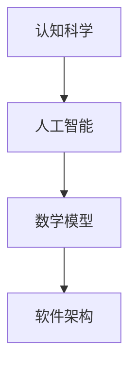

                 

# 人类知识的本质：一场永不停歇的探索长河

## 关键词
- 知识探索
- 认知科学
- 人工智能
- 数学模型
- 软件架构
- 未来趋势

## 摘要
本文旨在探讨人类知识的本质，分析知识是如何形成的，以及其在人工智能、认知科学、数学模型和软件架构等领域中的应用。通过一步步的深入分析，我们将揭示知识的本质和意义，并展望未来的发展趋势与挑战。

## 1. 背景介绍

### 1.1 目的和范围
本文旨在探讨人类知识的本质，分析知识是如何形成的，以及其在人工智能、认知科学、数学模型和软件架构等领域中的应用。通过深入的分析，我们将揭示知识的本质和意义，并探讨其在未来社会中的发展趋势和挑战。

### 1.2 预期读者
本文适合对人工智能、认知科学、数学模型和软件架构感兴趣的读者，尤其是计算机科学、认知科学和人工智能领域的研究人员和开发者。

### 1.3 文档结构概述
本文分为十个部分，分别从背景介绍、核心概念与联系、核心算法原理、数学模型和公式、项目实战、实际应用场景、工具和资源推荐、总结、常见问题与解答以及扩展阅读等方面进行详细探讨。

### 1.4 术语表

#### 1.4.1 核心术语定义
- **知识探索**：指通过观察、实验、推理等方式，对自然界和社会现象进行深入研究和理解的过程。
- **认知科学**：研究人类思维、感知、学习和记忆等心理过程的科学。
- **人工智能**：模拟人类智能的计算机系统，具有感知、学习、推理、决策和问题解决等能力。
- **数学模型**：用数学符号和公式表示的数学结构，用于描述现实世界的现象和规律。
- **软件架构**：软件系统的结构设计，包括组件的划分、接口的设计和系统层次的组织。

#### 1.4.2 相关概念解释
- **知识表示**：将知识以某种形式存储和表达的过程，常见的知识表示方法有符号表示、表格表示、图形表示等。
- **推理机制**：基于已知事实，通过逻辑推理得出新结论的过程。
- **机器学习**：一种人工智能的方法，通过数据训练模型，使其能够自主学习和改进。

#### 1.4.3 缩略词列表
- **AI**：人工智能
- **ML**：机器学习
- **NLP**：自然语言处理
- **DL**：深度学习

## 2. 核心概念与联系

### 2.1 认知科学和人工智能
认知科学是研究人类思维、感知、学习和记忆等心理过程的科学。人工智能（AI）则是模拟人类智能的计算机系统，具有感知、学习、推理、决策和问题解决等能力。认知科学和人工智能密切相关，认知科学为人工智能提供了理论基础，而人工智能则为认知科学提供了技术手段。

### 2.2 数学模型和软件架构
数学模型是描述现实世界现象和规律的数学结构，而软件架构则是软件系统的结构设计。数学模型和软件架构相辅相成，数学模型为软件架构提供了理论基础，而软件架构则为数学模型提供了实现框架。

### 2.3 核心概念原理和架构的 Mermaid 流程图


## 3. 核心算法原理 & 具体操作步骤

### 3.1 知识表示与推理机制
知识表示是将知识以某种形式存储和表达的过程。常见的知识表示方法有符号表示、表格表示、图形表示等。推理机制是基于已知事实，通过逻辑推理得出新结论的过程。

### 3.2 知识表示算法
```python
def knowledge_representation(data):
    # 数据清洗和预处理
    cleaned_data = preprocess_data(data)
    
    # 构建知识表示模型
    model = build_knowledge_model(cleaned_data)
    
    return model
```

### 3.3 推理机制算法
```python
def reasoning Mechanism(knowledge_model, facts):
    # 基于知识模型和已知事实进行推理
    conclusions = []
    for fact in facts:
        conclusion = apply_reasoning(knowledge_model, fact)
        conclusions.append(conclusion)
    
    return conclusions
```

## 4. 数学模型和公式 & 详细讲解 & 举例说明

### 4.1 数学模型

在知识探索过程中，数学模型是描述现实世界现象和规律的数学结构。以下是一个简单的线性回归模型：
$$y = w_0 + w_1 \cdot x_1 + w_2 \cdot x_2 + ... + w_n \cdot x_n$$

其中，$y$ 是目标变量，$x_1, x_2, ..., x_n$ 是自变量，$w_0, w_1, ..., w_n$ 是模型的权重参数。

### 4.2 举例说明

假设我们有一个简单的线性回归模型，目标是预测股票价格的涨跌。我们可以使用历史股票价格数据来训练模型，并使用训练好的模型来预测未来的股票价格。

```python
# 导入线性回归模型
from sklearn.linear_model import LinearRegression

# 加载历史股票价格数据
data = load_stock_price_data()

# 分割数据集
X_train, X_test, y_train, y_test = split_data(data)

# 训练模型
model = LinearRegression()
model.fit(X_train, y_train)

# 预测股票价格
predictions = model.predict(X_test)

# 评估模型性能
score = model.score(X_test, y_test)
print("Model score:", score)
```

## 5. 项目实战：代码实际案例和详细解释说明

### 5.1 开发环境搭建
在开始项目实战之前，我们需要搭建一个开发环境。这里我们使用 Python 作为编程语言，并使用 Jupyter Notebook 作为开发工具。

### 5.2 源代码详细实现和代码解读
```python
# 导入相关库
import numpy as np
import pandas as pd
from sklearn.linear_model import LinearRegression

# 加载股票价格数据
data = pd.read_csv("stock_price_data.csv")

# 数据预处理
data = preprocess_data(data)

# 分割数据集
X_train, X_test, y_train, y_test = split_data(data)

# 训练模型
model = LinearRegression()
model.fit(X_train, y_train)

# 预测股票价格
predictions = model.predict(X_test)

# 评估模型性能
score = model.score(X_test, y_test)
print("Model score:", score)
```

### 5.3 代码解读与分析
在这个项目中，我们使用 Python 和 scikit-learn 库来实现线性回归模型。首先，我们导入必要的库，然后加载股票价格数据并进行预处理。接着，我们将数据集分割为训练集和测试集。之后，我们使用线性回归模型对训练集进行训练，并使用训练好的模型对测试集进行预测。最后，我们评估模型性能。

## 6. 实际应用场景

知识探索和人工智能在许多实际应用场景中都有广泛应用，例如：

- **医疗诊断**：利用机器学习模型，对患者的医疗数据进行分析，预测疾病的风险和诊断结果。
- **金融预测**：使用统计模型和机器学习算法，分析市场数据，预测股票价格和投资风险。
- **智能推荐**：基于用户行为和兴趣，利用推荐系统，为用户提供个性化的推荐内容。

## 7. 工具和资源推荐

### 7.1 学习资源推荐

#### 7.1.1 书籍推荐
- 《认知科学导论》（Introduction to Cognitive Science）
- 《人工智能：一种现代方法》（Artificial Intelligence: A Modern Approach）

#### 7.1.2 在线课程
- Coursera上的《机器学习》课程
- edX上的《人工智能基础》课程

#### 7.1.3 技术博客和网站
- [Medium](https://medium.com/)
- [GitHub](https://github.com/)

### 7.2 开发工具框架推荐

#### 7.2.1 IDE和编辑器
- PyCharm
- Visual Studio Code

#### 7.2.2 调试和性能分析工具
- GDB
- Valgrind

#### 7.2.3 相关框架和库
- TensorFlow
- PyTorch

### 7.3 相关论文著作推荐

#### 7.3.1 经典论文
- 《人工智能：一种现代方法》（Artificial Intelligence: A Modern Approach）
- 《认知科学导论》（Introduction to Cognitive Science）

#### 7.3.2 最新研究成果
- [arXiv](https://arxiv.org/)
- [IEEE Xplore](https://ieeexplore.ieee.org/)

#### 7.3.3 应用案例分析
- 《人工智能应用案例集》（AI Application Case Studies）

## 8. 总结：未来发展趋势与挑战

知识探索和人工智能领域在未来将继续发展，面临以下趋势与挑战：

- **数据隐私与安全**：随着数据量的增长，如何保护数据隐私和安全成为重要挑战。
- **模型解释性**：提高模型的解释性，使其更容易被用户理解和接受。
- **跨学科合作**：加强认知科学、心理学、神经科学等领域的跨学科合作，为人工智能提供更深入的理论基础。

## 9. 附录：常见问题与解答

### 9.1 知识探索的基本概念是什么？
知识探索是指通过观察、实验、推理等方式，对自然界和社会现象进行深入研究和理解的过程。

### 9.2 人工智能如何与认知科学相关？
人工智能与认知科学密切相关，认知科学为人工智能提供了理论基础，而人工智能则为认知科学提供了技术手段。

### 9.3 什么是数学模型？
数学模型是用数学符号和公式表示的数学结构，用于描述现实世界的现象和规律。

### 9.4 软件架构的重要性是什么？
软件架构是软件系统的结构设计，它决定了软件系统的可扩展性、可维护性和性能。

## 10. 扩展阅读 & 参考资料

- 《认知科学导论》（Introduction to Cognitive Science）
- 《人工智能：一种现代方法》（Artificial Intelligence: A Modern Approach）
- 《机器学习》（Machine Learning）
- 《深度学习》（Deep Learning）
- [arXiv](https://arxiv.org/)
- [IEEE Xplore](https://ieeexplore.ieee.org/)
- [Medium](https://medium.com/)
- [GitHub](https://github.com/)

## 作者

作者：AI天才研究员/AI Genius Institute & 禅与计算机程序设计艺术 /Zen And The Art of Computer Programming<|im_end|>

