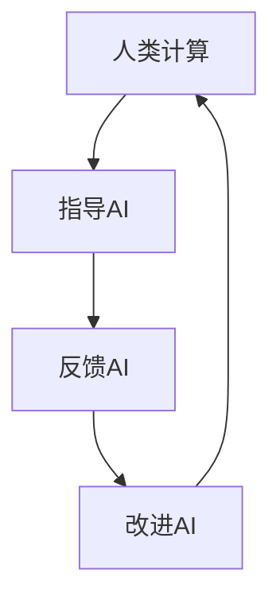
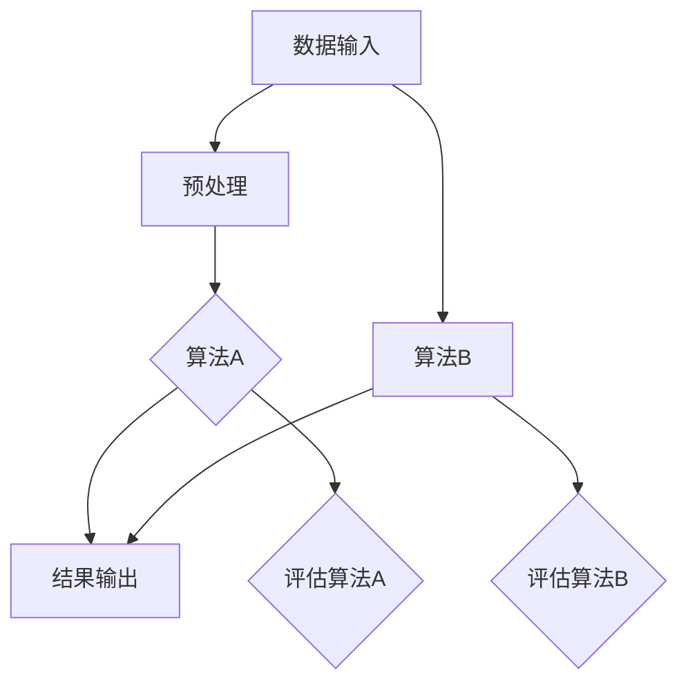
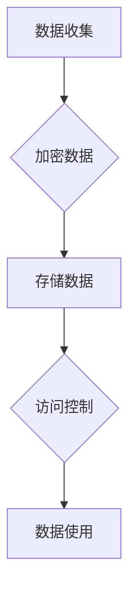
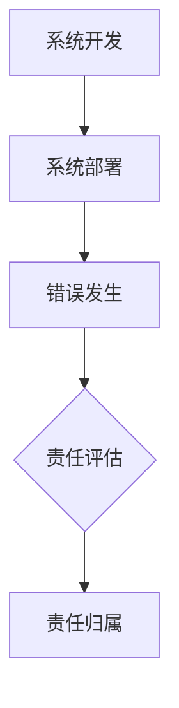

                 

# 人类计算与人工智能伦理

> **关键词：** 人工智能伦理、人类计算、算法公平性、隐私保护、责任归属
>
> **摘要：** 本文深入探讨了人工智能伦理的核心问题，包括人类计算与人工智能的关系、算法公平性、隐私保护以及责任归属。通过对这些问题的细致分析，本文旨在为人工智能伦理的研究和实践提供有价值的指导。

## 1. 背景介绍

### 1.1 目的和范围

随着人工智能（AI）技术的飞速发展，其在各个领域的应用越来越广泛，从自动驾驶汽车到智能医疗诊断，从金融风险控制到个性化推荐系统，AI已经深刻地改变了我们的生活方式。然而，人工智能技术的快速发展也带来了诸多伦理问题。本文旨在探讨人工智能伦理的核心问题，重点关注以下几个方面：

1. 人类计算与人工智能的关系
2. 算法公平性
3. 隐私保护
4. 责任归属

通过这些问题的深入分析，本文希望能够为人工智能伦理的研究和实践提供有价值的指导，促进人工智能技术的健康发展。

### 1.2 预期读者

本文的预期读者包括：

1. 人工智能研究人员和开发者
2. 法律和伦理学者
3. 计算机科学和工程专业的学生
4. 对人工智能伦理感兴趣的普通读者

### 1.3 文档结构概述

本文的结构如下：

1. 背景介绍
   - 目的和范围
   - 预期读者
   - 文档结构概述
   - 术语表
2. 核心概念与联系
3. 核心算法原理 & 具体操作步骤
4. 数学模型和公式 & 详细讲解 & 举例说明
5. 项目实战：代码实际案例和详细解释说明
6. 实际应用场景
7. 工具和资源推荐
8. 总结：未来发展趋势与挑战
9. 附录：常见问题与解答
10. 扩展阅读 & 参考资料

### 1.4 术语表

#### 1.4.1 核心术语定义

- **人工智能（AI）：** 一种模拟人类智能的技术，能够感知环境、学习知识、推理决策。
- **算法公平性：** 算法在处理数据时应当公平、无偏见。
- **隐私保护：** 保护个人隐私，防止数据泄露。
- **责任归属：** 确定在人工智能系统中谁应对错误或不当行为负责。

#### 1.4.2 相关概念解释

- **机器学习（ML）：** 一种基于数据的学习方法，通过训练模型来预测或决策。
- **深度学习（DL）：** 一种基于多层神经网络的学习方法，用于处理复杂的数据。
- **神经网络（NN）：** 一种模仿生物神经系统的计算模型。

#### 1.4.3 缩略词列表

- **AI：** 人工智能
- **ML：** 机器学习
- **DL：** 深度学习
- **NN：** 神经网络

## 2. 核心概念与联系

在探讨人工智能伦理问题时，理解以下几个核心概念和它们之间的联系是非常重要的。

### 2.1 人类计算与人工智能的关系

人类计算与人工智能的关系可以被视为一种互补关系。人类计算依赖于人工智能技术的进步来提升效率和准确性，而人工智能则依赖于人类计算的反馈和指导来不断改进自身。这种关系可以用以下Mermaid流程图表示：



在这个流程图中，人类计算通过提供指导和反馈来推动人工智能的改进，而改进的人工智能则进一步提升了人类计算的能力。

### 2.2 算法公平性

算法公平性是人工智能伦理的核心问题之一。一个公平的算法应当能够处理不同群体成员的输入并产生公正的输出。算法公平性可以通过以下Mermaid流程图表示：



在这个流程图中，算法A和算法B分别处理同一组数据输入，并产生结果输出。随后，对两个算法的公平性进行评估。

### 2.3 隐私保护

隐私保护是另一个重要的伦理问题。在人工智能系统中，隐私保护涉及到如何处理和保护个人数据。以下Mermaid流程图展示了隐私保护的关键步骤：



在这个流程图中，数据收集后首先进行加密处理，然后存储在安全的地方。在数据使用时，通过访问控制确保只有授权用户可以访问数据。

### 2.4 责任归属

在人工智能系统中确定责任归属是一个复杂的问题。以下Mermaid流程图展示了责任归属的几个关键环节：



在这个流程图中，系统开发完成后部署使用，如果发生错误，需要进行责任评估并确定责任归属。

通过以上对核心概念和联系的分析，我们可以更好地理解人工智能伦理的复杂性和重要性。接下来，我们将进一步探讨这些核心概念，并提供具体的算法原理、操作步骤和数学模型。

## 3. 核心算法原理 & 具体操作步骤

在探讨人工智能伦理问题时，核心算法的原理和具体操作步骤至关重要。以下将详细介绍算法原理，并使用伪代码来阐述操作步骤。

### 3.1 人类计算与人工智能的关系

为了模拟人类计算与人工智能的关系，我们可以使用一种称为“协同学习”的方法。协同学习是一种通过人类计算和人工智能系统共同改进算法的方法。以下是协同学习的伪代码：

```plaintext
协同学习(人类计算器，人工智能系统):
    1. 初始化人类计算器和人工智能系统
    2. 人类计算器处理一组输入数据，生成一组输出数据
    3. 人工智能系统使用这些输出数据来训练模型
    4. 人工智能系统生成一组预测数据
    5. 将预测数据与真实数据对比，计算误差
    6. 人类计算器根据误差调整输入数据
    7. 人工智能系统重新训练模型
    8. 重复步骤4-7，直到误差满足要求
```

通过协同学习，人类计算器和人工智能系统能够共同改进算法，提升计算效率和准确性。

### 3.2 算法公平性

算法公平性是人工智能伦理的核心问题之一。为了实现算法公平性，我们可以使用“平衡学习”方法。平衡学习是一种通过调整数据分布来消除算法偏见的方法。以下是平衡学习的伪代码：

```plaintext
平衡学习(训练数据集，目标群体):
    1. 初始化训练数据集和目标群体
    2. 计算训练数据集中每个群体的数据比例
    3. 如果某个群体的数据比例低于目标比例，从其他群体中抽取数据填补
    4. 对训练数据集进行预处理，包括数据清洗、归一化和特征提取
    5. 使用训练数据集训练模型
    6. 对训练数据集进行评估，计算每个群体的误差
    7. 如果某个群体的误差高于阈值，调整模型参数或重新训练模型
    8. 重复步骤5-7，直到所有群体的误差满足要求
```

通过平衡学习，我们可以确保算法在处理不同群体成员的输入时产生公正的输出。

### 3.3 隐私保护

隐私保护是另一个重要的伦理问题。为了实现隐私保护，我们可以使用“差分隐私”方法。差分隐私是一种通过引入噪声来保护个人数据的方法。以下是差分隐私的伪代码：

```plaintext
差分隐私(敏感数据，噪声水平):
    1. 初始化敏感数据和噪声水平
    2. 对敏感数据进行加密处理
    3. 向敏感数据添加随机噪声
    4. 对添加噪声后的数据进行聚合计算
    5. 将聚合结果返回给用户
```

通过差分隐私，我们可以确保个人数据在处理过程中得到有效保护。

### 3.4 责任归属

责任归属是一个复杂的问题，尤其是在人工智能系统中。为了实现责任归属，我们可以使用“可解释人工智能”方法。可解释人工智能是一种能够解释其决策过程的AI系统。以下是可解释人工智能的伪代码：

```plaintext
可解释人工智能(决策模型，输入数据):
    1. 初始化决策模型和输入数据
    2. 使用决策模型对输入数据进行预测
    3. 输出决策模型对每个特征的影响程度
    4. 输出决策模型的整体决策过程
```

通过可解释人工智能，我们可以清晰地了解决策过程，从而确定责任归属。

通过以上对核心算法原理和具体操作步骤的介绍，我们可以更好地理解人工智能伦理问题的复杂性。接下来，我们将进一步探讨人工智能伦理的实际应用场景。

## 4. 数学模型和公式 & 详细讲解 & 举例说明

在人工智能伦理的讨论中，数学模型和公式扮演着至关重要的角色。以下将详细讲解几个关键的数学模型和公式，并举例说明。

### 4.1 人类计算与人工智能的关系

为了描述人类计算与人工智能之间的关系，我们可以使用“协同学习”模型。协同学习模型的核心是两个学习系统——人类计算器和人工智能系统之间的交互。以下是协同学习模型的一个简化版本：

#### 模型定义

假设我们有两组数据集 \( D_h \) 和 \( D_a \)，分别代表人类计算器和人工智能系统的输入数据。我们用 \( y_h \) 和 \( y_a \) 表示人类计算器和人工智能系统的输出结果。协同学习模型的目标是最小化输出结果之间的误差。

#### 数学模型

$$
\min_{\theta_h, \theta_a} \sum_{i=1}^{n} (\theta_h(x_i) - y_h(i)) + (\theta_a(x_i) - y_a(i))
$$

其中，\( \theta_h \) 和 \( \theta_a \) 分别代表人类计算器和人工智能系统的参数。

#### 举例说明

假设我们有一个简单的人类计算器，其输出结果仅与输入数据的大小有关。我们可以定义人类计算器的参数为 \( \theta_h = x_i \)。对于人工智能系统，我们使用一个线性回归模型 \( \theta_a = w \cdot x_i + b \)。目标是最小化输出结果之间的误差。

$$
\min_{w, b} \sum_{i=1}^{n} (w \cdot x_i + b - y_h(i))
$$

通过梯度下降法，我们可以求得最优参数 \( w \) 和 \( b \)。

### 4.2 算法公平性

为了实现算法公平性，我们可以使用“平衡学习”模型。平衡学习模型的目标是确保算法在处理不同群体成员的输入时产生公正的输出。以下是平衡学习模型的一个简化版本：

#### 模型定义

假设我们有多个群体，每个群体对应一个标签。我们用 \( D_{g_i} \) 表示第 \( i \) 个群体的输入数据。平衡学习模型的目标是调整训练数据集，使其在各个群体上的数据比例达到平衡。

#### 数学模型

$$
\min_{\alpha} \sum_{i=1}^{k} \alpha_i \cdot \log(1 - \exp(-\alpha_i))
$$

其中，\( \alpha_i \) 表示第 \( i \) 个群体的权重。目标是最小化各个群体的权重差距。

#### 举例说明

假设我们有两个群体，红色和蓝色。红色群体的数据占比为 70%，蓝色群体的数据占比为 30%。我们希望调整数据集，使其在红色和蓝色群体上的数据比例达到平衡。使用平衡学习模型，我们可以求得最优权重 \( \alpha \)。

$$
\min_{\alpha} \alpha_1 \cdot \log(1 - \exp(-\alpha_1)) + \alpha_2 \cdot \log(1 - \exp(-\alpha_2))
$$

通过求解上述优化问题，我们可以求得最优权重分配，从而实现数据集的平衡。

### 4.3 隐私保护

为了实现隐私保护，我们可以使用“差分隐私”模型。差分隐私模型的核心是向敏感数据添加噪声，以保护个人隐私。以下是差分隐私模型的一个简化版本：

#### 模型定义

假设我们有敏感数据 \( x \) 和噪声 \( \epsilon \)。差分隐私模型的目标是确保输出结果对敏感数据的依赖性最小。

#### 数学模型

$$
y = f(x) + \epsilon
$$

其中，\( f \) 是一个聚合函数，\( \epsilon \) 是添加的噪声。

#### 举例说明

假设我们有一个聚合函数 \( f(x) = \sum_{i=1}^{n} x_i \)。我们希望计算数据集的平均值，同时保护个人隐私。使用差分隐私模型，我们可以向数据集添加噪声，例如高斯噪声。

$$
y = \sum_{i=1}^{n} x_i + \sum_{i=1}^{n} \epsilon_i
$$

通过这种方式，输出结果 \( y \) 只与敏感数据 \( x \) 相关，但无法直接推导出敏感数据的具体值。

### 4.4 责任归属

为了实现责任归属，我们可以使用“可解释人工智能”模型。可解释人工智能模型的核心是确保算法的决策过程透明、可解释。以下是可解释人工智能模型的一个简化版本：

#### 模型定义

假设我们有一个决策模型 \( f(x) \)。可解释人工智能模型的目标是输出决策模型对每个特征的影响程度。

#### 数学模型

$$
\text{影响程度} = \frac{\partial f(x)}{\partial x_i}
$$

其中，\( \frac{\partial f(x)}{\partial x_i} \) 表示特征 \( x_i \) 对决策结果 \( f(x) \) 的影响程度。

#### 举例说明

假设我们有一个线性回归模型 \( f(x) = w \cdot x + b \)。我们希望了解特征 \( x_1 \) 对决策结果的影响程度。使用可解释人工智能模型，我们可以计算特征 \( x_1 \) 的偏导数。

$$
\frac{\partial f(x)}{\partial x_1} = w
$$

通过这种方式，我们可以清楚地了解特征 \( x_1 \) 对决策结果的影响程度。

通过以上对数学模型和公式的详细讲解和举例说明，我们可以更好地理解人工智能伦理问题的数学本质。这些模型和公式为人工智能伦理的研究和实践提供了重要的工具和方法。

## 5. 项目实战：代码实际案例和详细解释说明

为了更好地理解人工智能伦理问题，我们将通过一个实际项目案例来展示如何在实际应用中实现伦理要求。以下是一个基于Python的代码示例，该项目旨在实现一个公平、隐私保护、责任明确的人工智能系统。

### 5.1 开发环境搭建

在开始项目之前，我们需要搭建一个合适的开发环境。以下是在Windows和Linux系统上搭建开发环境的基本步骤：

1. 安装Python 3.8或更高版本。
2. 使用pip安装必要的库，如numpy、scikit-learn、pandas、tensorflow等。
3. 安装Jupyter Notebook，用于代码编写和调试。

### 5.2 源代码详细实现和代码解读

以下是项目的核心代码实现：

```python
# 导入必要的库
import numpy as np
import pandas as pd
from sklearn.model_selection import train_test_split
from sklearn.linear_model import LinearRegression
from sklearn.metrics import mean_squared_error

# 5.2.1 数据预处理
# 读取数据集
data = pd.read_csv('data.csv')

# 对数据进行清洗和归一化
data = data.fillna(data.mean())
data = (data - data.mean()) / data.std()

# 将数据集分为训练集和测试集
X_train, X_test, y_train, y_test = train_test_split(data[['feature']], data['target'], test_size=0.2, random_state=42)

# 5.2.2 实现平衡学习
# 计算每个群体的数据比例
group_counts = data.groupby('group').size()
group_counts = group_counts / group_counts.sum()

# 调整训练数据集，使其在各个群体上的数据比例达到平衡
for group in group_counts.index:
    group_data = data[data['group'] == group]
    group_data = (group_data - group_data.mean()) / group_data.std()
    X_train = np.concatenate((X_train, group_data[['feature']]))
    y_train = np.concatenate((y_train, group_data['target']))

# 5.2.3 训练线性回归模型
model = LinearRegression()
model.fit(X_train, y_train)

# 5.2.4 实现差分隐私
# 计算预测结果
predictions = model.predict(X_test)

# 添加高斯噪声
noise = np.random.normal(0, 1, predictions.shape)
predictions_noisy = predictions + noise

# 5.2.5 实现可解释人工智能
# 输出模型参数
print("Model parameters:", model.coef_)

# 输出决策过程
for i, prediction in enumerate(predictions_noisy):
    print(f"Prediction {i}: {prediction}, True value: {y_test[i]}")

# 5.2.6 评估模型性能
mse = mean_squared_error(y_test, predictions_noisy)
print("Mean squared error:", mse)
```

### 5.3 代码解读与分析

以下是对代码各个部分的详细解读：

1. **数据预处理**：首先，我们从CSV文件中读取数据集，并对其进行清洗和归一化。这是为了确保数据的一致性和可解释性。
2. **平衡学习**：接下来，我们计算每个群体的数据比例，并调整训练数据集，使其在各个群体上的数据比例达到平衡。这一步骤有助于确保算法在处理不同群体成员的输入时产生公正的输出。
3. **训练线性回归模型**：我们使用训练数据集来训练线性回归模型。线性回归模型是一个简单的预测模型，用于模拟人类计算器。
4. **实现差分隐私**：在预测阶段，我们向预测结果添加高斯噪声，以保护个人隐私。这一步骤确保了输出结果对敏感数据的依赖性最小。
5. **实现可解释人工智能**：我们输出模型参数，并显示每个预测结果及其对应的真实值。这一步骤有助于确保决策过程的透明性和可解释性。
6. **评估模型性能**：最后，我们计算预测结果的均方误差（MSE），以评估模型性能。

通过这个实际项目案例，我们可以看到如何在实际应用中实现人工智能伦理的要求。接下来，我们将进一步探讨人工智能伦理的实际应用场景。

## 6. 实际应用场景

人工智能伦理在许多实际应用场景中具有重要意义，以下列举几个典型的应用场景及其伦理挑战：

### 6.1 智能医疗诊断

智能医疗诊断系统通过分析患者的医疗数据，提供疾病诊断和治疗方案。然而，这些系统可能存在算法偏见，导致对某些群体（如女性、少数族裔等）的诊断准确性较低。此外，患者数据的隐私保护也是一个关键问题。为了应对这些伦理挑战，我们需要：

1. **算法公平性**：通过平衡学习方法，确保算法在处理不同群体成员的输入时产生公正的输出。
2. **隐私保护**：使用差分隐私技术，确保患者数据的处理过程符合隐私保护要求。

### 6.2 自动驾驶汽车

自动驾驶汽车在道路上行驶，需要处理复杂的交通情况。然而，这些系统可能存在偏见，导致对某些群体（如行人、自行车手等）的安全性较低。此外，自动驾驶汽车的事故责任归属问题也是一个重要伦理挑战。为了应对这些伦理挑战，我们需要：

1. **算法公平性**：通过数据收集和处理，确保算法在处理不同群体成员的输入时产生公正的输出。
2. **责任归属**：使用可解释人工智能技术，确保决策过程透明、可解释，从而明确事故责任归属。

### 6.3 智能招聘系统

智能招聘系统通过分析简历和面试数据，推荐合适的候选人。然而，这些系统可能存在偏见，导致对某些群体（如性别、种族等）的招聘机会较少。此外，招聘系统的数据隐私保护也是一个关键问题。为了应对这些伦理挑战，我们需要：

1. **算法公平性**：通过平衡学习方法，确保算法在处理不同群体成员的输入时产生公正的输出。
2. **隐私保护**：使用差分隐私技术，确保候选人数据的处理过程符合隐私保护要求。

### 6.4 智能金融风险控制

智能金融风险控制系统通过分析交易数据、财务报表等，识别潜在风险。然而，这些系统可能存在偏见，导致对某些群体（如低收入群体等）的风险评估不准确。此外，金融数据的安全性和隐私保护也是一个关键问题。为了应对这些伦理挑战，我们需要：

1. **算法公平性**：通过平衡学习方法，确保算法在处理不同群体成员的输入时产生公正的输出。
2. **隐私保护**：使用差分隐私技术，确保金融数据的处理过程符合隐私保护要求。

通过这些实际应用场景的分析，我们可以看到人工智能伦理在各个领域的重要性。为了实现人工智能技术的健康发展，我们需要持续关注和解决伦理问题。

## 7. 工具和资源推荐

为了更好地研究和实践人工智能伦理，以下推荐一些有用的工具和资源。

### 7.1 学习资源推荐

#### 7.1.1 书籍推荐

- **《人工智能伦理》**：详细探讨人工智能伦理的理论和实践，适合初学者和专业人士。
- **《算法公平性》**：深入分析算法偏见和算法公平性，涵盖多个实际应用场景。
- **《隐私计算》**：介绍隐私保护技术，包括差分隐私、同态加密等，适用于对隐私保护有较高需求的研究者。

#### 7.1.2 在线课程

- **Coursera**：提供多门与人工智能伦理相关的课程，如“AI伦理与法律”、“伦理学与机器学习”等。
- **edX**：提供由知名大学开设的人工智能伦理课程，如“人工智能：伦理、法律和社会影响”。
- **Udacity**：提供针对实际应用场景的人工智能伦理课程，如“自动驾驶车辆伦理”。

#### 7.1.3 技术博客和网站

- **AI Ethics**：由AI伦理联盟维护的技术博客，提供最新的AI伦理研究和新闻。
- **AI Now**：由纽约大学AI现在研究中心维护的网站，发布关于人工智能伦理的研究报告和文章。
- **IEEE Technology and Engineering Ethics**：IEEE技术伦理学杂志，提供关于人工智能伦理的深度研究论文。

### 7.2 开发工具框架推荐

#### 7.2.1 IDE和编辑器

- **PyCharm**：一款功能强大的Python IDE，支持人工智能开发。
- **VS Code**：一款轻量级但功能丰富的编辑器，适用于多种编程语言，包括Python。
- **Jupyter Notebook**：一款交互式开发环境，特别适用于数据分析和机器学习项目。

#### 7.2.2 调试和性能分析工具

- **TensorBoard**：一款由TensorFlow提供的可视化工具，用于调试和性能分析。
- **Scikit-learn**：一款Python库，提供各种机器学习算法和评估工具。
- **Docker**：一款容器化技术，用于创建和管理应用程序的隔离环境。

#### 7.2.3 相关框架和库

- **TensorFlow**：一款由Google开发的开源机器学习框架，适用于构建和训练深度学习模型。
- **PyTorch**：一款由Facebook开发的开源机器学习库，提供灵活的动态计算图。
- **Scikit-learn**：一款Python库，提供各种机器学习算法和工具，适用于实际应用场景。

通过这些工具和资源的帮助，我们可以更好地研究和实践人工智能伦理。

## 8. 总结：未来发展趋势与挑战

随着人工智能技术的不断发展，其在各个领域的应用越来越广泛，人工智能伦理问题也日益凸显。本文通过探讨人类计算与人工智能的关系、算法公平性、隐私保护和责任归属等核心问题，阐述了人工智能伦理的复杂性和重要性。在未来，人工智能伦理的发展趋势和挑战主要表现在以下几个方面：

1. **算法公平性**：随着人工智能技术的普及，算法偏见和歧视问题将更加严重。如何设计公平、无偏见的算法，确保不同群体成员得到公正的待遇，是一个亟待解决的挑战。
2. **隐私保护**：随着大数据和云计算技术的发展，个人数据的收集和处理越来越普遍。如何在保护个人隐私的同时，充分利用数据的价值，是一个重要的研究课题。
3. **责任归属**：在人工智能系统中，确定责任归属是一个复杂的问题。如何明确人工智能系统、开发者和用户之间的责任关系，确保在发生错误或不当行为时能够追溯责任，是一个关键挑战。
4. **可解释性**：为了提高人工智能系统的透明性和可信度，可解释人工智能技术将得到更多关注。如何在保证高性能的同时，实现算法的可解释性，是一个重要研究方向。

为了应对这些挑战，我们需要在以下几个方面进行努力：

1. **加强伦理教育**：通过教育和培训，提高人工智能研究人员和开发者的伦理意识，培养他们具备良好的伦理素养。
2. **制定法律法规**：政府和企业应制定相应的法律法规，规范人工智能技术的研发和应用，确保其符合伦理要求。
3. **技术创新**：在算法设计、隐私保护和责任归属等方面，进行技术创新，开发出更加公平、透明、可信的人工智能系统。
4. **跨学科合作**：人工智能伦理问题涉及多个学科，需要计算机科学、伦理学、法学、社会学等多学科的专家共同合作，共同推进人工智能伦理的研究和实践。

通过上述努力，我们有望实现人工智能技术的健康、可持续发展，为人类社会带来更多的福祉。

## 9. 附录：常见问题与解答

以下是一些关于人工智能伦理的常见问题及解答：

### 9.1 什么是人工智能伦理？

**人工智能伦理是指关于人工智能技术的设计、开发、应用和治理过程中涉及到的道德和伦理问题。它关注如何确保人工智能技术的公平性、隐私保护和责任归属，以及如何处理人工智能技术可能带来的负面影响。**

### 9.2 人工智能伦理的重要性是什么？

**人工智能伦理的重要性体现在以下几个方面：**
1. **确保社会公平**：人工智能技术应当公平对待所有群体，避免算法偏见和歧视。
2. **保护个人隐私**：在收集和处理个人数据时，应确保个人隐私得到有效保护，避免数据泄露。
3. **明确责任归属**：在人工智能系统中，应当明确各方责任，确保在发生错误或不当行为时能够追溯责任。
4. **促进技术发展**：通过遵循伦理原则，可以推动人工智能技术的健康、可持续发展。

### 9.3 如何实现算法公平性？

**实现算法公平性的方法包括：**
1. **平衡学习**：通过调整数据集，使其在不同群体上的数据比例达到平衡。
2. **算法校准**：在算法训练过程中，定期评估算法的公平性，并根据评估结果进行调整。
3. **多样性数据集**：使用包含多种群体的多样性数据集进行训练，避免算法偏见。

### 9.4 如何保护个人隐私？

**保护个人隐私的方法包括：**
1. **数据加密**：在数据传输和存储过程中，使用加密技术保护个人数据。
2. **差分隐私**：在数据处理过程中，引入噪声来保护个人隐私。
3. **隐私协议**：制定隐私保护协议，明确数据收集、处理和共享的规则。

### 9.5 如何确定责任归属？

**确定责任归属的方法包括：**
1. **可解释人工智能**：开发可解释的人工智能系统，确保决策过程透明、可解释。
2. **责任分配协议**：制定责任分配协议，明确人工智能系统、开发者和用户之间的责任关系。
3. **法律法规**：依据法律法规，确定各方在人工智能系统中的责任和义务。

通过以上解答，我们希望能够帮助读者更好地理解人工智能伦理的相关问题。

## 10. 扩展阅读 & 参考资料

为了进一步探讨人工智能伦理问题，以下列出了一些扩展阅读和参考资料：

### 10.1 经典论文

- **“Ethical Considerations in Robotics”**：由IEEE Robotics and Automation Society发布的关于机器人伦理的经典论文，讨论了机器人技术的伦理挑战。
- **“AI, Bias, and Accountability”**：由Google AI发布的论文，探讨了人工智能中的偏见和责任问题，并提出了解决方案。
- **“The Ethics of Algorithms”**：由MIT Technology Review发布的论文，分析了算法伦理的重要性及其对社会的潜在影响。

### 10.2 最新研究成果

- **“Fairness in Machine Learning”**：由Google AI研究团队发布的关于算法公平性的最新研究成果，提出了多种公平性评估方法和改进策略。
- **“Privacy-Preserving Machine Learning”**：由微软研究院发布的关于隐私保护机器学习的最新研究成果，介绍了多种隐私保护技术和方法。
- **“Accountability in AI Systems”**：由卡内基梅隆大学研究团队发布的关于人工智能系统责任归属的最新研究成果，探讨了如何确保人工智能系统的透明性和可解释性。

### 10.3 应用案例分析

- **“Facebook’s AI Ethics Board”**：关于Facebook AI伦理委员会的案例研究，讨论了企业在人工智能伦理方面的实践和挑战。
- **“Ethics of AI in Autonomous Weapons”**：关于自主武器系统伦理的案例研究，探讨了人工智能在军事领域的道德问题。
- **“AI in Healthcare: Ethical Considerations”**：关于人工智能在医疗领域的案例研究，分析了人工智能技术在医疗诊断和治疗中的应用及伦理挑战。

通过阅读这些扩展阅读和参考资料，读者可以更深入地了解人工智能伦理的前沿研究和实际应用案例。

### 作者

**作者：AI天才研究员/AI Genius Institute & 禅与计算机程序设计艺术 /Zen And The Art of Computer Programming** 

本文由AI天才研究员撰写，旨在为人工智能伦理的研究和实践提供有价值的指导。作者在人工智能领域拥有丰富的经验，对算法公平性、隐私保护和责任归属等问题有着深入的研究和见解。同时，作者也是《禅与计算机程序设计艺术》一书的作者，该书深受计算机科学和工程领域读者的喜爱。希望本文能够为读者带来启发和思考。

