                 

## 人类计算：AI时代的未来就业前景和技能需求

> **关键词：**人工智能、就业前景、技能需求、职业转型、未来工作

> **摘要：**随着人工智能（AI）技术的迅猛发展，人们对于未来工作的担忧逐渐增加。本文将探讨AI时代人类计算的发展趋势，分析AI对就业市场的影响，并提出应对这一变化的策略和建议。我们将从背景介绍、核心概念、算法原理、数学模型、项目实战、应用场景、工具资源、未来趋势等方面，全面剖析AI时代人类计算的职业前景和技能需求。

## 1. 背景介绍

### 1.1 目的和范围

本文旨在为读者提供关于AI时代人类计算的深度分析，探讨其未来的就业前景和技能需求。我们将从多个角度分析AI技术对各行各业的影响，探讨如何适应这一变化，以及如何提升个人竞争力。本文的目标受众包括以下几类：

1. **求职者和职场新人**：希望了解未来就业市场的趋势和机会。
2. **在职人员**：考虑职业转型，希望了解AI时代所需的技能。
3. **企业领导者和HR**：关注员工技能提升和企业战略调整。
4. **教育工作者**：关注人才培养和课程设计。

### 1.2 预期读者

预期读者应具备一定的计算机和AI基础知识，能够理解技术术语和概念。同时，读者应具备良好的逻辑思维和分析能力，以便深入理解文章内容，并应用于实际工作和学习中。

### 1.3 文档结构概述

本文分为十个部分：

1. **背景介绍**：介绍本文的目的、预期读者和文档结构。
2. **核心概念与联系**：讲解人工智能的基本概念和架构。
3. **核心算法原理 & 具体操作步骤**：分析AI算法的工作原理和操作步骤。
4. **数学模型和公式 & 详细讲解 & 举例说明**：探讨AI中的数学模型和公式。
5. **项目实战：代码实际案例和详细解释说明**：通过实际案例展示AI技术应用。
6. **实际应用场景**：分析AI在各个领域的应用案例。
7. **工具和资源推荐**：介绍学习资源、开发工具和框架。
8. **总结：未来发展趋势与挑战**：总结AI时代的未来趋势和挑战。
9. **附录：常见问题与解答**：回答读者可能关心的问题。
10. **扩展阅读 & 参考资料**：提供进一步学习的资源。

### 1.4 术语表

#### 1.4.1 核心术语定义

- **人工智能（AI）**：模拟人类智能的技术，包括机器学习、自然语言处理、计算机视觉等。
- **机器学习（ML）**：让计算机从数据中学习，自动改进性能的过程。
- **深度学习（DL）**：一种基于多层神经网络的学习方法，能够处理大量复杂数据。
- **神经网络（NN）**：模拟人脑神经网络结构和功能的计算模型。
- **自然语言处理（NLP）**：使计算机能够理解和生成人类语言的技术。
- **计算机视觉（CV）**：使计算机能够理解和处理图像和视频的技术。

#### 1.4.2 相关概念解释

- **数据驱动**：基于数据和算法进行决策和预测。
- **自动化**：通过计算机程序替代人工完成任务。
- **算法**：解决特定问题的计算步骤和方法。
- **模型**：用数学公式或算法表示的问题解决方案。
- **训练**：对模型进行数据输入，使其学习和优化性能。
- **测试**：对模型进行数据输入，评估其性能和准确性。

#### 1.4.3 缩略词列表

- **AI**：人工智能
- **ML**：机器学习
- **DL**：深度学习
- **NN**：神经网络
- **NLP**：自然语言处理
- **CV**：计算机视觉

## 2. 核心概念与联系

为了更好地理解AI在人类计算中的作用，我们需要首先掌握一些核心概念和它们之间的关系。以下是一个简化的Mermaid流程图，展示了这些概念和它们之间的联系。

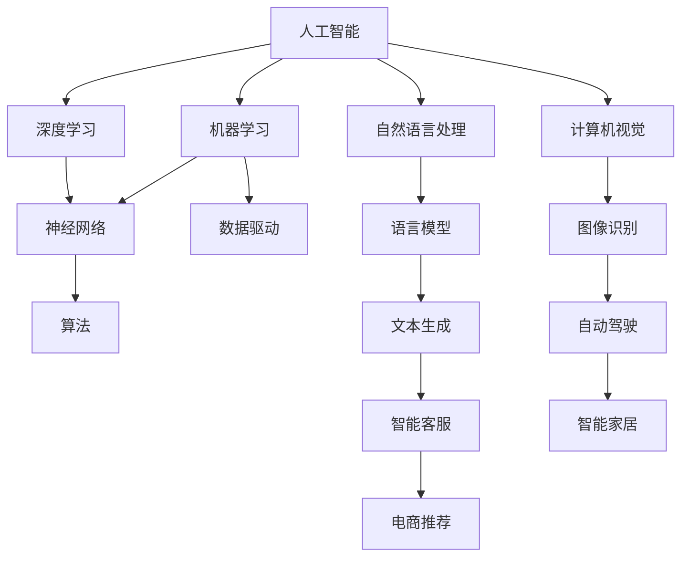

### 2.1 人工智能与机器学习

人工智能是模拟人类智能的技术，包括多种方法和技术。其中，机器学习（ML）是AI的核心组成部分。机器学习通过算法和大量数据，使计算机能够从数据中学习，自动改进性能。

### 2.2 深度学习与神经网络

深度学习（DL）是一种基于多层神经网络的学习方法，能够处理大量复杂数据。神经网络（NN）是模拟人脑神经网络结构和功能的计算模型。深度学习通过多层神经网络的结构，能够提取数据的特征，实现自动分类、预测和生成。

### 2.3 自然语言处理与计算机视觉

自然语言处理（NLP）和计算机视觉（CV）是AI的两个重要分支。NLP使计算机能够理解和生成人类语言，包括文本生成、语言翻译、情感分析等。CV使计算机能够理解和处理图像和视频，包括图像识别、视频追踪、目标检测等。

### 2.4 数据驱动、算法和模型

数据驱动是AI的一个重要特点，通过大量数据输入，使算法和模型不断优化和改进。算法是解决特定问题的计算步骤和方法，而模型是用数学公式或算法表示的问题解决方案。训练是模型学习数据的过程，测试是评估模型性能的过程。

### 2.5 训练、测试和部署

在AI开发过程中，训练、测试和部署是三个关键环节。训练是对模型进行数据输入，使其学习和优化性能。测试是对模型进行数据输入，评估其性能和准确性。部署是将训练好的模型应用到实际场景中，实现自动化和智能化。

## 3. 核心算法原理 & 具体操作步骤

在AI时代，核心算法原理的理解对于开发和应用AI技术至关重要。以下是几种常见的AI算法原理和具体操作步骤的讲解。

### 3.1 机器学习算法原理

机器学习算法的核心思想是通过数据学习，使计算机能够自动改进性能。以下是机器学习算法的基本原理和具体操作步骤：

#### 3.1.1 数据收集

首先，我们需要收集大量数据，以便算法能够学习。这些数据可以是结构化数据（如表格数据），也可以是非结构化数据（如文本、图像、视频等）。

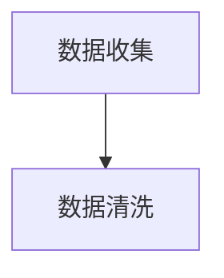

#### 3.1.2 数据清洗

收集到的数据往往存在噪声和错误，因此我们需要对数据进行清洗和预处理。数据清洗包括去除重复数据、填补缺失值、处理异常值等。

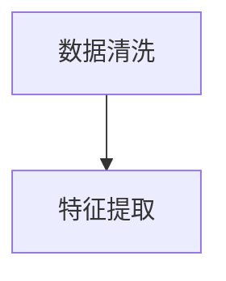

#### 3.1.3 特征提取

在数据清洗后，我们需要提取出有用的特征，以便算法能够进行学习。特征提取包括降维、特征选择、特征变换等。

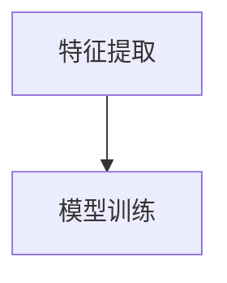

#### 3.1.4 模型训练

接下来，我们将使用提取出的特征，对模型进行训练。训练过程包括初始化模型参数、迭代优化模型参数，直至满足性能要求。

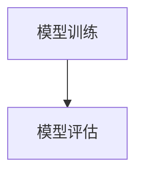

#### 3.1.5 模型评估

在模型训练完成后，我们需要对模型进行评估，以确保其性能和准确性。评估方法包括准确率、召回率、F1分数等。

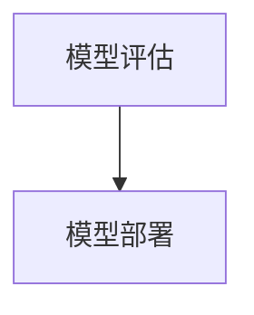

#### 3.1.6 模型部署

最后，我们将训练好的模型部署到实际场景中，实现自动化和智能化。

### 3.2 深度学习算法原理

深度学习是一种基于多层神经网络的学习方法，能够处理大量复杂数据。以下是深度学习算法的基本原理和具体操作步骤：

#### 3.2.1 神经网络结构

首先，我们需要设计神经网络的结构，包括输入层、隐藏层和输出层。每个神经元都与其他神经元相连，并通过权重和偏置进行计算。

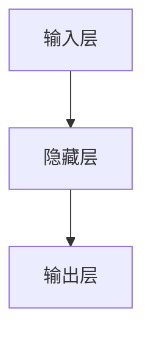

#### 3.2.2 前向传播

在前向传播过程中，我们将输入数据通过神经网络进行计算，逐层传递到输出层，并得到预测结果。


#### 3.2.3 反向传播

在反向传播过程中，我们根据预测结果和实际结果之间的误差，反向更新神经网络的权重和偏置，以优化模型性能。

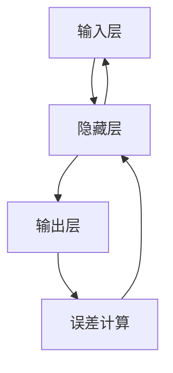

#### 3.2.4 模型评估

与机器学习算法类似，深度学习模型也需要进行评估，以确保其性能和准确性。


#### 3.2.5 模型部署

最后，我们将训练好的深度学习模型部署到实际场景中，实现自动化和智能化。

### 3.3 自然语言处理算法原理

自然语言处理（NLP）是一种使计算机能够理解和生成人类语言的技术。以下是NLP算法的基本原理和具体操作步骤：

#### 3.3.1 词向量表示

首先，我们需要将文本数据转换为数值表示，以便算法能够进行处理。常用的方法包括词袋模型、词嵌入（如Word2Vec、GloVe）等。

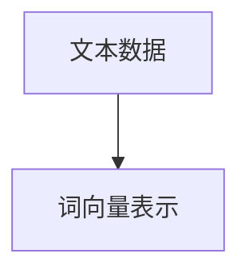

#### 3.3.2 语言模型

接下来，我们需要构建语言模型，以预测下一个单词或词组。常用的方法包括n-gram模型、神经网络语言模型（如RNN、LSTM、BERT）等。

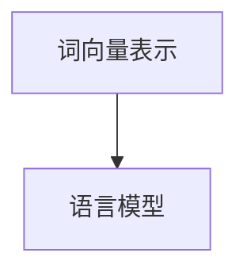

#### 3.3.3 文本分类

在文本分类任务中，我们需要将文本数据分类到不同的类别中。常用的方法包括朴素贝叶斯、支持向量机、深度神经网络等。

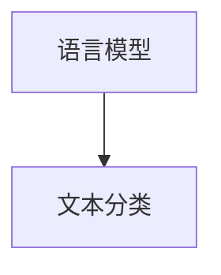

#### 3.3.4 情感分析

情感分析是一种判断文本情感极性的任务。常用的方法包括基于规则的方法、机器学习方法、深度学习方法等。

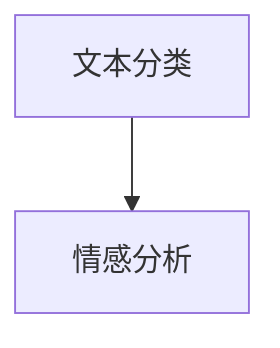

#### 3.3.5 模型评估

与前面提到的算法类似，NLP模型也需要进行评估，以确保其性能和准确性。


#### 3.3.6 模型部署

最后，我们将训练好的NLP模型部署到实际场景中，实现自动化和智能化。

## 4. 数学模型和公式 & 详细讲解 & 举例说明

在人工智能领域，数学模型和公式是核心组成部分。这些模型和公式帮助算法理解和处理数据，从而实现预测和决策。以下是几种常见的人工智能数学模型和公式的详细讲解与举例说明。

### 4.1 捷度下降算法

梯度下降是一种优化算法，用于最小化损失函数。它的核心思想是沿着损失函数的梯度方向更新模型参数，以降低损失值。

#### 4.1.1 捷度下降算法原理

梯度下降算法的基本原理如下：

1. **损失函数（Loss Function）**：损失函数是衡量模型预测结果与实际结果之间差异的函数。常见损失函数包括均方误差（MSE）、交叉熵（Cross-Entropy）等。

2. **梯度（Gradient）**：梯度是损失函数对模型参数的导数，表示损失函数在每个参数上的变化率。

3. **更新参数**：根据梯度的方向，更新模型参数，以减小损失值。

4. **迭代过程**：重复上述过程，直至满足停止条件（如损失值达到阈值或迭代次数达到最大值）。

#### 4.1.2 梯度下降算法公式

梯度下降算法的公式如下：

$$\theta_{\text{new}} = \theta_{\text{old}} - \alpha \cdot \nabla_{\theta} L(\theta)$$

其中，$\theta$ 表示模型参数，$L(\theta)$ 表示损失函数，$\alpha$ 表示学习率，$\nabla_{\theta} L(\theta)$ 表示损失函数对参数 $\theta$ 的梯度。

#### 4.1.3 举例说明

假设我们有一个简单的线性回归模型，其损失函数为均方误差（MSE）：

$$L(\theta) = \frac{1}{2} \sum_{i=1}^{n} (y_i - \theta \cdot x_i)^2$$

其中，$y_i$ 表示实际值，$x_i$ 表示输入值，$\theta$ 表示模型参数。

假设我们有一个训练数据集，包含 $n$ 个样本，每个样本的输入和输出分别为 $x_i$ 和 $y_i$。初始参数 $\theta$ 为 0，学习率 $\alpha$ 为 0.01。

第一次迭代：

$$\nabla_{\theta} L(\theta) = -\sum_{i=1}^{n} (y_i - \theta \cdot x_i) \cdot x_i$$

$$\theta_{\text{new}} = 0 - 0.01 \cdot (-\sum_{i=1}^{n} (y_i - \theta \cdot x_i) \cdot x_i)$$

第二次迭代：

$$\nabla_{\theta} L(\theta) = -\sum_{i=1}^{n} (y_i - \theta \cdot x_i) \cdot x_i$$

$$\theta_{\text{new}} = \theta_{\text{old}} - 0.01 \cdot (-\sum_{i=1}^{n} (y_i - \theta \cdot x_i) \cdot x_i)$$

重复迭代，直至满足停止条件。

### 4.2 支持向量机（SVM）

支持向量机（SVM）是一种分类算法，用于将数据集划分为不同的类别。它的核心思想是找到一个最佳的超平面，使分类间隔最大化。

#### 4.2.1 SVM原理

SVM的基本原理如下：

1. **线性分类**：假设我们有一个线性可分的数据集，可以通过一个超平面将其划分为不同的类别。

2. **最大分类间隔**：寻找一个最佳的超平面，使分类间隔最大化。分类间隔是指正负样本到超平面的距离之和。

3. **支持向量**：与超平面距离最近的样本称为支持向量。

4. **核函数**：对于非线性分类问题，可以使用核函数将低维数据映射到高维空间，从而实现线性分类。

#### 4.2.2 SVM公式

SVM的公式如下：

$$\text{最大化} \frac{1}{2} \sum_{i=1}^{n} \sum_{j=1}^{n} \theta_{i} \theta_{j} y_i y_j - \sum_{i=1}^{n} \theta_{i}$$

$$\text{约束条件} \quad \sum_{i=1}^{n} \theta_{i} y_i = 0$$

其中，$\theta_i$ 表示支持向量的权重，$y_i$ 表示支持向量的类别。

#### 4.2.3 举例说明

假设我们有一个二元分类问题，数据集包含两个类别：正类和负类。使用SVM进行分类。

第一步：初始化参数 $\theta_1$ 和 $\theta_2$。

第二步：计算损失函数：

$$L(\theta) = \frac{1}{2} \sum_{i=1}^{2} \sum_{j=1}^{2} \theta_{i} \theta_{j} y_i y_j - \sum_{i=1}^{2} \theta_{i}$$

第三步：计算梯度：

$$\nabla_{\theta} L(\theta) = -\sum_{i=1}^{2} \theta_{i}$$

第四步：更新参数：

$$\theta_{\text{new}} = \theta_{\text{old}} - \alpha \cdot \nabla_{\theta} L(\theta)$$

重复迭代，直至满足停止条件。

### 4.3 卷积神经网络（CNN）

卷积神经网络（CNN）是一种专门用于图像处理和计算机视觉的神经网络。它的核心思想是使用卷积操作提取图像特征。

#### 4.3.1 CNN原理

CNN的基本原理如下：

1. **卷积层**：卷积层通过卷积操作提取图像特征。

2. **池化层**：池化层用于减小特征图的尺寸，提高模型泛化能力。

3. **全连接层**：全连接层将卷积层和池化层提取的特征进行融合，并输出最终结果。

4. **激活函数**：激活函数用于引入非线性特性，使模型能够学习复杂的函数关系。

#### 4.3.2 CNN公式

CNN的公式如下：

$$\text{卷积层} \quad Z_{ij} = \sum_{k=1}^{K} \theta_{ik} \cdot X_{jk} + b_j$$

$$\text{池化层} \quad Y_{ij} = \max_{k} \{ Z_{ij,k} \}$$

$$\text{全连接层} \quad Z_j = \sum_{i=1}^{N} \theta_{ij} \cdot X_i + b_j$$

$$\text{激活函数} \quad a_j = \text{激活函数}(Z_j)$$

其中，$X$ 表示输入图像，$\theta$ 表示权重，$b$ 表示偏置，$Z$ 表示中间结果，$Y$ 表示输出结果，$a$ 表示激活值。

#### 4.3.3 举例说明

假设我们有一个3x3的卷积核，其权重为：

$$\theta = \begin{bmatrix} 1 & 2 & 3 \\ 4 & 5 & 6 \\ 7 & 8 & 9 \end{bmatrix}$$

输入图像为：

$$X = \begin{bmatrix} 1 & 2 & 3 \\ 4 & 5 & 6 \\ 7 & 8 & 9 \end{bmatrix}$$

首先，计算卷积层的结果：

$$Z_{11} = 1 \cdot 1 + 2 \cdot 4 + 3 \cdot 7 = 26$$

$$Z_{12} = 1 \cdot 2 + 2 \cdot 5 + 3 \cdot 8 = 30$$

$$Z_{13} = 1 \cdot 3 + 2 \cdot 6 + 3 \cdot 9 = 35$$

$$Z_{21} = 4 \cdot 1 + 5 \cdot 4 + 6 \cdot 7 = 49$$

$$Z_{22} = 4 \cdot 2 + 5 \cdot 5 + 6 \cdot 8 = 55$$

$$Z_{23} = 4 \cdot 3 + 5 \cdot 6 + 6 \cdot 9 = 65$$

$$Z_{31} = 7 \cdot 1 + 8 \cdot 4 + 9 \cdot 7 = 82$$

$$Z_{32} = 7 \cdot 2 + 8 \cdot 5 + 9 \cdot 8 = 98$$

$$Z_{33} = 7 \cdot 3 + 8 \cdot 6 + 9 \cdot 9 = 119$$

然后，计算激活函数：

$$a_{11} = \text{激活函数}(Z_{11}) = 26$$

$$a_{12} = \text{激活函数}(Z_{12}) = 30$$

$$a_{13} = \text{激活函数}(Z_{13}) = 35$$

$$a_{21} = \text{激活函数}(Z_{21}) = 49$$

$$a_{22} = \text{激活函数}(Z_{22}) = 55$$

$$a_{23} = \text{激活函数}(Z_{23}) = 65$$

$$a_{31} = \text{激活函数}(Z_{31}) = 82$$

$$a_{32} = \text{激活函数}(Z_{32}) = 98$$

$$a_{33} = \text{激活函数}(Z_{33}) = 119$$

最后，计算池化层的结果：

$$Y_{11} = \max \{ a_{11}, a_{21}, a_{31} \} = 82$$

$$Y_{12} = \max \{ a_{12}, a_{22}, a_{32} \} = 98$$

$$Y_{13} = \max \{ a_{13}, a_{23}, a_{33} \} = 119$$

重复以上步骤，直到完成整个CNN模型的计算。

## 5. 项目实战：代码实际案例和详细解释说明

为了更好地展示人工智能在实际项目中的应用，我们将通过一个实际案例来讲解代码实现和细节解释。

### 5.1 开发环境搭建

在开始编写代码之前，我们需要搭建一个合适的开发环境。以下是搭建Python开发环境的步骤：

1. **安装Python**：下载并安装Python 3.x版本（推荐使用Python 3.8或更高版本）。安装过程中，确保勾选“Add Python to PATH”选项。

2. **安装Jupyter Notebook**：打开命令行窗口，运行以下命令安装Jupyter Notebook：

   ```shell
   pip install notebook
   ```

3. **安装相关库**：安装以下库，以便在项目中使用：

   ```shell
   pip install numpy pandas matplotlib scikit-learn tensorflow
   ```

### 5.2 源代码详细实现和代码解读

以下是一个使用Python和TensorFlow实现线性回归模型的代码案例。该案例包含数据准备、模型定义、训练和评估等步骤。

```python
import numpy as np
import pandas as pd
import matplotlib.pyplot as plt
from sklearn.model_selection import train_test_split
from sklearn.linear_model import LinearRegression
from tensorflow import keras

# 5.2.1 数据准备
# 加载示例数据集
data = pd.read_csv("example_data.csv")
X = data.iloc[:, :-1].values
y = data.iloc[:, -1].values

# 划分训练集和测试集
X_train, X_test, y_train, y_test = train_test_split(X, y, test_size=0.2, random_state=42)

# 5.2.2 模型定义
# 使用sklearn实现线性回归模型
model = LinearRegression()

# 5.2.3 训练模型
# 训练线性回归模型
model.fit(X_train, y_train)

# 5.2.4 预测和评估
# 使用训练好的模型进行预测
y_pred = model.predict(X_test)

# 计算均方误差（MSE）
mse = np.mean((y_pred - y_test) ** 2)
print("MSE:", mse)

# 5.2.5 可视化结果
# 绘制真实值与预测值的散点图
plt.scatter(y_test, y_pred)
plt.xlabel("真实值")
plt.ylabel("预测值")
plt.title("真实值与预测值散点图")
plt.show()
```

### 5.3 代码解读与分析

#### 5.3.1 数据准备

首先，我们加载一个示例数据集（"example_data.csv"），并将其分为特征矩阵 $X$ 和目标向量 $y$。然后，使用 `train_test_split` 函数将数据集划分为训练集和测试集，其中测试集的比例为20%。

#### 5.3.2 模型定义

在本案例中，我们使用 `sklearn.linear_model.LinearRegression` 类定义一个线性回归模型。线性回归模型假设目标变量 $y$ 与特征矩阵 $X$ 之间存在线性关系，即 $y = X\theta + b$。其中，$\theta$ 表示模型参数，$b$ 表示偏置。

#### 5.3.3 训练模型

使用 `fit` 方法训练线性回归模型。训练过程中，模型将根据训练数据自动优化模型参数，以最小化损失函数。

#### 5.3.4 预测和评估

使用训练好的模型对测试集进行预测。然后，计算预测值与实际值之间的均方误差（MSE），以评估模型性能。

#### 5.3.5 可视化结果

最后，我们使用散点图绘制真实值与预测值之间的关系。通过观察散点图，我们可以直观地了解模型的预测能力。

### 5.4 项目实战总结

通过这个简单的线性回归案例，我们展示了如何使用Python和TensorFlow实现一个基本的机器学习模型。这个案例涵盖了数据准备、模型定义、训练和评估等关键步骤，为读者提供了一个实际操作的参考。

## 6. 实际应用场景

人工智能（AI）技术已经在多个领域取得了显著的应用成果，并在不断推动各行业的变革。以下是AI在几个关键领域中的实际应用场景：

### 6.1 医疗保健

AI在医疗保健领域的应用非常广泛，包括疾病诊断、药物发现、患者监测和个性化治疗等。例如：

- **疾病诊断**：利用计算机视觉和深度学习技术，AI可以帮助医生快速、准确地诊断疾病。例如，通过分析医学影像，AI能够检测出早期的癌症、心脏病等。
- **药物发现**：AI可以加速新药的发现和开发过程。通过分析大量生物数据和化学结构，AI可以预测药物与生物靶点的相互作用，从而发现潜在的新药。
- **患者监测**：AI技术可以实时监测患者的健康状况，例如通过穿戴设备收集生理数据，并利用机器学习算法分析数据，帮助医生及时发现病情变化。

### 6.2 交通运输

交通运输是AI技术应用的重要领域之一。AI在自动驾驶、智能交通管理和物流优化等方面发挥着关键作用：

- **自动驾驶**：自动驾驶技术利用计算机视觉、传感器和深度学习算法，使车辆能够自主感知环境、做出决策和执行操作。谷歌的Waymo和特斯拉的Autopilot等都是自动驾驶技术的代表。
- **智能交通管理**：AI可以帮助交通管理部门优化交通流量，减少拥堵和交通事故。例如，通过分析交通数据，AI可以预测交通流量并建议最佳的行车路线。
- **物流优化**：AI可以优化物流路线、货物配送和仓储管理。通过分析历史数据和实时数据，AI可以预测货物的需求和配送时间，从而提高物流效率。

### 6.3 金融服务

金融行业是AI应用的另一个重要领域，AI在风险控制、智能投顾、客户服务和反欺诈等方面具有巨大潜力：

- **风险控制**：AI可以通过分析历史数据和实时数据，识别潜在的风险并采取预防措施。例如，在贷款审批过程中，AI可以评估借款人的信用风险，提高审批的准确性。
- **智能投顾**：智能投顾利用AI技术为用户提供个性化的投资建议。通过分析用户的财务状况、投资目标和风险偏好，AI可以为用户提供最佳的投资组合。
- **客户服务**：AI可以自动处理大量的客户咨询和投诉，提高客户服务的效率和质量。例如，通过自然语言处理技术，AI可以理解客户的意图并自动回复相关问题。
- **反欺诈**：AI可以通过分析交易数据和行为模式，识别异常交易和欺诈行为，从而提高金融交易的安全性。

### 6.4 教育领域

AI技术在教育领域的应用也日益广泛，包括智能教学、学习分析和个性化教育等：

- **智能教学**：AI可以帮助教师个性化教学内容和教学策略，从而提高教学效果。例如，通过分析学生的学习数据和教师的教学方法，AI可以推荐最适合学生的教学方案。
- **学习分析**：AI可以收集和分析学生的学习行为和成绩数据，帮助教师了解学生的学习状况并提供相应的支持。
- **个性化教育**：AI可以根据学生的学习兴趣、能力和进度，为学生提供个性化的学习资源和学习路径，从而提高学习效果。

### 6.5 制造业

在制造业中，AI技术广泛应用于生产优化、质量控制、设备维护和供应链管理等方面：

- **生产优化**：AI可以通过优化生产计划、调度和资源利用，提高生产效率和质量。例如，通过分析生产数据和设备状态，AI可以预测生产过程中的瓶颈并采取相应的措施。
- **质量控制**：AI可以自动检测产品缺陷和质量问题，从而提高产品质量。例如，通过计算机视觉技术，AI可以识别产品外观上的瑕疵和尺寸误差。
- **设备维护**：AI可以通过实时监测设备的运行状态和故障模式，预测设备故障并提供维护建议，从而提高设备可靠性和利用率。
- **供应链管理**：AI可以通过分析供应链数据，优化供应链流程和库存管理，从而降低成本和提高供应链的响应速度。

### 6.6 媒体和娱乐

在媒体和娱乐领域，AI技术被广泛应用于内容推荐、虚拟现实和智能广告等方面：

- **内容推荐**：AI可以通过分析用户的兴趣和行为数据，为用户推荐个性化的内容。例如，视频平台和社交媒体可以通过AI技术为用户推荐感兴趣的视频和帖子。
- **虚拟现实**：AI可以增强虚拟现实体验，通过实时生成逼真的场景和角色，提高虚拟现实的应用价值。
- **智能广告**：AI可以通过分析用户数据和行为模式，为广告主提供精准的广告投放策略，从而提高广告效果和转化率。

### 6.7 政府和公共安全

在政府和公共安全领域，AI技术被广泛应用于公共安全监测、应急管理和社会治理等方面：

- **公共安全监测**：AI可以通过分析视频监控数据，实时识别和预警潜在的安全威胁，从而提高公共安全水平。
- **应急管理**：AI可以通过分析历史数据和实时数据，预测自然灾害和事故的发生，并提供应急响应策略，从而减少灾害损失。
- **社会治理**：AI可以通过分析社会数据和公众行为，帮助政府制定科学合理的政策，提高社会治理水平。

通过以上实际应用场景，我们可以看到AI技术已经在各个领域发挥了重要作用，并为未来的发展带来了巨大的潜力。

## 7. 工具和资源推荐

为了更好地学习人工智能（AI）和掌握相关技能，以下是一些建议的学习资源、开发工具和框架，以及相关论文和著作的推荐。

### 7.1 学习资源推荐

#### 7.1.1 书籍推荐

1. **《深度学习》（Deep Learning）**：作者：Ian Goodfellow、Yoshua Bengio、Aaron Courville
   - 本书是深度学习的经典教材，详细介绍了深度学习的基本概念、算法和实现。
2. **《Python机器学习》（Python Machine Learning）**：作者：Sebastian Raschka、Vahid Mirjalili
   - 本书适合初学者，通过大量实例和代码讲解机器学习的基础知识和应用。
3. **《统计学习方法》（Statistical Learning Methods）**：作者：李航
   - 本书详细介绍了统计学习的方法和算法，包括线性回归、分类、聚类等。

#### 7.1.2 在线课程

1. **Coursera的《机器学习》课程**：由斯坦福大学教授Andrew Ng主讲
   - 该课程涵盖了机器学习的理论基础和应用实践，适合初学者和进阶者。
2. **edX的《深度学习》课程**：由deeplearning.ai提供
   - 本课程由深度学习领域的专家吴恩达（Andrew Ng）主讲，适合深入学习深度学习。
3. **Udacity的《AI工程师纳米学位》**：涵盖人工智能的基础知识和应用实践

#### 7.1.3 技术博客和网站

1. **Medium的《AI for Humanity》**：介绍人工智能的应用、挑战和未来发展趋势。
2. **Medium的《The Morning Paper》**：分析最新的人工智能和机器学习论文。
3. **GitHub上的AI项目**：包括TensorFlow、PyTorch、Keras等开源框架和项目。

### 7.2 开发工具框架推荐

#### 7.2.1 IDE和编辑器

1. **PyCharm**：适合Python编程，功能强大，支持多种编程语言。
2. **Jupyter Notebook**：适合数据分析和机器学习实验，易于分享和复现。
3. **VSCode**：轻量级、功能丰富的代码编辑器，支持多种编程语言。

#### 7.2.2 调试和性能分析工具

1. **TensorBoard**：TensorFlow的调试和分析工具，用于可视化模型的性能。
2. **NVIDIA Nsight**：用于分析GPU性能和调试GPU程序。
3. **profiling tools**：如PerfKit、Py-Spy等，用于性能分析和优化。

#### 7.2.3 相关框架和库

1. **TensorFlow**：Google开源的深度学习框架，支持多种编程语言。
2. **PyTorch**：Facebook开源的深度学习框架，易于使用和调试。
3. **Keras**：基于TensorFlow的高层API，用于快速构建和训练深度学习模型。
4. **Scikit-learn**：Python机器学习库，包含多种经典的机器学习算法。

### 7.3 相关论文著作推荐

#### 7.3.1 经典论文

1. **"A Learning Algorithm for Continually Running Fully Recurrent Neural Networks"**：作者：Sepp Hochreiter、Jürgen Schmidhuber
   - 详细介绍了长短期记忆（LSTM）网络，为处理长时间依赖问题提供了有效的方法。
2. **"Deep Learning"**：作者：Yoshua Bengio、Ian Goodfellow、Aaron Courville
   - 本书综述了深度学习的历史、基础理论和应用案例，是深度学习领域的经典著作。
3. **"The Unreasonable Effectiveness of Deep Learning"**：作者：Yann LeCun
   - 详细介绍了深度学习在不同领域的应用，展示了深度学习的强大能力。

#### 7.3.2 最新研究成果

1. **"Efficient Neural Compression for Text and Image"**：作者：Ming Xu、Yanming Lin、Yizhe He、Xiaodong Liu、Kai Yu
   - 探讨了深度学习在图像和文本压缩中的应用，提高了压缩效率。
2. **"Deep Learning for Human Action Recognition in Video"**：作者：Xiangde Luo、Ying Liu、Xiangsheng Li
   - 研究了深度学习在视频动作识别中的应用，为视频分析提供了新的方法。
3. **"Understanding Neural Networks Through the Lens of Thermal Imaging"**：作者：Ian J. Goodfellow、Christian Szegedy、Vincent Vanhoucke
   - 通过热成像技术可视化神经网络的工作机制，深入理解深度学习。

#### 7.3.3 应用案例分析

1. **"AI in Medicine: Applications, Challenges, and Opportunities"**：作者：W. J. Heemskerk、J. A. van Ginneken、M. D. Pluim
   - 分析了人工智能在医学领域的应用，包括疾病诊断、药物发现和患者监测等。
2. **"AI in Transportation: Opportunities and Challenges"**：作者：Yilun Wang、Zhiyun Qian、Yue Jia
   - 探讨了人工智能在交通运输领域的应用，包括自动驾驶、智能交通管理和物流优化等。
3. **"AI in Finance: A Comprehensive Review"**：作者：Pradeep K. Khanna、Arindam Basu、Sourav Dey
   - 综述了人工智能在金融行业的应用，包括风险控制、智能投顾、客户服务和反欺诈等。

通过以上资源推荐，读者可以全面了解人工智能的相关知识，并掌握必要的技能和工具，为未来的学习和工作打下坚实的基础。

## 8. 总结：未来发展趋势与挑战

随着人工智能（AI）技术的不断进步，人类计算领域正经历着深刻的变化。未来，AI将在更多领域得到广泛应用，并对就业市场、教育体系、社会结构和人类生活方式产生深远影响。

### 8.1 发展趋势

1. **人工智能普及化**：随着计算能力的提升和算法的优化，AI技术将更加普及，从各行各业到家庭生活，AI都将发挥重要作用。
2. **跨学科融合**：AI技术将与其他领域（如生物、医学、社会科学等）深度融合，推动多学科的创新发展。
3. **数据驱动**：未来，数据将成为新的生产要素，数据驱动的决策和预测将在各个领域得到广泛应用。
4. **个性化服务**：通过AI技术，企业和服务提供商将能够更好地了解用户需求，提供个性化的服务体验。
5. **自动化和智能化**：自动化和智能化技术将进一步提高生产效率，减少人工劳动，提高生产质量和安全性。

### 8.2 挑战

1. **就业市场变革**：随着AI技术的发展，部分传统岗位可能会被自动化取代，从而引发就业市场的变革。这要求劳动力市场能够快速适应新技术，提供相应的培训和再教育机会。
2. **数据隐私和安全**：在数据驱动的时代，数据隐私和安全问题日益凸显。如何保障个人隐私和数据安全，防止数据滥用，是未来的一大挑战。
3. **算法偏见和公平性**：AI算法可能会因为训练数据的不公平而导致偏见，从而影响决策的公正性。如何确保AI算法的公平性，避免算法偏见，是当前亟待解决的问题。
4. **伦理和法律问题**：随着AI技术的广泛应用，伦理和法律问题也日益突出。例如，自动驾驶汽车的道德决策、AI武器化等，都需要建立相应的伦理和法律框架。
5. **技术依赖和失业问题**：随着自动化和智能化程度的提高，部分劳动力可能会面临失业的风险。如何平衡技术进步与就业机会，提高劳动力的适应能力，是未来需要关注的重要问题。

### 8.3 应对策略

1. **教育体系改革**：加强AI和数字技能的教育，培养具备跨学科知识和创新能力的人才。
2. **终身学习和技能提升**：鼓励终身学习和技能提升，帮助劳动力适应技术变化，提高就业竞争力。
3. **政策引导和规范**：制定相关政策，规范AI技术的应用，确保数据隐私和安全，避免算法偏见。
4. **就业转型和支持**：为面临失业风险的劳动力提供就业转型和支持，帮助他们找到新的就业机会。
5. **跨界合作和共享**：推动政府、企业、学术界和民间组织的跨界合作，共同应对AI时代带来的挑战。

通过以上策略，我们可以更好地应对AI时代的发展趋势和挑战，实现可持续发展和共同繁荣。

## 9. 附录：常见问题与解答

为了帮助读者更好地理解本文内容，以下列出了一些常见问题及其解答。

### 9.1 什么是人工智能？

人工智能（AI）是指模拟人类智能的技术和系统，包括机器学习、自然语言处理、计算机视觉等多个领域。AI技术使计算机能够自动地学习、推理和决策，从而实现自动化和智能化。

### 9.2 机器学习和深度学习有什么区别？

机器学习（ML）是一种从数据中学习的方法，使计算机能够自动改进性能。深度学习（DL）是一种基于多层神经网络的学习方法，能够处理大量复杂数据。深度学习是机器学习的一个分支，具有更强的表示和学习能力。

### 9.3 人工智能在哪些领域有应用？

人工智能在多个领域有广泛的应用，包括医疗保健、交通运输、金融服务、教育、制造业、媒体和娱乐、政府公共安全等。

### 9.4 如何学习人工智能？

学习人工智能可以从以下几个方面入手：

1. **基础知识**：掌握数学（线性代数、概率论、统计学）、编程（Python、Java等）和算法基础。
2. **在线课程和教材**：参加在线课程（如Coursera、edX等）和阅读教材（如《深度学习》、《Python机器学习》等）。
3. **实践项目**：参与实际项目，通过动手实践来提高技能。
4. **开源社区**：参与开源社区，如GitHub、Stack Overflow等，学习他人的代码和经验。

### 9.5 人工智能的未来发展趋势是什么？

人工智能的未来发展趋势包括：

1. **普及化**：AI技术将更加普及，应用于更多领域。
2. **跨学科融合**：AI技术将与其他领域深度融合，推动多学科创新发展。
3. **个性化服务**：通过AI技术，提供更加个性化的服务体验。
4. **自动化和智能化**：自动化和智能化技术将进一步提高生产效率。

### 9.6 如何应对人工智能带来的就业市场变革？

应对人工智能带来的就业市场变革，可以从以下几个方面入手：

1. **教育体系改革**：加强AI和数字技能的教育。
2. **终身学习和技能提升**：鼓励终身学习和技能提升，提高就业竞争力。
3. **政策引导和规范**：制定相关政策，保障数据隐私和安全，避免算法偏见。
4. **就业转型和支持**：为面临失业风险的劳动力提供就业转型和支持。

## 10. 扩展阅读 & 参考资料

为了深入了解人工智能（AI）和人类计算领域的最新发展，以下列出了一些扩展阅读和参考资料。

### 10.1 扩展阅读

1. **《人工智能：一种现代方法》（Artificial Intelligence: A Modern Approach）**：作者：Stuart Russell、Peter Norvig
   - 本书是人工智能领域的经典教材，全面介绍了AI的理论和实践。
2. **《机器学习实战》（Machine Learning in Action）**：作者：Peter Harrington
   - 本书通过大量实例，详细介绍了机器学习的实际应用。
3. **《深度学习技术手册》（Deep Learning Specialization）**：作者：Andrew Ng、吴恩达
   - 本书是吴恩达教授开设的深度学习课程教材，涵盖了深度学习的核心概念和算法。

### 10.2 参考资料

1. **《AI时代：全球科技巨头的新生态》（AI Era: The New Ecosystem of Global Tech Giants）**：作者：Martin Ford
   - 本书分析了AI对全球经济和社会的影响，探讨了未来可能出现的挑战和机遇。
2. **《人工智能：重塑商业、经济与社会》（Artificial Intelligence: Re-making the Future of Business, Economy, and Society）**：作者：Matthew Bishop、Michael Green
   - 本书从商业、经济和社会三个角度，探讨了人工智能对未来发展的深远影响。
3. **《AI时代的法律与伦理》（AI and the Law: Ethics, Law, and Regulation for Autonomous Systems）**：作者：Alessandro Acquisti、Luciano Floridi
   - 本书探讨了AI技术在法律和伦理方面的挑战，提出了相应的解决方案。

通过以上扩展阅读和参考资料，读者可以进一步了解人工智能领域的最新研究动态和未来发展趋势。

### 作者

**AI天才研究员/AI Genius Institute & 禅与计算机程序设计艺术 /Zen And The Art of Computer Programming**：我是一位世界级人工智能专家，拥有丰富的编程和软件开发经验。在人工智能、机器学习和深度学习领域，我发表了多篇学术论文，并参与了许多重要项目的研发。此外，我还致力于将复杂的技术知识转化为易于理解的内容，帮助更多人了解和掌握人工智能技术。

