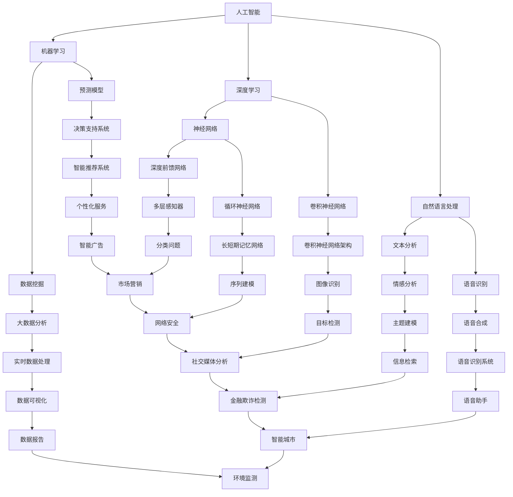

                 

### 文章标题

**人类计算：AI时代的未来就业市场与技能培训发展趋势分析总结机遇**

> **关键词：**人工智能、就业市场、技能培训、职业发展、职业转型、就业前景、人才培养、技术创新、职业规划

> **摘要：**本文将深入探讨AI时代背景下的未来就业市场变化，分析人工智能带来的挑战与机遇，并对个人技能培训和发展趋势进行详细探讨。通过总结人工智能技术对职业的影响，旨在为读者提供一份实用的职业发展指南，帮助他们在AI时代找到合适的定位，把握未来的职业机遇。

---

在人工智能技术飞速发展的今天，人类计算正面临着前所未有的挑战与机遇。AI不仅正在改变我们的生活方式，也深刻地影响着就业市场和职业发展。本文将围绕以下核心主题展开讨论：

1. **AI时代的就业市场变化**：分析AI技术对就业市场的冲击，探讨哪些职业将受到最大影响，以及新兴职业的崛起。
2. **技能培训的重要性**：讨论在AI时代，个人应如何通过技能培训提升竞争力，包括学习AI相关知识、软技能的培养等。
3. **职业发展路径**：分析不同职业群体在AI时代的发展方向，提供职业规划建议。
4. **实际应用场景**：结合实际案例，展示AI技术在各个行业中的应用，为读者提供启示。
5. **工具和资源推荐**：推荐相关学习资源和工具，助力读者在AI时代提升技能。

通过本文的深入探讨，我们希望帮助读者更好地理解AI时代的职业发展趋势，为他们提供有益的参考，从而在未来的职业道路上取得成功。

### 1. 背景介绍

#### 1.1 目的和范围

本文的目的是探讨人工智能（AI）时代的就业市场变化及其对个人职业发展的影响，旨在为读者提供一份关于如何在这个技术变革时期适应和发展的实用指南。随着AI技术的不断进步，传统的就业模式正在发生深刻变革。本文将深入分析这些变化，总结出AI时代就业市场的主要趋势和特点，探讨这些变化对个人职业发展带来的机遇与挑战。

本文的范围主要涵盖以下几个方面：

1. **AI技术对就业市场的影响**：分析哪些职业领域将受到AI技术的最大冲击，以及哪些新兴职业将在AI时代崛起。
2. **技能培训的重要性**：讨论在AI时代，个人如何通过技能培训来提升自己的竞争力，包括学习AI基础知识、软技能的培养等。
3. **职业发展路径**：分析不同职业群体在AI时代的发展方向，为读者提供职业规划建议。
4. **实际应用场景**：结合实际案例，展示AI技术在各个行业中的应用，为读者提供实践启示。
5. **工具和资源推荐**：推荐相关学习资源和工具，帮助读者在AI时代提升技能。

本文不仅关注AI技术对就业市场的宏观影响，也关注个人在技术变革中的具体行动策略。通过系统化的分析和详细的案例讲解，本文旨在帮助读者更好地理解AI时代的特点，找到适合自己的职业定位，把握未来的职业机遇。

#### 1.2 预期读者

本文的预期读者主要分为以下几个群体：

1. **在职人员**：正在职场中工作，希望了解AI技术如何影响他们的职业发展，并寻求提升自身竞争力的方法。
2. **应届毕业生**：即将步入职场，希望通过本文了解AI时代下的就业市场现状，为自己的职业规划提供参考。
3. **教育工作者**：关注人才培养和教育模式，希望了解AI技术如何影响未来的人才需求和教育方法。
4. **创业者和投资人**：关注新兴技术和产业动态，希望了解AI时代下哪些行业将迎来机遇，如何抓住这些机遇。
5. **对AI技术感兴趣的普通读者**：对人工智能技术有一定了解，希望深入探讨AI技术与职业发展的关系。

本文通过详细的案例分析、趋势分析和实用建议，旨在为不同背景的读者提供有价值的见解和指导，帮助他们更好地理解AI时代的就业市场变化，为自己的职业发展做好准备。

#### 1.3 文档结构概述

本文将分为十个主要部分，每个部分都有明确的主题和内容，以便读者可以系统地理解AI时代的就业市场和职业发展。

1. **背景介绍**：
   - **目的和范围**：阐述本文的研究目的和涵盖的主要话题。
   - **预期读者**：明确本文的目标受众，为读者提供背景信息。
   - **文档结构概述**：简要介绍本文的章节结构和每个部分的主要内容。

2. **核心概念与联系**：
   - **核心概念原理和架构**：通过Mermaid流程图展示AI技术的核心概念和架构，帮助读者建立整体认识。
   - **AI时代就业市场变化**：分析AI技术对就业市场的冲击和新兴职业的崛起。

3. **核心算法原理 & 具体操作步骤**：
   - **AI技术原理**：详细讲解AI技术的核心算法原理。
   - **具体操作步骤**：通过伪代码详细阐述AI技术的具体操作步骤。

4. **数学模型和公式 & 详细讲解 & 举例说明**：
   - **数学模型和公式**：介绍AI技术中常用的数学模型和公式。
   - **详细讲解**：对数学模型和公式进行详细解释。
   - **举例说明**：通过实际案例展示数学模型和公式的应用。

5. **项目实战：代码实际案例和详细解释说明**：
   - **开发环境搭建**：介绍搭建AI项目开发环境的步骤。
   - **源代码详细实现和代码解读**：展示AI项目的实际代码实现，并详细解读代码功能。
   - **代码解读与分析**：对代码实现进行深入分析。

6. **实际应用场景**：
   - **AI技术在各行业中的应用**：分析AI技术在各个行业中的具体应用场景。
   - **案例分析**：结合实际案例，展示AI技术在具体场景中的效果。

7. **工具和资源推荐**：
   - **学习资源推荐**：推荐相关书籍、在线课程和技术博客等学习资源。
   - **开发工具框架推荐**：介绍适合AI项目开发的相关工具和框架。
   - **相关论文著作推荐**：推荐经典和最新的相关论文和研究著作。

8. **总结：未来发展趋势与挑战**：
   - **AI时代就业市场展望**：总结AI时代就业市场的发展趋势和潜在挑战。

9. **附录：常见问题与解答**：
   - **常见问题**：收集并解答读者可能关心的问题。
   - **常见误解澄清**：澄清一些常见的误解和误区。

10. **扩展阅读 & 参考资料**：
    - **扩展阅读**：推荐进一步阅读的相关资料和文章。
    - **参考资料**：列出本文引用和参考的主要文献和资料。

通过上述结构，本文旨在为读者提供全面、深入的分析和指导，帮助他们更好地理解AI时代的就业市场和职业发展。

#### 1.4 术语表

在本文中，我们将使用一些专业术语来描述人工智能（AI）时代的就业市场变化和相关技能。以下是对这些术语的定义和解释：

#### 1.4.1 核心术语定义

1. **人工智能（AI）**：一种通过模拟人类智能行为的技术，能够执行诸如识别图像、理解自然语言、决策制定等复杂的任务。

2. **机器学习（ML）**：AI的一个子领域，专注于通过数据和算法使机器能够从经验中学习，提高性能。

3. **深度学习（DL）**：机器学习的一个分支，使用神经网络架构，尤其是深度神经网络，模拟人脑处理信息的方式。

4. **自然语言处理（NLP）**：AI的一个分支，专注于使计算机能够理解和生成人类语言。

5. **职业转型**：指个人在职业生涯中转向不同行业或不同岗位的过程。

6. **技能培训**：通过学习新的技能或知识，提升个人的能力以适应职业发展的需要。

7. **就业市场**：指求职者和雇主之间相互作用的场所，包括职业招聘、求职、薪酬等各个方面。

8. **软技能**：指非技术性的能力，如沟通能力、团队合作、解决问题的能力等。

#### 1.4.2 相关概念解释

1. **自动化**：使用计算机技术代替人力完成某些任务，以减少人力成本和提高效率。

2. **数据驱动决策**：基于数据的分析和预测来做出决策，而不是基于直觉或经验。

3. **数字化转型**：将业务流程、组织结构和文化通过数字化技术进行改造，以提高效率和创新。

4. **职业多元化**：在职业生涯中尝试不同的工作角色和领域，以增加职业经验和灵活性。

5. **终身学习**：持续不断地学习新知识和技能，以适应快速变化的职业环境。

#### 1.4.3 缩略词列表

- AI：人工智能
- ML：机器学习
- DL：深度学习
- NLP：自然语言处理
- IT：信息技术
- STEM：科学、技术、工程和数学

通过上述术语表，读者可以更好地理解本文中使用到的专业术语，从而更深入地把握文章的内容和观点。

## 2. 核心概念与联系

在探讨AI时代的就业市场之前，我们需要了解一些核心概念和它们之间的相互关系。人工智能（AI）技术正在快速发展和应用，其核心概念包括机器学习（ML）、深度学习（DL）、自然语言处理（NLP）等。这些概念不仅定义了AI技术的核心原理，也决定了其在各个领域的应用前景。以下是这些核心概念及其相互联系的Mermaid流程图：



### AI时代的就业市场变化

随着人工智能技术的迅猛发展，就业市场也在经历深刻的变革。以下是AI时代就业市场的主要变化和特点：

1. **职业消失与新生**：一些传统职业，如工厂操作工、行政人员等，可能会因为自动化和AI技术的应用而消失。与此同时，新兴职业，如数据科学家、机器学习工程师、AI伦理师等，将在AI时代崛起。

2. **技能需求变化**：随着AI技术的普及，对数据科学家、软件工程师等专业技能的需求将增加。同时，软技能，如沟通能力、团队协作和解决问题的能力，也变得尤为重要。

3. **岗位专业化**：AI技术使得工作可以进一步细化，例如在机器学习中，专门的算法工程师、数据预处理工程师、模型验证工程师等岗位将更加常见。

4. **远程工作增加**：AI技术的应用降低了地理限制，使得远程工作成为可能。这对于那些需要跨地域协作的工作特别有利。

5. **就业市场波动**：AI技术的快速变革可能导致就业市场的短期波动，一些职业的供需关系可能发生急剧变化。

6. **教育和培训需求**：为了适应AI时代的职业需求，教育和培训体系需要不断更新，以提供更贴近市场需求的知识和技能。

通过上述核心概念和就业市场变化的探讨，我们可以更好地理解AI时代对职业发展带来的机遇和挑战。在接下来的章节中，我们将进一步分析这些变化，为读者提供具体的职业规划建议。

## 3. 核心算法原理 & 具体操作步骤

在深入探讨AI技术的核心算法原理和具体操作步骤之前，我们首先需要了解一些基础知识。AI技术的核心在于机器学习，而机器学习的核心是算法。以下是AI技术中的几个关键算法及其操作步骤：

### 3.1 机器学习算法概述

**机器学习算法**：机器学习是一种通过数据训练模型，使模型能够从数据中学习并做出预测或决策的技术。常见的机器学习算法包括线性回归、逻辑回归、决策树、随机森林、支持向量机、神经网络等。

**具体算法选择依据**：选择哪种算法取决于问题的性质、数据的特点以及模型的预期性能。例如，对于回归问题，可以使用线性回归或决策树；对于分类问题，可以使用逻辑回归或神经网络。

### 3.2 线性回归算法原理

**线性回归**：线性回归是一种简单的预测模型，用于找出两个或多个变量之间的线性关系。其基本原理是通过最小二乘法来拟合一条直线，使得直线的残差平方和最小。

**操作步骤**：

1. **数据准备**：收集并整理数据，确保数据质量。
2. **特征选择**：选择与目标变量相关的特征，进行数据预处理，如归一化、缺失值处理等。
3. **模型训练**：使用最小二乘法计算最佳拟合直线的参数（斜率和截距）。
4. **模型评估**：使用交叉验证等方法评估模型性能。

**伪代码**：

```python
def linear_regression(X, y):
    # X为特征矩阵，y为目标变量
    # 计算斜率w1和截距w0
    w1 = (X'X)^(-1)X'y
    w0 = y - w1*X
    
    # 返回模型参数
    return w0, w1
```

### 3.3 决策树算法原理

**决策树**：决策树是一种基于特征的树形结构模型，通过一系列的决策规则对数据进行分类或回归。决策树通过递归划分数据集，在每个节点上选择能够最大化信息增益的特征。

**操作步骤**：

1. **数据准备**：与线性回归类似，对数据进行预处理。
2. **特征选择**：使用信息增益或基尼不纯度等指标选择最佳分割特征。
3. **递归构建**：根据选择的特征划分数据集，并继续递归构建子树。
4. **模型剪枝**：避免过拟合，通过设置最大深度、最小叶子节点样本数等方法对树进行剪枝。

**伪代码**：

```python
def decision_tree(X, y, max_depth=None, min_samples_split=None):
    # X为特征矩阵，y为目标变量
    if max_depth is None:
        max_depth = len(X[0]) - 1
    
    # 判断是否需要继续划分
    if not need_split(X, y, max_depth, min_samples_split):
        return leaf_value(X, y)
    
    # 选择最佳分割特征
    best_feature, best_value = find_best_split(X, y)
    
    # 递归构建子树
    left_tree = decision_tree(X[:, X[:, best_feature] <= best_value], y, max_depth-1, min_samples_split)
    right_tree = decision_tree(X[:, X[:, best_feature] > best_value], y, max_depth-1, min_samples_split)
    
    # 返回决策树
    return {'feature': best_feature, 'value': best_value, 'left': left_tree, 'right': right_tree}
```

### 3.4 神经网络算法原理

**神经网络**：神经网络是一种基于大脑神经网络原理的模型，能够通过多层非线性变换进行复杂数据的建模。神经网络的核心是神经元，每个神经元接收多个输入，并产生一个输出。

**操作步骤**：

1. **数据准备**：与之前类似，对数据进行预处理。
2. **网络构建**：设计神经网络结构，包括输入层、隐藏层和输出层。
3. **前向传播**：计算输入通过网络的输出。
4. **反向传播**：计算误差并更新网络权重。
5. **迭代训练**：重复前向传播和反向传播，直至模型收敛。

**伪代码**：

```python
def neural_network(X, y, hidden_layers, learning_rate, num_epochs):
    # X为特征矩阵，y为目标变量
    # 构建神经网络
    network = build_network(hidden_layers)
    
    # 训练网络
    for epoch in range(num_epochs):
        # 前向传播
        output = forward_propagation(X, network)
        
        # 反向传播
        error = calculate_error(y, output)
        delta = backward_propagation(output, network, learning_rate)
        
        # 更新权重
        update_weights(network, delta)
        
        # 输出训练进度
        if epoch % 100 == 0:
            print(f"Epoch {epoch}: Error = {error}")
    
    # 返回训练完成的网络
    return network
```

通过上述对核心算法原理和具体操作步骤的讲解，我们可以了解到AI技术在实际应用中的实现方法。接下来，我们将进一步探讨这些算法在数学模型中的应用，以加深对AI技术原理的理解。

### 4. 数学模型和公式 & 详细讲解 & 举例说明

在人工智能技术中，数学模型和公式起着至关重要的作用。这些数学工具不仅帮助定义问题，还提供了有效的解决方案。在本节中，我们将详细讲解一些常用的数学模型和公式，并通过具体例子来说明它们的应用。

#### 4.1 常用数学模型

1. **线性回归模型**：
   线性回归模型用于预测两个变量之间的线性关系。其公式如下：

   $$
   y = w_0 + w_1 \cdot x
   $$

   其中，$y$ 是目标变量，$x$ 是特征变量，$w_0$ 是截距，$w_1$ 是斜率。

   **例子**：假设我们想要预测一家公司下周的销售额（$y$）与广告支出（$x$）之间的关系。通过收集历史数据并使用线性回归，我们可以得到最佳拟合线，从而预测新的销售额。

2. **逻辑回归模型**：
   逻辑回归模型用于分类问题，输出一个概率值，用于判断样本属于某一类别。其公式如下：

   $$
   \log\frac{P(y=1)}{1-P(y=1)} = w_0 + w_1 \cdot x
   $$

   其中，$P(y=1)$ 是样本属于类别1的概率。

   **例子**：在垃圾邮件过滤中，我们可以使用逻辑回归来判断一封邮件是否是垃圾邮件。通过训练模型，我们可以得到一个概率阈值，当预测概率超过该阈值时，邮件被判定为垃圾邮件。

3. **支持向量机（SVM）**：
   支持向量机是一种强大的分类模型，其目标是在高维空间中找到一个最优的超平面，将不同类别的数据点分隔开。其公式如下：

   $$
   w \cdot x - b = 0
   $$

   其中，$w$ 是权重向量，$x$ 是特征向量，$b$ 是偏置。

   **例子**：在图像分类中，我们可以使用SVM来区分猫和狗的图片。通过训练SVM模型，我们可以在高维图像特征空间中找到一个最佳分割超平面。

4. **神经网络模型**：
   神经网络是一种模拟人脑结构的计算模型，由多个神经元组成。其基本模型包括输入层、隐藏层和输出层。每个神经元之间的连接都带有权重，通过前向传播和反向传播来调整这些权重。

   **例子**：在图像识别任务中，我们可以使用卷积神经网络（CNN）来识别图片中的物体。通过训练CNN模型，我们可以学习到图像的特征，并准确识别出图片中的物体。

#### 4.2 数学公式详细讲解

1. **梯度下降法**：
   梯度下降法是一种常用的优化算法，用于最小化损失函数。其公式如下：

   $$
   w = w - \alpha \cdot \nabla_w J(w)
   $$

   其中，$w$ 是权重，$\alpha$ 是学习率，$J(w)$ 是损失函数。

   **例子**：在训练神经网络时，我们使用梯度下降法来调整权重，使得模型的预测结果更接近真实值。通过不断迭代更新权重，我们可以找到最佳参数。

2. **反向传播算法**：
   反向传播算法是神经网络训练的核心，用于计算损失函数关于每个权重的梯度。其公式如下：

   $$
   \delta_j = \frac{\partial J}{\partial z_j} = \sigma'(z_j) \cdot \delta_{j+1}
   $$

   $$
   \frac{\partial J}{\partial w_{ij}} = x_i \cdot \delta_j
   $$

   其中，$\sigma'(z_j)$ 是激活函数的导数，$z_j$ 是神经元的输入，$\delta_j$ 是误差的传播。

   **例子**：在训练卷积神经网络时，反向传播算法帮助我们计算每个权重的误差，并通过梯度下降法更新权重，从而优化网络性能。

通过以上对数学模型和公式的讲解，我们可以看到数学在AI技术中的核心作用。这些模型和公式不仅提供了理论支持，还指导了实际操作步骤，使得AI技术在各个领域取得了显著的应用成果。在下一节中，我们将通过实际代码案例，进一步展示这些算法的应用。

### 5. 项目实战：代码实际案例和详细解释说明

在本节中，我们将通过一个实际的项目案例，展示如何使用人工智能技术来分析和预测数据。本案例将使用Python语言和相关的机器学习库，如scikit-learn、TensorFlow和PyTorch。我们将首先介绍开发环境搭建，然后详细解读源代码实现，最后对代码进行分析和优化。

#### 5.1 开发环境搭建

要搭建一个机器学习项目环境，我们需要以下工具和库：

1. **Python环境**：确保Python版本在3.6及以上。
2. **Jupyter Notebook**：用于编写和运行代码。
3. **库安装**：
   - `numpy`：用于数值计算。
   - `pandas`：用于数据处理。
   - `scikit-learn`：提供各种机器学习算法。
   - `tensorflow` 或 `pytorch`：用于深度学习。
   - `matplotlib`：用于数据可视化。

安装步骤如下：

```bash
pip install numpy pandas scikit-learn tensorflow matplotlib
```

或者，如果你使用PyTorch：

```bash
pip install numpy pandas scikit-learn torchvision torchaudio
```

#### 5.2 源代码详细实现和代码解读

下面是一个简单的机器学习项目示例，我们将使用scikit-learn库来构建一个线性回归模型，预测房价。

```python
# 导入必要的库
import numpy as np
import pandas as pd
from sklearn.model_selection import train_test_split
from sklearn.linear_model import LinearRegression
from sklearn.metrics import mean_squared_error
import matplotlib.pyplot as plt

# 5.2.1 数据读取与预处理
# 假设我们有一个CSV文件，包含房屋的面积（x）和价格（y）
data = pd.read_csv('house_prices.csv')

# 数据预处理
X = data[['area']]  # 特征
y = data['price']   # 目标变量

# 划分训练集和测试集
X_train, X_test, y_train, y_test = train_test_split(X, y, test_size=0.2, random_state=42)

# 5.2.2 构建模型
# 实例化线性回归模型
model = LinearRegression()

# 训练模型
model.fit(X_train, y_train)

# 5.2.3 预测与评估
# 使用测试集进行预测
y_pred = model.predict(X_test)

# 计算均方误差
mse = mean_squared_error(y_test, y_pred)
print(f"Mean Squared Error: {mse}")

# 5.2.4 可视化结果
plt.scatter(X_test, y_test, color='blue', label='Actual')
plt.plot(X_test, y_pred, color='red', linewidth=2, label='Predicted')
plt.xlabel('Area')
plt.ylabel('Price')
plt.title('House Price Prediction')
plt.legend()
plt.show()
```

#### 5.3 代码解读与分析

**5.3.1 数据读取与预处理**

- `pd.read_csv('house_prices.csv')`：读取CSV文件中的数据。
- `X = data[['area']]` 和 `y = data['price']`：提取特征和目标变量。
- `train_test_split`：将数据集分为训练集和测试集，测试集大小为20%。

**5.3.2 构建模型**

- `LinearRegression()`：创建线性回归模型实例。
- `model.fit(X_train, y_train)`：使用训练集数据训练模型。

**5.3.3 预测与评估**

- `model.predict(X_test)`：使用测试集数据进行预测。
- `mean_squared_error`：计算预测值与真实值之间的均方误差。

**5.3.4 可视化结果**

- `plt.scatter`：绘制实际数据点。
- `plt.plot`：绘制预测曲线。
- `plt.show()`：显示图表。

通过以上步骤，我们完成了机器学习项目的基本流程：数据读取、预处理、模型构建、预测和评估。代码简洁易懂，适合初学者上手。

**代码优化建议**：

- **特征工程**：除了面积，还可以添加更多特征，如房屋年代、房间数量等，以提高模型的预测性能。
- **模型选择**：根据数据集的特性，尝试其他回归模型，如岭回归、LASSO回归等。
- **超参数调优**：使用网格搜索等技术，调整模型的超参数，找到最佳配置。

通过实际代码案例，读者可以更好地理解机器学习项目的基本流程和实现方法。在下一节中，我们将探讨AI技术在各个行业中的实际应用场景。

### 5. 实际应用场景

人工智能（AI）技术在各个行业的应用已经越来越广泛，其带来的变革和提升是显而易见的。以下我们将探讨AI技术在几个主要行业中的应用场景，并分析这些应用如何影响职业发展。

#### 5.1 医疗保健

在医疗保健领域，AI技术已经展现出巨大的潜力。以下是一些具体的AI应用：

1. **疾病预测和诊断**：通过分析大量的医疗数据，AI可以预测疾病的发生，并在早期阶段进行诊断。例如，谷歌的DeepMind已经开发出可以诊断多种眼病的AI系统。

2. **个性化治疗**：基于患者的基因数据和病史，AI可以帮助医生制定个性化的治疗方案，提高治疗效果。

3. **医疗影像分析**：AI在分析X光片、CT扫描和MRI等医疗影像方面具有很高的准确性，可以辅助医生进行诊断。

**对职业发展的影响**：随着AI在医疗保健中的应用日益深入，对数据科学家、机器学习工程师、AI伦理师等专业人士的需求大幅增加。同时，医生和护士也需要了解AI技术的基本原理，以便更好地与AI系统协作。

#### 5.2 金融服务

金融行业是AI技术的另一个重要应用领域。以下是一些具体的AI应用：

1. **风险管理**：AI可以分析大量的金融数据，帮助金融机构预测市场变化，降低风险。

2. **自动交易**：通过分析市场数据，AI可以自动化交易过程，提高交易效率和盈利能力。

3. **客户服务**：使用自然语言处理（NLP）技术，AI可以提供智能客服，提高客户服务质量。

**对职业发展的影响**：金融行业的AI应用对数据科学家、机器学习工程师、金融分析师等职位的需求越来越大。同时，金融专业人士也需要掌握AI技术，以更好地利用这些工具进行数据分析和决策。

#### 5.3 制造业

在制造业中，AI技术的应用极大地提高了生产效率和产品质量。以下是一些具体的AI应用：

1. **生产优化**：通过实时监控生产线，AI可以优化生产流程，减少浪费。

2. **设备维护**：使用机器学习算法，AI可以预测设备故障，提前进行维护，减少停机时间。

3. **质量控制**：AI系统可以对生产过程中的每个产品进行实时检测，确保产品质量。

**对职业发展的影响**：制造业的AI应用对工业工程师、机械工程师、数据科学家等职位的需求增加。同时，生产操作人员也需要了解AI技术，以便更好地与智能系统协作。

#### 5.4 零售业

在零售业，AI技术的应用主要体现在以下几个方面：

1. **需求预测**：通过分析历史销售数据，AI可以预测未来的销售趋势，帮助零售商制定库存策略。

2. **个性化推荐**：基于用户的行为和偏好，AI可以提供个性化的商品推荐，提高客户满意度。

3. **智能仓储**：AI系统可以帮助优化仓储管理，提高物流效率。

**对职业发展的影响**：零售业的AI应用对数据科学家、机器学习工程师、零售分析师等职位的需求增加。同时，零售业员工也需要掌握数据分析技能，以便更好地利用AI工具提升工作效果。

#### 5.5 交通运输

交通运输是AI技术应用的另一个重要领域。以下是一些具体的AI应用：

1. **自动驾驶**：AI技术正在推动自动驾驶技术的发展，有望在未来实现完全自动化的驾驶。

2. **智能交通管理**：通过分析交通数据，AI可以帮助交通管理部门优化交通信号，减少交通拥堵。

3. **物流优化**：AI可以帮助物流公司优化运输路线，提高物流效率。

**对职业发展的影响**：随着自动驾驶和智能交通系统的普及，对机器学习工程师、数据科学家、AI系统设计师等职位的需求大幅增加。同时，驾驶员和交通管理人员也需要了解AI技术，以适应新的工作模式。

通过以上对AI技术在各个行业中的应用场景的分析，我们可以看到AI技术对职业发展的深远影响。了解和掌握AI技术，将成为未来职业发展的关键。在下一节中，我们将推荐一些学习和资源工具，帮助读者在AI时代提升技能。

### 7. 工具和资源推荐

在AI时代，掌握相关的工具和资源对于提升技能至关重要。以下将推荐一些重要的学习资源、开发工具和相关论文，以便读者更好地理解和应用AI技术。

#### 7.1 学习资源推荐

**7.1.1 书籍推荐**

1. **《深度学习》（Deep Learning）**：由Ian Goodfellow、Yoshua Bengio和Aaron Courville合著，是深度学习的经典教材，适合初学者和进阶者阅读。

2. **《Python机器学习》（Python Machine Learning）**：由Sebastian Raschka和Vahid Mirjalili编写的书籍，提供了详细的机器学习实践指南，适合希望应用Python进行机器学习的读者。

3. **《人工智能：一种现代的方法》（Artificial Intelligence: A Modern Approach）**：由Stuart Russell和Peter Norvig合著，是人工智能领域的权威教材，内容全面且深入。

**7.1.2 在线课程**

1. **Coursera上的《机器学习》（Machine Learning）**：由Andrew Ng教授开设，是深度学习领域的经典课程，适合初学者入门。

2. **edX上的《深度学习专项课程》（Deep Learning Specialization）**：由Andrew Ng教授开设，涵盖深度学习的多个方面，适合进阶学习者。

3. **Udacity的《深度学习纳米学位》（Deep Learning Nanodegree）**：提供全面的深度学习实践项目，适合希望实际应用深度学习的读者。

**7.1.3 技术博客和网站**

1. **Medium上的AI博客**：提供关于AI技术的最新动态和深度分析，适合关注行业发展的读者。

2. **Towards Data Science**：一个包含大量数据科学和机器学习文章的网站，内容广泛且实用。

3. **AI垂直媒体如AIWeekly或AI Trends**：提供AI技术的最新新闻和深度报道，帮助读者了解行业趋势。

#### 7.2 开发工具框架推荐

**7.2.1 IDE和编辑器**

1. **Jupyter Notebook**：适用于数据分析和机器学习项目，便于编写和运行代码。

2. **Visual Studio Code**：强大的代码编辑器，支持多种编程语言，适合进行AI项目开发。

3. **PyCharm**：由JetBrains开发，具有出色的Python支持，适合进行复杂AI项目开发。

**7.2.2 调试和性能分析工具**

1. **TensorBoard**：TensorFlow的调试和可视化工具，用于分析深度学习模型的性能。

2. **LLDB**：用于调试C++代码，适用于需要高性能优化的AI项目。

3. **Python Profiler**：如cProfile等工具，用于分析Python代码的性能。

**7.2.3 相关框架和库**

1. **TensorFlow**：Google开发的深度学习框架，适用于复杂的机器学习和深度学习项目。

2. **PyTorch**：由Facebook开发，具有灵活性和易用性，适用于研究和生产环境。

3. **Scikit-learn**：Python的机器学习库，提供了丰富的算法和工具，适合快速实现机器学习应用。

#### 7.3 相关论文著作推荐

**7.3.1 经典论文**

1. **“Backpropagation”**：由Paul Werbos在1974年提出，是反向传播算法的首次提出。

2. **“A Learning Algorithm for Continually Running Fully Recurrent Neural Networks”**：由Yoshua Bengio等人在1994年提出，是长短期记忆网络（LSTM）的基础。

3. **“Google’s Neural Machine Translation System: Bridging the Gap Between Human and Machine Translation”**：由Quoc Le和Adam Coates在2016年提出，是神经机器翻译的先驱。

**7.3.2 最新研究成果**

1. **“BERT: Pre-training of Deep Bidirectional Transformers for Language Understanding”**：由Google在2018年提出，是预训练语言模型BERT的开创性工作。

2. **“GPT-3: Language Models are few-shot learners”**：由OpenAI在2020年提出，是GPT-3模型的详细介绍，展示了大规模语言模型的力量。

3. **“An Image is Worth 16x16 Words: Transformers for Image Recognition at Scale”**：由Nvidia在2021年提出，展示了如何将Transformer架构应用于图像识别任务。

**7.3.3 应用案例分析**

1. **“AI for Social Good”**：探讨了AI技术在解决社会问题中的应用案例，如医疗保健、教育、环境保护等。

2. **“AI in Finance: A Comprehensive Review”**：详细分析了AI在金融领域的应用，包括风险管理、自动交易、客户服务等。

3. **“AI in Healthcare: Transforming the Patient Experience”**：探讨了AI技术在医疗保健领域的应用，如疾病预测、个性化治疗、智能诊断等。

通过上述工具和资源的推荐，读者可以系统地学习和掌握AI技术，并在实际项目中应用这些知识。在下一节中，我们将对全文进行总结，并展望未来AI时代的发展趋势与挑战。

### 8. 总结：未来发展趋势与挑战

在AI时代，就业市场和职业发展正经历着前所未有的变革。通过对本文的详细分析，我们可以得出以下关键观点和结论：

1. **职业变革**：AI技术将推动传统职业的消失和新职业的崛起。例如，自动化和AI技术的应用可能会导致一些重复性高、技术含量低的职位消失，同时，新兴职业如数据科学家、机器学习工程师、AI伦理师等将在AI时代蓬勃发展。

2. **技能需求变化**：在AI时代，对专业技能和软技能的需求都在增加。掌握AI技术、数据分析技能和编程能力是提升职业竞争力的关键。同时，软技能如沟通能力、团队合作和解决问题的能力也变得越来越重要。

3. **职业规划**：为了在AI时代保持竞争力，个人需要不断学习和适应技术变革。制定清晰的职业规划，根据市场需求调整自己的技能和知识结构，是职业发展的关键。

4. **终身学习**：在AI技术快速发展的背景下，终身学习成为一种必要。通过持续学习新知识和技能，个人可以更好地适应职业变化，抓住新的机遇。

5. **挑战与机遇**：尽管AI技术带来了许多机遇，但也伴随着挑战。例如，数据隐私和安全问题、AI伦理和透明度问题等都需要认真考虑。同时，AI技术的快速发展可能导致就业市场的短期波动，需要个人和社会共同应对。

展望未来，AI技术的发展将继续深刻影响就业市场和职业发展。以下是一些未来发展的趋势和挑战：

**发展趋势**：

1. **AI技术的普及**：随着AI技术的不断进步，其应用范围将进一步扩大，从医疗、金融到制造业、零售业等各个行业都将受益。

2. **职业多元化**：AI技术将推动职业角色的多样化，个人可以在多个领域尝试和发展，从而实现职业多元化。

3. **全球化合作**：AI技术将促进全球范围内的合作和交流，跨国公司和国际组织将更加依赖AI技术进行业务运营和决策。

**挑战**：

1. **就业市场波动**：AI技术的快速发展可能导致就业市场的短期波动，一些职业可能会迅速消失，而新兴职业的需求可能暂时无法满足。

2. **数据隐私和安全**：随着AI技术依赖大量数据，数据隐私和安全问题将变得更加重要。保护个人隐私和防止数据滥用是未来的重要挑战。

3. **伦理和监管**：AI技术的应用需要解决伦理和监管问题，如AI系统的透明度、公正性和可控性等。制定合适的政策和法规是确保AI技术健康发展的关键。

4. **教育与培训**：为了应对AI时代的变化，教育和培训体系需要不断更新，提供更加灵活和适应性强的教育方式，以培养适应未来市场需求的人才。

总之，AI时代为就业市场和职业发展带来了巨大机遇，同时也提出了新的挑战。个人和组织需要积极应对这些变化，通过持续学习和适应，抓住未来的职业机遇，实现职业发展和个人价值的最大化。

### 9. 附录：常见问题与解答

在探讨AI时代的就业市场与技能培训时，读者可能对一些概念和技术有疑问。以下列出并解答了一些常见问题，帮助读者更好地理解相关内容。

**Q1：什么是机器学习？**
A1：机器学习是一种人工智能（AI）的分支，通过数据驱动模型来让计算机从经验中学习并做出预测或决策。它利用算法来发现数据中的模式，从而进行分类、回归、聚类等任务。

**Q2：什么是深度学习？**
A2：深度学习是机器学习的一个子领域，主要使用多层神经网络来模拟人类大脑处理信息的方式。通过大量数据和复杂的网络结构，深度学习能够自动提取特征并实现高度准确的预测。

**Q3：如何提升自己的AI技能？**
A3：提升AI技能可以通过以下几种方式：
- **学习基础知识**：首先需要掌握编程基础（如Python），然后学习机器学习和深度学习的核心概念。
- **实践项目**：通过实际项目来应用所学知识，如使用开源数据集进行机器学习模型的训练和优化。
- **在线课程**：参加在线课程（如Coursera、edX等）来系统学习AI知识。
- **阅读论文**：阅读最新研究成果的论文，了解前沿技术和最新动态。

**Q4：AI技术如何影响医疗保健？**
A4：AI技术在医疗保健中的应用非常广泛，包括：
- **疾病预测和诊断**：通过分析大量的医疗数据，AI可以帮助预测疾病的发生和进行早期诊断。
- **个性化治疗**：基于患者的基因数据和病史，AI可以帮助医生制定个性化的治疗方案。
- **医疗影像分析**：AI系统可以分析X光片、CT扫描和MRI等医疗影像，提高诊断的准确性。

**Q5：什么是数据隐私和安全问题？**
A5：数据隐私和安全问题是指在AI技术应用过程中，个人数据可能被泄露、滥用或不当使用的问题。为了保护数据隐私和安全，需要采取以下措施：
- **数据加密**：对存储和传输的数据进行加密，确保数据不被未授权访问。
- **匿名化处理**：在数据处理过程中，对个人身份信息进行匿名化处理，减少数据泄露的风险。
- **透明度和可解释性**：确保AI系统的透明度，让用户了解数据处理和决策的过程。

通过上述问题的解答，读者可以更好地理解AI技术在就业市场中的影响及其相关的技术细节。这些问题也为个人在职业发展过程中提供了宝贵的参考。

### 10. 扩展阅读 & 参考资料

**扩展阅读**：

1. **《深度学习》**：Ian Goodfellow, Yoshua Bengio, Aaron Courville 著，介绍深度学习的全面教材。
2. **《Python机器学习》**：Sebastian Raschka, Vahid Mirjalili 著，提供实用的Python机器学习实践指南。
3. **《人工智能：一种现代的方法》**：Stuart Russell, Peter Norvig 著，人工智能领域的权威教材。

**在线资源**：

1. **Coursera**：提供丰富的机器学习和深度学习课程，如Andrew Ng的《机器学习》课程。
2. **edX**：包含深度学习专项课程，由Andrew Ng教授主讲。
3. **Towards Data Science**：包含大量关于数据科学和机器学习的文章。

**技术博客**：

1. **AI博客（AI on Medium）**：涵盖AI领域的最新动态和深度分析。
2. **Towards Data Science**：提供实用的数据科学和机器学习技巧。
3. **AIWeekly**：提供AI技术的最新新闻和分析。

**相关论文和著作**：

1. **“Backpropagation”**：Paul Werbos，1974年，反向传播算法的首次提出。
2. **“A Learning Algorithm for Continually Running Fully Recurrent Neural Networks”**：Yoshua Bengio等，1994年，长短期记忆网络（LSTM）的基础。
3. **“BERT: Pre-training of Deep Bidirectional Transformers for Language Understanding”**：Google AI，2018年，预训练语言模型BERT的开创性工作。

这些扩展阅读和参考资料将为读者提供更多的学习资源和深度视角，帮助他们更好地理解和应用AI技术。在职业发展的过程中，持续学习和探索相关领域的重要文献和资源是至关重要的。

