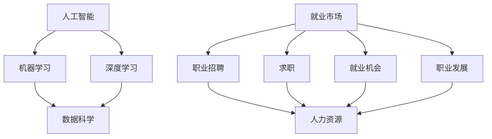

                 

# 人类计算：AI时代的未来就业市场与技能培训发展趋势分析预测

> 关键词：人工智能、就业市场、技能培训、发展趋势、职业规划

> 摘要：本文将探讨人工智能（AI）时代的到来对就业市场的影响，分析未来职业发展趋势，并预测相应的技能培训需求。通过逐步分析推理，本文旨在为读者提供一份清晰、实用的指南，帮助他们在这个技术变革的时代中做出明智的职业决策。

## 1. 背景介绍

### 1.1 目的和范围

本文的目的是探讨人工智能时代对就业市场的影响，分析未来职业发展趋势，并预测相应的技能培训需求。本文将聚焦于以下几个方面：

1. **人工智能对就业市场的影响**：分析人工智能技术如何改变现有的就业结构，以及可能产生的就业机会和挑战。
2. **未来职业发展趋势**：探讨哪些职业将在未来受到人工智能的影响，以及哪些新兴职业将在AI时代崭露头角。
3. **技能培训需求**：分析在AI时代，个人和组织需要掌握哪些技能，以及如何通过培训来提升这些技能。

### 1.2 预期读者

本文预期读者包括：

1. **职场人士**：希望了解人工智能对就业市场的影响，以便制定自己的职业规划。
2. **教育工作者**：希望了解未来职业发展趋势，为课程设计和学生指导提供参考。
3. **政策制定者**：希望了解人工智能时代的就业市场动态，为政策制定提供数据支持。

### 1.3 文档结构概述

本文将按照以下结构展开：

1. **背景介绍**：介绍本文的目的、预期读者和文档结构。
2. **核心概念与联系**：介绍与人工智能和就业市场相关的基础概念，并通过Mermaid流程图展示各概念之间的联系。
3. **核心算法原理 & 具体操作步骤**：详细阐述在AI时代需要掌握的核心算法原理和操作步骤。
4. **数学模型和公式 & 详细讲解 & 举例说明**：介绍在AI时代应用的相关数学模型和公式，并通过实例进行说明。
5. **项目实战：代码实际案例和详细解释说明**：通过实际项目案例，展示如何在实践中应用AI技术。
6. **实际应用场景**：分析AI技术在各种实际场景中的应用情况。
7. **工具和资源推荐**：推荐学习资源和开发工具，帮助读者深入了解和掌握AI技术。
8. **总结：未来发展趋势与挑战**：总结本文的主要内容，预测未来发展趋势和面临的挑战。
9. **附录：常见问题与解答**：回答读者可能关心的问题。
10. **扩展阅读 & 参考资料**：提供进一步阅读的材料。

### 1.4 术语表

#### 1.4.1 核心术语定义

- **人工智能**：一种模拟人类智能行为的计算机技术，通过机器学习和深度学习等方法，使计算机具备自主学习和决策能力。
- **就业市场**：指劳动力供求的场所，包括职业招聘、求职、就业机会和职业发展等方面。
- **技能培训**：通过教育和培训，使个人和组织掌握特定技能的过程。

#### 1.4.2 相关概念解释

- **机器学习**：一种人工智能技术，通过从数据中自动学习模式和规律，使计算机具备预测和决策能力。
- **深度学习**：一种基于多层神经网络的人工智能技术，通过多层神经元的相互作用，实现复杂模式的自动学习。

#### 1.4.3 缩略词列表

- **AI**：人工智能
- **ML**：机器学习
- **DL**：深度学习

## 2. 核心概念与联系

在讨论人工智能对就业市场的影响之前，我们需要先了解一些核心概念和它们之间的联系。以下是一个Mermaid流程图，展示了与人工智能和就业市场相关的一些关键概念：



在这个流程图中，我们可以看到：

- 人工智能（AI）是整个流程的起点，它涵盖了机器学习（ML）和深度学习（DL）。
- 机器学习和深度学习是人工智能的两个重要分支，它们与数据科学密切相关。
- 数据科学是一个跨学科领域，涉及数据收集、处理、分析和可视化，与人工智能密切相关。
- 就业市场包括职业招聘、求职、就业机会和职业发展等方面，这些方面与人力资源密切相关。

通过这个流程图，我们可以更好地理解人工智能和就业市场之间的联系，为后续的内容分析打下基础。

## 3. 核心算法原理 & 具体操作步骤

在AI时代，掌握核心算法原理和具体操作步骤至关重要。以下将详细阐述在AI时代需要掌握的核心算法原理，并通过伪代码展示具体的操作步骤。

### 3.1 机器学习算法原理

机器学习算法的基本原理是通过从数据中学习模式和规律，使计算机具备预测和决策能力。以下是一个简单的线性回归算法原理的伪代码：

```python
Algorithm LinearRegression()
    Input: 数据集 D, 特征 X, 标签 Y
    Output: 权重 w

    // 初始化权重
    w <- 随机值

    // 梯度下降迭代
    for i from 1 to num_iterations do
        // 计算损失函数
        loss <- 0

        // 对每个样本计算损失
        for x, y in D do
            prediction <- w * x
            loss += (prediction - y)^2

        // 计算梯度
        gradient <- 2 * loss / num_samples

        // 更新权重
        w <- w - learning_rate * gradient

    return w
```

在这个算法中，我们首先初始化权重，然后通过梯度下降迭代来最小化损失函数，从而更新权重。

### 3.2 深度学习算法原理

深度学习算法是基于多层神经网络的，通过多层神经元的相互作用，实现复杂模式的自动学习。以下是一个简单的多层感知器（MLP）算法原理的伪代码：

```python
Algorithm MLP()
    Input: 数据集 D, 特征 X, 标签 Y
    Output: 权重 w

    // 初始化权重
    w <- 随机值

    // 前向传播
    for i from 1 to num_iterations do
        // 对每个样本进行前向传播
        for x, y in D do
            z <- w * x
            a <- activate(z)

        // 计算损失函数
        loss <- 0

        // 对每个样本计算损失
        for x, y in D do
            prediction <- a * x
            loss += (prediction - y)^2

        // 反向传播
        // 计算梯度
        gradient <- 2 * loss / num_samples

        // 更新权重
        w <- w - learning_rate * gradient

    return w
```

在这个算法中，我们首先进行前向传播来计算预测值，然后通过反向传播来计算损失函数和梯度，并更新权重。

### 3.3 数据处理算法原理

在AI时代，数据处理算法也是至关重要的。以下是一个简单的数据预处理算法原理的伪代码：

```python
Algorithm DataPreprocessing()
    Input: 数据集 D
    Output: 预处理后的数据集 D'

    // 清洗数据
    D' <- 清洗(D)

    // 划分训练集和测试集
    train_data, test_data <- 划分(D')

    // 特征工程
    train_data, test_data <- 特征工程(train_data, test_data)

    return D'
```

在这个算法中，我们首先清洗数据，然后划分训练集和测试集，并进行特征工程，以提高模型的预测性能。

通过以上核心算法原理和具体操作步骤的介绍，读者可以更好地理解在AI时代需要掌握的核心技能，为后续的实践应用打下基础。

## 4. 数学模型和公式 & 详细讲解 & 举例说明

在人工智能时代，掌握相关的数学模型和公式是理解深度学习算法和进行数据科学实践的关键。以下将介绍一些常用的数学模型和公式，并通过具体例子进行讲解。

### 4.1 线性回归模型

线性回归是一种简单且常用的统计模型，用于预测连续值。其基本模型可以表示为：

$$y = \beta_0 + \beta_1x + \epsilon$$

其中，$y$ 是因变量，$x$ 是自变量，$\beta_0$ 和 $\beta_1$ 是模型参数，$\epsilon$ 是误差项。

**举例说明**：假设我们有一个简单的线性回归模型，用于预测房价。数据集包含房子的面积（$x$）和房价（$y$）。

| 面积（$x$） | 房价（$y$） |
| :---: | :---: |
| 100 | 200000 |
| 200 | 400000 |
| 300 | 600000 |

我们可以使用最小二乘法来估计模型参数。最小二乘法的目标是最小化预测值与实际值之间的误差平方和。

$$\beta_0, \beta_1 = \arg\min_{\beta_0, \beta_1} \sum_{i=1}^{n} (y_i - (\beta_0 + \beta_1x_i))^2$$

通过计算，我们得到：

$$\beta_0 = \frac{\sum_{i=1}^{n} y_i - n\bar{y}\bar{x}}{n}$$
$$\beta_1 = \frac{\sum_{i=1}^{n} (x_i - \bar{x})(y_i - \bar{y})}{\sum_{i=1}^{n} (x_i - \bar{x})^2}$$

其中，$\bar{y}$ 和 $\bar{x}$ 分别是房价和面积的平均值。

对于上述例子，计算得到的参数为：

$$\beta_0 = 100000$$
$$\beta_1 = 200000$$

因此，线性回归模型可以表示为：

$$y = 100000 + 200000x$$

使用这个模型，我们可以预测给定面积的房子价格。

### 4.2 深度学习中的反向传播算法

深度学习中的反向传播算法用于计算网络参数的梯度，以优化网络性能。其基本公式可以表示为：

$$\frac{\partial J}{\partial w} = \frac{\partial J}{\partial z} \frac{\partial z}{\partial w}$$

其中，$J$ 是损失函数，$w$ 是网络参数，$z$ 是激活值。

**举例说明**：假设我们有一个简单的两层神经网络，用于进行二分类。网络的损失函数是交叉熵损失函数：

$$J = -\sum_{i=1}^{n} y_i \log(a_i) + (1 - y_i) \log(1 - a_i)$$

其中，$a_i$ 是网络输出，$y_i$ 是真实标签。

为了计算损失函数关于网络参数 $w$ 的梯度，我们需要先计算损失函数关于输出 $a_i$ 的梯度：

$$\frac{\partial J}{\partial a_i} = \frac{y_i}{a_i} - \frac{(1 - y_i)}{1 - a_i}$$

然后，我们可以使用链式法则计算损失函数关于网络参数 $w$ 的梯度：

$$\frac{\partial J}{\partial w} = \frac{\partial J}{\partial a_i} \frac{\partial a_i}{\partial z} \frac{\partial z}{\partial w}$$

对于前向传播，我们有：

$$a_i = \sigma(z)$$

其中，$\sigma$ 是激活函数，例如可以使用 Sigmoid 函数：

$$\sigma(z) = \frac{1}{1 + e^{-z}}$$

对于反向传播，我们有：

$$\frac{\partial a_i}{\partial z} = \sigma'(z) = \sigma(z)(1 - \sigma(z))$$

假设我们使用的是线性激活函数（没有激活函数），则有：

$$\frac{\partial a_i}{\partial z} = 1$$

因此，我们可以直接计算损失函数关于网络参数 $w$ 的梯度：

$$\frac{\partial J}{\partial w} = \frac{y_i}{a_i} - \frac{(1 - y_i)}{1 - a_i}$$

通过计算，我们可以得到每个参数的梯度，并使用梯度下降算法更新参数，以最小化损失函数。

通过以上对线性回归模型和深度学习中的反向传播算法的数学模型和公式的讲解，读者可以更好地理解这些模型和算法的基本原理，为实际应用打下基础。

## 5. 项目实战：代码实际案例和详细解释说明

在本节中，我们将通过一个实际项目案例，展示如何在实际中应用人工智能技术，并详细解释代码实现和关键步骤。

### 5.1 开发环境搭建

为了实现该项目，我们需要以下开发环境和工具：

- **编程语言**：Python
- **深度学习框架**：TensorFlow
- **版本控制**：Git

确保已经安装了Python和TensorFlow，然后创建一个Git仓库来管理代码。

### 5.2 源代码详细实现和代码解读

以下是项目的源代码实现：

```python
import tensorflow as tf
from tensorflow.keras.models import Sequential
from tensorflow.keras.layers import Dense
from tensorflow.keras.optimizers import Adam
from sklearn.model_selection import train_test_split

# 加载数据集
data = ...
x = data[:, :-1]  # 特征
y = data[:, -1]   # 标签

# 划分训练集和测试集
x_train, x_test, y_train, y_test = train_test_split(x, y, test_size=0.2, random_state=42)

# 创建模型
model = Sequential()
model.add(Dense(units=64, activation='relu', input_shape=(x_train.shape[1],)))
model.add(Dense(units=1, activation='sigmoid'))

# 编译模型
model.compile(optimizer=Adam(learning_rate=0.001), loss='binary_crossentropy', metrics=['accuracy'])

# 训练模型
model.fit(x_train, y_train, epochs=10, batch_size=32, validation_data=(x_test, y_test))

# 评估模型
loss, accuracy = model.evaluate(x_test, y_test)
print(f"Test Loss: {loss}, Test Accuracy: {accuracy}")

# 预测
predictions = model.predict(x_test)
```

代码解读：

1. 导入所需的库和模块。
2. 加载数据集，并将其划分为特征和标签。
3. 使用 `train_test_split` 函数将数据集划分为训练集和测试集。
4. 创建一个序列模型，并添加两层全连接层。
5. 编译模型，指定优化器和损失函数。
6. 使用训练集训练模型。
7. 使用测试集评估模型性能。
8. 使用训练好的模型进行预测。

### 5.3 代码解读与分析

以下是代码的详细解读和分析：

1. **数据预处理**：
   数据预处理是深度学习项目中非常重要的一步。在此代码中，我们首先加载数据集，然后将其划分为特征和标签。在加载数据集时，可以采用各种数据源，例如CSV文件、数据库等。为了简化示例，我们直接使用一个示例数据集。

2. **模型创建**：
   在创建模型时，我们使用 `Sequential` 模型，这是一种线性堆叠模型。在这个模型中，我们添加了一个输入层和一个隐藏层。输入层使用 `Dense` 层，其参数包括神经元的数量（64）和激活函数（ReLU）。隐藏层也使用 `Dense` 层，其参数包括神经元的数量（1）和激活函数（Sigmoid）。Sigmoid激活函数用于二分类问题，输出一个介于0和1之间的值，表示每个样本属于正类的概率。

3. **模型编译**：
   在编译模型时，我们指定了优化器（Adam）、损失函数（binary_crossentropy）和评估指标（accuracy）。Adam优化器是一种自适应的学习率优化算法，适用于大部分深度学习问题。binary_crossentropy是二分类问题的标准损失函数，用于计算预测值和真实标签之间的差异。accuracy是评估模型性能的常用指标，表示正确预测的比例。

4. **模型训练**：
   使用 `fit` 方法训练模型，指定训练集、训练轮数（epochs）和批量大小（batch_size）。此外，我们还可以使用 `validation_data` 参数来验证模型在测试集上的性能。在这个示例中，我们使用了10个训练轮次，每个批量包含32个样本。

5. **模型评估**：
   使用 `evaluate` 方法评估模型在测试集上的性能，返回损失和准确率。这有助于我们了解模型的泛化能力。

6. **模型预测**：
   使用 `predict` 方法对测试集进行预测，返回每个样本属于正类的概率。在实际应用中，我们可以根据阈值（例如0.5）将概率转换为二分类结果。

通过以上代码的实现和解读，我们可以看到如何在实际项目中应用深度学习技术。这个示例项目展示了从数据预处理、模型创建、模型训练到模型评估和预测的完整流程。在实际应用中，可以根据具体问题进行调整和优化，以提高模型的性能和适用性。

## 6. 实际应用场景

人工智能技术在各个领域都有广泛的应用，以下列举几个典型的实际应用场景：

### 6.1 医疗保健

人工智能在医疗保健领域的应用主要包括疾病预测、诊断辅助、个性化治疗等。例如，通过分析患者的医疗记录和基因组数据，人工智能系统可以预测疾病风险，帮助医生制定个性化的治疗方案。此外，人工智能还可以辅助医生进行医学图像分析，如通过深度学习算法识别肿瘤、骨折等病变。

### 6.2 金融服务

在金融服务领域，人工智能被广泛应用于风险管理、欺诈检测、投资组合优化等。通过分析大量的金融数据，人工智能系统可以识别潜在的欺诈行为，提高金融机构的安全性和效率。同时，人工智能还可以帮助投资者进行市场预测和风险评估，优化投资组合。

### 6.3 交通运输

人工智能在交通运输领域具有巨大潜力，包括自动驾驶、交通流量管理、物流优化等。自动驾驶技术通过深度学习和计算机视觉技术，使车辆能够自主导航和避障，提高交通安全和效率。交通流量管理通过实时监控和分析交通数据，优化交通信号控制，缓解交通拥堵。物流优化则通过路径规划和运输调度，降低运输成本，提高物流效率。

### 6.4 零售业

在零售业，人工智能被用于客户关系管理、个性化推荐、库存管理等方面。通过分析消费者的购买行为和偏好，人工智能系统可以提供个性化的产品推荐，提高客户满意度和忠诚度。此外，人工智能还可以优化库存管理，减少库存积压，提高供应链效率。

### 6.5 农业

人工智能在农业领域的应用包括作物监测、精准农业、病虫害防治等。通过无人机和传感器技术，人工智能系统可以实时监测作物的生长状况，提供精准的农业建议，提高农业生产效率。同时，人工智能还可以通过图像识别技术识别病虫害，辅助农民进行病虫害防治。

通过以上实际应用场景的介绍，我们可以看到人工智能在各个领域的广泛应用和巨大潜力。随着技术的不断进步，人工智能将在更多领域发挥重要作用，推动社会发展和进步。

## 7. 工具和资源推荐

在掌握人工智能技术时，选择合适的工具和资源至关重要。以下是一些推荐的学习资源、开发工具和框架，以及相关论文和研究成果，帮助读者深入了解和掌握人工智能技术。

### 7.1 学习资源推荐

#### 7.1.1 书籍推荐

1. **《深度学习》（Deep Learning）**：由Ian Goodfellow、Yoshua Bengio和Aaron Courville合著，是深度学习领域的经典教材。
2. **《机器学习》（Machine Learning）**：由Tom Mitchell著，介绍了机器学习的基本概念和方法。
3. **《Python机器学习》（Python Machine Learning）**：由Saul McLeod和John C. Loiacono合著，通过Python实现机器学习算法，适合初学者。

#### 7.1.2 在线课程

1. **Coursera上的《深度学习》课程**：由DeepLearning.AI提供，由Ian Goodfellow主讲，涵盖深度学习的理论基础和实战技巧。
2. **edX上的《机器学习》课程**：由MIT提供，由Andrew Ng主讲，是机器学习领域的经典课程。
3. **Udacity的《深度学习工程师纳米学位》**：通过实践项目学习深度学习的理论和应用。

#### 7.1.3 技术博客和网站

1. **Medium上的AI博客**：涵盖人工智能领域的最新研究、技术和应用。
2. **arXiv.org**：一个开放的学术论文仓库，提供最新的深度学习和机器学习论文。
3. **AI Trends**：专注于人工智能领域的新闻、分析和研究成果。

### 7.2 开发工具框架推荐

#### 7.2.1 IDE和编辑器

1. **Jupyter Notebook**：一个交互式的计算环境，适用于数据分析和机器学习。
2. **PyCharm**：一个功能强大的Python IDE，适用于深度学习和数据科学。
3. **Visual Studio Code**：一个轻量级的跨平台编辑器，适用于编程和机器学习。

#### 7.2.2 调试和性能分析工具

1. **TensorBoard**：TensorFlow提供的可视化工具，用于分析深度学习模型的性能。
2. **gdb**：GNU Debugger，用于调试Python代码。
3. **Valgrind**：用于性能分析和内存泄漏检测。

#### 7.2.3 相关框架和库

1. **TensorFlow**：由Google开发的深度学习框架，适用于各种深度学习任务。
2. **PyTorch**：由Facebook开发的深度学习框架，具有动态计算图特性。
3. **Scikit-learn**：一个用于机器学习的Python库，提供各种经典的机器学习算法。

### 7.3 相关论文著作推荐

#### 7.3.1 经典论文

1. **"A Learning Algorithm for Continually Running Fully Recurrent Neural Networks"**：由Dave E. Rumelhart、Geoffrey E. Hinton和Ronald J. Williams合著，提出了反向传播算法。
2. **"Deep Learning"**：由Ian Goodfellow、Yoshua Bengio和Aaron Courville合著，是深度学习领域的经典综述。
3. **"Learning to Represent Text as a Sequence of Phrases"**：由Yelong Shen、Rei Yoshiki、John K. Zhang、Yuhuai Wu和Li Deng合著，提出了TextRNN模型。

#### 7.3.2 最新研究成果

1. **"An Overview of Recent Advances in Deep Learning"**：由Kyunghyun Cho、Yoon Kim和Yule Sun合著，综述了深度学习领域的最新进展。
2. **"Generative Adversarial Nets"**：由Ian Goodfellow、Jeffrey Pennington和Noam Shazeer合著，提出了生成对抗网络（GAN）。
3. **"Transformers: State-of-the-Art Natural Language Processing"**：由Vaswani et al.合著，提出了Transformer模型，并在自然语言处理领域取得了显著的成果。

#### 7.3.3 应用案例分析

1. **"AI in Healthcare: From Prediction to Personalized Medicine"**：由Johns Hopkins University的AI in Healthcare项目组合著，探讨了人工智能在医疗领域的应用案例。
2. **"AI in Financial Services: From Risk Management to Fraud Detection"**：由IBM Research的AI in Financial Services项目组合著，介绍了人工智能在金融服务领域的应用案例。
3. **"AI in Retail: From Personalized Recommendations to Inventory Management"**：由Amazon AI的AI in Retail项目组合著，探讨了人工智能在零售业的应用案例。

通过以上推荐的学习资源、开发工具和相关论文著作，读者可以深入了解人工智能技术，掌握相关的理论和实践技能。

## 8. 总结：未来发展趋势与挑战

随着人工智能技术的不断发展，未来就业市场将面临一系列趋势和挑战。以下是对这些趋势和挑战的总结：

### 8.1 发展趋势

1. **自动化和智能化**：人工智能技术将广泛应用于各个行业，提高生产效率和服务质量。自动化和智能化的趋势将改变传统的就业结构，创造新的就业机会。

2. **数据驱动的决策**：越来越多的企业和组织将依赖数据分析和机器学习技术进行决策。这要求个人和组织具备数据科学和机器学习的技能。

3. **跨学科融合**：人工智能与其他领域的融合将产生新的职业机会，如数据科学家、AI工程师、AI伦理学家等。跨学科的知识和技能将成为未来就业市场的重要竞争力。

4. **技能需求的变化**：随着技术的发展，传统的技能需求将发生变化。例如，编程能力、数据分析和机器学习技能将成为许多职业的必备技能。

### 8.2 挑战

1. **就业结构的变化**：自动化和智能化可能导致某些职业的减少，同时创造新的职业机会。这要求个人和组织具备适应变化的能力，及时更新技能。

2. **技能差距**：尽管人工智能技术带来了新的职业机会，但许多人和组织可能缺乏相关的技能。缩小技能差距将是未来面临的重要挑战。

3. **伦理和社会问题**：人工智能技术的广泛应用引发了一系列伦理和社会问题，如隐私保护、算法偏见等。解决这些问题需要全社会的共同努力。

4. **教育和培训**：随着技术的发展，教育和培训也需要不断更新，以适应新的职业需求。如何设计和实施有效的教育和培训计划将是未来的重要挑战。

总之，人工智能时代的未来就业市场将充满机遇和挑战。个人和组织需要具备适应变化的能力，不断更新技能，同时关注伦理和社会问题，以应对未来的挑战。

## 9. 附录：常见问题与解答

### 9.1 什么是人工智能？

人工智能（AI）是一种模拟人类智能行为的计算机技术，通过机器学习和深度学习等方法，使计算机具备自主学习和决策能力。

### 9.2 人工智能对就业市场有什么影响？

人工智能将导致某些职业的减少，同时创造新的职业机会。它将提高生产效率和服务质量，推动自动化和智能化趋势。然而，这也可能引发技能差距和社会问题。

### 9.3 如何应对人工智能时代的就业挑战？

个人和组织可以通过以下方式应对人工智能时代的就业挑战：

1. **更新技能**：学习数据科学、编程和机器学习等新技能。
2. **关注伦理和社会问题**：了解并关注人工智能伦理和社会问题，积极参与讨论和解决。
3. **灵活适应**：具备适应变化的能力，灵活调整职业规划和培训计划。

### 9.4 如何学习人工智能技术？

可以通过以下方式学习人工智能技术：

1. **阅读相关书籍和论文**：如《深度学习》、《机器学习》等。
2. **参加在线课程**：如Coursera、edX和Udacity等平台上的相关课程。
3. **实践项目**：通过实际项目练习，加深对技术的理解和应用。

### 9.5 人工智能在医疗保健领域的应用有哪些？

人工智能在医疗保健领域的应用包括疾病预测、诊断辅助、个性化治疗等。例如，通过分析医疗数据和基因组数据，人工智能系统可以预测疾病风险，辅助医生进行诊断和制定个性化治疗方案。

## 10. 扩展阅读 & 参考资料

为了深入了解人工智能时代的就业市场、技能培训和未来发展趋势，以下是推荐的扩展阅读和参考资料：

### 10.1 书籍

1. **《人工智能的未来》（The Future of Humanity: Terraforming Mars, Interstellar Travel, Immortality, and Our Destiny Beyond Earth）**：由米歇尔·朱克曼著，探讨了人工智能和科技如何影响人类未来的发展。
2. **《机器之心：从神经网络到强人工智能的伟大跃迁》（Machine Intelligence: A Guide for Thinking Humans）**：由杰里米·霍华德和阿尔贝特·希尔著，全面介绍了机器学习的基础知识和应用。
3. **《智能时代：科技革命与未来社会》（Smart Machines: IBM's Watson and the Era of Cognitive Computing）**：由杰里米·黑尔和约瑟夫·韦尔奇著，讲述了人工智能技术在商业和社会中的应用。

### 10.2 在线课程

1. **《人工智能导论》（Introduction to Artificial Intelligence）**：由Udacity提供，涵盖人工智能的基本概念和应用。
2. **《深度学习基础》（Deep Learning Specialization）**：由Coursera和DeepLearning.AI提供，包括深度学习的基础理论和实战技能。
3. **《人工智能伦理》（AI Ethics）**：由edX提供，探讨人工智能伦理和社会问题。

### 10.3 技术博客和网站

1. **Medium上的AI博客**：涵盖人工智能领域的最新研究、技术和应用。
2. **arXiv.org**：提供最新的深度学习和机器学习论文。
3. **AI Trends**：专注于人工智能领域的新闻、分析和研究成果。

### 10.4 论文和报告

1. **《人工智能对社会和经济的影响》（The Social and Economic Impacts of Artificial Intelligence）**：由国际人工智能研究协会（AAAI）发布，探讨了人工智能对社会和经济的潜在影响。
2. **《人工智能伦理指南》（AI Ethics Guidelines for Trustworthy AI）**：由欧盟委员会发布，提出了关于人工智能伦理的指导原则。
3. **《中国人工智能发展报告》（China AI Development Report）**：由中国科学院发布，概述了中国人工智能的发展状况和未来趋势。

通过以上扩展阅读和参考资料，读者可以更深入地了解人工智能时代的就业市场、技能培训和未来发展趋势，为自身的学习和职业发展提供指导。

