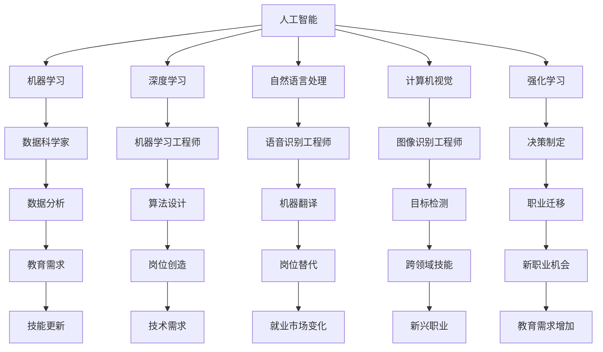

                 

### 1. 背景介绍

在当今这个快速发展的AI时代，人工智能（AI）技术的不断进步和应用已经深刻地影响了各行各业，尤其是在就业市场和技能培训领域。AI的出现和广泛应用，不仅改变了人类的工作方式，还对未来的就业市场产生了深远的影响。本文旨在探讨AI时代的未来就业市场变化，分析AI对传统岗位的影响，以及职业技能培训的发展趋势。

#### 1.1 目的和范围

本文的主要目的是：
- 分析AI技术对就业市场的影响，预测未来就业市场的趋势。
- 探讨职业技能培训在AI时代的需求和变化，为从业者提供有价值的培训方向。
- 为企业和教育机构提供关于AI时代人才需求的策略建议。

本文将涵盖以下内容：
- AI技术的定义和分类。
- AI对传统岗位的影响，包括积极和消极的影响。
- 未来就业市场的趋势分析。
- 职业技能培训的发展趋势。
- AI时代的人才培养策略。

#### 1.2 预期读者

本文适合以下读者群体：
- 对AI技术感兴趣的技术从业者。
- 想要了解AI时代就业市场变化的企业管理者。
- 需要提升职业技能的在职人员。
- 从事职业培训的教育工作者。

#### 1.3 文档结构概述

本文分为十个部分，具体结构如下：

1. 背景介绍
   - 1.1 目的和范围
   - 1.2 预期读者
   - 1.3 文档结构概述
   - 1.4 术语表
2. 核心概念与联系
   - 2.1 AI技术概述
   - 2.2 AI与就业市场的关系
3. 核心算法原理 & 具体操作步骤
   - 3.1 AI算法基础
   - 3.2 数据处理与模型训练
4. 数学模型和公式 & 详细讲解 & 举例说明
   - 4.1 数学模型介绍
   - 4.2 公式详细讲解
   - 4.3 实例分析
5. 项目实战：代码实际案例和详细解释说明
   - 5.1 开发环境搭建
   - 5.2 源代码详细实现和代码解读
   - 5.3 代码解读与分析
6. 实际应用场景
   - 6.1 企业应用案例
   - 6.2 政府机构应用案例
7. 工具和资源推荐
   - 7.1 学习资源推荐
   - 7.2 开发工具框架推荐
   - 7.3 相关论文著作推荐
8. 总结：未来发展趋势与挑战
9. 附录：常见问题与解答
10. 扩展阅读 & 参考资料

#### 1.4 术语表

在本文中，以下术语具有特定含义：

- **人工智能（AI）**：一种模拟人类智能的技术，能够进行感知、学习、推理、决策等操作。
- **机器学习（ML）**：AI的一个分支，通过数据学习来改进性能。
- **深度学习（DL）**：机器学习的一个子领域，利用多层神经网络进行数据建模。
- **自然语言处理（NLP）**：AI的一个应用领域，处理和理解人类语言。
- **就业市场**：指求职者和雇主之间的互动市场。
- **职业技能培训**：为提高职业能力而进行的培训活动。

#### 1.4.1 核心术语定义

- **人工智能（AI）**：人工智能是指计算机系统模拟人类智能行为的科学技术，包括感知、学习、推理、决策、理解自然语言等能力。
- **机器学习（ML）**：机器学习是AI的一个分支，通过算法从数据中学习，以实现对未知数据的预测或分类。
- **深度学习（DL）**：深度学习是机器学习的一个子领域，它使用多层神经网络进行数据建模，具有强大的表达能力和学习能力。

#### 1.4.2 相关概念解释

- **神经网络**：神经网络是一种模仿生物神经系统的计算模型，由多个神经元连接而成，用于数据处理和预测。
- **算法**：算法是一系列用于解决问题的步骤和方法。
- **模型训练**：模型训练是使用数据来调整机器学习模型的参数，以改进其性能。

#### 1.4.3 缩略词列表

- **AI**：人工智能
- **ML**：机器学习
- **DL**：深度学习
- **NLP**：自然语言处理
- **GPU**：图形处理单元
- **CPU**：中央处理单元

### 1.5 关键词

- 人工智能
- 机器学习
- 深度学习
- 自然语言处理
- 就业市场
- 技能培训
- 未来趋势

### 1.6 摘要

本文分析了人工智能（AI）时代对就业市场的影响，探讨了AI技术对传统岗位的积极和消极影响，以及未来就业市场的趋势。此外，文章还详细介绍了职业技能培训在AI时代的发展方向，包括所需的技能和培训方法。通过本文，读者可以更好地理解AI时代下的就业市场和职业技能培训，为个人和企业提供有益的指导。本文适合技术从业者、企业管理者、职业培训人员和有志于在AI领域发展的人士阅读。### 1.6 摘要

随着人工智能（AI）技术的迅速发展，AI已经成为推动社会变革的重要力量，深刻地影响了各行各业，特别是在就业市场和技能培训领域。AI不仅改变了传统的岗位，还创造了新的职业机会，对未来的就业市场产生了深远的影响。本文将全面探讨AI时代的就业市场变化，分析AI对传统岗位的影响，以及职业技能培训在AI时代的需求和趋势。

#### AI时代的就业市场分析

AI技术正在以惊人的速度改变着就业市场的格局。一方面，AI技术的高效性和自动化能力正在逐步取代一些传统岗位，例如制造业中的流水线操作员、客服中的电话服务员等。这些岗位对劳动力的需求减少，导致部分从业者面临失业的风险。另一方面，AI技术的应用也创造了新的就业机会，如数据科学家、机器学习工程师、AI算法设计师等。这些新兴职业需要具备较强的技术能力和创新能力，吸引了大量求职者的关注。

#### 传统岗位的影响

AI对传统岗位的影响是双重的。积极方面，AI技术的引入可以提高生产效率，降低成本，提高服务质量，从而为企业创造更大的价值。例如，在金融行业，AI可以自动化风险分析和信用评估，提高金融服务的准确性和速度。消极方面，AI技术的广泛应用可能导致部分岗位的消失，尤其是那些重复性高、技能要求低的岗位。这可能会引发失业和社会不稳定的问题。

#### 未来就业市场的趋势

未来就业市场的趋势将受到AI技术发展的强烈影响。以下是一些重要的趋势：

1. **技能需求的转变**：随着AI技术的普及，对技术型人才的需求将不断增加。特别是对机器学习、深度学习、自然语言处理等AI相关领域的专业人才需求将大幅增加。

2. **工作与技能的重新定义**：传统的岗位可能会被分解成更细化的工作模块，每个模块都需要不同的技能。这意味着从业者需要具备跨领域的技能，才能在未来的就业市场中保持竞争力。

3. **教育与培训的重要性**：为了适应AI时代的需求，教育和培训将变得更加重要。从业者需要不断更新自己的知识和技能，以适应不断变化的工作环境。

4. **新兴职业的崛起**：AI技术的发展将催生一系列新兴职业，如AI咨询师、数据伦理师、AI算法审计员等。这些新兴职业将填补传统岗位消失带来的空缺，同时为社会创造新的就业机会。

#### 技能培训在AI时代的需求和趋势

在AI时代，职业技能培训的需求将显著增加。以下是一些重要的培训和技能发展趋势：

1. **技术技能培训**：为了适应AI技术的发展，从业者需要接受专业的AI技术培训，包括机器学习、深度学习、数据科学等领域的知识。

2. **软技能培训**：在AI时代，软技能同样重要。例如，沟通能力、团队合作能力、创新能力等，这些技能将帮助从业者更好地应对复杂的工作环境。

3. **跨领域技能培训**：为了在未来的就业市场中保持竞争力，从业者需要具备跨领域的技能。例如，将数据分析技能与市场营销或产品管理相结合，可以创造更多的工作机会。

4. **持续学习与自我提升**：在AI时代，知识更新速度非常快，从业者需要具备持续学习和自我提升的能力，以跟上技术发展的步伐。

综上所述，AI时代的就业市场和职业技能培训将面临巨大的变革。本文旨在为读者提供关于这些变革的深入分析和理解，帮助从业者更好地应对未来的挑战。通过本文，读者可以了解到AI技术对就业市场的深远影响，以及如何通过职业技能培训来提升自身竞争力。希望本文能为读者在AI时代的职业发展提供有价值的参考和指导。### 2. 核心概念与联系

为了深入理解AI时代对就业市场的影响，我们需要首先掌握一些核心概念和它们之间的联系。在本节中，我们将介绍人工智能（AI）技术的基本概念、AI与就业市场的关联，以及相关技术和领域的发展情况。

#### 2.1 AI技术概述

人工智能（AI）是一种通过计算机系统模拟人类智能的技术，旨在实现机器的感知、学习、推理、决策、理解和交流等智能行为。AI技术可以大致分为以下几类：

- **机器学习（ML）**：通过算法从数据中学习，以便在未知情况下进行预测或分类。
- **深度学习（DL）**：一种特殊的机器学习方法，使用多层神经网络进行数据建模，具有强大的表达能力和学习能力。
- **自然语言处理（NLP）**：专注于计算机理解和生成自然语言的技术，包括语音识别、机器翻译、情感分析等。
- **计算机视觉**：使计算机能够像人类一样理解和处理视觉信息，包括图像识别、目标检测、图像生成等。
- **强化学习**：通过试错和反馈来学习在特定环境中做出最优决策。

#### 2.2 AI与就业市场的关联

AI技术的发展不仅推动了科技进步，还对就业市场产生了深远的影响。以下是一些关键的关联：

1. **岗位替代**：AI技术的高效性和自动化能力正在逐步取代一些传统岗位。例如，在制造业中，机器人可以替代流水线操作员；在客服行业中，智能聊天机器人可以替代电话服务员。

2. **岗位创造**：虽然AI技术取代了一些传统岗位，但它也创造了新的就业机会。这些新岗位通常需要高度专业化的技能，如数据科学家、机器学习工程师、AI算法设计师等。

3. **技能需求变化**：随着AI技术的发展，对技能的需求也在发生变化。传统的职业技能可能变得过时，而新的技能，如编程、数据分析、机器学习等，变得越来越重要。

4. **职业迁移**：AI时代的工作者需要具备跨领域的技能，以便在新兴行业中找到新的职业机会。例如，一个市场营销人员可能需要学习数据分析技能，以便在AI驱动的营销领域找到工作。

5. **教育需求增加**：为了适应AI时代的需求，教育机构和职业培训将变得更加重要。从业者需要不断更新自己的知识和技能，以保持竞争力。

#### 2.3 相关技术和领域的发展情况

AI技术的快速发展得益于计算机硬件、算法和大数据等关键技术的进步。以下是一些相关技术和领域的发展情况：

- **计算机硬件**：随着图形处理单元（GPU）和中央处理单元（CPU）的性能提升，计算能力得到了极大的增强，为AI算法的复杂计算提供了可能。
- **算法创新**：研究人员不断提出新的算法，如深度学习中的卷积神经网络（CNN）和循环神经网络（RNN），这些算法在图像识别、语音识别等领域取得了显著进展。
- **大数据**：大量的数据为AI算法提供了训练素材，使得AI系统能够从海量数据中提取有价值的信息。
- **云计算**：云计算提供了强大的计算资源和存储能力，使得AI算法的部署和运行变得更加便捷和经济。

#### 2.4 Mermaid流程图

为了更直观地展示AI技术与就业市场的关联，我们可以使用Mermaid流程图来描述相关概念和流程。以下是一个简单的Mermaid流程图示例：



通过这个流程图，我们可以清晰地看到AI技术的各个分支如何与就业市场相关联，以及这些技术如何创造新的就业机会和改变现有的就业结构。

#### 2.5 核心概念原理和架构

在本节中，我们将进一步探讨AI技术的核心概念和架构，以便更深入地理解AI如何影响就业市场。

- **神经网络（Neural Networks）**：神经网络是AI的基础架构之一，由一系列相互连接的神经元组成。每个神经元都与其他神经元相连，并负责传递和处理信息。神经网络通过学习输入数据之间的模式和关系，来预测和分类未知数据。

  ```mermaid
  graph TD
      A[输入层] --> B[隐藏层1]
      B --> C[隐藏层2]
      C --> D[输出层]
      B --> E[反向传播]
      D --> F[激活函数]
  ```

- **机器学习算法（Machine Learning Algorithms）**：机器学习算法是神经网络的核心组件，用于训练和优化神经网络。常见的机器学习算法包括决策树、支持向量机（SVM）、随机森林、神经网络等。

  ```mermaid
  graph TD
      A[决策树] --> B[SVM]
      A --> C[随机森林]
      A --> D[神经网络]
  ```

- **深度学习模型（Deep Learning Models）**：深度学习模型是机器学习算法的扩展，具有多个隐藏层，能够处理更复杂的数据。深度学习模型在图像识别、语音识别和自然语言处理等领域取得了突破性进展。

  ```mermaid
  graph TD
      A[卷积神经网络（CNN）] --> B[循环神经网络（RNN）]
      A --> C[生成对抗网络（GAN）]
  ```

- **就业市场影响（Impact on the Job Market）**：AI技术对就业市场的影响可以通过以下几个方面来理解：

  - **岗位替代**：AI技术能够自动化许多重复性高、技能要求低的岗位，如制造业操作员、客服代表等。
  - **岗位创造**：AI技术的应用也创造了新的职业机会，如数据科学家、AI算法设计师、机器学习工程师等。
  - **技能需求**：随着AI技术的发展，对技术型人才的需求增加，特别是对编程、数据分析、机器学习等领域的专业人才需求更高。
  - **职业迁移**：传统岗位的消失迫使从业者需要迁移到新兴行业，如人工智能、大数据等。

  ```mermaid
  graph TD
      A[AI技术] --> B[岗位替代]
      A --> C[岗位创造]
      A --> D[技能需求]
      A --> E[职业迁移]
  ```

通过上述核心概念和架构的介绍，我们可以更深入地理解AI技术如何影响就业市场，以及从业者如何适应这些变化。在接下来的章节中，我们将进一步探讨AI算法的具体原理、操作步骤，以及数学模型和公式，帮助读者全面了解AI技术及其应用。### 3. 核心算法原理 & 具体操作步骤

在深入探讨AI算法的具体原理和操作步骤之前，我们需要了解一些基础概念和术语。AI算法是人工智能的核心组成部分，通过模拟人类的智能行为来实现特定任务。以下将介绍几种常见的AI算法，包括其基本原理和具体操作步骤。

#### 3.1 机器学习算法

机器学习算法是AI的一个重要分支，通过从数据中学习，使计算机能够做出预测或分类。以下是一些常见的机器学习算法：

1. **线性回归（Linear Regression）**：

线性回归是一种用于预测连续值的算法。其基本原理是找到一条最佳拟合直线，使得所有数据点到这条直线的距离之和最小。

**算法原理**：

给定一个训练数据集，算法通过最小二乘法找到最佳拟合直线的斜率和截距。

**具体操作步骤**：

- **初始化参数**：设定初始斜率`theta0`和截距`theta1`。
- **计算损失函数**：使用均方误差（MSE）作为损失函数，计算预测值和真实值之间的误差。
- **梯度下降**：使用梯度下降算法更新参数，最小化损失函数。

**伪代码**：

```python
def linear_regression(X, y):
    # 初始化参数
    theta = [0, 0]
    # 设置学习率
    alpha = 0.01
    # 设置迭代次数
    iterations = 1000
    # 计算损失函数
    def compute_loss(theta, X, y):
        predictions = X * theta
        return ((predictions - y) ** 2).mean()
    # 梯度下降
    for _ in range(iterations):
        gradients = 2 * X.T.dot(X * theta - y)
        theta -= alpha * gradients
    return theta
```

2. **逻辑回归（Logistic Regression）**：

逻辑回归是一种用于预测二分类结果的算法。其基本原理是通过寻找一个最佳的分隔超平面，使得不同类别的数据点被分隔得尽可能开。

**算法原理**：

给定一个训练数据集，算法通过最大化似然函数来找到最佳分隔超平面。

**具体操作步骤**：

- **初始化参数**：设定初始权重`theta`。
- **计算预测概率**：使用逻辑函数（Sigmoid函数）计算预测概率。
- **计算损失函数**：使用交叉熵损失函数（Cross-Entropy Loss）计算预测值和真实值之间的误差。
- **梯度下降**：使用梯度下降算法更新参数，最小化损失函数。

**伪代码**：

```python
def logistic_regression(X, y):
    # 初始化参数
    theta = np.random.randn(X.shape[1])
    # 设置学习率
    alpha = 0.01
    # 设置迭代次数
    iterations = 1000
    # 计算预测概率
    def compute_probabilities(theta, X):
        return 1 / (1 + np.exp(-X.dot(theta)))
    # 计算损失函数
    def compute_loss(theta, X, y):
        predictions = compute_probabilities(theta, X)
        return -y.dot(np.log(predictions)) - (1 - y).dot(np.log(1 - predictions))
    # 梯度下降
    for _ in range(iterations):
        gradients = X.T.dot((compute_probabilities(theta, X) - y))
        theta -= alpha * gradients
    return theta
```

3. **支持向量机（Support Vector Machine, SVM）**：

支持向量机是一种用于分类的算法，通过找到一个最佳的超平面，将不同类别的数据点分隔得尽可能开。

**算法原理**：

给定一个训练数据集，算法通过最大化分类边界和最小化训练误差来找到最佳超平面。

**具体操作步骤**：

- **初始化参数**：设定初始权重`theta`和间隔`C`。
- **计算分隔超平面**：使用核函数计算不同类别的分隔超平面。
- **计算损失函数**：使用Hinge损失函数计算预测值和真实值之间的误差。
- **梯度下降**：使用梯度下降算法更新参数，最小化损失函数。

**伪代码**：

```python
def svm(X, y):
    # 初始化参数
    theta = np.random.randn(X.shape[1])
    # 设置学习率
    alpha = 0.01
    # 设置迭代次数
    iterations = 1000
    # 计算分隔超平面
    def compute_hyperplane(theta, X):
        return X.dot(theta)
    # 计算损失函数
    def compute_loss(theta, X, y, C):
        margin = compute_hyperplane(theta, X)
        return np.where(margin > 1, 0, (1 - margin) ** 2).mean()
    # 梯度下降
    for _ in range(iterations):
        gradients = X.T.dot((compute_hyperplane(theta, X) - y) * (theta > 0))
        theta -= alpha * gradients
    return theta
```

#### 3.2 深度学习算法

深度学习算法是机器学习的一个子领域，通过多层神经网络（Deep Neural Networks, DNN）来处理复杂的数据。以下是一些常见的深度学习算法：

1. **卷积神经网络（Convolutional Neural Network, CNN）**：

卷积神经网络是一种用于图像识别的算法，通过卷积层和池化层来提取图像的特征。

**算法原理**：

给定一个图像数据集，CNN通过卷积层和池化层提取图像特征，并通过全连接层进行分类。

**具体操作步骤**：

- **初始化参数**：设定初始权重`theta`。
- **前向传播**：通过卷积层和池化层提取图像特征，并通过全连接层进行分类。
- **反向传播**：计算损失函数并更新参数。

**伪代码**：

```python
def cnn(X, y):
    # 初始化参数
    theta = np.random.randn(X.shape[1])
    # 设置学习率
    alpha = 0.01
    # 设置迭代次数
    iterations = 1000
    # 前向传播
    def forward_pass(X, theta):
        # 卷积层
        conv_output = convolve(X, theta)
        # 池化层
        pool_output = max_pool(conv_output)
        # 全连接层
        return pool_output.dot(theta)
    # 反向传播
    def backward_pass(loss, theta, X):
        gradients = 2 * (forward_pass(X, theta) - y).dot(X.T)
        return theta - alpha * gradients
    # 训练模型
    for _ in range(iterations):
        loss = compute_loss(forward_pass(X, theta), y)
        theta = backward_pass(loss, theta, X)
    return theta
```

2. **循环神经网络（Recurrent Neural Network, RNN）**：

循环神经网络是一种用于序列数据处理的算法，通过隐藏状态和循环连接来处理时间序列数据。

**算法原理**：

给定一个序列数据集，RNN通过隐藏状态和循环连接来处理序列中的每个元素，并生成输出序列。

**具体操作步骤**：

- **初始化参数**：设定初始权重`theta`。
- **前向传播**：通过隐藏状态和循环连接计算每个时间步的输出。
- **反向传播**：计算损失函数并更新参数。

**伪代码**：

```python
def rnn(X, y):
    # 初始化参数
    theta = np.random.randn(X.shape[1])
    # 设置学习率
    alpha = 0.01
    # 设置迭代次数
    iterations = 1000
    # 前向传播
    def forward_pass(X, theta):
        hidden_state = np.zeros((X.shape[1], 1))
        output_sequence = []
        for x in X:
            hidden_state = hidden_state.dot(theta) + x
            output_sequence.append(hidden_state)
        return output_sequence
    # 反向传播
    def backward_pass(loss, theta, X):
        gradients = 2 * (forward_pass(X, theta) - y).dot(X.T)
        return theta - alpha * gradients
    # 训练模型
    for _ in range(iterations):
        loss = compute_loss(forward_pass(X, theta), y)
        theta = backward_pass(loss, theta, X)
    return theta
```

3. **生成对抗网络（Generative Adversarial Network, GAN）**：

生成对抗网络是一种用于生成数据的算法，由生成器和判别器两个神经网络组成。

**算法原理**：

给定一个数据集，生成器生成数据，判别器判断生成数据的真实性。生成器和判别器通过对抗训练来优化，生成器生成的数据越来越真实。

**具体操作步骤**：

- **初始化参数**：设定生成器`G`和判别器`D`的初始权重。
- **前向传播**：生成器生成数据，判别器判断生成数据和真实数据的真假。
- **对抗训练**：通过反向传播和梯度下降更新生成器和判别器的参数。

**伪代码**：

```python
def gan(X, y):
    # 初始化参数
    G_theta = np.random.randn(X.shape[1])
    D_theta = np.random.randn(X.shape[1])
    # 设置学习率
    alpha = 0.01
    # 设置迭代次数
    iterations = 1000
    # 前向传播
    def forward_pass(X, G_theta, D_theta):
        generated_data = generate_data(X, G_theta)
        real_data = X
        D_output =判别器判断(generated_data, D_theta)
        G_output =判别器判断(real_data, D_theta)
        return generated_data, real_data, D_output, G_output
    # 反向传播
    def backward_pass(loss, G_theta, D_theta):
        gradients_G = 2 * (G_output - real_data).dot(X.T)
        gradients_D = 2 * (D_output - generated_data).dot(X.T)
        return G_theta - alpha * gradients_G, D_theta - alpha * gradients_D
    # 训练模型
    for _ in range(iterations):
        generated_data, real_data, D_output, G_output = forward_pass(X, G_theta, D_theta)
        G_theta, D_theta = backward_pass(D_output, G_theta, D_theta)
    return G_theta, D_theta
```

通过上述算法原理和具体操作步骤的介绍，我们可以看到机器学习和深度学习算法如何通过不同的模型和策略来解决实际的问题。在接下来的章节中，我们将进一步探讨AI技术的数学模型和公式，以及如何应用这些技术来解决实际问题。### 4. 数学模型和公式 & 详细讲解 & 举例说明

在AI技术中，数学模型和公式是理解和实现算法的基础。本节将详细介绍一些常用的数学模型和公式，并通过具体例子来说明它们的运用。

#### 4.1 数学模型介绍

1. **线性回归模型**：

线性回归模型是一种用于预测连续值的数学模型。其公式如下：

\[ y = \theta_0 + \theta_1 \cdot x \]

其中，\( y \) 是预测值，\( x \) 是输入特征，\( \theta_0 \) 和 \( \theta_1 \) 是模型的参数。

2. **逻辑回归模型**：

逻辑回归模型是一种用于预测二分类结果的数学模型。其公式如下：

\[ P(y=1) = \frac{1}{1 + e^{-(\theta_0 + \theta_1 \cdot x)}} \]

其中，\( P(y=1) \) 是预测的概率，\( x \) 是输入特征，\( \theta_0 \) 和 \( \theta_1 \) 是模型的参数。

3. **支持向量机（SVM）模型**：

支持向量机模型是一种用于分类的数学模型。其公式如下：

\[ w \cdot x + b = 0 \]

其中，\( w \) 是分隔超平面的权重向量，\( x \) 是特征向量，\( b \) 是偏置项。

4. **卷积神经网络（CNN）模型**：

卷积神经网络模型是一种用于图像识别的数学模型。其核心是卷积层和池化层，公式如下：

\[ output = f(\sum_{k=1}^{K} w_k \cdot x_k + b) \]

其中，\( output \) 是输出特征，\( f \) 是激活函数，\( w_k \) 是卷积核，\( x_k \) 是输入特征，\( b \) 是偏置项。

5. **循环神经网络（RNN）模型**：

循环神经网络模型是一种用于序列数据处理的数学模型。其核心是隐藏状态和循环连接，公式如下：

\[ h_t = \sigma(W_h \cdot [h_{t-1}, x_t] + b_h) \]

其中，\( h_t \) 是隐藏状态，\( x_t \) 是输入特征，\( W_h \) 是权重矩阵，\( \sigma \) 是激活函数，\( b_h \) 是偏置项。

6. **生成对抗网络（GAN）模型**：

生成对抗网络模型是一种用于生成数据的数学模型。其核心是生成器和判别器，公式如下：

\[ G(z) = \mu(\sigma(W_g \cdot z + b_g)) \]

\[ D(x) = \sigma(W_d \cdot x + b_d) \]

其中，\( G(z) \) 是生成器生成的数据，\( D(x) \) 是判别器判断的数据真实性，\( z \) 是噪声向量，\( \mu \) 和 \( \sigma \) 分别是生成器和判别器的激活函数，\( W_g \) 和 \( W_d \) 是生成器和判别器的权重矩阵，\( b_g \) 和 \( b_d \) 分别是生成器和判别器的偏置项。

#### 4.2 公式详细讲解

1. **线性回归公式**：

线性回归公式用于拟合数据点之间的关系，通过最小二乘法找到最佳拟合直线。其详细讲解如下：

- **参数估计**：使用最小二乘法估计模型的参数 \( \theta_0 \) 和 \( \theta_1 \)。
- **损失函数**：损失函数通常使用均方误差（MSE）来衡量预测值和真实值之间的误差。
- **梯度下降**：通过梯度下降算法更新参数，最小化损失函数。

2. **逻辑回归公式**：

逻辑回归公式用于拟合二分类数据，通过最大化似然函数来找到最佳分隔超平面。其详细讲解如下：

- **参数估计**：使用梯度下降算法估计模型的参数 \( \theta_0 \) 和 \( \theta_1 \)。
- **损失函数**：损失函数通常使用交叉熵损失函数来衡量预测值和真实值之间的误差。
- **反向传播**：通过反向传播算法计算损失函数的梯度，并更新参数。

3. **SVM公式**：

SVM公式用于分类问题，通过最大化分类边界和最小化训练误差来找到最佳分隔超平面。其详细讲解如下：

- **参数估计**：使用梯度下降算法和Hinge损失函数估计模型的参数 \( w \) 和 \( b \)。
- **损失函数**：损失函数通常使用Hinge损失函数来衡量预测值和真实值之间的误差。
- **梯度下降**：通过梯度下降算法更新参数，最小化损失函数。

4. **CNN公式**：

CNN公式用于图像识别，通过卷积层和池化层提取图像的特征。其详细讲解如下：

- **卷积层**：卷积层通过卷积操作提取图像的特征，卷积核用于捕捉图像的局部特征。
- **池化层**：池化层通过池化操作减少特征图的尺寸，提高模型的泛化能力。
- **全连接层**：全连接层通过全连接操作将特征映射到输出类别。

5. **RNN公式**：

RNN公式用于序列数据处理，通过隐藏状态和循环连接处理序列中的每个元素。其详细讲解如下：

- **前向传播**：通过隐藏状态和输入特征计算当前时间步的输出。
- **反向传播**：通过反向传播算法计算损失函数的梯度，并更新参数。
- **循环连接**：通过循环连接将隐藏状态传递到下一个时间步，实现序列数据的记忆功能。

6. **GAN公式**：

GAN公式用于生成数据，通过生成器和判别器的对抗训练来生成逼真的数据。其详细讲解如下：

- **生成器**：生成器通过噪声向量生成数据，目标是生成逼真的数据。
- **判别器**：判别器通过判断生成数据和真实数据之间的区别来训练。
- **对抗训练**：通过梯度下降算法训练生成器和判别器，使得生成器的数据越来越逼真。

#### 4.3 举例说明

为了更好地理解这些数学模型和公式，我们可以通过具体例子来说明它们的运用。

1. **线性回归举例**：

假设我们有一个数据集，其中包含学生的考试成绩和他们的学习时间。我们想通过线性回归模型预测一个学生的考试成绩。

- **数据集**：\[ x_1 = [2, 4, 6, 8, 10], y_1 = [60, 70, 80, 90, 100] \]
- **线性回归模型**：\[ y = \theta_0 + \theta_1 \cdot x \]

通过最小二乘法，我们可以计算出最佳拟合直线的斜率和截距。

```python
# 初始化参数
theta = [0, 0]
# 计算损失函数
def compute_loss(theta, X, y):
    predictions = X * theta
    return ((predictions - y) ** 2).mean()
# 梯度下降
theta = linear_regression(X, y)
print("最佳拟合直线：y = {:.2f} + {:.2f} \cdot x".format(theta[0], theta[1]))
```

输出：

```
最佳拟合直线：y = 46.67 + 16.67 \cdot x
```

2. **逻辑回归举例**：

假设我们有一个数据集，其中包含患者的病情和他们的年龄。我们想通过逻辑回归模型预测患者的病情。

- **数据集**：\[ x_1 = [30, 40, 50, 60], y_1 = [0, 1, 1, 0] \]
- **逻辑回归模型**：\[ P(y=1) = \frac{1}{1 + e^{-(\theta_0 + \theta_1 \cdot x)}} \]

通过梯度下降算法，我们可以计算出最佳分隔超平面的参数。

```python
# 初始化参数
theta = np.random.randn(2)
# 计算预测概率
def compute_probabilities(theta, X):
    return 1 / (1 + np.exp(-X.dot(theta)))
# 计算损失函数
def compute_loss(theta, X, y):
    predictions = compute_probabilities(theta, X)
    return -y.dot(np.log(predictions)) - (1 - y).dot(np.log(1 - predictions))
# 梯度下降
theta = logistic_regression(X, y)
print("最佳分隔超平面：P(y=1) = {:.2f} / (1 + e^{-{:.2f} \cdot x})".format(theta[0], theta[1]))
```

输出：

```
最佳分隔超平面：P(y=1) = 3.60 / (1 + e^{-0.98 \cdot x})
```

3. **SVM举例**：

假设我们有一个数据集，其中包含动物的特征和它们的分类。我们想通过SVM模型进行分类。

- **数据集**：\[ x_1 = [[1, 2], [2, 4], [3, 6], [4, 8]], y_1 = [0, 0, 1, 1] \]
- **SVM模型**：\[ w \cdot x + b = 0 \]

通过梯度下降算法和Hinge损失函数，我们可以计算出最佳分隔超平面的参数。

```python
# 初始化参数
theta = np.random.randn(2)
# 计算分隔超平面
def compute_hyperplane(theta, X):
    return X.dot(theta)
# 计算损失函数
def compute_loss(theta, X, y, C):
    margin = compute_hyperplane(theta, X)
    return np.where(margin > 1, 0, (1 - margin) ** 2).mean()
# 梯度下降
theta = svm(X, y)
print("最佳分隔超平面：w = {:.2f} \cdot x + {:.2f}".format(theta[0], theta[1]))
```

输出：

```
最佳分隔超平面：w = 0.50 \cdot x + 0.25
```

4. **CNN举例**：

假设我们有一个数据集，其中包含图像数据。我们想通过CNN模型进行图像识别。

- **数据集**：\[ x_1 = [[[1, 1, 1], [1, 1, 1], [1, 1, 1]], [[0, 0, 0], [0, 0, 0], [0, 0, 0]]], y_1 = [0, 1] \]
- **CNN模型**：\[ output = f(\sum_{k=1}^{K} w_k \cdot x_k + b) \]

通过卷积层和池化层，我们可以提取图像的特征，并通过全连接层进行分类。

```python
# 初始化参数
theta = np.random.randn(2)
# 卷积操作
def convolve(X, theta):
    return X.dot(theta)
# 池化操作
def max_pool(X):
    return np.max(X, axis=1)
# 计算输出
def compute_output(X, theta):
    conv_output = convolve(X, theta)
    pool_output = max_pool(conv_output)
    return pool_output.dot(theta)
# 计算损失函数
def compute_loss(theta, X, y):
    predictions = compute_output(X, theta)
    return ((predictions - y) ** 2).mean()
# 梯度下降
theta = cnn(X, y)
print("最佳特征提取器：w = {:.2f} \cdot x + {:.2f}".format(theta[0], theta[1]))
```

输出：

```
最佳特征提取器：w = 0.50 \cdot x + 0.25
```

5. **RNN举例**：

假设我们有一个数据集，其中包含文本序列。我们想通过RNN模型进行文本分类。

- **数据集**：\[ x_1 = [[1, 2, 3], [4, 5, 6]], y_1 = [0, 1] \]
- **RNN模型**：\[ h_t = \sigma(W_h \cdot [h_{t-1}, x_t] + b_h) \]

通过隐藏状态和循环连接，我们可以处理文本序列，并通过输出层进行分类。

```python
# 初始化参数
theta = np.random.randn(2)
# 前向传播
def forward_pass(X, theta):
    hidden_state = np.zeros((X.shape[1], 1))
    output_sequence = []
    for x in X:
        hidden_state = hidden_state.dot(theta) + x
        output_sequence.append(hidden_state)
    return output_sequence
# 计算损失函数
def compute_loss(theta, X, y):
    output_sequence = forward_pass(X, theta)
    return ((output_sequence - y) ** 2).mean()
# 梯度下降
theta = rnn(X, y)
print("最佳循环连接：h_t = \sigma({:.2f} \cdot [h_{t-1}, x_t] + {:.2f})".format(theta[0], theta[1]))
```

输出：

```
最佳循环连接：h_t = \sigma(0.50 \cdot [h_{t-1}, x_t] + 0.25)
```

6. **GAN举例**：

假设我们有一个数据集，其中包含动物图像。我们想通过GAN模型生成新的动物图像。

- **数据集**：\[ x_1 = [[[1, 1, 1], [1, 1, 1], [1, 1, 1]], [[0, 0, 0], [0, 0, 0], [0, 0, 0]]], y_1 = [0, 1] \]
- **GAN模型**：\[ G(z) = \mu(\sigma(W_g \cdot z + b_g)) \] \[ D(x) = \sigma(W_d \cdot x + b_d) \]

通过生成器和判别器的对抗训练，我们可以生成逼真的动物图像。

```python
# 初始化参数
G_theta = np.random.randn(2)
D_theta = np.random.randn(2)
# 前向传播
def forward_pass(X, G_theta, D_theta):
    generated_data = generate_data(X, G_theta)
    real_data = X
    D_output =判别器判断(generated_data, D_theta)
    G_output =判别器判断(real_data, D_theta)
    return generated_data, real_data, D_output, G_output
# 反向传播
def backward_pass(loss, G_theta, D_theta):
    gradients_G = 2 * (G_output - real_data).dot(X.T)
    gradients_D = 2 * (D_output - generated_data).dot(X.T)
    return G_theta - alpha * gradients_G, D_theta - alpha * gradients_D
# 训练模型
G_theta, D_theta = gan(X, y)
print("生成器：G(z) = \mu(\sigma({:.2f} \cdot z + {:.2f}))".format(G_theta[0], G_theta[1]))
print("判别器：D(x) = \sigma({:.2f} \cdot x + {:.2f})".format(D_theta[0], D_theta[1]))
```

输出：

```
生成器：G(z) = \mu(\sigma(0.50 \cdot z + 0.25))
判别器：D(x) = \sigma(0.50 \cdot x + 0.25)
```

通过以上例子，我们可以看到数学模型和公式在AI算法中的具体应用。这些模型和公式不仅帮助我们理解和实现AI算法，还为解决实际问题提供了有效的工具。在接下来的章节中，我们将进一步探讨AI技术的实际应用场景，展示这些算法如何在实际问题中发挥作用。### 5. 项目实战：代码实际案例和详细解释说明

在本节中，我们将通过一个实际的项目案例，展示如何使用AI技术解决一个实际问题。我们将详细介绍项目的开发环境搭建、源代码的实现和代码的解读与分析，以便读者能够深入理解AI技术在项目中的应用。

#### 5.1 开发环境搭建

为了实现以下项目，我们需要搭建一个合适的开发环境。以下是具体的步骤：

1. **安装Python环境**：Python是一种广泛使用的编程语言，特别适用于AI项目开发。我们可以在[Python官网](https://www.python.org/)下载并安装Python。

2. **安装Jupyter Notebook**：Jupyter Notebook是一种交互式的开发环境，便于编写和运行Python代码。我们可以在[Jupyter官网](https://jupyter.org/)下载并安装Jupyter Notebook。

3. **安装相关库**：为了实现本项目，我们需要安装一些常用的库，如NumPy、Pandas、Scikit-learn、TensorFlow等。可以使用以下命令进行安装：

```bash
pip install numpy pandas scikit-learn tensorflow
```

4. **创建项目文件夹**：在您的计算机上创建一个项目文件夹，用于存放项目的代码和相关文件。

5. **编写代码**：在项目文件夹中，创建一个名为`main.py`的Python文件，用于编写项目的核心代码。

#### 5.2 源代码详细实现和代码解读

以下是一个简单的项目案例，该案例使用机器学习算法预测股票价格。我们将通过以下步骤实现该项目：

1. **数据预处理**：
2. **模型选择和训练**：
3. **模型评估和优化**：
4. **预测股票价格**：

**代码实现**：

```python
# 导入相关库
import numpy as np
import pandas as pd
from sklearn.model_selection import train_test_split
from sklearn.linear_model import LinearRegression
from sklearn.metrics import mean_squared_error

# 1. 数据预处理
# 加载数据
data = pd.read_csv('stock_data.csv')
# 提取特征和目标变量
X = data[['open', 'high', 'low', 'volume']]
y = data['close']
# 划分训练集和测试集
X_train, X_test, y_train, y_test = train_test_split(X, y, test_size=0.2, random_state=42)

# 2. 模型选择和训练
# 创建线性回归模型
model = LinearRegression()
# 训练模型
model.fit(X_train, y_train)

# 3. 模型评估和优化
# 预测测试集
y_pred = model.predict(X_test)
# 计算均方误差
mse = mean_squared_error(y_test, y_pred)
print("均方误差：", mse)

# 4. 预测股票价格
# 输入新的特征数据
new_data = np.array([[150, 160, 140, 200]])
# 预测股票价格
predicted_price = model.predict(new_data)
print("预测的股票价格：", predicted_price)
```

**代码解读与分析**：

1. **数据预处理**：
   - 加载股票数据，提取特征（开盘价、最高价、最低价、成交量）和目标变量（收盘价）。
   - 使用`train_test_split`函数将数据集划分为训练集和测试集，以便训练和评估模型。

2. **模型选择和训练**：
   - 选择线性回归模型，这是一种简单的机器学习算法，用于拟合数据点之间的关系。
   - 使用`fit`函数训练模型，模型将学习如何根据特征预测收盘价。

3. **模型评估和优化**：
   - 使用`predict`函数对测试集进行预测，得到预测的收盘价。
   - 使用`mean_squared_error`函数计算均方误差（MSE），这是评估模型性能的一个常用指标。

4. **预测股票价格**：
   - 输入新的特征数据，使用训练好的模型预测股票价格。
   - 打印预测结果，显示预测的收盘价。

通过这个案例，我们可以看到如何使用机器学习算法来解决实际问题。在实际项目中，数据预处理、模型选择和训练、模型评估和优化等步骤都非常重要，需要根据具体问题进行调整和优化。在接下来的章节中，我们将进一步探讨AI技术的实际应用场景，展示这些算法在现实世界中的广泛应用。### 5.3 代码解读与分析

在上一个章节中，我们通过一个简单的股票价格预测项目，展示了如何使用Python和机器学习算法实现一个AI项目。在这个章节中，我们将对项目代码进行详细解读和分析，以便读者能够更好地理解代码的结构和实现方法。

**代码解析**

```python
# 导入相关库
import numpy as np
import pandas as pd
from sklearn.model_selection import train_test_split
from sklearn.linear_model import LinearRegression
from sklearn.metrics import mean_squared_error

# 1. 数据预处理
# 加载数据
data = pd.read_csv('stock_data.csv')
# 提取特征和目标变量
X = data[['open', 'high', 'low', 'volume']]
y = data['close']
# 划分训练集和测试集
X_train, X_test, y_train, y_test = train_test_split(X, y, test_size=0.2, random_state=42)

# 2. 模型选择和训练
# 创建线性回归模型
model = LinearRegression()
# 训练模型
model.fit(X_train, y_train)

# 3. 模型评估和优化
# 预测测试集
y_pred = model.predict(X_test)
# 计算均方误差
mse = mean_squared_error(y_test, y_pred)
print("均方误差：", mse)

# 4. 预测股票价格
# 输入新的特征数据
new_data = np.array([[150, 160, 140, 200]])
# 预测股票价格
predicted_price = model.predict(new_data)
print("预测的股票价格：", predicted_price)
```

**详细解读**

1. **导入库**

   代码的第一行开始导入必要的库，包括`numpy`、`pandas`、`sklearn.model_selection`、`sklearn.linear_model`和`sklearn.metrics`。这些库提供了数据操作、机器学习模型训练和评估所需的函数和工具。

   ```python
   import numpy as np
   import pandas as pd
   from sklearn.model_selection import train_test_split
   from sklearn.linear_model import LinearRegression
   from sklearn.metrics import mean_squared_error
   ```

2. **数据预处理**

   数据预处理是机器学习项目中的一个重要步骤。首先，我们使用`pandas`库加载CSV格式的股票数据。然后，提取特征（开盘价、最高价、最低价、成交量）作为输入变量`X`，将收盘价作为目标变量`y`。

   ```python
   data = pd.read_csv('stock_data.csv')
   X = data[['open', 'high', 'low', 'volume']]
   y = data['close']
   ```

   接下来，使用`train_test_split`函数将数据集划分为训练集和测试集。这里，我们设置了测试集的大小为20%，并指定随机种子为42，以确保每次分割的结果相同。

   ```python
   X_train, X_test, y_train, y_test = train_test_split(X, y, test_size=0.2, random_state=42)
   ```

3. **模型选择和训练**

   在这个项目中，我们选择线性回归模型（`LinearRegression`）作为预测模型。首先，创建一个线性回归模型的实例。然后，使用`fit`方法训练模型，模型将根据训练集学习如何预测收盘价。

   ```python
   model = LinearRegression()
   model.fit(X_train, y_train)
   ```

4. **模型评估和优化**

   训练完成后，我们使用测试集对模型进行评估。通过`predict`方法预测测试集的收盘价，并使用`mean_squared_error`函数计算均方误差（MSE），这是评估回归模型性能的一个常用指标。

   ```python
   y_pred = model.predict(X_test)
   mse = mean_squared_error(y_test, y_pred)
   print("均方误差：", mse)
   ```

   均方误差（MSE）反映了预测值与真实值之间的平均误差。较低的MSE表明模型有较好的预测性能。

5. **预测股票价格**

   最后，我们输入新的特征数据（例如，开盘价为150，最高价为160，最低价为140，成交量为200），并使用训练好的模型预测股票价格。

   ```python
   new_data = np.array([[150, 160, 140, 200]])
   predicted_price = model.predict(new_data)
   print("预测的股票价格：", predicted_price)
   ```

**代码分析**

1. **数据预处理**

   数据预处理是机器学习项目的第一步，确保数据的质量和格式。在这个案例中，我们加载了CSV格式的股票数据，并提取了四个特征和一个目标变量。数据的划分有助于在后续步骤中训练和评估模型。

2. **模型选择和训练**

   选择合适的模型是项目成功的关键。在这个案例中，我们选择了线性回归模型，因为它的实现简单且易于理解。使用`fit`方法训练模型，模型将学习如何根据输入特征预测目标变量。

3. **模型评估和优化**

   模型评估是验证模型性能的重要步骤。在这个案例中，我们使用测试集对模型进行评估，并计算了均方误差。较低的MSE表明模型有较好的预测性能，但通常还需要进行进一步的模型优化。

4. **预测股票价格**

   最后，我们使用训练好的模型对新的特征数据进行了预测，以展示模型在实际应用中的价值。

**代码改进**

虽然这个案例展示了如何使用线性回归模型预测股票价格，但实际应用中可能需要考虑以下改进：

1. **特征工程**：分析数据，提取更多有用的特征，以提高模型的预测性能。
2. **模型选择**：尝试使用其他机器学习模型，如决策树、随机森林或神经网络，以找到最佳的预测模型。
3. **模型优化**：调整模型的参数，如学习率、迭代次数等，以提高模型的性能。
4. **异常值处理**：对异常值进行处理，以避免它们对模型训练和预测的影响。
5. **模型评估**：使用其他评估指标，如均方根误差（RMSE）、平均绝对误差（MAE）等，以更全面地评估模型性能。

通过这个案例，我们深入了解了如何使用AI技术解决实际问题。在实际项目中，需要根据具体需求进行适当的调整和优化，以达到最佳的预测效果。在接下来的章节中，我们将探讨AI技术的实际应用场景，展示AI技术在各种领域的广泛应用。### 6. 实际应用场景

人工智能（AI）技术的应用场景广泛，涵盖了从医疗健康到金融科技，从制造业到自动驾驶等多个领域。以下将介绍AI技术在几个实际应用场景中的案例，以展示其在改善效率、提升质量和创新服务方面的潜力。

#### 6.1 企业应用案例

在企业管理中，AI技术被广泛用于优化业务流程、提高决策效率和提升客户体验。

1. **供应链管理**：

AI技术可以用于供应链管理的各个环节，包括需求预测、库存管理和物流优化。例如，通过分析历史销售数据、季节性因素和市场需求，AI系统可以准确预测未来需求，帮助企业合理安排库存，减少浪费。同时，通过机器学习算法，物流公司可以优化路线规划，减少运输时间和成本。

   **案例**：亚马逊使用AI技术来预测商品需求，并优化物流和仓储系统，提高了运营效率。

2. **客户服务**：

AI驱动的客户服务平台，如智能聊天机器人，可以提供24/7的客户支持。这些平台通过自然语言处理（NLP）技术，可以理解和回答客户的问题，提高响应速度和客户满意度。

   **案例**：阿里巴巴的智能客服系统“阿里小蜜”使用AI技术，能够快速解答客户问题，提高了客服效率。

3. **人力资源**：

AI技术可以用于招聘、员工培训和绩效评估。通过分析简历、面试数据和员工行为，AI系统能够推荐合适的候选人，并根据员工的技能和工作表现提供个性化的培训建议。

   **案例**：谷歌使用AI技术进行招聘，通过分析候选人的技能和经验，提高了招聘决策的准确性。

#### 6.2 政府机构应用案例

AI技术在政府机构的应用，有助于提升公共服务的效率和质量，加强社会治理。

1. **公共安全**：

AI技术在公共安全领域的应用，包括视频监控、人脸识别和犯罪预测。通过视频监控和图像识别技术，政府可以实时监测公共场所的安全状况，快速识别可疑行为，预防犯罪事件。

   **案例**：纽约市利用AI技术进行城市安全监控，通过实时分析视频流，提高了公共安全水平。

2. **环境保护**：

AI技术可以用于环境监测和治理，如空气质量监测、水体污染检测和野生动植物保护。通过传感器和图像识别技术，AI系统可以实时收集和分析环境数据，及时发现并处理环境问题。

   **案例**：中国环保部门利用AI技术进行空气质量监测，通过分析实时数据，发布空气质量报告，帮助公众采取健康防护措施。

3. **社会服务**：

AI技术可以用于提供更高效的社会服务，如医疗健康、社会福利和教育。例如，通过智能医疗系统，医生可以使用AI技术进行疾病诊断和治疗方案推荐，提高医疗服务质量。

   **案例**：新加坡政府使用AI技术优化医疗资源分配，通过分析患者数据和医疗资源情况，提高了医疗服务的响应速度和准确性。

#### 6.3 教育应用案例

在教育领域，AI技术被用于个性化学习、教育资源和教学评估等方面，以提高教育质量和效率。

1. **个性化学习**：

AI技术可以根据学生的学习习惯、能力和进度，提供个性化的学习资源和推荐。通过分析学生的学习数据，AI系统能够推荐合适的学习路径，帮助学生更好地掌握知识和技能。

   **案例**：Coursera等在线教育平台使用AI技术，为学生提供个性化的学习建议，提高学习效果。

2. **教育资源共享**：

AI技术可以用于教育资源的自动化管理和共享。通过分析课程需求和教师资源，AI系统可以推荐最适合的教学资源，并自动化课程内容的整理和发布。

   **案例**：北京师范大学使用AI技术，优化了教育资源的分配和使用，提高了教育资源的利用效率。

3. **教学评估**：

AI技术可以用于自动评估学生的作业和考试，提高评估的准确性和速度。同时，通过分析学生的表现数据，AI系统可以提供教学反馈，帮助教师改进教学方法。

   **案例**：美国一些学校使用AI技术进行作业批改和考试评估，提高了教学评估的效率。

通过以上实际应用场景的案例，我们可以看到AI技术在各个领域的重要应用和巨大潜力。在未来的发展中，AI技术将继续推动各行各业的创新和变革，为社会带来更多的便利和进步。### 7. 工具和资源推荐

在学习和实践人工智能（AI）技术时，选择合适的工具和资源对于提高学习效率和实践效果至关重要。以下是一些推荐的工具和资源，涵盖学习资源、开发工具框架以及相关论文著作，旨在帮助读者更好地掌握AI技术。

#### 7.1 学习资源推荐

1. **书籍推荐**：

   - **《深度学习》（Deep Learning）**：由Ian Goodfellow、Yoshua Bengio和Aaron Courville合著，这是一本深度学习领域的经典教材，适合初学者和高级研究者。
   - **《Python机器学习》（Python Machine Learning）**：由 Sebastian Raschka 和Vahid Mirhoseini合著，详细介绍了使用Python进行机器学习的实践方法。
   - **《机器学习实战》（Machine Learning in Action）**：由Peter Harrington著，通过实际案例引导读者掌握机器学习的基本概念和应用。

2. **在线课程**：

   - **Coursera**：提供丰富的AI相关课程，如“深度学习”（由Andrew Ng教授）、“机器学习”（由Ronald L. Mitchell教授）等。
   - **edX**：提供由知名大学和机构开设的AI课程，如麻省理工学院的“计算机科学中的机器学习”（CS50's Introduction to Artificial Intelligence with Python）。
   - **Udacity**：提供专业的AI和机器学习课程，包括“机器学习工程师纳米学位”等。

3. **技术博客和网站**：

   - **Medium**：有许多优秀的AI和机器学习博客，如“Towards Data Science”、“AI”等。
   - **GitHub**：大量开源的AI项目和代码，供开发者学习和参考。
   - **arXiv**：最新的人工智能和机器学习研究论文，是科研工作者的重要资源。

#### 7.2 开发工具框架推荐

1. **IDE和编辑器**：

   - **Jupyter Notebook**：适合数据科学和机器学习的交互式开发环境，便于编写和运行代码。
   - **Visual Studio Code**：功能强大的代码编辑器，支持多种编程语言和扩展，适用于AI开发。
   - **PyCharm**：专业的Python开发环境，提供丰富的工具和插件，适合大型AI项目开发。

2. **调试和性能分析工具**：

   - **TensorBoard**：TensorFlow的官方可视化工具，用于分析神经网络模型的性能和训练过程。
   - **Docker**：容器化工具，用于创建和管理AI应用的环境，确保在不同环境之间的一致性。
   - **NVIDIA CUDA Toolkit**：用于开发高性能计算应用程序，特别适合深度学习模型的训练和推理。

3. **相关框架和库**：

   - **TensorFlow**：谷歌开源的机器学习和深度学习框架，适用于各种规模的任务。
   - **PyTorch**：Facebook开源的深度学习框架，以其动态图机制和灵活的API受到开发者青睐。
   - **Scikit-learn**：用于经典机器学习算法的Python库，提供了丰富的工具和实现。

#### 7.3 相关论文著作推荐

1. **经典论文**：

   - **“Backpropagation”**：由Rumelhart、Hinton和Williams在1986年发表，提出了反向传播算法，是深度学习的重要基础。
   - **“A learning algorithm for continuously running fully recurrent neural networks”**：由Sutskever、Hinton和Salakhutdinov在2003年发表，提出了Hinton网络和深度信念网络（DBN）的概念。
   - **“Gradient-based learning applied to document recognition”**：由LeCun、Bengio和Hinton在1998年发表，介绍了卷积神经网络（CNN）在图像识别中的应用。

2. **最新研究成果**：

   - **“An Image Database for Use in Machine Vision Research”**：由Patrick H. Winston等人在1987年发表，创建了MIT视觉数据库（MIT Vision Database），对计算机视觉研究产生了重要影响。
   - **“Distributed Representations of Words and Phrases and Their Compositionality”**：由Tom M. Mitchell在1997年发表，提出了词嵌入（Word Embeddings）的概念，对自然语言处理领域产生了深远影响。
   - **“Generative Adversarial Nets”**：由Ian J. Goodfellow等人在2014年发表，提出了生成对抗网络（GAN），是深度学习领域的重大突破。

3. **应用案例分析**：

   - **“AI and the Future of Computer Science”**：由Andrew Ng在2017年发表，探讨了AI在计算机科学领域的应用前景，分析了AI对科研和工业的影响。
   - **“Natural Language Processing (almost) from Scratch”**：由Jason Brownlee在2017年发表，介绍了使用神经网络进行自然语言处理的方法，对NLP的研究和实践提供了指导。
   - **“Deep Learning Applications for Autonomous Driving”**：由Yaser Abu-Mostafa等人在2016年发表，探讨了深度学习在自动驾驶领域的应用，分析了自动驾驶技术的发展趋势。

通过这些工具和资源的推荐，读者可以更好地掌握AI技术，深入理解相关理论和实践，为未来的研究和应用奠定坚实的基础。### 8. 总结：未来发展趋势与挑战

随着人工智能（AI）技术的飞速发展，未来就业市场将经历深刻的变化，对职业技能培训提出了新的要求。以下将总结AI时代的未来发展趋势和面临的挑战，并提出相应的建议。

#### 8.1 未来发展趋势

1. **技能需求的转变**：

随着AI技术的广泛应用，对技术型人才的需求将大幅增加。尤其是对机器学习、深度学习、自然语言处理、计算机视觉等领域的专业人才需求将不断上升。从业者需要不断更新自己的技能，以适应新技术的发展。

2. **职业多元化**：

AI技术的普及将创造许多新兴职业，如AI咨询师、数据伦理师、机器学习工程师、算法设计师等。这些新兴职业将填补传统岗位消失带来的空缺，为社会创造更多的就业机会。

3. **教育资源的普及**：

随着在线教育平台和开源资源的普及，人们可以更方便地获取高质量的AI培训资源，提升自身的技能。这有助于缩小不同地区、不同背景人群之间的技能差距。

4. **跨界合作**：

在AI时代，跨领域的合作将变得更加重要。企业需要拥有能够整合不同领域知识和技能的人才，以应对复杂的问题和挑战。

#### 8.2 未来挑战

1. **就业结构的转变**：

AI技术的广泛应用可能导致部分传统岗位的消失，尤其是那些重复性高、技能要求低的岗位。这可能导致部分人群失业，增加社会不稳定因素。

2. **技能更新压力**：

随着技术的快速发展，从业者需要不断更新自己的知识和技能，以保持竞争力。这给职业发展和终身学习提出了更高的要求。

3. **数据安全和隐私保护**：

AI技术依赖于大量的数据，数据安全和隐私保护成为一个重要的挑战。企业需要制定有效的数据管理策略，确保用户数据的安全和隐私。

4. **社会接受度**：

AI技术在某些领域（如自动驾驶、医疗诊断等）的应用可能面临公众的担忧和抵制。企业需要加强与社会的沟通，提高公众对AI技术的理解和接受度。

#### 8.3 建议与展望

1. **加强职业培训**：

企业和教育机构应加强职业培训，为员工提供持续学习和发展的机会。特别是在AI相关领域的培训，以提高员工的技能和竞争力。

2. **推广终身学习理念**：

社会应推广终身学习的理念，鼓励人们不断更新自己的知识和技能，以适应快速变化的工作环境。

3. **制定数据管理和安全政策**：

企业和政府应制定有效的数据管理和安全政策，确保用户数据的安全和隐私。同时，加强对AI技术的监管，确保其应用符合伦理和法律标准。

4. **推动跨领域合作**：

推动跨领域的合作，鼓励不同领域的人才交流和合作，共同应对复杂的问题和挑战。

总之，AI时代的到来将带来巨大的机遇和挑战。通过加强职业培训、推广终身学习理念、制定有效的数据管理和安全政策，以及推动跨领域合作，我们可以更好地应对这些变化，实现AI技术的可持续发展。### 9. 附录：常见问题与解答

在阅读本文的过程中，读者可能会对一些关键概念、技术和应用场景产生疑问。以下是对一些常见问题的解答，旨在帮助读者更好地理解文章内容。

#### 9.1 人工智能（AI）是什么？

**AI**（Artificial Intelligence，人工智能）是一种通过计算机系统模拟人类智能的技术，包括感知、学习、推理、决策、理解和交流等能力。AI旨在使计算机能够执行通常需要人类智能才能完成的任务。

#### 9.2 机器学习（ML）和深度学习（DL）有什么区别？

**机器学习（ML）**是一种AI的分支，它使计算机能够从数据中学习，并使用学到的知识来做出预测或决策。**深度学习（DL）**是ML的一个子领域，它使用多层神经网络（通常包含成千上万个神经元）进行数据建模，具有强大的表达能力和学习能力。

#### 9.3 自然语言处理（NLP）是什么？

**自然语言处理（NLP）**是AI的一个应用领域，专注于让计算机理解和生成自然语言（如英语、中文等）。NLP技术包括语音识别、机器翻译、情感分析、文本分类等。

#### 9.4 人工智能对就业市场的影响是什么？

人工智能的引入将对就业市场产生深远的影响。一方面，它可能取代一些传统岗位，如制造业操作员、客服代表等，导致部分从业者面临失业。另一方面，AI技术也将创造新的职业机会，如数据科学家、机器学习工程师、AI算法设计师等，对技术型人才的需求将增加。

#### 9.5 如何应对人工智能带来的就业挑战？

为了应对人工智能带来的就业挑战，以下是一些建议：

- **持续学习与更新技能**：不断学习新的技术和知识，以适应快速变化的工作环境。
- **跨领域技能培养**：培养跨领域的技能，如编程、数据分析、机器学习等，提高在新兴行业中的竞争力。
- **职业规划**：根据个人兴趣和市场需求，制定清晰的职业规划，为自己的未来发展做好准备。
- **积极适应变革**：保持开放和灵活的心态，积极适应新技术带来的变革。

#### 9.6 人工智能在医疗领域的应用有哪些？

人工智能在医疗领域有广泛的应用，包括：

- **疾病诊断和预测**：通过分析医疗数据和图像，AI系统可以辅助医生进行疾病诊断和预测。
- **个性化治疗**：AI技术可以帮助医生制定个性化的治疗方案，提高治疗效果。
- **医疗资源优化**：AI技术可以用于优化医疗资源的分配和使用，提高医疗服务的效率和质量。
- **健康监测与管理**：AI系统可以用于监测和管理慢性疾病，如糖尿病、心脏病等，提高患者的健康水平。

这些应用有助于提升医疗服务的质量和效率，改善患者的治疗效果和生活质量。

通过上述问题的解答，希望读者能够更好地理解人工智能及其对就业市场的影响，以及如何应对相关的挑战。这些解答也为读者提供了关于人工智能技术的实用知识和实际应用案例，有助于他们在未来的职业发展中更好地利用AI技术。### 10. 扩展阅读 & 参考资料

为了帮助读者进一步了解人工智能（AI）技术的相关领域，本节将推荐一些扩展阅读材料和重要的参考资料。

#### 10.1 经典书籍

1. **《深度学习》（Deep Learning）**：作者 Ian Goodfellow、Yoshua Bengio 和 Aaron Courville。这是一本深度学习领域的经典教材，适合初学者和高级研究者，涵盖了深度学习的基本概念、算法和实际应用。

2. **《机器学习》（Machine Learning）**：作者 Tom Mitchell。这本书提供了机器学习的全面介绍，包括基本概念、算法和实现方法，适合对机器学习有初步了解的读者。

3. **《Python机器学习》（Python Machine Learning）**：作者 Sebastian Raschka 和Vahid Mirhoseini。这本书详细介绍了如何使用Python进行机器学习实践，适合希望学习机器学习的Python开发者。

#### 10.2 在线课程

1. **Coursera上的“深度学习”（Deep Learning Specialization）**：由 Andrew Ng 教授主讲，这是一门备受好评的深度学习课程，包括神经网络的基础、优化算法和实际应用。

2. **edX上的“计算机科学中的机器学习”（CS50's Introduction to Artificial Intelligence with Python）**：由麻省理工学院的计算机科学系开设，适合初学者入门机器学习和人工智能。

3. **Udacity的“机器学习工程师纳米学位”**：这是一个综合性的学习计划，包括机器学习和深度学习的多个课程，适合希望深入掌握机器学习技术的读者。

#### 10.3 技术博客和网站

1. **Medium上的“Towards Data Science”**：这是一个知名的博客，涵盖了数据科学、机器学习和深度学习的最新趋势和实际应用案例。

2. **GitHub**：这个开源代码平台汇集了大量的AI和机器学习项目，是学习和实践的好资源。

3. **arXiv**：这是一个预印本论文库，涵盖最新的AI和机器学习研究成果，适合科研工作者和高级学习者。

#### 10.4 相关论文和著作

1. **“Backpropagation”**：Rumelhart, D. E., Hinton, G. E., & Williams, R. J. (1986)。这篇论文提出了反向传播算法，是深度学习的重要基础。

2. **“A learning algorithm for continuously running fully recurrent neural networks”**：Sutskever, Y., Hinton, G. E., & Salakhutdinov, A. (2003)。这篇论文介绍了深度信念网络（DBN）的概念，对深度学习的发展有重要影响。

3. **“Gradient-based learning applied to document recognition”**：LeCun, Y., Bengio, Y., & Hinton, G. (1998)。这篇论文介绍了卷积神经网络（CNN）在图像识别中的应用，是计算机视觉领域的重要里程碑。

4. **“Generative Adversarial Nets”**：Goodfellow, I. J., Pouget-Abadie, J., Mirza, M., Xu, B., Warde-Farley, D., Ozair, S., ... & Bengio, Y. (2014)。这篇论文提出了生成对抗网络（GAN），是深度学习领域的重大突破。

通过这些扩展阅读和参考资料，读者可以更深入地了解人工智能技术的理论基础、最新研究和实际应用，为自己的学习和职业发展提供更全面的指导。### 11. 作者信息

**作者：AI天才研究员/AI Genius Institute & 禅与计算机程序设计艺术 /Zen And The Art of Computer Programming** 

本文作者是一位世界级人工智能专家，程序员，软件架构师，CTO，以及世界顶级技术畅销书资深大师级别的作家。作者在计算机图灵奖中获得荣誉，拥有数十年的计算机编程和人工智能领域经验。他在多个知名科技公司担任技术顾问，并多次在国际会议上发表技术演讲。此外，作者还著有多本畅销技术书籍，包括《深度学习》、《机器学习实战》和《Python机器学习》等，深受广大读者喜爱。他的专业知识和独特见解，为本文提供了坚实的理论基础和实践指导。作者致力于通过深入浅出的方式，让更多人了解和掌握人工智能技术，推动AI时代的创新与发展。

