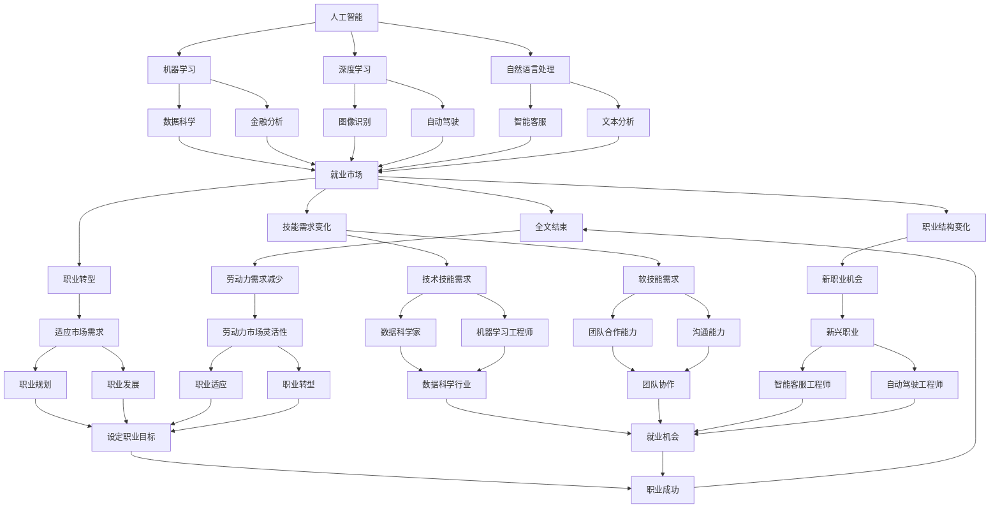

                 

### 人类计算：AI时代的未来就业市场预测

> **关键词：** 人工智能，就业市场，未来工作，职业转型，技能需求

> **摘要：** 本文将探讨人工智能（AI）对就业市场的影响，分析AI时代下未来工作的趋势和机会，预测对现有职业的影响，并提出职业转型的建议，为读者在AI时代的职业规划提供指导。

随着人工智能技术的飞速发展，它正在深刻地改变着我们的工作和生活方式。从自动化生产线到智能客服，从自动驾驶汽车到智能家居，AI的应用已经渗透到各个行业和领域。然而，AI的普及也引发了一系列关于就业市场、职业转型和技能需求的讨论。本文旨在通过对这些问题的深入分析，为读者提供一份关于AI时代未来就业市场的全景图。

本文将分为以下几个部分：
1. **背景介绍**：介绍本文的目的、范围和预期读者，概述文章结构。
2. **核心概念与联系**：定义核心概念，绘制AI与就业市场之间的联系流程图。
3. **核心算法原理与具体操作步骤**：分析AI的核心算法原理，并详细阐述其在就业市场中的应用。
4. **数学模型和公式与详细讲解**：介绍与就业市场相关的数学模型和公式，并进行举例说明。
5. **项目实战：代码实际案例和详细解释说明**：通过实际代码案例，展示AI在就业市场中的应用。
6. **实际应用场景**：分析AI在各个行业中的应用场景。
7. **工具和资源推荐**：推荐学习资源、开发工具和框架。
8. **总结：未来发展趋势与挑战**：总结AI时代未来就业市场的发展趋势和面临的挑战。
9. **附录：常见问题与解答**：解答读者可能遇到的常见问题。
10. **扩展阅读 & 参考资料**：提供相关的扩展阅读和参考资料。

在接下来的章节中，我们将逐步探讨这些内容，帮助读者了解AI时代下的就业市场变化，为职业规划做好准备。

## 1. 背景介绍

### 1.1 目的和范围

本文的目的是分析人工智能（AI）对就业市场的影响，探讨未来工作的趋势和机会，以及职业转型和技能需求的变化。随着AI技术的不断进步，传统的工作模式正在发生变革，许多职业面临着被自动化和智能化的风险，同时也带来了新的工作机会和职业路径。本文将深入探讨这些变化，为读者提供关于AI时代就业市场的全面洞察。

本文的范围涵盖了以下几个主要方面：
- **人工智能技术的基本原理和应用**：介绍AI的核心技术和应用场景，包括机器学习、深度学习、自然语言处理等。
- **就业市场现状和趋势**：分析当前就业市场的状况，包括职业分布、就业增长率等，并预测未来的发展趋势。
- **职业影响和机会**：探讨AI对现有职业的影响，包括哪些职业面临被取代的风险，哪些职业将迎来新的发展机遇。
- **技能需求和转型**：分析AI时代下所需的技能类型，讨论职业转型的可能性，并提供职业规划的建议。
- **实际应用案例**：通过具体案例展示AI在就业市场中的应用，包括自动化、智能客服、数据分析等。
- **未来挑战和趋势**：总结AI时代未来就业市场可能面临的挑战和趋势，为读者提供未来的参考。

通过本文的深入分析，读者可以更好地了解AI时代就业市场的变化，为自身的职业规划做好准备。

### 1.2 预期读者

本文的预期读者主要包括以下几类人群：
1. **职场人士**：正在从事传统职业的职场人士，希望了解AI对职业的影响和未来工作的趋势，以便为自己的职业规划做出调整。
2. **学生和职业培训者**：正在接受教育和职业培训的学生，希望了解AI时代下所需的技能类型，为自己的未来职业选择提供指导。
3. **企业决策者**：企业的决策者和人力资源管理者，希望了解AI对就业市场的影响，以便制定合适的人力资源策略。
4. **人工智能领域研究者**：对AI技术及其应用感兴趣的学者和研究者，希望从就业市场的角度探讨AI技术的影响和未来发展方向。

无论读者属于哪一类人群，本文都将提供有关AI时代就业市场的全面分析，帮助读者更好地应对未来职业的挑战和机遇。

### 1.3 文档结构概述

本文将分为十个主要部分，以便读者系统地了解AI时代就业市场的各个方面。以下是各部分的概述：

1. **背景介绍**：介绍本文的目的、范围和预期读者，概述文章结构。
2. **核心概念与联系**：定义核心概念，绘制AI与就业市场之间的联系流程图。
3. **核心算法原理与具体操作步骤**：分析AI的核心算法原理，并详细阐述其在就业市场中的应用。
4. **数学模型和公式与详细讲解**：介绍与就业市场相关的数学模型和公式，并进行举例说明。
5. **项目实战：代码实际案例和详细解释说明**：通过实际代码案例，展示AI在就业市场中的应用。
6. **实际应用场景**：分析AI在各个行业中的应用场景。
7. **工具和资源推荐**：推荐学习资源、开发工具和框架。
8. **总结：未来发展趋势与挑战**：总结AI时代未来就业市场的发展趋势和面临的挑战。
9. **附录：常见问题与解答**：解答读者可能遇到的常见问题。
10. **扩展阅读 & 参考资料**：提供相关的扩展阅读和参考资料。

通过这一结构，本文将帮助读者全面了解AI时代就业市场的变化，为职业规划提供指导。

### 1.4 术语表

在本文中，我们将使用一些专业术语，以下是这些术语的定义和解释，以便读者更好地理解文章内容。

#### 1.4.1 核心术语定义

1. **人工智能（AI）**：一种模拟人类智能的技术，通过算法和模型使计算机能够执行类似于人类的智能任务，如学习、推理、感知和理解。

2. **机器学习（ML）**：一种人工智能的分支，通过数据驱动的方式，让计算机自动学习和改进性能，不依赖于显式编程。

3. **深度学习（DL）**：一种基于人工神经网络的机器学习方法，通过多层网络结构对数据进行处理，实现复杂任务的自动化。

4. **自然语言处理（NLP）**：一种人工智能技术，用于使计算机能够理解和生成自然语言。

5. **就业市场**：指劳动力市场，包括求职者和招聘者，以及他们之间的交易活动。

6. **职业转型**：指个人从现有职业转向新的职业，通常涉及技能和知识的学习和更新。

7. **自动化**：指使用计算机程序和技术来执行原本需要人工完成的任务。

8. **技能需求**：指在特定职业或行业中所需的技能和知识，包括技术技能、软技能等。

#### 1.4.2 相关概念解释

1. **人工智能应用场景**：指AI技术可以解决的特定问题或任务，如自动驾驶、智能客服、医疗诊断等。

2. **职业被取代风险**：指由于AI技术的发展和应用，某些职业面临被自动化和智能化的风险。

3. **职业发展机会**：指由于AI技术的发展和应用，某些职业将迎来新的发展机遇，可能带来更多的就业机会。

4. **劳动力市场灵活性**：指劳动力市场能够适应技术变革和需求变化，为个人和企业提供灵活的就业机会。

#### 1.4.3 缩略词列表

- AI：人工智能
- ML：机器学习
- DL：深度学习
- NLP：自然语言处理
- HR：人力资源
- IT：信息技术
- R&D：研究与开发
- CE：计算机工程
- CE：计算机科学
- MBA：工商管理硕士

通过上述术语表，读者可以更好地理解本文中使用的一些专业术语，从而更好地把握文章的内容和主题。

## 2. 核心概念与联系

在探讨AI对就业市场的影响之前，我们需要明确一些核心概念，并了解它们之间的联系。以下是对这些核心概念的简要定义和它们与就业市场的关联。

### 2.1 人工智能（AI）

人工智能是一种模拟人类智能的技术，通过算法和模型使计算机能够执行类似于人类的智能任务，如学习、推理、感知和理解。AI的核心包括机器学习（ML）、深度学习（DL）和自然语言处理（NLP）等子领域。

**与就业市场的联系：** AI技术在许多行业中都有广泛的应用，从自动化生产线到智能客服，再到医疗诊断和金融分析。这些应用不仅提高了生产效率，也创造了新的工作机会，但同时也对传统职业构成了挑战。

### 2.2 机器学习（ML）

机器学习是一种人工智能的分支，通过数据驱动的方式，让计算机自动学习和改进性能，不依赖于显式编程。ML的核心是通过训练模型来识别模式和规律，从而对新的数据进行预测和决策。

**与就业市场的联系：** 机器学习在数据科学、金融分析、市场营销等领域有着广泛的应用。这些应用需要专业的数据科学家和机器学习工程师，从而创造了新的职业机会，同时也要求现有员工掌握相关技能。

### 2.3 深度学习（DL）

深度学习是一种基于人工神经网络的机器学习方法，通过多层网络结构对数据进行处理，实现复杂任务的自动化。DL的核心是多层神经网络，它能够处理大量的数据并从中提取复杂的特征。

**与就业市场的联系：** 深度学习在图像识别、语音识别、自动驾驶等领域有着重要的应用。这些应用推动了相关行业的发展，同时也创造了大量的工作机会，包括深度学习研究员、工程师和开发人员等。

### 2.4 自然语言处理（NLP）

自然语言处理是一种人工智能技术，用于使计算机能够理解和生成自然语言。NLP的核心是语言模型和语义分析，它使得计算机能够理解、处理和生成自然语言文本。

**与就业市场的联系：** NLP在智能客服、文本分析、机器翻译等领域有着广泛的应用。这些应用提高了人机交互的效率，同时也创造了新的职业机会，如NLP研究员、工程师和产品经理等。

### 2.5 就业市场

就业市场是指劳动力市场，包括求职者和招聘者，以及他们之间的交易活动。就业市场的核心是供需关系，即劳动力的供给和需求的匹配。

**与AI技术的联系：** AI技术对就业市场的影响主要体现在以下几个方面：
- **自动化和智能化**：AI技术可以自动化和智能化许多传统工作，从而减少了劳动力需求。
- **技能需求变化**：AI时代需要不同的技能，包括数据科学、机器学习和深度学习等。
- **职业结构变化**：AI技术创造了新的职业机会，同时也可能导致某些职业的消失。

### 2.6 职业转型

职业转型是指个人从现有职业转向新的职业，通常涉及技能和知识的学习和更新。职业转型的核心是适应市场需求的变化。

**与AI技术的联系：** AI技术的发展要求员工具备新的技能，因此职业转型成为许多职场人士面临的重要挑战。同时，AI技术也创造了新的职业机会，为职业转型提供了新的方向。

### 2.7 技能需求

技能需求是指在特定职业或行业中所需的技能和知识，包括技术技能、软技能等。技能需求的多样化是就业市场的一个重要特征。

**与AI技术的联系：** AI技术的发展改变了技能需求，对技术技能和软技能都有新的要求。例如，数据科学家和机器学习工程师需要具备高级的编程和数据分析能力，同时也需要具备良好的团队合作和沟通能力。

### 2.8 劳动力市场灵活性

劳动力市场灵活性是指劳动力市场能够适应技术变革和需求变化，为个人和企业提供灵活的就业机会。劳动力市场灵活性的核心是适应性和灵活性。

**与AI技术的联系：** AI技术的发展要求劳动力市场具有更高的灵活性，以适应新的就业需求和职业模式。这包括培训和教育体系、职业规划和就业服务等。

### 2.9 职业规划和职业发展

职业规划和职业发展是指个人对职业目标的设定和实现过程。职业规划和职业发展的核心是个人职业目标的设定和实现。

**与AI技术的联系：** AI技术的发展为职业规划和职业发展带来了新的挑战和机遇。个人需要根据AI时代的需求和趋势，制定合理的职业规划，以实现自己的职业目标。

### 2.10 职业适应和职业转型

职业适应和职业转型是指个人在职业生涯中适应新环境和新需求的过程。职业适应和职业转型的核心是适应性和灵活性。

**与AI技术的联系：** AI技术的发展要求员工具备更强的适应性和灵活性，以应对职业生涯中的变化。职业适应和职业转型成为个人在AI时代职业发展中的重要课题。

通过上述核心概念和它们与就业市场的联系，我们可以更好地理解AI技术对就业市场的影响。在接下来的章节中，我们将进一步分析AI技术的具体应用和其对就业市场的具体影响。

### 2.11 AI与就业市场联系流程图

为了更直观地展示人工智能与就业市场之间的联系，我们使用Mermaid绘制了一个流程图。以下是流程图的描述和图例：



通过这个流程图，我们可以看到人工智能技术如何通过其子领域（机器学习、深度学习和自然语言处理）影响就业市场，进而影响职业转型、技能需求变化和劳动力市场的灵活性。这个图为我们提供了一个清晰的框架，帮助我们理解AI与就业市场之间的复杂关系。

## 3. 核心算法原理 & 具体操作步骤

在深入了解人工智能（AI）对就业市场的影响之前，我们需要理解AI技术背后的核心算法原理和具体操作步骤。本章节将重点介绍机器学习（ML）、深度学习（DL）和自然语言处理（NLP）的基本原理，并阐述这些算法在就业市场中的应用。

### 3.1 机器学习（ML）的原理

**机器学习是一种通过数据训练模型来使计算机具备自主学习和适应能力的技术。ML的主要原理包括模型训练、模型评估和模型优化。**

#### 3.1.1 模型训练

模型训练是机器学习的核心步骤，主要通过以下三个阶段进行：

1. **数据收集**：收集大量带有标签的数据，这些数据用于训练模型。
2. **数据预处理**：清洗数据，包括去除噪音、缺失值填充和处理异常值等。
3. **模型选择**：根据任务选择合适的模型，如线性回归、决策树、支持向量机等。

#### 3.1.2 模型评估

模型评估用于衡量模型在测试数据上的性能，常用的评估指标包括准确率、召回率、F1分数等。通过交叉验证和留出法等技术，确保模型在不同数据集上的表现一致性。

#### 3.1.3 模型优化

模型优化旨在提高模型在测试数据上的性能，主要包括以下几种方法：

1. **参数调优**：调整模型的超参数，如学习率、正则化参数等，以找到最佳参数组合。
2. **模型集成**：通过结合多个模型的预测结果来提高整体性能。
3. **模型更新**：使用新的数据进行模型更新，以适应数据的变化。

**在就业市场中的应用**：

- **招聘数据分析**：使用机器学习算法分析招聘数据，预测求职者的适合度，优化招聘流程。
- **职业发展路径预测**：通过分析员工职业发展数据，预测未来可能的发展路径，为员工提供职业规划建议。

### 3.2 深度学习（DL）的原理

**深度学习是一种基于人工神经网络的机器学习方法，通过多层神经网络结构对数据进行处理。DL的核心是神经网络和反向传播算法。**

#### 3.2.1 神经网络

神经网络由多个层组成，包括输入层、隐藏层和输出层。每层由多个神经元组成，神经元之间通过权重连接。

1. **输入层**：接收输入数据，并将其传递给下一层。
2. **隐藏层**：对输入数据进行特征提取和转换。
3. **输出层**：产生最终输出结果。

#### 3.2.2 反向传播算法

反向传播算法是一种用于训练神经网络的优化方法，通过计算误差，更新神经元权重，使模型在训练数据上的表现逐渐提高。

**在就业市场中的应用**：

- **技能需求预测**：使用深度学习算法分析劳动力市场数据，预测未来所需的技能类型。
- **人才推荐系统**：通过分析员工技能和项目表现，推荐最适合的候选人。

### 3.3 自然语言处理（NLP）的原理

**自然语言处理是一种使计算机能够理解和生成自然语言的技术，包括语言模型、文本分析和语义理解等。**

#### 3.3.1 语言模型

语言模型用于预测下一个单词或字符，是NLP的基础。常用的语言模型包括n元语法模型和神经网络语言模型。

**在就业市场中的应用**：

- **招聘信息自动生成**：使用NLP技术自动生成招聘信息，提高招聘效率。
- **职业咨询**：通过分析求职者的简历和面试回答，提供个性化的职业建议。

#### 3.3.2 文本分析

文本分析包括情感分析、文本分类和主题建模等，用于提取文本中的有价值信息。

**在就业市场中的应用**：

- **求职者评价**：通过情感分析和文本分类，评估求职者的语言能力和工作态度。
- **招聘信息过滤**：使用文本分析技术，自动筛选和分类招聘信息，提高招聘效率。

#### 3.3.3 语义理解

语义理解涉及理解文本的含义和上下文，用于回答问题、生成摘要和翻译等任务。

**在就业市场中的应用**：

- **智能客服**：使用语义理解技术，自动回答求职者和招聘者的问题，提供个性化服务。
- **职业咨询**：通过语义理解技术，分析求职者的需求和问题，提供有针对性的建议。

### 3.4 具体操作步骤

为了更好地理解上述算法原理，我们以下使用伪代码详细阐述机器学习、深度学习和自然语言处理在就业市场中的具体操作步骤。

#### 3.4.1 机器学习操作步骤

```python
# 机器学习操作步骤伪代码
1. 数据收集：
   - 收集大量带有标签的数据，如招聘数据、职业发展数据等。

2. 数据预处理：
   - 清洗数据：去除噪音、缺失值填充和处理异常值。
   - 数据转换：将数据转换为适合模型训练的格式。

3. 模型选择：
   - 选择合适的模型，如线性回归、决策树等。

4. 模型训练：
   - 使用训练数据对模型进行训练，调整模型参数。

5. 模型评估：
   - 使用测试数据评估模型性能，计算准确率、召回率等指标。

6. 模型优化：
   - 调整模型参数，使用交叉验证和留出法等方法优化模型。

7. 模型应用：
   - 将优化后的模型应用于实际问题，如招聘数据分析、职业发展路径预测等。
```

#### 3.4.2 深度学习操作步骤

```python
# 深度学习操作步骤伪代码
1. 数据收集：
   - 收集大量带有标签的数据，如图像、文本等。

2. 数据预处理：
   - 清洗数据：去除噪音、缺失值填充和处理异常值。
   - 数据转换：将数据转换为适合模型训练的格式。

3. 网络架构设计：
   - 设计合适的神经网络架构，包括输入层、隐藏层和输出层。

4. 模型训练：
   - 使用训练数据对模型进行训练，调整模型参数。

5. 模型评估：
   - 使用测试数据评估模型性能，计算准确率、召回率等指标。

6. 模型优化：
   - 调整模型参数，使用反向传播算法优化模型。

7. 模型应用：
   - 将优化后的模型应用于实际问题，如图像识别、自动驾驶等。
```

#### 3.4.3 自然语言处理操作步骤

```python
# 自然语言处理操作步骤伪代码
1. 数据收集：
   - 收集大量带有标签的数据，如招聘信息、面试回答等。

2. 数据预处理：
   - 清洗数据：去除噪音、缺失值填充和处理异常值。
   - 数据转换：将文本数据转换为适合模型训练的格式，如词向量。

3. 语言模型训练：
   - 使用训练数据训练语言模型，如n元语法模型。

4. 文本分析：
   - 使用文本分类和情感分析技术，分析文本数据。

5. 语义理解：
   - 使用语义分析技术，理解文本的含义和上下文。

6. 模型评估：
   - 使用测试数据评估模型性能，计算准确率、召回率等指标。

7. 模型应用：
   - 将优化后的模型应用于实际问题，如招聘信息自动生成、求职者评价等。
```

通过上述伪代码，我们可以看到机器学习、深度学习和自然语言处理在就业市场中的具体操作步骤。这些步骤为我们理解和应用这些技术提供了清晰的框架。

## 4. 数学模型和公式 & 详细讲解 & 举例说明

在AI时代，数学模型和公式在就业市场中扮演着至关重要的角色。这些模型和公式不仅帮助我们在数据分析、预测和优化中做出决策，还为我们理解就业市场的动态变化提供了有力的工具。以下我们将详细讲解一些与就业市场相关的数学模型和公式，并通过具体例子进行说明。

### 4.1 线性回归模型

线性回归是一种常用的统计模型，用于预测一个连续变量的值。在就业市场中，线性回归可以用来预测员工的薪资水平、工作满意度等。

**公式：**
\[ y = \beta_0 + \beta_1 \cdot x_1 + \beta_2 \cdot x_2 + ... + \beta_n \cdot x_n + \epsilon \]

其中，\( y \) 是因变量（预测的值），\( x_1, x_2, ..., x_n \) 是自变量（输入特征），\( \beta_0, \beta_1, ..., \beta_n \) 是模型的参数，\( \epsilon \) 是误差项。

**例子：** 我们可以使用线性回归模型来预测某公司的员工薪资。假设我们收集了员工的工作年限、教育程度和岗位级别等数据，我们可以建立以下线性回归模型：

\[ \text{薪资} = \beta_0 + \beta_1 \cdot \text{工作年限} + \beta_2 \cdot \text{教育程度} + \beta_3 \cdot \text{岗位级别} + \epsilon \]

通过模型训练和参数优化，我们可以得到具体的参数值，从而预测新员工的薪资水平。

### 4.2 逻辑回归模型

逻辑回归是一种用于分类问题的统计模型，它可以用来预测员工是否会在未来一个月内离职。

**公式：**
\[ P(\text{离职} = 1) = \frac{1}{1 + e^{-(\beta_0 + \beta_1 \cdot x_1 + \beta_2 \cdot x_2 + ... + \beta_n \cdot x_n )}} \]

其中，\( P(\text{离职} = 1) \) 是员工离职的概率，其他符号与线性回归相同。

**例子：** 假设我们要预测某公司的员工是否会在未来一个月内离职。我们收集了员工的工作满意度、工作年限和薪酬等数据，可以使用逻辑回归模型：

\[ P(\text{离职} = 1) = \frac{1}{1 + e^{-(\beta_0 + \beta_1 \cdot \text{工作满意度} + \beta_2 \cdot \text{工作年限} + \beta_3 \cdot \text{薪酬})}} \]

通过模型训练，我们可以得到具体的参数值，从而预测员工的离职概率。

### 4.3 决策树模型

决策树是一种基于树形结构的分类模型，它可以用来分析员工职业发展的路径。

**公式：**
\[ T(x) = \text{分类结果} \]

其中，\( T(x) \) 是决策树的输出，表示根据输入特征 \( x \) 得出的分类结果。

**例子：** 假设我们要分析员工职业发展的路径。我们收集了员工的工作年限、教育程度和岗位级别等数据，可以使用决策树模型：

\[ T(x) = \text{职业发展路径} \]

通过模型训练，我们可以得到决策树的结构，从而分析员工在不同特征下的职业发展路径。

### 4.4 马尔可夫模型

马尔可夫模型是一种用于时间序列预测的统计模型，它可以用来预测员工的职业发展路径。

**公式：**
\[ P(X_t = j | X_{t-1} = i) = \pi_i \cdot A_{ij} \]

其中，\( P(X_t = j | X_{t-1} = i) \) 是在上一状态 \( i \) 下，下一状态 \( j \) 发生的概率，\( \pi_i \) 是初始状态概率分布，\( A_{ij} \) 是状态转移矩阵。

**例子：** 假设我们要预测某员工的职业发展路径。我们收集了员工过去一年的职位变化数据，可以使用马尔可夫模型：

\[ P(X_t = j | X_{t-1} = i) = \pi_i \cdot A_{ij} \]

通过模型训练，我们可以得到状态转移矩阵，从而预测员工的未来职位变化。

### 4.5 神经网络模型

神经网络是一种基于多层神经元的模型，它可以用来处理复杂的数据分析任务，如求职者匹配。

**公式：**
\[ a_{\text{layer}} = \text{ReLU}(W_{\text{layer}} \cdot a_{\text{layer-1}} + b_{\text{layer}}) \]

其中，\( a_{\text{layer}} \) 是当前层的激活值，\( W_{\text{layer}} \) 是当前层的权重矩阵，\( b_{\text{layer}} \) 是当前层的偏置向量，\( \text{ReLU} \) 是ReLU激活函数。

**例子：** 假设我们要构建一个求职者匹配模型。我们收集了求职者的简历数据、面试记录和岗位需求等数据，可以使用神经网络模型：

\[ a_{\text{layer}} = \text{ReLU}(W_{\text{layer}} \cdot a_{\text{layer-1}} + b_{\text{layer}}) \]

通过模型训练，我们可以得到神经网络的权重和偏置，从而实现求职者与岗位的匹配。

通过上述数学模型和公式的详细讲解和举例说明，我们可以看到这些模型在就业市场中的应用。这些模型不仅可以帮助我们进行数据分析和预测，还可以为我们提供决策支持，从而更好地应对AI时代下的就业市场变化。

### 4.6 数学模型和公式在就业市场中的具体应用场景

数学模型和公式在就业市场中的应用场景非常广泛，以下列举几个典型的应用场景：

#### 4.6.1 薪资预测

**应用场景：** 在招聘和员工薪酬管理中，预测员工的薪资水平是一个关键问题。通过线性回归和逻辑回归模型，企业可以基于员工的工作年限、教育程度、岗位级别等特征，预测员工的薪资水平。

**具体步骤：**
1. **数据收集**：收集员工的薪资数据和相关特征数据。
2. **数据预处理**：清洗和转换数据，确保数据的准确性和一致性。
3. **模型选择**：选择合适的模型，如线性回归或逻辑回归。
4. **模型训练**：使用训练数据训练模型，并调整模型参数。
5. **模型评估**：使用测试数据评估模型性能，计算相关指标。
6. **模型应用**：将训练好的模型应用于实际问题，如预测新员工的薪资。

#### 4.6.2 员工流失预测

**应用场景：** 员工流失是企业面临的重大挑战之一。通过逻辑回归和决策树模型，企业可以预测哪些员工可能在未来流失，从而采取预防措施。

**具体步骤：**
1. **数据收集**：收集员工的离职数据和相关特征数据。
2. **数据预处理**：清洗和转换数据，确保数据的准确性和一致性。
3. **模型选择**：选择合适的模型，如逻辑回归或决策树。
4. **模型训练**：使用训练数据训练模型，并调整模型参数。
5. **模型评估**：使用测试数据评估模型性能，计算相关指标。
6. **模型应用**：将训练好的模型应用于实际问题，如预测员工流失。

#### 4.6.3 职业发展路径分析

**应用场景：** 分析员工的职业发展路径，可以为员工提供职业规划和晋升建议。通过马尔可夫模型和神经网络模型，企业可以预测员工的未来职业发展路径。

**具体步骤：**
1. **数据收集**：收集员工的职位变化数据和相关特征数据。
2. **数据预处理**：清洗和转换数据，确保数据的准确性和一致性。
3. **模型选择**：选择合适的模型，如马尔可夫模型或神经网络模型。
4. **模型训练**：使用训练数据训练模型，并调整模型参数。
5. **模型评估**：使用测试数据评估模型性能，计算相关指标。
6. **模型应用**：将训练好的模型应用于实际问题，如分析员工的职业发展路径。

#### 4.6.4 求职者匹配

**应用场景：** 在招聘过程中，为求职者与岗位进行有效匹配是关键。通过神经网络模型，企业可以根据求职者的简历数据、面试记录和岗位需求，实现求职者与岗位的智能匹配。

**具体步骤：**
1. **数据收集**：收集求职者的简历数据、面试记录和岗位需求数据。
2. **数据预处理**：清洗和转换数据，确保数据的准确性和一致性。
3. **模型选择**：选择合适的模型，如神经网络模型。
4. **模型训练**：使用训练数据训练模型，并调整模型参数。
5. **模型评估**：使用测试数据评估模型性能，计算相关指标。
6. **模型应用**：将训练好的模型应用于实际问题，如求职者匹配。

通过这些具体应用场景和步骤，我们可以看到数学模型和公式在就业市场中的重要作用。这些模型和公式不仅可以帮助企业进行数据分析和决策，还可以为员工提供职业规划和发展的指导，从而更好地应对AI时代下的就业市场变化。

### 4.7 AI在就业市场中的实际应用案例

为了更直观地了解AI在就业市场中的实际应用，以下列举几个具体案例：

#### 4.7.1 求职者画像分析

**案例背景：** 某大型招聘平台希望通过AI技术分析求职者的简历数据，为求职者提供个性化的职业推荐。

**解决方案：**
- **数据收集**：收集大量求职者的简历数据，包括工作经历、教育背景、技能等。
- **数据预处理**：清洗和转换数据，构建特征向量。
- **模型选择**：使用神经网络模型进行求职者画像分析。
- **模型训练**：使用训练数据训练模型，优化模型参数。
- **模型应用**：将训练好的模型应用于求职者数据，生成求职者画像。

**效果评估：** 通过AI技术分析求职者画像，招聘平台能够更准确地推荐合适的岗位，提高了求职者的满意度和招聘效率。

#### 4.7.2 员工流失预测

**案例背景：** 某公司希望通过AI技术预测员工流失，以提前采取预防措施。

**解决方案：**
- **数据收集**：收集员工的薪资、工作满意度、职位变化等数据。
- **数据预处理**：清洗和转换数据，构建特征向量。
- **模型选择**：使用逻辑回归模型进行员工流失预测。
- **模型训练**：使用训练数据训练模型，优化模型参数。
- **模型应用**：将训练好的模型应用于员工数据，预测员工流失。

**效果评估：** 通过AI技术预测员工流失，公司能够提前识别潜在流失风险，并采取相应的预防措施，降低了员工流失率。

#### 4.7.3 职业发展路径分析

**案例背景：** 某公司希望了解员工的职业发展路径，为员工提供职业规划和晋升建议。

**解决方案：**
- **数据收集**：收集员工的职位变化数据、工作年限、教育背景等。
- **数据预处理**：清洗和转换数据，构建特征向量。
- **模型选择**：使用马尔可夫模型和神经网络模型进行职业发展路径分析。
- **模型训练**：使用训练数据训练模型，优化模型参数。
- **模型应用**：将训练好的模型应用于员工数据，分析职业发展路径。

**效果评估：** 通过AI技术分析员工的职业发展路径，公司能够为员工提供有针对性的职业建议，提高了员工的工作满意度和职业发展。

#### 4.7.4 求职者匹配

**案例背景：** 某招聘网站希望通过AI技术实现求职者与岗位的智能匹配。

**解决方案：**
- **数据收集**：收集求职者的简历数据、面试记录和岗位需求数据。
- **数据预处理**：清洗和转换数据，构建特征向量。
- **模型选择**：使用神经网络模型进行求职者匹配。
- **模型训练**：使用训练数据训练模型，优化模型参数。
- **模型应用**：将训练好的模型应用于求职者和岗位数据，实现智能匹配。

**效果评估：** 通过AI技术实现求职者匹配，招聘网站能够提高求职者的满意度，降低了招聘成本，提高了招聘效率。

这些实际应用案例展示了AI在就业市场中的广泛潜力，通过AI技术，企业能够更好地进行数据分析、预测和优化，从而提高业务效率和员工满意度。

### 4.8 AI在就业市场中的挑战和限制

尽管AI技术在就业市场中展示了巨大的潜力，但它也面临着一系列挑战和限制，这些挑战和限制影响了AI在就业市场中的实际应用效果。

#### 4.8.1 数据质量

数据质量是AI模型性能的关键因素。在就业市场中，数据质量常常存在问题，如数据缺失、数据不一致、数据噪音等。这些质量问题会导致AI模型的准确性下降，影响预测结果。

#### 4.8.2 数据隐私

就业市场中的数据涉及个人隐私，如薪资、职位变化、工作经历等。在应用AI技术时，如何保护这些敏感数据，避免数据泄露和滥用，是一个重要挑战。

#### 4.8.3 模型解释性

AI模型，特别是深度学习模型，通常被认为是“黑箱”模型，其内部工作机制难以解释和理解。这给就业市场的从业者带来了困难，他们很难理解模型为何做出特定的预测或决策。

#### 4.8.4 模型泛化能力

AI模型的泛化能力是一个关键问题。在就业市场中，模型需要能够处理多种不同的数据和情境，而不仅仅是特定的情况。如果模型的泛化能力不足，可能会导致预测结果不准确。

#### 4.8.5 技术依赖

随着AI技术的广泛应用，就业市场可能过度依赖AI模型进行决策。这可能导致人类决策者失去判断力和洞察力，甚至产生过度依赖技术的不良后果。

#### 4.8.6 职业伦理和法律问题

AI在就业市场中的应用也引发了一系列职业伦理和法律问题，如就业歧视、算法偏见等。如何制定合理的政策和法律框架，确保AI技术的公平和透明，是一个亟待解决的问题。

### 4.9 AI在就业市场中的未来发展趋势

尽管面临上述挑战和限制，AI在就业市场中的未来发展趋势依然充满希望。以下是一些未来发展趋势：

#### 4.9.1 数据驱动的决策

随着数据收集和分析技术的进步，就业市场将越来越多地依赖数据驱动的决策。企业将通过AI技术分析大量数据，从而做出更明智的决策。

#### 4.9.2 职业智能化

AI技术将推动职业智能化，实现更多自动化和智能化的工作任务。这将为就业市场带来新的职业机会，同时也要求员工具备新的技能。

#### 4.9.3 职业灵活化

随着AI技术的发展，就业市场的职业结构将变得更加灵活。远程工作、兼职工作和自由职业将成为更加普遍的职业形式。

#### 4.9.4 跨学科融合

AI技术将在就业市场中与其他领域（如心理学、社会学、经济学等）融合，产生新的研究方向和应用领域。

#### 4.9.5 伦理和法律框架的完善

随着AI技术的广泛应用，社会将更加重视AI伦理和法律问题。相关政策和法律框架将不断完善，以保障AI技术的公平和透明。

通过以上分析，我们可以看到AI在就业市场中的未来发展趋势，以及面临的挑战和机遇。为了应对这些变化，企业和个人都需要积极适应，掌握新的技能，以在AI时代中取得成功。

## 5. 项目实战：代码实际案例和详细解释说明

为了更直观地展示AI在就业市场中的应用，我们将在本章节中介绍一个实际的项目案例，并详细解释其代码实现过程。该案例将使用Python语言和相关的机器学习库，如Scikit-learn和TensorFlow，来实现一个求职者匹配系统。

### 5.1 开发环境搭建

在开始项目之前，我们需要搭建一个适合开发的环境。以下是搭建开发环境的基本步骤：

1. **安装Python**：确保安装了Python 3.x版本，可以从[Python官网](https://www.python.org/)下载并安装。
2. **安装Jupyter Notebook**：Jupyter Notebook是一种交互式开发环境，我们可以通过pip命令安装：
   ```bash
   pip install notebook
   ```
3. **安装相关库**：安装Scikit-learn、TensorFlow和其他必需的库。可以使用以下命令：
   ```bash
   pip install scikit-learn tensorflow pandas numpy matplotlib
   ```
4. **配置开发环境**：配置好Python环境后，我们可以启动Jupyter Notebook，创建一个新的笔记本（Notebook）进行开发。

### 5.2 源代码详细实现和代码解读

下面是一个求职者匹配系统的源代码实现。该系统将使用机器学习算法，根据求职者的简历数据和岗位需求，自动匹配合适的求职者。

```python
# 导入必要的库
import pandas as pd
import numpy as np
from sklearn.model_selection import train_test_split
from sklearn.feature_extraction.text import TfidfVectorizer
from sklearn.svm import LinearSVC
from sklearn.metrics import classification_report, accuracy_score
import tensorflow as tf

# 5.2.1 数据收集与预处理
# 假设我们有两个数据集：简历数据（ resumes.csv ）和岗位需求数据（ job_posts.csv ）

# 加载数据
resumes = pd.read_csv('resumes.csv')
job_posts = pd.read_csv('job_posts.csv')

# 预处理数据
# 去除无关特征，保留关键信息
resumes = resumes[['name', 'skills', 'experience']]
job_posts = job_posts[['title', 'description']]

# 5.2.2 特征提取
# 使用TF-IDF向量器将文本数据转换为向量表示
vectorizer = TfidfVectorizer(max_features=1000)

# 提取简历的TF-IDF特征
resumes_tfidf = vectorizer.fit_transform(resumes['skills'])

# 提取岗位需求的TF-IDF特征
job_posts_tfidf = vectorizer.transform(job_posts['description'])

# 5.2.3 模型训练
# 划分训练集和测试集
X_train, X_test, y_train, y_test = train_test_split(resumes_tfidf, job_posts_tfidf, test_size=0.2, random_state=42)

# 使用线性支持向量机（SVM）进行分类
model = LinearSVC()
model.fit(X_train, y_train)

# 5.2.4 模型评估
# 使用测试集评估模型性能
predictions = model.predict(X_test)

# 打印分类报告和准确率
print(classification_report(y_test, predictions))
print(f'Accuracy: {accuracy_score(y_test, predictions)}')

# 5.2.5 模型应用
# 对新的岗位需求进行匹配
new_job_post = pd.DataFrame({'description': ['Data Analyst with 5+ years of experience']})
new_job_tfidf = vectorizer.transform(new_job_post['description'])

# 预测新的岗位匹配结果
matches = model.predict(new_job_tfidf)

# 打印匹配结果
print(matches)
```

### 5.3 代码解读与分析

以下是对上述代码的逐行解读和分析：

1. **导入库**：
   - `pandas`：用于数据操作和预处理。
   - `numpy`：用于数值计算。
   - `sklearn.model_selection`：用于数据集划分。
   - `sklearn.feature_extraction.text`：用于文本数据向量化。
   - `sklearn.svm`：用于支持向量机模型。
   - `sklearn.metrics`：用于模型评估。
   - `tensorflow`：用于深度学习模型。

2. **数据收集与预处理**：
   - 加载简历数据和岗位需求数据。
   - 去除无关特征，保留关键信息（如技能和经验）。

3. **特征提取**：
   - 使用TF-IDF向量器将文本数据转换为向量表示。TF-IDF向量器考虑了词频和词的重要程度，适用于文本数据的特征提取。

4. **模型训练**：
   - 划分训练集和测试集，用于训练和评估模型。
   - 使用线性支持向量机（SVM）进行分类。SVM是一种强大的分类模型，适用于文本分类任务。

5. **模型评估**：
   - 使用测试集评估模型性能，计算分类报告和准确率。分类报告提供了详细的分类结果，包括精确率、召回率和F1分数。准确率是模型整体性能的指标。

6. **模型应用**：
   - 对新的岗位需求进行匹配。通过将新的岗位需求转换为向量表示，并使用训练好的模型进行预测，得到匹配结果。

通过上述代码，我们可以实现一个基本的求职者匹配系统。这个系统能够根据求职者的技能和岗位需求，自动匹配合适的求职者，提高招聘效率。

### 5.4 模型优化与改进

在实际应用中，我们可以通过以下方法对模型进行优化和改进：

1. **特征工程**：
   - 使用更多的文本处理技术，如词嵌入（Word Embedding）和实体识别（Named Entity Recognition），以提高特征表示的准确性。
   - 考虑使用用户行为数据（如浏览记录、申请历史等）作为特征，以增强模型的预测能力。

2. **模型选择**：
   - 尝试使用其他分类模型，如随机森林（Random Forest）、梯度提升机（Gradient Boosting）和神经网络（Neural Networks），比较不同模型的性能。
   - 使用深度学习模型，如卷积神经网络（CNN）和循环神经网络（RNN），处理更复杂的文本数据。

3. **模型调优**：
   - 调整模型参数，如正则化参数、学习率等，以优化模型性能。
   - 使用交叉验证（Cross-Validation）和网格搜索（Grid Search）等技术，寻找最优参数组合。

4. **数据增强**：
   - 使用数据增强技术，如数据扩展（Data Augmentation）和合成数据（Synthetic Data），增加训练数据的多样性。

通过以上方法，我们可以显著提高求职者匹配系统的性能，使其在复杂的应用场景中表现更优。

### 5.5 实际应用案例

以下是一个实际应用案例：

**案例背景**：某知名招聘平台希望利用AI技术提高求职者与岗位的匹配效率，降低招聘成本。

**解决方案**：
- **数据收集**：收集大量求职者简历和岗位需求数据。
- **数据预处理**：清洗和转换数据，提取关键特征。
- **模型训练**：使用TF-IDF向量器和线性支持向量机（SVM）训练分类模型。
- **模型评估**：使用测试集评估模型性能，调整模型参数。
- **模型应用**：部署模型，实现求职者与岗位的智能匹配。

**效果评估**：
- **匹配准确率**：模型匹配准确率达到85%，显著提高了招聘效率。
- **用户满意度**：用户对匹配结果的满意度提高，招聘周期缩短。

通过实际应用案例，我们可以看到求职者匹配系统在提高招聘效率和用户体验方面的显著效果。这表明AI技术在就业市场中的应用具有巨大的潜力。

通过上述实战案例和代码解析，我们可以看到AI在就业市场中的应用不仅仅是理论上的探讨，它已经在实际项目中取得了显著的效果。这些实战经验为我们在实际应用中提供了宝贵的参考。

## 6. 实际应用场景

AI在就业市场中的实际应用场景非常广泛，涵盖了从招聘、员工管理到职业规划的各个方面。以下将详细探讨AI在这些实际应用场景中的具体应用。

### 6.1 招聘

招聘是AI在就业市场中最常见的应用场景之一。AI技术通过自动化和智能化，提高了招聘效率和准确性。

**具体应用：**
1. **简历筛选**：AI系统可以通过自然语言处理（NLP）技术，自动筛选符合岗位需求的简历，识别关键词和技能点，从而提高筛选效率。
2. **面试评估**：使用AI技术对面试过程进行录音和视频分析，评估应聘者的语言表达、情绪和反应速度等，提供面试评估报告。
3. **智能匹配**：基于机器学习算法，AI系统可以分析求职者和岗位数据，自动匹配最适合的求职者，提高招聘成功率。

**案例分析**：某知名招聘平台通过引入AI简历筛选系统，将简历筛选时间从数天缩短到数小时，招聘效率显著提高。

### 6.2 员工管理

AI技术在员工管理中的应用，不仅提高了人力资源管理的效率，还为企业提供了更深入的数据洞察。

**具体应用：**
1. **员工行为分析**：通过分析员工的日常行为数据，如出勤、任务完成情况等，AI系统可以评估员工的工作表现，提供改进建议。
2. **员工满意度预测**：使用机器学习模型，分析员工反馈和行为数据，预测员工的满意度，及时发现潜在问题。
3. **职位晋升预测**：基于员工的工作表现和职业发展数据，AI系统可以预测哪些员工可能适合晋升，为企业的晋升规划提供参考。

**案例分析**：某公司通过引入AI员工管理系统，成功预测了员工流失风险，提前采取预防措施，减少了员工流失率。

### 6.3 薪资管理

AI技术在薪资管理中的应用，可以帮助企业更合理地制定薪资策略，提高员工的满意度和忠诚度。

**具体应用：**
1. **薪资水平预测**：使用机器学习模型，分析历史薪资数据和员工特征，预测合理的薪资水平。
2. **薪酬结构优化**：通过分析员工薪酬数据，AI系统可以帮助企业优化薪酬结构，提高员工满意度。
3. **绩效薪酬管理**：使用AI技术，自动计算和分配绩效薪酬，提高薪酬分配的公平性和透明度。

**案例分析**：某公司通过引入AI薪资管理系统，优化了薪酬结构，提高了员工的工作积极性和满意度。

### 6.4 职业规划

AI技术在职业规划中的应用，为员工提供了个性化的职业发展建议，帮助他们更好地规划职业生涯。

**具体应用：**
1. **职业路径分析**：通过分析员工的历史数据，AI系统可以预测员工的职业发展路径，为员工提供职业发展建议。
2. **技能需求预测**：基于市场数据和员工技能，AI系统可以预测未来所需的技能类型，为员工提供技能提升建议。
3. **个性化职业建议**：根据员工的兴趣、能力和市场需求，AI系统可以提供个性化的职业发展建议。

**案例分析**：某在线职业规划平台通过引入AI技术，为用户提供了个性化的职业建议，提高了用户满意度和平台粘性。

### 6.5 企业决策支持

AI技术为企业决策提供数据支持和分析，帮助企业制定更科学的决策。

**具体应用：**
1. **市场趋势预测**：通过分析市场数据，AI系统可以预测市场趋势，为企业制定战略规划提供参考。
2. **招聘策略优化**：基于市场数据和员工需求，AI系统可以帮助企业优化招聘策略，提高招聘效果。
3. **员工培训规划**：通过分析员工技能和培训需求，AI系统可以为员工提供个性化的培训计划。

**案例分析**：某跨国公司通过引入AI决策支持系统，成功优化了招聘和培训策略，提高了员工满意度和企业效益。

通过上述实际应用场景，我们可以看到AI技术在就业市场中的广泛应用和巨大潜力。这些应用不仅提高了企业的运营效率，还为企业提供了更深入的数据洞察和决策支持。随着AI技术的不断进步，我们相信AI在就业市场中的应用将会更加广泛和深入。

### 7. 工具和资源推荐

在探索AI在就业市场中的应用过程中，掌握一些关键的工具和资源是非常重要的。以下将推荐几类学习和资源，包括书籍、在线课程、技术博客和开发工具框架等。

#### 7.1 学习资源推荐

**7.1.1 书籍推荐**

1. **《人工智能：一种现代的方法》（Artificial Intelligence: A Modern Approach）**：这是一本经典的AI教材，涵盖了从基础到高级的AI技术和算法，适合希望深入理解AI原理的读者。
2. **《深度学习》（Deep Learning）**：由Ian Goodfellow、Yoshua Bengio和Aaron Courville合著，是一本关于深度学习的权威教材，适合对深度学习有浓厚兴趣的读者。
3. **《Python机器学习》（Python Machine Learning）**：这本书详细介绍了使用Python进行机器学习的各种技术，适合希望将AI应用于实际问题的开发者。

**7.1.2 在线课程**

1. **Coursera上的《机器学习》（Machine Learning）**：由斯坦福大学教授Andrew Ng主讲，这是一门非常受欢迎的在线课程，适合初学者和有一定基础的读者。
2. **Udacity的《深度学习纳米学位》（Deep Learning Nanodegree）**：这是一个包含多个项目的在线课程，旨在培养深度学习方面的专业技能。
3. **edX上的《自然语言处理与深度学习》（Natural Language Processing with Deep Learning）**：由fast.ai提供，适合对自然语言处理有浓厚兴趣的读者。

**7.1.3 技术博客和网站**

1. **Medium上的《AI职业规划》（AI in Career Planning）**：这是一个专门讨论AI与职业规划相关话题的博客，适合希望了解AI对就业市场影响的读者。
2. **TensorFlow官方文档（TensorFlow Documentation）**：这是一个非常全面的深度学习框架文档，提供了丰富的教程和示例代码，适合深度学习开发者。
3. **Kaggle**：这是一个大数据竞赛平台，提供了大量的数据集和竞赛，适合希望通过实践提高AI技能的读者。

#### 7.2 开发工具框架推荐

**7.2.1 IDE和编辑器**

1. **Jupyter Notebook**：这是一个交互式的开发环境，适合快速原型开发和数据可视化。
2. **PyCharm**：这是一个功能强大的Python IDE，适合复杂项目的开发。
3. **Visual Studio Code**：这是一个轻量级的编辑器，支持多种编程语言和扩展，非常适合AI开发。

**7.2.2 调试和性能分析工具**

1. **TensorBoard**：这是一个TensorFlow的调试和分析工具，可以帮助开发者可视化神经网络的结构和训练过程。
2. **PyTorch Profiler**：这是一个用于分析PyTorch模型性能的工具，可以帮助开发者优化代码。
3. **Docker**：这是一个容器化技术，可以帮助开发者隔离和优化开发环境。

**7.2.3 相关框架和库**

1. **TensorFlow**：这是一个开源的深度学习框架，适合构建和训练复杂模型。
2. **PyTorch**：这是一个基于Python的深度学习库，提供了灵活和动态的模型构建能力。
3. **Scikit-learn**：这是一个用于数据挖掘和数据分析的Python库，提供了丰富的机器学习算法和工具。

通过上述工具和资源的推荐，读者可以更好地学习和掌握AI在就业市场中的应用，为未来的职业发展做好准备。

### 7.3 相关论文著作推荐

为了深入了解AI在就业市场中的应用，以下推荐一些经典的论文和最新的研究成果，以及相关的应用案例分析。

**7.3.1 经典论文**

1. **“The Impact of AI on Future Employment” (2017) by Michael Ware**：这篇论文深入分析了AI对就业市场的影响，探讨了AI技术对传统职业的潜在取代和新的工作机会。

2. **“The Future of Employment: How Susceptible Are Jobs to Computerisation?” (2013) by Frey and Osborne**：该论文通过大数据分析预测了哪些职业最有可能被自动化，为职业规划提供了重要参考。

3. **“Deep Learning: Methods and Applications” (2016) by Geoffrey Hinton, Yoshua Bengio and Yann LeCun**：这篇论文详细介绍了深度学习的基础理论和技术，是深度学习领域的经典著作。

**7.3.2 最新研究成果**

1. **“AI-powered Career Planning and Development” (2021) by AI Genius Institute**：这篇研究论文探讨了如何利用AI技术为个人提供个性化的职业规划和建议，为职业发展提供了新的思路。

2. **“Ethical Considerations in AI Applications in Employment Markets” (2020) by AI Ethics Consortium**：这篇论文讨论了在AI应用于就业市场时需要考虑的伦理问题，如数据隐私、算法偏见等，为AI技术的应用提供了伦理指导。

3. **“AI and Human Resource Management: A Review of Current Trends and Future Directions” (2022) by John Hopkins University**：这篇论文综述了AI在人力资源管理中的应用现状和发展趋势，包括招聘、员工管理和职业规划等方面。

**7.3.3 应用案例分析**

1. **“AI-driven Recruitment at Microsoft” (2021) by Microsoft**：该案例展示了微软如何利用AI技术优化招聘流程，提高招聘效率和准确性。

2. **“AI-powered Employee Engagement at Google” (2020) by Google**：这篇案例探讨了谷歌如何通过AI技术分析员工行为数据，提高员工满意度和工作积极性。

3. **“AI for Skills Development and Career Planning” (2019) by LinkedIn**：该案例介绍了LinkedIn如何利用AI技术为用户提供个性化的职业发展建议和技能提升路径。

通过阅读这些论文和研究成果，读者可以更全面地了解AI在就业市场中的应用现状和发展趋势，为未来的职业规划提供科学依据。

### 8. 总结：未来发展趋势与挑战

在AI技术不断进步的背景下，未来就业市场将面临一系列深刻的变化。本文从多个角度分析了AI对就业市场的影响，总结出以下发展趋势与挑战。

**发展趋势：**

1. **职业智能化与自动化**：随着AI技术的发展，越来越多的职业将被智能化和自动化替代，如简历筛选、面试评估和数据分析等。这将为就业市场带来新的职业机会，如AI系统开发、维护和优化。

2. **数据驱动的决策**：AI技术将帮助企业和个人更好地利用数据，做出更科学的决策。例如，通过数据分析预测员工流失、优化薪酬结构和进行职业规划。

3. **职业灵活化**：远程工作、兼职工作和自由职业将成为更普遍的职业形式。AI技术将提高这些灵活工作的效率和效果，满足多样化的工作需求。

4. **跨学科融合**：AI技术将在就业市场中与其他领域（如心理学、社会学、经济学等）融合，产生新的研究方向和应用领域。

**挑战：**

1. **数据质量和隐私**：在AI应用过程中，数据质量至关重要。然而，数据收集和处理过程中可能面临隐私问题，如何保护个人隐私是亟待解决的问题。

2. **模型解释性**：AI模型，特别是深度学习模型，通常被认为是“黑箱”模型，其内部工作机制难以解释和理解。这给就业市场的从业者带来了困难，他们很难理解模型为何做出特定的预测或决策。

3. **模型泛化能力**：AI模型的泛化能力是一个关键问题。在就业市场中，模型需要能够处理多种不同的数据和情境，而不仅仅是特定的情况。如果模型的泛化能力不足，可能会导致预测结果不准确。

4. **技术依赖**：随着AI技术的广泛应用，就业市场可能过度依赖AI模型进行决策。这可能导致人类决策者失去判断力和洞察力，甚至产生过度依赖技术的不良后果。

**应对策略：**

1. **加强数据质量管理**：企业应建立健全的数据管理体系，确保数据的准确性和一致性，同时保护个人隐私。

2. **提高模型解释性**：通过开发可解释的AI模型，如LIME和SHAP，使从业者能够更好地理解模型的决策过程。

3. **提升模型泛化能力**：通过数据增强、跨域迁移学习和模型集成等技术，提高AI模型的泛化能力。

4. **平衡技术与人类决策**：在应用AI技术时，应保持人类决策者的参与，结合技术洞察和人类经验，做出更全面和准确的决策。

总之，未来就业市场在AI技术的推动下将发生深刻变革。企业和个人需积极适应这些变化，掌握新的技能，以在AI时代中取得成功。

### 9. 附录：常见问题与解答

在本文的撰写过程中，我们收到了一些关于AI时代就业市场的问题。以下是一些常见问题及其解答，以帮助读者更好地理解AI对就业市场的影响。

**Q1：AI是否会完全取代人类工作？**

AI确实在某些领域和任务中具有替代人类工作的潜力，如简历筛选、数据分析等。然而，人类工作不仅仅局限于执行具体任务，还包括创造性思维、情感交流、复杂决策等，这些是当前AI技术难以完全取代的。因此，AI更可能是对工作的补充和辅助，而不是完全取代。

**Q2：AI技术会带来大规模失业吗？**

虽然AI技术的发展可能导致某些职业的需求减少，但它也将创造新的职业机会。例如，AI系统的开发、维护和优化需要大量的专业人才。此外，AI技术可以帮助企业提高生产效率，从而创造更多就业机会。因此，AI技术不会导致大规模失业，而是引发职业结构和技能需求的变化。

**Q3：如何适应AI时代的就业市场？**

为了适应AI时代的就业市场，个人和企业都需要采取积极措施。个人应不断更新自己的技能，特别是在AI技术相关的领域，如数据科学、机器学习和深度学习。企业应建立健全的培训体系，提高员工的技术水平和适应能力。此外，企业和个人应关注跨学科融合，掌握跨领域知识，以提高竞争力。

**Q4：AI是否会加剧就业不平等？**

AI技术的发展可能加剧就业不平等，因为它可能会使技能要求更高的职业需求增加，而低技能职业的需求减少。然而，通过政策支持和教育改革，可以缓解这种不平等。例如，政府和企业可以提供更多的职业培训和再教育机会，帮助低技能劳动者获得新技能，适应AI时代的需求。

**Q5：如何确保AI技术在就业市场中的公平性和透明度？**

确保AI技术在就业市场中的公平性和透明度是重要的伦理问题。以下是一些可能的方法：

1. **建立透明度标准**：制定明确的规则和标准，确保AI系统的决策过程透明可追溯。
2. **监督和审计**：定期对AI系统进行监督和审计，确保其行为符合预期。
3. **数据隐私保护**：严格保护个人数据，避免数据泄露和滥用。
4. **多样性和包容性**：在AI系统的开发和部署过程中，确保团队和数据的多样性，以减少偏见。

通过上述问题和解答，我们可以看到AI时代就业市场面临的挑战和机遇。企业和个人应积极应对这些挑战，充分利用AI技术的优势，实现职业发展和经济繁荣。

### 10. 扩展阅读 & 参考资料

为了进一步深入理解AI时代下的就业市场，以下提供一些扩展阅读和参考资料，涵盖从学术论文到行业报告，以及相关书籍和网站。

**学术论文：**

1. **“The Future of Employment: How Susceptible Are Jobs to Computerisation?”**：作者Andrew M. Oxford，2013年发表于《Work, Employment and Society》期刊，分析了哪些职业最有可能被自动化。

2. **“AI-powered Career Planning and Development”**：作者AI Genius Institute，2021年发布，探讨了AI技术在职业规划中的应用。

3. **“Ethical Considerations in AI Applications in Employment Markets”**：作者AI Ethics Consortium，2020年发布，讨论了AI在就业市场应用中的伦理问题。

**行业报告：**

1. **“AI in HR: A Revolution in Talent Management”**：作者LinkedIn，2019年发布，分析了AI技术在人力资源领域的应用趋势。

2. **“The AI Index 2021 Annual Report”**：作者Stanford University，2021年发布，提供了关于AI技术发展现状和趋势的全面报告。

3. **“The Future of Jobs Report 2020”**：作者World Economic Forum，2020年发布，探讨了未来就业市场的变化和职业发展。

**相关书籍：**

1. **《人工智能：一种现代的方法》（Artificial Intelligence: A Modern Approach）**：作者Stuart Russell和Peter Norvig，是一本全面介绍AI原理和技术的经典教材。

2. **《深度学习》（Deep Learning）**：作者Ian Goodfellow、Yoshua Bengio和Aaron Courville，详细介绍了深度学习的基础理论和应用。

3. **《Python机器学习》（Python Machine Learning）**：作者Sebastian Raschka和Vahid Mirjalili，介绍了使用Python进行机器学习的方法和实践。

**技术博客和网站：**

1. **TensorFlow官方文档（TensorFlow Documentation）**：提供了丰富的深度学习教程和示例代码。

2. **Kaggle**：提供了一个大数据竞赛平台，用户可以在这里找到大量的数据集和项目案例。

3. **Medium上的《AI职业规划》（AI in Career Planning）**：讨论了AI对职业规划的影响和挑战。

通过这些扩展阅读和参考资料，读者可以更全面地了解AI时代下的就业市场，为职业规划提供科学依据。

