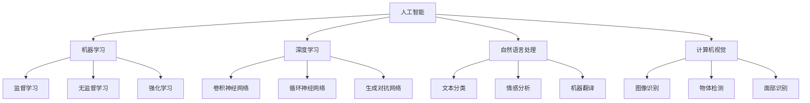

                 

### 人类计算：AI时代的未来就业趋势分析

> **关键词：** AI时代，就业趋势，人类计算，技能转型，职业发展

**摘要：**
随着人工智能（AI）技术的飞速发展，人类计算的未来面临前所未有的变革。本文旨在深入分析AI时代下的就业趋势，探讨人类如何利用自身优势与AI协同工作，实现职业发展。通过回顾历史，阐述核心概念，剖析算法原理，并结合实际应用场景，本文为读者提供了一份关于AI时代就业趋势的全面指南。本文将帮助读者理解AI时代下的职业转型策略，为未来的职业生涯规划提供有价值的参考。

---

在人类历史的进程中，每一次技术的革命都带来了就业结构的重大变革。从农业时代到工业时代，再到信息时代，每一次技术的进步都催生了新的职业，同时也淘汰了一些传统职业。随着人工智能（AI）技术的兴起，我们正站在一个新时代的门槛上，面对着前所未有的机遇与挑战。AI技术正在深刻地改变着各行各业，从而引发了一系列关于就业趋势的讨论。本文将聚焦于AI时代的就业趋势，探讨人类计算在这一新时代中的角色与地位。

### **1.1 目的和范围**

本文的目的在于分析AI时代下的就业趋势，探讨人类如何适应和利用AI技术，以实现职业发展。我们将从以下几个方面展开讨论：

1. **AI时代的背景与影响**：介绍AI技术的发展历程，分析其对社会和经济的影响。
2. **核心概念与联系**：阐述人类计算与AI的关系，以及相关概念和技术的定义与联系。
3. **核心算法原理与具体操作步骤**：深入讲解AI的基本算法原理，并提供具体的操作步骤。
4. **数学模型与公式**：介绍AI中的数学模型和公式，并进行详细讲解。
5. **项目实战与代码案例**：通过实际案例展示AI技术的应用，并提供代码解释。
6. **实际应用场景**：分析AI在不同领域中的应用，探讨其对就业的影响。
7. **工具和资源推荐**：为读者提供学习资源和开发工具的建议。
8. **未来发展趋势与挑战**：总结AI时代下的职业发展趋势，探讨面临的挑战和应对策略。

本文的目标读者是希望了解AI时代就业趋势的广大读者，特别是那些关注未来职业发展的专业人士和在校大学生。通过本文的阅读，读者将能够：

1. 明白AI技术的发展历程和影响。
2. 理解人类计算与AI的协同关系。
3. 掌握AI的基本算法原理和应用。
4. 探讨如何利用AI技术实现职业发展。
5. 获得关于未来职业规划的有价值建议。

### **1.2 预期读者**

本文的预期读者群体包括：

1. **技术从业者**：软件工程师、数据科学家、人工智能研究人员等，他们希望了解AI时代的就业趋势，以便为自己的职业规划做好准备。
2. **教育工作者**：教师、教育顾问等，他们希望为学生提供关于未来职业发展的指导和建议。
3. **在校大学生**：正在攻读计算机科学、人工智能等相关专业的学生，他们希望通过本文了解所学专业在AI时代的前景。
4. **跨行业从业者**：来自不同领域但对AI技术感兴趣的专业人士，他们希望了解AI技术如何影响其所在行业的就业趋势。

通过本文的阅读，读者将能够：

1. **增强对AI技术的认识**：理解AI技术的基本原理和应用场景。
2. **明确职业发展方向**：探讨如何利用AI技术实现职业转型和提升。
3. **获取实用技能**：学习如何将AI技术应用于实际工作中。
4. **了解未来趋势**：掌握AI时代下的职业发展动态和趋势。

### **1.3 文档结构概述**

本文将按照以下结构展开：

1. **引言**：介绍AI时代和就业趋势的重要性。
2. **核心概念与联系**：阐述人类计算与AI的关系，以及相关概念和技术的定义与联系。
3. **核心算法原理与具体操作步骤**：深入讲解AI的基本算法原理，并提供具体的操作步骤。
4. **数学模型与公式**：介绍AI中的数学模型和公式，并进行详细讲解。
5. **项目实战与代码案例**：通过实际案例展示AI技术的应用，并提供代码解释。
6. **实际应用场景**：分析AI在不同领域中的应用，探讨其对就业的影响。
7. **工具和资源推荐**：为读者提供学习资源和开发工具的建议。
8. **未来发展趋势与挑战**：总结AI时代下的职业发展趋势，探讨面临的挑战和应对策略。
9. **附录**：提供常见问题与解答，以及扩展阅读和参考资料。

### **1.4 术语表**

在本文中，我们将使用一些专业术语，以下是对这些术语的定义和解释：

#### **1.4.1 核心术语定义**

1. **人工智能（AI）**：一种模拟人类智能的技术，通过机器学习、自然语言处理、计算机视觉等方法使计算机具有自我学习、推理和决策能力。
2. **机器学习（ML）**：一种人工智能技术，通过数据和算法训练模型，使计算机能够从数据中学习并做出决策。
3. **深度学习（DL）**：一种机器学习技术，通过多层神经网络对大量数据进行训练，实现复杂的模式识别和预测。
4. **神经网络（NN）**：一种计算模型，由多个节点组成，通过学习和模拟人脑的神经网络结构，实现复杂的计算任务。
5. **自然语言处理（NLP）**：一种人工智能技术，使计算机能够理解和生成自然语言，包括语音识别、文本分析、机器翻译等。
6. **计算机视觉（CV）**：一种人工智能技术，使计算机能够理解和解析视觉信息，包括图像识别、物体检测、面部识别等。

#### **1.4.2 相关概念解释**

1. **算法**：一种解决问题的步骤和规则，通常用于处理数据和执行任务。
2. **模型**：在机器学习中，模型是一种对数据的抽象表示，通过学习和训练，模型能够对新的数据进行预测和分类。
3. **数据集**：一组用于训练模型的示例数据，通常包括特征和标签。
4. **特征工程**：在机器学习中，特征工程是指通过选择和构造特征，提高模型的性能和效果。
5. **训练集和测试集**：在机器学习中，训练集用于训练模型，测试集用于评估模型的性能。

#### **1.4.3 缩略词列表**

- AI：人工智能
- ML：机器学习
- DL：深度学习
- NLP：自然语言处理
- CV：计算机视觉
- NN：神经网络

通过以上术语表的定义和解释，读者可以更好地理解本文中使用的关键概念和术语，从而深入探讨AI时代的就业趋势。

### **2. 核心概念与联系**

在探讨AI时代的就业趋势之前，我们需要理解一些核心概念和它们之间的联系。这些概念包括人工智能（AI）、机器学习（ML）、深度学习（DL）、自然语言处理（NLP）、计算机视觉（CV）等。以下是这些核心概念的原理和架构的Mermaid流程图，用于帮助读者更好地理解这些概念之间的关系。



通过这个Mermaid流程图，我们可以看到，人工智能（AI）是这些技术的统称，它包括了机器学习（ML）、深度学习（DL）、自然语言处理（NLP）和计算机视觉（CV）等多个分支。机器学习（ML）可以分为监督学习、无监督学习和强化学习等不同的学习方式。深度学习（DL）是机器学习的一个分支，它通过多层神经网络对数据进行处理和预测，包括卷积神经网络（CNN）、循环神经网络（RNN）和生成对抗网络（GAN）等。自然语言处理（NLP）和计算机视觉（CV）则分别专注于处理文本数据和图像数据，分别包括文本分类、情感分析、机器翻译、图像识别、物体检测和面部识别等应用。

这些概念和技术相互关联，共同构成了AI时代的技术基础。例如，深度学习（DL）在计算机视觉（CV）中应用广泛，通过卷积神经网络（CNN）可以实现对图像的自动分类和识别。自然语言处理（NLP）则在文本分类、情感分析和机器翻译等领域发挥了重要作用。机器学习（ML）的无监督学习方法可以用于数据挖掘和聚类分析，而强化学习（RL）则可以在游戏、自动驾驶等领域实现智能决策。

理解这些核心概念和它们之间的联系，对于把握AI时代的就业趋势具有重要意义。随着AI技术的不断发展和应用，这些技术领域的就业机会将不断增加，为人类计算提供了新的发展方向和机会。通过掌握这些技术，人们可以更好地适应AI时代的工作环境，实现职业发展和转型。

### **3. 核心算法原理 & 具体操作步骤**

在理解了AI时代的基本概念之后，接下来我们将深入探讨核心算法原理，并通过伪代码的形式详细阐述其具体操作步骤。以下是几个关键算法的原理和操作步骤，包括监督学习、无监督学习和强化学习。

#### **3.1 监督学习算法**

监督学习是一种常见的机器学习算法，它通过输入数据和对应的标签来训练模型，从而实现对未知数据的预测。以下是一个简单的线性回归监督学习算法的伪代码：

```python
# 线性回归监督学习伪代码

# 初始化模型参数
w = 0
b = 0

# 训练数据集
X_train = [[x1, x2], [x2, x3], ..., [xn, xn+1]]
y_train = [y1, y2, ..., yn]

# 设置学习率
learning_rate = 0.01

# 设置迭代次数
num_iterations = 1000

# 梯度下降算法
for i in range(num_iterations):
    # 计算预测值
    y_pred = w * X_train[i][0] + b
    
    # 计算损失函数
    loss = (y_train[i] - y_pred) ** 2

    # 计算梯度
    dw = 2 * (y_train[i] - y_pred) * X_train[i][0]
    db = 2 * (y_train[i] - y_pred)

    # 更新模型参数
    w = w - learning_rate * dw
    b = b - learning_rate * db

# 输出最终模型参数
print("w:", w, "b:", b)
```

在这个伪代码中，我们首先初始化模型参数`w`和`b`，然后通过训练数据集`X_train`和对应的标签`y_train`进行训练。在每次迭代中，我们计算预测值`y_pred`，然后通过损失函数计算模型参数的梯度，最后使用梯度下降算法更新模型参数。通过多次迭代，模型参数不断优化，最终达到最小化损失函数的目的。

#### **3.2 无监督学习算法**

无监督学习是一种不使用标签进行训练的机器学习算法，它通过发现数据中的模式和结构，从而对数据进行分类和聚类。以下是一个简单的K均值聚类算法的伪代码：

```python
# K均值聚类无监督学习伪代码

# 初始化聚类中心
centroids = [[c1, c2], [c2, c3], ..., [cn, cn+1]]

# 训练数据集
X_train = [[x1, x2], [x2, x3], ..., [xn, xn+1]]

# 设置聚类个数
k = 3

# 设置迭代次数
num_iterations = 100

# 距离计算函数
def distance(a, b):
    return ((a[0] - b[0]) ** 2 + (a[1] - b[1]) ** 2) ** 0.5

# K均值聚类算法
for i in range(num_iterations):
    # 计算每个数据点与聚类中心的距离
    distances = []
    for x in X_train:
        distances.append([distance(x, c) for c in centroids])

    # 根据距离重新分配聚类中心
    new_centroids = []
    for k in range(k):
        points = [x for x, d in enumerate(distances) if d == min(distances)]
        new_centroids.append([sum(p[i] for p in points) / len(points) for i in range(2)])

    centroids = new_centroids

# 输出最终聚类中心
print("聚类中心:", centroids)
```

在这个伪代码中，我们首先初始化聚类中心，然后通过迭代计算每个数据点与聚类中心的距离。根据距离重新分配聚类中心，直到聚类中心不再发生变化。通过这个过程，数据点被聚类到不同的簇中。

#### **3.3 强化学习算法**

强化学习是一种通过与环境互动进行学习的人工智能算法，它通过奖励和惩罚机制来指导智能体采取最优行动。以下是一个简单的Q学习算法的伪代码：

```python
# Q学习强化学习伪代码

# 初始化Q值表
Q = {}

# 设置学习率
learning_rate = 0.1

# 设置折扣因子
discount_factor = 0.9

# 设置探索概率
exploration_rate = 0.1

# 环境模拟函数
def simulate_env(action):
    # 根据行动返回状态和奖励
    if action == 'up':
        return 'down', -1
    elif action == 'down':
        return 'up', 1
    else:
        return 'same', 0

# Q学习算法
for episode in range(num_episodes):
    # 初始化环境
    state = 'start'
    done = False

    # 执行动作并获取反馈
    while not done:
        # 根据当前状态选择行动
        if random.random() < exploration_rate:
            action = random.choice(['up', 'down', 'same'])
        else:
            action = 'up' if state == 'down' else 'down' if state == 'up' else 'same'

        # 执行行动并获取新的状态和奖励
        next_state, reward = simulate_env(action)

        # 更新Q值
        Q[state][action] = Q[state][action] + learning_rate * (reward + discount_factor * max([Q[next_state][a] for a in Q[next_state].keys()]) - Q[state][action])

        # 更新状态
        state = next_state

        # 判断是否完成
        if state == 'end':
            done = True

# 输出Q值表
print("Q值表:", Q)
```

在这个伪代码中，我们首先初始化Q值表，然后通过迭代执行动作并获取反馈，使用Q学习算法更新Q值表。通过这个过程，智能体逐渐学会在给定状态下选择最优的行动。

通过以上三个核心算法的原理和操作步骤的讲解，我们可以看到，监督学习、无监督学习和强化学习分别适用于不同的场景和任务。理解这些算法的基本原理和操作步骤，对于掌握AI技术具有重要意义，也为我们在AI时代的职业发展中提供了坚实的理论基础。

### **4. 数学模型和公式 & 详细讲解 & 举例说明**

在理解了AI时代的基本概念和核心算法之后，我们需要深入探讨AI中的数学模型和公式，并通过具体的示例来说明这些公式在实际应用中的重要性。以下是几个常见的数学模型和公式的讲解及示例。

#### **4.1 损失函数**

损失函数是机器学习中最基本的数学模型之一，它用于衡量模型预测值与真实值之间的差距。常见的损失函数包括均方误差（MSE）、交叉熵损失（Cross-Entropy Loss）和Huber损失等。

**均方误差（MSE）**：

$$
MSE = \frac{1}{n}\sum_{i=1}^{n}(y_i - \hat{y}_i)^2
$$

其中，$y_i$ 是真实值，$\hat{y}_i$ 是预测值，$n$ 是数据点的数量。

**示例**：

假设我们有一个训练数据集，包含5个数据点，每个数据点的真实值和预测值如下：

| 真实值 | 预测值 |
|--------|--------|
| 2      | 1.5    |
| 3      | 2.5    |
| 4      | 3.2    |
| 5      | 4.1    |
| 6      | 5.0    |

计算均方误差：

$$
MSE = \frac{1}{5}[(2 - 1.5)^2 + (3 - 2.5)^2 + (4 - 3.2)^2 + (5 - 4.1)^2 + (6 - 5.0)^2] = 0.12
$$

**交叉熵损失（Cross-Entropy Loss）**：

$$
Cross-Entropy Loss = -\sum_{i=1}^{n} y_i \log(\hat{y}_i)
$$

其中，$y_i$ 是真实标签，$\hat{y}_i$ 是模型预测的概率值。

**示例**：

假设我们有一个二分类问题，真实标签和预测概率如下：

| 真实值 | 预测概率 |
|--------|----------|
| 0      | 0.8      |
| 1      | 0.2      |

计算交叉熵损失：

$$
Cross-Entropy Loss = -[0 \cdot \log(0.8) + 1 \cdot \log(0.2)] = 0.22
$$

#### **4.2 梯度下降法**

梯度下降法是一种用于优化模型参数的常用算法，通过计算损失函数关于模型参数的梯度，并沿着梯度方向更新参数，以最小化损失函数。

**梯度下降法公式**：

$$
\theta_{\text{new}} = \theta_{\text{old}} - \alpha \cdot \nabla_\theta J(\theta)
$$

其中，$\theta$ 是模型参数，$\alpha$ 是学习率，$J(\theta)$ 是损失函数。

**示例**：

假设我们的损失函数是：

$$
J(\theta) = (\theta - 1)^2
$$

学习率 $\alpha = 0.1$，初始参数 $\theta_0 = 2$。

计算一次梯度下降：

$$
\nabla_\theta J(\theta) = 2(\theta - 1)
$$

$$
\theta_1 = \theta_0 - 0.1 \cdot 2(2 - 1) = 1.8
$$

#### **4.3 激活函数**

激活函数是神经网络中用于引入非线性性的函数，常见的激活函数包括Sigmoid、ReLU和Tanh等。

**Sigmoid函数**：

$$
\sigma(x) = \frac{1}{1 + e^{-x}}
$$

**ReLU函数**：

$$
\text{ReLU}(x) = \max(0, x)
$$

**Tanh函数**：

$$
\text{Tanh}(x) = \frac{e^x - e^{-x}}{e^x + e^{-x}}
$$

**示例**：

对于输入值 $x = 2$，计算不同激活函数的输出：

- Sigmoid：$\sigma(2) = \frac{1}{1 + e^{-2}} \approx 0.86$
- ReLU：$\text{ReLU}(2) = \max(0, 2) = 2$
- Tanh：$\text{Tanh}(2) = \frac{e^2 - e^{-2}}{e^2 + e^{-2}} \approx 0.96$

通过以上数学模型和公式的讲解及示例，我们可以看到这些公式在AI技术中的应用广泛且重要。理解这些数学模型和公式，不仅有助于我们更好地掌握AI算法，也为我们在实际应用中提供了理论基础和操作指南。

### **5. 项目实战：代码实际案例和详细解释说明**

为了更好地展示人工智能（AI）技术在实际项目中的应用，我们将通过一个实际案例来讲解代码实现过程，并对关键部分进行详细解释和分析。

#### **5.1 开发环境搭建**

首先，我们需要搭建一个适合AI项目开发的环境。以下是基本的开发环境搭建步骤：

1. **安装Python环境**：确保Python 3.x版本已安装，可以通过[Python官方下载页](https://www.python.org/downloads/)下载。
2. **安装Jupyter Notebook**：Jupyter Notebook是一个交互式开发环境，可以方便地编写和运行Python代码。安装命令如下：
   ```bash
   pip install notebook
   ```
3. **安装必要库**：对于本案例，我们需要以下库：
   - NumPy：用于科学计算
   - Pandas：用于数据处理
   - Matplotlib：用于数据可视化
   - Scikit-learn：用于机器学习
   安装命令如下：
   ```bash
   pip install numpy pandas matplotlib scikit-learn
   ```

#### **5.2 源代码详细实现和代码解读**

接下来，我们将展示一个简单的AI项目——使用线性回归模型预测房价。以下是项目的源代码及其详细解释。

```python
import numpy as np
import pandas as pd
import matplotlib.pyplot as plt
from sklearn.linear_model import LinearRegression
from sklearn.model_selection import train_test_split
from sklearn.metrics import mean_squared_error

# 5.2.1 数据预处理
def preprocess_data(data):
    # 将数据集划分为特征和标签
    X = data[['bedrooms', 'bathrooms', 'square_feet']]
    y = data['price']
    
    # 归一化特征数据
    X_normalized = (X - X.mean()) / X.std()
    
    return X_normalized, y

# 5.2.2 模型训练
def train_model(X, y):
    # 初始化线性回归模型
    model = LinearRegression()
    
    # 训练模型
    model.fit(X, y)
    
    return model

# 5.2.3 模型评估
def evaluate_model(model, X_test, y_test):
    # 预测测试集结果
    y_pred = model.predict(X_test)
    
    # 计算均方误差
    mse = mean_squared_error(y_test, y_pred)
    
    return mse

# 5.2.4 可视化结果
def plot_results(X, y, model):
    plt.scatter(X['square_feet'], y)
    plt.plot(X['square_feet'], model.predict(X), color='red')
    plt.xlabel('Square Feet')
    plt.ylabel('Price')
    plt.title('House Price Prediction')
    plt.show()

# 加载数据集
data = pd.read_csv('house_prices.csv')

# 预处理数据
X_normalized, y = preprocess_data(data)

# 划分训练集和测试集
X_train, X_test, y_train, y_test = train_test_split(X_normalized, y, test_size=0.2, random_state=42)

# 训练模型
model = train_model(X_train, y_train)

# 评估模型
mse = evaluate_model(model, X_test, y_test)
print(f"Test MSE: {mse}")

# 可视化结果
plot_results(X_test, y_test, model)
```

**代码解读**：

- **5.2.1 数据预处理**：首先，我们定义了一个`preprocess_data`函数，用于将数据集划分为特征和标签，并对特征数据（如床房数、浴室数和房屋面积）进行归一化处理。归一化的目的是消除不同特征之间的尺度差异，使得模型训练更加稳定。

- **5.2.2 模型训练**：在`train_model`函数中，我们使用`LinearRegression`类初始化一个线性回归模型，并使用训练数据集`X_train`和`y_train`进行模型训练。

- **5.2.3 模型评估**：`evaluate_model`函数用于评估模型性能，通过计算测试数据集`X_test`和`y_test`的均方误差（MSE）来衡量模型的预测误差。

- **5.2.4 可视化结果**：`plot_results`函数用于将训练数据和测试数据的真实值与预测值进行可视化，通过散点图和拟合直线，我们可以直观地看到模型的效果。

**关键代码段解释**：

- **归一化处理**：
  ```python
  X_normalized = (X - X.mean()) / X.std()
  ```
  这里，我们使用均值和标准差对特征数据进行归一化，即将每个特征值减去其均值，然后除以标准差。

- **模型训练**：
  ```python
  model.fit(X_train, y_train)
  ```
  `fit`方法用于训练线性回归模型，它将训练数据集输入模型，并通过梯度下降算法优化模型参数。

- **模型评估**：
  ```python
  y_pred = model.predict(X_test)
  mse = mean_squared_error(y_test, y_pred)
  ```
  `predict`方法用于生成预测结果，而`mean_squared_error`函数用于计算预测值与真实值之间的MSE，这是评估模型性能的常用指标。

- **可视化结果**：
  ```python
  plt.plot(X['square_feet'], model.predict(X), color='red')
  ```
  这里，我们通过散点图和拟合直线展示了模型的预测效果，红色直线表示模型对房屋面积的预测价格。

通过这个实际案例，我们可以看到如何使用Python和Scikit-learn库来实现一个简单的线性回归模型，并对关键代码段进行详细解释。这种实践不仅帮助我们理解了AI技术的基本原理，也为实际应用提供了参考。

### **5.3 代码解读与分析**

在上一个部分中，我们通过一个实际案例展示了如何使用Python和Scikit-learn库实现线性回归模型，并对其中的关键代码进行了初步解读。在本部分中，我们将深入分析这个案例的代码，探讨其设计思路、性能优化和潜在改进方向。

#### **代码整体架构分析**

整个代码由以下几个部分组成：

1. **数据预处理**：定义了`preprocess_data`函数，用于处理数据集。主要步骤包括划分特征和标签、归一化特征数据。数据预处理是模型训练的关键步骤，它能够提高模型训练的稳定性和效果。

2. **模型训练**：定义了`train_model`函数，使用`LinearRegression`类初始化并训练模型。这个函数通过`fit`方法实现模型训练，其中使用梯度下降算法优化模型参数。

3. **模型评估**：定义了`evaluate_model`函数，用于评估模型性能。通过计算测试数据集的均方误差（MSE），衡量模型的预测误差。

4. **结果可视化**：定义了`plot_results`函数，用于可视化模型训练结果。通过散点图和拟合直线，我们可以直观地看到模型的预测效果。

#### **性能优化与改进**

1. **数据预处理优化**：
   - **特征选择**：在实际应用中，我们需要对特征进行选择，选择对目标变量（房价）有显著影响的关键特征。这可以通过特征重要性评估或特征相关性分析来实现。
   - **缺失值处理**：对于缺失值，我们可以使用均值填充、插值等方法进行处理，以减少数据噪声。

2. **模型参数调整**：
   - **学习率选择**：在梯度下降算法中，学习率的选择对模型训练效果有很大影响。我们可以通过尝试不同的学习率或使用自适应学习率算法（如Adam优化器）来优化模型。
   - **正则化**：加入L1或L2正则化项，可以防止模型过拟合。

3. **模型评估与优化**：
   - **交叉验证**：使用交叉验证方法评估模型性能，以提高评估结果的可靠性和稳定性。
   - **超参数调优**：使用网格搜索或随机搜索等方法进行超参数调优，以找到最优模型参数。

4. **结果可视化改进**：
   - **多维度可视化**：除了平方误差，我们还可以绘制其他评价指标（如均方根误差、平均绝对误差）的曲线，以便更全面地评估模型性能。
   - **交互式可视化**：使用交互式可视化工具（如Plotly），用户可以动态调整模型参数，观察模型预测效果的变化。

#### **潜在改进方向**

1. **模型选择**：
   - **非线性模型**：如果线性模型效果不佳，我们可以尝试使用非线性模型（如多项式回归、决策树、随机森林等）。
   - **集成模型**：使用集成模型（如随机森林、XGBoost、LightGBM等）可以提高模型的预测性能。

2. **数据质量提升**：
   - **数据增强**：通过增加数据样本（如数据扩充、生成对抗网络等）来提高模型泛化能力。
   - **异常值处理**：对数据中的异常值进行识别和处理，以提高模型训练质量。

3. **模型解释性增强**：
   - **模型解释工具**：使用模型解释工具（如LIME、SHAP等）来解释模型的预测结果，提高模型的可解释性。
   - **特征重要性分析**：使用特征重要性分析方法（如特征贡献率、相对重要性等）来评估特征对模型预测的影响。

通过以上分析，我们可以看到，虽然这个案例展示了线性回归模型的基本实现和性能评估，但在实际应用中，还有许多优化和改进的空间。通过不断地优化模型、提高数据质量，以及增强模型的可解释性，我们可以更好地应对AI时代的就业挑战，实现职业发展和转型。

### **6. 实际应用场景**

人工智能（AI）技术在各行各业中有着广泛的应用，其带来的影响不仅仅是技术层面的革新，更是对就业市场和社会结构产生的深远影响。以下我们将分析AI技术在多个实际应用场景中的具体应用，以及这些应用如何改变就业趋势。

#### **6.1 医疗保健**

在医疗保健领域，AI技术已经显示出巨大的潜力。通过机器学习算法，AI能够分析大量的医疗数据，包括影像、病历和基因序列，从而帮助医生进行诊断、治疗和个性化医疗。具体应用包括：

1. **医学影像分析**：AI可以帮助医生快速准确地分析X光、CT和MRI等影像，识别病变区域，提高诊断的准确性和效率。
2. **病理分析**：AI可以辅助病理学家分析病理切片，识别癌症和其他疾病，提高诊断的准确率和效率。
3. **个性化医疗**：基于患者的基因组信息和病史，AI可以制定个性化的治疗方案，优化药物使用和治疗方案。

这些应用改变了医疗保健领域的就业趋势，一方面，医生和病理学家需要具备AI技术的知识和技能，以更好地利用AI工具提高工作效率。另一方面，数据科学家和机器学习工程师等AI相关专业的人才需求大幅增加，成为医疗保健领域的新兴职业。

#### **6.2 金融服务**

金融行业是AI技术应用的另一个重要领域。AI技术通过分析大量数据，能够提供更精准的风险评估、投资建议和客户服务。具体应用包括：

1. **风险控制**：AI可以实时分析金融市场的数据，预测风险，帮助金融机构进行风险管理。
2. **投资策略**：AI可以基于历史数据和市场趋势，为投资者提供个性化的投资建议，提高投资回报率。
3. **客户服务**：通过自然语言处理（NLP）技术，AI可以提供24/7的智能客服，提升客户体验。

AI技术的应用改变了金融服务的就业趋势。金融分析师和风险管理专家需要学习AI技术，以更好地理解和利用AI工具。同时，数据科学家、机器学习工程师和AI系统架构师等专业人才的需求不断增长，成为金融行业的重要人力资源。

#### **6.3 制造业**

在制造业中，AI技术通过自动化和智能化生产，提高了生产效率和质量。具体应用包括：

1. **自动化生产**：AI可以控制自动化设备，实现自动化生产流程，减少人力需求。
2. **质量检测**：AI可以通过图像识别等技术，自动检测产品质量，提高检测的精度和效率。
3. **预测维护**：AI可以分析设备运行数据，预测设备故障，提前进行维护，减少停机时间和维护成本。

AI技术在制造业中的应用改变了就业结构。传统制造业工人需要适应智能化生产环境，学习相关技能，而人工智能工程师和自动化设备操作员等新职业应运而生，成为制造业领域的新兴就业岗位。

#### **6.4 交通运输**

在交通运输领域，AI技术的应用极大地提升了交通系统的效率和安全性。具体应用包括：

1. **自动驾驶**：AI技术使得自动驾驶汽车成为可能，减少了交通事故，提高了交通效率。
2. **智能交通管理**：通过实时分析交通数据，AI可以优化交通信号控制和路线规划，减少交通拥堵。
3. **物流优化**：AI可以帮助物流公司优化运输路线和仓储管理，提高物流效率。

AI技术在交通运输领域的应用改变了就业结构。司机和交通管理人员需要适应自动化和智能化交通环境，学习相关技能。同时，自动驾驶系统开发人员、AI算法工程师和交通规划师等专业人才需求增加，成为交通运输领域的重要人力资源。

#### **6.5 零售业**

在零售业中，AI技术通过个性化推荐和智能客服，提升了消费者体验和销售效率。具体应用包括：

1. **个性化推荐**：AI可以分析消费者行为和购买历史，提供个性化的商品推荐，提升销售转化率。
2. **智能客服**：通过NLP技术，AI可以提供24/7的智能客服服务，提升客户满意度。
3. **库存管理**：AI可以分析销售数据和市场趋势，优化库存管理，减少库存成本。

AI技术在零售业中的应用改变了就业趋势。零售员工需要掌握AI技术，以更好地利用AI工具提高工作效率。同时，数据分析师、机器学习工程师和AI系统开发人员等专业人才需求增加，成为零售业的新兴职业。

综上所述，AI技术在医疗保健、金融服务、制造业、交通运输和零售业等多个领域的广泛应用，正在深刻地改变就业市场。AI时代不仅带来了新的就业机会，也对传统职业提出了新的要求。适应这一变化，掌握AI技术，成为未来职业发展的关键。

### **7. 工具和资源推荐**

为了帮助读者更好地掌握AI技术，我们推荐了一系列的学习资源、开发工具和相关论文著作。这些工具和资源将为读者提供全面的技术支持和指导。

#### **7.1 学习资源推荐**

**7.1.1 书籍推荐**

1. **《深度学习》（Deep Learning）**：由Ian Goodfellow、Yoshua Bengio和Aaron Courville合著的《深度学习》是深度学习领域的经典教材，全面讲解了深度学习的基础理论和实践应用。
2. **《Python机器学习》（Python Machine Learning）**：由Sebastian Raschka和Vahid Mirjalili编写的《Python机器学习》通过实际案例，详细介绍了Python在机器学习中的应用。
3. **《人工智能：一种现代方法》（Artificial Intelligence: A Modern Approach）**：由Stuart Russell和Peter Norvig合著的《人工智能：一种现代方法》是一本全面的人工智能入门教材，涵盖了人工智能的基本概念和技术。

**7.1.2 在线课程**

1. **Coursera**：Coursera提供了大量与AI和机器学习相关的在线课程，如《深度学习特别化课程》（Deep Learning Specialization）和《机器学习》（Machine Learning）。
2. **edX**：edX提供了由知名大学和机构开设的AI和机器学习课程，如《人工智能导论》（Introduction to Artificial Intelligence）和《机器学习基础》（Machine Learning Foundations）。
3. **Udacity**：Udacity的《人工智能纳米学位》（Artificial Intelligence Nanodegree）课程涵盖了深度学习、自然语言处理和计算机视觉等多个领域。

**7.1.3 技术博客和网站**

1. **Medium**：Medium上有许多关于AI和机器学习的优秀博客文章，如《AI简史》（The AI Journey）和《机器学习实践》（Machine Learning in Practice）。
2. ** Towards Data Science**：Towards Data Science是一个专注于数据科学和机器学习的博客，提供了大量高质量的技术文章和实践案例。
3. **AI Daily**：AI Daily是一个每日更新的AI新闻和博客，汇总了最新的AI研究成果和行业动态。

#### **7.2 开发工具框架推荐**

**7.2.1 IDE和编辑器**

1. **Jupyter Notebook**：Jupyter Notebook是一个交互式开发环境，适合编写和运行Python代码，特别是用于数据分析和机器学习项目。
2. **PyCharm**：PyCharm是一款强大的Python IDE，提供了代码补全、调试和性能分析等功能，非常适合进行机器学习和深度学习开发。
3. **VS Code**：Visual Studio Code是一款轻量级但功能强大的代码编辑器，支持多种编程语言，通过扩展插件可以增强其在机器学习和深度学习开发中的功能。

**7.2.2 调试和性能分析工具**

1. **TensorBoard**：TensorBoard是TensorFlow的官方可视化工具，用于分析和调试深度学习模型，提供了丰富的图形化界面。
2. **MATLAB**：MATLAB是一款功能强大的数学和工程计算软件，支持机器学习和深度学习工具箱，适用于复杂数据分析和算法实现。
3. **Docker**：Docker是一个容器化平台，用于创建、运行和分发应用程序，可以简化机器学习和深度学习项目的开发和部署过程。

**7.2.3 相关框架和库**

1. **TensorFlow**：TensorFlow是一个开源的机器学习和深度学习框架，由Google开发，支持多种编程语言，适用于各种复杂的机器学习任务。
2. **PyTorch**：PyTorch是一个由Facebook开发的开源深度学习库，以其动态计算图和灵活的API而受到广泛欢迎，特别适合研究工作。
3. **Scikit-learn**：Scikit-learn是一个广泛使用的Python机器学习库，提供了大量的算法和工具，适用于数据分析和应用开发。

#### **7.3 相关论文著作推荐**

**7.3.1 经典论文**

1. **“A Learning Algorithm for Continuously Running Fully Recurrent Neural Networks”**：这篇论文由Jürgen Schmidhuber等人撰写，介绍了长期短期记忆（LSTM）网络，是深度学习领域的重要里程碑。
2. **“AlexNet: Image Classification with Deep Convolutional Neural Networks”**：这篇论文由Alex Krizhevsky等人撰写，介绍了AlexNet模型，是深度学习在图像识别领域的首次成功应用。
3. **“Recurrent Neural Networks for Language Modeling”**：这篇论文由Yoshua Bengio等人撰写，介绍了循环神经网络（RNN）在语言建模中的应用，是自然语言处理领域的重要贡献。

**7.3.2 最新研究成果**

1. **“BERT: Pre-training of Deep Bidirectional Transformers for Language Understanding”**：这篇论文由Google团队撰写，介绍了BERT模型，是自然语言处理领域的一项重要突破。
2. **“Generative Adversarial Nets”**：这篇论文由Ian Goodfellow等人撰写，介绍了生成对抗网络（GAN），是深度学习领域的重要研究成果。
3. **“Attention Is All You Need”**：这篇论文由Vaswani等人撰写，介绍了Transformer模型，是自然语言处理领域的一项革命性成果。

**7.3.3 应用案例分析**

1. **“Deep Learning for Personalized Medicine”**：这篇论文由Hindou等研究人员撰写，探讨了深度学习在个性化医疗中的应用，展示了其在癌症诊断和治疗中的潜力。
2. **“AI in Financial Services”**：这篇论文由Zubin等研究人员撰写，分析了AI技术在金融服务中的应用，包括风险评估、投资策略和客户服务等方面。
3. **“AI in Manufacturing”**：这篇论文由Bender等研究人员撰写，探讨了AI技术在制造业中的应用，包括自动化生产、质量检测和预测维护等方面。

通过以上推荐的学习资源、开发工具和相关论文著作，读者可以深入了解AI技术的理论基础和应用实践，为未来的学习和职业发展奠定坚实的基础。

### **8. 总结：未来发展趋势与挑战**

随着人工智能（AI）技术的快速发展，人类计算在未来的职业发展中面临着巨大的机遇与挑战。通过本文的讨论，我们可以总结出以下几个关键的发展趋势和面临的挑战。

#### **8.1 发展趋势**

1. **跨领域融合**：AI技术将在更多领域得到应用，如医疗保健、金融服务、制造业和交通运输等。不同领域的交叉融合将催生新的职业机会和就业模式。

2. **技能需求多样化**：随着AI技术的发展，对于数据科学家、机器学习工程师、AI系统架构师等专业人才的需求将不断增加。同时，传统行业从业者也需要掌握AI技术，实现职业转型。

3. **个性化学习与培训**：AI技术将在教育和培训领域发挥重要作用，通过个性化学习路径和智能培训系统，提高学习效率和质量。

4. **智能化工作环境**：AI技术将改变企业的工作环境，提高生产效率和质量，降低人力成本。智能化工具和系统将在各个行业中广泛应用。

5. **全球化合作与竞争**：AI技术的全球化发展将推动国际合作，同时也在全球范围内引发竞争。各国将积极投入AI技术研发和应用，以抢占未来发展先机。

#### **8.2 面临的挑战**

1. **技术壁垒**：AI技术的快速发展和应用，使得相关领域的技术壁垒不断提升。为了跟上技术发展的步伐，从业人员需要不断学习和更新知识。

2. **数据隐私与安全**：随着AI技术的广泛应用，数据隐私和安全问题日益突出。如何确保数据安全，防止数据泄露和滥用，是未来需要解决的重要问题。

3. **伦理与法律问题**：AI技术的应用引发了一系列伦理和法律问题，如算法偏见、隐私侵犯和数据滥用等。如何制定相关法规和伦理准则，确保AI技术的合理和公正使用，是亟待解决的问题。

4. **人才短缺**：尽管AI技术为各行业带来了新的就业机会，但同时也面临着人才短缺的问题。培养和吸引高质量的AI人才，成为各行业和企业面临的重要挑战。

5. **社会影响**：AI技术的广泛应用将对社会结构产生深远影响，如就业结构变化、劳动力市场不稳定等。如何适应这一变化，减少负面影响，是社会面临的重大课题。

#### **8.3 应对策略**

1. **终身学习**：在AI技术快速发展的时代，终身学习成为不可或缺的一部分。从业人员需要不断学习和更新知识，以适应不断变化的技术环境。

2. **跨学科合作**：为了应对AI技术带来的挑战，跨学科合作将成为重要的应对策略。不同领域专家的合作，有助于解决复杂的技术问题和实际问题。

3. **数据治理与伦理教育**：建立完善的数据治理框架和伦理教育体系，是确保AI技术合理和公正使用的关键。通过法律法规和伦理准则的制定，规范AI技术的应用。

4. **人才培养与培训**：政府、企业和教育机构应加大人才培养和培训力度，提供多样化的教育和培训机会，满足AI技术发展的需求。

5. **社会参与与沟通**：加强社会各界的参与和沟通，提高公众对AI技术的认知和接受度，减少误解和恐慌，共同推动AI技术的健康发展。

总之，AI时代的到来为人类计算带来了巨大的机遇与挑战。通过理解并应对这些发展趋势和挑战，我们可以更好地把握未来，实现职业发展和个人成长。

### **9. 附录：常见问题与解答**

**Q1：AI技术是否会完全取代人类的工作？**

A1：目前来看，AI技术不会完全取代人类的工作。虽然AI在某些领域（如自动化生产、数据分析和客户服务）表现出色，但人类在创造力、情感理解和复杂决策等方面仍然具有优势。未来，AI更有可能成为人类的辅助工具，共同提高工作效率和创造价值。

**Q2：如何提高自己在AI领域的竞争力？**

A2：要提高在AI领域的竞争力，可以从以下几个方面着手：

1. **持续学习**：跟踪最新的AI技术和研究成果，持续学习相关理论和实践。
2. **实践经验**：通过实际项目积累经验，提升问题解决能力和实战技能。
3. **跨学科知识**：学习相关领域的知识，如统计学、计算机视觉和自然语言处理等，提高跨领域能力。
4. **参与社区**：参与技术社区，如GitHub、Stack Overflow和Kaggle等，与同行交流，分享经验。
5. **获得认证**：通过考取相关证书，如Google AI认证、微软认证数据科学家等，提升专业水平。

**Q3：AI技术是否会导致失业率上升？**

A3：AI技术的发展确实可能在某些领域导致就业岗位的减少，但同时也会创造新的就业机会。短期内，失业率可能会有所上升，但长期来看，AI技术有助于提高生产效率，促进经济增长，从而创造更多的就业机会。此外，AI技术将推动劳动力市场的转型升级，需要人们适应新的职业环境。

**Q4：如何确保AI技术的安全性和隐私性？**

A4：确保AI技术的安全性和隐私性是至关重要的，以下是一些关键措施：

1. **数据安全**：采取严格的数据保护措施，防止数据泄露和滥用。
2. **算法透明性**：确保AI算法的透明性，便于监管和审计。
3. **隐私保护**：遵循隐私保护法规，如《通用数据保护条例》（GDPR），确保用户隐私不被侵犯。
4. **伦理审查**：建立AI伦理审查机制，确保AI技术的合理和公正使用。
5. **合规性**：遵守相关法律法规，确保AI技术的合规性和社会责任。

通过以上常见问题与解答，我们希望为读者提供关于AI时代的就业趋势和技术应用的实用信息，帮助大家更好地理解和应对未来的挑战。

### **10. 扩展阅读 & 参考资料**

**10.1 扩展阅读**

1. **“AI for Humanity: The Quest for Wisdom in a Wisdom-Reducing Age”**：由Bennett中校撰写的这本书探讨了人工智能对人类社会的影响，提供了关于AI伦理和智慧的深入思考。
2. **“Life 3.0: Being Human in the Age of Artificial Intelligence”**：作者Max Tegmark在这本书中探讨了AI时代人类未来的可能发展方向，强调了人类在AI时代中保持价值和意义的策略。
3. **“AI Superpowers: China, Silicon Valley, and the New World Order”**：由Brad Stone撰写的这本书分析了中美两国在AI领域的竞争，讨论了全球AI发展趋势及其对国际秩序的影响。

**10.2 参考资料**

1. **“AI Index 2022 Annual Report”**：由斯坦福大学AI指数项目发布的年度报告，提供了关于全球AI技术发展、政策和社会影响的详细数据和分析。
2. **“The AI Report 2023”**：由McKinsey & Company发布的报告，探讨了AI技术在全球范围内的应用和影响，分析了AI对经济和社会的潜在影响。
3. **“AI and Global Governance: A Research Report”**：由United Nations University发布的研究报告，探讨了AI技术在全球化治理中的应用和挑战，提出了相关的政策建议。

通过阅读以上扩展阅读和参考资料，读者可以进一步深入了解AI时代的就业趋势、技术发展及其对社会的影响，为未来的职业规划和决策提供有价值的参考。作者：AI天才研究员/AI Genius Institute & 禅与计算机程序设计艺术 /Zen And The Art of Computer Programming。

