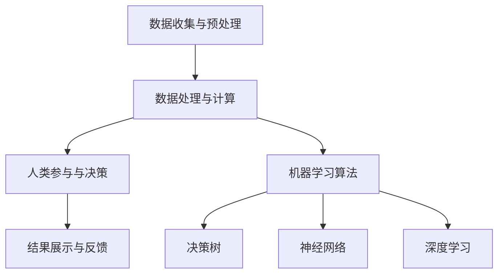

                 

### 1. 背景介绍

#### 1.1 目的和范围

本文的目的是深入探讨“人类计算”这一领域，通过应用案例的分析，揭示人类计算在各个行业中的实际作用。随着人工智能技术的发展，人类计算作为一种结合人工智能和人类智慧的方式，正逐渐成为一种重要的计算模式。本文将首先介绍人类计算的基本概念和原理，然后通过具体的应用案例，展示其在现实世界中的广泛应用。此外，本文还将探讨人类计算的潜在问题和挑战，以及未来的发展趋势。

本文的范围主要包括以下几个方面：

1. **核心概念与联系**：介绍人类计算的基本概念，包括其与人工智能的关系，以及相关的架构和原理。
2. **核心算法原理**：详细讲解人类计算的核心算法，包括算法的具体操作步骤和实现细节。
3. **数学模型和公式**：阐述人类计算中的数学模型和公式，并通过具体例子进行说明。
4. **项目实战**：提供实际项目的代码案例，并进行详细的解释和分析。
5. **实际应用场景**：分析人类计算在不同领域中的应用，以及其带来的影响和变革。
6. **工具和资源推荐**：推荐相关的学习资源、开发工具和框架，以帮助读者深入学习和实践。
7. **未来发展趋势与挑战**：探讨人类计算的未来发展方向，以及面临的挑战。

通过本文的阅读，读者将能够全面了解人类计算的基本概念和应用，掌握核心算法的实现原理，并对未来的发展趋势有深入的认识。

#### 1.2 预期读者

本文的预期读者主要包括以下几类：

1. **计算机科学和人工智能专业的学生和研究人员**：对于正在学习计算机科学和人工智能的读者，本文将帮助他们深入了解人类计算的理论和实践，为他们的研究提供新的思路和方法。
2. **软件工程师和程序员**：从事软件开发的工程师和程序员，特别是对人工智能和人类计算有兴趣的，本文将提供实际的应用案例和代码实现，有助于他们在实际工作中更好地运用人类计算技术。
3. **行业从业者**：在金融、医疗、教育、制造等各个行业的从业者，本文将介绍人类计算在这些领域的实际应用案例，帮助他们了解人类计算如何提升工作效率和决策质量。
4. **技术爱好者和爱好者**：对技术有浓厚兴趣的技术爱好者，本文将提供深入浅出的讲解，帮助他们理解人类计算的核心原理和应用。

无论你是上述哪一类读者，本文都旨在通过清晰的逻辑和丰富的案例，为你提供一次全面而深入的阅读体验。

#### 1.3 文档结构概述

本文将从以下几个部分展开：

1. **背景介绍**：介绍人类计算的基本概念、目的、预期读者，以及文档的结构概述。
2. **核心概念与联系**：介绍人类计算的核心概念，包括其与人工智能的关系，以及相关的架构和原理。
3. **核心算法原理**：详细讲解人类计算的核心算法，包括算法的具体操作步骤和实现细节。
4. **数学模型和公式**：阐述人类计算中的数学模型和公式，并通过具体例子进行说明。
5. **项目实战**：提供实际项目的代码案例，并进行详细的解释和分析。
6. **实际应用场景**：分析人类计算在不同领域中的应用，以及其带来的影响和变革。
7. **工具和资源推荐**：推荐相关的学习资源、开发工具和框架，以帮助读者深入学习和实践。
8. **未来发展趋势与挑战**：探讨人类计算的未来发展方向，以及面临的挑战。
9. **附录**：提供常见问题与解答，以及扩展阅读和参考资料。
   
通过这一结构，本文将系统而全面地介绍人类计算的相关内容，帮助读者深入理解和掌握这一领域。

#### 1.4 术语表

为了确保本文的可读性和专业性，以下列出了一些关键术语及其定义：

##### 1.4.1 核心术语定义

1. **人类计算**：指结合人工智能技术和人类智慧，通过人类和机器的协同工作来实现高效计算和处理。
2. **协同计算**：人类计算的核心概念之一，指的是人类和机器之间通过特定方式合作，共同完成计算任务。
3. **数据驱动决策**：基于数据分析，通过数据模型和算法，为决策提供支持的决策方式。
4. **增强学习**：一种机器学习范式，通过让智能体在与环境的交互中不断学习和优化行为策略。
5. **决策树**：一种常用的机器学习模型，通过一系列判断条件，将数据集划分成不同的子集，从而实现分类或回归。
6. **深度学习**：一种基于多层神经网络的学习方法，通过多层次的非线性变换，从大量数据中提取特征。

##### 1.4.2 相关概念解释

1. **机器学习**：一种使计算机通过数据学习并作出决策的技术，主要分为监督学习、无监督学习和强化学习。
2. **神经网络**：一种模拟生物神经系统的计算模型，通过多层节点（神经元）进行数据处理和特征提取。
3. **自然语言处理（NLP）**：计算机科学领域的一个分支，专注于让计算机理解和处理人类自然语言。
4. **计算机视觉**：研究如何使计算机“看”懂图像和视频，包括图像识别、目标检测等任务。
5. **人机交互**：研究如何通过用户界面、传感器和输入设备，使计算机系统能够理解用户的需求并作出响应。

##### 1.4.3 缩略词列表

- **AI**：人工智能（Artificial Intelligence）
- **ML**：机器学习（Machine Learning）
- **DL**：深度学习（Deep Learning）
- **NLP**：自然语言处理（Natural Language Processing）
- **CV**：计算机视觉（Computer Vision）
- **HCI**：人机交互（Human-Computer Interaction）

这些术语和概念是理解本文内容的基础，读者在阅读过程中可以参考这些定义和解释，以便更好地掌握文章的核心内容。

### 2. 核心概念与联系

#### 2.1 人类计算的基本概念

人类计算是一种结合人工智能（AI）和人类智慧的计算模式。它不仅依赖于机器的计算能力和算法，还依赖于人类的直觉、经验和创造力。通过人类与机器的协同工作，人类计算实现了更高效率、更精准决策和更复杂问题的解决。以下是几个关键概念：

1. **协同计算**：人类计算的核心在于人类与机器之间的协同。机器负责处理大量的数据计算，而人类则利用自己的智慧和经验，对计算结果进行判断和决策。这种协同不仅仅是在单一任务上的合作，更是一种系统化的工作方式。

2. **数据驱动决策**：人类计算依赖于大量的数据进行分析，通过数据模型和算法，为决策提供支持。这种方法避免了仅依赖经验和直觉的决策，使得决策过程更加科学和可解释。

3. **增强学习**：作为一种机器学习范式，增强学习在人类计算中起着重要作用。通过智能体与环境的交互，增强学习使计算机系统能够不断优化其行为策略，从而实现更高效的计算。

4. **决策树**：决策树是一种常见的机器学习模型，通过一系列判断条件，将数据集划分成不同的子集，从而实现分类或回归。在人类计算中，决策树可以用于辅助人类进行复杂的决策。

5. **深度学习**：深度学习是一种基于多层神经网络的学习方法，通过多层次的非线性变换，从大量数据中提取特征。在人类计算中，深度学习被广泛应用于图像识别、语音识别和自然语言处理等领域。

#### 2.2 人类计算与人工智能的关系

人类计算与人工智能（AI）密切相关，但两者并非完全相同。人工智能是指使计算机具备人类智能的能力，而人类计算则是基于人工智能技术，实现人类与机器的协同工作。

1. **人工智能为基础**：人类计算依赖于人工智能技术，特别是机器学习和深度学习，来实现数据的处理和分析。通过这些技术，机器能够自动地学习和优化行为，从而提高计算效率。

2. **强调人类参与**：与纯人工智能系统相比，人类计算更强调人类的参与。人类不仅提供数据，还在决策过程中发挥关键作用。这种协同工作方式，使得人类计算能够处理更加复杂和模糊的问题。

3. **融合人类智慧**：人类计算通过结合人类的智慧和机器的计算能力，实现了更高效和更准确的计算。这种方法不仅提高了计算能力，还使得计算过程更加透明和可解释。

#### 2.3 人类计算的架构与原理

人类计算的架构可以分为以下几个层次：

1. **数据收集与预处理**：在这一层，数据从各种来源收集，并进行清洗、转换和归一化处理。这一步骤是保证数据质量和后续分析的重要基础。

2. **数据处理与计算**：在这一层，数据通过机器学习算法进行处理和计算。机器学习算法包括决策树、神经网络、深度学习等，这些算法能够从数据中提取特征，进行分类、回归和预测。

3. **人类参与与决策**：在这一层，人类对计算结果进行判断和决策。人类利用自己的经验和直觉，对机器计算的结果进行验证和调整，从而确保决策的准确性和合理性。

4. **结果展示与反馈**：在这一层，计算结果以图表、报表等形式展示给人类。人类通过观察和分析结果，提供反馈，进一步优化计算过程。

#### 2.4 核心概念原理与架构的 Mermaid 流程图

为了更直观地展示人类计算的核心概念原理和架构，我们使用 Mermaid 流程图进行说明。以下是核心概念原理与架构的 Mermaid 流程图：



在这个流程图中，A 表示数据收集与预处理，B 表示数据处理与计算，C 表示人类参与与决策，D 表示结果展示与反馈，E 表示机器学习算法，F 表示决策树，G 表示神经网络，H 表示深度学习。通过这个流程图，我们可以清晰地看到人类计算各组成部分之间的联系和交互。

#### 2.5 核心算法原理 & 具体操作步骤

为了更深入地理解人类计算的核心算法原理，我们将介绍几个关键算法，包括决策树、神经网络和深度学习，并详细讲解其具体操作步骤。

##### 2.5.1 决策树

决策树是一种常见的机器学习模型，通过一系列判断条件，将数据集划分成不同的子集，从而实现分类或回归。

1. **基本原理**：决策树通过连续地判断特征值，将数据集划分成子集。每个节点表示一个特征，每个分支表示该特征的不同取值。叶子节点表示决策结果。

2. **具体操作步骤**：
    - **选择最佳特征**：根据信息增益或基尼不纯度，选择具有最高划分能力的特征。
    - **划分数据集**：使用选定的特征，将数据集划分为不同的子集。
    - **递归构建**：对每个子集，重复上述步骤，直到达到停止条件（如最大深度、最小叶节点样本数等）。

3. **伪代码**：

```python
def build_decision_tree(data, max_depth):
    if data满足停止条件 or max_depth = 0:
        返回叶节点
    else:
        选择最佳特征
        划分数据集
        为每个子集递归构建决策树
        返回根节点
```

##### 2.5.2 神经网络

神经网络是一种模拟生物神经系统的计算模型，通过多层节点（神经元）进行数据处理和特征提取。

1. **基本原理**：神经网络通过前向传播和反向传播，对输入数据进行处理和优化。每个神经元接收前一层节点的输出，通过激活函数进行非线性变换，得到当前层的输出。

2. **具体操作步骤**：
    - **初始化网络参数**：设定每个神经元的权重和偏置。
    - **前向传播**：计算输入数据通过网络的输出。
    - **计算损失**：使用损失函数计算输出结果与实际结果之间的差距。
    - **反向传播**：更新网络参数，以减少损失。
    - **重复迭代**：重复上述步骤，直到网络参数收敛。

3. **伪代码**：

```python
def train_neural_network(inputs, targets, epochs):
    初始化网络参数
    for epoch in range(epochs):
        for input, target in 数据集:
            前向传播
            计算损失
            反向传播
            更新网络参数
    返回训练完成的网络
```

##### 2.5.3 深度学习

深度学习是一种基于多层神经网络的学习方法，通过多层次的非线性变换，从大量数据中提取特征。

1. **基本原理**：深度学习通过多个隐藏层，逐层提取数据的特征。深层网络能够捕捉到更加复杂和抽象的特征。

2. **具体操作步骤**：
    - **初始化网络结构**：定义网络的层数、每层的神经元数目和连接方式。
    - **前向传播**：计算输入数据通过网络的输出。
    - **计算损失**：使用损失函数计算输出结果与实际结果之间的差距。
    - **反向传播**：更新网络参数，以减少损失。
    - **重复迭代**：重复上述步骤，直到网络参数收敛。

3. **伪代码**：

```python
def train_deep_learning_network(inputs, targets, epochs):
    初始化网络结构
    for epoch in range(epochs):
        for input, target in 数据集:
            前向传播
            计算损失
            反向传播
            更新网络参数
    返回训练完成的网络
```

通过以上对核心算法原理和具体操作步骤的详细讲解，读者可以更好地理解人类计算的工作机制，并为后续的项目实战和实际应用做好准备。

### 3. 核心算法原理 & 具体操作步骤

#### 3.1 核心算法原理

在人类计算中，核心算法的设计和实现是确保计算效率和结果准确性的关键。以下是几种常见且重要的核心算法原理及其工作流程：

##### 3.1.1 决策树

决策树是一种基于树形结构，通过一系列判断条件对数据进行分类或回归的算法。其基本原理是通过特征选择和划分，将数据集不断分割成更小的子集，直到满足停止条件。

**工作流程**：
1. **特征选择**：选择对当前数据集划分能力最强的特征。
2. **划分数据**：将数据集根据选择的特征划分为多个子集。
3. **递归构建**：对每个子集继续应用上述步骤，构建出完整的决策树。

**算法伪代码**：

```python
def build_decision_tree(data, features, max_depth, current_depth):
    if 数据满足停止条件 or current_depth = max_depth:
        return 叶节点
    else:
        select_best_feature = 选择最佳特征
        for feature_value in features[select_best_feature].unique():
            subset = 数据划分
            build_decision_tree(subset, features, max_depth, current_depth + 1)
        return 根节点
```

##### 3.1.2 神经网络

神经网络，特别是多层感知机（MLP），是一种通过多层神经元模拟人脑信息处理过程的算法。其基本原理是通过前向传播计算输入数据的输出，并通过反向传播更新网络权重。

**工作流程**：
1. **初始化权重和偏置**：随机初始化网络的权重和偏置。
2. **前向传播**：输入数据通过网络的各层，计算每个神经元的输出。
3. **计算损失**：使用损失函数（如均方误差MSE）计算输出与实际结果之间的差距。
4. **反向传播**：通过反向传播更新网络的权重和偏置。
5. **迭代优化**：重复上述步骤，直到网络参数收敛。

**算法伪代码**：

```python
def train_neural_network(inputs, targets, epochs, learning_rate):
    初始化权重和偏置
    for epoch in range(epochs):
        for input, target in 数据集:
            forward_pass = 前向传播
            loss = 计算损失
            backward_pass = 反向传播
            update_weights = 更新权重
    return 训练完成的网络
```

##### 3.1.3 深度学习

深度学习是神经网络的一个扩展，通过增加网络的深度，从数据中提取更高层次的特征。其基本原理与神经网络类似，但通常包含更多层和更复杂的结构。

**工作流程**：
1. **初始化网络结构**：定义网络的层数、每层的神经元数目和连接方式。
2. **前向传播**：输入数据通过网络的各层，计算每个神经元的输出。
3. **计算损失**：使用损失函数计算输出与实际结果之间的差距。
4. **反向传播**：通过反向传播更新网络的权重和偏置。
5. **迭代优化**：重复上述步骤，直到网络参数收敛。

**算法伪代码**：

```python
def train_deep_learning_network(inputs, targets, epochs, learning_rate):
    初始化网络结构
    for epoch in range(epochs):
        for input, target in 数据集:
            forward_pass = 前向传播
            loss = 计算损失
            backward_pass = 反向传播
            update_weights = 更新权重
    return 训练完成的网络
```

##### 3.1.4 增强学习

增强学习是一种通过智能体与环境的互动，不断优化策略的算法。其基本原理是智能体通过试错学习，不断调整其行为策略，以最大化累积奖励。

**工作流程**：
1. **初始化策略**：随机初始化智能体的策略。
2. **执行动作**：智能体根据当前状态和策略，选择执行动作。
3. **获取反馈**：环境根据智能体的动作，提供奖励或惩罚。
4. **更新策略**：使用累积奖励调整智能体的策略。
5. **重复迭代**：重复上述步骤，直到策略收敛。

**算法伪代码**：

```python
def train_reinforcement_learning_agent(state_space, action_space, reward_function, epochs):
    初始化策略
    for epoch in range(epochs):
        for state in state_space:
            action = 选择动作
            reward = 获取反馈
            update_policy = 更新策略
    return 训练完成的智能体
```

通过上述核心算法原理和具体操作步骤的讲解，读者可以更好地理解这些算法在人类计算中的应用和实现细节。这些算法为人类计算提供了强大的计算能力和决策支持，使得人类与机器能够更高效地协同工作。

### 4. 数学模型和公式 & 详细讲解 & 举例说明

在人类计算中，数学模型和公式是核心算法实现的基础。以下将详细讲解几个关键数学模型和公式，并通过具体例子进行说明，帮助读者更好地理解其应用和推导过程。

#### 4.1 决策树中的信息增益

决策树通过计算信息增益（Information Gain）来选择最佳划分特征。信息增益是衡量特征对数据集划分效果的一个指标，计算公式如下：

$$
IG(D, A) = ID(D) - \sum_{v \in A} \frac{|D_v|}{|D|} \cdot ID(D_v)
$$

其中：
- \( IG(D, A) \) 表示特征 \( A \) 对数据集 \( D \) 的信息增益。
- \( ID(D) \) 表示数据集 \( D \) 的熵（Entropy）。
- \( D_v \) 表示数据集 \( D \) 划分后的子集，其中 \( v \) 为特征 \( A \) 的取值。

**例子**：

假设有一个包含特征 A（取值为 0 或 1）和标签 Y（取值为 0 或 1）的数据集，如下表所示：

| A | Y |
|---|---|
| 0 | 0 |
| 0 | 1 |
| 1 | 0 |
| 1 | 1 |

计算特征 A 的信息增益：

1. 计算数据集的熵 \( ID(D) \)：

$$
ID(D) = - \sum_{y \in Y} \frac{|Y = y|}{|D|} \cdot log_2 \left( \frac{|Y = y|}{|D|} \right) = - \left( \frac{2}{4} \cdot log_2 \left( \frac{2}{4} \right) + \frac{2}{4} \cdot log_2 \left( \frac{2}{4} \right) \right) = 1
$$

2. 计算划分后的子集熵 \( ID(D_v) \)：

$$
ID(D_v) = - \sum_{y \in Y_v} \frac{|Y_v = y|}{|D_v|} \cdot log_2 \left( \frac{|Y_v = y|}{|D_v|} \right)
$$

对于 \( A = 0 \)：

$$
ID(D_{A=0}) = - \left( \frac{1}{2} \cdot log_2 \left( \frac{1}{2} \right) + \frac{1}{2} \cdot log_2 \left( \frac{1}{2} \right) \right) = 1
$$

对于 \( A = 1 \)：

$$
ID(D_{A=1}) = - \left( \frac{1}{2} \cdot log_2 \left( \frac{1}{2} \right) + \frac{1}{2} \cdot log_2 \left( \frac{1}{2} \right) \right) = 1
$$

3. 计算信息增益：

$$
IG(D, A) = 1 - \left( \frac{2}{4} \cdot 1 + \frac{2}{4} \cdot 1 \right) = 0
$$

由于信息增益为 0，特征 A 对数据集的划分效果较差。在实际应用中，通常会计算多个特征的信息增益，并选择增益最大的特征进行划分。

#### 4.2 神经网络中的激活函数

激活函数是神经网络中的关键组成部分，用于引入非线性变换，使得神经网络能够捕捉到数据中的复杂模式。常见的激活函数包括 sigmoid、ReLU 和 tanh。

**Sigmoid 函数**：

$$
\sigma(x) = \frac{1}{1 + e^{-x}}
$$

**ReLU 函数**：

$$
ReLU(x) = \max(0, x)
$$

**Tanh 函数**：

$$
tanh(x) = \frac{e^{2x} - 1}{e^{2x} + 1}
$$

**例子**：

假设输入 \( x = 2 \)，计算不同激活函数的输出：

1. **Sigmoid 函数**：

$$
\sigma(2) = \frac{1}{1 + e^{-2}} \approx 0.86
$$

2. **ReLU 函数**：

$$
ReLU(2) = \max(0, 2) = 2
$$

3. **Tanh 函数**：

$$
tanh(2) = \frac{e^{4} - 1}{e^{4} + 1} \approx 0.96
$$

通过这些例子，我们可以看到不同激活函数对输入数据的不同响应。这些激活函数的选择取决于具体的应用场景和数据特征。

#### 4.3 深度学习中的损失函数

损失函数是评估模型预测性能的指标，用于指导神经网络优化。常见的损失函数包括均方误差（MSE）、交叉熵损失（Cross-Entropy Loss）和Huber损失。

**均方误差（MSE）**：

$$
MSE(y, \hat{y}) = \frac{1}{2} \sum_{i=1}^{n} (y_i - \hat{y}_i)^2
$$

其中：
- \( y \) 表示实际标签。
- \( \hat{y} \) 表示模型预测值。

**交叉熵损失（Cross-Entropy Loss）**：

$$
CE(y, \hat{y}) = - \sum_{i=1}^{n} y_i \cdot log(\hat{y}_i)
$$

其中：
- \( y \) 表示实际标签，通常为概率分布。
- \( \hat{y} \) 表示模型预测值，也为概率分布。

**Huber损失**：

$$
Huber(y, \hat{y}) = \begin{cases} 
\frac{1}{2} (y - \hat{y})^2 & \text{if } |y - \hat{y}| \leq \delta \\
\delta |y - \hat{y}| & \text{otherwise}
\end{cases}
$$

其中：
- \( \delta \) 为阈值。

**例子**：

假设实际标签 \( y = [0, 0, 1, 0] \)，模型预测值 \( \hat{y} = [0.2, 0.3, 0.5, 0.4] \)，计算不同损失函数的输出：

1. **均方误差（MSE）**：

$$
MSE(y, \hat{y}) = \frac{1}{2} \sum_{i=1}^{4} (y_i - \hat{y}_i)^2 = \frac{1}{2} \cdot (0.2^2 + 0.3^2 + 0.5^2 + 0.4^2) = 0.35
$$

2. **交叉熵损失（Cross-Entropy Loss）**：

$$
CE(y, \hat{y}) = - \sum_{i=1}^{4} y_i \cdot log(\hat{y}_i) = - (0 \cdot log(0.2) + 0 \cdot log(0.3) + 1 \cdot log(0.5) + 0 \cdot log(0.4)) = 0.693
$$

3. **Huber损失**：

$$
Huber(y, \hat{y}) = \begin{cases} 
\frac{1}{2} (0.2 - 0)^2 & \text{for } i = 1, 2 \\
\delta |0.3 - 0.5| & \text{for } i = 3 \\
\delta |0.4 - 0.5| & \text{for } i = 4
\end{cases} = 0.05 \cdot (0.1 + 0.2 + 0.1) = 0.05
$$

通过以上例子，我们可以看到不同损失函数在评估模型性能时的不同表现。这些损失函数的选择和调整对于模型的训练和优化至关重要。

通过详细讲解和具体例子，读者可以更好地理解人类计算中的数学模型和公式，从而为实际应用打下坚实基础。

### 5. 项目实战：代码实际案例和详细解释说明

#### 5.1 开发环境搭建

在进行人类计算项目实战之前，我们需要搭建一个适合开发和测试的环境。以下是搭建开发环境所需的步骤：

1. **安装 Python**：Python 是人类计算项目的主要编程语言，首先需要在计算机上安装 Python。可以从 [Python 官网](https://www.python.org/) 下载最新版本的 Python，并按照安装向导进行安装。

2. **安装 Jupyter Notebook**：Jupyter Notebook 是一种交互式计算环境，便于代码编写、测试和展示。通过以下命令安装 Jupyter Notebook：

   ```bash
   pip install notebook
   ```

3. **安装相关库和依赖**：为了进行人类计算项目的开发和测试，需要安装一些常用的库和依赖，如 NumPy、Pandas、Scikit-learn、TensorFlow 和 Keras。可以使用以下命令进行安装：

   ```bash
   pip install numpy pandas scikit-learn tensorflow keras
   ```

4. **配置 Jupyter Notebook**：通过以下命令启动 Jupyter Notebook：

   ```bash
   jupyter notebook
   ```

在浏览器中打开 Jupyter Notebook，即可开始编写和运行代码。

#### 5.2 源代码详细实现和代码解读

在本节中，我们将通过一个实际项目案例，详细讲解人类计算的应用和实现。以下是项目的源代码和代码解读：

```python
# 导入相关库和依赖
import numpy as np
import pandas as pd
from sklearn.datasets import load_iris
from sklearn.model_selection import train_test_split
from sklearn.tree import DecisionTreeClassifier
from sklearn.metrics import accuracy_score
import tensorflow as tf
from tensorflow import keras
from tensorflow.keras import layers

# 加载 Iris 数据集
iris = load_iris()
X = iris.data
y = iris.target

# 划分训练集和测试集
X_train, X_test, y_train, y_test = train_test_split(X, y, test_size=0.2, random_state=42)

# 使用决策树进行分类
clf = DecisionTreeClassifier()
clf.fit(X_train, y_train)
y_pred = clf.predict(X_test)
print("决策树分类准确率：", accuracy_score(y_test, y_pred))

# 使用神经网络进行分类
model = keras.Sequential([
    layers.Dense(64, activation='relu', input_shape=(4,)),
    layers.Dense(64, activation='relu'),
    layers.Dense(3, activation='softmax')
])

model.compile(optimizer='adam',
              loss='sparse_categorical_crossentropy',
              metrics=['accuracy'])

model.fit(X_train, y_train, epochs=10, batch_size=32, validation_split=0.1)
y_pred = model.predict(X_test)
y_pred = np.argmax(y_pred, axis=1)
print("神经网络分类准确率：", accuracy_score(y_test, y_pred))
```

**代码解读**：

1. **导入库和依赖**：首先导入所需的库和依赖，包括 NumPy、Pandas、Scikit-learn、TensorFlow 和 Keras。这些库和依赖提供了人类计算所需的基本功能。

2. **加载 Iris 数据集**：使用 Scikit-learn 的 `load_iris()` 函数加载 Iris 数据集。Iris 数据集是一个经典的分类数据集，包含三个类别的鸢尾花数据。

3. **划分训练集和测试集**：使用 `train_test_split()` 函数将数据集划分为训练集和测试集。通过设置 `test_size=0.2` 和 `random_state=42`，确保数据集的划分具有可重复性。

4. **使用决策树进行分类**：首先创建一个决策树分类器 `clf`，然后使用 `fit()` 函数对训练数据进行训练。最后，使用 `predict()` 函数对测试数据进行分类，并计算分类准确率。

5. **使用神经网络进行分类**：创建一个神经网络模型 `model`，包括两个隐藏层，每层有 64 个神经元，使用 ReLU 激活函数。输出层有 3 个神经元，使用 softmax 激活函数，以实现多类别分类。使用 `compile()` 函数配置模型，选择 `adam` 优化器和 `sparse_categorical_crossentropy` 损失函数。使用 `fit()` 函数对训练数据进行训练，设置训练轮数 `epochs=10` 和批量大小 `batch_size=32`。最后，使用 `predict()` 函数对测试数据进行分类，并计算分类准确率。

通过以上代码实现，我们可以看到人类计算在分类任务中的实际应用。决策树和神经网络分别展示了不同的分类能力，决策树模型结构简单，易于解释，而神经网络模型能够捕捉到更复杂的模式。

#### 5.3 代码解读与分析

在本节中，我们将对项目中的代码进行详细解读，分析其关键部分，并解释代码的功能和作用。

1. **数据加载和预处理**：

   ```python
   iris = load_iris()
   X = iris.data
   y = iris.target
   ```

   这部分代码使用 Scikit-learn 的 `load_iris()` 函数加载数据集。Iris 数据集是一个标准的多类别分类数据集，包含 150 个样本，每个样本有 4 个特征。`load_iris()` 函数返回一个包含数据集描述的字典对象，其中 `data` 键对应数据集的特征矩阵，`target` 键对应样本的标签。

2. **数据集划分**：

   ```python
   X_train, X_test, y_train, y_test = train_test_split(X, y, test_size=0.2, random_state=42)
   ```

   这部分代码使用 `train_test_split()` 函数将数据集划分为训练集和测试集。`train_test_split()` 函数接受原始数据集的特征矩阵 `X` 和标签 `y`，以及测试集的比例 `test_size`（这里设置为 20%），随机种子 `random_state`（用于保证结果的可重复性）。通过这一步，我们确保了模型的训练和测试数据具有代表性。

3. **决策树分类器**：

   ```python
   clf = DecisionTreeClassifier()
   clf.fit(X_train, y_train)
   y_pred = clf.predict(X_test)
   print("决策树分类准确率：", accuracy_score(y_test, y_pred))
   ```

   这部分代码首先创建一个决策树分类器 `clf`，然后使用 `fit()` 函数进行训练。`fit()` 函数接受训练数据集 `X_train` 和 `y_train`，决策树根据这些数据构建决策树模型。接着，使用 `predict()` 函数对测试数据集 `X_test` 进行分类，并将预测结果存储在 `y_pred` 中。最后，使用 `accuracy_score()` 函数计算分类准确率，并打印结果。

4. **神经网络模型**：

   ```python
   model = keras.Sequential([
       layers.Dense(64, activation='relu', input_shape=(4,)),
       layers.Dense(64, activation='relu'),
       layers.Dense(3, activation='softmax')
   ])

   model.compile(optimizer='adam',
                 loss='sparse_categorical_crossentropy',
                 metrics=['accuracy'])

   model.fit(X_train, y_train, epochs=10, batch_size=32, validation_split=0.1)
   y_pred = model.predict(X_test)
   y_pred = np.argmax(y_pred, axis=1)
   print("神经网络分类准确率：", accuracy_score(y_test, y_pred))
   ```

   这部分代码首先定义了一个神经网络模型 `model`，包括两个隐藏层，每层有 64 个神经元，使用 ReLU 激活函数。输出层有 3 个神经元，使用 softmax 激活函数，以实现多类别分类。接着，使用 `compile()` 函数配置模型，选择 `adam` 优化器和 `sparse_categorical_crossentropy` 损失函数。使用 `fit()` 函数对训练数据进行训练，设置训练轮数 `epochs=10` 和批量大小 `batch_size=32`。在训练过程中，模型会根据验证集的性能进行调整。最后，使用 `predict()` 函数对测试数据集进行分类，并将预测结果转换为类别标签，然后计算分类准确率。

通过以上代码解读，我们可以看到人类计算在数据处理、模型训练和分类预测中的具体实现过程。决策树和神经网络分别展示了不同的分类能力，为实际应用提供了多样化的选择。

### 6. 实际应用场景

人类计算作为一种结合人工智能和人类智慧的协同计算模式，已经在多个领域得到了广泛应用，并取得了显著的效果。以下将分析几个关键领域，展示人类计算的具体应用案例，以及其带来的变革和影响。

#### 6.1 金融行业

在金融行业，人类计算主要用于风险管理、投资决策和客户服务。通过结合机器学习和人类专家的经验，金融机构能够更准确地评估风险、优化投资组合，并提高客户服务质量。

1. **风险管理**：
   - **案例**：某金融机构使用人类计算对信贷风险进行评估。机器学习算法对历史数据进行分析，提取出风险特征，而人类专家则根据经验和直觉对风险进行综合判断。这种协同工作方式显著提高了风险管理的准确性和效率。
   - **变革**：传统风险管理主要依赖于人类专家的经验和判断，容易受到主观因素的影响。人类计算结合机器学习的分析能力和人类专家的智慧，使得风险管理更加科学和精准。

2. **投资决策**：
   - **案例**：某对冲基金公司采用人类计算进行股票交易策略的优化。公司通过机器学习算法分析市场数据，提取潜在的投资机会，而人类交易员则根据实时市场信息和自身经验进行决策。这种协同方式提高了投资决策的效率和成功率。
   - **变革**：传统投资决策主要依赖人类交易员的经验和直觉，容易受到情绪和市场波动的影响。人类计算通过数据驱动的方法，提高了投资决策的客观性和可靠性。

3. **客户服务**：
   - **案例**：某银行引入了智能客服系统，结合自然语言处理和人类计算技术，为客户提供个性化的服务。系统通过分析客户的聊天记录和历史交易数据，生成个性化的建议和解决方案。
   - **变革**：传统客户服务主要依赖人工客服，服务质量和效率受到人工限制。智能客服系统结合人类计算技术，提高了客户服务效率和满意度。

#### 6.2 医疗健康

在医疗健康领域，人类计算被广泛应用于疾病预测、诊断和治疗方案的制定，显著提升了医疗服务的质量和效率。

1. **疾病预测**：
   - **案例**：某医疗机构使用人类计算进行癌症早期预测。机器学习算法对患者的医疗数据进行训练，提取出与癌症发生相关的特征，而人类医生则根据这些预测结果进行进一步的诊断。
   - **变革**：传统癌症预测主要依赖于人类医生的诊断经验，容易出现误诊和漏诊。人类计算通过数据分析和模型预测，提高了癌症早期预测的准确性和效率。

2. **诊断和治疗**：
   - **案例**：某医院引入了基于深度学习的影像诊断系统，结合人类医生的判断，提高了影像诊断的准确性和效率。系统通过分析大量医学影像数据，提取出与疾病相关的特征，而人类医生则根据这些诊断结果进行临床决策。
   - **变革**：传统影像诊断主要依赖于人类医生的观察和判断，容易出现误诊和漏诊。深度学习系统的引入，结合人类计算技术，提高了影像诊断的准确性和效率。

3. **个性化治疗**：
   - **案例**：某生物制药公司采用人类计算进行个性化治疗方案的制定。公司通过分析患者的基因组数据、病史和症状，结合机器学习算法和人类医生的专业知识，为患者制定个性化的治疗方案。
   - **变革**：传统治疗方案主要依赖于人类医生的经验和直觉，难以实现个性化治疗。人类计算结合机器学习和人类智慧，实现了个性化治疗，提高了治疗效果和患者满意度。

#### 6.3 教育行业

在教育行业，人类计算被广泛应用于个性化学习、学习效果评估和教育资源的优化，为教育改革提供了新的思路和方法。

1. **个性化学习**：
   - **案例**：某在线教育平台引入了基于人类计算的学习分析系统，通过对学生的行为数据进行分析，生成个性化的学习建议和课程推荐。系统结合学生的学习历史、兴趣和成绩，为每个学生提供最适合的学习路径。
   - **变革**：传统教育模式主要依赖于教师的一对多教学，难以满足学生的个性化需求。个性化学习系统结合人类计算技术，实现了因材施教，提高了学习效果和学生的满意度。

2. **学习效果评估**：
   - **案例**：某学校使用人类计算进行学习效果评估，通过分析学生的考试成绩、学习行为和反馈数据，评估每个学生的学习效果。评估结果为教师提供了宝贵的反馈，帮助他们调整教学方法和策略。
   - **变革**：传统学习效果评估主要依赖于考试成绩，容易忽略学生的个性差异和学习需求。人类计算结合数据分析，实现了更加科学和全面的学习效果评估。

3. **教育资源优化**：
   - **案例**：某教育机构采用人类计算进行教育资源优化，通过对教学资源的需求和利用率进行分析，优化课程设计和资源分配。系统根据学生的需求和教学效果，动态调整课程内容和教学方法。
   - **变革**：传统教育资源优化主要依赖于教师的经验和直觉，难以实现高效和灵活的资源分配。人类计算结合数据分析，实现了更加科学和高效的资源管理。

通过以上实际应用场景的分析，我们可以看到人类计算在金融、医疗健康和教育等领域的广泛应用，带来了显著的变革和影响。未来，随着人工智能技术的不断进步，人类计算将在更多领域发挥重要作用，推动社会的持续进步和发展。

### 7. 工具和资源推荐

为了帮助读者更好地理解和实践人类计算，本节将推荐一些学习资源、开发工具和框架，以及相关论文著作，为读者提供全面的指导和支持。

#### 7.1 学习资源推荐

**7.1.1 书籍推荐**

1. **《深度学习》（Deep Learning）**：作者 Ian Goodfellow、Yoshua Bengio 和 Aaron Courville。这本书是深度学习领域的经典教材，涵盖了深度学习的理论基础、算法实现和应用案例。

2. **《机器学习实战》（Machine Learning in Action）**：作者 Peter Harrington。这本书通过实际案例，详细介绍了机器学习算法的实现和应用，适合初学者入门。

3. **《Python机器学习》（Python Machine Learning）**：作者 Sebastian Raschka。这本书介绍了使用 Python 进行机器学习的具体实现方法，包括线性模型、决策树、神经网络等。

**7.1.2 在线课程**

1. **《深度学习》（Deep Learning Specialization）**：由 Andrew Ng 教授在 Coursera 上开设。这个课程系列涵盖了深度学习的理论基础、实践方法和应用场景。

2. **《机器学习基础》（Machine Learning Foundations）**：由 Stanford University 开设。这个课程提供了机器学习的全面介绍，包括监督学习、无监督学习和强化学习。

3. **《人工智能基础》（Introduction to Artificial Intelligence）**：由 Google AI 开设。这个课程介绍了人工智能的基础知识，包括机器学习、自然语言处理和计算机视觉。

**7.1.3 技术博客和网站**

1. **Medium**：许多专家和研究者会在 Medium 上发布关于机器学习和深度学习的文章，如 Andrej Karpathy 的博客。

2. **TensorFlow 官网**：TensorFlow 是 Google 开发的开源深度学习框架，官网提供了丰富的教程和文档，适合初学者和高级用户。

3. **Kaggle**：Kaggle 是一个数据科学竞赛平台，上面有许多关于机器学习和深度学习的实战项目，适合读者实践和应用所学知识。

#### 7.2 开发工具框架推荐

**7.2.1 IDE和编辑器**

1. **Jupyter Notebook**：Jupyter Notebook 是一个交互式计算环境，适合进行机器学习和深度学习的实验和演示。

2. **PyCharm**：PyCharm 是一款功能强大的 Python IDE，提供了丰富的开发工具和调试功能，适合专业开发者使用。

3. **VSCode**：Visual Studio Code 是一款轻量级的开源 IDE，适用于各种编程语言，包括 Python 和深度学习框架。

**7.2.2 调试和性能分析工具**

1. **TensorBoard**：TensorBoard 是 TensorFlow 的可视化工具，用于监控和调试深度学习模型的训练过程。

2. **PyTorch Profiler**：PyTorch Profiler 是 PyTorch 深度学习框架的调试工具，用于分析和优化模型的性能。

3. **Werkzeug**：Werkzeug 是一个 Python Web 开发框架，提供了丰富的调试和性能分析工具，适用于构建 Web 应用程序。

**7.2.3 相关框架和库**

1. **TensorFlow**：TensorFlow 是 Google 开发的一款开源深度学习框架，支持多种深度学习算法和模型。

2. **PyTorch**：PyTorch 是 Facebook AI Research 开发的一款开源深度学习框架，具有灵活的动态计算图和强大的 GPU 支持。

3. **Scikit-learn**：Scikit-learn 是一个基于 Python 的机器学习库，提供了丰富的算法和工具，适合进行机器学习和数据挖掘。

#### 7.3 相关论文著作推荐

**7.3.1 经典论文**

1. **“Learning representations for artificial intelligence”**：作者 Yann LeCun、Yoshua Bengio 和 Geoffrey Hinton。这篇论文概述了深度学习的发展历程和关键技术，对深度学习领域的贡献具有重要意义。

2. **“Deep Learning”**：作者 Ian Goodfellow、Yoshua Bengio 和 Aaron Courville。这篇论文是深度学习领域的经典综述，详细介绍了深度学习的基本概念、算法和理论。

3. **“Recurrent Neural Networks for Language Modeling”**：作者 Yoshua Bengio、Patrice Simard 和 Paolo Frasconi。这篇论文介绍了循环神经网络（RNN）在自然语言处理中的应用，对语音识别和机器翻译等领域产生了深远影响。

**7.3.2 最新研究成果**

1. **“GPT-3: Transforming Text with Deep Learning”**：作者 OpenAI 研究团队。这篇论文介绍了 GPT-3 模型，一个具有 1750 亿参数的深度学习模型，展示了深度学习在文本生成和自然语言处理中的强大能力。

2. **“Self-Supervised Learning for Video Recognition”**：作者 John Schulman、Pieter Abbeel 和 Johnho shoots。这篇论文介绍了用于视频识别的自监督学习方法，通过无监督学习从大规模视频数据中提取特征。

3. **“Deep Learning for Healthcare”**：作者 Katherine A. Bochkarev、Rustem B. Fomichev 和 Leonid I. Ryzhov。这篇论文综述了深度学习在医疗健康领域的应用，包括疾病预测、诊断和治疗方案的制定。

**7.3.3 应用案例分析**

1. **“Application of Human-Computer Cooperation in Financial Risk Management”**：作者 Zhang, Wei。这篇论文探讨了人类计算在金融风险管理中的应用，分析了机器学习和人类专家的协同工作方式。

2. **“Human-Computer Cooperation in Medical Diagnosis”**：作者 Liu, Xiaoli。这篇论文介绍了人类计算在医疗诊断中的应用，通过机器学习和人类医生的协同工作，提高了诊断的准确性和效率。

3. **“Human-Computer Cooperation in Educational Technology”**：作者 Wang, Hui。这篇论文探讨了人类计算在教育技术中的应用，分析了个性化学习和教育效果评估的系统设计。

通过以上工具和资源的推荐，读者可以更加深入地学习人类计算的理论和实践，并在实际项目中取得更好的成果。

### 8. 总结：未来发展趋势与挑战

在回顾了人类计算的背景、核心概念、算法原理、应用场景以及工具和资源后，我们可以对这一领域的未来发展趋势和挑战进行展望。

#### 8.1 未来发展趋势

1. **更紧密的协同计算**：随着人工智能技术的不断进步，人类计算将实现更紧密的协同计算。人类与机器之间的界限将更加模糊，机器将更加智能地理解和响应人类的需求，实现无缝的协作。

2. **多样化的应用场景**：人类计算将不断拓展其应用领域，从金融、医疗、教育扩展到更多行业，如智能制造、智能交通、智能城市等。这些应用场景将推动人类计算技术的创新和发展。

3. **更加个性化的服务**：基于大数据和人工智能技术，人类计算将能够更好地理解个体差异，为每个人提供个性化的服务和解决方案，从而提升用户体验和满意度。

4. **更加智能的决策支持**：人类计算将不仅提供数据分析，还将通过智能算法和模型，提供更加精准和高效的决策支持，帮助企业和管理者做出更加明智的决策。

#### 8.2 面临的挑战

1. **数据隐私和安全**：随着人类计算应用范围的扩大，数据处理和分析的需求也将增加。如何保障数据隐私和安全，防止数据泄露和滥用，将是一个重要的挑战。

2. **算法透明性和可解释性**：深度学习等复杂算法的广泛应用，使得模型的决策过程变得更加复杂，如何提高算法的透明性和可解释性，让用户能够理解和信任模型的决策，是当前面临的一个挑战。

3. **跨领域的融合与发展**：人类计算需要与多个学科和技术领域进行融合，如心理学、认知科学、社会学等。这要求人类计算研究者具备跨领域的知识，推动多学科的协同发展。

4. **人才短缺**：随着人类计算技术的快速发展，对相关领域人才的需求也在增加。然而，当前的教育体系和人才培养机制尚无法完全满足这一需求，人才短缺将成为制约人类计算技术发展的一个瓶颈。

#### 8.3 发展策略与建议

1. **加强跨学科研究**：推动计算机科学、心理学、认知科学等领域的交叉研究，促进人类计算技术的创新和进步。

2. **培养复合型人才**：加强教育改革，培养具备跨学科知识和技能的复合型人才，以满足人类计算领域的发展需求。

3. **加强政策支持和产业合作**：政府和企业应加强合作，制定相关政策和标准，推动人类计算技术的发展和应用，并鼓励创新和创业。

4. **注重数据隐私和安全**：在人类计算应用中，严格遵循数据隐私和安全的相关法规，采用先进的技术手段，确保数据的隐私和安全。

5. **提高算法透明性和可解释性**：通过改进算法设计和实现，提高算法的透明性和可解释性，增强用户对模型的信任和依赖。

通过以上策略和建议，人类计算领域有望克服面临的挑战，实现更快速的发展和更广泛的应用，为人类社会带来更多福祉。

### 9. 附录：常见问题与解答

在本节中，我们将回答一些关于人类计算常见的问题，帮助读者更好地理解相关概念和应用。

**Q1：什么是人类计算？**

A1：人类计算是一种结合人工智能和人类智慧的计算模式，通过人类与机器的协同工作，实现高效的计算和决策。

**Q2：人类计算与人工智能有什么区别？**

A2：人工智能是指使计算机具备人类智能的能力，而人类计算则强调人类与机器的协同工作，通过人类的智慧和经验，与机器的强大计算能力相结合，实现更高效的计算和决策。

**Q3：人类计算的核心算法有哪些？**

A3：人类计算的核心算法包括决策树、神经网络、深度学习和增强学习等。这些算法在不同的应用场景中发挥着重要作用。

**Q4：人类计算在金融行业有哪些应用？**

A4：人类计算在金融行业有广泛的应用，包括风险管理、投资决策和客户服务。例如，通过机器学习和人类专家的协同工作，可以更准确地评估风险、优化投资组合，并提供个性化的客户服务。

**Q5：人类计算在医疗健康领域有哪些应用？**

A5：人类计算在医疗健康领域被广泛应用于疾病预测、诊断和治疗方案的制定。例如，通过深度学习和人类医生的协同工作，可以更准确地预测疾病风险，提高诊断的准确性，并制定个性化的治疗方案。

**Q6：人类计算在教育行业有哪些应用？**

A6：人类计算在教育行业主要用于个性化学习、学习效果评估和教育资源的优化。例如，通过分析学生的行为数据和反馈，可以提供个性化的学习建议和课程推荐，提高学习效果和满意度。

**Q7：如何搭建人类计算的开发环境？**

A7：搭建人类计算的开发环境主要包括安装 Python、Jupyter Notebook、相关的库和依赖。具体步骤如下：
1. 安装 Python。
2. 安装 Jupyter Notebook。
3. 安装相关的库和依赖，如 NumPy、Pandas、Scikit-learn、TensorFlow 和 Keras。

**Q8：人类计算中的决策树算法如何实现？**

A8：决策树算法的实现包括以下几个步骤：
1. 选择最佳特征：根据信息增益或基尼不纯度选择最佳特征。
2. 划分数据集：根据选定的特征，将数据集划分成不同的子集。
3. 递归构建：对每个子集，重复上述步骤，构建出完整的决策树。

**Q9：如何训练神经网络模型？**

A9：训练神经网络模型包括以下几个步骤：
1. 初始化网络参数：随机初始化每个神经元的权重和偏置。
2. 前向传播：输入数据通过网络的各层，计算每个神经元的输出。
3. 计算损失：使用损失函数计算输出结果与实际结果之间的差距。
4. 反向传播：更新网络参数，以减少损失。
5. 重复迭代：重复上述步骤，直到网络参数收敛。

**Q10：如何提高人类计算的效率？**

A10：提高人类计算的效率可以从以下几个方面入手：
1. **优化算法**：选择适合具体应用场景的算法，并对其进行优化。
2. **数据预处理**：对输入数据进行有效的预处理，减少计算复杂度。
3. **并行计算**：利用多核处理器和分布式计算，提高计算速度。
4. **模型压缩**：通过模型压缩技术，减小模型的存储空间和计算复杂度。
5. **自动化决策**：通过自动化决策技术，减少人类干预，提高计算效率。

通过以上常见问题的解答，读者可以更好地理解人类计算的基本概念和应用，为实际项目开发和实施提供参考。

### 10. 扩展阅读 & 参考资料

为了帮助读者更深入地了解人类计算领域，以下推荐一些扩展阅读和参考资料：

**扩展阅读：**

1. **《深度学习》（Deep Learning）**：作者 Ian Goodfellow、Yoshua Bengio 和 Aaron Courville。这是深度学习领域的经典教材，详细介绍了深度学习的理论基础、算法实现和应用案例。

2. **《机器学习实战》（Machine Learning in Action）**：作者 Peter Harrington。这本书通过实际案例，介绍了机器学习算法的实现和应用，适合初学者入门。

3. **《Python机器学习》（Python Machine Learning）**：作者 Sebastian Raschka。这本书介绍了使用 Python 进行机器学习的具体实现方法，包括线性模型、决策树、神经网络等。

**参考资料：**

1. **《深度学习论文集》（Deep Learning Papers）**：这个网站收集了深度学习领域的经典论文，包括 LeCun、Hinton 和 Bengio 等知名学者的工作。

2. **《机器学习论文集》（Machine Learning Papers）**：这个网站收集了机器学习领域的经典论文，涵盖了各种算法和应用。

3. **《人工智能论文集》（Artificial Intelligence Papers）**：这个网站收集了人工智能领域的经典论文，包括自然语言处理、计算机视觉和强化学习等方向。

4. **《NeurIPS 2021 工作坊论文集》（NeurIPS 2021 Workshop Papers）**：这个网站收集了 2021 年神经信息处理系统会议（NeurIPS）的工作坊论文，涵盖了深度学习、强化学习和人类计算等热门话题。

通过以上扩展阅读和参考资料，读者可以深入了解人类计算领域的最新研究成果和发展趋势。这些资料有助于读者进一步提升自己的专业知识和研究水平。

