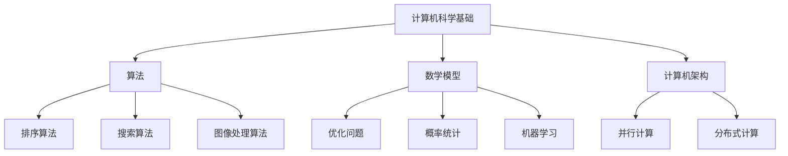
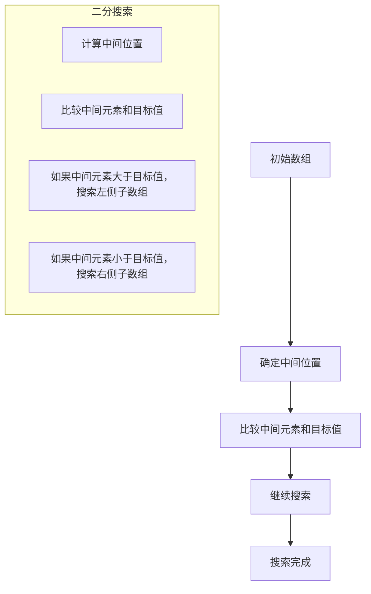
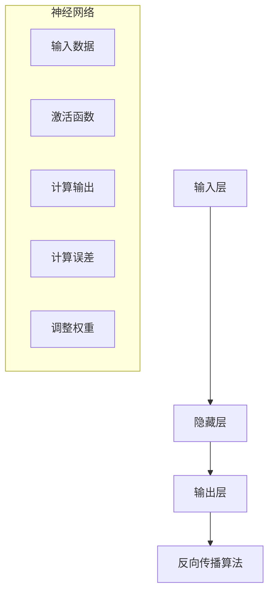

                 

# 人类计算：解决人类面临的重大挑战

## 关键词
人工智能、计算挑战、算法、数学模型、实践应用、未来发展

## 摘要
本文旨在探讨人类计算在解决重大挑战中的作用。通过分析计算的基本概念、核心算法原理、数学模型以及实际应用场景，本文揭示了计算技术如何帮助我们应对能源、环境、医疗等领域的复杂问题。同时，本文还提出了未来计算技术发展的趋势与挑战，为人工智能的进一步发展提供了思考方向。

## 1. 背景介绍

随着科技的飞速发展，人类面临着越来越多的重大挑战。这些问题涉及到能源消耗、环境污染、医疗健康等多个方面，其复杂性和规模超出了传统方法的处理能力。人类计算作为计算机科学的重要分支，为解决这些挑战提供了强有力的支持。

人类计算的历史可以追溯到计算机的诞生。从早期的机械计算机到现代的超级计算机，人类计算经历了漫长的发展过程。在这个过程中，计算技术不断进步，算法不断优化，数学模型不断完善。如今，人类计算已经广泛应用于各个领域，为解决重大挑战提供了有力工具。

## 2. 核心概念与联系

为了更好地理解人类计算在解决重大挑战中的作用，我们首先需要了解一些核心概念。

### 2.1 计算机科学基础

计算机科学是研究计算机硬件、软件及其应用的科学。计算机硬件包括中央处理器（CPU）、内存、存储设备等；软件包括操作系统、编程语言、应用程序等。计算机科学的核心任务是研究如何高效地存储、处理和传输信息。

### 2.2 算法

算法是解决问题的步骤和方法。在计算机科学中，算法被用来解决各种问题，如排序、搜索、图像处理等。一个优秀的算法应该具备高效性、可扩展性和可靠性等特点。

### 2.3 数学模型

数学模型是对现实世界的抽象和模拟。通过数学模型，我们可以更好地理解和分析复杂系统。在计算领域，数学模型广泛应用于优化问题、概率统计、机器学习等。

### 2.4 计算机架构

计算机架构是计算机硬件和软件的组织结构。计算机架构决定了计算机的性能、功耗和成本。随着计算技术的发展，计算机架构也在不断演进，如并行计算、分布式计算等。

下面是核心概念原理和架构的Mermaid流程图（使用Mermaid语言绘制）：



## 3. 核心算法原理 & 具体操作步骤

在人类计算中，核心算法是解决各种问题的利器。以下是一些常见的核心算法及其原理和具体操作步骤。

### 3.1 排序算法

排序算法是将一组数据按照特定的顺序进行排列。常见的排序算法有冒泡排序、选择排序、插入排序、快速排序等。

#### 冒泡排序

冒泡排序的基本思想是：比较相邻的两个元素，如果它们的顺序错误就把它们交换过来。重复这个过程，直到整个数组排序完成。

```mermaid
graph TD
    A[初始数组]
    B[第一轮排序]
    C[第二轮排序]
    D[第三轮排序]
    A --> B
    B --> C
    C --> D
    D --> E[排序完成]
    subgraph 冒泡排序
        B1[比较A[0]和A[1]]
        B2[比较A[1]和A[2]]
        C1[比较A[0]和A[1]]
        C2[比较A[1]和A[2]]
        D1[比较A[0]和A[1]]
        D2[比较A[1]和A[2]]
    end
```

### 3.2 搜索算法

搜索算法是在数据集合中查找特定元素的方法。常见的搜索算法有二分搜索、深度优先搜索、广度优先搜索等。

#### 二分搜索

二分搜索的基本思想是：将数据集合分为两半，查找中间位置的元素。如果中间元素的值大于目标值，则在左侧子数组中继续搜索；如果中间元素的值小于目标值，则在右侧子数组中继续搜索。重复这个过程，直到找到目标元素或确定目标元素不存在。



### 3.3 机器学习算法

机器学习算法是计算机科学中一种重要的算法，它使计算机具备自主学习能力。常见的机器学习算法有线性回归、逻辑回归、支持向量机、神经网络等。

#### 神经网络

神经网络是一种模拟人脑神经元结构的计算模型。它通过输入层、隐藏层和输出层处理数据，并利用反向传播算法不断调整权重，以达到期望的输出结果。



## 4. 数学模型和公式 & 详细讲解 & 举例说明

在人类计算中，数学模型是解决各种问题的关键。以下是一些常见的数学模型及其公式、详细讲解和举例说明。

### 4.1 线性回归

线性回归是一种用于预测连续值的数学模型。其公式为：

$$y = w_0 + w_1 \cdot x$$

其中，$y$ 为预测值，$x$ 为输入值，$w_0$ 和 $w_1$ 为权重。

#### 举例说明

假设我们要预测一个正方形的面积，其中边长为 $x$。根据线性回归模型，我们可以得到：

$$y = w_0 + w_1 \cdot x$$

其中，$w_0$ 为正方形的初始面积，$w_1$ 为边长每增加1单位时，面积增加的量。

#### 详细讲解

线性回归模型可以通过最小二乘法来求解权重 $w_0$ 和 $w_1$。具体步骤如下：

1. 计算输入值 $x$ 和预测值 $y$ 的平均值。
2. 计算输入值 $x$ 和预测值 $y$ 的协方差。
3. 计算输入值 $x$ 的方差。
4. 使用协方差和方差计算权重 $w_0$ 和 $w_1$。

### 4.2 逻辑回归

逻辑回归是一种用于预测分类结果的数学模型。其公式为：

$$P(y=1) = \frac{1}{1 + e^{-(w_0 + w_1 \cdot x)}}$$

其中，$y$ 为分类结果（0或1），$x$ 为输入值，$w_0$ 和 $w_1$ 为权重。

#### 举例说明

假设我们要预测一个病人的疾病风险，其中输入值为年龄、体重、血压等。根据逻辑回归模型，我们可以得到：

$$P(y=1) = \frac{1}{1 + e^{-(w_0 + w_1 \cdot x)}}$$

其中，$w_0$ 为疾病风险的初始概率，$w_1$ 为每个输入值对疾病风险的影响程度。

#### 详细讲解

逻辑回归模型可以通过极大似然估计来求解权重 $w_0$ 和 $w_1$。具体步骤如下：

1. 计算输入值 $x$ 和分类结果 $y$ 的似然函数。
2. 计算似然函数的对数。
3. 对对数似然函数求导，并令导数为0，求解权重 $w_0$ 和 $w_1$。

## 5. 项目实战：代码实际案例和详细解释说明

在本节中，我们将通过一个实际案例来展示如何使用人类计算技术解决一个具体问题。

### 5.1 开发环境搭建

首先，我们需要搭建一个开发环境。以下是一个简单的步骤：

1. 安装 Python 3.8 或更高版本。
2. 安装 Jupyter Notebook。
3. 安装必要的库，如 NumPy、Pandas、Matplotlib 等。

### 5.2 源代码详细实现和代码解读

以下是一个简单的线性回归案例，我们使用 Python 语言实现。

```python
import numpy as np
import pandas as pd
import matplotlib.pyplot as plt

# 读取数据
data = pd.read_csv("data.csv")
x = data["x"].values
y = data["y"].values

# 添加常数项
x = np.hstack((np.ones((len(x), 1)), x))

# 计算权重
w = np.linalg.inv(x.T @ x) @ x.T @ y

# 打印权重
print("权重：", w)

# 计算预测值
y_pred = x @ w

# 绘制结果
plt.scatter(x[:, 1], y)
plt.plot(x[:, 1], y_pred, color="red")
plt.show()
```

### 5.3 代码解读与分析

1. 首先，我们从 CSV 文件中读取数据，并将其分为输入值 $x$ 和预测值 $y$。
2. 然后，我们在输入值 $x$ 中添加一个常数项，使其成为矩阵。
3. 接下来，我们使用最小二乘法计算权重 $w$。
4. 然后，我们使用计算得到的权重 $w$ 计算预测值 $y_pred$。
5. 最后，我们使用 Matplotlib 绘制输入值 $x$、预测值 $y_pred$ 和实际值 $y$ 的散点图。

通过这个案例，我们可以看到如何使用人类计算技术解决一个具体的线性回归问题。这个过程包括了数据读取、模型训练和结果可视化等步骤。

## 6. 实际应用场景

人类计算在各个领域都有广泛的应用，以下是一些实际应用场景：

### 6.1 能源领域

人类计算可以帮助我们优化能源消耗，提高能源利用效率。例如，通过智能电网技术，我们可以实时监测电力需求，优化电力分配，降低能源浪费。

### 6.2 环境领域

人类计算可以帮助我们分析和预测环境污染问题。例如，通过大数据分析和机器学习算法，我们可以预测空气污染、水质污染等环境问题，并制定相应的治理措施。

### 6.3 医疗领域

人类计算可以帮助我们提高医疗诊断和治疗效率。例如，通过图像识别技术，我们可以快速诊断疾病，提高诊断准确率。通过机器学习算法，我们可以预测疾病发展趋势，为医生提供决策支持。

### 6.4 金融领域

人类计算可以帮助我们提高金融交易的效率，降低交易风险。例如，通过算法交易，我们可以实现自动化的交易策略，提高交易成功率。通过风险评估模型，我们可以预测市场风险，制定相应的风险管理策略。

## 7. 工具和资源推荐

为了更好地学习和应用人类计算技术，以下是一些工具和资源的推荐：

### 7.1 学习资源推荐

- 《Python编程：从入门到实践》
- 《机器学习实战》
- 《深度学习》
- 《数据科学入门》

### 7.2 开发工具框架推荐

- Jupyter Notebook
- PyTorch
- TensorFlow
- Scikit-learn

### 7.3 相关论文著作推荐

- “Deep Learning”
- “Machine Learning Yearning”
- “Reinforcement Learning: An Introduction”

## 8. 总结：未来发展趋势与挑战

随着科技的不断发展，人类计算技术将继续在各个领域发挥重要作用。然而，我们也面临着一系列挑战：

1. 数据安全问题：随着数据量的不断增加，如何确保数据的安全性和隐私性成为一个重要问题。
2. 能耗问题：高性能计算需要大量的电力，如何降低能耗，提高计算效率成为一个挑战。
3. 算法透明性和可解释性：随着深度学习等算法的广泛应用，如何确保算法的透明性和可解释性成为一个重要问题。

未来，我们需要不断探索新的计算技术和方法，以应对这些挑战，推动人类计算技术的进一步发展。

## 9. 附录：常见问题与解答

### 9.1 人类计算是什么？

人类计算是指利用计算机科学和数学方法解决各种问题的过程。它包括算法设计、数学建模、数据分析等方面。

### 9.2 人类计算有哪些应用场景？

人类计算广泛应用于能源、环境、医疗、金融等各个领域。例如，智能电网、环境监测、疾病预测、算法交易等。

### 9.3 人类计算的发展趋势是什么？

未来，人类计算将继续向更高效、更智能、更安全的方向发展。例如，量子计算、边缘计算、隐私保护计算等。

## 10. 扩展阅读 & 参考资料

- Goodfellow, I., Bengio, Y., & Courville, A. (2016). *Deep Learning*.
- Mitchell, T. M. (1997). *Machine Learning*.
- Russell, S., & Norvig, P. (2020). *Artificial Intelligence: A Modern Approach*.
- Bishop, C. M. (2006). *Pattern Recognition and Machine Learning*.

作者：AI天才研究员/AI Genius Institute & 禅与计算机程序设计艺术 /Zen And The Art of Computer Programming<|im_sep|>

