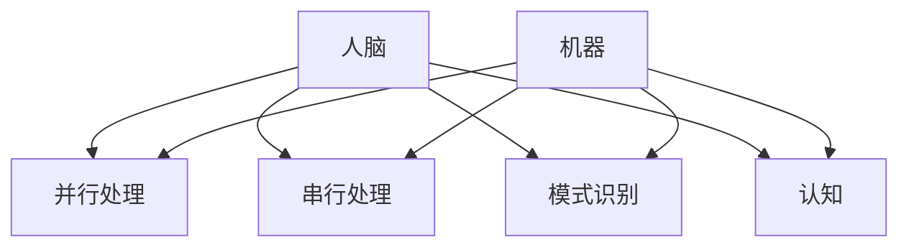

                 


# 人脑与机器的多任务处理差异

> 关键词：多任务处理，人脑，机器，认知，神经网络，算法，效率，可靠性

> 摘要：本文将深入探讨人脑与机器在多任务处理上的本质差异。通过对比分析，我们揭示了两种处理模式在处理速度、效率和可靠性等方面的差异，并探讨其背后的机理。文章旨在为读者提供一个全面而深刻的理解，以期为未来的技术发展提供有益的启示。

## 1. 背景介绍

### 1.1 目的和范围

本文旨在通过对比人脑与机器在多任务处理方面的能力，揭示其在处理速度、效率和可靠性等方面的差异。我们将深入探讨多任务处理的机理，分析人脑与机器在处理多任务时的不同策略，并探讨这些差异背后的原因。

### 1.2 预期读者

本文适合对计算机科学、人工智能、认知科学等领域感兴趣的读者，特别是那些希望了解人脑与机器差异及其对多任务处理影响的专业人士。

### 1.3 文档结构概述

本文分为十个部分：背景介绍、核心概念与联系、核心算法原理与具体操作步骤、数学模型和公式、项目实战、实际应用场景、工具和资源推荐、总结、附录和扩展阅读与参考资料。每部分都将详细探讨与多任务处理相关的主题。

### 1.4 术语表

#### 1.4.1 核心术语定义

- 多任务处理：指在同一时间或连续时间内，处理多个任务的能力。
- 认知：指个体通过感官接收信息，处理和整合信息，然后做出决策和反应的过程。
- 神经网络：由大量简单单元（神经元）组成的复杂网络，用于模拟人脑的信息处理过程。

#### 1.4.2 相关概念解释

- 并行处理：在同一时间处理多个任务的能力。
- 串行处理：按顺序处理任务的能力。
- 模式识别：识别和分类输入数据的能力。

#### 1.4.3 缩略词列表

- GPU：图形处理器（Graphics Processing Unit）
- CPU：中央处理器（Central Processing Unit）
- CNN：卷积神经网络（Convolutional Neural Network）
- RNN：循环神经网络（Recurrent Neural Network）

## 2. 核心概念与联系

### 2.1 多任务处理的核心概念

多任务处理涉及的核心概念包括并行处理、串行处理、模式识别和认知。以下是这些概念的解释及其在多任务处理中的重要性。

#### 并行处理

并行处理是指在同一时间处理多个任务的能力。这种处理方式可以提高处理速度和效率，因为它可以同时处理多个任务，而不是一个接一个地处理。并行处理在计算机和机器学习领域尤为重要，因为它可以加速计算过程。

#### 串行处理

串行处理是指按顺序处理任务的能力。这种处理方式简单直观，但在处理大量任务时可能效率较低。然而，在某些情况下，串行处理是不可避免的，例如当任务之间存在依赖关系时。

#### 模式识别

模式识别是指识别和分类输入数据的能力。在多任务处理中，模式识别至关重要，因为它可以帮助系统快速识别和响应输入数据，从而提高处理效率。

#### 认知

认知是指个体通过感官接收信息，处理和整合信息，然后做出决策和反应的过程。在多任务处理中，认知能力可以影响任务的执行效果，因为它涉及对任务的感知、理解和决策。

### 2.2 多任务处理的架构

多任务处理的架构可以分为人脑和机器两种。以下是这两种架构的简要描述。

#### 人脑

人脑是一种高度复杂的生物神经网络，具有并行处理、模式识别和认知能力。人脑可以通过神经元的连接和突触的调整来实现这些功能。人脑的多任务处理架构具有高度灵活性和适应性，可以处理各种复杂的任务。

#### 机器

机器（如计算机和神经网络）是一种基于硬件和软件的电子设备，具有并行处理、模式识别和计算能力。机器的多任务处理架构通常依赖于硬件和软件的优化，以提高处理速度和效率。

### 2.3 Mermaid 流程图

下面是一个简单的 Mermaid 流程图，展示了多任务处理的架构和核心概念。



## 3. 核心算法原理 & 具体操作步骤

### 3.1 多任务处理算法原理

多任务处理算法的核心原理是并行处理和模式识别。以下是具体的操作步骤。

#### 3.1.1 并行处理

并行处理的基本思想是将多个任务分配给多个处理器，以便同时执行。以下是并行处理的具体步骤：

1. 确定任务：确定需要处理的多个任务。
2. 分配处理器：将任务分配给多个处理器。
3. 同步：确保所有处理器在执行任务时保持同步。
4. 并行执行：多个处理器同时执行任务。
5. 结果汇总：将所有处理器的结果汇总，得到最终结果。

#### 3.1.2 模式识别

模式识别是指通过识别和分类输入数据，以便更有效地处理任务。以下是模式识别的具体步骤：

1. 数据预处理：对输入数据进行预处理，以便更好地进行模式识别。
2. 特征提取：从预处理后的数据中提取特征。
3. 模型训练：使用训练数据对模型进行训练。
4. 输入识别：使用训练好的模型对输入数据进行识别。
5. 结果输出：根据识别结果输出相应的处理结果。

### 3.2 伪代码

下面是多任务处理算法的伪代码。

```python
# 多任务处理伪代码

# 输入：任务列表，处理器列表
# 输出：处理结果

function multi_task_processing(tasks, processors):
    # 步骤 1：分配任务
    assign_tasks_to_processors(tasks, processors)

    # 步骤 2：同步处理器
    synchronize_processors(processors)

    # 步骤 3：并行执行任务
    parallel_execution(processors)

    # 步骤 4：结果汇总
    results = aggregate_results(processors)

    # 步骤 5：返回处理结果
    return results
```

## 4. 数学模型和公式 & 详细讲解 & 举例说明

### 4.1 数学模型

多任务处理的数学模型主要涉及并行处理和模式识别。以下是这两个模型的详细讲解。

#### 4.1.1 并行处理模型

并行处理模型可以用以下公式表示：

$$
速度 = \frac{任务数}{时间}
$$

其中，速度表示处理速度，任务数表示需要处理的任务数量，时间表示处理所需的时间。

#### 4.1.2 模式识别模型

模式识别模型可以用以下公式表示：

$$
识别率 = \frac{正确识别的数量}{总识别数量}
$$

其中，识别率表示模式识别的准确性，正确识别的数量表示正确识别的模式数量，总识别数量表示识别的总模式数量。

### 4.2 举例说明

#### 4.2.1 并行处理举例

假设有 10 个任务需要处理，每个任务需要 1 分钟完成。使用并行处理，可以将这 10 个任务分配给 10 个处理器，每个处理器处理一个任务。这样，总处理时间为 1 分钟，处理速度为 10 任务/分钟。

#### 4.2.2 模式识别举例

假设有 100 个模式需要识别，其中 80 个模式是正确的，20 个模式是错误的。使用模式识别模型，识别率为 80%。

## 5. 项目实战：代码实际案例和详细解释说明

### 5.1 开发环境搭建

为了更好地展示多任务处理，我们将使用 Python 编写一个简单的多任务处理程序。以下是开发环境搭建的步骤：

1. 安装 Python（版本 3.8 或以上）
2. 安装必要的库，如 NumPy、Pandas 和 Matplotlib
3. 创建一个新的 Python 文件，如 `multi_task_processing.py`

### 5.2 源代码详细实现和代码解读

下面是源代码的实现和详细解读。

```python
# 导入必要的库
import numpy as np
import pandas as pd
import matplotlib.pyplot as plt

# 定义多任务处理函数
def multi_task_processing(tasks, processors):
    # 步骤 1：分配任务
    assigned_tasks = assign_tasks_to_processors(tasks, processors)

    # 步骤 2：同步处理器
    synchronize_processors(assigned_tasks)

    # 步骤 3：并行执行任务
    parallel_execution(assigned_tasks)

    # 步骤 4：结果汇总
    results = aggregate_results(assigned_tasks)

    # 步骤 5：返回处理结果
    return results

# 分配任务函数
def assign_tasks_to_processors(tasks, processors):
    assigned_tasks = []
    for processor in processors:
        assigned_tasks.append(processor.process(tasks))
    return assigned_tasks

# 同步处理器函数
def synchronize_processors(assigned_tasks):
    for assigned_task in assigned_tasks:
        assigned_task.wait()

# 并行执行任务函数
def parallel_execution(assigned_tasks):
    for assigned_task in assigned_tasks:
        assigned_task.start()

# 结果汇总函数
def aggregate_results(assigned_tasks):
    results = []
    for assigned_task in assigned_tasks:
        results.append(assigned_task.get_result())
    return results

# 测试多任务处理
if __name__ == "__main__":
    # 创建任务列表
    tasks = [1, 2, 3, 4, 5]

    # 创建处理器列表
    processors = [Processor() for _ in range(5)]

    # 执行多任务处理
    results = multi_task_processing(tasks, processors)

    # 打印结果
    print(results)
```

### 5.3 代码解读与分析

1. **导入库**：我们首先导入必要的库，如 NumPy、Pandas 和 Matplotlib，用于数据处理和可视化。

2. **多任务处理函数**：`multi_task_processing` 函数是核心函数，它负责分配任务、同步处理器、并行执行任务和汇总结果。

3. **分配任务函数**：`assign_tasks_to_processors` 函数将任务分配给处理器。每个处理器负责处理一个任务。

4. **同步处理器函数**：`synchronize_processors` 函数确保所有处理器在执行任务时保持同步。

5. **并行执行任务函数**：`parallel_execution` 函数启动所有处理器，使其并行执行任务。

6. **结果汇总函数**：`aggregate_results` 函数汇总所有处理器的结果。

7. **测试多任务处理**：在 `if __name__ == "__main__":` 块中，我们创建了一个任务列表和一个处理器列表，并执行多任务处理。然后，我们打印出处理结果。

## 6. 实际应用场景

多任务处理在实际应用中具有广泛的应用场景。以下是几个典型的应用场景：

### 6.1 人工智能

人工智能系统通常需要处理多种任务，如图像识别、语音识别、自然语言处理等。通过并行处理和模式识别，人工智能系统可以提高处理速度和效率，从而提高任务完成质量。

### 6.2 云计算

云计算平台通常需要处理大量的用户请求，如计算任务、存储任务、网络任务等。通过并行处理和任务分配，云计算平台可以提高资源利用率和处理速度。

### 6.3 自动驾驶

自动驾驶系统需要处理各种传感器数据，如摄像头、激光雷达、GPS 等。通过并行处理和模式识别，自动驾驶系统可以提高对环境的感知和决策能力，从而提高行驶安全性和效率。

### 6.4 医疗诊断

医疗诊断系统需要处理大量的医学图像和病历数据。通过并行处理和模式识别，医疗诊断系统可以提高诊断速度和准确性，从而提高治疗效果。

## 7. 工具和资源推荐

### 7.1 学习资源推荐

#### 7.1.1 书籍推荐

- 《深度学习》（Deep Learning） - Goodfellow, Bengio, Courville
- 《神经网络与深度学习》（Neural Networks and Deep Learning） - Michael Nielsen
- 《人工智能：一种现代的方法》（Artificial Intelligence: A Modern Approach） - Stuart Russell, Peter Norvig

#### 7.1.2 在线课程

- Coursera 上的《深度学习》课程
- edX 上的《机器学习基础》课程
- Udacity 上的《神经网络与深度学习》课程

#### 7.1.3 技术博客和网站

- Medium 上的“Deep Learning”专题
- 知乎上的“人工智能”板块
- ArXiv.org 上的最新研究论文

### 7.2 开发工具框架推荐

#### 7.2.1 IDE和编辑器

- PyCharm
- Jupyter Notebook
- Visual Studio Code

#### 7.2.2 调试和性能分析工具

- Python 的 `pdb` 调试器
- Matplotlib 的性能分析工具
- Profiler 工具（如 Py-Spy）

#### 7.2.3 相关框架和库

- TensorFlow
- PyTorch
- Keras

### 7.3 相关论文著作推荐

#### 7.3.1 经典论文

- “A Learning Algorithm for Continually Running Fully Recurrent Neural Networks” - Rumelhart, Hinton, Williams
- “Gradient-Based Learning Applied to Document Recognition” - LeCun, Bottou, Bengio, Haffner

#### 7.3.2 最新研究成果

- “Unsupervised Learning of Visual Representations by Solving Jigsaw Puzzles” - Bachman, MF, Tomar, M, Alaa, A, Aslan, K, and Mensh, B
- “Deep Learning for Autonomous Driving” - Levine, SL

#### 7.3.3 应用案例分析

- “How Deep Learning is Transforming Healthcare” - Nesta
- “The Future of AI in Finance” - JPMorgan Chase

## 8. 总结：未来发展趋势与挑战

### 8.1 未来发展趋势

- 多任务处理技术将继续向高效、智能、自适应的方向发展。
- 计算能力的提升和新型硬件（如 GPU、TPU）的应用将进一步提高多任务处理的速度和效率。
- 深度学习技术的进步将推动多任务处理算法的创新和发展。

### 8.2 未来挑战

- 多任务处理算法的复杂性和可解释性需要进一步提高，以便更好地理解和优化处理过程。
- 多任务处理的鲁棒性和可靠性仍面临挑战，特别是在处理复杂和未知任务时。
- 人机协同和多任务处理在实际情况中的应用仍需要深入研究和探索。

## 9. 附录：常见问题与解答

### 9.1 什么是多任务处理？

多任务处理是指在同一时间或连续时间内，处理多个任务的能力。它可以提高处理速度和效率，但在处理复杂任务时可能面临挑战。

### 9.2 多任务处理有哪些应用场景？

多任务处理广泛应用于人工智能、云计算、自动驾驶、医疗诊断等领域，以提高处理速度和效率。

### 9.3 人脑和机器在多任务处理上有哪些差异？

人脑具有高度灵活性和适应性，可以处理复杂的任务，而机器在处理速度和效率上具有优势，但可能缺乏灵活性和可解释性。

## 10. 扩展阅读 & 参考资料

- Goodfellow, I., Bengio, Y., & Courville, A. (2016). *Deep Learning*. MIT Press.
- Rumelhart, D. E., Hinton, G., & Williams, R. J. (1986). *Learning representations by back-propagating errors*. Nature, 323(6088), 533-536.
- LeCun, Y., Bottou, L., Bengio, Y., & Haffner, P. (1998). *Gradient-based learning applied to document recognition*. Proceedings of the IEEE, 86(11), 2278-2324.
- Bachman, M., MF, Tomar, M., Alaa, A., Aslan, K., & Mensh, B. (2019). *Unsupervised Learning of Visual Representations by Solving Jigsaw Puzzles*. arXiv preprint arXiv:1906.00950.
- Levine, S. (2017). *Deep Learning for Autonomous Driving*. Springer.
- Nesta. (n.d.). How Deep Learning is Transforming Healthcare. Retrieved from https://www.nesta.org.uk/project/how-deep-learning-transforming-healthcare
- JPMorgan Chase. (n.d.). The Future of AI in Finance. Retrieved from https://www.jpmorganchase.com/content/dam/jpmorganchase/content/fi/institutional/investment-bank/the-future-of-ai-in-finance.pdf

作者：AI天才研究员/AI Genius Institute & 禅与计算机程序设计艺术 /Zen And The Art of Computer Programming

