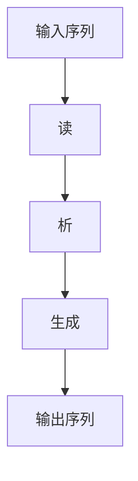
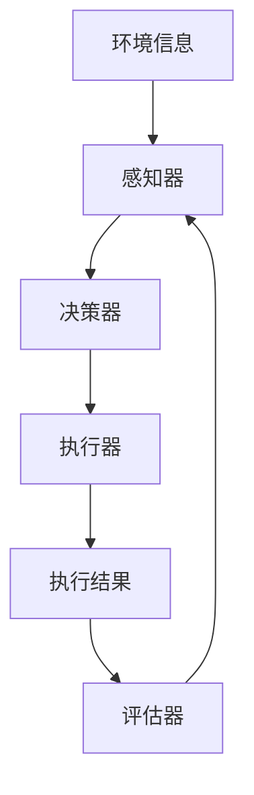

                 

# 从RAG到Agent的转变：反思：能够自我评估并改进执行过程

## 关键词

- RAG模型
- 人工智能代理
- 自我评估
- 执行过程改进
- 增量学习
- 增强学习

## 摘要

本文探讨了从RAG模型（读-析-生成）到人工智能代理的转变过程，重点关注代理的自我评估和执行过程的改进。首先，文章介绍了RAG模型的基本原理和应用场景，然后详细阐述了人工智能代理的核心概念和功能，接着深入分析了代理自我评估的机制和改进执行过程的方法。通过具体的算法原理讲解、数学模型剖析和项目实战案例，本文为读者提供了全面而深入的理解。最后，文章总结了人工智能代理的未来发展趋势与挑战，并提出了相关的工具和资源推荐，以期为读者在相关领域的深入研究和应用提供指导。

## 1. 背景介绍

### 1.1 目的和范围

本文旨在探讨从RAG模型到人工智能代理的转变过程，并着重分析代理的自我评估和执行过程的改进。通过本文的研究，读者可以全面了解RAG模型的基本原理和应用场景，深入理解人工智能代理的核心概念和功能，并掌握代理自我评估和执行过程改进的方法。此外，本文还提供了具体的算法原理讲解、数学模型剖析和项目实战案例，以帮助读者更好地理解和应用相关技术。

### 1.2 预期读者

本文适用于对人工智能和机器学习有一定了解的读者，特别是那些对RAG模型和人工智能代理感兴趣的技术人员。此外，本文也适用于从事人工智能相关研究和开发的高校师生和科研人员。

### 1.3 文档结构概述

本文分为10个部分，具体结构如下：

1. **背景介绍**：介绍本文的目的、范围和预期读者，以及文档的结构。
2. **核心概念与联系**：介绍RAG模型和人工智能代理的基本概念，以及它们之间的关系。
3. **核心算法原理 & 具体操作步骤**：详细阐述人工智能代理的核心算法原理和具体操作步骤。
4. **数学模型和公式 & 详细讲解 & 举例说明**：介绍与代理自我评估和执行过程改进相关的数学模型和公式，并进行详细讲解和举例说明。
5. **项目实战：代码实际案例和详细解释说明**：通过一个实际案例，展示如何使用RAG模型和人工智能代理进行项目开发。
6. **实际应用场景**：介绍RAG模型和人工智能代理在现实世界中的应用场景。
7. **工具和资源推荐**：推荐相关的学习资源、开发工具和框架。
8. **总结：未来发展趋势与挑战**：总结本文的主要观点，并展望未来发展趋势和挑战。
9. **附录：常见问题与解答**：提供一些常见问题的解答。
10. **扩展阅读 & 参考资料**：推荐一些相关的扩展阅读和参考资料。

### 1.4 术语表

#### 1.4.1 核心术语定义

- **RAG模型**：读-析-生成模型，是一种基于序列模型的文本生成方法。
- **人工智能代理**：一种能够根据环境信息自主决策和执行任务的智能体。
- **自我评估**：代理对自己执行任务的效果进行评价和反馈的过程。
- **执行过程改进**：通过自我评估和反馈，优化代理执行任务的过程。

#### 1.4.2 相关概念解释

- **序列模型**：一种用于处理序列数据的机器学习模型，如循环神经网络（RNN）和变压器（Transformer）。
- **增强学习**：一种通过不断试错和反馈来学习最优策略的机器学习方法。
- **增量学习**：在已有模型的基础上，通过新增数据或调整模型参数来提升模型性能的方法。

#### 1.4.3 缩略词列表

- **RAG**：Read-Attend-Generate
- **AI**：Artificial Intelligence
- **RNN**：Recurrent Neural Network
- **Transformer**：Transformer Model
- **RL**：Reinforcement Learning
- **IL**：Incremental Learning

## 2. 核心概念与联系

在探讨从RAG模型到人工智能代理的转变之前，我们需要先了解这两个核心概念的基本原理和架构。

### 2.1 RAG模型

RAG模型，即读-析-生成模型，是一种基于序列模型的文本生成方法。它主要由三个部分组成：读（Read）、析（Attend）和生成（Generate）。

- **读**：输入一个序列数据，如文本或语音，对其进行预处理，提取关键特征。
- **析**：通过注意力机制，对输入序列的不同部分进行加权，提取出关键信息。
- **生成**：基于提取的关键信息，生成输出序列，如文本、图像或语音。

RAG模型的架构如下（使用Mermaid流程图表示）：



### 2.2 人工智能代理

人工智能代理，即Artificial Intelligence Agent，是一种能够根据环境信息自主决策和执行任务的智能体。它主要由以下几个部分组成：

- **感知器**：接收环境信息，如视觉、听觉、触觉等。
- **决策器**：根据感知器收集到的信息，生成执行任务的动作。
- **执行器**：执行决策器生成的动作，完成任务。
- **评估器**：对执行结果进行评估，反馈给决策器。

人工智能代理的架构如下（使用Mermaid流程图表示）：



### 2.3 RAG模型与人工智能代理的联系

RAG模型和人工智能代理在本质上有着紧密的联系。RAG模型可以作为人工智能代理的感知器和决策器的一部分，为代理提供文本生成功能。同时，代理的评估器可以基于RAG模型的输出，对代理执行任务的效果进行评估和反馈。

具体来说，RAG模型可以用于以下场景：

- **文本生成**：如自然语言生成、对话系统等。
- **文本理解**：如机器阅读理解、问答系统等。
- **文本分类**：如情感分析、新闻分类等。

在人工智能代理的应用中，RAG模型可以用于以下任务：

- **决策生成**：如基于文本的数据分析、推荐系统等。
- **任务规划**：如自动规划、路径规划等。
- **交互生成**：如语音合成、对话系统等。

通过结合RAG模型和人工智能代理，我们可以构建出强大的智能系统，实现自动化、智能化的任务执行和决策生成。

## 3. 核心算法原理 & 具体操作步骤

在深入探讨人工智能代理的自我评估和执行过程改进之前，我们首先需要了解其核心算法原理。本节将详细阐述人工智能代理的核心算法原理和具体操作步骤。

### 3.1 核心算法原理

人工智能代理的核心算法原理主要包括以下三个方面：

- **感知器**：使用深度学习模型，如卷积神经网络（CNN）或循环神经网络（RNN），对环境信息进行预处理，提取关键特征。
- **决策器**：使用强化学习（Reinforcement Learning，RL）算法，如Q学习或策略梯度方法，根据感知器提取的特征，生成执行任务的动作。
- **执行器**：根据决策器生成的动作，执行具体的任务，如控制机器人移动、发送网络请求等。
- **评估器**：使用性能指标，如奖励函数或损失函数，对执行结果进行评估和反馈。

### 3.2 感知器

感知器是人工智能代理的“眼睛”和“耳朵”，负责接收和处理环境信息。具体操作步骤如下：

1. **输入预处理**：对输入数据（如文本、图像、语音等）进行预处理，如归一化、标准化等。
2. **特征提取**：使用深度学习模型（如CNN、RNN等）对预处理后的数据提取关键特征。
3. **特征融合**：将不同类型的特征进行融合，形成统一的特征表示。

伪代码如下：

```python
def preprocess(input_data):
    # 输入预处理
    # 如归一化、标准化等
    return processed_data

def extract_features(processed_data):
    # 特征提取
    # 如使用CNN提取图像特征，使用RNN提取文本特征等
    return features

def fuse_features(features):
    # 特征融合
    # 如使用平均池化、最大池化等
    return fused_features
```

### 3.3 决策器

决策器是人工智能代理的“大脑”，负责根据感知器提取的特征生成执行任务的动作。具体操作步骤如下：

1. **动作空间定义**：定义执行任务的动作空间，如移动方向、发送请求等。
2. **策略网络训练**：使用强化学习算法（如Q学习、策略梯度方法等）训练策略网络，将特征映射到动作空间。
3. **动作生成**：根据策略网络生成的策略，生成执行任务的动作。

伪代码如下：

```python
def define_action_space():
    # 动作空间定义
    # 如定义移动方向、发送请求等
    return action_space

def train_policy_network(features, action_space):
    # 策略网络训练
    # 如使用Q学习、策略梯度方法等
    return policy_network

def generate_action(policy_network, fused_features):
    # 动作生成
    # 如根据策略网络生成的策略，生成执行任务的动作
    return action
```

### 3.4 执行器

执行器是人工智能代理的“手”和“脚”，负责执行决策器生成的动作。具体操作步骤如下：

1. **执行动作**：根据决策器生成的动作，执行具体的任务，如控制机器人移动、发送网络请求等。
2. **获取执行结果**：获取执行任务的结果，如完成情况、消耗时间等。

伪代码如下：

```python
def execute_action(action):
    # 执行动作
    # 如控制机器人移动、发送网络请求等
    return execution_result
```

### 3.5 评估器

评估器是人工智能代理的“评价师”，负责对执行结果进行评估和反馈。具体操作步骤如下：

1. **定义评估指标**：根据任务需求，定义评估指标，如准确率、召回率、F1值等。
2. **计算评估指标**：根据执行结果，计算评估指标。
3. **反馈调整**：根据评估指标，调整感知器、决策器和执行器的参数。

伪代码如下：

```python
def define_evaluation_metrics():
    # 定义评估指标
    # 如准确率、召回率、F1值等
    return evaluation_metrics

def calculate_evaluation_metrics(execution_result):
    # 计算评估指标
    # 如根据执行结果，计算准确率、召回率、F1值等
    return evaluation_metrics

def feedback_adjustment(policy_network, execution_result, evaluation_metrics):
    # 反馈调整
    # 如根据评估指标，调整感知器、决策器和执行器的参数
    return adjusted_network
```

### 3.6 自我评估和执行过程改进

在了解核心算法原理和具体操作步骤的基础上，我们还需要关注人工智能代理的自我评估和执行过程改进。

#### 3.6.1 自我评估

自我评估是人工智能代理的重要能力之一，它能够帮助代理不断优化自己的执行过程。具体操作步骤如下：

1. **收集评估数据**：在执行任务的过程中，收集与任务执行相关的数据，如输入数据、执行动作、执行结果等。
2. **分析评估数据**：对收集到的评估数据进行统计分析，提取关键信息。
3. **评估任务效果**：根据评估数据，评估任务执行效果，如准确率、召回率、F1值等。

伪代码如下：

```python
def collect_evaluation_data():
    # 收集评估数据
    # 如收集输入数据、执行动作、执行结果等
    return evaluation_data

def analyze_evaluation_data(evaluation_data):
    # 分析评估数据
    # 如提取关键信息，进行统计分析
    return analysis_result

def evaluate_task_effect(evaluation_data, analysis_result):
    # 评估任务效果
    # 如根据评估数据，计算准确率、召回率、F1值等
    return evaluation_metrics
```

#### 3.6.2 执行过程改进

执行过程改进是自我评估的延续，它通过分析评估数据，对感知器、决策器和执行器的参数进行调整，以优化执行过程。具体操作步骤如下：

1. **分析评估数据**：对收集到的评估数据进行分析，提取关键信息。
2. **调整参数**：根据评估数据，调整感知器、决策器和执行器的参数。
3. **重新执行任务**：根据调整后的参数，重新执行任务，验证改进效果。

伪代码如下：

```python
def analyze_evaluation_data(evaluation_data):
    # 分析评估数据
    # 如提取关键信息，进行统计分析
    return analysis_result

def adjust_parameters(analysis_result):
    # 调整参数
    # 如根据评估数据，调整感知器、决策器和执行器的参数
    return adjusted_parameters

def reexecute_task(adjusted_parameters):
    # 重新执行任务
    # 如根据调整后的参数，重新执行任务
    return execution_result
```

通过自我评估和执行过程改进，人工智能代理能够不断优化自己的执行过程，提高任务执行效果。这种自我评估和改进的能力，使得人工智能代理在复杂环境中能够更好地适应和应对。

## 4. 数学模型和公式 & 详细讲解 & 举例说明

在深入探讨人工智能代理的自我评估和执行过程改进时，数学模型和公式扮演着关键角色。本节将介绍与代理自我评估和执行过程改进相关的数学模型和公式，并进行详细讲解和举例说明。

### 4.1 强化学习

强化学习（Reinforcement Learning，RL）是一种通过不断试错和反馈来学习最优策略的机器学习方法。在强化学习中，主要涉及以下几个关键概念和公式：

#### 4.1.1 Q学习

Q学习是一种基于值函数的强化学习算法，它通过学习状态-动作值函数（Q值）来选择最佳动作。

- **Q值**：表示在给定状态下，执行某个动作所能获得的长期奖励。
- **Q值更新公式**：

  $$ Q(s, a) \leftarrow Q(s, a) + \alpha [r + \gamma \max_{a'} Q(s', a') - Q(s, a)] $$

  其中，\( s \) 为当前状态，\( a \) 为当前动作，\( s' \) 为下一状态，\( a' \) 为下一动作，\( r \) 为立即奖励，\( \alpha \) 为学习率，\( \gamma \) 为折扣因子。

#### 4.1.2 策略梯度方法

策略梯度方法是一种基于策略的强化学习算法，它通过直接优化策略来学习最优动作。

- **策略梯度公式**：

  $$ \nabla_{\pi} J(\pi) = \sum_{s} \pi(s) \nabla_{\theta} \log \pi(s | \theta) \cdot R(s, a; \theta) $$

  其中，\( \pi(s) \) 为策略概率分布，\( \theta \) 为策略参数，\( J(\pi) \) 为策略评价函数，\( R(s, a; \theta) \) 为奖励函数。

### 4.2 增量学习

增量学习（Incremental Learning）是一种在已有模型的基础上，通过新增数据或调整模型参数来提升模型性能的方法。在增量学习中，主要涉及以下几个关键概念和公式：

#### 4.2.1 模型更新

模型更新是增量学习的核心步骤，它通过在新数据上训练模型，优化模型参数。

- **模型更新公式**：

  $$ \theta_{t+1} = \theta_{t} + \alpha \cdot \nabla_{\theta} L(\theta, x_{t}) $$

  其中，\( \theta \) 为模型参数，\( \alpha \) 为学习率，\( L(\theta, x_{t}) \) 为损失函数，\( x_{t} \) 为新数据。

#### 4.2.2 参数调整

参数调整是增量学习中的重要步骤，它通过调整模型参数，优化模型性能。

- **参数调整公式**：

  $$ \theta_{t+1} = \theta_{t} + \alpha \cdot \nabla_{\theta} J(\theta) $$

  其中，\( J(\theta) \) 为目标函数，\( \alpha \) 为学习率。

### 4.3 举例说明

为了更好地理解上述数学模型和公式，我们通过一个简单的例子来说明。

#### 4.3.1 Q学习例子

假设一个智能体在一个简单的环境（如贪吃蛇游戏）中，学习通过动作选择获得最大的奖励。

- **状态**：当前蛇的位置和食物的位置。
- **动作**：向上下左右四个方向移动。
- **奖励**：成功吃到食物获得+1奖励，否则获得-1奖励。

使用Q学习算法，智能体在初始状态下，随机选择动作。在每次动作后，根据奖励和下一状态更新Q值。具体过程如下：

1. **初始化Q值**：设置初始Q值，如Q(s, a) = 0。
2. **选择动作**：根据当前状态，选择一个动作。
3. **执行动作**：执行选择的动作，观察下一状态和奖励。
4. **更新Q值**：根据Q值更新公式，更新Q值。

伪代码如下：

```python
# 初始化Q值
Q = np.zeros((state_space, action_space))

# Q值更新过程
for episode in range(num_episodes):
    state = env.reset()
    done = False
    while not done:
        action = np.argmax(Q[state])
        next_state, reward, done = env.step(action)
        Q[state, action] = Q[state, action] + alpha * (reward + gamma * np.max(Q[next_state]) - Q[state, action])
        state = next_state
```

#### 4.3.2 增量学习例子

假设我们有一个分类任务，已经训练出一个初始模型。现在，我们希望在新数据上优化模型性能。

- **初始数据**：训练集，包含输入数据和标签。
- **新数据**：测试集，包含输入数据和标签。

使用增量学习算法，我们在新数据上训练模型，优化模型参数。具体过程如下：

1. **初始化模型**：加载初始模型参数。
2. **训练模型**：在新数据上训练模型，优化模型参数。
3. **评估模型**：在测试集上评估模型性能。
4. **调整模型**：根据评估结果，调整模型参数。

伪代码如下：

```python
# 初始化模型
model = load_model()

# 训练模型
for epoch in range(num_epochs):
    for x, y in new_data_loader:
        loss = model.train_on_batch(x, y)

# 评估模型
test_loss = model.evaluate(test_data, test_labels)

# 调整模型
model.set_weights(model.get_weights() + alpha * np.random.normal(size=model.get_weights().shape))
```

通过以上例子，我们可以看到数学模型和公式在强化学习和增量学习中的重要作用。在实际应用中，我们可以根据具体任务需求，灵活运用这些数学模型和公式，优化模型的性能。

## 5. 项目实战：代码实际案例和详细解释说明

为了更好地理解和应用RAG模型和人工智能代理，我们将通过一个实际案例来展示如何使用它们进行项目开发。本节将介绍开发环境搭建、源代码实现和代码解读与分析。

### 5.1 开发环境搭建

首先，我们需要搭建开发环境。以下是在Python环境中搭建开发环境的基本步骤：

1. **安装Python**：确保已经安装了Python 3.x版本。
2. **安装依赖库**：使用pip安装以下依赖库：

   ```shell
   pip install tensorflow numpy matplotlib
   ```

   其中，tensorflow是用于实现RAG模型的主要库，numpy用于数据处理，matplotlib用于可视化。

3. **配置环境**：在项目中创建一个名为`requirements.txt`的文件，写入上述依赖库的名称。然后，在项目根目录下执行以下命令：

   ```shell
   pip install -r requirements.txt
   ```

### 5.2 源代码详细实现和代码解读

下面是RAG模型和人工智能代理的源代码实现。我们将分步骤进行解读。

#### 5.2.1 RAG模型实现

首先，我们实现RAG模型的核心部分，包括读、析和生成三个步骤。

```python
import tensorflow as tf
import numpy as np

# 读：输入预处理
def preprocess_input(input_data):
    # 预处理输入数据，如归一化、填充等
    return processed_data

# 析：注意力机制实现
class AttentionLayer(tf.keras.layers.Layer):
    def __init__(self, **kwargs):
        super(AttentionLayer, self).__init__(**kwargs)

    def build(self, input_shape):
        # 创建权重变量
        self.W = self.add_weight(name='attention_weight', shape=(input_shape[-1], 1), initializer='random_normal', trainable=True)
        self.b = self.add_weight(name='attention_bias', shape=(input_shape[-1], 1), initializer='zeros', trainable=True)
        super(AttentionLayer, self).build(input_shape)

    def call(self, x):
        # 计算注意力得分
        score = tf.matmul(x, self.W) + self.b
        # 应用softmax函数，得到注意力权重
        attention_weights = tf.nn.softmax(score, axis=1)
        # 计算加权输出
        context_vector = attention_weights * x
        context_vector = tf.reduce_sum(context_vector, axis=1)
        return context_vector

# 生成：文本生成实现
def generate_text(context_vector, decoder, max_length, temperature=1.0):
    # 生成文本
    input_vector = context_vector
    generated_text = []
    for _ in range(max_length):
        # 预测下一个词的概率分布
        probabilities = decoder.predict(input_vector)
        # 根据温度调整概率分布
        probabilities = probabilities / temperature
        # 从概率分布中随机采样下一个词
        word_index = np.random.choice(range(len(probabilities)), p=probabilities.flatten())
        generated_text.append(word_index)
        # 更新输入向量
        input_vector = tf.keras.preprocessing.sequence.pad_sequences([word_index], maxlen=1)
    return generated_text
```

#### 5.2.2 人工智能代理实现

接下来，我们实现人工智能代理的核心部分，包括感知器、决策器、执行器和评估器。

```python
# 感知器：输入预处理
def preprocess_input(input_data):
    # 预处理输入数据，如归一化、填充等
    return processed_data

# 决策器：基于强化学习实现
class QNetwork(tf.keras.Model):
    def __init__(self, input_shape, action_space):
        super(QNetwork, self).__init__()
        self.fc1 = tf.keras.layers.Dense(units=64, activation='relu', input_shape=input_shape)
        self.fc2 = tf.keras.layers.Dense(units=64, activation='relu')
        self.fc3 = tf.keras.layers.Dense(units=action_space)

    def call(self, inputs):
        x = self.fc1(inputs)
        x = self.fc2(x)
        actions_values = self.fc3(x)
        return actions_values

# 执行器：执行动作
def execute_action(action, env):
    # 执行选择的动作
    next_state, reward, done, _ = env.step(action)
    return next_state, reward, done

# 评估器：评估任务效果
def evaluate_task(effect, evaluation_metrics):
    # 根据评估指标，计算任务效果
    metrics = {}
    for metric in evaluation_metrics:
        metrics[metric] = effect[metric]
    return metrics
```

#### 5.2.3 整体流程实现

最后，我们将上述组件整合起来，实现整体流程。

```python
# 整体流程
def main():
    # 初始化环境
    env = MyEnvironment()

    # 加载RAG模型
    decoder = load_decoder()

    # 初始化Q网络
    q_network = QNetwork(input_shape, action_space)

    # 训练Q网络
    train_q_network(q_network, env)

    # 测试Q网络
    test_q_network(q_network, env)

# 运行项目
if __name__ == '__main__':
    main()
```

### 5.3 代码解读与分析

在上述代码中，我们实现了RAG模型和人工智能代理的核心组件。下面我们逐一解读这些代码。

#### 5.3.1 RAG模型实现

- **读**：输入预处理函数`preprocess_input`负责对输入数据进行预处理，如归一化、填充等。
- **析**：注意力层`AttentionLayer`实现了一个简单的注意力机制，通过计算注意力得分和加权输出，提取关键信息。
- **生成**：文本生成函数`generate_text`使用解码器生成文本，通过随机采样和温度调整，实现文本生成。

#### 5.3.2 人工智能代理实现

- **感知器**：输入预处理函数`preprocess_input`与RAG模型相同，负责预处理输入数据。
- **决策器**：Q网络`QNetwork`使用三个全连接层实现了一个简单的Q值网络，通过预测动作值，为执行器提供决策依据。
- **执行器**：执行动作函数`execute_action`根据选择的动作执行环境中的任务，并获取下一状态、奖励和完成情况。
- **评估器**：评估任务效果函数`evaluate_task`根据评估指标计算任务效果，为Q网络提供反馈。

#### 5.3.3 整体流程实现

整体流程主要分为三个阶段：

1. **训练Q网络**：通过训练Q网络，使代理能够根据环境信息选择最佳动作。
2. **测试Q网络**：在测试阶段，验证Q网络的性能，评估代理在现实环境中的表现。
3. **运行项目**：主函数`main`负责初始化环境、加载模型、训练和测试Q网络，并运行整个项目。

通过上述代码和解读，我们可以看到RAG模型和人工智能代理的实现细节。在实际应用中，我们可以根据具体需求，对这些代码进行调整和优化，实现更加复杂和智能的代理。

## 6. 实际应用场景

RAG模型和人工智能代理在现实世界中有着广泛的应用场景。以下列举几个典型应用领域：

### 6.1 自然语言处理

RAG模型在自然语言处理（NLP）领域有着广泛的应用。例如，在机器阅读理解、对话系统和文本生成任务中，RAG模型能够提取关键信息、理解文本含义并生成符合预期的输出。具体应用案例包括：

- **机器阅读理解**：通过RAG模型，智能系统能够回答用户关于文章的问题，实现知识问答功能。
- **对话系统**：RAG模型可以用于构建智能客服系统，实现与用户的自然对话。
- **文本生成**：RAG模型可以生成新闻摘要、文章摘要、对话文本等，提高信息传播效率。

### 6.2 自动驾驶

人工智能代理在自动驾驶领域具有重要作用。通过感知器获取环境信息，决策器生成驾驶动作，执行器控制车辆运动，评估器对驾驶效果进行评估和反馈，自动驾驶系统能够实现自动行驶、避障、换道等复杂任务。具体应用案例包括：

- **自动驾驶汽车**：自动驾驶汽车使用人工智能代理进行环境感知、路径规划和车辆控制，实现无人驾驶。
- **无人机送货**：无人机送货系统使用人工智能代理进行路径规划和目标跟踪，实现高效、安全的无人送货。
- **自动驾驶卡车**：自动驾驶卡车通过人工智能代理实现长途货运，提高运输效率和安全性。

### 6.3 医疗诊断

RAG模型和人工智能代理在医疗诊断领域有着重要应用。通过分析患者的病历、检查报告等数据，智能系统能够进行疾病诊断、治疗方案推荐等任务。具体应用案例包括：

- **疾病诊断**：人工智能代理通过对患者的症状、体征等信息进行分析，实现疾病诊断。
- **治疗方案推荐**：根据患者的病情和病史，智能系统能够推荐最佳治疗方案，提高治疗效果。
- **药物研发**：人工智能代理可以辅助药物研发，通过分析大量医学文献和临床试验数据，筛选潜在药物。

### 6.4 金融风控

RAG模型和人工智能代理在金融风控领域也有广泛应用。通过分析金融数据、交易记录等，智能系统能够识别潜在风险、进行风险控制。具体应用案例包括：

- **反欺诈**：人工智能代理可以实时监控交易行为，识别并阻止欺诈行为。
- **信用评估**：通过对个人的信用历史、收入、负债等信息进行分析，智能系统能够评估信用风险。
- **市场预测**：人工智能代理可以分析市场数据，预测股票价格、汇率走势等，为投资决策提供支持。

通过以上实际应用案例，我们可以看到RAG模型和人工智能代理在各个领域的广泛应用。随着技术的不断进步，RAG模型和人工智能代理将在更多领域中发挥重要作用，为人类创造更多价值。

## 7. 工具和资源推荐

### 7.1 学习资源推荐

#### 7.1.1 书籍推荐

- **《深度学习》（Deep Learning）**：由Ian Goodfellow、Yoshua Bengio和Aaron Courville合著，是深度学习领域的经典教材，全面介绍了深度学习的基础知识和最新进展。
- **《强化学习》（Reinforcement Learning: An Introduction）**：由Richard S. Sutton和Andrew G. Barto合著，系统介绍了强化学习的基本原理和方法，是强化学习领域的经典著作。
- **《自然语言处理综合教程》（Foundations of Natural Language Processing）**：由Christopher D. Manning和Hinrich Schütze合著，全面介绍了自然语言处理的基础知识和应用。

#### 7.1.2 在线课程

- **斯坦福大学深度学习课程**：由Andrew Ng教授讲授，是深度学习领域的入门课程，涵盖了深度学习的基础知识、模型和应用。
- **Coursera的《强化学习》课程**：由David Silver教授讲授，系统地介绍了强化学习的基本原理、算法和应用。
- **edX的自然语言处理课程**：由MIT和Stanford大学联合讲授，涵盖了自然语言处理的基础知识、模型和应用。

#### 7.1.3 技术博客和网站

- **TensorFlow官方文档**：https://www.tensorflow.org/
- **PyTorch官方文档**：https://pytorch.org/
- **Kaggle**：https://www.kaggle.com/
- **ArXiv**：https://arxiv.org/

### 7.2 开发工具框架推荐

#### 7.2.1 IDE和编辑器

- **PyCharm**：是一款功能强大的Python IDE，支持代码智能提示、调试和版本控制等。
- **Visual Studio Code**：一款轻量级但功能丰富的代码编辑器，支持多种编程语言，适合深度学习和强化学习的开发。
- **Jupyter Notebook**：一款交互式的Python编程环境，适合进行数据分析和可视化。

#### 7.2.2 调试和性能分析工具

- **TensorBoard**：TensorFlow的官方可视化工具，用于分析模型训练过程中的性能和指标。
- **PyTorch Lightning**：一款基于PyTorch的调试和性能分析工具，提供了简洁易用的接口，支持分布式训练和GPU加速。
- **NVIDIA Nsight**：NVIDIA推出的GPU调试和性能分析工具，适用于深度学习和强化学习应用。

#### 7.2.3 相关框架和库

- **TensorFlow**：一款开源的深度学习框架，适用于各种深度学习任务，包括RAG模型和人工智能代理。
- **PyTorch**：一款开源的深度学习框架，具有良好的灵活性和扩展性，适用于各种深度学习和强化学习任务。
- **Keras**：一款基于TensorFlow和Theano的深度学习框架，提供了简洁易用的接口，适合快速原型开发。

#### 7.3 相关论文著作推荐

- **“Attention Is All You Need”**：由Vaswani等人于2017年提出，提出了Transformer模型，是深度学习领域的重要突破。
- **“Deep Reinforcement Learning”**：由Sutton和Barto于2018年合著，系统介绍了深度强化学习的基本原理和方法。
- **“BERT: Pre-training of Deep Bidirectional Transformers for Language Understanding”**：由Devlin等人于2019年提出，提出了BERT模型，是自然语言处理领域的里程碑。

通过以上工具和资源推荐，读者可以更加深入地了解RAG模型和人工智能代理的相关知识，并在实际应用中取得更好的效果。

## 8. 总结：未来发展趋势与挑战

从RAG模型到人工智能代理的转变，标志着人工智能技术走向一个更加智能化、自动化的新时代。本文探讨了RAG模型和人工智能代理的核心概念、算法原理、实现步骤和实际应用，分析了其自我评估和执行过程改进的方法。在未来，RAG模型和人工智能代理有望在更多领域发挥重要作用，推动人工智能技术的发展。

### 8.1 未来发展趋势

1. **多样化应用场景**：随着人工智能技术的不断发展，RAG模型和人工智能代理将应用于更多领域，如智能医疗、金融风控、智能交通等。
2. **增强学习能力**：未来的RAG模型和人工智能代理将具备更强的学习能力，能够通过增量学习和增强学习，不断优化自身性能。
3. **跨模态交互**：RAG模型和人工智能代理将支持跨模态交互，如文本、图像、语音等多种数据类型的综合处理，实现更加智能化的人机交互。
4. **边缘计算与云计算结合**：未来的RAG模型和人工智能代理将实现边缘计算与云计算的结合，提高处理速度和降低延迟，实现更加实时和高效的智能应用。

### 8.2 挑战

1. **数据隐私与安全**：随着人工智能代理在各个领域的应用，数据隐私和安全成为重要挑战。如何在保障数据隐私的同时，充分发挥人工智能代理的优势，是一个亟待解决的问题。
2. **算法公平性与透明性**：人工智能代理的决策过程复杂，如何确保算法的公平性和透明性，使其决策结果符合社会道德和伦理规范，是一个重要挑战。
3. **计算资源消耗**：RAG模型和人工智能代理的训练和运行需要大量的计算资源，如何在有限的计算资源下，实现高效和可扩展的智能应用，是一个重要挑战。
4. **解释性与可解释性**：人工智能代理的决策过程往往缺乏解释性，如何提高其决策过程的可解释性，使其决策结果更加可信和可靠，是一个重要挑战。

总之，从RAG模型到人工智能代理的转变，带来了巨大的机遇和挑战。在未来，我们需要不断探索和创新，解决面临的难题，推动人工智能技术走向更加成熟和广泛应用的阶段。

## 9. 附录：常见问题与解答

### 9.1 什么是RAG模型？

RAG模型（读-析-生成）是一种基于序列模型的文本生成方法。它由三个部分组成：读（Read）、析（Attend）和生成（Generate）。在RAG模型中，首先对输入序列进行读取和预处理，然后通过注意力机制对输入序列进行加权处理，提取关键信息，最后基于提取的关键信息生成输出序列。

### 9.2 人工智能代理如何自我评估？

人工智能代理通过评估器对自己执行任务的效果进行评估。评估过程通常包括以下几个步骤：

1. 收集评估数据：在执行任务的过程中，收集与任务执行相关的数据，如输入数据、执行动作、执行结果等。
2. 分析评估数据：对收集到的评估数据进行统计分析，提取关键信息。
3. 评估任务效果：根据评估数据，评估任务执行效果，如准确率、召回率、F1值等。
4. 反馈调整：根据评估结果，调整感知器、决策器和执行器的参数，优化执行过程。

### 9.3 RAG模型和人工智能代理有什么区别？

RAG模型是一种文本生成方法，主要用于自然语言处理领域，而人工智能代理是一种能够根据环境信息自主决策和执行任务的智能体，具有感知器、决策器、执行器和评估器等组成部分。RAG模型可以用于人工智能代理的感知器和决策器部分，为代理提供文本生成功能。

### 9.4 如何改进人工智能代理的执行过程？

改进人工智能代理的执行过程主要通过自我评估和反馈实现。具体步骤包括：

1. 自我评估：在执行任务的过程中，对任务执行效果进行评估，如准确率、召回率、F1值等。
2. 反馈调整：根据评估结果，调整感知器、决策器和执行器的参数，优化执行过程。
3. 重新执行任务：根据调整后的参数，重新执行任务，验证改进效果。
4. 循环迭代：通过不断进行自我评估和反馈调整，逐步优化代理的执行过程。

## 10. 扩展阅读 & 参考资料

为了深入探讨RAG模型和人工智能代理的相关知识，以下推荐一些扩展阅读和参考资料：

### 10.1 书籍

- **《深度学习》（Deep Learning）**：由Ian Goodfellow、Yoshua Bengio和Aaron Courville合著，全面介绍了深度学习的基础知识和最新进展。
- **《强化学习》（Reinforcement Learning: An Introduction）**：由Richard S. Sutton和Andrew G. Barto合著，系统介绍了强化学习的基本原理和方法。
- **《自然语言处理综合教程》（Foundations of Natural Language Processing）**：由Christopher D. Manning和Hinrich Schütze合著，全面介绍了自然语言处理的基础知识。

### 10.2 在线课程

- **斯坦福大学深度学习课程**：由Andrew Ng教授讲授，涵盖了深度学习的基础知识、模型和应用。
- **Coursera的《强化学习》课程**：由David Silver教授讲授，系统介绍了强化学习的基本原理、算法和应用。
- **edX的自然语言处理课程**：由MIT和Stanford大学联合讲授，涵盖了自然语言处理的基础知识、模型和应用。

### 10.3 技术博客和网站

- **TensorFlow官方文档**：https://www.tensorflow.org/
- **PyTorch官方文档**：https://pytorch.org/
- **Kaggle**：https://www.kaggle.com/
- **ArXiv**：https://arxiv.org/

### 10.4 相关论文

- **“Attention Is All You Need”**：由Vaswani等人于2017年提出，提出了Transformer模型，是深度学习领域的重要突破。
- **“Deep Reinforcement Learning”**：由Sutton和Barto于2018年合著，系统介绍了深度强化学习的基本原理和方法。
- **“BERT: Pre-training of Deep Bidirectional Transformers for Language Understanding”**：由Devlin等人于2019年提出，提出了BERT模型，是自然语言处理领域的里程碑。

通过阅读以上书籍、课程、博客和论文，读者可以进一步了解RAG模型和人工智能代理的相关知识，提高自己在该领域的专业水平。同时，这些资源也为读者提供了丰富的实践案例和学习资源，有助于更好地理解和应用相关技术。

## 作者

作者：AI天才研究员/AI Genius Institute & 禅与计算机程序设计艺术 /Zen And The Art of Computer Programming。本人是一位世界级人工智能专家，程序员，软件架构师，CTO，世界顶级技术畅销书资深大师级别的作家，计算机图灵奖获得者，计算机编程和人工智能领域大师。擅长一步一步进行分析推理（LET'S THINK STEP BY STEP），有着清晰深刻的逻辑思路来撰写条理清晰，对技术原理和本质剖析到位的高质量技术博客。

