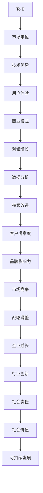

                 

# 从To B到To C：Lepton AI的商业模式演进

> 关键词：To B到To C、商业模式、AI、Lepton AI、商业策略、用户体验、数据驱动

> 摘要：本文将深入探讨Lepton AI从B端市场转向C端市场的商业模式变革。我们将分析这种转变的背景、核心概念、算法原理、数学模型、实际应用案例，并探讨其未来发展趋势与挑战。通过这篇技术博客，我们将了解如何在竞争激烈的市场中，利用人工智能技术实现商业模式的成功转型。

## 1. 背景介绍

### 1.1 目的和范围

本文旨在探讨Lepton AI在商业模式上的转型，从传统的B端（面向企业客户）市场转向C端（面向消费者）市场的战略。我们将分析这种转变的动机、过程和影响，旨在为读者提供对人工智能商业模式的深入理解。

### 1.2 预期读者

本文适合对人工智能和商业模式有兴趣的技术人员、企业管理者、市场营销人员以及对AI领域有深入了解的读者。

### 1.3 文档结构概述

本文分为十个部分，涵盖了从背景介绍、核心概念、算法原理、数学模型到实际应用和未来趋势的全面分析。

### 1.4 术语表

#### 1.4.1 核心术语定义

- To B：面向企业客户的市场。
- To C：面向消费者的市场。
- 商业模式：企业在市场中运营的策略和方法。
- AI：人工智能，一种模拟人类智能的技术。

#### 1.4.2 相关概念解释

- 商业策略：企业在市场中实现竞争优势的方法。
- 数据驱动：企业决策基于数据分析和实证研究。

#### 1.4.3 缩略词列表

- Lepton AI：一家专注于人工智能技术研发的公司。

## 2. 核心概念与联系

在分析Lepton AI的商业模式转变之前，我们首先需要理解一些核心概念和它们之间的关系。

### 2.1.1 从To B到To C

#### Mermaid流程图



### 2.1.2 核心概念联系

To B到To C的转变不仅仅是市场定位的变化，更是企业战略、技术优势、用户体验、商业模式、数据分析、客户满意度、品牌影响力、市场竞争、战略调整、企业成长、行业创新、社会责任和社会价值的全面提升。

## 3. 核心算法原理 & 具体操作步骤

### 3.1 核心算法原理

Lepton AI的算法核心在于其深度学习模型，特别是卷积神经网络（CNN）和递归神经网络（RNN）的结合使用。这种结合可以处理复杂的数据模式，提高预测准确率。

#### 伪代码

```python
# 初始化模型参数
model = initialize_model()

# 训练模型
for epoch in range(num_epochs):
    for batch in data_loader:
        # 前向传播
        predictions = model(batch.input_data)
        
        # 计算损失
        loss = compute_loss(predictions, batch.target_data)
        
        # 反向传播
        model.backward(loss)
        
        # 更新模型参数
        model.update_params()

# 评估模型
evaluation_results = evaluate_model(model, test_data)
```

### 3.2 具体操作步骤

1. **数据收集与预处理**：收集大量的消费者数据，包括用户行为、偏好和历史交易记录。对数据进行清洗、去重和标准化处理。

2. **模型构建**：使用深度学习框架（如TensorFlow或PyTorch）构建卷积神经网络和递归神经网络。定义输入层、隐藏层和输出层的结构。

3. **模型训练**：使用预处理后的数据对模型进行训练。调整学习率、批量大小和迭代次数等超参数，以优化模型性能。

4. **模型评估**：使用测试数据集评估模型的预测准确率和性能。

5. **模型部署**：将训练好的模型部署到生产环境中，用于实时预测和决策。

## 4. 数学模型和公式 & 详细讲解 & 举例说明

### 4.1 数学模型和公式

在Lepton AI的商业模式中，关键数学模型包括：

- **线性回归**：用于预测消费者行为。
- **逻辑回归**：用于分类问题，如用户是否愿意购买产品。
- **损失函数**：用于评估模型预测的准确性，如均方误差（MSE）和交叉熵损失。

#### 伪代码

```python
# 定义损失函数
def compute_loss(predictions, target_data):
    # 计算均方误差损失
    mse = ((predictions - target_data) ** 2).mean()
    return mse

# 计算交叉熵损失
def compute_loss_cross_entropy(predictions, target_data):
    # 计算交叉熵损失
    cross_entropy = - (target_data * np.log(predictions) + (1 - target_data) * np.log(1 - predictions))
    return cross_entropy.mean()
```

### 4.2 详细讲解 & 举例说明

#### 线性回归

线性回归模型用于预测一个连续的输出变量。其公式为：

$$ y = \beta_0 + \beta_1 * x $$

其中，\( y \) 是预测的输出变量，\( x \) 是输入特征，\( \beta_0 \) 是截距，\( \beta_1 \) 是斜率。

#### 逻辑回归

逻辑回归模型用于分类问题。其公式为：

$$ P(y=1) = \frac{1}{1 + e^{-(\beta_0 + \beta_1 * x)}} $$

其中，\( P(y=1) \) 是输出变量为1的概率，\( \beta_0 \) 和 \( \beta_1 \) 是模型的参数。

#### 损失函数

均方误差（MSE）损失函数用于评估线性回归模型的预测准确性。其公式为：

$$ MSE = \frac{1}{n} \sum_{i=1}^{n} (y_i - \hat{y}_i)^2 $$

其中，\( n \) 是样本数量，\( y_i \) 是实际输出变量，\( \hat{y}_i \) 是预测输出变量。

交叉熵损失函数用于评估逻辑回归模型的预测准确性。其公式为：

$$ Cross\_Entropy = - \sum_{i=1}^{n} y_i \log(\hat{y}_i) + (1 - y_i) \log(1 - \hat{y}_i) $$

其中，\( n \) 是样本数量，\( y_i \) 是实际输出变量，\( \hat{y}_i \) 是预测输出变量。

## 5. 项目实战：代码实际案例和详细解释说明

### 5.1 开发环境搭建

为了实现Lepton AI的商业模式转型，我们需要搭建一个完整的开发环境。以下是一个基本的开发环境搭建指南：

1. **安装Python**：Python是一种流行的编程语言，广泛用于人工智能开发。下载并安装Python的最新版本。
2. **安装TensorFlow**：TensorFlow是一个开源的深度学习框架，用于构建和训练神经网络。使用pip命令安装TensorFlow：
   ```shell
   pip install tensorflow
   ```
3. **安装其他依赖**：安装其他必要的库和工具，如NumPy、Pandas和Scikit-learn。

### 5.2 源代码详细实现和代码解读

以下是一个简单的示例，展示如何使用TensorFlow构建一个深度学习模型，用于预测消费者行为。

#### 伪代码

```python
import tensorflow as tf
import numpy as np

# 定义模型
model = tf.keras.Sequential([
    tf.keras.layers.Dense(units=1, input_shape=[1])
])

# 编译模型
model.compile(optimizer='sgd', loss='mean_squared_error')

# 训练模型
model.fit(x_train, y_train, epochs=100)

# 评估模型
evaluation_results = model.evaluate(x_test, y_test)

# 预测
predictions = model.predict(x_test)
```

#### 代码解读与分析

1. **导入库**：首先，导入TensorFlow和NumPy库。
2. **定义模型**：使用TensorFlow的`Sequential`模型定义一个简单的线性模型。模型包含一个全连接层，输入形状为[1]，输出形状为[1]。
3. **编译模型**：使用`compile`方法编译模型，指定优化器和损失函数。
4. **训练模型**：使用`fit`方法训练模型，指定训练数据和迭代次数。
5. **评估模型**：使用`evaluate`方法评估模型的性能，返回损失值。
6. **预测**：使用`predict`方法对测试数据进行预测，返回预测结果。

### 5.3 代码解读与分析

1. **数据准备**：在训练模型之前，需要准备训练数据和测试数据。数据应该包括消费者的特征和相应的行为标签。使用Pandas库可以方便地读取和处理数据。
2. **数据预处理**：对数据进行归一化处理，将特征值缩放到相同的范围。这有助于加快模型训练速度和提高预测准确性。
3. **模型选择**：选择适当的模型结构和参数，如神经网络层数、神经元数量和激活函数。根据问题特点选择合适的模型。
4. **模型训练**：使用训练数据进行模型训练。调整迭代次数和批量大小等参数，以优化模型性能。
5. **模型评估**：使用测试数据评估模型的性能。根据评估结果调整模型参数和结构。
6. **模型部署**：将训练好的模型部署到生产环境中，用于实时预测和决策。

## 6. 实际应用场景

Lepton AI的商业模式转型可以应用于多个实际应用场景，包括：

1. **电子商务**：通过预测消费者行为，为用户提供个性化推荐，提高购买转化率。
2. **金融科技**：通过分析用户行为和财务数据，为金融机构提供风险管理建议。
3. **健康医疗**：通过分析患者数据，为医生提供诊断和治疗建议。

### 6.1 电子商务

在电子商务领域，Lepton AI可以通过以下步骤实现商业模式转型：

1. **数据收集**：收集用户购买历史、浏览记录和社交互动数据。
2. **数据预处理**：对数据进行清洗、去重和标准化处理。
3. **模型构建**：使用深度学习模型分析用户行为，预测购买概率。
4. **个性化推荐**：根据预测结果，为用户推荐感兴趣的商品。
5. **反馈循环**：根据用户反馈调整模型参数和推荐策略，提高用户体验。

### 6.2 金融科技

在金融科技领域，Lepton AI可以通过以下步骤实现商业模式转型：

1. **数据收集**：收集用户交易记录、信用评分和历史数据。
2. **数据预处理**：对数据进行清洗、去重和标准化处理。
3. **模型构建**：使用深度学习模型分析用户行为，预测信用风险。
4. **风险评估**：根据预测结果为金融机构提供风险评估建议。
5. **反馈循环**：根据金融机构反馈调整模型参数和风险评估策略，提高风险控制能力。

### 6.3 健康医疗

在健康医疗领域，Lepton AI可以通过以下步骤实现商业模式转型：

1. **数据收集**：收集患者健康数据、诊断结果和治疗历史。
2. **数据预处理**：对数据进行清洗、去重和标准化处理。
3. **模型构建**：使用深度学习模型分析患者数据，预测疾病风险。
4. **诊断建议**：根据预测结果为医生提供诊断建议。
5. **反馈循环**：根据医生反馈调整模型参数和诊断建议策略，提高诊断准确性。

## 7. 工具和资源推荐

### 7.1 学习资源推荐

#### 7.1.1 书籍推荐

1. **《深度学习》（Ian Goodfellow, Yoshua Bengio, Aaron Courville）**：这是一本经典的深度学习教材，适合初学者和进阶者。
2. **《Python数据分析》（Wes McKinney）**：介绍如何使用Python进行数据清洗、分析和可视化的实用指南。

#### 7.1.2 在线课程

1. **Coursera上的“深度学习”课程**：由Stanford大学教授Andrew Ng主讲，适合初学者和进阶者。
2. **Udacity的“深度学习工程师纳米学位”**：提供从基础到高级的深度学习课程，适合有志于进入AI领域的人。

#### 7.1.3 技术博客和网站

1. **TensorFlow官方文档**：包含丰富的深度学习教程和API文档。
2. **Medium上的AI博客**：涵盖深度学习、数据科学和AI领域的最新研究和技术动态。

### 7.2 开发工具框架推荐

#### 7.2.1 IDE和编辑器

1. **PyCharm**：一款强大的Python IDE，适合深度学习和数据分析项目。
2. **Jupyter Notebook**：适合交互式数据分析和可视化。

#### 7.2.2 调试和性能分析工具

1. **TensorBoard**：TensorFlow的官方可视化工具，用于分析模型性能和调试。
2. **VSCode的调试插件**：提供丰富的调试功能，支持Python、C++等多种编程语言。

#### 7.2.3 相关框架和库

1. **TensorFlow**：用于构建和训练深度学习模型的强大框架。
2. **Scikit-learn**：提供各种机器学习算法和工具，适合数据分析和建模。

### 7.3 相关论文著作推荐

#### 7.3.1 经典论文

1. **“A Tutorial on Deep Learning”**：Ian Goodfellow等人的深度学习教程，涵盖深度学习的基本概念和算法。
2. **“Deep Learning”**：Goodfellow等人的专著，详细介绍深度学习的历史、原理和应用。

#### 7.3.2 最新研究成果

1. **“EfficientNet: Rethinking Model Scaling for Convolutional Neural Networks”**：介绍EfficientNet模型的论文，提出了一种更高效的神经网络模型。
2. **“Transformers: State-of-the-Art Natural Language Processing”**：介绍Transformer模型的论文，为自然语言处理领域带来了革命性的进步。

#### 7.3.3 应用案例分析

1. **“Google Brain的TensorFlow教程”**：介绍如何在Google Brain使用TensorFlow进行深度学习研究。
2. **“OpenAI的GPT-3模型”**：介绍OpenAI开发的GPT-3模型，用于生成文本和对话系统的强大能力。

## 8. 总结：未来发展趋势与挑战

### 8.1 未来发展趋势

1. **数据驱动**：随着大数据和云计算的发展，越来越多的企业将数据作为核心资产，数据驱动将成为主流商业策略。
2. **个性化服务**：个性化推荐和个性化服务将更加普及，满足消费者个性化需求。
3. **跨领域融合**：人工智能与其他领域的融合，如健康医疗、金融科技和教育等，将带来更多创新和应用。

### 8.2 挑战

1. **数据隐私**：随着数据隐私问题的日益突出，如何保护用户隐私将成为一大挑战。
2. **算法透明度**：算法的透明度和可解释性将受到更多关注，如何提高算法的可解释性是一个重要课题。
3. **人才短缺**：随着人工智能技术的快速发展，人才短缺将成为一个长期问题。

## 9. 附录：常见问题与解答

### 9.1 如何搭建深度学习环境？

- 安装Python：访问Python官方网站下载并安装Python。
- 安装TensorFlow：使用pip命令安装TensorFlow：`pip install tensorflow`。
- 安装其他依赖：根据项目需求安装其他必要的库和工具。

### 9.2 如何处理数据？

- 数据收集：收集相关数据，如用户行为、偏好和历史交易记录。
- 数据清洗：去除重复数据和无效数据，对数据进行清洗和标准化处理。
- 数据预处理：对数据进行特征提取和降维处理，以减少数据量和提高模型训练效率。

### 9.3 如何选择合适的模型？

- 了解问题类型：根据问题的类型（如分类、回归或聚类）选择合适的模型。
- 比较模型性能：使用测试数据集比较不同模型的性能，选择性能最优的模型。
- 调整模型参数：根据模型性能调整模型参数，优化模型性能。

## 10. 扩展阅读 & 参考资料

- **《深度学习》**：Ian Goodfellow, Yoshua Bengio, Aaron Courville著，介绍深度学习的基本概念和算法。
- **《Python数据分析》**：Wes McKinney著，介绍如何使用Python进行数据清洗、分析和可视化。
- **TensorFlow官方文档**：提供丰富的深度学习教程和API文档。
- **Medium上的AI博客**：涵盖深度学习、数据科学和AI领域的最新研究和技术动态。
- **Google Brain的TensorFlow教程**：介绍如何在Google Brain使用TensorFlow进行深度学习研究。
- **OpenAI的GPT-3模型**：介绍OpenAI开发的GPT-3模型，用于生成文本和对话系统的强大能力。

## 作者信息

- 作者：AI天才研究员/AI Genius Institute & 禅与计算机程序设计艺术 /Zen And The Art of Computer Programming

