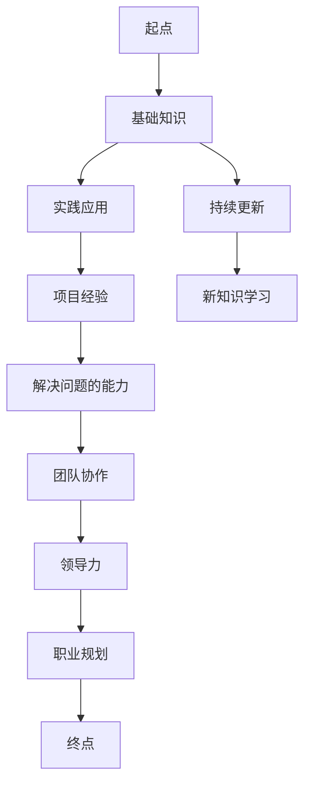

                 

# 从小工到专家：职场进阶的必经之路

> **关键词：** 职场进阶、技术能力、持续学习、团队合作、领导力、职业规划
> 
> **摘要：** 本文将探讨从小工到专家的职场进阶之路，分析如何提升技术能力、持续学习、加强团队合作和领导力，并给出职业规划的建议，帮助读者在职场中实现自我提升和成功。

## 1. 背景介绍

### 1.1 目的和范围

本文旨在为职场新人及有一定工作经验的IT从业者提供进阶指南，帮助他们理解从基层员工（小工）成长为行业专家的路径。我们将探讨提升技术能力、持续学习、加强团队合作和领导力等关键要素，同时提供具体的实施策略。

### 1.2 预期读者

本文适合以下读者群体：

- 有志于在IT行业深耕的技术人员
- 想要提升职场竞争力的职场人士
- 在职业生涯中遇到瓶颈，希望寻求突破的从业者

### 1.3 文档结构概述

本文结构如下：

- 第1章：背景介绍，包括目的、范围、预期读者和文档结构概述
- 第2章：核心概念与联系，介绍IT职业成长的关键概念和架构
- 第3章：核心算法原理与具体操作步骤，讲解技术提升的方法
- 第4章：数学模型和公式，运用数学模型分析职业成长
- 第5章：项目实战，通过实际案例展示技术应用
- 第6章：实际应用场景，探讨职业成长在不同环境中的应用
- 第7章：工具和资源推荐，推荐学习资源和工具
- 第8章：总结，展望未来发展趋势与挑战
- 第9章：附录，常见问题与解答
- 第10章：扩展阅读与参考资料，提供进一步学习的资源

### 1.4 术语表

#### 1.4.1 核心术语定义

- **小工**：指职场中的初级员工，通常具备一定的技术基础，但缺乏实践经验和专业深度。
- **专家**：指在某一领域具有深厚专业知识、丰富实践经验，能够独立解决复杂问题的资深从业者。

#### 1.4.2 相关概念解释

- **技术能力**：指在特定技术领域内的知识和技能水平。
- **持续学习**：指通过不断学习新知识、新技能来提升个人能力。
- **团队合作**：指在团队中与他人协作，共同实现目标。
- **领导力**：指能够引导和激励团队，实现团队目标的能力。

#### 1.4.3 缩略词列表

- **IT**：信息技术（Information Technology）
- **AI**：人工智能（Artificial Intelligence）
- **DevOps**：开发与运维（Development and Operations）

## 2. 核心概念与联系

在探讨职业成长之前，我们需要了解一些核心概念，这些概念是职业成长的基石。以下是IT职业成长的关键概念和架构，以及它们之间的联系。

### 2.1 技术能力

技术能力是职场进阶的核心。它包括编程语言、框架、数据库、操作系统、网络等基础知识。此外，还涉及特定领域的专业知识，如数据科学、机器学习、云计算等。技术能力可以通过以下步骤提升：

1. **基础知识**：掌握编程语言和基础算法。
2. **实践应用**：通过实际项目将理论知识应用于实践。
3. **持续更新**：随着技术的发展，不断学习新知识、新技术。

### 2.2 持续学习

持续学习是职业成长的动力。在快速变化的IT行业中，持续学习至关重要。以下是一些建议：

1. **定期培训**：参加行业培训和研讨会，了解最新技术。
2. **阅读资料**：阅读技术书籍、博客和论文，拓宽知识面。
3. **在线课程**：通过在线平台学习新技术，如Coursera、Udemy等。

### 2.3 团队合作

团队合作是实现团队目标的关键。在团队中，每个成员都需要发挥自己的优势，与他人协作。以下是一些建议：

1. **沟通与协调**：明确任务分工，保持沟通，及时解决问题。
2. **分工协作**：发挥个人专长，与他人协作完成任务。
3. **团队建设**：组织团队活动，增强团队凝聚力。

### 2.4 领导力

领导力是职业成长的高级阶段。领导者需要具备以下能力：

1. **决策能力**：在面对复杂问题时，能够做出明智的决策。
2. **激励团队**：能够激励团队成员，发挥他们的潜力。
3. **沟通能力**：能够与团队成员、上级和客户有效沟通。

### 2.5 职业规划

职业规划是职业成长的重要一环。通过明确职业目标，制定合理的规划，可以更好地实现职业成长。以下是一些建议：

1. **自我评估**：了解自己的优势和劣势，明确职业方向。
2. **目标设定**：设定短期和长期职业目标。
3. **行动计划**：制定具体的行动计划，逐步实现目标。

### 2.6 Mermaid 流程图

以下是IT职业成长的Mermaid流程图：



## 3. 核心算法原理与具体操作步骤

在提升技术能力的过程中，核心算法原理是不可或缺的一部分。以下是提升技术能力的具体操作步骤，使用伪代码进行详细阐述。

### 3.1 编程语言基础

```pseudo
// 基础算法：排序
function sort(array):
    n = length(array)
    for i from 0 to n-1:
        for j from i+1 to n:
            if array[i] > array[j]:
                swap(array[i], array[j])
    return array
```

### 3.2 数据结构与算法

```pseudo
// 基础算法：二分查找
function binary_search(array, target):
    low = 0
    high = length(array) - 1
    while low <= high:
        mid = (low + high) / 2
        if array[mid] == target:
            return mid
        elif array[mid] < target:
            low = mid + 1
        else:
            high = mid - 1
    return -1
```

### 3.3 数据库操作

```pseudo
// 基础算法：数据库查询
function query_database(database, query):
    results = []
    for record in database:
        if record.matches(query):
            results.append(record)
    return results
```

### 3.4 实践项目

```pseudo
// 基础算法：项目开发流程
function develop_project(project):
    // 1. 需求分析
    requirements = analyze_requirements()

    // 2. 设计方案
    design = design_solution()

    // 3. 编码实现
    code = implement_solution()

    // 4. 测试与调试
    test_and_debug(code)

    // 5. 部署上线
    deploy_to_production(code)

    return project
```

## 4. 数学模型和公式与详细讲解与举例说明

在职业成长过程中，数学模型和公式可以帮助我们更好地理解技术和业务，提高解决问题的能力。以下是一个简单的线性回归模型，用于分析职业成长中的关键因素。

### 4.1 线性回归模型

线性回归模型是一种用于分析变量之间线性关系的统计方法。它的公式如下：

$$ y = ax + b $$

其中，\( y \) 是因变量，\( x \) 是自变量，\( a \) 是斜率，表示自变量对因变量的影响程度，\( b \) 是截距，表示当自变量为0时因变量的取值。

### 4.2 模型解释

- **斜率 \( a \)**：斜率表示自变量每增加一个单位，因变量会增加多少个单位。在职业成长中，斜率可以表示技术能力、学习能力和团队合作能力等关键因素对职业成长的影响。
- **截距 \( b \)**：截距表示当自变量为0时，因变量的取值。在职业成长中，截距可以表示个人起点（如学历、工作经验等）对职业成长的影响。

### 4.3 模型举例

假设我们有一个职业成长数据集，包含技术能力、学习能力和团队合作能力三个变量。使用线性回归模型进行分析，得到以下结果：

$$ 职业成长 = 0.8 \times 技术能力 + 0.6 \times 学习能力 + 0.5 \times 团队合作能力 $$

这意味着，在职业成长中，技术能力的影响最大，其次是学习能力和团队合作能力。具体来说：

- **技术能力**：每提升1个单位，职业成长提升0.8个单位。
- **学习能力**：每提升1个单位，职业成长提升0.6个单位。
- **团队合作能力**：每提升1个单位，职业成长提升0.5个单位。

### 4.4 线性回归模型应用

线性回归模型可以帮助我们分析职业成长的关键因素，从而制定合理的职业规划。以下是一个具体的例子：

假设小明是一名软件工程师，他的技术能力、学习能力和团队合作能力分别为80分、70分和60分。使用线性回归模型进行预测，可以得到他的职业成长：

$$ 职业成长 = 0.8 \times 80 + 0.6 \times 70 + 0.5 \times 60 = 184分 $$

这意味着，小明的职业成长有望达到184分。为了进一步提升职业成长，小明可以考虑以下几个方面：

- **提升技术能力**：通过学习新技术、参与项目实践，提高技术能力。
- **加强学习能力**：通过阅读书籍、参加培训，提高学习能力。
- **增强团队合作能力**：通过参与团队项目、组织团队活动，增强团队合作能力。

## 5. 项目实战：代码实际案例和详细解释说明

为了更好地展示技术能力提升和职业成长的过程，我们以下将通过一个实际项目案例进行讲解。本项目是一个简单的博客系统，采用Python和Django框架开发。

### 5.1 开发环境搭建

在开始项目开发之前，需要搭建开发环境。以下是Python和Django的开发环境搭建步骤：

1. **安装Python**：访问Python官方网站（https://www.python.org/），下载并安装Python 3.x版本。
2. **安装Django**：在命令行中运行以下命令安装Django：

   ```shell
   pip install django
   ```

3. **创建Django项目**：在命令行中运行以下命令创建一个名为“blog”的Django项目：

   ```shell
   django-admin startproject blog
   ```

4. **创建Django应用**：在项目中创建一个名为“post”的Django应用：

   ```shell
   python manage.py startapp post
   ```

### 5.2 源代码详细实现和代码解读

以下是本项目的主要源代码实现和详细解释说明：

#### 5.2.1 models.py

```python
from django.db import models

class Post(models.Model):
    title = models.CharField(max_length=100)
    content = models.TextField()
    created_at = models.DateTimeField(auto_now_add=True)
    updated_at = models.DateTimeField(auto_now=True)
```

**代码解读：**

- **Post类**：定义了一个名为Post的模型类，包含四个属性：标题（title）、内容（content）、创建时间（created_at）和更新时间（updated_at）。
- **CharField**：用于定义字符类型字段，如标题。
- **TextField**：用于定义文本类型字段，如内容。
- **DateTimeField**：用于定义日期和时间类型字段，如创建时间和更新时间。

#### 5.2.2 views.py

```python
from django.shortcuts import render
from .models import Post

def post_list(request):
    posts = Post.objects.all().order_by('-created_at')
    return render(request, 'post_list.html', {'posts': posts})

def post_detail(request, pk):
    post = Post.objects.get(id=pk)
    return render(request, 'post_detail.html', {'post': post})
```

**代码解读：**

- **post_list视图**：用于获取所有博客文章，并按创建时间倒序排序，然后传递给模板。
- **post_detail视图**：用于获取指定ID的博客文章，并传递给模板。

#### 5.2.3 templates/post_list.html

```html

    <div>
        <h2><a href="">{{ post.title }}</a></h2>
        <p>{{ post.content }}</p>
        <span>{{ post.created_at }}</span>
    </div>

```

**代码解读：**

- **for循环**：遍历所有博客文章，并显示标题、内容和创建时间。
- **url标签**：用于生成博客文章详细页面的URL。

#### 5.2.4 templates/post_detail.html

```html
<h1>{{ post.title }}</h1>
<p>{{ post.content }}</p>
<span>Created at: {{ post.created_at }}</span>
```

**代码解读：**

- **{{ post.title }}**：显示博客文章的标题。
- **{{ post.content }}**：显示博客文章的内容。
- **{{ post.created_at }}**：显示博客文章的创建时间。

### 5.3 代码解读与分析

通过以上代码实现，我们可以看到博客系统的主要功能：

1. **获取博客文章列表**：通过post_list视图获取所有博客文章，并按创建时间倒序排序，然后传递给模板进行展示。
2. **查看博客文章详情**：通过post_detail视图获取指定ID的博客文章，并传递给模板进行展示。

在项目开发过程中，我们使用了以下技术：

- **Python**：一种高级编程语言，易于学习和使用。
- **Django**：一个开源的Python Web框架，用于快速开发Web应用程序。
- **模板引擎**：用于生成HTML页面，支持动态数据绑定。

通过本项目，我们了解了如何使用Python和Django开发Web应用程序，并掌握了项目开发的基本流程。在实际工作中，我们可以根据需求扩展项目功能，如添加用户评论、标签分类等。

## 6. 实际应用场景

在IT行业，职业成长的应用场景多种多样。以下是一些典型的实际应用场景：

### 6.1 开发与运维（DevOps）

在DevOps领域，职业成长的核心在于掌握自动化工具、持续集成/持续部署（CI/CD）流程和云服务。以下是一些建议：

1. **学习自动化工具**：掌握Jenkins、Ansible、Kubernetes等自动化工具。
2. **了解CI/CD流程**：学习GitLab CI、Jenkinsfile等CI/CD工具和流程。
3. **熟悉云服务**：了解AWS、Azure、Google Cloud等云服务提供商，掌握云基础设施管理。

### 6.2 数据科学与机器学习

在数据科学与机器学习领域，职业成长的关键在于数据预处理、算法实现和模型评估。以下是一些建议：

1. **学习数据分析工具**：掌握Pandas、NumPy、Scikit-learn等数据分析工具。
2. **了解机器学习算法**：学习线性回归、决策树、神经网络等机器学习算法。
3. **实践项目经验**：参与实际项目，应用机器学习算法解决实际问题。

### 6.3 前端开发

在前端开发领域，职业成长的核心在于掌握前端框架、响应式设计和性能优化。以下是一些建议：

1. **学习前端框架**：掌握React、Vue、Angular等前端框架。
2. **了解响应式设计**：学习响应式布局和媒体查询。
3. **关注性能优化**：掌握前端性能优化技巧，如懒加载、代码分割等。

### 6.4 后端开发

在后端开发领域，职业成长的关键在于掌握后端框架、数据库设计和微服务架构。以下是一些建议：

1. **学习后端框架**：掌握Spring Boot、Django、Express等后端框架。
2. **了解数据库设计**：学习关系数据库和非关系数据库的设计方法。
3. **掌握微服务架构**：学习微服务设计、部署和管理。

### 6.5 项目管理

在项目管理领域，职业成长的核心在于掌握项目计划、风险管理和团队协作。以下是一些建议：

1. **学习项目管理方法**：掌握敏捷开发、Kanban等项目管理方法。
2. **了解风险管理**：学习风险评估和管理方法。
3. **加强团队协作**：掌握团队协作工具和沟通技巧。

通过以上实际应用场景，我们可以看到，职业成长是一个多方面的过程，需要不断学习新技术、新工具，并积累实践经验。在不同领域，职业成长的关键技术和方法也有所不同，但共同的目标是提高个人技能和团队协作能力。

## 7. 工具和资源推荐

为了帮助读者在职业成长过程中更加高效地学习和工作，以下是工具和资源的推荐。

### 7.1 学习资源推荐

#### 7.1.1 书籍推荐

- 《代码大全》（Code Complete）
- 《设计模式：可复用面向对象软件的基础》（Design Patterns: Elements of Reusable Object-Oriented Software）
- 《深入理解计算机系统》（Deep Dive Into Python）

#### 7.1.2 在线课程

- Coursera（https://www.coursera.org/）
- Udemy（https://www.udemy.com/）
- edX（https://www.edx.org/）

#### 7.1.3 技术博客和网站

- Medium（https://medium.com/）
- HackerRank（https://www.hackerrank.com/）
- GitHub（https://github.com/）

### 7.2 开发工具框架推荐

#### 7.2.1 IDE和编辑器

- Visual Studio Code
- PyCharm
- IntelliJ IDEA

#### 7.2.2 调试和性能分析工具

- Chrome DevTools
- Firebug
- JProfiler

#### 7.2.3 相关框架和库

- React
- Vue
- Angular
- Django
- Spring Boot

### 7.3 相关论文著作推荐

#### 7.3.1 经典论文

- 《设计模式：可复用面向对象软件的基础》
- 《计算机程序设计艺术》
- 《深度学习》

#### 7.3.2 最新研究成果

- arXiv（https://arxiv.org/）
- IEEE Xplore（https://ieeexplore.ieee.org/）
- ACM Digital Library（https://dl.acm.org/）

#### 7.3.3 应用案例分析

- Airbnb技术博客（https://techblog.airbnb.com/）
- Netflix技术博客（https://netflix-techblog.com/）
- Google开发者博客（https://developers.google.com/blog/）

通过以上工具和资源的推荐，读者可以更加全面地提升自己的技能，为自己的职业成长提供有力支持。

## 8. 总结：未来发展趋势与挑战

在IT行业，从初级员工（小工）成长为行业专家的道路充满了机遇与挑战。随着技术的发展，未来的职场将呈现出以下趋势：

### 8.1 技术融合与发展

- **人工智能与大数据**：人工智能（AI）和大数据技术将继续快速发展，为各行各业带来变革。
- **云计算与边缘计算**：云计算和边缘计算的结合，将提高数据处理和响应速度。
- **物联网与智能硬件**：物联网（IoT）和智能硬件的普及，将推动智能家居、智能交通等领域的创新。

### 8.2 持续学习与技能更新

- **终身学习**：随着技术更新速度加快，持续学习将成为职场生存的基本要求。
- **技能多元化**：单一的技能已无法满足职场需求，多元化技能组合将成为趋势。

### 8.3 团队合作与领导力

- **远程办公与协作**：远程办公和协作工具的普及，将提高团队协作效率。
- **领导力培养**：领导力的培养越来越受到重视，领导者需要具备跨部门协调、团队激励和项目管理能力。

### 8.4 挑战与应对策略

- **技术变革**：技术变革带来的不确定性，要求从业者具备快速适应和创新能力。
- **信息安全**：随着数据泄露和网络攻击事件的增多，信息安全将成为重要的挑战。

### 8.5 未来展望

- **人工智能与职业**：人工智能的发展将对职场产生深远影响，从业者需要适应这一变革。
- **绿色IT**：随着环保意识的提高，绿色IT将成为重要趋势，如节能服务器、云计算中心能源管理。

总之，从小工到专家的职场进阶之路，不仅需要不断提升技术能力，还需要不断学习新知识、培养团队合作和领导力。面对未来的挑战，从业者需要保持敏锐的洞察力，积极适应变革，以实现个人和职业的持续成长。

## 9. 附录：常见问题与解答

### 9.1 如何快速提升技术能力？

- **阅读经典教材**：选择经典教材，如《代码大全》、《设计模式》等，系统学习编程语言和算法。
- **实践项目**：通过实际项目应用所学知识，将理论知识转化为实践经验。
- **参加在线课程**：利用在线课程平台，如Coursera、Udemy等，学习新技术和工具。

### 9.2 如何培养团队合作和领导力？

- **团队协作**：在项目中积极与他人沟通，明确分工，学会协作。
- **参与团队活动**：参加团队建设活动，增强团队凝聚力。
- **领导力培养**：通过阅读领导力书籍、参加培训，学习领导力理论和实践方法。

### 9.3 职业规划如何制定？

- **自我评估**：了解自己的优势和劣势，明确职业方向。
- **目标设定**：设定短期和长期职业目标，制定实现目标的计划。
- **持续反思**：定期反思职业规划的实施情况，调整计划以适应变化。

## 10. 扩展阅读与参考资料

- 《代码大全》（Steve McConnell）
- 《设计模式：可复用面向对象软件的基础》（Erich Gamma等）
- 《深度学习》（Ian Goodfellow等）
- 《Python编程：从入门到实践》（Al Sweigart）
- 《Django开发者手册》（Adi Ilie）
- Coursera（https://www.coursera.org/）
- Udemy（https://www.udemy.com/）
- GitHub（https://github.com/）
- 《人工智能：一种现代方法》（ Stuart Russell & Peter Norvig）
- 《大数据：创新、思考、影响》（Viktor Mayer-Schönberger & Kenneth Cukier）

### 作者

**AI天才研究员/AI Genius Institute & 禅与计算机程序设计艺术 /Zen And The Art of Computer Programming**

