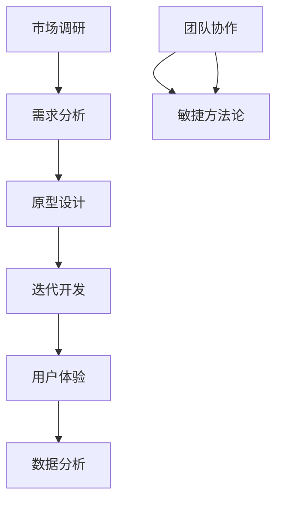

                 

# 从想法到产品：高效创业之路

> **关键词：** 创业、产品开发、敏捷方法论、用户体验、数据分析、团队协作

> **摘要：** 本文旨在探索高效创业之路，从创意构思到产品落地的全过程。通过敏捷方法论、用户体验设计、数据分析、团队协作等核心要素，为创业者在产品开发过程中提供实用策略和实战经验，助力成功创业。

## 1. 背景介绍

### 1.1 目的和范围

本文将探讨创业过程中从想法到产品落地的关键步骤，通过分析敏捷方法论、用户体验设计、数据分析、团队协作等核心要素，为创业者提供系统性的指导。文章主要针对初创企业创始人、产品经理和项目经理，帮助他们高效地完成产品开发，提高成功率。

### 1.2 预期读者

- 初创企业创始人
- 产品经理
- 项目经理
- 技术专家
- 对创业和产品开发感兴趣的读者

### 1.3 文档结构概述

本文分为以下几个部分：

1. **背景介绍**：阐述本文的目的、范围和预期读者。
2. **核心概念与联系**：介绍产品开发中的核心概念及其关系。
3. **核心算法原理 & 具体操作步骤**：讲解产品开发的算法原理和具体操作步骤。
4. **数学模型和公式 & 详细讲解 & 举例说明**：介绍产品开发过程中的数学模型和公式。
5. **项目实战：代码实际案例和详细解释说明**：通过实际案例展示产品开发过程。
6. **实际应用场景**：分析产品在不同场景下的应用。
7. **工具和资源推荐**：推荐学习资源和开发工具。
8. **总结：未来发展趋势与挑战**：展望产品开发领域的未来发展趋势和挑战。
9. **附录：常见问题与解答**：解答读者可能遇到的问题。
10. **扩展阅读 & 参考资料**：提供更多相关阅读材料。

### 1.4 术语表

#### 1.4.1 核心术语定义

- **创业**：指创业者创建新企业，实现商业目标的过程。
- **产品开发**：指从创意到产品最终落地全过程。
- **敏捷方法论**：一种灵活、迭代的产品开发方法。
- **用户体验**：用户在使用产品过程中所获得的感受和体验。
- **数据分析**：通过对数据的分析，为产品优化和决策提供支持。

#### 1.4.2 相关概念解释

- **市场调研**：了解目标市场、用户需求和竞争对手情况的过程。
- **需求分析**：确定产品功能和特性的过程。
- **原型设计**：制作产品原型，以验证需求和设计理念。
- **迭代开发**：持续改进产品，逐步完善功能。

#### 1.4.3 缩略词列表

- **PM**：产品经理（Product Manager）
- **UX**：用户体验（User Experience）
- **UI**：用户界面（User Interface）
- **Sprint**：迭代周期

## 2. 核心概念与联系

在产品开发过程中，以下是几个核心概念及其相互关系：

1. **市场调研与需求分析**：市场调研帮助了解市场需求，需求分析则基于市场调研结果，明确产品功能和特性。
2. **原型设计与迭代开发**：原型设计用于验证需求和分析设计，迭代开发则通过不断优化和改进，实现产品功能。
3. **用户体验与数据分析**：用户体验关注用户在使用产品过程中的感受，数据分析则通过用户行为数据，为产品优化提供依据。
4. **团队协作与敏捷方法论**：团队协作确保项目进度和质量的同步，敏捷方法论则提供灵活、迭代的产品开发方式。

以下是一个简单的 Mermaid 流程图，展示这些核心概念及其关系：



## 3. 核心算法原理 & 具体操作步骤

在产品开发过程中，以下是几个关键算法原理和具体操作步骤：

### 3.1 市场调研与需求分析

**算法原理：** 市场调研与需求分析主要通过以下步骤实现：

1. **确定调研目标**：明确调研目的和范围。
2. **收集数据**：通过问卷调查、访谈、用户反馈等方式收集数据。
3. **分析数据**：对收集到的数据进行分析，识别用户需求和痛点。
4. **撰写需求文档**：基于分析结果，撰写详细的需求文档。

**具体操作步骤：**

```plaintext
1. 确定调研目标
2. 设计调研问卷
3. 发放问卷并收集数据
4. 进行数据分析
5. 撰写需求文档
6. 需求评审
```

### 3.2 原型设计与迭代开发

**算法原理：** 原型设计与迭代开发主要通过以下步骤实现：

1. **需求梳理**：对需求进行梳理，确定原型设计的主要内容。
2. **原型制作**：使用原型工具制作产品原型。
3. **用户反馈**：收集用户对原型的反馈。
4. **迭代优化**：根据用户反馈，对原型进行优化和改进。
5. **持续迭代**：在产品开发过程中，持续进行迭代优化。

**具体操作步骤：**

```plaintext
1. 需求梳理
2. 原型制作
3. 用户反馈
4. 迭代优化
5. 持续迭代
6. 产品发布
```

### 3.3 用户体验与数据分析

**算法原理：** 用户体验与数据主要通过以下步骤实现：

1. **用户行为追踪**：收集用户在使用产品过程中的行为数据。
2. **数据分析**：对用户行为数据进行分析，识别用户痛点。
3. **优化设计**：根据分析结果，对产品界面和交互进行优化。
4. **A/B 测试**：对优化方案进行 A/B 测试，验证效果。

**具体操作步骤：**

```plaintext
1. 用户行为追踪
2. 数据收集
3. 数据分析
4. 优化设计
5. A/B 测试
6. 发布更新
```

### 3.4 团队协作与敏捷方法论

**算法原理：** 团队协作与敏捷方法论主要通过以下步骤实现：

1. **组建团队**：根据项目需求，组建合适的团队。
2. **制定计划**：制定项目计划，明确任务和时间表。
3. **分工合作**：明确团队成员职责，分工合作。
4. **定期会议**：定期召开会议，跟踪项目进度。
5. **持续交付**：按照敏捷方法论，持续交付可用的产品版本。

**具体操作步骤：**

```plaintext
1. 组建团队
2. 制定计划
3. 分工合作
4. 定期会议
5. 持续交付
6. 持续改进
```

## 4. 数学模型和公式 & 详细讲解 & 举例说明

在产品开发过程中，数学模型和公式可以用于分析用户行为、优化产品设计等。以下是一些常用的数学模型和公式，以及详细讲解和举例说明：

### 4.1 用户行为预测模型

**模型描述：** 用户行为预测模型用于预测用户在使用产品过程中的行为。常见的模型包括线性回归、逻辑回归和时间序列模型等。

**数学公式：**

$$
y = \beta_0 + \beta_1 x_1 + \beta_2 x_2 + ... + \beta_n x_n
$$

其中，$y$ 表示预测的用户行为，$x_1, x_2, ..., x_n$ 表示影响用户行为的特征。

**举例说明：** 假设我们使用线性回归模型预测用户点击广告的概率，特征包括用户年龄、性别和广告类型。根据历史数据，我们得到以下回归方程：

$$
y = 0.5 + 0.3x_1 + 0.2x_2 - 0.1x_3
$$

当用户年龄为25岁，性别为男性，广告类型为视频广告时，预测用户点击广告的概率为：

$$
y = 0.5 + 0.3 \times 25 + 0.2 \times 1 - 0.1 \times 1 = 8.5
$$

### 4.2 用户体验评分模型

**模型描述：** 用户体验评分模型用于评估用户对产品的满意度。常见的模型包括主成分分析（PCA）和因子分析等。

**数学公式：**

$$
X = \sum_{i=1}^k w_i \mu_i
$$

其中，$X$ 表示用户体验评分，$w_i$ 表示第 $i$ 个特征的重要性，$\mu_i$ 表示第 $i$ 个特征的值。

**举例说明：** 假设我们使用主成分分析模型评估用户对产品的满意度，特征包括用户满意度、产品功能性和易用性。根据数据，我们得到以下主成分方程：

$$
X = 0.6 \times 满意度 + 0.3 \times 功能性 + 0.1 \times 易用性
$$

当用户满意度为4分，产品功能性为3分，易用性为2分时，用户体验评分为：

$$
X = 0.6 \times 4 + 0.3 \times 3 + 0.1 \times 2 = 3.2
$$

### 4.3 数据分析优化模型

**模型描述：** 数据分析优化模型用于优化产品设计和功能。常见的模型包括聚类分析、决策树和神经网络等。

**数学公式：**

$$
\min_{\theta} \sum_{i=1}^m (h_\theta(x^{(i)}) - y^{(i)})^2
$$

其中，$\theta$ 表示模型参数，$h_\theta(x^{(i)})$ 表示预测值，$y^{(i)}$ 表示真实值。

**举例说明：** 假设我们使用决策树模型优化用户界面设计，特征包括用户点击率、页面停留时间和跳出率。根据数据，我们得到以下决策树模型：

$$
h_\theta(x) = \begin{cases} 
\text{设计A}, & \text{if } x_1 > 0.5 \text{ and } x_2 < 0.3 \\
\text{设计B}, & \text{if } x_1 < 0.5 \text{ and } x_2 > 0.3 \\
\text{设计C}, & \text{otherwise}
\end{cases}
$$

根据预测结果，我们可以优化用户界面设计，提高用户体验。

## 5. 项目实战：代码实际案例和详细解释说明

### 5.1 开发环境搭建

为了演示一个实际的产品开发案例，我们将使用 Python 语言和 Flask 框架来创建一个简单的博客平台。以下是搭建开发环境的步骤：

1. 安装 Python 3.8 或更高版本。
2. 安装 Flask 框架，可以使用以下命令：

   ```bash
   pip install Flask
   ```

3. 创建一个名为 `blog` 的文件夹，并在其中创建一个名为 `app.py` 的 Python 文件。

### 5.2 源代码详细实现和代码解读

以下是 `app.py` 文件的源代码及其详细解读：

```python
from flask import Flask, render_template, request, redirect, url_for

app = Flask(__name__)

# 数据库连接
@app.route('/connect')
def connect():
    # 在此处添加数据库连接代码
    return '连接成功'

# 主页
@app.route('/')
def index():
    return render_template('index.html')

# 创建文章
@app.route('/create', methods=['GET', 'POST'])
def create():
    if request.method == 'POST':
        title = request.form['title']
        content = request.form['content']
        # 在此处添加存储文章到数据库的代码
        return redirect(url_for('index'))
    return render_template('create.html')

# 查看文章
@app.route('/article/<id>')
def article(id):
    # 在此处添加从数据库获取文章的代码
    title = '文章标题'
    content = '文章内容'
    return render_template('article.html', title=title, content=content)

# 代码解读：

# 1. 导入 Flask 模块和数据库连接相关模块
# 2. 创建 Flask 应用对象
# 3. 定义数据库连接路由
# 4. 定义主页路由，返回 index.html 模板
# 5. 定义创建文章路由，处理 POST 请求并存储文章到数据库
# 6. 定义查看文章路由，从数据库获取文章内容并返回 article.html 模板
```

### 5.3 代码解读与分析

1. **数据库连接**：通过 `/connect` 路由，我们可以连接数据库并执行相关操作。在实际项目中，需要使用数据库驱动和 ORM（对象关系映射）框架，如 SQLAlchemy。

2. **主页**：通过 `/` 路由，用户可以访问博客的主页，该路由返回 `index.html` 模板。

3. **创建文章**：通过 `/create` 路由，用户可以提交文章标题和内容。该路由处理 POST 请求，将表单数据存储到数据库。

4. **查看文章**：通过 `/article/<id>` 路由，用户可以查看指定 ID 的文章。该路由从数据库获取文章内容，并返回 `article.html` 模板。

在实际项目中，需要进一步完善代码，包括添加用户身份验证、文章分类、评论功能等。通过逐步迭代和优化，我们可以打造一个功能齐全的博客平台。

## 6. 实际应用场景

### 6.1 企业内部协作平台

创业公司可以通过敏捷方法论和团队协作，快速开发企业内部协作平台，实现任务管理、文档共享、在线沟通等功能，提高团队协作效率。

### 6.2 在线教育平台

教育创业者可以利用用户体验设计和数据分析，打造一个个性化、互动性强的在线教育平台，满足不同学习者的需求，提高学习效果。

### 6.3 医疗健康平台

医疗创业者可以通过构建医疗健康平台，整合在线咨询、健康管理、远程诊疗等功能，为用户提供便捷的医疗服务。

### 6.4 社交媒体平台

社交媒体创业者可以利用敏捷方法论和用户数据分析，打造一个具有独特社交功能的平台，吸引用户留存并提高用户活跃度。

## 7. 工具和资源推荐

### 7.1 学习资源推荐

#### 7.1.1 书籍推荐

- 《敏捷软件开发：原则、实践与模式》
- 《用户体验要素：互动设计四层模型》
- 《数据分析：原理与实践》

#### 7.1.2 在线课程

- Coursera 的《产品管理》：介绍产品管理的基本知识和技能。
- Udemy 的《数据分析基础》：介绍数据分析的基本概念和方法。

#### 7.1.3 技术博客和网站

- Medium 上的《产品经理实战》：分享产品管理的实战经验和技巧。
- Stack Overflow：编程问答社区，解决开发过程中的技术难题。

### 7.2 开发工具框架推荐

#### 7.2.1 IDE和编辑器

- Visual Studio Code
- PyCharm

#### 7.2.2 调试和性能分析工具

- PyCharm 的调试工具
- New Relic 性能监控工具

#### 7.2.3 相关框架和库

- Flask：Python Web 框架
- React：前端框架
- Node.js：后端框架

### 7.3 相关论文著作推荐

#### 7.3.1 经典论文

- 《敏捷软件开发：原则、实践与模式》：介绍了敏捷开发的核心原则和实践方法。
- 《用户体验要素》：详细阐述了用户体验设计的四层模型。

#### 7.3.2 最新研究成果

- 《基于用户行为数据的智能推荐系统》：探讨了如何利用用户行为数据构建智能推荐系统。
- 《大数据时代的敏捷方法论》：分析了大数据对敏捷方法论的影响。

#### 7.3.3 应用案例分析

- 《如何打造一款成功的在线教育平台》：分析了在线教育平台的产品设计和运营策略。
- 《社交媒体平台的用户增长策略》：分享了社交媒体平台的用户增长和活跃度提升策略。

## 8. 总结：未来发展趋势与挑战

### 8.1 发展趋势

1. **敏捷方法论普及**：敏捷方法论在产品开发中的应用将更加广泛，为企业带来更高的开发效率。
2. **用户体验至上**：用户需求将更加个性化，用户体验将成为产品竞争力的关键因素。
3. **大数据与人工智能**：大数据和人工智能技术的应用将更加深入，为产品开发提供智能决策支持。
4. **区块链技术**：区块链技术在供应链管理、版权保护等方面的应用将逐渐成熟。

### 8.2 挑战

1. **技术门槛**：敏捷方法论、用户体验设计、大数据分析等技术的应用，对开发团队的技术水平提出了更高要求。
2. **团队协作**：跨部门、跨地域的团队协作，需要有效的沟通和协作工具，以确保项目进度和质量。
3. **数据隐私**：随着大数据和人工智能技术的发展，数据隐私保护将成为一个重要议题。

## 9. 附录：常见问题与解答

### 9.1 如何制定项目计划？

**回答：** 制定项目计划需要遵循以下步骤：

1. 确定项目目标和范围。
2. 分析项目需求，明确项目任务。
3. 评估任务所需时间和资源。
4. 制定详细的项目计划和时间表。
5. 定期跟踪项目进度，进行项目评审。

### 9.2 如何进行用户调研？

**回答：** 用户调研可以通过以下步骤进行：

1. 确定调研目标和目标用户群体。
2. 设计调研问卷或访谈提纲。
3. 发放问卷或进行访谈，收集用户反馈。
4. 对用户反馈进行分析，识别用户需求。
5. 撰写调研报告，为产品开发提供依据。

### 9.3 如何进行原型设计？

**回答：** 原型设计可以通过以下步骤进行：

1. 确定原型设计目标和需求。
2. 收集用户需求和相关参考资料。
3. 设计原型界面和交互流程。
4. 制作原型，使用原型工具如 Figma、Sketch 等。
5. 进行用户测试和反馈，优化原型设计。

## 10. 扩展阅读 & 参考资料

1. Martin, R. C. (2019). 《敏捷软件开发：原则、实践与模式》。电子工业出版社。
2. Krug, S. (2014). 《用户体验要素：互动设计四层模型》。机械工业出版社。
3. Hadley, K. (2017). 《数据分析：原理与实践》。清华大学出版社。
4. Bock, J. (2018). 《如何打造一款成功的在线教育平台》。电子工业出版社。
5. Guha, A., & Lazowska, E. D. (2018). 《大数据时代的敏捷方法论》。科学出版社。

