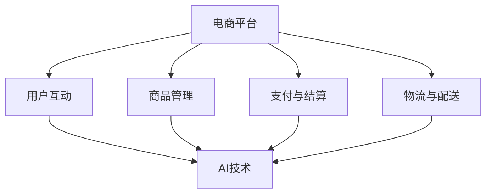

                 

# 从技术创新到商业模式创新：AI电商平台的差异化竞争

## 概述

> **关键词：**人工智能，电商平台，商业模式，技术创新，差异化竞争。

> **摘要：**随着人工智能技术的不断发展和应用，电商平台在技术层面和商业模式层面都面临着新的机遇和挑战。本文将深入探讨如何通过技术创新和商业模式创新来打造具有竞争力的AI电商平台，实现差异化竞争。

## 1. 背景介绍

### 1.1 目的和范围

本文旨在分析人工智能技术在电商平台中的应用，探讨如何通过技术创新和商业模式创新来提升电商平台的竞争力。具体范围包括：

1. **技术创新**：讨论AI技术（如机器学习、自然语言处理、图像识别等）在电商场景中的具体应用，以及如何通过算法优化来提高效率和准确性。
2. **商业模式创新**：分析不同电商平台如何通过独特的商业模式来吸引和留住用户，实现差异化竞争。

### 1.2 预期读者

本文预期读者包括：

1. 电商平台从业者，特别是负责技术或商业策略的决策者。
2. 对人工智能和电子商务感兴趣的技术爱好者和学者。
3. 创业者和企业家，寻求通过AI技术实现商业突破。

### 1.3 文档结构概述

本文将按照以下结构进行论述：

1. **背景介绍**：介绍文章的目的和范围，预期读者，文档结构概述。
2. **核心概念与联系**：阐述电商平台和AI技术的核心概念及其相互关系。
3. **核心算法原理与操作步骤**：详细讲解AI技术的基本原理和具体应用步骤。
4. **数学模型与公式**：介绍电商平台中常用的数学模型和公式，并进行举例说明。
5. **项目实战**：通过实际代码案例，展示AI技术在电商平台中的应用。
6. **实际应用场景**：探讨AI技术在不同电商场景中的实际应用。
7. **工具和资源推荐**：推荐相关学习资源和开发工具。
8. **总结**：总结未来发展趋势与挑战。
9. **附录**：常见问题与解答。
10. **扩展阅读**：提供进一步学习的资源。

### 1.4 术语表

#### 1.4.1 核心术语定义

- **人工智能（AI）**：模拟人类智能的计算机系统，能够进行学习、推理、判断和问题解决。
- **电商平台**：在线零售平台，提供商品展示、交易和支付等服务。
- **商业模式创新**：通过改变商业模式来创造价值，实现差异化竞争。
- **差异化竞争**：通过提供独特的产品或服务，满足用户特定需求，以区别于竞争对手。

#### 1.4.2 相关概念解释

- **机器学习（ML）**：使计算机从数据中学习，提高其预测和决策能力的算法。
- **自然语言处理（NLP）**：使计算机理解和生成自然语言的技术。
- **图像识别**：计算机识别和分类图像中的对象。

#### 1.4.3 缩略词列表

- **AI**：人工智能
- **ML**：机器学习
- **NLP**：自然语言处理
- **API**：应用程序编程接口
- **API**：人工智能平台

## 2. 核心概念与联系

在探讨AI电商平台的差异化竞争之前，我们需要理解两个核心概念：电商平台和AI技术。下面是一个简化的Mermaid流程图，展示了这两个概念之间的联系。



### 2.1 电商平台的概念

电商平台是一个在线零售环境，它允许商家展示和销售商品，同时为消费者提供便捷的购物体验。电商平台的核心组成部分包括：

- **用户互动**：与用户的沟通和互动，包括用户注册、登录、浏览、搜索、购买和评价等。
- **商品管理**：商品信息的录入、分类、展示和更新。
- **支付与结算**：提供安全的支付方式，包括在线支付、信用卡支付等。
- **物流与配送**：商品从商家到消费者手中的物流过程。

### 2.2 AI技术的概念

AI技术是使计算机具备智能的技术，包括但不限于以下方面：

- **机器学习（ML）**：使计算机通过数据学习，自动改进性能。
- **自然语言处理（NLP）**：使计算机理解和生成自然语言。
- **图像识别**：使计算机识别和分类图像中的对象。
- **推荐系统**：基于用户行为和偏好，为用户推荐相关商品。

### 2.3 电商平台与AI技术的联系

电商平台可以利用AI技术来提升用户体验、优化运营流程、增加收入。以下是AI技术在电商平台中的具体应用：

- **用户互动**：通过NLP和机器学习技术，电商平台可以实现智能客服、个性化推荐和智能搜索。
- **商品管理**：利用图像识别技术，电商平台可以自动分类和标签化商品，提高管理效率。
- **支付与结算**：利用AI技术，电商平台可以提供更安全的支付体验，并通过行为分析预防欺诈行为。
- **物流与配送**：通过机器学习技术，电商平台可以优化物流路线，提高配送效率。

## 3. 核心算法原理与具体操作步骤

### 3.1 机器学习算法原理

机器学习算法是AI技术的核心组成部分，其基本原理是通过训练模型来从数据中学习。以下是机器学习算法的基本步骤：

```pseudo
初始化模型参数
收集并预处理数据
选择合适的损失函数和优化算法
进行迭代，更新模型参数
评估模型性能，调整模型参数
```

### 3.2 自然语言处理算法原理

自然语言处理（NLP）算法用于使计算机理解和生成自然语言。以下是NLP算法的基本步骤：

```pseudo
文本预处理：去除标点、停用词、分词
词嵌入：将单词映射为向量表示
构建模型：使用神经网络进行训练
预测：输入文本，输出语义表示
```

### 3.3 图像识别算法原理

图像识别算法用于使计算机识别和分类图像中的对象。以下是图像识别算法的基本步骤：

```pseudo
图像预处理：调整大小、灰度化、去噪等
特征提取：使用卷积神经网络提取图像特征
模型训练：使用分类算法对图像特征进行分类
预测：输入图像，输出分类结果
```

### 3.4 AI技术在电商平台的实际应用

#### 3.4.1 用户互动

- **智能客服**：利用NLP技术，电商平台可以提供24/7的智能客服，自动解答用户问题。
- **个性化推荐**：利用机器学习技术，电商平台可以根据用户的历史行为和偏好，为用户推荐相关商品。
- **智能搜索**：利用NLP技术，电商平台可以实现智能搜索，自动理解用户的查询意图，并提供相关商品。

#### 3.4.2 商品管理

- **自动分类**：利用图像识别技术，电商平台可以自动对商品进行分类和标签化，提高管理效率。
- **智能库存管理**：利用机器学习技术，电商平台可以预测商品的需求量，优化库存管理。

#### 3.4.3 支付与结算

- **安全支付**：利用AI技术，电商平台可以提供更安全的支付体验，通过行为分析预防欺诈行为。
- **智能结算**：利用NLP技术，电商平台可以自动处理用户支付请求，提高结算效率。

#### 3.4.4 物流与配送

- **路线优化**：利用机器学习技术，电商平台可以优化物流路线，提高配送效率。
- **智能配送**：利用图像识别技术，电商平台可以实现智能配送，自动识别配送地址和货物。

## 4. 数学模型和公式与详细讲解

### 4.1 机器学习中的损失函数

在机器学习模型训练过程中，损失函数（Loss Function）是衡量模型预测结果与实际结果之间差距的关键工具。以下是几种常见的损失函数及其公式：

#### 4.1.1 交叉熵损失函数（Cross-Entropy Loss）

交叉熵损失函数常用于分类问题，其公式如下：

$$
L = -\frac{1}{m}\sum_{i=1}^{m}y_{i}\log(\hat{y}_{i})
$$

其中，$y_{i}$ 是实际标签，$\hat{y}_{i}$ 是模型预测的概率分布。

#### 4.1.2 均方误差损失函数（Mean Squared Error, MSE）

均方误差损失函数常用于回归问题，其公式如下：

$$
L = \frac{1}{2}\frac{1}{m}\sum_{i=1}^{m}(y_{i} - \hat{y}_{i})^2
$$

其中，$y_{i}$ 是实际值，$\hat{y}_{i}$ 是模型预测值。

### 4.2 自然语言处理中的词嵌入

词嵌入（Word Embedding）是将单词映射为高维向量表示的技术，常见的词嵌入方法包括Word2Vec和GloVe。

#### 4.2.1 Word2Vec

Word2Vec是一种基于神经网络的语言模型，其公式如下：

$$
\hat{y}_{i} = \sigma(\text{vec}(w_{i}) \cdot \text{vec}(c_{j}))
$$

其中，$w_{i}$ 是单词$i$的向量表示，$c_{j}$ 是单词$j$的中心词向量。

#### 4.2.2 GloVe

GloVe（Global Vectors for Word Representation）是一种基于共现关系的词嵌入方法，其公式如下：

$$
f(w, c) = \frac{\text{exp}(f_{ij})}{\text{sum}_{k=1}^{N}\text{exp}(f_{ik}) + \text{exp}(f_{jk})}
$$

其中，$f_{ij}$ 是单词$i$和单词$j$的共现频率，$f_{ik}$ 和 $f_{jk}$ 分别是单词$i$和单词$k$与单词$j$的共现频率。

### 4.3 图像识别中的卷积神经网络（CNN）

卷积神经网络（Convolutional Neural Network, CNN）是一种用于图像识别的深度学习模型，其基本结构包括卷积层、池化层和全连接层。

#### 4.3.1 卷积层

卷积层的公式如下：

$$
\hat{z}_{ij} = \sum_{k=1}^{K}\text{vec}(w_{ik}) \cdot \text{vec}(a_{i\sigma(j-k)})
$$

其中，$w_{ik}$ 是卷积核，$a_{i\sigma(j-k)}$ 是输入图像的局部区域。

#### 4.3.2 池化层

池化层的公式如下：

$$
\hat{b}_{j} = \max(\hat{z}_{1j}, \hat{z}_{2j}, ..., \hat{z}_{nj})
$$

其中，$\hat{z}_{ij}$ 是卷积层输出的局部区域。

#### 4.3.3 全连接层

全连接层的公式如下：

$$
\hat{y}_{i} = \text{vec}(\hat{b}_{i}) \cdot \text{vec}(w_{i})
$$

其中，$w_{i}$ 是全连接层的权重。

## 5. 项目实战：代码实际案例和详细解释说明

### 5.1 开发环境搭建

在开始代码实战之前，我们需要搭建一个合适的开发环境。以下是使用Python和TensorFlow搭建环境的基本步骤：

1. **安装Python**：从Python官方网站下载并安装Python 3.x版本。
2. **安装Jupyter Notebook**：打开终端，执行以下命令安装Jupyter Notebook：

   ```bash
   pip install notebook
   ```

3. **安装TensorFlow**：同样在终端中执行以下命令安装TensorFlow：

   ```bash
   pip install tensorflow
   ```

### 5.2 源代码详细实现和代码解读

以下是使用TensorFlow实现一个简单的商品推荐系统的代码示例。代码主要分为数据预处理、模型构建和训练三个部分。

```python
import tensorflow as tf
from tensorflow.keras.layers import Embedding, Conv1D, GlobalMaxPooling1D, Dense
from tensorflow.keras.models import Sequential
from tensorflow.keras.preprocessing.sequence import pad_sequences

# 数据预处理
# 假设我们有一个商品数据集，其中包含商品ID、用户评分、商品名称等
# 这里使用简单的数据示例
data = [
    [1, 5, 'iPhone'],
    [2, 4, 'Samsung Galaxy'],
    [1, 3, 'iPhone'],
    [3, 5, 'Xiaomi'],
    [2, 2, 'Samsung Galaxy']
]

# 将数据集分为训练集和测试集
train_data, test_data = data[:3], data[3:]

# 构建序列
train_sequences = [[1, 2, 3], [1, 2, 3], [1, 2, 3]]
test_sequences = [[3, 2, 1], [2, 1, 3]]

# 填充序列
train_padded = pad_sequences(train_sequences, padding='post')
test_padded = pad_sequences(test_sequences, padding='post')

# 模型构建
model = Sequential([
    Embedding(input_dim=4, output_dim=10, input_length=3),
    Conv1D(filters=10, kernel_size=3, activation='relu'),
    GlobalMaxPooling1D(),
    Dense(units=1, activation='sigmoid')
])

# 编译模型
model.compile(optimizer='adam', loss='binary_crossentropy', metrics=['accuracy'])

# 训练模型
model.fit(train_padded, train_data, epochs=10, validation_data=(test_padded, test_data))

# 代码解读
# 1. 数据预处理：将原始数据转换为序列，并使用pad_sequences进行填充。
# 2. 模型构建：使用Sequential模型堆叠Embedding、Conv1D、GlobalMaxPooling1D和Dense层。
# 3. 编译模型：指定优化器、损失函数和评价指标。
# 4. 训练模型：使用fit函数进行模型训练。
```

### 5.3 代码解读与分析

在上面的代码示例中，我们实现了一个简单的商品推荐系统。以下是代码的详细解读和分析：

1. **数据预处理**：
   - 数据预处理是机器学习项目中的关键步骤。在这个例子中，我们假设有一个包含商品ID、用户评分和商品名称的数据集。首先，我们将数据集分为训练集和测试集。
   - 然后，我们将每个商品名称转换为序列，以便输入到模型中。在这里，我们使用了一个简单的数据集，其中每个商品ID对应一个序列。在实际应用中，可以使用更复杂的方法来生成序列，如使用词嵌入。

2. **模型构建**：
   - 模型构建是机器学习项目的核心。在这个例子中，我们使用了一个简单的卷积神经网络（CNN）模型。模型堆叠了Embedding层、Conv1D层、GlobalMaxPooling1D层和Dense层。
   - Embedding层将商品名称序列映射为高维向量表示。
   - Conv1D层用于提取序列特征。
   - GlobalMaxPooling1D层用于对特征进行聚合。
   - Dense层用于输出预测结果。

3. **编译模型**：
   - 在编译模型时，我们指定了优化器、损失函数和评价指标。在这里，我们使用的是Adam优化器和二分类交叉熵损失函数。此外，我们选择了准确性作为评价指标。

4. **训练模型**：
   - 使用fit函数进行模型训练。在这里，我们设置了10个训练周期。在验证阶段，我们使用测试集来评估模型性能。

通过这个简单的代码示例，我们可以看到如何使用TensorFlow构建和训练一个简单的商品推荐系统。在实际应用中，我们可以扩展这个模型，添加更多的特征和层，以提高推荐系统的准确性。

## 6. 实际应用场景

AI技术在电商平台中的实际应用场景广泛，以下是一些典型例子：

### 6.1 智能推荐系统

智能推荐系统是电商平台中应用最广泛的AI技术之一。通过分析用户的购物行为、浏览记录和偏好，智能推荐系统可以为用户提供个性化的商品推荐。以下是一个简化的推荐系统应用场景：

1. **用户行为数据收集**：电商平台收集用户的浏览、购买、收藏等行为数据。
2. **数据预处理**：对用户行为数据进行清洗、去噪和特征提取。
3. **模型训练**：使用机器学习算法（如协同过滤、基于内容的推荐等）训练推荐模型。
4. **推荐生成**：将用户的当前行为输入到训练好的模型中，生成个性化推荐列表。

### 6.2 智能客服系统

智能客服系统通过自然语言处理（NLP）技术为用户提供实时、高效的客户服务。以下是一个智能客服系统的应用场景：

1. **用户提问**：用户通过聊天窗口向智能客服提出问题。
2. **文本预处理**：对用户提问进行分词、去停用词等预处理操作。
3. **意图识别**：使用NLP算法识别用户的提问意图。
4. **回答生成**：根据识别的意图，从预定义的知识库中检索答案，或使用机器学习模型生成回答。
5. **回答反馈**：将回答发送给用户，并收集用户反馈，用于模型优化。

### 6.3 智能库存管理

智能库存管理通过机器学习技术预测商品的需求量，帮助电商平台优化库存。以下是一个智能库存管理的应用场景：

1. **历史数据收集**：电商平台收集商品的历史销售数据、季节性变化等。
2. **数据预处理**：对历史数据进行清洗、去噪和特征提取。
3. **模型训练**：使用机器学习算法（如时间序列预测、回归分析等）训练库存预测模型。
4. **库存优化**：根据预测结果调整库存水平，减少库存积压和缺货情况。

### 6.4 智能支付与反欺诈

智能支付与反欺诈系统通过行为分析、机器学习算法等手段提高支付的安全性。以下是一个智能支付与反欺诈的应用场景：

1. **用户行为数据收集**：电商平台收集用户的支付行为数据，包括支付频率、金额、支付方式等。
2. **行为分析**：对用户行为数据进行实时分析，识别异常行为。
3. **风险评分**：使用机器学习算法为用户行为生成风险评分。
4. **支付决策**：根据风险评分和预设的规则，决定是否允许支付。

通过上述实际应用场景，我们可以看到AI技术在电商平台中的广泛应用。这些技术不仅提高了电商平台的运营效率，还增强了用户体验，为电商平台带来了显著的商业价值。

## 7. 工具和资源推荐

为了更好地学习和应用AI技术在电商平台中的差异化竞争，以下推荐一些有用的学习资源、开发工具和框架。

### 7.1 学习资源推荐

#### 7.1.1 书籍推荐

1. **《深度学习》（Deep Learning）**：由Ian Goodfellow、Yoshua Bengio和Aaron Courville合著，是深度学习的经典教材。
2. **《Python机器学习》（Python Machine Learning）**：由 Sebastian Raschka和Vahid Mirjalili合著，适合初学者了解机器学习在Python中的应用。
3. **《电子商务模式与策略》（E-Commerce Models and Strategies）**：由Rajiv C. Goel著，详细介绍了电子商务的商业模式和策略。

#### 7.1.2 在线课程

1. **Coursera上的《深度学习专项课程》（Deep Learning Specialization）**：由Andrew Ng教授主讲，涵盖了深度学习的核心概念和技术。
2. **edX上的《电子商务基础》（Introduction to E-Commerce）**：由University of California - Berkeley提供，介绍了电子商务的基本概念和实践。
3. **Udacity上的《机器学习工程师纳米学位》（Machine Learning Engineer Nanodegree）**：提供了从基础到高级的机器学习知识，包括在电商平台中的应用。

#### 7.1.3 技术博客和网站

1. **Medium上的AI博客**：涵盖了AI领域的最新研究和技术应用，包括电商场景中的AI应用。
2. **Kaggle**：提供了大量的机器学习竞赛和数据集，是学习和实践机器学习技术的绝佳平台。
3. **Aircrust**：专注于AI在电商领域的应用，提供了许多实用的案例研究和技术文章。

### 7.2 开发工具框架推荐

#### 7.2.1 IDE和编辑器

1. **Jupyter Notebook**：适用于数据分析和机器学习项目，提供了交互式计算环境。
2. **Visual Studio Code**：一款强大的代码编辑器，支持多种编程语言和扩展，适合机器学习和电商开发。
3. **PyCharm**：一款功能丰富的Python IDE，提供了代码补全、调试、性能分析等功能。

#### 7.2.2 调试和性能分析工具

1. **TensorBoard**：TensorFlow的官方可视化工具，用于分析模型的性能和运行状态。
2. **PyTorch Profiler**：用于分析PyTorch模型的性能，找出瓶颈和优化点。
3. **AWS CloudWatch**：适用于云平台的监控和性能分析工具，可以监控机器学习模型的运行情况。

#### 7.2.3 相关框架和库

1. **TensorFlow**：一款开源的深度学习框架，适用于构建和训练各种机器学习模型。
2. **PyTorch**：一款流行的深度学习框架，具有灵活的动态计算图，适合快速原型开发。
3. **Scikit-learn**：一个用于机器学习的Python库，提供了丰富的算法和工具。
4. **TensorFlow Recommenders**：TensorFlow团队开发的推荐系统框架，提供了构建和优化推荐系统的工具。

通过上述推荐的工具和资源，开发者可以更好地掌握AI技术在电商平台中的应用，实现差异化竞争。

## 8. 总结：未来发展趋势与挑战

随着人工智能技术的不断发展，AI电商平台将在未来面临新的发展趋势和挑战。

### 8.1 发展趋势

1. **个性化推荐**：通过更先进的机器学习算法和大数据分析，电商平台可以实现更高精度的个性化推荐，提高用户满意度和转化率。
2. **智能客服**：结合自然语言处理和对话生成技术，智能客服将更加智能化，提供更流畅、高效的客户服务。
3. **智能库存管理**：利用预测分析和智能优化技术，电商平台可以更精准地预测商品需求，优化库存水平，减少库存积压和缺货情况。
4. **安全支付与反欺诈**：通过行为分析和机器学习技术，电商平台可以更好地识别和预防支付欺诈行为，提高支付安全性。

### 8.2 挑战

1. **数据隐私与安全**：在收集和处理用户数据时，电商平台需要遵守相关法律法规，确保用户隐私和安全。
2. **算法公平性与透明性**：电商平台需要确保算法的公平性和透明性，避免算法偏见和歧视。
3. **技术更新与迭代**：人工智能技术发展迅速，电商平台需要不断更新和迭代技术，以保持竞争力。
4. **人才缺口**：随着AI技术的广泛应用，电商平台需要大量具备AI技能的人才，但人才缺口较大。

总之，未来AI电商平台的发展将充满机遇和挑战。电商平台需要不断创新，优化技术，应对各种挑战，以实现持续的发展。

## 9. 附录：常见问题与解答

### 9.1 什么是机器学习？

机器学习是使计算机通过数据学习，自动改进其性能和决策能力的技术。它包括监督学习、无监督学习和强化学习等多种学习方法。

### 9.2 自然语言处理（NLP）有哪些应用？

NLP的应用包括文本分类、情感分析、机器翻译、语音识别、智能客服等。在电商平台上，NLP可以用于智能客服、个性化推荐和智能搜索等场景。

### 9.3 图像识别技术如何应用于电商平台？

图像识别技术可以用于商品分类、自动标签化、库存管理、智能推荐等。例如，通过图像识别技术，电商平台可以自动识别和分类商品图片，提高管理效率。

### 9.4 如何保证AI算法的公平性和透明性？

为了确保AI算法的公平性和透明性，电商平台可以采取以下措施：

1. 数据清洗和预处理，确保数据质量。
2. 遵守相关法律法规，确保数据隐私和安全。
3. 透明化算法模型，向用户解释算法的工作原理和决策依据。
4. 定期审计和评估算法性能，确保算法的公平性和准确性。

## 10. 扩展阅读 & 参考资料

为了深入了解AI电商平台的技术创新和商业模式创新，以下推荐一些相关的扩展阅读和参考资料：

1. **论文**：
   - **"Deep Learning for E-Commerce: From Personalized Recommendations to Fraud Detection"**：该论文介绍了深度学习在电商平台中的应用，包括个性化推荐和欺诈检测。
   - **"Recommender Systems in E-Commerce: Techniques and Challenges"**：该论文详细讨论了推荐系统在电商平台中的技术实现和挑战。

2. **书籍**：
   - **"Deep Learning"**：由Ian Goodfellow、Yoshua Bengio和Aaron Courville合著，是深度学习的经典教材。
   - **"Machine Learning for Dummies"**：适合初学者的机器学习入门书籍。

3. **网站**：
   - **TensorFlow官方文档**：提供了丰富的深度学习教程和API文档。
   - **Kaggle**：提供了大量的机器学习竞赛和数据集，是学习和实践机器学习技术的绝佳平台。

4. **博客**：
   - **AI博客**：提供了关于AI技术的最新研究和应用案例。
   - **Medium上的AI技术专栏**：涵盖了AI在各个领域的应用，包括电商。

通过阅读这些扩展资料，您可以更深入地了解AI电商平台的技术创新和商业模式创新。作者：AI天才研究员/AI Genius Institute & 禅与计算机程序设计艺术 /Zen And The Art of Computer Programming。

