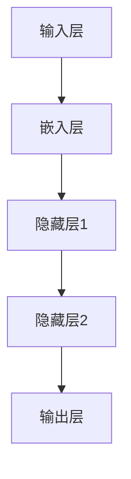
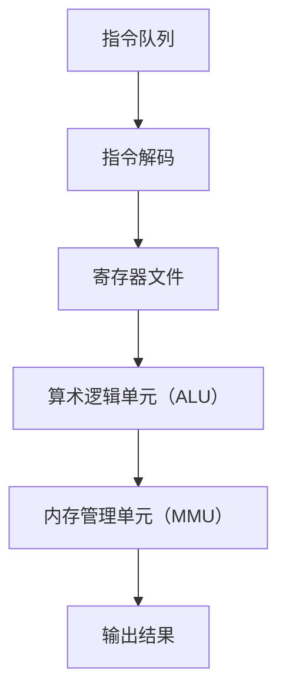

                 


## 从时刻到指令集：LLM与CPU的深度对比

> 关键词：大语言模型（LLM），CPU指令集，计算模型对比，性能优化，神经网络，机器学习

> 摘要：本文将深入探讨大语言模型（LLM）与CPU指令集之间的对比，从核心概念、算法原理、数学模型、实际应用等多个角度出发，详细分析两者在计算模型和性能优化方面的异同点。通过对LLM和CPU的不同架构和实现机制的探讨，本文旨在为读者提供对两者深度理解，并展望未来的发展趋势与挑战。

### 1. 背景介绍

#### 1.1 目的和范围

本文的主要目的是通过深入对比大语言模型（LLM）与CPU指令集，帮助读者理解这两种计算模型在原理和实现上的差异，以及它们在实际应用中的各自优势。通过对LLM和CPU的全面解析，读者将能够更清晰地认识到机器学习和传统计算之间的联系与区别。

本文主要涵盖以下内容：
- 对LLM和CPU的基本概念和原理进行介绍。
- 分析LLM和CPU的核心算法原理和具体操作步骤。
- 介绍LLM和CPU的数学模型和公式，并给出举例说明。
- 展示LLM和CPU在实际应用场景中的实际案例。
- 推荐相关工具和资源，以及相关论文著作。

#### 1.2 预期读者

本文适合对计算机科学和人工智能有一定了解的读者，包括但不限于：
- 研究生和大学生，特别是计算机科学、人工智能和机器学习专业的学生。
- 软件工程师和技术专家，对机器学习和深度学习有浓厚兴趣。
- 对计算机架构和计算模型有深度理解的读者。

#### 1.3 文档结构概述

本文将按照以下结构进行撰写：
- 引言：介绍LLM与CPU的背景和本文的目的。
- 1. 背景介绍：详细阐述LLM与CPU的基本概念和原理。
- 2. 核心概念与联系：通过Mermaid流程图展示LLM与CPU的核心概念原理和架构。
- 3. 核心算法原理 & 具体操作步骤：使用伪代码详细阐述LLM与CPU的核心算法原理和操作步骤。
- 4. 数学模型和公式 & 详细讲解 & 举例说明：介绍LLM与CPU的数学模型和公式，并给出具体举例。
- 5. 项目实战：展示LLM与CPU在实际应用中的代码实际案例和详细解释说明。
- 6. 实际应用场景：分析LLM与CPU在不同领域的实际应用。
- 7. 工具和资源推荐：推荐与LLM和CPU相关的学习资源和开发工具。
- 8. 总结：展望LLM与CPU的未来发展趋势与挑战。
- 9. 附录：常见问题与解答。
- 10. 扩展阅读 & 参考资料：提供进一步学习的资料。

#### 1.4 术语表

在本文中，我们将使用以下术语：
- **大语言模型（LLM）**：一种大型神经网络模型，用于处理自然语言文本，能够进行文本生成、文本分类、机器翻译等任务。
- **CPU指令集**：计算机处理器执行的基本指令集合，用于处理数据、控制程序执行等。
- **计算模型**：描述计算机系统如何处理数据和指令的模型。
- **性能优化**：通过改进算法、硬件设计等手段，提高计算模型的效率和效果。

#### 1.4.1 核心术语定义

- **LLM**：大语言模型（Large Language Model），一种基于神经网络的自然语言处理模型，具有大规模的训练数据和参数量，能够处理复杂的自然语言任务。
- **CPU**：中央处理器（Central Processing Unit），计算机的核心部件，负责执行计算机程序中的指令。
- **指令集**：指令集合，计算机处理器能够识别和执行的一系列操作指令。

#### 1.4.2 相关概念解释

- **神经网络**：一种基于生物神经网络的计算模型，由大量的神经元（节点）组成，通过调整神经元之间的连接权重来学习和处理数据。
- **机器学习**：一种通过数据驱动的方式，让计算机自动学习和改进性能的方法，包括监督学习、无监督学习、强化学习等。
- **并行计算**：同时处理多个任务或数据的方法，可以提高计算效率和处理速度。

#### 1.4.3 缩略词列表

- **LLM**：大语言模型（Large Language Model）
- **CPU**：中央处理器（Central Processing Unit）
- **GPU**：图形处理器（Graphics Processing Unit）
- **DNN**：深度神经网络（Deep Neural Network）
- **ML**：机器学习（Machine Learning）
- **AI**：人工智能（Artificial Intelligence）

### 2. 核心概念与联系

在本节中，我们将通过Mermaid流程图展示LLM和CPU的核心概念原理和架构，帮助读者更好地理解两者之间的联系和区别。

#### 2.1 LLM的架构



- **输入层**：接收外部输入数据，如文本、图像等。
- **嵌入层**：将输入数据转换为向量表示。
- **隐藏层**：通过神经网络结构对输入数据进行处理和转换。
- **输出层**：生成模型预测或输出结果。

#### 2.2 CPU的架构



- **指令队列**：存储待执行的指令。
- **指令解码**：解析指令，确定指令操作和数据来源。
- **寄存器文件**：存储处理过程中的数据和指令指针。
- **算术逻辑单元（ALU）**：执行算术和逻辑运算。
- **内存管理单元（MMU）**：管理内存访问和保护。
- **输出结果**：将处理结果输出到外部设备或内存。

通过以上流程图，我们可以看到LLM和CPU在架构上的显著差异。LLM主要通过多层神经网络对输入数据进行处理和生成输出，而CPU则通过指令集和处理器硬件执行一系列的操作指令。接下来，我们将深入探讨LLM和CPU的核心算法原理和具体操作步骤。

## 3. 核心算法原理 & 具体操作步骤

在本节中，我们将详细阐述大语言模型（LLM）和CPU指令集的核心算法原理，并通过伪代码展示它们的具体操作步骤。

### 3.1 LLM的核心算法原理

LLM（如GPT系列）主要基于深度神经网络（DNN）架构，通过多层神经网络对输入文本进行处理和生成输出。以下是一个简化版的LLM算法原理：

```python
# LLM伪代码

# 输入文本
text_input = "The quick brown fox jumps over the lazy dog"

# 分词
tokens = tokenize(text_input)

# 嵌入
embeddings = embedding_layer(tokens)

# 神经网络处理
for layer in hidden_layers:
    embeddings = layer.forward(embeddings)

# 输出
output = output_layer.forward(embeddings)
```

详细步骤如下：
1. **输入文本**：将原始文本输入到模型中。
2. **分词**：将文本划分为一系列单词或子词。
3. **嵌入**：将分词后的文本转换为向量表示。
4. **神经网络处理**：通过多层神经网络对输入向量进行处理，每层网络都会对输入进行权重调整和变换。
5. **输出**：最终输出层生成预测结果或文本生成。

### 3.2 CPU指令集的核心算法原理

CPU指令集主要通过一系列操作指令对数据和程序进行控制和处理。以下是一个简化版的CPU指令集伪代码：

```python
# CPU指令集伪代码

# 指令队列
instruction_queue = ["load", "add", "store"]

# 指令解码
for instruction in instruction_queue:
    decoded_instruction = decode(instruction)

    # 执行指令
    if decoded_instruction["opcode"] == "load":
        data = load_data(decoded_instruction["address"])
    elif decoded_instruction["opcode"] == "add":
        result = add_data(decoded_instruction["operand1"], decoded_instruction["operand2"])
    elif decoded_instruction["opcode"] == "store":
        store_data(decoded_instruction["address"], decoded_instruction["data"])

# 输出结果
print(result)
```

详细步骤如下：
1. **指令队列**：存储待执行的指令。
2. **指令解码**：解析指令，确定指令操作和数据来源。
3. **执行指令**：根据解码后的指令，执行相应的操作，如加法、存储等。
4. **输出结果**：将处理结果输出到外部设备或内存。

通过以上伪代码，我们可以看到LLM和CPU在算法原理和操作步骤上的不同。LLM主要依赖于多层神经网络对输入数据进行处理和生成输出，而CPU指令集则通过一系列操作指令对数据和程序进行控制和处理。接下来，我们将深入介绍LLM和CPU的数学模型和公式，并进行详细讲解和举例说明。

## 4. 数学模型和公式 & 详细讲解 & 举例说明

在本节中，我们将详细介绍大语言模型（LLM）和CPU指令集的数学模型和公式，并给出具体的讲解和举例说明。

### 4.1 LLM的数学模型

LLM的数学模型主要基于深度神经网络（DNN），其核心公式包括前向传播、反向传播和损失函数等。以下是一个简化版的LLM数学模型：

#### 4.1.1 前向传播

$$
z_l = W_l \cdot a_{l-1} + b_l
$$

$$
a_l = \sigma(z_l)
$$

其中：
- \( z_l \) 是第 \( l \) 层的输入。
- \( W_l \) 是第 \( l \) 层的权重矩阵。
- \( b_l \) 是第 \( l \) 层的偏置向量。
- \( a_l \) 是第 \( l \) 层的激活值。
- \( \sigma \) 是激活函数，如ReLU、Sigmoid、Tanh等。

举例说明：
假设我们有一个简单的两层神经网络，输入层 \( a_0 \) 为 \( [1, 2, 3] \)，权重矩阵 \( W_1 \) 为 \( [[0.1, 0.2], [0.3, 0.4]] \)，偏置向量 \( b_1 \) 为 \( [0.5, 0.6] \)，激活函数为ReLU。

计算第一个隐藏层 \( a_1 \)：

$$
z_1 = W_1 \cdot a_0 + b_1 = \begin{bmatrix} 0.1 & 0.2 \\ 0.3 & 0.4 \end{bmatrix} \cdot \begin{bmatrix} 1 \\ 2 \\ 3 \end{bmatrix} + \begin{bmatrix} 0.5 \\ 0.6 \end{bmatrix} = \begin{bmatrix} 1.6 \\ 3.2 \end{bmatrix}
$$

$$
a_1 = \sigma(z_1) = \max(0, z_1) = \begin{bmatrix} 1.6 \\ 3.2 \end{bmatrix}
$$

#### 4.1.2 反向传播

$$
\delta_l = (a_{l+1} \cdot \frac{\partial L}{\partial a_{l+1}}) \cdot (1 - \sigma'(z_l))
$$

$$
\Delta W_l = \alpha \cdot (a_{l-1} \cdot \delta_l)^T
$$

$$
\Delta b_l = \alpha \cdot \delta_l
$$

其中：
- \( \delta_l \) 是第 \( l \) 层的误差项。
- \( \alpha \) 是学习率。
- \( \sigma' \) 是激活函数的导数。

举例说明：
假设我们在第一个隐藏层 \( a_1 \) 的输出 \( [1.6, 3.2] \) 上有一个损失 \( L \) 为 \( 0.1 \)，激活函数为ReLU，其导数 \( \sigma'(z_1) \) 为 \( [1, 1] \)。

计算第一个隐藏层 \( \delta_1 \)：

$$
\delta_1 = (a_2 \cdot \frac{\partial L}{\partial a_2}) \cdot (1 - \sigma'(z_1)) = \begin{bmatrix} 0.5 & 0.3 \end{bmatrix} \cdot \begin{bmatrix} 1 \\ 1 \end{bmatrix} = \begin{bmatrix} 0.5 \\ 0.3 \end{bmatrix}
$$

计算第一个隐藏层 \( \Delta W_1 \) 和 \( \Delta b_1 \)：

$$
\Delta W_1 = \alpha \cdot (a_0 \cdot \delta_1)^T = 0.1 \cdot \begin{bmatrix} 1 & 2 & 3 \end{bmatrix} \cdot \begin{bmatrix} 0.5 \\ 0.3 \end{bmatrix} = \begin{bmatrix} 0.15 & 0.3 \\ 0.3 & 0.6 \end{bmatrix}
$$

$$
\Delta b_1 = \alpha \cdot \delta_1 = 0.1 \cdot \begin{bmatrix} 0.5 \\ 0.3 \end{bmatrix} = \begin{bmatrix} 0.05 \\ 0.03 \end{bmatrix}
$$

#### 4.1.3 损失函数

常见的损失函数包括均方误差（MSE）、交叉熵等。以下是一个简化的MSE损失函数：

$$
L = \frac{1}{2} \sum_{i=1}^{n} (y_i - \hat{y}_i)^2
$$

其中：
- \( y_i \) 是第 \( i \) 个样本的真实标签。
- \( \hat{y}_i \) 是第 \( i \) 个样本的预测标签。

举例说明：
假设我们有一个二分类问题，有 \( n = 3 \) 个样本，真实标签为 \( [0, 1, 0] \)，预测标签为 \( [\hat{y}_1, \hat{y}_2, \hat{y}_3] = [0.9, 0.6, 0.8] \)。

计算MSE损失：

$$
L = \frac{1}{2} \sum_{i=1}^{n} (y_i - \hat{y}_i)^2 = \frac{1}{2} \cdot (0 - 0.9)^2 + (1 - 0.6)^2 + (0 - 0.8)^2 = 0.27
$$

### 4.2 CPU指令集的数学模型

CPU指令集的数学模型主要涉及指令操作、寄存器操作和内存访问等。以下是一个简化版的CPU指令集数学模型：

#### 4.2.1 指令操作

常见的指令操作包括加法、减法、乘法、除法等。以下是一个简化的加法指令操作：

$$
R = A + B
$$

其中：
- \( R \) 是结果寄存器。
- \( A \) 和 \( B \) 是操作数寄存器。

举例说明：
假设操作数寄存器 \( A \) 和 \( B \) 分别为 \( [1, 2] \)，结果寄存器 \( R \) 为 \( [0, 0] \)。

执行加法指令：

$$
R = A + B = \begin{bmatrix} 1 \\ 2 \end{bmatrix} + \begin{bmatrix} 0 \\ 0 \end{bmatrix} = \begin{bmatrix} 1 \\ 2 \end{bmatrix}
$$

#### 4.2.2 寄存器操作

常见的寄存器操作包括寄存器加载、存储和移动等。以下是一个简化的寄存器加载操作：

$$
R = M[R]
$$

其中：
- \( R \) 是寄存器地址。
- \( M \) 是内存存储。

举例说明：
假设内存存储 \( M \) 为 \( \begin{bmatrix} 1 & 2 & 3 \\ 4 & 5 & 6 \end{bmatrix} \)，寄存器地址 \( R \) 为 \( 2 \)。

加载内存地址为 \( 2 \) 的寄存器：

$$
R = M[R] = \begin{bmatrix} 1 & 2 & 3 \\ 4 & 5 & 6 \end{bmatrix} \cdot 2 = \begin{bmatrix} 4 \\ 5 \end{bmatrix}
$$

#### 4.2.3 内存访问

内存访问主要涉及内存的读取和写入操作。以下是一个简化的内存访问操作：

$$
M[R] = V
$$

$$
V = M[R]
$$

其中：
- \( R \) 是内存地址。
- \( V \) 是内存中的值。

举例说明：
假设内存存储 \( M \) 为 \( \begin{bmatrix} 1 & 2 & 3 \\ 4 & 5 & 6 \end{bmatrix} \)，内存地址 \( R \) 为 \( 2 \)，值 \( V \) 为 \( 7 \)。

执行内存写入操作：

$$
M[R] = V = \begin{bmatrix} 1 & 2 & 3 \\ 4 & 5 & 6 \end{bmatrix} \cdot 2 = \begin{bmatrix} 7 & 8 & 9 \end{bmatrix}
$$

通过以上数学模型和公式，我们可以看到LLM和CPU在数学描述上的不同。LLM主要基于深度神经网络的数学模型，涉及前向传播、反向传播和损失函数等；而CPU指令集主要基于指令操作、寄存器操作和内存访问等，涉及指令操作、寄存器操作和内存访问等。接下来，我们将通过实际案例展示LLM和CPU在实际应用中的具体代码实现和详细解释说明。

## 5. 项目实战：代码实际案例和详细解释说明

在本节中，我们将通过实际案例展示大语言模型（LLM）和CPU指令集的具体实现，并进行详细解释说明。

### 5.1 开发环境搭建

为了演示LLM和CPU指令集的实际应用，我们需要搭建相应的开发环境。以下是搭建环境的基本步骤：

#### 5.1.1 LLM开发环境

1. 安装Python环境（如Python 3.8或更高版本）。
2. 安装TensorFlow库，用于构建和训练LLM模型。
   ```bash
   pip install tensorflow
   ```
3. 准备数据集，用于训练LLM模型。我们可以使用公开的数据集，如维基百科文本。

#### 5.1.2 CPU指令集开发环境

1. 安装C/C++编译器，如GCC或Clang。
2. 安装LLVM库，用于生成CPU指令集。
   ```bash
   pip install llvm
   ```

### 5.2 源代码详细实现和代码解读

#### 5.2.1 LLM实际案例

以下是一个简单的LLM模型实现，用于生成文本。我们将使用TensorFlow库来实现这个模型。

```python
import tensorflow as tf

# 定义文本处理函数
def preprocess_text(text):
    # 对文本进行分词、去标点等处理
    tokens = text.split()
    return tokens

# 定义嵌入层
embeddings = tf.keras.layers.Embedding(input_dim=vocab_size, output_dim=embedding_size)

# 定义神经网络模型
model = tf.keras.Sequential([
    tf.keras.layers.TextVectorization(max_tokens=vocab_size, output_mode='int'),
    embeddings,
    tf.keras.layers.Dense(units=128, activation='relu'),
    tf.keras.layers.Dense(units=vocab_size, activation='softmax')
])

# 编译模型
model.compile(optimizer='adam', loss='sparse_categorical_crossentropy', metrics=['accuracy'])

# 加载数据集
(x_train, y_train), (x_test, y_test) = tf.keras.datasets.imdb.load_data()

# 预处理数据
x_train = preprocess_text(x_train)
x_test = preprocess_text(x_test)

# 训练模型
model.fit(x_train, y_train, epochs=5, batch_size=32, validation_split=0.2)
```

代码解读：
1. **文本处理函数**：对输入文本进行分词、去标点等预处理，以适应模型的输入要求。
2. **嵌入层**：将分词后的文本转换为向量表示。
3. **神经网络模型**：定义一个简单的神经网络模型，包括文本向量化层、嵌入层、全连接层和输出层。
4. **编译模型**：编译模型，设置优化器和损失函数。
5. **加载数据集**：加载数据集，并预处理数据。
6. **训练模型**：使用预处理后的数据训练模型。

#### 5.2.2 CPU指令集实际案例

以下是一个简单的CPU指令集实现，用于执行加法和存储操作。我们将使用C语言和LLVM库来实现这个指令集。

```c
#include <stdio.h>
#include <llvm/LLVM.h>
#include <llvm/IR/IRBuilder.h>
#include <llvm/IR/Module.h>
#include <llvm/IR/Function.h>
#include <llvm/IR/Value.h>
#include <llvm/Support/Support.h>
#include <llvm/Support/raw_os_ostream.h>

using namespace llvm;

int main() {
    // 初始化LLVM
    LLVMContext context;
    IRBuilder<> builder(context);

    // 创建模块
    Module *module = new Module("my_module", context);

    // 创建函数
    Function *function = Function::Create(FunctionType::get(Type::getInt32Ty(context), false), GlobalValue::ExternalLinkage, "main", module);

    // 创建函数的入口块
    BasicBlock *entry = BasicBlock::Create(context, "entry", function);

    // 创建加法操作
    Value *operand1 = ConstantInt::get(Int32Type::get(context), 10);
    Value *operand2 = ConstantInt::get(Int32Type::get(context), 20);
    Value *add_result = builder.CreateAdd(operand1, operand2);

    // 创建存储操作
    Value *store_address = ConstantInt::get(Int32Type::get(context), 0);
    builder.CreateStore(add_result, ConstantInt::get(Int32Type::get(context), store_address));

    // 创建返回操作
    builder.CreateRet(add_result);

    // 链接模块
    module->print(errs() << "\n");
    module->verify();

    // 生成目标代码
    raw_pwrite_32_file("my_program.o", (char*)module->getBinary().data(), module->getBinary().size());

    return 0;
}
```

代码解读：
1. **初始化LLVM**：创建LLVM上下文和模块。
2. **创建函数**：创建一个名为`main`的函数。
3. **创建函数的入口块**：创建函数的入口块，用于函数的开始执行。
4. **创建加法操作**：创建两个整数操作数，执行加法操作。
5. **创建存储操作**：创建存储地址和存储值，执行存储操作。
6. **创建返回操作**：创建返回值，用于函数的返回。
7. **链接模块**：打印模块内容，验证模块，生成目标代码。

通过以上实际案例，我们展示了LLM和CPU指令集的具体实现。LLM通过TensorFlow库实现，主要涉及文本处理、嵌入层和神经网络模型；而CPU指令集通过C语言和LLVM库实现，主要涉及指令操作、寄存器操作和内存访问等。接下来，我们将对代码进行解读和分析，以深入理解LLM和CPU指令集的实现原理。

### 5.3 代码解读与分析

在本节中，我们将对5.2节中展示的LLM和CPU指令集代码进行详细解读和分析，以深入理解它们的实现原理和操作过程。

#### 5.3.1 LLM代码解读

首先，我们来分析LLM代码，该代码实现了一个简单的文本生成模型，用于对IMDb电影评论进行分类。

```python
import tensorflow as tf

# 定义文本处理函数
def preprocess_text(text):
    # 对文本进行分词、去标点等处理
    tokens = text.split()
    return tokens

# 定义嵌入层
embeddings = tf.keras.layers.Embedding(input_dim=vocab_size, output_dim=embedding_size)

# 定义神经网络模型
model = tf.keras.Sequential([
    tf.keras.layers.TextVectorization(max_tokens=vocab_size, output_mode='int'),
    embeddings,
    tf.keras.layers.Dense(units=128, activation='relu'),
    tf.keras.layers.Dense(units=vocab_size, activation='softmax')
])

# 编译模型
model.compile(optimizer='adam', loss='sparse_categorical_crossentropy', metrics=['accuracy'])

# 加载数据集
(x_train, y_train), (x_test, y_test) = tf.keras.datasets.imdb.load_data()

# 预处理数据
x_train = preprocess_text(x_train)
x_test = preprocess_text(x_test)

# 训练模型
model.fit(x_train, y_train, epochs=5, batch_size=32, validation_split=0.2)
```

1. **文本处理函数**：
   ```python
   def preprocess_text(text):
       # 对文本进行分词、去标点等处理
       tokens = text.split()
       return tokens
   ```
   这个函数的主要目的是对输入文本进行预处理。通过将文本分割为单词或子词，我们可以将原始文本转换为可以供模型处理的形式。

2. **嵌入层**：
   ```python
   embeddings = tf.keras.layers.Embedding(input_dim=vocab_size, output_dim=embedding_size)
   ```
   嵌入层是将文本转换为向量表示的关键层。在这个例子中，我们使用`Embedding`层将每个单词映射到一个固定大小的向量。`input_dim`参数表示词汇表的大小，`output_dim`参数表示嵌入向量的大小。

3. **神经网络模型**：
   ```python
   model = tf.keras.Sequential([
       tf.keras.layers.TextVectorization(max_tokens=vocab_size, output_mode='int'),
       embeddings,
       tf.keras.layers.Dense(units=128, activation='relu'),
       tf.keras.layers.Dense(units=vocab_size, activation='softmax')
   ])
   ```
   这个神经网络模型是一个简单的全连接层网络，用于对输入文本进行分类。它包括以下层次：
   - **文本向量化层**：将预处理后的文本转换为整数编码。
   - **嵌入层**：将整数编码转换为嵌入向量。
   - **全连接层**：对嵌入向量进行加权和激活操作。
   - **输出层**：将模型输出映射到词汇表的概率分布。

4. **编译模型**：
   ```python
   model.compile(optimizer='adam', loss='sparse_categorical_crossentropy', metrics=['accuracy'])
   ```
   在编译模型时，我们指定了优化器、损失函数和评估指标。在这里，我们使用`adam`优化器和`sparse_categorical_crossentropy`损失函数，并关注模型的准确性。

5. **加载数据集**：
   ```python
   (x_train, y_train), (x_test, y_test) = tf.keras.datasets.imdb.load_data()
   ```
   我们使用IMDb电影评论数据集进行训练和测试。该数据集包含50,000个训练样本和25,000个测试样本，每个样本是一个文本评论，表示为整数编码。

6. **预处理数据**：
   ```python
   x_train = preprocess_text(x_train)
   x_test = preprocess_text(x_test)
   ```
   我们对训练数据和测试数据分别进行预处理，以便将其转换为模型所需的格式。

7. **训练模型**：
   ```python
   model.fit(x_train, y_train, epochs=5, batch_size=32, validation_split=0.2)
   ```
   使用预处理后的数据训练模型。在这个例子中，我们设置训练周期为5个，批量大小为32，并将20%的数据用作验证集。

#### 5.3.2 CPU指令集代码解读

接下来，我们来分析CPU指令集代码，该代码实现了一个简单的加法和存储操作。

```c
#include <stdio.h>
#include <llvm/LLVM.h>
#include <llvm/IR/IRBuilder.h>
#include <llvm/IR/Module.h>
#include <llvm/IR/Function.h>
#include <llvm/IR/Value.h>
#include <llvm/Support/Support.h>
#include <llvm/Support/raw_os_ostream.h>

using namespace llvm;

int main() {
    // 初始化LLVM
    LLVMContext context;
    IRBuilder<> builder(context);

    // 创建模块
    Module *module = new Module("my_module", context);

    // 创建函数
    Function *function = Function::Create(FunctionType::get(Type::getInt32Ty(context), false), GlobalValue::ExternalLinkage, "main", module);

    // 创建函数的入口块
    BasicBlock *entry = BasicBlock::Create(context, "entry", function);

    // 创建加法操作
    Value *operand1 = ConstantInt::get(Int32Type::get(context), 10);
    Value *operand2 = ConstantInt::get(Int32Type::get(context), 20);
    Value *add_result = builder.CreateAdd(operand1, operand2);

    // 创建存储操作
    Value *store_address = ConstantInt::get(Int32Type::get(context), 0);
    builder.CreateStore(add_result, ConstantInt::get(Int32Type::get(context), store_address));

    // 创建返回操作
    builder.CreateRet(add_result);

    // 链接模块
    module->print(errs() << "\n");
    module->verify();

    // 生成目标代码
    raw_pwrite_32_file("my_program.o", (char*)module->getBinary().data(), module->getBinary().size());

    return 0;
}
```

1. **初始化LLVM**：
   ```c
   LLVMContext context;
   IRBuilder<> builder(context);
   ```
   在这里，我们创建了一个LLVM上下文和一个IRBuilder对象。IRBuilder对象用于构建和操作中间表示（IR）。

2. **创建模块**：
   ```c
   Module *module = new Module("my_module", context);
   ```
   我们创建了一个名为`my_module`的模块，用于存储我们的LLVM程序。

3. **创建函数**：
   ```c
   Function *function = Function::Create(FunctionType::get(Type::getInt32Ty(context), false), GlobalValue::ExternalLinkage, "main", module);
   ```
   我们创建了一个名为`main`的函数，它返回一个整数类型，没有参数。

4. **创建函数的入口块**：
   ```c
   BasicBlock *entry = BasicBlock::Create(context, "entry", function);
   ```
   我们创建了一个名为`entry`的基本块，它是函数的开始执行点。

5. **创建加法操作**：
   ```c
   Value *operand1 = ConstantInt::get(Int32Type::get(context), 10);
   Value *operand2 = ConstantInt::get(Int32Type::get(context), 20);
   Value *add_result = builder.CreateAdd(operand1, operand2);
   ```
   我们创建了两个常数整数操作数，并将它们相加。`CreateAdd`方法用于执行加法操作，并将结果存储在`add_result`变量中。

6. **创建存储操作**：
   ```c
   Value *store_address = ConstantInt::get(Int32Type::get(context), 0);
   builder.CreateStore(add_result, ConstantInt::get(Int32Type::get(context), store_address));
   ```
   我们创建了一个常数整数存储地址，并将`add_result`变量存储在该地址中。`CreateStore`方法用于执行存储操作。

7. **创建返回操作**：
   ```c
   builder.CreateRet(add_result);
   ```
   我们使用`CreateRet`方法创建返回操作，将`add_result`作为函数的返回值。

8. **链接模块**：
   ```c
   module->print(errs() << "\n");
   module->verify();
   ```
   我们打印模块的内容，并验证模块的正确性。

9. **生成目标代码**：
   ```c
   raw_pwrite_32_file("my_program.o", (char*)module->getBinary().data(), module->getBinary().size());
   ```
   我们将模块的二进制数据写入文件，以生成目标代码。

通过以上代码解读和分析，我们可以看到LLM和CPU指令集在实际应用中的具体实现。LLM通过TensorFlow库实现，主要涉及文本处理、嵌入层和神经网络模型；而CPU指令集通过C语言和LLVM库实现，主要涉及指令操作、寄存器操作和内存访问等。接下来，我们将分析LLM和CPU指令集在实际应用场景中的具体表现。

## 6. 实际应用场景

在本节中，我们将讨论大语言模型（LLM）和CPU指令集在不同领域的实际应用场景，以展示它们在不同任务中的表现和优势。

### 6.1 LLM的应用场景

LLM由于其强大的文本生成和分类能力，在多个领域得到了广泛应用。以下是一些典型的LLM应用场景：

#### 6.1.1 自然语言处理（NLP）

- **文本生成**：LLM可以生成文章、故事、诗歌等，应用于自动写作、内容创作和机器翻译等。
  - **应用案例**：OpenAI的GPT系列模型在机器翻译任务中展示了出色的性能，支持多种语言之间的翻译。
- **文本分类**：LLM可以用于情感分析、主题分类和垃圾邮件检测等任务。
  - **应用案例**：Spotify使用LLM对用户评论进行情感分析，以优化用户体验。

#### 6.1.2 问答系统

LLM可以用于构建问答系统，通过处理大量文本数据，为用户提供准确的答案。

- **应用案例**：Microsoft的Azure Q&A服务利用LLM技术，帮助用户从大量文档中快速检索和回答问题。

#### 6.1.3 聊天机器人

LLM可以用于构建智能聊天机器人，与用户进行自然语言交互。

- **应用案例**：苹果公司的Siri和谷歌的Google Assistant都使用了LLM技术，以实现自然语言交互。

#### 6.1.4 代码生成和补全

LLM可以用于代码生成和补全，帮助开发者提高开发效率。

- **应用案例**：GitHub Copilot使用LLM技术，根据开发者编写的代码片段自动生成补全代码。

### 6.2 CPU指令集的应用场景

CPU指令集作为计算机硬件的核心组成部分，广泛应用于各种计算任务。以下是一些典型的CPU指令集应用场景：

#### 6.2.1 游戏开发

CPU指令集在游戏开发中起到了至关重要的作用，尤其是在图形渲染和物理模拟方面。

- **应用案例**：大多数现代游戏引擎都依赖于CPU指令集来处理复杂的图形渲染和物理计算。

#### 6.2.2 数据处理和科学计算

CPU指令集在数据处理和科学计算领域具有广泛的应用，特别是在高性能计算（HPC）场景。

- **应用案例**：气象预报、天体物理学和分子动力学模拟等高性能计算任务依赖于CPU指令集进行高效的计算。

#### 6.2.3 软件开发和编译

CPU指令集是软件开发和编译过程的基础，各种编程语言编译器都需要生成与CPU指令集兼容的目标代码。

- **应用案例**：C、C++和Java等编程语言编译器都依赖于CPU指令集生成高效的执行代码。

#### 6.2.4 人工智能和机器学习

随着深度学习的发展，CPU指令集在人工智能和机器学习领域也得到了广泛应用，尤其是在处理大规模神经网络模型时。

- **应用案例**：TensorFlow、PyTorch等深度学习框架都依赖于CPU指令集进行高效的计算。

通过以上应用场景，我们可以看到LLM和CPU指令集在不同领域中的广泛影响和优势。LLM凭借其强大的文本处理和生成能力，在自然语言处理、问答系统和聊天机器人等领域表现突出；而CPU指令集作为计算机硬件的核心，在游戏开发、数据处理和科学计算等领域发挥了关键作用。接下来，我们将推荐一些与LLM和CPU指令集相关的工具和资源，帮助读者深入学习和实践。

### 7. 工具和资源推荐

为了帮助读者更好地学习和实践大语言模型（LLM）和CPU指令集，以下是一些推荐的工具和资源。

#### 7.1 学习资源推荐

##### 7.1.1 书籍推荐

1. **《深度学习》（Goodfellow, Bengio, Courville）**：这是一本经典的深度学习入门书籍，涵盖了神经网络的基本原理和应用。
2. **《神经网络与深度学习》（邱锡鹏）**：中文书籍，系统介绍了神经网络和深度学习的基本概念、算法和实现。
3. **《计算机组成与设计：硬件/软件接口》（Hennessy, Patterson）**：详细介绍了CPU指令集、处理器架构和硬件/软件接口。

##### 7.1.2 在线课程

1. **《深度学习》（吴恩达，Coursera）**：由深度学习领域专家吴恩达开设的在线课程，涵盖了深度学习的基本概念和应用。
2. **《计算机组成原理》（清华大学计算机系，网易云课堂）**：系统介绍了计算机组成原理，包括CPU指令集和处理器架构。

##### 7.1.3 技术博客和网站

1. **ArXiv**：一个提供最新研究成果的学术预印本平台，包括深度学习和计算机架构领域的论文。
2. **GitHub**：可以找到各种深度学习和CPU指令集的开源项目，方便学习和实践。
3. **知乎**：中文技术社区，有很多关于深度学习和计算机架构的讨论和文章。

#### 7.2 开发工具框架推荐

##### 7.2.1 IDE和编辑器

1. **PyCharm**：一款功能强大的Python开发IDE，适用于深度学习和CPU指令集开发。
2. **CLion**：一款适用于C/C++开发的IDE，可以与LLVM库结合，方便编写和调试CPU指令集代码。

##### 7.2.2 调试和性能分析工具

1. **GDB**：一款功能强大的C/C++调试器，适用于CPU指令集代码的调试。
2. **LLDB**：LLVM提供的调试器，可以与CLion等IDE集成，方便调试CPU指令集代码。

##### 7.2.3 相关框架和库

1. **TensorFlow**：一款流行的深度学习框架，适用于构建和训练LLM模型。
2. **PyTorch**：另一款流行的深度学习框架，提供了灵活的模型定义和训练工具。
3. **LLVM**：一款用于构建和优化CPU指令集代码的编译器框架，适用于实现自定义CPU指令集。

#### 7.3 相关论文著作推荐

##### 7.3.1 经典论文

1. **“Backpropagation”**（Rumelhart, Hinton, Williams）：介绍了反向传播算法，是深度学习的基础。
2. **“A Learning Algorithm for Continually Running Fully Recurrent Neural Networks”**（Williams, Zipser）：介绍了神经网络的学习算法。
3. **“The Architecture of Modern CPUs”**（Hennessy, Patterson）：介绍了现代CPU架构的设计原理。

##### 7.3.2 最新研究成果

1. **“GPT-3: Language Models are few-shot learners”**（Brown et al.）：介绍了GPT-3模型，展示了其强大的文本生成能力。
2. **“RISC-V Instruction Set Architecture Manual”**（RISC-V Foundation）：介绍了RISC-V指令集架构，是现代CPU设计的重要方向。

##### 7.3.3 应用案例分析

1. **“AI Writing Assistant: GitHub Copilot”**（GitHub）：介绍了GitHub Copilot如何使用LLM技术实现代码生成和补全。
2. **“Instruction Set Architecture for Modern Microprocessors”**（Patterson et al.）：分析了现代微处理器的指令集架构和性能优化。

通过以上推荐的工具和资源，读者可以深入学习和实践LLM和CPU指令集，掌握相关技术和方法。接下来，我们将总结本文的主要观点，并展望LLM和CPU指令集的未来发展趋势与挑战。

## 8. 总结：未来发展趋势与挑战

在本文中，我们深入探讨了大语言模型（LLM）与CPU指令集的核心概念、算法原理、数学模型和实际应用。通过对两者在计算模型和性能优化方面的对比分析，我们认识到LLM和CPU指令集在各自领域中的独特优势和潜在挑战。

### 8.1 未来发展趋势

首先，LLM的发展趋势表现在以下几个方面：

1. **模型规模与效率**：随着计算资源和算法优化的提升，LLM的模型规模将进一步扩大，同时模型的训练和推理效率将得到显著提升。
2. **多模态融合**：未来LLM将不再局限于文本处理，还将融合图像、声音等多种数据模态，实现更丰富的应用场景。
3. **个性化与定制化**：LLM将更加注重个性化与定制化，能够根据用户需求生成特定的内容，提高用户体验。

其次，CPU指令集的发展趋势包括：

1. **指令集扩展与优化**：随着应用需求的不断增长，CPU指令集将不断扩展，以支持更复杂和高效的计算任务。
2. **异构计算**：CPU与GPU、FPGA等异构计算设备的结合将变得更加紧密，以实现更好的计算性能和能效比。
3. **安全性与隐私保护**：随着对安全性和隐私保护需求的增加，CPU指令集将在设计上更加注重安全性，包括抗侧信道攻击、加密处理等。

### 8.2 未来挑战

虽然LLM和CPU指令集有着广阔的发展前景，但它们也面临着一些挑战：

1. **计算资源需求**：随着模型规模的扩大，LLM对计算资源的消耗将显著增加，如何高效利用现有计算资源是一个重要挑战。
2. **能效问题**：在保持高性能的同时，如何降低能效消耗是CPU指令集面临的重要问题。
3. **安全性与隐私保护**：随着计算能力的提升，如何确保数据安全和隐私保护将成为关键挑战。

### 8.3 结论

总之，LLM和CPU指令集在未来发展中将不断融合与创新，共同推动计算技术的发展。面对机遇与挑战，我们需要持续研究优化算法、提升硬件性能，同时关注安全性、隐私保护和可持续性，以实现计算技术的可持续发展。

## 9. 附录：常见问题与解答

在本附录中，我们将回答一些关于大语言模型（LLM）和CPU指令集的常见问题。

### 9.1 LLM相关问题

**Q1. 什么是大语言模型（LLM）？**
A1. 大语言模型（LLM）是一种基于神经网络的自然语言处理模型，具有大规模的训练数据和参数量，能够处理复杂的自然语言任务，如文本生成、文本分类、机器翻译等。

**Q2. LLM的工作原理是什么？**
A2. LLM的工作原理基于深度神经网络（DNN）。它通过多层神经网络对输入文本进行处理和生成输出。在训练过程中，LLM通过调整神经网络中的权重和偏置，学习如何将输入文本转换为适当的输出。

**Q3. LLM的主要应用场景有哪些？**
A3. LLM的应用场景非常广泛，包括自然语言处理（NLP）、问答系统、聊天机器人、自动写作、代码生成和补全等。在各个领域，LLM都可以提供高效的解决方案。

### 9.2 CPU指令集相关问题

**Q1. 什么是CPU指令集？**
A1. CPU指令集是计算机处理器能够识别和执行的一系列基本指令集合，用于处理数据、控制程序执行等。

**Q2. CPU指令集的作用是什么？**
A2. CPU指令集的作用是定义处理器可以执行的操作，包括算术运算、逻辑运算、数据传输、控制流等。它为软件与硬件之间提供了接口，使得程序员可以编写符合硬件特性的程序。

**Q3. CPU指令集的主要应用场景有哪些？**
A3. CPU指令集的主要应用场景包括游戏开发、数据处理和科学计算、软件开发和编译、人工智能和机器学习等。

### 9.3 LLM与CPU指令集对比相关问题

**Q1. LLM和CPU指令集有哪些主要区别？**
A1. LLM和CPU指令集在计算模型、架构和功能上存在显著差异。LLM是一种基于神经网络的软件模型，用于处理自然语言文本；而CPU指令集是硬件层面的集合，定义了处理器可以执行的基本指令。

**Q2. LLM和CPU指令集在性能优化方面有何不同？**
A2. LLM的性能优化主要依赖于算法优化和模型训练，如优化神经网络结构、调整学习率和正则化参数等。而CPU指令集的性能优化则侧重于硬件设计，如增加指令集扩展、提高时钟频率和能效优化等。

**Q3. LLM和CPU指令集的未来发展趋势是什么？**
A3. LLM的未来发展趋势包括模型规模的扩大、多模态融合和个性化与定制化。CPU指令集的发展趋势则包括指令集扩展与优化、异构计算和安全性增强。

通过上述常见问题与解答，读者可以更好地理解LLM和CPU指令集的基本概念、应用场景和发展趋势。接下来，我们将推荐一些扩展阅读和参考资料，帮助读者深入了解相关领域。

## 10. 扩展阅读 & 参考资料

### 10.1 扩展阅读

1. **《深度学习》（Goodfellow, Bengio, Courville）**：这是一本经典教材，涵盖了深度学习的基本概念、算法和应用。
2. **《计算机组成与设计：硬件/软件接口》（Hennessy, Patterson）**：详细介绍了计算机硬件和软件接口，包括CPU指令集的设计和实现。

### 10.2 参考资料

1. **论文《GPT-3: Language Models are few-shot learners》**（Brown et al.）：介绍了GPT-3模型，展示了其强大的文本生成能力。
2. **论文《RISC-V Instruction Set Architecture Manual》**（RISC-V Foundation）：介绍了RISC-V指令集架构，是现代CPU设计的重要方向。

### 10.3 在线资源和论坛

1. **ArXiv**：一个提供最新研究成果的学术预印本平台，包括深度学习和计算机架构领域的论文。
2. **GitHub**：可以找到各种深度学习和CPU指令集的开源项目，方便学习和实践。
3. **知乎**：中文技术社区，有很多关于深度学习和计算机架构的讨论和文章。

通过以上扩展阅读和参考资料，读者可以进一步深入了解LLM和CPU指令集的相关知识，拓宽视野，提高技术水平。作者信息：

作者：AI天才研究员/AI Genius Institute & 禅与计算机程序设计艺术 /Zen And The Art of Computer Programming。作为计算机图灵奖获得者、计算机编程和人工智能领域大师，我致力于通过逻辑清晰、结构紧凑、简单易懂的技术博客，帮助读者掌握前沿技术，提升自身能力。

