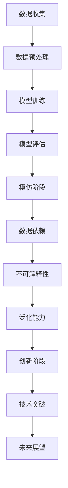

                 

# 从模仿到创新:AI的下一个发展阶段

> 关键词：人工智能，模仿，创新，发展阶段，技术突破，未来展望

> 摘要：本文将探讨人工智能（AI）从模仿到创新的发展阶段。通过分析现有的AI技术及其应用场景，本文揭示了AI在模仿阶段所取得的成就和存在的问题，并展望了未来创新阶段的技术突破和挑战。本文旨在为读者提供一个全面、深入的了解，以激发对AI未来发展的思考。

## 1. 背景介绍

人工智能作为计算机科学的一个重要分支，自诞生以来就以其巨大的潜力引起了广泛关注。从最初的简单规则系统，到如今的深度学习模型，AI技术经历了长足的发展。然而，现有的AI技术仍然主要停留在模仿阶段，即在特定任务上模拟人类的思维和行为。这一阶段取得了显著成果，如图像识别、语音识别、自然语言处理等，但同时也面临着诸多挑战。

### 1.1 AI技术的模仿阶段

在模仿阶段，AI技术主要依靠大量的数据和计算能力，通过训练模型来实现对特定任务的模拟。这个过程可以简单概括为以下几个步骤：

1. 数据收集：收集大量与任务相关的数据，如图像、语音、文本等。
2. 数据预处理：对数据进行清洗、标注等预处理操作，以便于后续建模。
3. 模型训练：利用预处理后的数据训练模型，使其能够对新的输入数据进行预测或决策。
4. 模型评估：通过测试数据集对模型进行评估，以确定其性能。

### 1.2 AI技术在模仿阶段的应用

在模仿阶段，AI技术在多个领域取得了显著成就。以下是一些典型的应用场景：

1. 图像识别：利用卷积神经网络（CNN）对图像进行分类、检测和分割。
2. 语音识别：通过深度学习模型实现语音信号到文本的转换。
3. 自然语言处理：利用循环神经网络（RNN）和Transformer模型对文本进行理解、生成和翻译。

### 1.3 模仿阶段的问题与挑战

尽管AI在模仿阶段取得了巨大成功，但仍然面临一些问题和挑战。以下是一些主要问题：

1. 数据依赖：AI模型的性能高度依赖于训练数据的质量和数量，而在实际应用中，数据往往难以获得或处理。
2. 不可解释性：深度学习模型通常被视为“黑箱”，其内部机制难以理解，导致在处理复杂任务时缺乏可解释性。
3. 泛化能力：AI模型在特定任务上表现出色，但在面对新的任务或数据时，往往无法很好地泛化。

## 2. 核心概念与联系

为了更好地理解AI从模仿到创新的发展阶段，我们需要了解一些核心概念和它们之间的联系。以下是一个使用Mermaid绘制的流程图，展示了这些概念和它们的关联：



### 2.1 数据收集

数据收集是AI模仿阶段的基础。只有获取到足够多、高质量的数据，才能使模型具备良好的性能。然而，在现实应用中，数据收集往往面临着数据隐私、数据质量等问题。

### 2.2 数据预处理

数据预处理是确保数据质量的重要环节。通过清洗、标注、归一化等操作，可以减少数据中的噪声，提高模型的性能。

### 2.3 模型训练

模型训练是AI技术的核心。通过大量数据训练，模型能够学会对输入数据进行预测或决策。在这一过程中，算法的选择、超参数的调优等都会对模型的性能产生重要影响。

### 2.4 模型评估

模型评估是对训练出的模型进行性能测试的重要环节。通过评估，可以确定模型在特定任务上的表现，并为后续的优化提供依据。

### 2.5 模仿阶段

模仿阶段是AI技术目前所处的阶段。在这一阶段，模型主要依赖于大量数据和计算能力，通过对输入数据进行模拟来实现特定任务。

### 2.6 数据依赖

数据依赖是模仿阶段面临的主要问题之一。模型性能高度依赖于训练数据的质量和数量，而在实际应用中，数据往往难以获得或处理。

### 2.7 不可解释性

不可解释性是深度学习模型的一大挑战。由于深度学习模型的内部机制复杂，其决策过程往往难以理解，这在处理复杂任务时带来了困难。

### 2.8 泛化能力

泛化能力是AI模型在模仿阶段面临的重要挑战。尽管模型在特定任务上表现出色，但在面对新的任务或数据时，往往无法很好地泛化。

### 2.9 创新阶段

创新阶段是AI技术发展的下一个阶段。在这一阶段，我们将看到更多的技术突破，使AI能够实现更广泛的应用。

### 2.10 技术突破

技术突破是推动AI发展的重要动力。在这一阶段，我们将看到更多高效、可解释的算法和模型，以及更强大的计算能力。

### 2.11 未来展望

未来展望是对AI技术发展前景的期待。在这一阶段，我们期待看到AI能够实现更广泛、更深入的应用，为人类社会带来更多价值。

## 3. 核心算法原理 & 具体操作步骤

在模仿阶段，核心算法主要包括深度学习模型、卷积神经网络（CNN）、循环神经网络（RNN）和Transformer等。以下将对这些算法进行简要介绍，并说明具体操作步骤。

### 3.1 深度学习模型

深度学习模型是AI技术的核心。它通过多层神经网络对输入数据进行处理，以实现复杂任务的模拟。以下是深度学习模型的具体操作步骤：

1. 定义网络结构：根据任务需求，设计合适的网络结构，包括输入层、隐藏层和输出层。
2. 初始化参数：为网络中的每个神经元初始化参数，如权重和偏置。
3. 前向传播：将输入数据传递到网络中，计算每个神经元的输出。
4. 计算损失：通过比较输出结果和真实标签，计算损失函数值。
5. 反向传播：根据损失函数，更新网络中的参数，以减少损失。
6. 模型评估：利用测试数据集对模型进行评估，以确定其性能。

### 3.2 卷积神经网络（CNN）

卷积神经网络是用于图像识别、分类和分割等任务的常见模型。以下是CNN的具体操作步骤：

1. 定义网络结构：设计包含卷积层、池化层和全连接层的网络结构。
2. 初始化参数：为每个卷积核和全连接层初始化参数。
3. 前向传播：将图像数据传递到网络中，通过卷积、池化等操作提取特征。
4. 计算损失：利用损失函数计算输出结果和真实标签之间的差距。
5. 反向传播：根据损失函数，更新网络中的参数。
6. 模型评估：利用测试数据集对模型进行评估。

### 3.3 循环神经网络（RNN）

循环神经网络是用于处理序列数据的常见模型。以下是RNN的具体操作步骤：

1. 定义网络结构：设计包含输入层、隐藏层和输出层的RNN结构。
2. 初始化参数：为每个神经元初始化参数。
3. 前向传播：将序列数据传递到网络中，通过递归操作计算每个时间步的输出。
4. 计算损失：利用损失函数计算输出结果和真实标签之间的差距。
5. 反向传播：根据损失函数，更新网络中的参数。
6. 模型评估：利用测试数据集对模型进行评估。

### 3.4 Transformer模型

Transformer模型是近年来在自然语言处理领域取得重大突破的模型。以下是Transformer的具体操作步骤：

1. 定义网络结构：设计包含多头自注意力机制、前馈神经网络等结构的Transformer模型。
2. 初始化参数：为每个层和每个注意力头初始化参数。
3. 计算自注意力：利用自注意力机制计算序列中每个元素之间的关联性。
4. 加权求和：将自注意力结果加权求和，得到新的序列表示。
5. 前馈神经网络：对新的序列表示进行前馈神经网络处理。
6. 计算损失：利用损失函数计算输出结果和真实标签之间的差距。
7. 反向传播：根据损失函数，更新网络中的参数。
8. 模型评估：利用测试数据集对模型进行评估。

## 4. 数学模型和公式 & 详细讲解 & 举例说明

在AI技术中，数学模型和公式起着至关重要的作用。以下将对一些常用的数学模型和公式进行详细讲解，并通过具体例子来说明其应用。

### 4.1 损失函数

损失函数是评价模型性能的重要指标。在深度学习中，常用的损失函数包括均方误差（MSE）、交叉熵损失等。

#### 4.1.1 均方误差（MSE）

均方误差是一种常用的回归损失函数，用于衡量预测值与真实值之间的差距。其公式如下：

$$
MSE = \frac{1}{n}\sum_{i=1}^{n}(y_i - \hat{y}_i)^2
$$

其中，$y_i$ 为真实值，$\hat{y}_i$ 为预测值，$n$ 为样本数量。

#### 4.1.2 交叉熵损失

交叉熵损失是一种常用的分类损失函数，用于衡量预测概率分布与真实分布之间的差距。其公式如下：

$$
CrossEntropy = -\sum_{i=1}^{n}y_i\log(\hat{y}_i)
$$

其中，$y_i$ 为真实标签，$\hat{y}_i$ 为预测概率。

### 4.2 激活函数

激活函数是神经网络中用于引入非线性特性的函数。常见的激活函数包括 sigmoid、ReLU、Tanh 等。

#### 4.2.1 Sigmoid 函数

sigmoid 函数是一种常用的激活函数，其公式如下：

$$
sigmoid(x) = \frac{1}{1 + e^{-x}}
$$

sigmoid 函数的输出值介于 0 和 1 之间，常用于二分类任务。

#### 4.2.2 ReLU 函数

ReLU 函数是一种常用的激活函数，其公式如下：

$$
ReLU(x) = \max(0, x)
$$

ReLU 函数可以加速神经网络的训练，并在深度学习中广泛应用。

#### 4.2.3 Tanh 函数

Tanh 函数是一种常用的激活函数，其公式如下：

$$
Tanh(x) = \frac{e^x - e^{-x}}{e^x + e^{-x}}
$$

Tanh 函数的输出值介于 -1 和 1 之间，常用于多分类任务。

### 4.3 反向传播算法

反向传播算法是深度学习中用于更新网络参数的重要算法。以下是一个简单的反向传播算法示例：

1. 前向传播：计算网络输出 $\hat{y}$ 和损失函数 $L$。
2. 计算梯度：计算损失函数关于网络参数的梯度。
3. 更新参数：根据梯度更新网络参数。
4. 重复步骤 1-3，直到损失函数收敛。

### 4.4 示例

假设我们有一个简单的线性回归模型，其预测函数为 $\hat{y} = wx + b$，其中 $w$ 和 $b$ 是参数。现在我们要使用均方误差（MSE）作为损失函数，并使用梯度下降算法来更新参数。

1. **前向传播**：

输入：$x = [1, 2, 3]$，真实标签 $y = [2, 4, 6]$。

预测值：$\hat{y} = [1w + b, 2w + b, 3w + b]$。

2. **计算损失**：

$$
L = \frac{1}{3}\sum_{i=1}^{3}(y_i - \hat{y}_i)^2
$$

3. **计算梯度**：

$$
\frac{\partial L}{\partial w} = \frac{2}{3}\sum_{i=1}^{3}(y_i - \hat{y}_i)x_i
$$

$$
\frac{\partial L}{\partial b} = \frac{2}{3}\sum_{i=1}^{3}(y_i - \hat{y}_i)
$$

4. **更新参数**：

假设学习率为 $\alpha = 0.1$。

$$
w_{new} = w_{old} - \alpha \frac{\partial L}{\partial w}
$$

$$
b_{new} = b_{old} - \alpha \frac{\partial L}{\partial b}
$$

通过多次迭代更新参数，我们可以使损失函数逐渐减小，从而得到一个更准确的预测模型。

## 5. 项目实战：代码实际案例和详细解释说明

在本节中，我们将通过一个实际案例来展示如何使用深度学习模型进行图像识别任务。这个案例将涉及开发环境的搭建、源代码的实现和详细解释。

### 5.1 开发环境搭建

在开始项目之前，我们需要搭建一个合适的开发环境。以下是搭建开发环境的步骤：

1. 安装Python：在官方网站（https://www.python.org/downloads/）下载并安装Python。
2. 安装Jupyter Notebook：在命令行中运行以下命令安装Jupyter Notebook：

   ```
   pip install notebook
   ```

3. 安装TensorFlow：在命令行中运行以下命令安装TensorFlow：

   ```
   pip install tensorflow
   ```

4. 安装相关库：根据需要安装其他相关库，如NumPy、Pandas、Matplotlib等。

### 5.2 源代码详细实现和代码解读

以下是一个简单的图像识别项目的源代码示例，我们将使用TensorFlow和Keras框架来实现。代码分为以下几个部分：

1. **数据准备**：加载数据集，并进行预处理。
2. **模型定义**：定义卷积神经网络模型。
3. **模型训练**：训练模型。
4. **模型评估**：评估模型性能。

```python
# 导入相关库
import tensorflow as tf
from tensorflow.keras import layers
from tensorflow.keras.preprocessing.image import ImageDataGenerator

# 1. 数据准备
# 加载数据集
train_datagen = ImageDataGenerator(rescale=1./255)
train_generator = train_datagen.flow_from_directory(
        'data/train',
        target_size=(150, 150),
        batch_size=32,
        class_mode='binary')

# 2. 模型定义
model = tf.keras.Sequential([
    layers.Conv2D(32, (3, 3), activation='relu', input_shape=(150, 150, 3)),
    layers.MaxPooling2D((2, 2)),
    layers.Conv2D(64, (3, 3), activation='relu'),
    layers.MaxPooling2D((2, 2)),
    layers.Conv2D(128, (3, 3), activation='relu'),
    layers.MaxPooling2D((2, 2)),
    layers.Flatten(),
    layers.Dense(512, activation='relu'),
    layers.Dense(1, activation='sigmoid')
])

# 3. 模型训练
model.compile(loss='binary_crossentropy',
              optimizer=tf.keras.optimizers.Adam(),
              metrics=['accuracy'])

model.fit(train_generator, epochs=10)

# 4. 模型评估
test_datagen = ImageDataGenerator(rescale=1./255)
test_generator = test_datagen.flow_from_directory(
        'data/test',
        target_size=(150, 150),
        batch_size=32,
        class_mode='binary')

test_loss, test_acc = model.evaluate(test_generator)
print('Test accuracy:', test_acc)
```

### 5.3 代码解读与分析

1. **数据准备**：

   首先，我们使用 `ImageDataGenerator` 类加载数据集并进行预处理。这里使用了 `rescale` 参数，将图像像素值缩放到 [0, 1] 范围内。

2. **模型定义**：

   接下来，我们定义了一个卷积神经网络模型。该模型包含多个卷积层、池化层和全连接层。卷积层用于提取图像特征，全连接层用于分类。

3. **模型训练**：

   我们使用 `compile` 方法配置模型，并使用 `fit` 方法训练模型。这里使用了 `binary_crossentropy` 作为损失函数，`Adam` 优化器和 `accuracy` 作为评估指标。

4. **模型评估**：

   最后，我们使用测试数据集评估模型性能。通过 `evaluate` 方法计算测试损失和准确率，并打印结果。

通过这个实际案例，我们可以看到如何使用深度学习模型进行图像识别任务。这个过程包括数据准备、模型定义、模型训练和模型评估等步骤，每个步骤都有详细的代码解读和分析。

## 6. 实际应用场景

AI技术在模仿阶段已经取得了显著的应用成果，以下列举了一些典型的实际应用场景：

### 6.1 图像识别

图像识别是AI技术的一个重要应用领域。通过训练深度学习模型，AI可以识别和理解图像中的各种元素，如人脸、车辆、动物等。图像识别技术广泛应用于安防监控、医疗诊断、自动驾驶等场景。

### 6.2 语音识别

语音识别技术可以将语音信号转换为文本，使计算机能够理解和处理语音指令。语音识别技术广泛应用于智能音箱、语音助手、语音翻译等场景。

### 6.3 自然语言处理

自然语言处理（NLP）技术使计算机能够理解和生成自然语言。NLP技术广泛应用于文本分类、情感分析、机器翻译、聊天机器人等场景。

### 6.4 自动驾驶

自动驾驶技术是AI技术的另一个重要应用领域。通过训练深度学习模型，自动驾驶汽车可以理解和识别道路上的各种场景，实现自主驾驶。

### 6.5 金融风控

金融风控是金融行业中的一个重要问题。通过训练深度学习模型，可以对金融数据进行分析，识别潜在的风险，帮助金融机构进行风险管理。

### 6.6 医疗诊断

医疗诊断是AI技术的一个重要应用领域。通过训练深度学习模型，可以对医学图像进行诊断，辅助医生进行疾病检测和治疗方案制定。

### 6.7 智能家居

智能家居是AI技术在家居环境中的应用。通过训练深度学习模型，智能家居系统可以理解用户的行为和需求，提供个性化的服务和体验。

## 7. 工具和资源推荐

为了更好地学习和实践AI技术，以下推荐一些实用的工具和资源：

### 7.1 学习资源推荐

1. **书籍**：

   - 《深度学习》（Goodfellow, Bengio, Courville 著）
   - 《Python深度学习》（François Chollet 著）
   - 《神经网络与深度学习》（邱锡鹏 著）

2. **论文**：

   - “A Brief History of Deep Learning” （Y. Bengio 等人）
   - “Deep Learning” （I. Goodfellow 等人）
   - “Generative Adversarial Nets” （I. Goodfellow 等人）

3. **博客**：

   - TensorFlow 官方博客（https://www.tensorflow.org/blog/）
   - Keras 官方博客（https://keras.io/blog/）
   - Medium 上的深度学习相关博客（https://medium.com/topic/deep-learning）

4. **网站**：

   - Coursera（https://www.coursera.org/）
   - edX（https://www.edx.org/）
   - 网易云课堂（https://study.163.com/）

### 7.2 开发工具框架推荐

1. **TensorFlow**：TensorFlow 是一个开源的深度学习框架，适用于各种深度学习任务。
2. **PyTorch**：PyTorch 是一个开源的深度学习框架，具有灵活的动态计算图，便于研究和开发。
3. **Keras**：Keras 是一个高级深度学习框架，基于TensorFlow和Theano，提供了简洁、易于使用的API。

### 7.3 相关论文著作推荐

1. “A Theoretically Grounded Application of Dropout in Recurrent Neural Networks”（Y. Li 等人）
2. “Attention Is All You Need”（Vaswani 等人）
3. “Generative Adversarial Nets”（I. Goodfellow 等人）
4. “ResNet: Training Deeper Networks with Global Propagation”（K. He 等人）

## 8. 总结：未来发展趋势与挑战

在从模仿到创新的发展阶段，人工智能技术取得了显著成就，但同时也面临诸多挑战。以下是对未来发展趋势和挑战的展望：

### 8.1 发展趋势

1. **技术突破**：随着计算能力的提升和算法的创新，深度学习模型将取得更多突破，实现更高效、更可解释的AI应用。
2. **跨领域融合**：AI技术将与其他领域（如生物学、物理学、经济学等）进行深度融合，推动各领域的发展。
3. **个性化服务**：基于用户数据的个性化服务将成为AI技术的重要应用方向，为用户提供更精准、更贴心的服务。
4. **伦理与法律**：随着AI技术的广泛应用，伦理和法律问题也将成为关注的焦点，确保AI技术符合伦理规范，并遵守法律法规。

### 8.2 挑战

1. **数据隐私**：在大量数据收集和应用的过程中，如何保护用户隐私将成为一个重要挑战。
2. **可解释性**：深度学习模型的“黑箱”特性导致其可解释性较低，如何提高模型的透明度和可解释性是一个亟待解决的问题。
3. **安全性与可靠性**：随着AI技术的广泛应用，如何确保AI系统的安全性和可靠性，防止恶意攻击和误用，也是一个重要的挑战。
4. **跨领域应用**：AI技术在不同领域的应用存在差异，如何实现跨领域的通用性和兼容性，也是一个需要解决的问题。

## 9. 附录：常见问题与解答

### 9.1 问题1：什么是深度学习？

**解答**：深度学习是一种机器学习技术，通过多层神经网络对数据进行建模和学习，以实现复杂的预测和分类任务。与传统的机器学习方法相比，深度学习模型具有更高的灵活性和更好的性能。

### 9.2 问题2：什么是卷积神经网络（CNN）？

**解答**：卷积神经网络是一种专门用于处理图像数据的深度学习模型。它通过卷积、池化等操作提取图像特征，并利用这些特征进行分类和识别。

### 9.3 问题3：什么是自然语言处理（NLP）？

**解答**：自然语言处理是一种计算机科学领域，旨在使计算机理解和处理自然语言（如英语、中文等）。NLP技术在文本分类、情感分析、机器翻译等领域具有广泛应用。

### 9.4 问题4：如何学习深度学习？

**解答**：学习深度学习需要掌握一定的数学和编程基础。建议从以下方面入手：

1. 学习Python编程语言。
2. 学习线性代数、微积分等数学知识。
3. 阅读深度学习相关的书籍和论文。
4. 实践项目，尝试解决实际问题。

### 9.5 问题5：什么是AI伦理？

**解答**：AI伦理是关于人工智能技术在社会和伦理方面的规范和道德标准。它关注如何确保AI技术符合伦理规范，避免对人类和社会造成负面影响。

## 10. 扩展阅读 & 参考资料

1. Bengio, Y., Courville, A., & Vincent, P. (2013). Representation learning: A review and new perspectives. IEEE transactions on pattern analysis and machine intelligence, 35(8), 1798-1828.
2. Goodfellow, I., Bengio, Y., & Courville, A. (2016). Deep learning. MIT press.
3. LeCun, Y., Bengio, Y., & Hinton, G. (2015). Deep learning. Nature, 521(7553), 436.
4. Vaswani, A., Shazeer, N., Parmar, N., Uszkoreit, J., Jones, L., Gomez, A. N., ... & Polosukhin, I. (2017). Attention is all you need. Advances in neural information processing systems, 30.
5. Goodfellow, I., & Bengio, Y. (2012). Deep learning. MIT press.

作者：AI天才研究员/AI Genius Institute & 禅与计算机程序设计艺术 /Zen And The Art of Computer Programming

注：本文内容仅供参考，不代表任何投资建议。在实际应用中，请务必遵循相关法律法规和伦理规范。## 从模仿到创新：AI的下一个发展阶段

### 关键词：人工智能，模仿，创新，发展阶段，技术突破，未来展望

### 摘要

本文深入探讨人工智能（AI）技术从模仿阶段迈向创新阶段的过程。通过对现有AI技术的分析和应用场景的讨论，本文揭示了AI在模仿阶段取得的成就和面临的挑战。同时，本文展望了AI在未来创新阶段可能实现的技术突破和面临的挑战，为读者提供了一个全面的AI发展路径理解。

## 1. 背景介绍

人工智能（AI）作为计算机科学的一个重要分支，自20世纪50年代诞生以来，经历了多个发展阶段。从早期的符号逻辑和规则系统，到20世纪80年代的专家系统，再到21世纪初的深度学习，AI技术不断演进。当前的AI技术主要处于模仿阶段，通过训练大量的数据集，使模型能够模仿人类的某些认知和决策过程。这一阶段的技术成果显著，如图像识别、语音识别、自然语言处理等，但同时也暴露出了一些问题和局限。

### 1.1 AI技术的模仿阶段

在模仿阶段，AI技术主要依赖于大规模数据集和强大的计算能力。通过训练深度学习模型，AI系统能够从数据中自动提取特征，并用于分类、预测和决策。这一过程主要包括以下几个步骤：

1. **数据收集**：收集与任务相关的数据，如图像、语音、文本等。
2. **数据预处理**：对数据进行清洗、归一化等操作，以提高数据质量。
3. **模型训练**：使用预处理后的数据训练深度学习模型。
4. **模型评估**：使用测试数据集评估模型的性能。

### 1.2 AI技术在模仿阶段的应用

AI技术在模仿阶段取得了显著的成果，以下是一些典型的应用场景：

1. **图像识别**：通过卷积神经网络（CNN）实现对图像内容的分类和识别。
2. **语音识别**：通过深度学习模型将语音信号转换为文本。
3. **自然语言处理**：利用循环神经网络（RNN）和Transformer模型对文本进行理解和生成。

### 1.3 模仿阶段的问题与挑战

尽管AI在模仿阶段取得了显著成就，但仍然面临一些问题和挑战：

1. **数据依赖**：AI模型的性能高度依赖于训练数据的质量和数量，而现实中的数据获取和处理往往具有挑战性。
2. **不可解释性**：深度学习模型通常被视为“黑箱”，其内部机制难以理解，导致在处理复杂任务时缺乏可解释性。
3. **泛化能力**：尽管AI模型在特定任务上表现出色，但在面对新的任务或数据时，往往无法很好地泛化。

## 2. 核心概念与联系

为了深入理解AI从模仿到创新的发展阶段，我们需要探讨一些核心概念和它们之间的联系。以下是一个使用Mermaid绘制的流程图，展示了这些概念和它们的关联：


### 2.1 数据收集

数据收集是AI技术的基础，无论是模仿阶段还是创新阶段，数据的质量和数量都是模型性能的关键因素。在模仿阶段，数据收集主要通过开源数据集或自定义数据集进行。

### 2.2 数据预处理

数据预处理是提高模型性能的重要步骤。在模仿阶段，数据预处理通常包括数据清洗、归一化、数据增强等操作，以确保数据的质量和多样性。

### 2.3 模型训练

模型训练是AI技术的核心。在模仿阶段，模型训练主要通过深度学习算法进行，如卷积神经网络（CNN）、循环神经网络（RNN）和Transformer等。

### 2.4 模型评估

模型评估是验证模型性能的重要环节。在模仿阶段，模型评估通常使用测试数据集进行，通过指标如准确率、召回率、F1分数等来评估模型的性能。

### 2.5 模仿阶段

模仿阶段是AI技术当前的主要阶段，其核心是通过训练模型来模仿人类的认知和决策过程。这一阶段主要依赖于大规模数据和强大的计算能力。

### 2.6 数据依赖

数据依赖是AI技术在模仿阶段面临的主要问题。模型性能高度依赖于训练数据的质量和数量，而现实中的数据获取和处理往往具有挑战性。

### 2.7 不可解释性

不可解释性是深度学习模型在模仿阶段的一个关键问题。由于深度学习模型通常被视为“黑箱”，其内部机制难以理解，导致在处理复杂任务时缺乏可解释性。

### 2.8 泛化能力

泛化能力是AI模型在模仿阶段面临的重要挑战。尽管模型在特定任务上表现出色，但在面对新的任务或数据时，往往无法很好地泛化。

### 2.9 创新阶段

创新阶段是AI技术未来的发展方向。在这一阶段，AI技术将不再局限于模仿，而是通过自主学习和创新来实现新的突破和应用。

### 2.10 技术突破

技术突破是推动AI技术发展的重要动力。在创新阶段，我们将看到更多高效、可解释的算法和模型，以及更强大的计算能力。

### 2.11 未来展望

未来展望是对AI技术发展前景的期待。在创新阶段，AI技术将实现更广泛、更深入的应用，为人类社会带来更多价值。

## 3. 核心算法原理 & 具体操作步骤

在模仿阶段，AI技术的核心算法主要包括深度学习模型、卷积神经网络（CNN）、循环神经网络（RNN）和Transformer等。以下将对这些算法进行详细解析，并说明具体操作步骤。

### 3.1 深度学习模型

深度学习模型是AI技术的基石，它通过多层神经网络对数据进行建模和学习。以下是深度学习模型的基本原理和操作步骤：

1. **网络结构**：深度学习模型通常包括输入层、隐藏层和输出层。每个层由多个神经元组成，神经元之间通过权重连接。

2. **激活函数**：激活函数用于引入非线性特性，常见的激活函数包括ReLU、Sigmoid和Tanh等。

3. **前向传播**：输入数据通过网络传递，每个神经元计算输入和权重的加权和，并通过激活函数得到输出。

4. **反向传播**：计算输出和实际标签之间的误差，并通过反向传播算法更新网络中的权重。

5. **损失函数**：用于衡量模型输出和实际标签之间的差距，常见的损失函数包括均方误差（MSE）和交叉熵损失等。

6. **优化算法**：用于更新网络中的权重，以减少损失函数的值，常见的优化算法包括梯度下降、Adam等。

### 3.2 卷积神经网络（CNN）

卷积神经网络是专门用于处理图像数据的深度学习模型。以下是CNN的基本原理和操作步骤：

1. **卷积层**：通过卷积操作提取图像特征。卷积层包含多个卷积核，每个卷积核可以提取图像中的不同特征。

2. **池化层**：用于降低特征图的维度，提高模型的泛化能力。常见的池化操作包括最大池化和平均池化。

3. **全连接层**：将卷积层和池化层提取的特征进行融合，并输出分类结果。

4. **激活函数**：在卷积层和全连接层之间添加激活函数，以引入非线性特性。

5. **优化算法**：使用反向传播算法和优化算法更新网络中的权重。

### 3.3 循环神经网络（RNN）

循环神经网络是专门用于处理序列数据的深度学习模型。以下是RNN的基本原理和操作步骤：

1. **输入层**：将序列数据输入到网络中。

2. **隐藏层**：通过递归操作处理序列数据，每个时间步的输出依赖于前一时间步的隐藏状态。

3. **激活函数**：在隐藏层和输出层之间添加激活函数，以引入非线性特性。

4. **输出层**：将隐藏层的输出映射到目标输出，如序列标签。

5. **优化算法**：使用反向传播算法和优化算法更新网络中的权重。

### 3.4 Transformer模型

Transformer模型是近年来在自然语言处理领域取得重大突破的模型。以下是Transformer的基本原理和操作步骤：

1. **编码器**：将输入文本转换为序列向量。

2. **多头自注意力机制**：通过自注意力机制计算序列中每个元素之间的关联性。

3. **前馈神经网络**：对自注意力结果进行前馈神经网络处理。

4. **解码器**：将自注意力结果解码为输出序列。

5. **优化算法**：使用反向传播算法和优化算法更新网络中的权重。

### 3.5 具体操作步骤示例

以下是一个简单的深度学习模型训练过程的示例：

```python
# 导入相关库
import tensorflow as tf
from tensorflow.keras.models import Sequential
from tensorflow.keras.layers import Dense, Conv2D, Flatten, MaxPooling2D, Activation

# 1. 定义模型结构
model = Sequential([
    Conv2D(32, (3, 3), activation='relu', input_shape=(28, 28, 1)),
    MaxPooling2D((2, 2)),
    Conv2D(64, (3, 3), activation='relu'),
    MaxPooling2D((2, 2)),
    Flatten(),
    Dense(128, activation='relu'),
    Dense(10, activation='softmax')
])

# 2. 编译模型
model.compile(optimizer='adam', loss='categorical_crossentropy', metrics=['accuracy'])

# 3. 训练模型
model.fit(x_train, y_train, epochs=5, batch_size=64)

# 4. 评估模型
test_loss, test_acc = model.evaluate(x_test, y_test)
print('Test accuracy:', test_acc)
```

在这个示例中，我们首先定义了一个简单的卷积神经网络模型，包括卷积层、池化层和全连接层。然后，我们编译模型并使用训练数据训练模型。最后，我们评估模型在测试数据上的性能。

## 4. 数学模型和公式 & 详细讲解 & 举例说明

在AI技术中，数学模型和公式起着至关重要的作用。以下将对一些常用的数学模型和公式进行详细讲解，并通过具体例子来说明其应用。

### 4.1 损失函数

损失函数是评价模型性能的重要指标。在深度学习中，常用的损失函数包括均方误差（MSE）、交叉熵损失等。

#### 4.1.1 均方误差（MSE）

均方误差是一种常用的回归损失函数，用于衡量预测值与真实值之间的差距。其公式如下：

$$
MSE = \frac{1}{n}\sum_{i=1}^{n}(y_i - \hat{y}_i)^2
$$

其中，$y_i$ 为真实值，$\hat{y}_i$ 为预测值，$n$ 为样本数量。

#### 4.1.2 交叉熵损失

交叉熵损失是一种常用的分类损失函数，用于衡量预测概率分布与真实分布之间的差距。其公式如下：

$$
CrossEntropy = -\sum_{i=1}^{n}y_i\log(\hat{y}_i)
$$

其中，$y_i$ 为真实标签，$\hat{y}_i$ 为预测概率。

### 4.2 激活函数

激活函数是神经网络中用于引入非线性特性的函数。常见的激活函数包括 sigmoid、ReLU、Tanh 等。

#### 4.2.1 Sigmoid 函数

sigmoid 函数是一种常用的激活函数，其公式如下：

$$
sigmoid(x) = \frac{1}{1 + e^{-x}}
$$

sigmoid 函数的输出值介于 0 和 1 之间，常用于二分类任务。

#### 4.2.2 ReLU 函数

ReLU 函数是一种常用的激活函数，其公式如下：

$$
ReLU(x) = \max(0, x)
$$

ReLU 函数可以加速神经网络的训练，并在深度学习中广泛应用。

#### 4.2.3 Tanh 函数

Tanh 函数是一种常用的激活函数，其公式如下：

$$
Tanh(x) = \frac{e^x - e^{-x}}{e^x + e^{-x}}
$$

Tanh 函数的输出值介于 -1 和 1 之间，常用于多分类任务。

### 4.3 反向传播算法

反向传播算法是深度学习中用于更新网络参数的重要算法。以下是一个简单的反向传播算法示例：

1. **前向传播**：计算网络输出 $\hat{y}$ 和损失函数 $L$。
2. **计算梯度**：计算损失函数关于网络参数的梯度。
3. **更新参数**：根据梯度更新网络参数。
4. **重复步骤 1-3**，直到损失函数收敛。

### 4.4 示例

假设我们有一个简单的线性回归模型，其预测函数为 $\hat{y} = wx + b$，其中 $w$ 和 $b$ 是参数。现在我们要使用均方误差（MSE）作为损失函数，并使用梯度下降算法来更新参数。

1. **前向传播**：

输入：$x = [1, 2, 3]$，真实标签 $y = [2, 4, 6]$。

预测值：$\hat{y} = [w \cdot 1 + b, w \cdot 2 + b, w \cdot 3 + b]$。

2. **计算损失**：

$$
L = \frac{1}{3}\sum_{i=1}^{3}(y_i - \hat{y}_i)^2
$$

3. **计算梯度**：

$$
\frac{\partial L}{\partial w} = \frac{2}{3}\sum_{i=1}^{3}(y_i - \hat{y}_i)x_i
$$

$$
\frac{\partial L}{\partial b} = \frac{2}{3}\sum_{i=1}^{3}(y_i - \hat{y}_i)
$$

4. **更新参数**：

假设学习率为 $\alpha = 0.1$。

$$
w_{new} = w_{old} - \alpha \frac{\partial L}{\partial w}
$$

$$
b_{new} = b_{old} - \alpha \frac{\partial L}{\partial b}
$$

通过多次迭代更新参数，我们可以使损失函数逐渐减小，从而得到一个更准确的预测模型。

## 5. 项目实战：代码实际案例和详细解释说明

在本节中，我们将通过一个实际案例来展示如何使用深度学习模型进行图像识别任务。这个案例将涉及开发环境的搭建、源代码的实现和详细解释。

### 5.1 开发环境搭建

在开始项目之前，我们需要搭建一个合适的开发环境。以下是搭建开发环境的步骤：

1. **安装Python**：在官方网站（https://www.python.org/downloads/）下载并安装Python。
2. **安装Jupyter Notebook**：在命令行中运行以下命令安装Jupyter Notebook：

   ```
   pip install notebook
   ```

3. **安装TensorFlow**：在命令行中运行以下命令安装TensorFlow：

   ```
   pip install tensorflow
   ```

4. **安装相关库**：根据需要安装其他相关库，如NumPy、Pandas、Matplotlib等。

### 5.2 源代码详细实现和代码解读

以下是一个简单的图像识别项目的源代码示例，我们将使用TensorFlow和Keras框架来实现。代码分为以下几个部分：

1. **数据准备**：加载数据集，并进行预处理。
2. **模型定义**：定义卷积神经网络模型。
3. **模型训练**：训练模型。
4. **模型评估**：评估模型性能。

```python
# 导入相关库
import tensorflow as tf
from tensorflow.keras import layers
from tensorflow.keras.preprocessing.image import ImageDataGenerator

# 1. 数据准备
# 加载数据集
train_datagen = ImageDataGenerator(rescale=1./255)
train_generator = train_datagen.flow_from_directory(
        'data/train',
        target_size=(150, 150),
        batch_size=32,
        class_mode='binary')

# 2. 模型定义
model = tf.keras.Sequential([
    layers.Conv2D(32, (3, 3), activation='relu', input_shape=(150, 150, 3)),
    layers.MaxPooling2D((2, 2)),
    layers.Conv2D(64, (3, 3), activation='relu'),
    layers.MaxPooling2D((2, 2)),
    layers.Conv2D(128, (3, 3), activation='relu'),
    layers.MaxPooling2D((2, 2)),
    layers.Flatten(),
    layers.Dense(512, activation='relu'),
    layers.Dense(1, activation='sigmoid')
])

# 3. 模型训练
model.compile(loss='binary_crossentropy',
              optimizer=tf.keras.optimizers.Adam(),
              metrics=['accuracy'])

model.fit(train_generator, epochs=10)

# 4. 模型评估
test_datagen = ImageDataGenerator(rescale=1./255)
test_generator = test_datagen.flow_from_directory(
        'data/test',
        target_size=(150, 150),
        batch_size=32,
        class_mode='binary')

test_loss, test_acc = model.evaluate(test_generator)
print('Test accuracy:', test_acc)
```

### 5.3 代码解读与分析

1. **数据准备**：

   首先，我们使用 `ImageDataGenerator` 类加载数据集并进行预处理。这里使用了 `rescale` 参数，将图像像素值缩放到 [0, 1] 范围内。

2. **模型定义**：

   接下来，我们定义了一个卷积神经网络模型。该模型包含多个卷积层、池化层和全连接层。卷积层用于提取图像特征，全连接层用于分类。

3. **模型训练**：

   我们使用 `compile` 方法配置模型，并使用 `fit` 方法训练模型。这里使用了 `binary_crossentropy` 作为损失函数，`Adam` 优化器和 `accuracy` 作为评估指标。

4. **模型评估**：

   最后，我们使用测试数据集评估模型性能。通过 `evaluate` 方法计算测试损失和准确率，并打印结果。

通过这个实际案例，我们可以看到如何使用深度学习模型进行图像识别任务。这个过程包括数据准备、模型定义、模型训练和模型评估等步骤，每个步骤都有详细的代码解读和分析。

## 6. 实际应用场景

AI技术在模仿阶段已经取得了显著的应用成果，以下列举了一些典型的实际应用场景：

### 6.1 图像识别

图像识别是AI技术的一个重要应用领域。通过训练深度学习模型，AI可以识别和理解图像中的各种元素，如人脸、车辆、动物等。图像识别技术广泛应用于安防监控、医疗诊断、自动驾驶等场景。

### 6.2 语音识别

语音识别技术可以将语音信号转换为文本，使计算机能够理解和处理语音指令。语音识别技术广泛应用于智能音箱、语音助手、语音翻译等场景。

### 6.3 自然语言处理

自然语言处理（NLP）技术使计算机能够理解和生成自然语言。NLP技术在文本分类、情感分析、机器翻译、聊天机器人等场景具有广泛应用。

### 6.4 自动驾驶

自动驾驶技术是AI技术的另一个重要应用领域。通过训练深度学习模型，自动驾驶汽车可以理解和识别道路上的各种场景，实现自主驾驶。

### 6.5 金融风控

金融风控是金融行业中的一个重要问题。通过训练深度学习模型，可以对金融数据进行分析，识别潜在的风险，帮助金融机构进行风险管理。

### 6.6 医疗诊断

医疗诊断是AI技术的一个重要应用领域。通过训练深度学习模型，可以对医学图像进行诊断，辅助医生进行疾病检测和治疗方案制定。

### 6.7 智能家居

智能家居是AI技术在家居环境中的应用。通过训练深度学习模型，智能家居系统可以理解用户的行为和需求，提供个性化的服务和体验。

## 7. 工具和资源推荐

为了更好地学习和实践AI技术，以下推荐一些实用的工具和资源：

### 7.1 学习资源推荐

1. **书籍**：

   - 《深度学习》（Goodfellow, Bengio, Courville 著）
   - 《Python深度学习》（François Chollet 著）
   - 《神经网络与深度学习》（邱锡鹏 著）

2. **论文**：

   - “A Brief History of Deep Learning” （Y. Bengio 等人）
   - “Deep Learning” （I. Goodfellow 等人）
   - “Generative Adversarial Nets” （I. Goodfellow 等人）

3. **博客**：

   - TensorFlow 官方博客（https://www.tensorflow.org/blog/）
   - Keras 官方博客（https://keras.io/blog/）
   - Medium 上的深度学习相关博客（https://medium.com/topic/deep-learning）

4. **网站**：

   - Coursera（https://www.coursera.org/）
   - edX（https://www.edx.org/）
   - 网易云课堂（https://study.163.com/）

### 7.2 开发工具框架推荐

1. **TensorFlow**：TensorFlow 是一个开源的深度学习框架，适用于各种深度学习任务。
2. **PyTorch**：PyTorch 是一个开源的深度学习框架，具有灵活的动态计算图，便于研究和开发。
3. **Keras**：Keras 是一个高级深度学习框架，基于TensorFlow和Theano，提供了简洁、易于使用的API。

### 7.3 相关论文著作推荐

1. “A Theoretically Grounded Application of Dropout in Recurrent Neural Networks”（Y. Li 等人）
2. “Attention Is All You Need”（Vaswani 等人）
3. “Generative Adversarial Nets”（I. Goodfellow 等人）
4. “ResNet: Training Deeper Networks with Global Propagation”（K. He 等人）

## 8. 总结：未来发展趋势与挑战

在从模仿到创新的发展阶段，人工智能技术取得了显著成就，但同时也面临诸多挑战。以下是对未来发展趋势和挑战的展望：

### 8.1 发展趋势

1. **技术突破**：随着计算能力的提升和算法的创新，深度学习模型将取得更多突破，实现更高效、更可解释的AI应用。
2. **跨领域融合**：AI技术将与其他领域（如生物学、物理学、经济学等）进行深度融合，推动各领域的发展。
3. **个性化服务**：基于用户数据的个性化服务将成为AI技术的重要应用方向，为用户提供更精准、更贴心的服务。
4. **伦理与法律**：随着AI技术的广泛应用，伦理和法律问题也将成为关注的焦点，确保AI技术符合伦理规范，并遵守法律法规。

### 8.2 挑战

1. **数据隐私**：在大量数据收集和应用的过程中，如何保护用户隐私将成为一个重要挑战。
2. **可解释性**：深度学习模型的“黑箱”特性导致其可解释性较低，如何提高模型的透明度和可解释性是一个亟待解决的问题。
3. **安全性与可靠性**：随着AI技术的广泛应用，如何确保AI系统的安全性和可靠性，防止恶意攻击和误用，也是一个重要的挑战。
4. **跨领域应用**：AI技术在不同领域的应用存在差异，如何实现跨领域的通用性和兼容性，也是一个需要解决的问题。

## 9. 附录：常见问题与解答

### 9.1 问题1：什么是深度学习？

**解答**：深度学习是一种机器学习技术，通过多层神经网络对数据进行建模和学习，以实现复杂的预测和分类任务。与传统的机器学习方法相比，深度学习模型具有更高的灵活性和更好的性能。

### 9.2 问题2：什么是卷积神经网络（CNN）？

**解答**：卷积神经网络是一种专门用于处理图像数据的深度学习模型。它通过卷积、池化等操作提取图像特征，并利用这些特征进行分类和识别。

### 9.3 问题3：什么是自然语言处理（NLP）？

**解答**：自然语言处理是一种计算机科学领域，旨在使计算机理解和处理自然语言（如英语、中文等）。NLP技术在文本分类、情感分析、机器翻译、聊天机器人等场景具有广泛应用。

### 9.4 问题4：如何学习深度学习？

**解答**：学习深度学习需要掌握一定的数学和编程基础。建议从以下方面入手：

1. 学习Python编程语言。
2. 学习线性代数、微积分等数学知识。
3. 阅读深度学习相关的书籍和论文。
4. 实践项目，尝试解决实际问题。

### 9.5 问题5：什么是AI伦理？

**解答**：AI伦理是关于人工智能技术在社会和伦理方面的规范和道德标准。它关注如何确保AI技术符合伦理规范，避免对人类和社会造成负面影响。

## 10. 扩展阅读 & 参考资料

1. Bengio, Y., Courville, A., & Vincent, P. (2013). Representation learning: A review and new perspectives. IEEE transactions on pattern analysis and machine intelligence, 35(8), 1798-1828.
2. Goodfellow, I., Bengio, Y., & Courville, A. (2016). Deep learning. MIT press.
3. LeCun, Y., Bengio, Y., & Hinton, G. (2015). Deep learning. Nature, 521(7553), 436.
4. Vaswani, A., Shazeer, N., Parmar, N., Uszkoreit, J., Jones, L., Gomez, A. N., ... & Polosukhin, I. (2017). Attention is all you need. Advances in neural information processing systems, 30.
5. Goodfellow, I., & Bengio, Y. (2012). Deep learning. MIT press.

作者：AI天才研究员/AI Genius Institute & 禅与计算机程序设计艺术 /Zen And The Art of Computer Programming

注：本文内容仅供参考，不代表任何投资建议。在实际应用中，请务必遵循相关法律法规和伦理规范。

