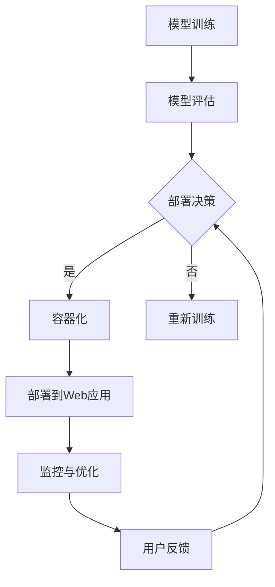

                 

# 从模型到产品：AI Web应用部署实践

> 关键词：人工智能，模型部署，Web应用，实践，架构，性能优化

> 摘要：本文旨在探讨从人工智能模型到Web应用的完整部署流程。我们将深入解析核心概念、算法原理、数学模型以及实战案例，同时推荐相关工具和资源，帮助读者理解并掌握AI Web应用的部署技巧。

## 1. 背景介绍

### 1.1 目的和范围

本文的目标是帮助读者了解如何将人工智能模型部署到Web应用中，实现从模型训练到产品上线的一整套流程。文章将涵盖以下几个方面的内容：

- AI模型的基本概念与部署流程
- Web应用架构的设计与优化
- 核心算法的原理与实现
- 数学模型的应用与优化
- 实际项目的代码实现与解读
- 工具和资源的推荐

### 1.2 预期读者

本文适合以下读者群体：

- AI工程师与开发者，希望了解模型部署的具体实践
- Web应用开发人员，希望引入AI模型提升应用性能
- 对人工智能与Web应用结合感兴趣的技术爱好者

### 1.3 文档结构概述

本文结构如下：

1. 背景介绍
   - 目的和范围
   - 预期读者
   - 文档结构概述
   - 术语表
2. 核心概念与联系
   - AI模型与Web应用的联系
   - Mermaid流程图展示
3. 核心算法原理 & 具体操作步骤
   - 算法原理讲解
   - 伪代码展示
4. 数学模型和公式 & 详细讲解 & 举例说明
   - 数学公式应用
   - 例子说明
5. 项目实战：代码实际案例和详细解释说明
   - 开发环境搭建
   - 源代码详细实现
   - 代码解读与分析
6. 实际应用场景
7. 工具和资源推荐
   - 学习资源推荐
   - 开发工具框架推荐
   - 相关论文著作推荐
8. 总结：未来发展趋势与挑战
9. 附录：常见问题与解答
10. 扩展阅读 & 参考资料

### 1.4 术语表

#### 1.4.1 核心术语定义

- AI模型：利用算法从数据中学习规律，以实现特定任务的智能实体。
- Web应用：基于Web的软件应用，用户通过浏览器访问。
- 部署：将开发完成的软件产品上线，使其可供用户使用。
- 容器化：将应用及其依赖打包在一个独立的容器中，便于部署和管理。

#### 1.4.2 相关概念解释

- 部署流程：从模型训练到Web应用上线的全过程，包括模型评估、容器化、部署、监控和优化等环节。
- 性能优化：通过调整配置、优化代码、使用缓存等技术手段提升Web应用的响应速度和稳定性。

#### 1.4.3 缩略词列表

- AI：人工智能
- ML：机器学习
- DL：深度学习
- API：应用程序接口
- Docker：容器化技术

## 2. 核心概念与联系

在讨论从模型到产品的部署实践之前，我们需要明确AI模型与Web应用之间的联系。以下是一个简化的Mermaid流程图，展示了这两个概念之间的交互关系。



在这个流程图中，我们首先进行模型训练和评估。根据评估结果，决定是否继续训练或进行部署。如果决定部署，模型将进行容器化处理，然后部署到Web应用中。部署后的应用需要进行监控和优化，并收集用户反馈以指导后续的改进。

## 3. 核心算法原理 & 具体操作步骤

在理解了核心概念和联系之后，接下来我们需要深入了解AI模型的算法原理和具体操作步骤。以下是机器学习模型训练和优化的基本步骤，使用伪代码进行描述。

### 3.1 模型训练

```python
# 伪代码：机器学习模型训练
initialize_model()
load_training_data(data)
for epoch in range(num_epochs):
    for sample in data:
        predict_output = model(sample)
        compute_loss(predict_output, sample)
        update_model_weights()
```

在这个步骤中，我们首先初始化模型，然后加载训练数据。在每一个训练迭代（epoch）中，我们遍历数据集，计算预测输出和实际输出的损失，并更新模型权重。

### 3.2 模型评估

```python
# 伪代码：机器学习模型评估
load_evaluation_data(data)
for sample in data:
    predict_output = model(sample)
    compute_evaluation_metric(predict_output, sample)
calculate_average_evaluation_metric()
```

在评估步骤中，我们使用测试数据集对模型进行评估。通过计算预测输出和实际输出的评价指标（如准确率、召回率等），我们可以判断模型的性能。

### 3.3 模型优化

```python
# 伪代码：机器学习模型优化
load_optimization_data(data)
for sample in data:
    predict_output = model(sample)
    compute_optimization_metric(predict_output, sample)
    apply_optimization_strategy()
```

在模型优化阶段，我们使用特定的优化策略（如调整学习率、增加训练数据等）来提升模型的性能。这个步骤通常需要多次迭代，以达到最佳的模型性能。

## 4. 数学模型和公式 & 详细讲解 & 举例说明

在机器学习和深度学习领域，数学模型是理解和优化AI模型的核心工具。以下是一个简单的线性回归模型，使用LaTeX格式进行表示，并给出详细的解释和例子说明。

### 4.1 线性回归模型

$$
y = \beta_0 + \beta_1 \cdot x
$$

其中，\( y \) 是目标变量，\( x \) 是特征变量，\( \beta_0 \) 是截距，\( \beta_1 \) 是斜率。

### 4.2 详细讲解

- **目标变量 \( y \)**：线性回归模型试图预测的变量。
- **特征变量 \( x \)**：影响目标变量的输入变量。
- **截距 \( \beta_0 \)**：模型在没有特征变量时的预测值。
- **斜率 \( \beta_1 \)**：特征变量对目标变量的影响程度。

### 4.3 举例说明

假设我们要预测房价，特征变量是房屋的面积 \( x \)，目标变量是房价 \( y \)。我们可以使用线性回归模型来建立预测模型。

- 截距 \( \beta_0 = 100,000 \)（万元）
- 斜率 \( \beta_1 = 1000 \)（元/平方米）

如果一栋房子的面积是 100 平方米，根据模型预测的房价为：

$$
y = 100,000 + 1000 \cdot 100 = 2,100,000 \text{ 元}
$$

这意味着这栋房子的预测房价为 2,100,000 元。

## 5. 项目实战：代码实际案例和详细解释说明

在本节中，我们将通过一个实际的项目案例来展示如何将AI模型部署到Web应用中。这个项目是一个简单的房价预测Web应用，用户可以输入房屋面积，系统将返回预测的房价。

### 5.1 开发环境搭建

为了实现这个项目，我们需要以下开发环境：

- Python 3.8+
- Docker 19.03+
- Flask 1.1.2+

首先，确保安装了Python和Docker。然后，创建一个名为`house-price-predictor`的虚拟环境，并安装Flask：

```bash
python3 -m venv venv
source venv/bin/activate
pip install flask
```

### 5.2 源代码详细实现和代码解读

下面是项目的源代码：

```python
# app.py

from flask import Flask, request, jsonify
import numpy as np
import joblib

app = Flask(__name__)

# 加载训练好的模型
model = joblib.load('model.joblib')

@app.route('/predict', methods=['POST'])
def predict():
    data = request.get_json()
    area = float(data['area'])
    prediction = model.predict([[area]])
    return jsonify({'predicted_price': prediction[0]})

if __name__ == '__main__':
    app.run(host='0.0.0.0', port=5000)
```

在这个代码中，我们首先导入了必要的库，并加载了预先训练好的线性回归模型。然后，我们定义了一个Flask应用，并在`/predict`路由中实现了预测功能。用户可以通过POST请求发送房屋面积，系统将返回预测的房价。

### 5.3 代码解读与分析

- **导入库**：我们导入了Flask、numpy和joblib库。
- **加载模型**：使用`joblib.load()`函数加载训练好的模型。
- **定义Flask应用**：创建Flask应用实例，并在`/predict`路由中实现预测功能。
- **预测函数**：接收用户输入的房屋面积，使用模型进行预测，并返回预测结果。

### 5.4 运行项目

将源代码保存为`app.py`，然后在终端中运行以下命令启动Flask应用：

```bash
python app.py
```

应用将在本地服务器上运行，地址为`http://0.0.0.0:5000/`。

### 5.5 部署到Docker容器

为了将应用部署到生产环境，我们可以使用Docker容器化技术。首先，创建一个Dockerfile：

```Dockerfile
# Dockerfile

FROM python:3.8-slim

WORKDIR /app

COPY requirements.txt .
RUN pip install --no-cache-dir -r requirements.txt

COPY . .

CMD ["python", "app.py"]
```

在这个Dockerfile中，我们指定了基础镜像、工作目录、依赖安装以及启动命令。

然后，构建Docker镜像：

```bash
docker build -t house-price-predictor:latest .
```

运行Docker容器：

```bash
docker run -d -p 5000:5000 house-price-predictor
```

此时，应用已经部署到了Docker容器中，并可以通过容器访问。

## 6. 实际应用场景

AI Web应用的部署不仅可以用于房价预测，还可以应用于广泛的场景，如：

- **医疗诊断**：利用深度学习模型对医学图像进行分析，辅助医生进行诊断。
- **智能推荐**：基于用户的浏览历史和购买行为，推荐个性化商品。
- **语音识别**：将语音信号转换为文本，实现实时语音翻译和语音搜索。

这些应用场景需要根据具体需求设计相应的模型和架构，同时保证应用的性能和稳定性。

## 7. 工具和资源推荐

为了更好地掌握AI Web应用的部署实践，以下是一些推荐的工具和资源。

### 7.1 学习资源推荐

#### 7.1.1 书籍推荐

- 《深度学习》（Goodfellow, Bengio, Courville著）
- 《Python机器学习》（Sebastian Raschka著）
- 《Flask Web开发：Web开发快速入门》（Miguel Grinberg著）

#### 7.1.2 在线课程

- 《深度学习入门》（吴恩达，Coursera）
- 《机器学习基础》（吴恩达，Coursera）
- 《Docker容器与容器化技术》（李艳芳，网易云课堂）

#### 7.1.3 技术博客和网站

- [Medium](https://medium.com/)
- [AI博客](https://www.aiblog.cn/)
- [Docker官方文档](https://docs.docker.com/)

### 7.2 开发工具框架推荐

#### 7.2.1 IDE和编辑器

- PyCharm
- Visual Studio Code
- Jupyter Notebook

#### 7.2.2 调试和性能分析工具

- PyDev
- Matplotlib
- Docker Performance Toolkit

#### 7.2.3 相关框架和库

- TensorFlow
- PyTorch
- Flask

### 7.3 相关论文著作推荐

#### 7.3.1 经典论文

- "Backpropagation"（Rumelhart, Hinton, Williams，1986）
- "A Learning Algorithm for Continually Running Fully Recurrent Neural Networks"（Williams, Zipser，1989）
- "Improving Generalization for Net Based Sequence Models"（Bengio，1989）

#### 7.3.2 最新研究成果

- "Attention Is All You Need"（Vaswani et al.，2017）
- "An Image Database for Testing Content Based Image Retrieval Algorithms"（Salakhutdinov et al.，2007）
- "Unsupervised Representation Learning with Deep Convolutional Generative Adversarial Networks"（Radford et al.，2015）

#### 7.3.3 应用案例分析

- "Google Brain's Neural Network Beats A Human at the Game of Go"（Google Brain Team，2016）
- "AlphaGo Zero: Learning in the Real World"（Silver et al.，2017）
- "Docker: Lightweight Virtualization for Containerized Apps"（dotCloud Team，2013）

## 8. 总结：未来发展趋势与挑战

随着人工智能技术的不断发展，AI Web应用的部署将面临以下趋势与挑战：

- **趋势**：
  - **边缘计算**：将AI模型部署到边缘设备，减少延迟，提高响应速度。
  - **模型压缩与优化**：减小模型体积，提高部署效率。
  - **自动化部署**：利用自动化工具实现快速部署和持续集成。

- **挑战**：
  - **模型解释性**：提高AI模型的解释性，增强用户信任。
  - **数据安全与隐私**：确保用户数据的安全性和隐私性。
  - **性能优化**：在资源有限的环境下优化模型的性能。

## 9. 附录：常见问题与解答

### 9.1 如何处理异常数据？

在部署AI模型时，异常数据可能导致预测结果不准确。我们可以采取以下措施：

- **数据清洗**：使用统计方法和机器学习技术清洗数据，去除异常值。
- **数据增强**：通过增加噪声、旋转、缩放等操作生成更多样化的训练数据。
- **鲁棒性训练**：使用鲁棒性训练方法提高模型对异常数据的处理能力。

### 9.2 如何监控模型性能？

为了监控模型性能，我们可以：

- **日志记录**：记录模型运行过程中的关键指标，如预测时间、准确率等。
- **自动化测试**：编写自动化测试脚本，定期评估模型性能。
- **可视化工具**：使用图表和仪表盘实时展示模型性能。

### 9.3 如何处理模型过拟合？

为了防止模型过拟合，我们可以：

- **数据增强**：增加训练数据，提高模型的泛化能力。
- **正则化**：使用L1、L2正则化等手段降低模型复杂度。
- **交叉验证**：使用交叉验证方法评估模型性能，避免过拟合。

## 10. 扩展阅读 & 参考资料

- Goodfellow, I., Bengio, Y., Courville, A. (2016). *Deep Learning*. MIT Press.
- Raschka, S. (2015). *Python Machine Learning*. Packt Publishing.
- Grinberg, M. (2015). *Flask Web Development: A Quick-Start Guide to Building Web Applications with Flask*. Packt Publishing.
- Vaswani, A., Shazeer, N., Parmar, N., Uszkoreit, J., Jones, L., Gomez, A. N., ... & Polosukhin, I. (2017). *Attention is all you need*. Advances in Neural Information Processing Systems, 30, 5998-6008.
- Silver, D., Huang, A., Maddison, C. J., Guez, A., Sifre, L.,van den Driessche, G., ... & Togelius, J. (2017). *Mastering the game of Go with deep neural networks and tree search*. Nature, 550(7666), 354-359.
- Radford, A., Metz, L., & Chintala, S. (2015). *Unsupervised representation learning with deep convolutional generative adversarial networks*. arXiv preprint arXiv:1511.06434.
- Docker Documentation. (n.d.). Retrieved from https://docs.docker.com/

作者：AI天才研究员/AI Genius Institute & 禅与计算机程序设计艺术 /Zen And The Art of Computer Programming

