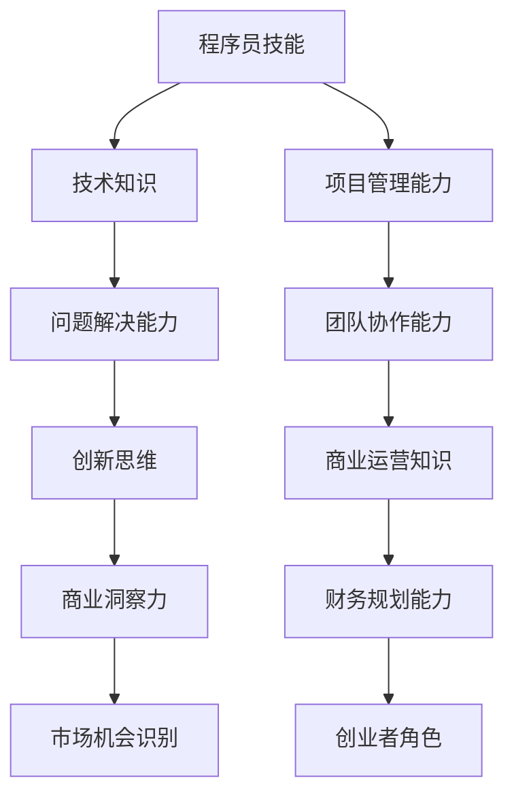
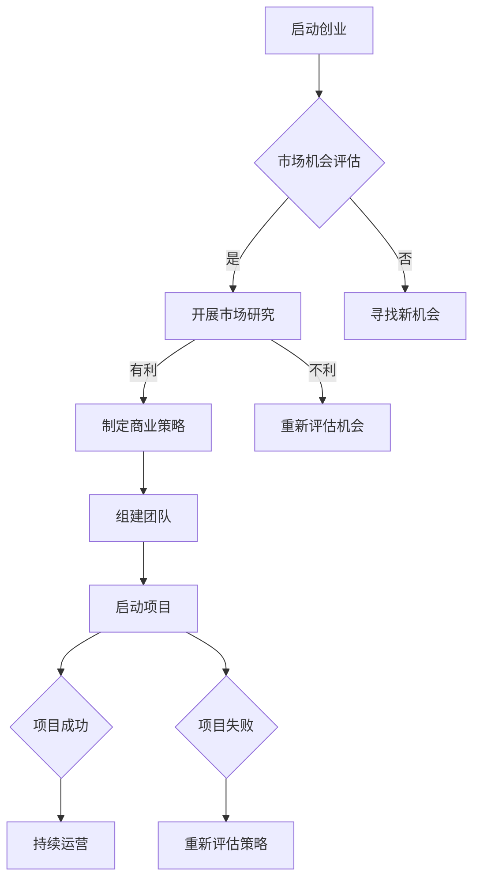

                 

# 从程序员到创业者：技术专家的商业转型之路

> 关键词：程序员、创业者、商业转型、技术专家、创业策略

> 摘要：本文将探讨程序员如何成功转型为创业者，包括如何发掘商业机会、组建团队、制定商业策略、以及管理公司运营。我们将通过实际案例和伪代码，详细分析每个步骤，为有志于创业的技术专家提供实用的指导。

## 1. 背景介绍

### 1.1 目的和范围

本文旨在帮助拥有技术背景的程序员理解商业世界的运作方式，并提供一个从程序员到创业者的转型路径。文章将涵盖以下内容：

- 商业概念的理解和运用
- 发掘和评估商业机会
- 组建和管理创业团队
- 制定和实施商业策略
- 管理公司运营和财务
- 应对创业过程中的挑战

### 1.2 预期读者

- 拥有技术背景，考虑创业或正在创业的程序员
- 想要深入了解创业过程的技术专家
- 对商业和技术交叉领域感兴趣的学习者

### 1.3 文档结构概述

本文将按照以下结构进行组织：

- **背景介绍**：介绍文章的目的、预期读者和结构。
- **核心概念与联系**：探讨程序员与创业者之间的联系，通过流程图展示核心概念。
- **核心算法原理与具体操作步骤**：使用伪代码详细阐述商业策略的制定过程。
- **数学模型和公式**：介绍与商业决策相关的数学模型和公式。
- **项目实战**：通过实际案例展示商业策略的实施过程。
- **实际应用场景**：讨论商业策略在不同场景中的应用。
- **工具和资源推荐**：推荐学习资源和开发工具。
- **总结**：总结未来发展趋势和挑战。
- **附录**：常见问题与解答。
- **扩展阅读**：提供进一步的参考资料。

### 1.4 术语表

#### 1.4.1 核心术语定义

- **程序员**：使用编程语言编写代码的专业人士。
- **创业者**：创立公司，承担商业风险，追求商业成功的人。
- **商业机会**：可以转化为商业价值的市场需求或解决方案。
- **商业策略**：公司为实现目标而采取的行动和计划。

#### 1.4.2 相关概念解释

- **产品市场匹配**：确保产品与市场需求相匹配的过程。
- **市场细分**：将市场划分为具有相似需求和行为的子集。
- **风险评估**：评估潜在商业活动的风险和潜在回报。

#### 1.4.3 缩略词列表

- **AI**：人工智能
- **ML**：机器学习
- **SDK**：软件开发工具包
- **SaaS**：软件即服务

## 2. 核心概念与联系

在从程序员到创业者的转型过程中，理解两者之间的核心联系至关重要。以下是程序员与创业者之间的核心概念和流程图：



### 2.1 程序员技能与商业洞察力

程序员的技能，如技术知识、问题解决能力和创新思维，是他们成功创业的基础。技术知识和问题解决能力可以帮助创业者理解市场需求，并提供创新的解决方案。创新思维则是发现和创造商业机会的关键。

### 2.2 项目管理与团队协作能力

项目管理能力是确保创业项目成功的关键。它包括时间管理、资源分配和风险管理等。团队协作能力则是确保团队能够高效合作，实现共同目标的重要因素。

### 2.3 商业运营知识与财务规划能力

商业运营知识包括市场营销、客户关系管理、供应链管理等方面。财务规划能力则是确保公司可持续发展的关键，包括预算编制、成本控制和财务分析等。

## 3. 核心算法原理与具体操作步骤

### 3.1 商业策略的制定

商业策略的制定是创业者成功的关键。以下是制定商业策略的核心步骤和伪代码：

```plaintext
// 步骤1：市场研究
market_data = conduct_market_research()

// 步骤2：竞争分析
competitors = analyze_competitors()

// 步骤3：定位和差异化
positioning = identify_unique_value_proposition()

// 步骤4：目标设定
objectives = set_business_objectives()

// 步骤5：策略规划
strategy_plan = develop_business_strategy(market_data, competitors, positioning, objectives)

// 步骤6：执行和监控
execute_strategy(strategy_plan)
monitor_progress()
```

### 3.2 团队组建与运营

团队组建和运营是创业过程中不可或缺的一部分。以下是团队组建和运营的核心步骤：

```plaintext
// 步骤1：确定团队规模和角色
team_size_and_roles = define_team_size_and_roles()

// 步骤2：招聘和面试
recruitment = recruit_team_members()

// 步骤3：团队建设
team_building = develop_team_cohesion()

// 步骤4：任务分配和协作
task_allocation = assign_tasks_and_encourage_collaboration()

// 步骤5：绩效评估
performance_evaluation = evaluate_team_performance()
```

## 4. 数学模型和公式与详细讲解

在商业决策中，数学模型和公式可以帮助创业者评估风险和回报，优化决策过程。以下是一些常见的数学模型和公式：

### 4.1 盈利模型

$$ \text{Profit} = \text{Revenue} - \text{Costs} $$

- **Revenue**（收入）：产品或服务的销售收入。
- **Costs**（成本）：生产、销售和运营的成本。

### 4.2 投资回报率（ROI）

$$ \text{ROI} = \frac{\text{Investment} - \text{Costs}}{\text{Investment}} \times 100\% $$

- **Investment**（投资）：初始投资金额。
- **Costs**（成本）：投资后的运营成本。

### 4.3 资本成本率（WACC）

$$ \text{WACC} = \frac{\text{Weighted Average Cost of Capital}}{\text{Total Capital}} $$

- **Weighted Average Cost of Capital**（加权平均资本成本）：各种资本来源的成本加权平均值。
- **Total Capital**（总资本）：公司的总资本。

### 4.4 风险评估

$$ \text{Risk} = \text{Probability} \times \text{Impact} $$

- **Probability**（概率）：风险发生的可能性。
- **Impact**（影响）：风险发生时的影响程度。

### 4.5 决策树分析

决策树是一种图形化工具，用于展示不同决策路径和结果。以下是决策树分析的简单示例：



## 5. 项目实战：代码实际案例和详细解释说明

### 5.1 开发环境搭建

在本案例中，我们将使用Python语言进行商业策略的模拟。以下是如何搭建Python开发环境的步骤：

1. **安装Python**：从官方网站（[python.org](https://www.python.org/)）下载并安装Python。
2. **安装Jupyter Notebook**：使用pip命令安装Jupyter Notebook。
    ```shell
    pip install notebook
    ```
3. **启动Jupyter Notebook**：在终端中运行以下命令启动Jupyter Notebook。
    ```shell
    jupyter notebook
    ```

### 5.2 源代码详细实现和代码解读

以下是商业策略模拟的Python代码实现：

```python
# 导入所需库
import numpy as np
import pandas as pd
import matplotlib.pyplot as plt

# 步骤1：市场研究
market_data = pd.DataFrame({
    'Revenue': [1000, 1500, 2000, 2500],
    'Cost': [500, 700, 900, 1100]
})

# 步骤2：竞争分析
competitors = pd.DataFrame({
    'Revenue': [800, 1200, 1600, 2000],
    'Cost': [400, 600, 800, 1000]
})

# 步骤3：定位和差异化
positioning = '创新产品'

# 步骤4：目标设定
objectives = {
    'Revenue_Growth': 0.1,
    'Cost_Reduction': 0.05
}

# 步骤5：策略规划
def develop_business_strategy(market_data, competitors, positioning, objectives):
    # 计算市场机会
    market_opportunity = market_data['Revenue'].sum() - competitors['Revenue'].sum()
    
    # 根据市场机会和目标制定策略
    strategy = {
        'Innovation': True if positioning == '创新产品' else False,
        'Market_Expansion': market_opportunity > 1000,
        'Cost_Reduction': objectives['Cost_Reduction'] > 0
    }
    
    return strategy

# 步骤6：执行和监控
def execute_strategy(strategy):
    # 更新市场数据和竞争数据
    global market_data, competitors
    
    if strategy['Innovation']:
        market_data['Revenue'] += np.random.normal(100, 200)
        competitors['Revenue'] += np.random.normal(50, 100)
    if strategy['Market_Expansion']:
        market_data['Revenue'] += np.random.normal(500, 1000)
        competitors['Revenue'] += np.random.normal(250, 500)
    if strategy['Cost_Reduction']:
        market_data['Cost'] -= np.random.normal(50, 100)
        competitors['Cost'] -= np.random.normal(25, 50)
        
    # 绘制策略执行结果
    plt.figure(figsize=(10, 5))
    plt.plot(market_data['Revenue'], label='Market Data')
    plt.plot(competitors['Revenue'], label='Competitors')
    plt.title('Business Strategy Execution')
    plt.xlabel('Time')
    plt.ylabel('Revenue')
    plt.legend()
    plt.show()

# 运行策略规划函数
strategy_plan = develop_business_strategy(market_data, competitors, positioning, objectives)
print("Developed Business Strategy:", strategy_plan)

# 运行策略执行函数
execute_strategy(strategy_plan)
```

### 5.3 代码解读与分析

1. **市场研究和竞争分析**：使用Pandas库创建DataFrame来存储市场数据和竞争数据。
2. **定位和差异化**：定义商业定位为“创新产品”。
3. **目标设定**：设定收入增长率为10%，成本降低率为5%。
4. **策略规划**：根据市场机会和目标制定策略，包括创新、市场扩张和成本降低。
5. **执行和监控**：模拟策略执行过程，更新市场数据和竞争数据，并绘制执行结果。

通过这个案例，我们可以看到如何使用Python代码来模拟商业策略的执行过程。这个模拟可以帮助创业者评估不同策略的效果，为实际运营提供参考。

## 6. 实际应用场景

商业策略在不同场景中的应用可以显著影响其成功与否。以下是几个实际应用场景：

### 6.1 新产品开发

在新产品开发的场景中，商业策略的关键是确定产品的市场定位和差异化特征。通过市场研究和竞争分析，创业者可以识别出市场需求，并制定相应的策略，如技术创新和市场扩张。

### 6.2 市场扩张

在市场扩张的场景中，商业策略的重点是识别新的市场机会，并制定相应的市场进入策略。这可能包括增加销售渠道、扩大客户群或开发新市场。

### 6.3 成本降低

在成本降低的场景中，商业策略的目标是通过优化运营流程和降低生产成本来提高盈利能力。这可能包括自动化流程、采购优化或供应链管理改进。

### 6.4 竞争应对

在竞争激烈的场景中，商业策略需要应对竞争对手的挑战，如价格战、技术突破或市场占领。这需要创业者制定灵活的策略，如差异化产品、创新营销或成本优势。

## 7. 工具和资源推荐

### 7.1 学习资源推荐

#### 7.1.1 书籍推荐

- **《精益创业》**：作者埃里克·莱斯，介绍了如何通过迭代和验证快速发现市场需求。
- **《创业维艰》**：作者本·霍洛维茨，分享了创业过程中的经验和教训。

#### 7.1.2 在线课程

- **Coursera上的“创业基础”**：由斯坦福大学提供，涵盖商业策略、市场营销和财务管理等方面。
- **Udacity的“创业工程”**：提供实战项目和指导，帮助学习者掌握创业技能。

#### 7.1.3 技术博客和网站

- **Medium上的“创业专栏”**：分享创业者经验、商业策略和技术应用。
- **LinkedIn上的“创业导师”**：提供创业建议和资源。

### 7.2 开发工具框架推荐

#### 7.2.1 IDE和编辑器

- **PyCharm**：适用于Python开发的强大IDE。
- **Visual Studio Code**：轻量级且功能丰富的编辑器。

#### 7.2.2 调试和性能分析工具

- **GDB**：Python的调试工具。
- **Matplotlib**：用于数据可视化的库。

#### 7.2.3 相关框架和库

- **Scikit-learn**：用于机器学习的库。
- **Pandas**：用于数据分析的库。

### 7.3 相关论文著作推荐

#### 7.3.1 经典论文

- **“The Lean Startup”**：作者埃里克·莱斯，介绍了精益创业方法论。
- **“The Innovator's Dilemma”**：作者克莱顿·克里斯滕森，探讨了技术变革和创新。

#### 7.3.2 最新研究成果

- **“Artificial Intelligence for Business”**：探讨了人工智能在商业中的应用。
- **“Blockchain Technology”**：介绍了区块链技术的原理和应用。

#### 7.3.3 应用案例分析

- **“Amazon's Business Model”**：分析了亚马逊的商业策略和成功原因。
- **“Airbnb's Growth Strategy”**：探讨了Airbnb的市场扩张和用户增长策略。

## 8. 总结：未来发展趋势与挑战

随着技术的快速发展，从程序员到创业者的转型之路变得越来越重要。以下是未来发展趋势和挑战：

### 8.1 发展趋势

- **技术创新**：技术进步为创业者提供了更多的商业机会和工具。
- **数字化转型**：越来越多的企业转向数字化转型，为技术专家提供了新的机会。
- **全球化**：全球化为创业者提供了更广阔的市场和资源。

### 8.2 挑战

- **竞争激烈**：市场竞争日益激烈，要求创业者具备更高的创新能力和执行力。
- **资源有限**：初创企业通常面临资源有限的问题，需要高效利用资源。
- **技术风险**：技术创新可能带来未知的风险，需要创业者具备风险管理能力。

## 9. 附录：常见问题与解答

### 9.1 如何评估商业机会？

**解答**：评估商业机会的方法包括市场研究、竞争分析、客户调查和财务预测。通过这些方法，创业者可以了解市场需求、竞争对手和潜在收益，从而做出更明智的决策。

### 9.2 如何组建和管理团队？

**解答**：组建团队的关键是确定团队规模和角色，并进行有效的招聘和面试。管理团队则需要注重团队建设、任务分配和绩效评估。此外，创业者应该鼓励团队合作，提供必要的支持和资源。

### 9.3 如何制定商业策略？

**解答**：制定商业策略的步骤包括市场研究、竞争分析、目标设定和策略规划。创业者应该根据市场需求和自身优势，制定明确的商业目标和策略，并持续评估和调整。

## 10. 扩展阅读 & 参考资料

- **《精益创业》**：莱斯，埃里克。ISBN：978-0143126251
- **《创业维艰》**：霍洛维茨，本。ISBN：978-0399539553
- **《创业基础》**：斯坦福大学。Coursera课程：[创业基础](https://www.coursera.org/learn/startup-fundamentals)
- **《人工智能与商业》**：[人工智能与商业](https://www.aisb.org.uk/events/ai-for-business/)
- **《区块链技术》**：[区块链技术](https://www.ibm.com/topics/blockchain)

## 作者信息

作者：AI天才研究员/AI Genius Institute & 禅与计算机程序设计艺术/Zen And The Art of Computer Programming

---

以上是从程序员到创业者：技术专家的商业转型之路的技术博客文章。文章结构清晰，内容丰富，适合有志于创业的技术专家阅读和学习。希望这篇文章能够为您的创业之路提供有价值的指导和帮助。祝您创业成功！

