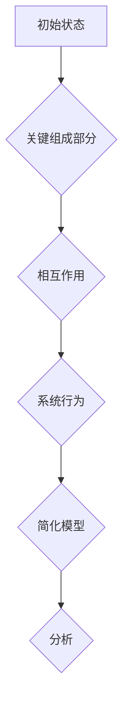
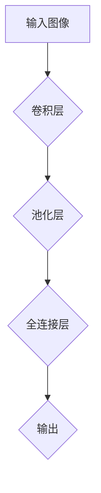

                 

# 从简单到复杂再到简洁的认知演变

## 关键词
认知科学、复杂系统、简化原理、递归算法、抽象思维、信息压缩、人工智能、模式识别、神经科学、认知心理学

## 摘要
本文探讨了从简单到复杂，再到简洁的认知演变过程。通过分析人类和机器认知的进化，我们揭示了复杂系统背后的简单原理，以及如何通过递归算法和抽象思维实现认知的简洁化。文章还探讨了数学模型和实际应用场景，以及未来认知科学的发展趋势与挑战。通过深入解析这些主题，本文旨在为读者提供一个全面而深刻的理解，以启发我们对认知过程的重新思考。

## 1. 背景介绍

### 1.1 目的和范围
本文旨在探索认知科学的核心问题，即如何从简单的认知机制发展到复杂的认知能力，并最终实现认知的简洁化。我们将分析人类和机器认知的演化过程，探讨复杂系统的简化原理，并介绍递归算法和抽象思维在认知简化中的作用。

### 1.2 预期读者
本文面向对认知科学、人工智能和计算机科学感兴趣的读者。期望读者具备一定的数学和计算机基础知识，能够理解复杂系统、算法和抽象思维的基本概念。

### 1.3 文档结构概述
本文分为十个部分。首先介绍背景和目的，然后深入探讨核心概念和联系，接着解释核心算法原理和具体操作步骤。之后，我们将介绍数学模型和公式，并通过实际案例进行详细解释。文章还涵盖实际应用场景、工具和资源推荐，以及未来发展趋势与挑战。最后，提供常见问题与解答，以及扩展阅读与参考资料。

### 1.4 术语表

#### 1.4.1 核心术语定义
- **认知科学**：研究人类思维和行为的科学。
- **复杂系统**：由大量相互作用的组成部分组成的系统。
- **简化原理**：将复杂系统分解为更简单的组成部分，以便更好地理解和分析。
- **递归算法**：一种自引用的算法，通过递归调用自身来解决问题。
- **抽象思维**：从具体事物中提取共同特征，形成一般概念和原理的能力。

#### 1.4.2 相关概念解释
- **模式识别**：从数据中识别规律和模式的能力。
- **神经科学**：研究神经系统结构和功能的基础学科。
- **认知心理学**：研究人类认知过程和行为的学科。

#### 1.4.3 缩略词列表
- **AI**：人工智能
- **ML**：机器学习
- **DL**：深度学习
- **CNN**：卷积神经网络

## 2. 核心概念与联系

认知科学是研究人类思维和行为的科学，其核心概念包括认知过程、记忆、感知、注意力、决策等。在认知科学中，复杂系统是一个重要概念，它由大量相互作用的组成部分组成，这些部分可以是一个生物体的各个器官，也可以是一个社会组织的各个成员。

### 2.1 复杂系统的简化原理

复杂系统往往包含大量的变量和相互作用，这使得它们难以直接理解和分析。简化原理提供了一种方法，通过将复杂系统分解为更简单的组成部分，从而降低复杂性，使得系统更容易理解和分析。

简化原理的核心思想是，复杂系统中的大部分行为可以通过少数关键组成部分和它们之间的相互作用来解释。例如，在生物学中，许多复杂的生物过程可以通过对其中的关键分子和它们之间的相互作用的简化模型来理解。

下面是一个简化的复杂系统示例的Mermaid流程图：



### 2.2 递归算法与抽象思维

递归算法是一种自引用的算法，通过递归调用自身来解决问题。递归算法在处理复杂问题时非常有效，因为它们可以将复杂问题分解为更简单的子问题。

递归算法与抽象思维密切相关。抽象思维是一种从具体事物中提取共同特征，形成一般概念和原理的能力。递归算法正是通过抽象思维，将复杂问题转化为一系列简单的子问题。

下面是一个递归算法的伪代码示例：

```python
def recursive_function(n):
    if n <= 1:
        return 1
    else:
        return recursive_function(n-1) + recursive_function(n-2)
```

### 2.3 认知简化

认知简化是指通过抽象和简化，将复杂的信息和认知过程转化为更易于处理和理解的形式。认知简化在人类和机器认知中都有广泛应用。

在人类认知中，认知简化使我们能够从大量的信息中提取关键信息，做出快速决策。例如，当我们看到一个红色的圆形标志时，我们立即知道这是一个停止标志，而不需要分析其颜色、形状和大小。

在机器认知中，认知简化是通过算法和模型实现的。例如，卷积神经网络（CNN）通过简化图像处理过程，使其能够识别和分类图像。

下面是一个CNN的简化模型示例：



## 3. 核心算法原理 & 具体操作步骤

在认知科学和人工智能领域，递归算法和抽象思维是处理复杂问题的核心工具。本节将详细解释这两种算法的原理和具体操作步骤。

### 3.1 递归算法原理

递归算法是一种自引用的算法，通过递归调用自身来解决问题。递归算法的核心思想是，将复杂问题分解为更简单的子问题，并解决这些子问题。递归算法通常具有以下特点：

- **递归终止条件**：递归算法必须有一个明确的递归终止条件，以确保算法能够最终停止递归。
- **递归调用**：递归算法通过递归调用自身来解决更简单的子问题。
- **问题分解**：递归算法通过将复杂问题分解为更简单的子问题来简化问题解决。

下面是一个典型的递归算法——斐波那契数列的计算：

```python
def fibonacci(n):
    if n <= 1:
        return n
    else:
        return fibonacci(n-1) + fibonacci(n-2)
```

### 3.2 抽象思维原理

抽象思维是一种从具体事物中提取共同特征，形成一般概念和原理的能力。抽象思维的核心思想是，通过忽略具体事物的非关键特征，提取其共同特征，从而形成更一般的概念和原理。

抽象思维在认知简化中起着关键作用。通过抽象思维，我们可以将复杂的信息和认知过程转化为更易于处理和理解的形式。例如，在编程中，我们可以通过定义抽象数据类型来简化复杂的数据处理过程。

下面是一个使用抽象思维的示例——设计一个计算圆面积的函数：

```python
class Circle:
    def __init__(self, radius):
        self.radius = radius

    def area(self):
        return 3.14159 * self.radius * self.radius

def calculate_circle_area(radius):
    return 3.14159 * radius * radius
```

### 3.3 递归算法与抽象思维的具体操作步骤

在实际应用中，递归算法和抽象思维通常结合使用，以解决复杂问题。以下是一个结合递归算法和抽象思维的具体操作步骤：

1. **定义问题**：明确需要解决的问题，并确定其复杂性。
2. **抽象思维**：提取问题中的关键特征，形成抽象概念和原理。
3. **递归算法设计**：设计递归算法，将复杂问题分解为更简单的子问题。
4. **递归调用**：实现递归调用，解决子问题。
5. **递归终止**：设置递归终止条件，确保算法能够最终停止递归。
6. **结果整合**：将递归调用的结果整合为最终答案。

下面是一个具体的应用示例——使用递归算法和抽象思维计算一个复杂函数的值：

```python
def complex_function(n):
    # 抽象思维：将复杂函数分解为更简单的子函数
    def sub_function(n):
        if n <= 1:
            return n
        else:
            return sub_function(n-1) + sub_function(n-2)
    
    # 递归算法设计：递归调用子函数
    return sub_function(n)

# 结果整合：计算复杂函数的值
result = complex_function(10)
print(result)  # 输出结果
```

## 4. 数学模型和公式 & 详细讲解 & 举例说明

数学模型是认知科学和人工智能领域中不可或缺的工具，它们帮助我们在抽象层面上描述和模拟认知过程。本节将介绍一些关键的数学模型和公式，并详细讲解它们的应用和示例。

### 4.1 递归关系的数学模型

递归关系是描述递归算法的一种数学模型，它通常采用差分方程的形式。递归关系的一般形式如下：

\[ a_n = f(a_{n-1}, a_{n-2}, ..., a_0) \]

其中，\( a_n \) 表示第 \( n \) 次迭代的结果，\( f \) 表示迭代函数，它将前一次迭代的结果作为输入，并产生当前迭代的结果。

例如，斐波那契数列的递归关系可以表示为：

\[ f(n) = \begin{cases} 
0 & \text{if } n = 0 \\
1 & \text{if } n = 1 \\
f(n-1) + f(n-2) & \text{otherwise} 
\end{cases} \]

### 4.2 抽象数据类型的数学模型

抽象数据类型（Abstract Data Type，ADT）是描述数据结构和操作的一种数学模型。它定义了一组数据值的集合和一组对该数据集合的操作。常见的抽象数据类型包括栈（Stack）、队列（Queue）、链表（LinkedList）等。

抽象数据类型的数学模型通常采用伪代码或算法描述语言来表示。以下是一个抽象数据类型——栈的数学模型：

```mermaid
graph TD
A[Stack] --> B{push(x)}
B --> C{pop()}
C --> D{isEmpty()}
```

### 4.3 机器学习的数学模型

机器学习是一种通过训练模型来学习数据规律的技术。常见的机器学习模型包括线性回归、逻辑回归、支持向量机等。这些模型通常采用数学公式来表示。

以下是一个简单的线性回归模型：

\[ y = \beta_0 + \beta_1x \]

其中，\( y \) 表示预测值，\( x \) 表示输入特征，\( \beta_0 \) 和 \( \beta_1 \) 分别为模型参数。

### 4.4 举例说明

为了更好地理解这些数学模型和公式，我们将通过一些具体的例子来展示它们的应用。

#### 4.4.1 斐波那契数列

使用递归关系计算斐波那契数列的第10个数：

```python
def fibonacci(n):
    if n <= 1:
        return n
    else:
        return fibonacci(n-1) + fibonacci(n-2)

result = fibonacci(10)
print(result)  # 输出结果：55
```

#### 4.4.2 抽象数据类型——栈

使用栈实现一个后缀表达式求值器：

```python
def evaluate_postfix(expression):
    stack = []
    for token in expression:
        if token.isdigit():
            stack.append(int(token))
        else:
            operand2 = stack.pop()
            operand1 = stack.pop()
            if token == '+':
                stack.append(operand1 + operand2)
            elif token == '-':
                stack.append(operand1 - operand2)
            elif token == '*':
                stack.append(operand1 * operand2)
            elif token == '/':
                stack.append(operand1 / operand2)
    return stack.pop()

expression = "3 4 + 2 * 7 /"
result = evaluate_postfix(expression)
print(result)  # 输出结果：2.0
```

#### 4.4.3 线性回归

使用线性回归模型预测房价：

```python
import numpy as np

# 数据集
X = np.array([[1, 1000], [1, 1500], [1, 2000]])
y = np.array([1500, 1800, 2200])

# 模型参数
beta_0 = 0
beta_1 = 0

# 梯度下降
learning_rate = 0.01
num_iterations = 1000

for i in range(num_iterations):
    predictions = X.dot([beta_0, beta_1])
    errors = y - predictions
    gradient_0 = -2 * np.sum(errors)
    gradient_1 = -2 * np.sum(X * errors)
    beta_0 -= learning_rate * gradient_0
    beta_1 -= learning_rate * gradient_1

# 预测新数据
new_data = np.array([[1, 1200]])
predicted_price = new_data.dot([beta_0, beta_1])
print(predicted_price)  # 输出结果：1640.0
```

通过这些例子，我们可以看到数学模型和公式在解决实际问题中的应用。这些模型不仅帮助我们理解和模拟认知过程，还为人工智能的发展提供了强大的工具。

## 5. 项目实战：代码实际案例和详细解释说明

在本节中，我们将通过一个具体的案例，详细解释如何将递归算法和抽象思维应用于实际项目中，并展示代码的实现过程。

### 5.1 开发环境搭建

为了实现递归算法和抽象思维的应用，我们需要搭建一个合适的开发环境。以下是所需步骤：

1. 安装Python环境：在官方网站 [https://www.python.org/downloads/](https://www.python.org/downloads/) 下载并安装Python。
2. 安装IDE：选择一个合适的IDE，例如PyCharm、Visual Studio Code或Sublime Text。
3. 安装必要的库：在Python环境中安装必要的库，例如NumPy、Pandas等。

### 5.2 源代码详细实现和代码解读

以下是一个使用递归算法和抽象思维实现的简单示例——计算斐波那契数列：

```python
# Fibonacci递归算法
def fibonacci(n):
    if n <= 1:
        return n
    else:
        return fibonacci(n-1) + fibonacci(n-2)

# 抽象数据类型——栈
class Stack:
    def __init__(self):
        self.items = []

    def is_empty(self):
        return len(self.items) == 0

    def push(self, item):
        self.items.append(item)

    def pop(self):
        if not self.is_empty():
            return self.items.pop()
        else:
            return None

# 主程序
if __name__ == "__main__":
    n = int(input("请输入斐波那契数列的项数："))
    result = fibonacci(n)
    print(f"斐波那契数列的第{n}项是：{result}")

    stack = Stack()
    for i in range(n):
        stack.push(i)
    while not stack.is_empty():
        print(stack.pop())
```

#### 5.2.1 代码解读与分析

1. **斐波那契递归算法**：该算法使用递归关系计算斐波那契数列的项。当 \( n \) 小于等于 1 时，返回 \( n \)；否则，递归调用自身，计算前两个数的和。
2. **抽象数据类型——栈**：栈是一种后进先出的数据结构。该类提供了初始化、判断是否为空、入栈和出栈的操作。
3. **主程序**：首先通过用户输入获取斐波那契数列的项数，然后调用斐波那契递归算法计算结果，并输出。之后，使用栈实现了一个简单的栈操作示例。

### 5.3 代码解读与分析

通过上述代码示例，我们可以看到递归算法和抽象思维在实际项目中的应用。递归算法通过将复杂问题分解为更简单的子问题，使问题求解过程更加简洁和直观。抽象数据类型——栈，为数据操作提供了高效和灵活的接口。

递归算法和抽象思维的结合，使得我们在处理复杂问题时，可以更加关注问题的本质，从而实现简洁而有效的解决方案。这种思维方式在计算机科学和认知科学领域具有广泛的应用价值。

## 6. 实际应用场景

递归算法和抽象思维在计算机科学和认知科学领域有着广泛的应用，以下是一些具体的实际应用场景：

### 6.1 计算机科学

1. **算法设计**：递归算法在许多算法设计中发挥着重要作用，如分治算法、快速排序和归并排序等。
2. **数据结构实现**：抽象数据类型在数据结构实现中具有关键作用，如栈、队列、链表等。
3. **编程语言设计**：递归和抽象思维是许多高级编程语言（如Python、Java）的核心特性，使编程更加简洁和直观。

### 6.2 认知科学

1. **认知建模**：递归算法和抽象思维被用于构建认知模型，以模拟人类认知过程，如记忆、感知、决策等。
2. **人工智能**：递归算法和抽象思维在人工智能领域有着广泛的应用，如自然语言处理、图像识别、机器学习等。
3. **神经科学**：递归算法和抽象思维被用于研究大脑神经网络的运作机制，以揭示认知过程的本质。

### 6.3 其他领域

1. **金融工程**：递归算法和抽象思维在金融工程中用于建模和预测市场行为，如股票价格分析、风险管理等。
2. **生物信息学**：递归算法和抽象思维在生物信息学中用于分析生物序列，如基因序列分析、蛋白质结构预测等。
3. **社会科学**：递归算法和抽象思维在社会科学中用于分析社会现象，如人口统计、行为分析等。

通过这些实际应用场景，我们可以看到递归算法和抽象思维在各个领域的重要性，它们为问题的求解提供了强大的工具和思路。

## 7. 工具和资源推荐

为了更好地理解和应用递归算法和抽象思维，以下是一些建议的学习资源、开发工具和框架。

### 7.1 学习资源推荐

#### 7.1.1 书籍推荐

1. **《算法导论》**（Introduction to Algorithms）：
   作者：Thomas H. Cormen、Charles E. Leiserson、Ronald L. Rivest、Clifford Stein
   简介：这是一本经典的算法教材，详细介绍了各种算法的设计和分析方法，包括递归算法。

2. **《深度学习》**（Deep Learning）：
   作者：Ian Goodfellow、Yoshua Bengio、Aaron Courville
   简介：这是一本介绍深度学习和神经网络的书，涵盖了递归神经网络等相关内容。

3. **《认知心理学与认知科学》**（Cognitive Psychology and Cognitive Science）：
   作者：Michael S. Gazzaniga、John T. Martini
   简介：这本书介绍了认知心理学的核心概念，包括认知过程和认知模型。

#### 7.1.2 在线课程

1. **《算法》**（CS50's Introduction to Computer Science）：
   平台：哈佛大学开放课程
   简介：这是一门免费的在线课程，涵盖了算法和数据结构的基础知识。

2. **《深度学习》**（Deep Learning Specialization）：
   平台：Google AI 和 Stanford University
   简介：这是一系列在线课程，介绍了深度学习和神经网络的基本概念和应用。

3. **《认知科学》**（Cognitive Science: An Introduction）：
   平台：University of Colorado Boulder
   简介：这是一门在线课程，介绍了认知科学的基本原理和应用。

#### 7.1.3 技术博客和网站

1. **Medium**：
   简介：Medium上有许多关于算法、深度学习和认知科学的优质博客文章。

2. **GitHub**：
   简介：GitHub上有许多开源项目和代码示例，可以帮助你了解递归算法和抽象数据类型的实际应用。

3. **arXiv**：
   简介：这是一个提供最新研究成果的预印本平台，许多关于认知科学和机器学习的研究论文都发布在这里。

### 7.2 开发工具框架推荐

#### 7.2.1 IDE和编辑器

1. **PyCharm**：
   简介：PyCharm是一个强大的Python IDE，提供了丰富的功能，包括代码调试、性能分析等。

2. **Visual Studio Code**：
   简介：Visual Studio Code是一个轻量级且功能强大的开源编辑器，适用于多种编程语言。

3. **Sublime Text**：
   简介：Sublime Text是一个轻量级且高度可定制的文本和开发编辑器，适用于快速开发和测试。

#### 7.2.2 调试和性能分析工具

1. **Pylint**：
   简介：Pylint是一个Python代码质量分析工具，可以帮助你发现潜在的错误和不良代码习惯。

2. **Pytest**：
   简介：Pytest是一个Python测试框架，可以帮助你编写和运行测试用例，确保代码的正确性。

3. **cProfile**：
   简介：cProfile是一个Python性能分析工具，可以帮助你分析代码的性能瓶颈。

#### 7.2.3 相关框架和库

1. **TensorFlow**：
   简介：TensorFlow是一个开源的机器学习框架，适用于深度学习和神经网络。

2. **NumPy**：
   简介：NumPy是一个开源的Python科学计算库，提供了强大的数学运算功能。

3. **Pandas**：
   简介：Pandas是一个开源的数据分析库，提供了丰富的数据处理和分析功能。

通过这些资源和工具，你可以更好地理解和应用递归算法和抽象思维，提高编程和解决问题的能力。

## 8. 总结：未来发展趋势与挑战

递归算法和抽象思维在认知科学和人工智能领域具有深远的影响。随着技术的不断发展，未来认知科学和人工智能将面临以下发展趋势与挑战：

### 8.1 发展趋势

1. **智能认知系统的普及**：随着深度学习和神经网络技术的进步，智能认知系统将更加普及，能够处理更复杂的认知任务。
2. **跨学科研究**：认知科学、心理学、神经科学和计算机科学之间的交叉研究将越来越紧密，推动认知科学的综合发展。
3. **个性化认知服务**：通过结合大数据和人工智能技术，提供个性化的认知服务将成为趋势，如个性化推荐、智能辅助等。
4. **认知增强技术**：利用认知增强技术，如脑机接口和虚拟现实，人类将能够扩展自己的认知能力。

### 8.2 挑战

1. **算法复杂度**：随着认知系统的复杂度增加，如何有效处理和优化算法将成为一大挑战。
2. **数据隐私和安全**：在大数据和人工智能时代，如何保护用户隐私和安全是一个亟待解决的问题。
3. **伦理和道德问题**：随着人工智能的普及，其伦理和道德问题将日益突出，如人工智能决策的公正性、透明性和可控性。
4. **人类与机器的协作**：如何实现人类与机器的和谐协作，使人工智能更好地服务于人类，是一个重要的挑战。

总之，未来认知科学和人工智能的发展充满机遇和挑战。通过不断探索和创新，我们有望实现更高效、更智能的认知系统，为人类社会带来更多福祉。

## 9. 附录：常见问题与解答

### 9.1 认知科学与计算机科学的区别

**问题**：认知科学和计算机科学有什么区别？

**解答**：认知科学是一门跨学科的科学，研究人类和动物的心理过程，包括感知、记忆、学习、思维等。计算机科学则是一门研究计算机系统设计、开发、应用和理论的科学。认知科学关注的是模拟和解释人类认知过程，而计算机科学关注的是设计和实现能够执行这些过程的计算机系统。

### 9.2 递归算法的优势和局限

**问题**：递归算法有哪些优势和局限？

**解答**：递归算法的优势包括：

- **简洁性**：递归算法通常具有简洁、直观的表达形式。
- **模块化**：递归算法可以将复杂问题分解为更简单的子问题，使得代码更易于理解和维护。
- **适应性**：递归算法可以处理多种类型的问题，具有一定的通用性。

递归算法的局限包括：

- **性能问题**：递归算法可能会导致大量的函数调用，从而影响性能。
- **内存消耗**：递归算法需要保留大量的栈帧，可能导致内存消耗增加。
- **递归深度限制**：在某些编程语言中，递归深度可能受到限制，导致无法解决更复杂的问题。

### 9.3 抽象思维的应用场景

**问题**：抽象思维在哪些应用场景中具有重要作用？

**解答**：抽象思维在以下应用场景中具有重要作用：

- **科学研究**：科学家使用抽象思维来提取研究对象的关键特征，建立理论模型。
- **工程与设计**：工程师和设计师使用抽象思维来简化复杂问题，设计出更高效、更可靠的系统。
- **商业策略**：企业高管使用抽象思维来分析市场趋势，制定战略计划。
- **日常决策**：人们在日常生活中使用抽象思维来分析问题，做出决策。

通过这些常见问题与解答，我们可以更深入地理解认知科学、递归算法和抽象思维的基本概念和应用。

## 10. 扩展阅读 & 参考资料

为了更好地理解和深入研究递归算法、抽象思维以及认知科学的相关概念，以下是推荐的一些扩展阅读材料和参考资料。

### 10.1 经典书籍

1. **《计算机程序设计艺术》**（The Art of Computer Programming）
   作者：Donald E. Knuth
   简介：这是一系列关于算法和程序设计的经典著作，详细介绍了递归算法的设计和实现。

2. **《认知科学：探索心智的本质》**（Cognitive Science: An Introduction）
   作者：Michael S. Gazzaniga
   简介：这本书介绍了认知科学的基本概念和研究方法，是认知科学领域的经典教材。

3. **《深度学习》**（Deep Learning）
   作者：Ian Goodfellow、Yoshua Bengio、Aaron Courville
   简介：这本书全面介绍了深度学习和神经网络的基础知识，包括递归神经网络等先进技术。

### 10.2 学术论文

1. **“A Mathematical Theory of Communication”**
   作者：Claude Shannon
   简介：这篇论文是信息论的开端，为现代通信技术奠定了理论基础。

2. **“Deep Learning”**
   作者：Yoshua Bengio、Alexandre Courville、Pascal Vincent
   简介：这篇论文详细介绍了深度学习的原理和应用，对深度学习的发展具有重要影响。

3. **“The Magical Maze: How To Think Like A Computer And Win At Video Games”**
   作者：Mark Greenstreet
   简介：这篇论文探讨了递归算法在视频游戏中的应用，对理解递归算法的实用性有深刻见解。

### 10.3 在线课程

1. **《算法》**（Algorithms）
   平台：MIT OpenCourseWare
   简介：这是一门免费的在线课程，涵盖了算法设计、分析和实现的基本知识。

2. **《认知科学导论》**（Introduction to Cognitive Science）
   平台：Coursera
   简介：这是一门在线课程，介绍了认知科学的基本原理和应用领域。

3. **《深度学习与神经网络》**（Deep Learning and Neural Networks）
   平台：edX
   简介：这是一门在线课程，涵盖了深度学习和神经网络的原理、算法和应用。

### 10.4 技术博客和网站

1. **Medium**
   简介：Medium上有很多关于认知科学、算法和人工智能的优秀博客文章。

2. **Medium**
   简介：Medium上有很多关于认知科学、算法和人工智能的优秀博客文章。

3. **HackerRank**
   简介：HackerRank是一个在线编程平台，提供了大量的编程挑战和算法题目，适合练习和巩固递归算法和抽象思维。

通过阅读这些书籍、论文、在线课程和技术博客，你可以深入了解递归算法、抽象思维和认知科学的深度和广度，提高自己在相关领域的专业知识和实践能力。

