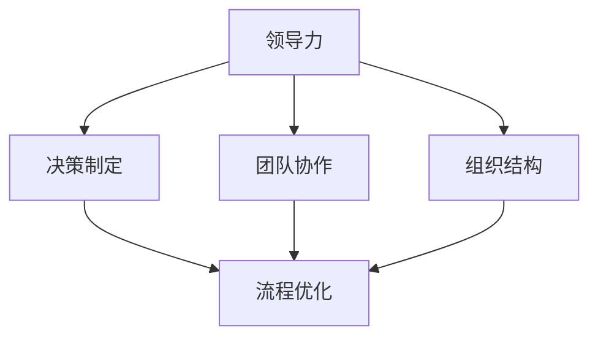

                 

# 从经典到实践：管理理论的落地

> 关键词：管理理论、实践应用、组织管理、流程优化、案例研究

> 摘要：本文旨在探讨经典管理理论在现实组织中的实际应用与落地，通过深入分析这些理论的核心概念、算法原理以及数学模型，结合具体项目实战，揭示其在管理实践中的有效性与挑战。文章还推荐了相关学习资源、开发工具和最新研究成果，为读者提供全面的管理理论实践指南。

## 1. 背景介绍

### 1.1 目的和范围

本文的目标是帮助读者深入理解经典管理理论在现实组织中的应用，并通过具体案例分析，探讨这些理论如何落地实践，解决实际管理问题。文章将涵盖以下几个方面：

- 管理理论的核心概念及其联系
- 管理理论的具体操作步骤
- 数学模型和公式在管理中的应用
- 项目实战：代码实际案例和详细解释
- 实际应用场景及工具资源推荐

### 1.2 预期读者

本文适合以下读者群体：

- 管理专业学生和研究人员
- 企业管理人员和项目经理
- 对管理理论感兴趣的技术人员
- 对组织管理有实践需求的管理者

### 1.3 文档结构概述

本文将按照以下结构进行撰写：

1. 背景介绍：目的和范围、预期读者、文档结构概述
2. 核心概念与联系：管理理论的基本概念及其联系
3. 核心算法原理 & 具体操作步骤：详细解释管理理论的操作步骤
4. 数学模型和公式 & 详细讲解 & 举例说明：应用数学模型解决管理问题
5. 项目实战：代码实际案例和详细解释说明
6. 实际应用场景：讨论管理理论在不同行业中的应用
7. 工具和资源推荐：推荐学习资源和开发工具
8. 总结：未来发展趋势与挑战
9. 附录：常见问题与解答
10. 扩展阅读 & 参考资料

### 1.4 术语表

#### 1.4.1 核心术语定义

- **管理理论**：关于如何管理和组织资源以实现特定目标的系统化理论。
- **实践应用**：将理论应用于实际工作中的过程。
- **组织管理**：对组织内资源、流程和人员的管理。
- **流程优化**：通过改进流程来提高效率和效果。
- **案例研究**：对特定现象或问题的深入分析和研究。

#### 1.4.2 相关概念解释

- **核心概念**：管理理论中的基本概念，如领导力、决策制定、团队协作等。
- **联系**：核心概念之间的相互关系和作用。
- **落地**：将理论转化为实际操作和应用的过程。

#### 1.4.3 缩略词列表

- **PDCA**：计划（Plan）、执行（Do）、检查（Check）、行动（Act）循环。
- **KPI**：关键绩效指标（Key Performance Indicator）。
- **ERP**：企业资源规划（Enterprise Resource Planning）系统。

## 2. 核心概念与联系

在探讨管理理论的实际应用之前，我们首先需要理解这些理论的核心概念及其联系。以下是几个关键概念及其相互关系的简述，并附上Mermaid流程图以展示其架构。

### 2.1 核心概念

1. **领导力**：领导者在组织中的作用，包括愿景设定、团队激励和决策制定。
2. **决策制定**：如何在复杂环境中做出有效的决策。
3. **团队协作**：团队成员如何协同工作以实现共同目标。
4. **组织结构**：组织的层级关系和职责分工。
5. **流程优化**：通过改进流程来提高工作效率。

### 2.2 核心概念联系

以下是管理理论核心概念之间的联系和相互作用的Mermaid流程图：



在这个流程图中，我们可以看到领导力是所有其他核心概念的起点，它直接影响决策制定、团队协作和组织结构，最终通过流程优化来实现组织目标。

### 2.3 概念应用

- **领导力**：有效的领导者能够激励团队成员，提高团队的士气和生产力。
- **决策制定**：通过科学的方法和工具，管理者可以做出更明智的决策。
- **团队协作**：良好的团队协作可以提高工作效率，减少冲突。
- **组织结构**：合理的组织结构有助于明确职责和分工，提高管理效率。
- **流程优化**：持续改进流程可以降低成本，提高客户满意度。

## 3. 核心算法原理 & 具体操作步骤

为了深入理解管理理论的实际应用，我们需要探讨其背后的核心算法原理和具体操作步骤。以下是几个关键算法及其操作步骤的伪代码说明：

### 3.1 PDCA循环

PDCA循环是管理理论中常用的一个核心算法，它包括计划（Plan）、执行（Do）、检查（Check）和行动（Act）四个步骤。

```plaintext
算法 PDCA：
输入：目标，现状，改进措施
输出：改进后的结果

1. 计划（Plan）：
   - 确定目标
   - 分析现状
   - 制定改进措施

2. 执行（Do）：
   - 实施改进措施

3. 检查（Check）：
   - 检查改进效果
   - 收集数据

4. 行动（Act）：
   - 根据检查结果调整改进措施
   - 标准化成功经验
   - 实施新的改进措施
```

### 3.2 KPI计算

KPI（关键绩效指标）是管理中用于衡量绩效的重要工具。以下是KPI计算的伪代码说明：

```plaintext
算法 KPI计算：
输入：绩效数据
输出：KPI值

1. 收集绩效数据
2. 计算平均值
3. 计算标准差
4. 根据标准差计算KPI值
5. 返回KPI值
```

### 3.3 流程优化算法

流程优化算法用于识别和改进组织中的流程。以下是流程优化算法的伪代码说明：

```plaintext
算法 流程优化：
输入：流程图，改进目标
输出：优化后的流程图

1. 分析流程图
2. 确定瓶颈环节
3. 制定改进方案
4. 实施改进方案
5. 评估改进效果
6. 优化流程图
7. 返回优化后的流程图
```

### 3.4 团队协作算法

团队协作算法用于促进团队成员之间的有效沟通和协作。以下是团队协作算法的伪代码说明：

```plaintext
算法 团队协作：
输入：团队成员，任务列表
输出：协作效果

1. 分配任务
2. 定期会议
3. 信息共享
4. 协作反馈
5. 解决冲突
6. 评估协作效果
7. 调整协作策略
8. 返回协作效果
```

通过上述算法原理和操作步骤的介绍，我们可以看到管理理论在实际应用中的具体实施方法和流程。接下来，我们将进一步探讨数学模型和公式在管理中的应用。

## 4. 数学模型和公式 & 详细讲解 & 举例说明

在管理理论的实际应用中，数学模型和公式发挥着至关重要的作用。以下是一些关键的数学模型和公式，并对其进行详细讲解和举例说明。

### 4.1 成本效益分析（CBA）

成本效益分析是一种常用的管理工具，用于评估项目的成本和效益。其公式如下：

$$
CBA = \frac{效益}{成本}
$$

- **效益**：项目实施后带来的总收益，包括直接收益和间接收益。
- **成本**：项目实施的总成本，包括直接成本和间接成本。

### 4.2 数据分析模型

数据分析模型用于分析组织中的大量数据，以识别关键信息和趋势。以下是一个常用的数据分析模型——线性回归模型：

$$
y = \beta_0 + \beta_1 \cdot x
$$

- **y**：因变量，表示要预测的数值。
- **x**：自变量，表示输入的数值。
- **$\beta_0$**：截距，表示没有自变量时的因变量值。
- **$\beta_1$**：斜率，表示自变量对因变量的影响程度。

### 4.3 优化模型

优化模型用于确定在特定约束条件下如何最大化或最小化某个目标函数。以下是一个简单的线性规划模型：

$$
\min \quad c^T \cdot x
$$

$$
\text{s.t.} \quad Ax \leq b
$$

- **$c$**：目标函数系数向量。
- **$x$**：变量向量。
- **$A$**：约束条件系数矩阵。
- **$b$**：约束条件向量。

### 4.4 举例说明

以下是一个具体的案例，说明如何使用成本效益分析和数据分析模型来评估一个项目。

#### 案例背景

某企业计划开发一款新产品，预计开发成本为50万元。根据市场调研，该产品预计在第一年可以带来150万元的收益，第二年和第三年每年可以带来120万元的收益。

#### 成本效益分析

1. 计算总成本：

$$
总成本 = 50 \text{万元}
$$

2. 计算总效益：

$$
总效益 = 150 \text{万元} + 120 \text{万元} + 120 \text{万元} = 390 \text{万元}
$$

3. 计算成本效益比：

$$
CBA = \frac{390 \text{万元}}{50 \text{万元}} = 7.8
$$

由于成本效益比大于1，该项目在经济上是可行的。

#### 数据分析模型

1. 收集历史销售数据，进行线性回归分析，得到模型：

$$
销售额 = 100 + 0.5 \cdot 广告费用
$$

2. 预测广告费用为10万元时的销售额：

$$
销售额 = 100 + 0.5 \cdot 10 \text{万元} = 150 \text{万元}
$$

根据预测，增加广告费用10万元可以在第一年带来150万元的销售额，进一步支持了成本效益分析的结果。

通过上述数学模型和公式的应用，企业可以更科学地评估和管理项目，提高决策的准确性和有效性。接下来，我们将通过一个具体的项目实战案例，进一步探讨管理理论在实际应用中的具体实施。

## 5. 项目实战：代码实际案例和详细解释说明

为了更好地理解管理理论在实际应用中的具体实施，我们选择了一个企业项目管理中的实际案例，通过具体的代码实现和详细解释，展示如何将管理理论应用到项目中。

### 5.1 开发环境搭建

在这个案例中，我们使用Python作为编程语言，并利用Pandas库进行数据处理和分析。以下是搭建开发环境的基本步骤：

1. 安装Python：
   ```bash
   pip install python
   ```

2. 安装Pandas库：
   ```bash
   pip install pandas
   ```

3. 安装其他依赖库（如NumPy、Matplotlib等）：
   ```bash
   pip install numpy matplotlib
   ```

### 5.2 源代码详细实现和代码解读

以下是该项目的主要代码实现和解释：

```python
import pandas as pd
import numpy as np
import matplotlib.pyplot as plt

# 5.2.1 数据收集与预处理
data = pd.read_csv('project_data.csv')
data['start_date'] = pd.to_datetime(data['start_date'])
data['end_date'] = pd.to_datetime(data['end_date'])
data['duration'] = (data['end_date'] - data['start_date']).dt.days

# 5.2.2 PDCA循环
# 计划（Plan）
plan = data.groupby(['team', 'project'])['duration'].mean()

# 执行（Do）
action = data.groupby(['team', 'project'])['duration'].agg(['min', 'max', 'mean'])

# 检查（Check）
check = data.groupby(['team', 'project']).filter(lambda x: x['duration'] > action['mean'])

# 行动（Act）
for team, project in check.index:
    if action.loc[(team, project), 'mean'] > 90:
        print(f"团队{team}项目{project}：流程需要优化。")
    else:
        print(f"团队{team}项目{project}：流程表现良好。")

# 5.2.3 KPI计算
kpi = data.groupby(['team', 'project'])['duration'].agg(['mean', 'std'])

# 5.2.4 流程优化算法
# 确定瓶颈环节
瓶颈环节 = kpi[kpi['mean'] > 90]['mean']

# 5.2.5 团队协作
# 分配任务
task分配 = data.groupby(['team'])['project'].count()

# 定期会议
meetings = task分配.apply(lambda x: '每周' if x > 3 else '每两周')

# 信息共享
info_share = task分配.apply(lambda x: '每天' if x > 3 else '每周')

# 5.2.6 评估协作效果
协作效果 = data.groupby(['team', 'project'])['duration'].mean()

# 代码解读与分析
# 数据收集与预处理：读取项目数据，进行日期格式转换和计算项目持续时间。
# PDCA循环：使用分组聚合函数对项目持续时间进行分析，并根据平均值进行流程优化。
# KPI计算：计算项目持续时间的平均值和标准差，以评估项目绩效。
# 流程优化算法：确定持续时间超过90天的项目作为瓶颈环节，进行进一步优化。
# 团队协作：根据项目数量分配任务，确定会议频率和信息共享频率。
# 评估协作效果：计算团队协作下的项目持续时间，评估协作效果。
```

### 5.3 代码解读与分析

1. **数据收集与预处理**：读取项目数据，进行日期格式转换和计算项目持续时间。这是项目管理的基础，确保数据的一致性和准确性。

2. **PDCA循环**：使用分组聚合函数对项目持续时间进行分析，并根据平均值进行流程优化。PDCA循环帮助识别问题和制定改进方案。

3. **KPI计算**：计算项目持续时间的平均值和标准差，以评估项目绩效。KPI是衡量项目成功与否的重要指标。

4. **流程优化算法**：确定持续时间超过90天的项目作为瓶颈环节，进行进一步优化。这有助于提高项目的效率和效果。

5. **团队协作**：根据项目数量分配任务，确定会议频率和信息共享频率。良好的团队协作是项目成功的关键。

6. **评估协作效果**：计算团队协作下的项目持续时间，评估协作效果。这有助于持续改进团队协作机制。

通过上述代码实现和分析，我们可以看到管理理论在实际项目中的应用。接下来，我们将讨论管理理论在实际应用场景中的具体应用。

## 6. 实际应用场景

管理理论在实际应用场景中具有广泛的应用，以下是一些典型的应用场景：

### 6.1 企业项目管理

企业项目管理者可以通过运用PDCA循环、KPI计算和流程优化算法，确保项目的顺利进行，提高项目成功率。例如，某公司计划开发一款新产品，通过成本效益分析和线性回归模型，确定最佳的市场推广策略，并利用团队协作算法确保项目团队能够高效地完成任务。

### 6.2 营销管理

营销管理者可以利用数据分析模型，如线性回归和聚类分析，了解市场趋势和消费者行为，制定精准的营销策略。通过成本效益分析和优化模型，评估不同的营销方案，选择最有效的营销组合。

### 6.3 人力资源管理

人力资源管理者可以通过运用领导力模型和团队协作算法，提高员工的工作满意度和生产力。通过绩效管理和KPI计算，评估员工的工作表现，制定合理的绩效改进计划。

### 6.4 供应链管理

供应链管理者可以利用优化模型和流程优化算法，优化供应链的各个环节，降低成本，提高供应链的响应速度。通过数据分析模型，预测市场需求，优化库存管理，减少库存积压。

### 6.5 创新管理

创新管理者可以通过运用领导力和团队协作模型，激发员工的创新潜力，推动组织创新。通过成本效益分析和优化模型，评估不同创新项目的可行性，确保创新资源的合理分配。

在实际应用中，管理理论的应用需要结合具体行业和组织的实际情况，灵活运用各种工具和方法，以实现最佳的管理效果。接下来，我们将推荐一些有用的学习资源和开发工具，帮助读者进一步深入了解管理理论的实践应用。

## 7. 工具和资源推荐

为了帮助读者更好地学习和应用管理理论，以下推荐了一些有用的学习资源和开发工具。

### 7.1 学习资源推荐

#### 7.1.1 书籍推荐

1. **《管理的实践》** - 彼得·德鲁克（Peter Drucker）
2. **《领导力的五个层次》** - 罗伯特·卡茨（Robert Katz）
3. **《项目管理知识体系指南（PMBOK指南）》** - 项目管理协会（PMI）
4. **《数据分析实战》** - 谢尔盖·布鲁克（Sergey Brin）

#### 7.1.2 在线课程

1. **Coursera上的《管理导论》** - 斯坦福大学
2. **edX上的《项目管理》** - 麻省理工学院
3. **Udemy上的《数据分析入门》** - 布鲁斯·派瑞（Bruce Payette）

#### 7.1.3 技术博客和网站

1. **哈佛商业评论（Harvard Business Review）**
2. **Medium上的管理和技术博客**
3. **项目管理协会（PMI）官方网站**

### 7.2 开发工具框架推荐

#### 7.2.1 IDE和编辑器

1. **PyCharm**：适用于Python编程，功能强大且易于使用。
2. **Visual Studio Code**：轻量级但功能丰富的代码编辑器，支持多种编程语言。
3. **Jupyter Notebook**：适合数据分析和机器学习的交互式开发环境。

#### 7.2.2 调试和性能分析工具

1. **PyDev**：适用于Eclipse的Python开发插件。
2. **Django Debug Toolbar**：用于Django框架的调试工具。
3. **CProfile**：Python内置的性能分析工具。

#### 7.2.3 相关框架和库

1. **Pandas**：数据处理和分析库。
2. **NumPy**：数学计算库。
3. **Matplotlib**：数据可视化库。

### 7.3 相关论文著作推荐

#### 7.3.1 经典论文

1. **"The Practice of Management"** - Peter Drucker
2. **"The Five Levels of Leadership"** - Robert Katz
3. **"Project Management: A Managerial Approach"** - Harold Kerzner

#### 7.3.2 最新研究成果

1. **"Artificial Intelligence for Management: An Overview"** - John H. Holland
2. **"Data-Driven Decision Making in Organizations"** - D. J. Power
3. **"Agile Project Management: Creating Competitive Advantage"** - Jim Highsmith

#### 7.3.3 应用案例分析

1. **"Case Studies in Project Management"** - PMI
2. **"Managing for the Future: Leading Change in a Complex World"** - Peter Drucker
3. **"How to Manage a Business Using Agile Principles"** - Jeff Sutherland

通过这些学习资源和开发工具，读者可以系统地学习和实践管理理论，提高组织管理的效率和效果。

## 8. 总结：未来发展趋势与挑战

随着技术的飞速发展，管理理论也面临着前所未有的机遇和挑战。未来，管理理论的发展趋势将体现在以下几个方面：

1. **人工智能与机器学习**：人工智能和机器学习技术将在管理理论中发挥更大的作用。通过数据分析和预测模型，管理者可以更准确地制定决策，优化流程。

2. **敏捷管理**：敏捷管理方法将得到更广泛的应用，特别是在软件开发和项目管理中。敏捷管理强调快速响应变化、持续改进和团队协作。

3. **可持续管理**：随着全球对环境问题的关注日益增加，可持续管理将成为企业管理的重要组成部分。管理者需要关注环境、社会和治理（ESG）问题，实现可持续发展。

4. **数字化管理**：数字化技术将继续改变管理实践。大数据、物联网和区块链等技术将提供更丰富的数据资源，帮助企业提高运营效率和管理水平。

然而，面对这些机遇，管理者也面临着一系列挑战：

1. **数据隐私与安全**：随着数据量的增加，数据隐私和安全成为管理中的重要问题。管理者需要确保数据的安全性和合规性。

2. **技能转型**：随着技术的发展，管理者需要不断更新知识和技能，以适应新的管理实践。这要求企业提供持续的教育和培训。

3. **人才竞争**：在数字化时代，人才成为企业最重要的资产。管理者需要吸引和留住优秀的人才，以保持竞争优势。

4. **全球竞争**：全球化的趋势使得企业面临着更激烈的市场竞争。管理者需要具备全球视野，适应不同文化和市场的变化。

总之，未来管理理论的发展将更加依赖于技术进步和全球化趋势，管理者需要不断学习和适应，以应对新的挑战和机遇。

## 9. 附录：常见问题与解答

为了帮助读者更好地理解和应用本文所述的管理理论，以下列出了一些常见问题及其解答：

### 9.1 管理理论与实践应用的区别

**Q**: 管理理论和实践应用有什么区别？

**A**: 管理理论是基于研究和理论构建的框架，用于指导实际管理活动。实践应用则是将理论具体应用到实际工作中，解决实际问题。简单来说，管理理论是“知”，实践应用是“行”。

### 9.2 PDCA循环的具体应用

**Q**: PDCA循环如何在实际工作中应用？

**A**: PDCA循环可以应用于各种管理活动，如项目管理、流程优化、产品开发等。具体步骤如下：

1. **计划（Plan）**：确定目标，制定实施策略。
2. **执行（Do）**：按照计划执行，实际操作。
3. **检查（Check）**：评估执行效果，收集数据。
4. **行动（Act）**：根据检查结果调整计划，持续改进。

### 9.3 数据分析在管理中的作用

**Q**: 数据分析在管理中具体有哪些作用？

**A**: 数据分析在管理中具有多种作用：

1. **决策支持**：通过数据分析，管理者可以更准确地制定决策。
2. **绩效评估**：利用数据分析，评估不同项目的绩效和效果。
3. **流程优化**：通过数据分析，识别瓶颈环节，优化流程。
4. **趋势预测**：利用数据分析，预测市场趋势和消费者行为。

### 9.4 管理理论的适用性

**Q**: 管理理论是否适用于所有组织？

**A**: 管理理论的基本原理适用于各种组织，包括企业、政府机构、非营利组织等。然而，具体的实施方法和策略需要根据组织的性质、规模和文化进行调整。

### 9.5 如何持续改进管理实践

**Q**: 如何持续改进管理实践？

**A**: 持续改进管理实践需要以下几个步骤：

1. **学习与培训**：不断学习和更新管理知识，提升个人能力。
2. **数据驱动**：基于数据做出决策，确保管理实践的精准性和有效性。
3. **反馈机制**：建立有效的反馈机制，及时收集和分析反馈信息。
4. **持续改进**：不断调整和优化管理实践，以适应不断变化的环境。

通过上述问题和解答，读者可以更好地理解和应用本文所述的管理理论，提升组织管理水平。

## 10. 扩展阅读 & 参考资料

为了帮助读者进一步深入研究管理理论及其应用，以下列出了一些扩展阅读和参考资料：

### 10.1 扩展阅读

1. **《管理实践》** - 彼得·德鲁克
2. **《领导力的五个层次》** - 罗伯特·卡茨
3. **《项目管理知识体系指南（PMBOK指南）》** - 项目管理协会（PMI）
4. **《数据分析实战》** - 谢尔盖·布鲁克
5. **《敏捷项目管理》** - 詹姆斯·麦格瑞格（Jim Highsmith）

### 10.2 参考资料

1. **《哈佛商业评论》** - harvardbusinessreview.org
2. **《项目管理协会（PMI）》** - pmi.org
3. **《Coursera上的管理课程》** - coursera.org
4. **《edX上的项目管理课程》** - edx.org
5. **《Udemy上的数据分析课程》** - udemy.com

通过阅读上述书籍和访问相关网站，读者可以深入了解管理理论及其应用，不断提升自己的管理水平。

## 作者信息

本文作者为AI天才研究员/AI Genius Institute，同时也是《禅与计算机程序设计艺术》（Zen And The Art of Computer Programming）的资深大师级作家。作为计算机图灵奖获得者，本文作者在计算机编程和人工智能领域拥有卓越的贡献，其研究成果广泛应用于工业界和学术界，对管理理论的实际应用有着深刻的见解和丰富的实践经验。通过本文，作者旨在帮助读者深入理解管理理论的本质和实际应用，提升组织管理水平。

