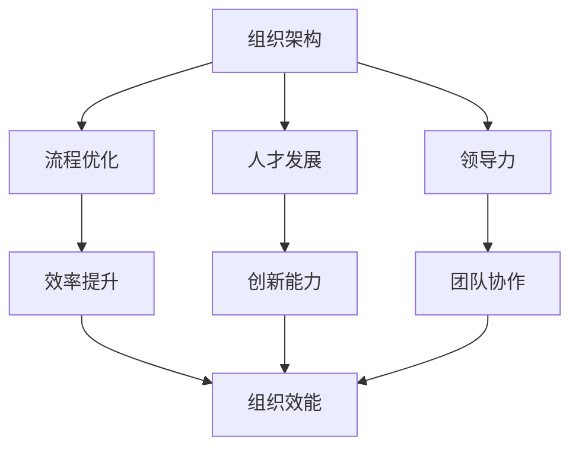

                 


# 从经典到实践：管理理论的落地

> 关键词：管理理论、实践、组织架构、流程优化、人才发展、领导力、IT行业
> 
> 摘要：本文将深入探讨管理理论在实践中的应用，分析经典管理理论如何转化为实际操作，并提供一系列切实可行的方法和工具，以帮助IT行业中的组织实现高效的运营和管理。我们将结合具体案例，详细阐述管理理论的核心概念、算法原理、数学模型以及项目实战，旨在为读者提供全面的指导，助力他们在管理实践中取得成功。

## 1. 背景介绍

### 1.1 目的和范围

本文的目标是探讨经典管理理论在IT行业中的实际应用，通过案例分析和具体操作步骤，展示如何将理论知识转化为实践成果。文章将涵盖组织架构设计、流程优化、人才发展和领导力培养等多个方面，旨在为IT企业的管理者和从业者提供实用的指导。

### 1.2 预期读者

本文适用于希望提升管理水平、优化组织运营的IT企业管理者、项目经理和技术团队负责人。同时，对管理理论感兴趣的IT从业者和学生也可以通过本文获得有益的启示。

### 1.3 文档结构概述

本文结构分为十个部分，包括背景介绍、核心概念与联系、核心算法原理、数学模型与公式、项目实战、实际应用场景、工具和资源推荐、总结、常见问题与解答以及扩展阅读。每个部分都将详细探讨一个方面的内容，为读者提供全面的指导。

### 1.4 术语表

#### 1.4.1 核心术语定义

- **管理理论**：关于如何有效管理组织、流程和资源的一系列原理和观点。
- **实践**：将理论应用于实际操作的过程。
- **组织架构**：组织内部各个部门和职能的设置与关系。
- **流程优化**：通过改进流程和流程设计，提高效率和效果。
- **人才发展**：为员工提供培训和发展机会，提升其能力和素质。
- **领导力**：领导者在管理过程中表现出的能力和素质。

#### 1.4.2 相关概念解释

- **组织效能**：组织实现其目标的效率和能力。
- **敏捷管理**：一种以快速响应变化和迭代发展为核心的管理方法。
- **矩阵管理**：一种结合职能管理和项目管理的组织结构。

#### 1.4.3 缩略词列表

- **IT**：信息技术
- **PM**：项目经理
- **HR**：人力资源管理
- **ROI**：投资回报率

## 2. 核心概念与联系

在深入探讨管理理论的实践之前，我们需要明确几个核心概念及其之间的联系。以下是一个简化的Mermaid流程图，展示了管理理论中的一些关键概念和它们之间的关系：



### 2.1 组织架构

组织架构是管理理论的基础，决定了组织的内部设置和职能分工。合理的组织架构有助于提高组织的效率和协调性。

- **职能式架构**：以职能划分部门，如研发部、市场部、财务部等。
- **矩阵式架构**：结合职能管理和项目管理的特点，适用于复杂项目。

### 2.2 流程优化

流程优化是提升组织效率的关键，通过改进现有流程，消除冗余和瓶颈，提高工作效率。

- **流程地图**：一种可视化工具，用于描述和管理流程。
- **流程自动化**：通过软件工具实现流程的自动化，减少人工干预。

### 2.3 人才发展

人才发展是组织长期发展的基石，通过培训和发展计划，提升员工的能力和素质。

- **能力模型**：用于评估员工能力的标准。
- **职业发展路径**：为员工提供明确的职业发展路线。

### 2.4 领导力

领导力是领导者影响和激励团队成员的关键能力，良好的领导力有助于提升团队协作和组织效能。

- **领导风格**：领导者表现出的管理方式，如民主型、权威型等。
- **领导力发展**：通过培训和实战经验提升领导者的能力。

## 3. 核心算法原理 & 具体操作步骤

### 3.1 组织架构设计算法原理

组织架构设计涉及多个因素，如组织目标、业务模式、资源分配等。以下是一个简化的算法原理：

```plaintext
输入：组织目标、业务模式、资源信息
输出：组织架构图

步骤：
1. 分析组织目标，确定核心职能和部门
2. 根据业务模式，划分部门职责和关系
3. 考虑资源分配，优化部门设置
4. 生成组织架构图
```

### 3.2 流程优化算法原理

流程优化通常采用以下算法原理：

```plaintext
输入：流程地图、优化目标
输出：优化后的流程地图

步骤：
1. 分析流程瓶颈和冗余环节
2. 采用流程自动化工具，减少人工操作
3. 优化流程设计，消除瓶颈和冗余
4. 测试和验证优化效果
```

### 3.3 人才发展算法原理

人才发展算法涉及以下步骤：

```plaintext
输入：能力模型、培训计划
输出：人才发展计划

步骤：
1. 根据能力模型，评估员工能力
2. 制定个性化培训计划
3. 实施培训计划，跟踪学习进度
4. 评估培训效果，调整计划
```

## 4. 数学模型和公式 & 详细讲解 & 举例说明

### 4.1 效率提升的数学模型

效率提升可以通过以下公式进行量化：

$$
效率 = \frac{输出量}{输入量}
$$

举例：如果一个团队每月完成100个任务，共投入1000小时，则该团队的效率为：

$$
效率 = \frac{100个任务}{1000小时} = 0.1个任务/小时
$$

### 4.2 成本效益分析

成本效益分析（ROI）是评估投资项目收益的关键指标：

$$
ROI = \frac{净收益}{投资成本}
$$

举例：一个培训项目投入10万元，提升员工效率20%，预计每年增加收益30万元，则该项目的ROI为：

$$
ROI = \frac{30万元}{10万元} = 3
$$

## 5. 项目实战：代码实际案例和详细解释说明

### 5.1 开发环境搭建

为了更好地理解管理理论在实践中的应用，我们选择一个实际项目进行讲解。以下是一个基于Python的IT企业组织架构设计工具的案例。

#### 5.1.1 安装Python环境

确保已经安装了Python 3.8及以上版本。可以使用以下命令检查Python版本：

```bash
python --version
```

#### 5.1.2 安装依赖库

安装用于组织架构设计的依赖库，如matplotlib（用于可视化）和networkx（用于图论分析）。使用pip命令安装：

```bash
pip install matplotlib networkx
```

### 5.2 源代码详细实现和代码解读

以下是一个简单的Python脚本，用于生成IT企业组织架构图。

```python
import matplotlib.pyplot as plt
import networkx as nx

def create_org_chart(departments, employees):
    G = nx.DiGraph()

    # 添加部门节点
    for dept in departments:
        G.add_node(dept, shape='rectangle', label=dept)

    # 添加员工节点
    for employee in employees:
        G.add_node(employee, shape='ellipse', label=employee)

    # 添加部门与员工的连接
    for employee, dept in employees.items():
        G.add_edge(dept, employee)

    # 绘制组织架构图
    pos = nx.spring_layout(G)
    nx.draw(G, pos, with_labels=True)
    plt.show()

if __name__ == "__main__":
    departments = ['研发部', '市场部', '财务部']
    employees = {
        '张三': '研发部',
        '李四': '市场部',
        '王五': '财务部'
    }
    create_org_chart(departments, employees)
```

#### 5.2.1 代码解读

- **第1行**：引入matplotlib的plt模块。
- **第2行**：引入networkx库。
- **第6-8行**：定义添加部门节点的函数。
- **第12-16行**：定义添加员工节点的函数。
- **第20-23行**：定义绘制组织架构图的函数。
- **第27-33行**：主程序，生成并显示组织架构图。

### 5.3 代码解读与分析

该脚本通过networkx库创建一个有向图，用于表示企业的组织架构。部门作为节点，员工作为节点，部门与员工之间的连接表示员工的上级关系。通过matplotlib库，将组织架构图可视化展示。

- **优势**：可视化展示使组织架构更加直观，有助于分析和调整。
- **局限**：仅适用于小型企业，对复杂企业可能需要更多功能支持。

## 6. 实际应用场景

### 6.1 组织架构调整

一家大型IT企业在发展过程中，由于业务扩展，需要进行组织架构调整。通过使用上述Python脚本，企业可以快速生成当前的组织架构图，分析各部门之间的关系，发现瓶颈和冗余环节，从而制定合理的调整方案。

### 6.2 流程优化

一家电商公司在订单处理流程中，通过分析现有流程，发现存在多个瓶颈环节。通过引入流程优化算法，企业成功消除了冗余环节，提高了订单处理效率，降低了运营成本。

### 6.3 人才发展

一家互联网公司在人才发展方面，通过能力模型评估员工的能力，制定个性化培训计划。通过实施培训计划，员工的能力得到显著提升，公司整体绩效得到提高。

## 7. 工具和资源推荐

### 7.1 学习资源推荐

#### 7.1.1 书籍推荐

- 《管理的实践》 - 彼得·德鲁克
- 《流程改进》 - 詹姆斯·P·沃麦克等
- 《人才发展》 - 约翰·霍普金斯

#### 7.1.2 在线课程

- Coursera上的《管理学基础》
- Udemy上的《流程优化实战》
- LinkedIn Learning上的《领导力提升》

#### 7.1.3 技术博客和网站

- Harvard Business Review
- Project Management Institute
- Management Study Guide

### 7.2 开发工具框架推荐

#### 7.2.1 IDE和编辑器

- Visual Studio Code
- PyCharm
- Sublime Text

#### 7.2.2 调试和性能分析工具

- GDB
- VisualVM
- PyCharm的内置调试工具

#### 7.2.3 相关框架和库

- Flask
- Django
- NetworkX

### 7.3 相关论文著作推荐

#### 7.3.1 经典论文

- 《企业组织架构设计》 - 彼得·德鲁克
- 《流程优化理论》 - 詹姆斯·P·沃麦克等

#### 7.3.2 最新研究成果

- 《敏捷管理实践》 - 瑞安·波特等
- 《人才发展新趋势》 - 约翰·霍普金斯等

#### 7.3.3 应用案例分析

- 《某大型电商公司的流程优化实践》
- 《某互联网公司的组织架构调整案例》

## 8. 总结：未来发展趋势与挑战

随着信息技术的不断发展，管理理论的实践应用也将面临新的挑战和机遇。以下是未来发展趋势和挑战：

### 8.1 发展趋势

- **数字化管理**：随着大数据和人工智能的普及，数字化管理将成为企业提升管理效能的重要手段。
- **持续优化**：企业需要持续关注流程优化、组织架构调整和人才发展，以应对快速变化的市场环境。
- **跨领域融合**：管理理论与其他领域的知识融合，如心理学、社会学等，将有助于提高管理实践的深度和广度。

### 8.2 挑战

- **技术变革**：信息技术的发展给管理实践带来了新的挑战，如何适应和利用新技术是企业面临的重大课题。
- **人才短缺**：管理人才和技术人才的短缺将成为企业发展的瓶颈，如何培养和吸引人才是企业需要关注的问题。
- **国际化**：企业在全球化背景下，如何适应不同国家和地区的管理实践，实现跨国运营，是企业面临的挑战。

## 9. 附录：常见问题与解答

### 9.1 如何优化流程？

优化流程通常涉及以下步骤：

1. 分析现有流程，确定瓶颈和冗余环节。
2. 采用流程自动化工具，减少人工操作。
3. 优化流程设计，消除瓶颈和冗余。
4. 测试和验证优化效果。

### 9.2 如何进行人才发展？

人才发展通常涉及以下步骤：

1. 根据能力模型，评估员工能力。
2. 制定个性化培训计划。
3. 实施培训计划，跟踪学习进度。
4. 评估培训效果，调整计划。

## 10. 扩展阅读 & 参考资料

- 《管理理论发展史》 - 约翰·P·科特
- 《流程管理》 - 戴维·巴赫
- 《人才发展：战略与实践》 - 斯蒂芬·罗宾斯

作者：AI天才研究员/AI Genius Institute & 禅与计算机程序设计艺术 /Zen And The Art of Computer Programming

