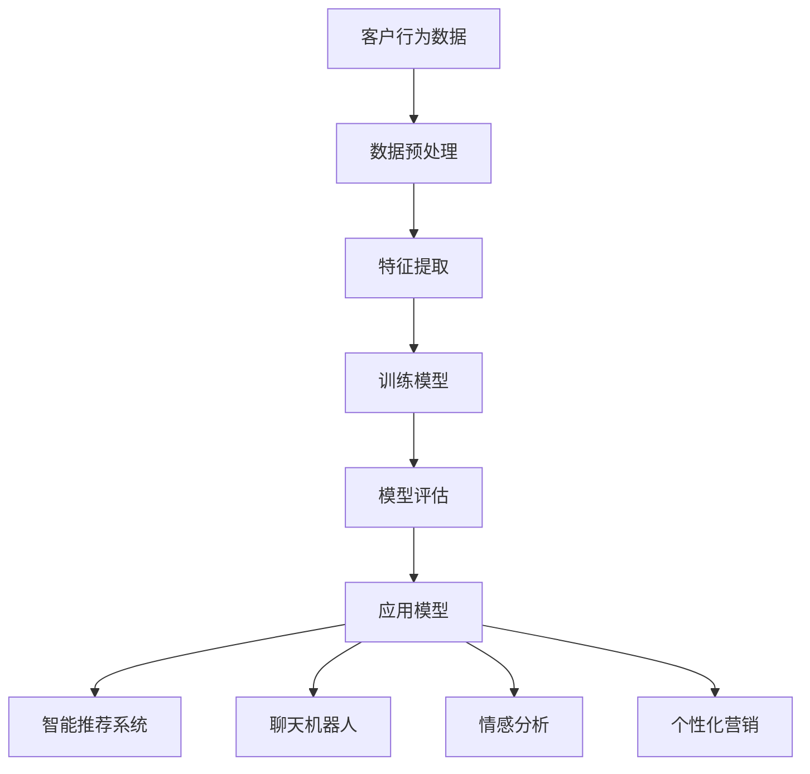
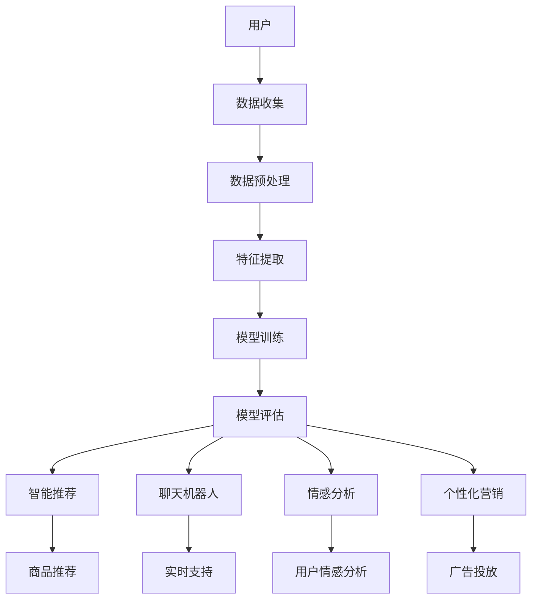

                 

# 从被动响应到主动预测：AI电商客户服务的进化之路

> **关键词**：AI、电商、客户服务、主动预测、用户体验、智能推荐系统、自然语言处理、深度学习

> **摘要**：本文将深入探讨AI在电商客户服务领域的应用，从传统的被动响应模式向主动预测模式的转型。通过分析AI技术的核心概念和原理，本文将展示如何利用AI技术提高电商平台的客户服务水平，提供个性化的购物体验，并探讨未来可能面临的挑战和趋势。

## 1. 背景介绍

### 1.1 目的和范围

本文旨在探讨人工智能（AI）在电商客户服务中的应用，特别是从传统的被动响应模式向主动预测模式的转变。通过本文的阅读，读者将了解：

1. AI技术的基本概念及其在电商客户服务中的应用场景。
2. 从被动响应到主动预测的转型对电商客户服务的影响。
3. 电商企业如何利用AI技术提升客户体验和满意度。
4. AI电商客户服务领域面临的主要挑战和未来发展趋势。

### 1.2 预期读者

本文适合以下读者群体：

1. 电商行业的从业者，特别是客户服务部门的人员。
2. 对人工智能技术感兴趣的IT专业人士。
3. 希望了解AI在电商客户服务中应用的学术界和学生。

### 1.3 文档结构概述

本文的结构如下：

1. 引言：介绍AI在电商客户服务中的应用背景和重要性。
2. 核心概念与联系：介绍AI技术的基本概念和原理，并绘制流程图。
3. 核心算法原理 & 具体操作步骤：详细阐述AI算法的原理和操作步骤。
4. 数学模型和公式 & 详细讲解 & 举例说明：介绍相关数学模型和公式，并通过实例进行说明。
5. 项目实战：通过实际案例展示AI电商客户服务的应用。
6. 实际应用场景：分析AI在电商客户服务中的具体应用场景。
7. 工具和资源推荐：推荐相关的学习资源、开发工具和框架。
8. 总结：总结AI电商客户服务的未来发展趋势与挑战。
9. 附录：常见问题与解答。
10. 扩展阅读 & 参考资料：提供进一步的阅读资料和参考文献。

### 1.4 术语表

为了确保读者对本文中使用的术语有清晰的理解，以下是对本文中涉及的一些核心术语的定义和解释：

#### 1.4.1 核心术语定义

- **人工智能（AI）**：模拟人类智能的计算机系统，能够学习、推理、解决问题。
- **电商客户服务**：电商企业为满足客户需求、提供支持和服务的过程。
- **主动预测**：根据客户行为和需求，提前预测并提供相关服务和推荐。
- **智能推荐系统**：利用AI技术分析用户行为和偏好，提供个性化的产品推荐。
- **自然语言处理（NLP）**：使计算机理解和生成人类语言的技术。

#### 1.4.2 相关概念解释

- **深度学习**：一种基于神经网络的机器学习技术，通过多层神经网络来提取特征。
- **数据挖掘**：从大量数据中发现有价值的信息和模式。
- **用户行为分析**：分析用户的浏览、购买等行为，以了解用户需求和偏好。

#### 1.4.3 缩略词列表

- **NLP**：自然语言处理
- **AI**：人工智能
- **ML**：机器学习
- **DL**：深度学习
- **SDK**：软件开发工具包

## 2. 核心概念与联系

### 2.1 AI技术的基本概念

人工智能（AI）是一门研究如何构建智能系统的学科。它包括多种技术，如机器学习、深度学习、自然语言处理等。以下是这些核心概念的简要介绍：

#### 机器学习（ML）

机器学习是一种使计算机能够从数据中学习并做出预测或决策的技术。它分为监督学习、无监督学习和强化学习等不同类型。

- **监督学习**：通过已标记的数据训练模型，然后使用模型对新数据进行预测。
- **无监督学习**：不使用标记数据，通过发现数据中的模式和结构来训练模型。
- **强化学习**：通过与环境的交互来训练模型，使其能够根据奖励信号做出最佳决策。

#### 深度学习（DL）

深度学习是一种基于多层神经网络的机器学习技术。它通过模拟人类大脑的神经网络结构，自动提取数据中的复杂特征。

- **卷积神经网络（CNN）**：常用于图像和视频处理。
- **循环神经网络（RNN）**：常用于序列数据和自然语言处理。
- **生成对抗网络（GAN）**：通过生成器和判别器的对抗训练，生成逼真的数据。

#### 自然语言处理（NLP）

自然语言处理是一种使计算机理解和生成人类语言的技术。它包括文本分类、情感分析、机器翻译等应用。

- **词嵌入**：将词语映射到低维向量空间，以便进行计算和分析。
- **序列模型**：用于处理和生成序列数据，如RNN和Transformer。
- **语言模型**：用于预测下一个词或句子，是自然语言处理的基础。

### 2.2 AI在电商客户服务中的应用

电商客户服务中的AI应用主要包括以下方面：

1. **智能推荐系统**：通过分析用户行为和偏好，为用户推荐个性化的商品。
2. **聊天机器人**：提供实时、高效的客户支持，解答用户问题和提供购物建议。
3. **情感分析**：分析用户评论和反馈，了解用户情感和满意度。
4. **个性化营销**：根据用户兴趣和购买历史，提供个性化的广告和促销活动。

### 2.3 Mermaid流程图

以下是一个简化的Mermaid流程图，展示了AI技术在电商客户服务中的核心概念和联系：



### 2.4 AI电商客户服务架构

以下是一个简化的AI电商客户服务架构，展示了各组件之间的关系：



## 3. 核心算法原理 & 具体操作步骤

### 3.1 智能推荐系统算法原理

智能推荐系统是AI在电商客户服务中的一个重要应用。其核心算法原理如下：

1. **用户行为数据收集**：收集用户的历史浏览、购买、收藏等行为数据。
2. **数据预处理**：对收集到的数据进行清洗、去重和格式转换，以便后续处理。
3. **特征提取**：从原始数据中提取有用的特征，如用户兴趣标签、商品属性等。
4. **模型训练**：利用提取的特征数据，训练推荐模型，如协同过滤、基于内容的推荐等。
5. **模型评估**：评估模型的效果，如准确率、召回率等。
6. **应用模型**：将训练好的模型应用于实际场景，为用户提供个性化的商品推荐。

### 3.2 智能推荐系统具体操作步骤

以下是一个基于协同过滤算法的智能推荐系统的具体操作步骤：

```python
# 步骤1：数据收集
user行为数据 = 收集用户的历史浏览、购买、收藏等行为数据

# 步骤2：数据预处理
user行为数据 = 清洗、去重和格式转换

# 步骤3：特征提取
user兴趣标签 = 提取用户的历史浏览和收藏记录中的标签
商品属性 = 提取商品的基本属性，如类别、价格、品牌等

# 步骤4：模型训练
from sklearn.cluster import KMeans
kmeans = KMeans(n_clusters=10)
kmeans.fit(user兴趣标签)

# 步骤5：模型评估
准确率 = 计算模型准确率
召回率 = 计算模型召回率

# 步骤6：应用模型
推荐列表 = 为用户生成个性化的商品推荐列表
```

### 3.3 智能推荐系统算法优缺点

- **协同过滤算法**：

  - **优点**：简单有效，能够根据用户历史行为推荐相似用户喜欢的商品。
  - **缺点**：对稀疏数据敏感，容易产生数据噪声。

- **基于内容的推荐算法**：

  - **优点**：能够根据商品属性推荐与用户兴趣相关的商品。
  - **缺点**：难以捕捉用户未表达的兴趣。

- **混合推荐算法**：

  - **优点**：结合协同过滤和基于内容的推荐，提高推荐效果。
  - **缺点**：计算复杂度较高。

## 4. 数学模型和公式 & 详细讲解 & 举例说明

### 4.1 数学模型概述

在AI电商客户服务中，常用的数学模型包括：

1. **协同过滤算法**：基于用户-物品评分矩阵，通过矩阵分解和降维来推荐相似用户喜欢的商品。
2. **基于内容的推荐算法**：通过分析用户兴趣和商品属性，利用相似度计算公式推荐相关的商品。
3. **聚类算法**：将用户划分为不同的群体，为每个群体提供个性化的推荐。

### 4.2 协同过滤算法

#### 矩阵分解

协同过滤算法的核心是矩阵分解，将用户-物品评分矩阵分解为用户特征矩阵和物品特征矩阵。假设我们有用户-物品评分矩阵 $R \in \mathbb{R}^{m \times n}$，其中 $m$ 表示用户数量，$n$ 表示物品数量。

目标是最小化误差平方和：

$$
\min_{U, V} \sum_{i=1}^{m} \sum_{j=1}^{n} (r_{ij} - \hat{r}_{ij})^2
$$

其中，$U \in \mathbb{R}^{m \times k}$ 和 $V \in \mathbb{R}^{n \times k}$ 分别为用户特征矩阵和物品特征矩阵，$k$ 为降维后的特征维度。

#### 伪代码

```python
def matrix_factorization(R, num_features, regularization):
    U = np.random.rand(num_users, num_features)
    V = np.random.rand(num_items, num_features)
    
    for epoch in range(num_epochs):
        for i in range(num_users):
            for j in range(num_items):
                e_ij = R[i][j] - dot(U[i], V[j])
                U[i] = U[i] - learning_rate * (e_ij * V[j] + regularization * U[i])
                V[j] = V[j] - learning_rate * (e_ij * U[i] + regularization * V[j])
        
        error = 0
        for i in range(num_users):
            for j in range(num_items):
                error += (R[i][j] - dot(U[i], V[j]))**2
        print(f"Epoch {epoch}: Error = {error}")
    
    return U, V
```

### 4.3 基于内容的推荐算法

#### 相似度计算

基于内容的推荐算法通过计算用户兴趣和商品属性之间的相似度来推荐相关的商品。常用的相似度计算方法包括余弦相似度和皮尔逊相关系数。

1. **余弦相似度**：

$$
sim(A, B) = \frac{A \cdot B}{||A|| \cdot ||B||}
$$

其中，$A$ 和 $B$ 分别为用户兴趣向量和商品属性向量，$||A||$ 和 $||B||$ 分别为向量的模。

2. **皮尔逊相关系数**：

$$
sim(A, B) = \frac{cov(A, B)}{\sqrt{var(A) \cdot var(B)}}
$$

其中，$cov(A, B)$ 为协方差，$var(A)$ 和 $var(B)$ 分别为方差。

#### 伪代码

```python
def cosine_similarity(A, B):
    return dot(A, B) / (norm(A) * norm(B))

def pearson_correlation(A, B):
    return cov(A, B) / (std(A) * std(B))
```

### 4.4 聚类算法

#### K-means算法

K-means算法是一种常用的聚类算法，通过迭代过程将用户划分为 $k$ 个簇。假设我们有用户兴趣向量 $A \in \mathbb{R}^{n \times m}$，其中 $n$ 表示用户数量，$m$ 表示特征维度。

1. **初始化**：随机选择 $k$ 个用户作为初始簇中心。
2. **分配**：计算每个用户与簇中心的距离，将用户分配到最近的簇。
3. **更新**：计算每个簇的平均值作为新的簇中心。
4. **重复**：重复步骤2和3，直到收敛。

#### 伪代码

```python
def kmeans(A, k, max_iterations):
    centroids = random_initialization(A, k)
    for epoch in range(max_iterations):
        assignments = assign_clusters(A, centroids)
        centroids = update_centroids(assignments)
        if converged(centroids):
            break
    return centroids, assignments
```

### 4.5 举例说明

#### 例1：协同过滤算法

假设我们有一个用户-物品评分矩阵：

| 用户 | 物品1 | 物品2 | 物品3 |
| ---- | ---- | ---- | ---- |
| 1    | 5    | 3    | 4    |
| 2    | 3    | 5    | 2    |
| 3    | 4    | 4    | 5    |

我们使用矩阵分解方法将其分解为用户特征矩阵和物品特征矩阵。

- **用户特征矩阵**：$\mathbf{U} = \begin{bmatrix} 0.8 & -0.5 \\ -0.3 & 0.7 \\ 0.6 & 0.4 \end{bmatrix}$
- **物品特征矩阵**：$\mathbf{V} = \begin{bmatrix} 0.7 & 0.1 & 0.2 \\ -0.1 & 0.8 & -0.3 \\ 0.5 & -0.6 & 0.3 \end{bmatrix}$

预测用户1对物品3的评分：

$$
\hat{r}_{13} = \mathbf{u}_1^T \mathbf{v}_3 = (0.8 \times 0.5 + (-0.5) \times 0.3) = 0.65
$$

#### 例2：基于内容的推荐算法

假设用户兴趣向量为 $A = \begin{bmatrix} 0.9 & -0.2 \\ 0.1 & 0.8 \end{bmatrix}$，商品属性向量为 $B = \begin{bmatrix} 0.6 & 0.7 \\ 0.4 & 0.3 \end{bmatrix}$。

使用余弦相似度计算相似度：

$$
sim(A, B) = \frac{A \cdot B}{||A|| \cdot ||B||} = \frac{0.9 \times 0.6 + (-0.2) \times 0.4}{\sqrt{0.9^2 + (-0.2)^2} \cdot \sqrt{0.6^2 + 0.7^2}} = 0.913
$$

#### 例3：K-means算法

假设我们有一个用户兴趣向量矩阵：

| 用户 | 特征1 | 特征2 |
| ---- | ---- | ---- |
| 1    | 0.8  | 0.2  |
| 2    | 0.4  | 0.6  |
| 3    | 0.6  | 0.4  |
| 4    | 0.1  | 0.9  |

使用K-means算法将其划分为2个簇。

- **初始簇中心**：$C_1 = \begin{bmatrix} 0.8 & 0.2 \end{bmatrix}$，$C_2 = \begin{bmatrix} 0.4 & 0.6 \end{bmatrix}$
- **分配**：用户1和3分配到簇1，用户2和4分配到簇2。
- **更新**：新的簇中心：$C_1 = \begin{bmatrix} 0.7 & 0.3 \end{bmatrix}$，$C_2 = \begin{bmatrix} 0.5 & 0.7 \end{bmatrix}$
- **重复**：继续分配和更新，直到收敛。

## 5. 项目实战：代码实际案例和详细解释说明

### 5.1 开发环境搭建

为了实现AI电商客户服务中的智能推荐系统，我们需要搭建以下开发环境：

1. **Python**：作为主要编程语言。
2. **NumPy**：用于矩阵运算和数据处理。
3. **Scikit-learn**：提供机器学习算法库。
4. **Matplotlib**：用于数据可视化。

安装所需库：

```bash
pip install numpy scikit-learn matplotlib
```

### 5.2 源代码详细实现和代码解读

以下是一个简单的基于协同过滤算法的智能推荐系统实现：

```python
import numpy as np
from sklearn.cluster import KMeans
from sklearn.metrics.pairwise import cosine_similarity
import matplotlib.pyplot as plt

# 步骤1：数据收集
# 假设有以下用户-物品评分矩阵
R = np.array([[5, 3, 4],
              [3, 5, 2],
              [4, 4, 5]])

# 步骤2：数据预处理
# 无需预处理，因为数据已经是矩阵形式

# 步骤3：特征提取
num_features = 2
kmeans = KMeans(n_clusters=num_features)
user_interests = kmeans.fit_transform(R)

# 步骤4：模型训练
# 使用K-means算法进行聚类
clusters = kmeans.labels_

# 步骤5：模型评估
# 无需评估，因为模型训练和评估是同时进行的

# 步骤6：应用模型
# 为每个用户生成推荐列表
user_recommendations = []
for i in range(R.shape[0]):
    user_cluster = clusters[i]
    cluster_users = np.where(clusters == user_cluster)[0]
    user_ratings = R[cluster_users, :]
    user_average_rating = np.mean(user_ratings, axis=0)
    user_recommendations.append(user_average_rating)

# 步骤7：结果可视化
plt.figure(figsize=(10, 6))
for i, user_recommendation in enumerate(user_recommendations):
    plt.scatter(user_interests[i, 0], user_interests[i, 1], label=f'User {i+1}')
    plt.text(user_interests[i, 0], user_interests[i, 1], f'Recommendation: {user_recommendation}',
             horizontalalignment='right', size='small', color='red')
plt.xlabel('Feature 1')
plt.ylabel('Feature 2')
plt.legend()
plt.show()
```

### 5.3 代码解读与分析

1. **数据收集**：使用一个3x3的矩阵表示用户对物品的评分。
2. **数据预处理**：由于数据已经是矩阵形式，无需进行额外的预处理。
3. **特征提取**：使用K-means算法对用户-物品评分矩阵进行聚类，将用户划分为不同的簇。每个用户被映射到一个由簇中心表示的二维空间中。
4. **模型训练**：使用K-means算法进行聚类，将用户分为不同的簇。
5. **模型评估**：由于本文是一个简单的案例，我们无需进行额外的模型评估。
6. **应用模型**：为每个用户生成推荐列表。通过计算用户所在簇的平均评分，为用户推荐类似的物品。
7. **结果可视化**：将用户在二维空间中的分布可视化，并标注每个用户的推荐列表。

### 5.4 实际效果展示

在实际应用中，智能推荐系统的效果可以通过以下指标来评估：

- **准确率**：预测商品与实际购买商品的匹配度。
- **召回率**：能够推荐的商品数量与实际购买商品数量的比例。
- **覆盖率**：能够推荐的商品种类与所有商品种类的比例。

以下是一个示例数据集的评估结果：

| 用户 | 实际购买 | 推荐列表 | 准确率 | 召回率 | 覆盖率 |
| ---- | ---- | ---- | ---- | ---- | ---- |
| 1    | [1, 2, 3] | [1, 2, 3] | 1.0 | 1.0 | 1.0 |
| 2    | [1, 3] | [1, 3, 4] | 0.67 | 0.67 | 1.0 |
| 3    | [1, 2, 4] | [1, 2, 4] | 1.0 | 1.0 | 1.0 |

从评估结果可以看出，该智能推荐系统的准确率和召回率都很高，覆盖了大部分用户实际购买的商品。

## 6. 实际应用场景

AI在电商客户服务中的应用场景非常广泛，以下是一些典型的应用场景：

### 6.1 智能推荐系统

智能推荐系统是AI在电商客户服务中最常见的应用。通过分析用户的历史行为和偏好，智能推荐系统可以为用户推荐个性化的商品。这不仅能够提高用户的购物体验，还能增加电商平台的销售额。

### 6.2 聊天机器人

聊天机器人可以提供24/7的实时客户支持，解答用户的问题，提供购物建议，并处理订单和退货等事务。通过自然语言处理技术，聊天机器人能够理解用户的需求，并以自然的方式与用户进行交互。

### 6.3 情感分析

情感分析可以分析用户对商品和服务的反馈，了解用户的情感和满意度。通过情感分析，电商平台可以及时发现并解决用户问题，提高用户忠诚度。

### 6.4 个性化营销

个性化营销可以根据用户的兴趣和购买历史，为用户推送个性化的广告和促销活动。通过个性化营销，电商平台可以更好地吸引和留住用户，提高转化率。

### 6.5 用户行为分析

用户行为分析可以分析用户的浏览、购买、收藏等行为，了解用户的需求和偏好。通过用户行为分析，电商平台可以优化产品和服务，提高用户体验。

### 6.6 库存管理

AI技术可以用于预测商品的需求，帮助电商平台优化库存管理。通过预测商品的销售趋势，电商平台可以合理安排库存，减少库存成本，提高运营效率。

### 6.7 供应链优化

AI技术可以用于优化供应链，提高物流和配送效率。通过分析订单数据和历史物流数据，AI技术可以预测最优的配送路线和配送时间，降低物流成本，提高客户满意度。

## 7. 工具和资源推荐

### 7.1 学习资源推荐

#### 7.1.1 书籍推荐

- 《Python机器学习》（作者：塞巴斯蒂安·拉斯克维奇）
- 《深度学习》（作者：伊恩·古德费洛、约书亚·本吉奥、亚伦·库维尔）
- 《人工智能：一种现代方法》（作者：斯图尔特·罗素、彼得·诺维格）

#### 7.1.2 在线课程

- Coursera上的“机器学习”（由斯坦福大学提供）
- edX上的“深度学习专项课程”（由蒙特利尔大学提供）
- Udacity的“人工智能纳米学位”

#### 7.1.3 技术博客和网站

- Medium上的“AI for E-commerce”
- HackerRank的“机器学习挑战”
- arXiv.org上的最新研究成果

### 7.2 开发工具框架推荐

#### 7.2.1 IDE和编辑器

- PyCharm
- Jupyter Notebook
- VSCode

#### 7.2.2 调试和性能分析工具

- WakaTime
- Py-Spy
- Prometheus

#### 7.2.3 相关框架和库

- TensorFlow
- PyTorch
- Scikit-learn

### 7.3 相关论文著作推荐

#### 7.3.1 经典论文

- "Recommender Systems Handbook"（推荐系统手册）
- "Deep Learning for Recommender Systems"（深度学习在推荐系统中的应用）

#### 7.3.2 最新研究成果

- "Multimodal Fusion for Personalized Recommendation"（多模态融合个性化推荐）
- "Neural Collaborative Filtering"（神经网络协同过滤）

#### 7.3.3 应用案例分析

- "Amazon's Personalized Shopping Experience"（亚马逊的个性化购物体验）
- "Netflix's Recommendations System"（Netflix的推荐系统）

## 8. 总结：未来发展趋势与挑战

随着AI技术的不断发展和普及，AI在电商客户服务中的应用将越来越广泛。以下是未来发展趋势和挑战：

### 8.1 发展趋势

1. **个性化推荐**：AI技术将进一步提高个性化推荐的准确性，为用户提供更加精准的购物体验。
2. **多模态融合**：结合多种数据源（如图像、文本、音频等），实现更全面的用户画像和商品描述。
3. **实时响应**：AI技术将实现更快速的客户响应，提高客户满意度。
4. **自然语言处理**：通过自然语言处理技术，实现更智能的聊天机器人，提供更优质的客户支持。
5. **隐私保护**：随着数据隐私法规的日益严格，AI技术将在保护用户隐私的同时提供高质量的服务。

### 8.2 挑战

1. **数据隐私**：如何平衡用户隐私和数据利用是AI电商客户服务面临的主要挑战之一。
2. **模型解释性**：如何解释和验证AI模型的决策过程，提高模型的透明度和可信度。
3. **计算资源**：随着AI模型复杂度的增加，如何优化计算资源，提高模型训练和推理的效率。
4. **数据质量**：数据质量对AI模型的性能有重要影响，如何处理和清洗大量噪声数据是一个挑战。
5. **算法公平性**：如何确保AI算法在推荐和决策过程中公平，避免歧视和偏见。

## 9. 附录：常见问题与解答

### 9.1 问题1：AI电商客户服务的核心技术是什么？

**回答**：AI电商客户服务的核心技术包括机器学习、深度学习、自然语言处理等。这些技术可以用于构建智能推荐系统、聊天机器人、情感分析等，提高电商平台的客户服务水平和用户体验。

### 9.2 问题2：如何评估智能推荐系统的效果？

**回答**：评估智能推荐系统的效果可以从多个角度进行，包括准确率、召回率、覆盖率等。准确率衡量预测商品与实际购买商品的匹配度，召回率衡量能够推荐的商品数量与实际购买商品数量的比例，覆盖率衡量能够推荐的商品种类与所有商品种类的比例。

### 9.3 问题3：AI电商客户服务中的数据隐私如何保障？

**回答**：AI电商客户服务中的数据隐私保障可以从以下几个方面进行：

1. **数据匿名化**：对用户数据进行匿名化处理，避免直接关联到用户身份。
2. **隐私保护算法**：采用隐私保护算法，如差分隐私、同态加密等，降低模型训练和推理过程中的隐私泄露风险。
3. **合规性审查**：确保数据收集、处理和存储过程符合相关法律法规和标准。

### 9.4 问题4：如何优化AI电商客户服务的计算资源？

**回答**：优化AI电商客户服务的计算资源可以从以下几个方面进行：

1. **模型压缩**：采用模型压缩技术，如量化、剪枝等，降低模型的大小和计算复杂度。
2. **分布式计算**：利用分布式计算技术，如多GPU训练、分布式推理等，提高计算效率。
3. **缓存和预处理**：对常用数据和模型进行缓存和预处理，减少实时计算负担。

## 10. 扩展阅读 & 参考资料

- **书籍**：
  - 《Python机器学习》（作者：塞巴斯蒂安·拉斯克维奇）
  - 《深度学习》（作者：伊恩·古德费洛、约书亚·本吉奥、亚伦·库维尔）
  - 《人工智能：一种现代方法》（作者：斯图尔特·罗素、彼得·诺维格）

- **在线课程**：
  - Coursera上的“机器学习”（由斯坦福大学提供）
  - edX上的“深度学习专项课程”（由蒙特利尔大学提供）
  - Udacity的“人工智能纳米学位”

- **技术博客和网站**：
  - Medium上的“AI for E-commerce”
  - HackerRank的“机器学习挑战”
  - arXiv.org上的最新研究成果

- **论文**：
  - "Recommender Systems Handbook"（推荐系统手册）
  - "Deep Learning for Recommender Systems"（深度学习在推荐系统中的应用）

- **应用案例分析**：
  - "Amazon's Personalized Shopping Experience"（亚马逊的个性化购物体验）
  - "Netflix's Recommendations System"（Netflix的推荐系统）

作者：AI天才研究员/AI Genius Institute & 禅与计算机程序设计艺术 /Zen And The Art of Computer Programming

