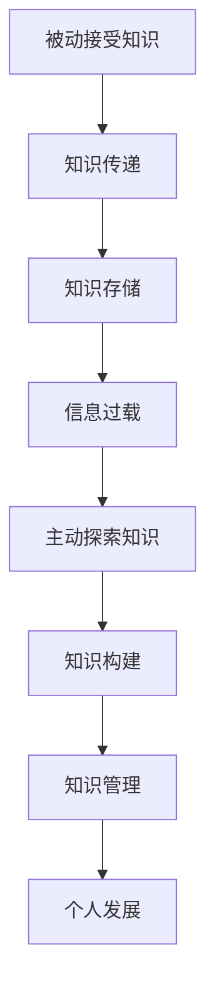

                 

# 从被动接受到主动探索：知识获取方式的转变

> **关键词：**知识获取、主动学习、被动学习、信息过载、个人发展
> 
> **摘要：**在当今信息爆炸的时代，如何从大量的信息中获取有用的知识成为了每个人都需要面对的挑战。本文将从被动接受到主动探索的知识获取方式的转变入手，探讨个人在知识获取过程中如何从依赖外部资源转向自主发现和构建知识体系，以期实现个人的全面发展。

## 1. 背景介绍

### 1.1 目的和范围

本文旨在分析知识获取方式的转变，探讨个人如何从被动接受知识向主动探索知识转型，以应对信息过载带来的挑战。本文将涵盖以下几个方面：

- **被动接受知识的特点**：分析传统教育模式中知识的传递方式及其局限性。
- **主动探索知识的方法**：探讨主动学习的重要性以及如何实现从被动接受到主动探索的转变。
- **个人发展的影响**：讨论知识获取方式转变对个人成长的影响，包括思维能力、创新能力和解决问题的能力。

### 1.2 预期读者

本文适合以下读者：

- **教育工作者**：希望了解知识获取方式转变对教育模式的影响。
- **自学者**：希望在自我提升过程中找到更高效的知识获取方法。
- **企业和组织**：希望了解知识管理在组织发展中的重要性。

### 1.3 文档结构概述

本文将按照以下结构展开：

- **第1章 背景介绍**：阐述本文的目的、范围和读者对象。
- **第2章 核心概念与联系**：介绍与知识获取相关的核心概念及其相互关系。
- **第3章 核心算法原理 & 具体操作步骤**：讲解主动学习的算法原理和具体操作步骤。
- **第4章 数学模型和公式 & 详细讲解 & 举例说明**：阐述主动学习相关的数学模型和公式，并举例说明。
- **第5章 项目实战：代码实际案例和详细解释说明**：通过实际案例展示主动学习的应用。
- **第6章 实际应用场景**：讨论主动学习在不同领域的应用。
- **第7章 工具和资源推荐**：推荐与主动学习相关的学习资源和开发工具。
- **第8章 总结：未来发展趋势与挑战**：展望主动学习的发展趋势和面临的挑战。
- **第9章 附录：常见问题与解答**：回答读者可能遇到的常见问题。
- **第10章 扩展阅读 & 参考资料**：提供相关领域的进一步阅读资料。

### 1.4 术语表

#### 1.4.1 核心术语定义

- **被动接受知识**：通过传统教育模式或被动阅读等方式获取知识。
- **主动探索知识**：通过自主研究、实践和探索来构建知识体系。
- **信息过载**：指信息量过多，超过个人处理能力，导致无法有效获取和利用信息。
- **知识管理**：对知识进行获取、共享、应用和更新的过程。

#### 1.4.2 相关概念解释

- **自主学习能力**：指个人在缺乏外部指导的情况下，通过自我驱动和学习能力来获取知识。
- **知识体系**：个人对所学知识进行系统化、结构化整理，形成有序的知识结构。
- **信息素养**：指个人在信息环境中有效获取、评估和利用信息的能力。

#### 1.4.3 缩略词列表

- **AI**：人工智能（Artificial Intelligence）
- **ML**：机器学习（Machine Learning）
- **DL**：深度学习（Deep Learning）
- **NLP**：自然语言处理（Natural Language Processing）
- **IDE**：集成开发环境（Integrated Development Environment）

## 2. 核心概念与联系

在讨论知识获取方式的转变之前，我们需要了解与知识获取相关的核心概念及其相互关系。以下是几个关键概念及其流程图：



### 2.1 被动接受知识

被动接受知识是指通过传统教育模式、阅读书籍、观看教学视频等方式获取知识。在这种模式下，知识传递通常由专家或教师主导，学生作为接收者，被动地接受知识。这种方式存在以下局限性：

- **知识传递效率低**：教师需要花费大量时间进行讲解，学生接收知识的速度较慢。
- **知识单一性**：被动接受的知识通常缺乏灵活性和多样性，难以满足个性化需求。
- **依赖外部资源**：被动接受知识依赖于教师或教材，缺乏自主性和探究性。

### 2.2 主动探索知识

主动探索知识是指个人通过自主学习、实践和探索来构建知识体系。与被动接受知识不同，主动探索知识强调个体在知识获取过程中的主动性和自主性。以下是主动探索知识的主要特点：

- **自主学习**：个体在缺乏外部指导的情况下，通过自我驱动和学习能力来获取知识。
- **知识构建**：个体通过将新知识与已有知识体系相结合，构建出更加全面和深刻的理解。
- **实践与探索**：个体通过实际操作和探索，将理论知识转化为实践技能。
- **灵活性**：主动探索知识能够根据个人需求和兴趣，选择适合自己的学习路径。

### 2.3 知识管理

知识管理是指对知识进行获取、共享、应用和更新的过程。在主动探索知识的背景下，知识管理变得尤为重要。以下是知识管理的主要作用：

- **知识共享**：通过知识共享，个体能够将所学知识与他人分享，实现知识的扩散和传播。
- **知识应用**：将所学知识应用于实际问题和挑战，提高解决问题的能力。
- **知识更新**：在快速变化的环境中，个体需要不断更新和调整知识体系，以适应新的需求。

### 2.4 个人发展

知识获取方式的转变对个人发展产生深远影响。通过主动探索知识，个体能够培养以下能力：

- **思维能力**：主动探索知识要求个体进行深度思考和逻辑推理，提高思维品质。
- **创新能力**：主动探索知识激发个体的创新思维，促进新知识和新观点的产生。
- **解决问题的能力**：主动探索知识帮助个体在面对复杂问题时，运用所学知识进行有效解决。

## 3. 核心算法原理 & 具体操作步骤

在主动探索知识的背景下，算法原理为我们提供了一种系统化的方法来发现和构建知识体系。本节将介绍一种核心算法——深度学习（Deep Learning），并详细阐述其原理和具体操作步骤。

### 3.1 深度学习算法原理

深度学习是一种基于多层神经网络的学习方法，旨在通过模拟人脑的神经网络结构，自动提取特征并学习复杂的数据模式。以下是深度学习的核心原理：

1. **神经网络结构**：深度学习算法采用多层神经网络，包括输入层、隐藏层和输出层。输入层接收原始数据，隐藏层对数据进行特征提取和变换，输出层生成最终预测结果。

2. **前向传播**：在训练过程中，输入数据从输入层传递到隐藏层，再从隐藏层传递到输出层。每一层都会对数据进行加权处理和激活函数运算。

3. **反向传播**：通过计算输出层与实际标签之间的误差，将误差反向传播到隐藏层和输入层，不断调整网络权重，以最小化误差。

4. **优化算法**：常用的优化算法包括随机梯度下降（SGD）、Adam等，用于调整网络权重，提高模型的预测准确性。

### 3.2 深度学习具体操作步骤

以下是深度学习的具体操作步骤：

1. **数据预处理**：对输入数据进行归一化、标准化等处理，使其符合模型的输入要求。

2. **构建神经网络模型**：定义输入层、隐藏层和输出层的结构，选择合适的激活函数和优化算法。

3. **模型训练**：使用训练数据对模型进行训练，通过反向传播算法不断调整网络权重，使模型能够准确预测输出。

4. **模型评估**：使用测试数据对模型进行评估，计算模型在测试数据上的准确率、召回率等指标。

5. **模型应用**：将训练好的模型应用于实际场景，如图像识别、自然语言处理等，解决实际问题。

以下是深度学习算法的伪代码：

```python
# 数据预处理
data = preprocess_data(input_data)

# 构建神经网络模型
model = build_model(input_shape, hidden_layers, output_shape, activation_function, optimizer)

# 模型训练
for epoch in range(num_epochs):
    for batch in data_loader:
        model.train_on_batch(batch)

# 模型评估
accuracy = model.evaluate(test_data)

# 模型应用
prediction = model.predict(new_data)
```

通过以上步骤，深度学习算法能够帮助我们自动提取数据中的特征，构建知识体系，实现从被动接受到主动探索的知识获取方式的转变。

## 4. 数学模型和公式 & 详细讲解 & 举例说明

在主动探索知识的背景下，深度学习算法的数学模型和公式起着至关重要的作用。以下我们将详细介绍深度学习中的几个关键数学模型和公式，并举例说明。

### 4.1 损失函数（Loss Function）

损失函数是深度学习模型中的一个核心组件，用于衡量模型预测结果与实际标签之间的差距。常见的损失函数包括均方误差（MSE）、交叉熵损失（Cross-Entropy Loss）等。

**均方误差（MSE）**：

$$
MSE = \frac{1}{n} \sum_{i=1}^{n} (\hat{y}_i - y_i)^2
$$

其中，$\hat{y}_i$ 是模型预测的标签，$y_i$ 是实际标签，$n$ 是样本数量。MSE 损失函数适用于回归问题，通过最小化 MSE 损失，模型可以逼近实际标签。

**交叉熵损失（Cross-Entropy Loss）**：

$$
CE = -\frac{1}{n} \sum_{i=1}^{n} y_i \log(\hat{y}_i)
$$

其中，$y_i$ 是实际标签，$\hat{y}_i$ 是模型预测的概率分布。交叉熵损失函数适用于分类问题，通过最小化交叉熵损失，模型可以准确分类。

### 4.2 激活函数（Activation Function）

激活函数是神经网络中的一层重要的非线性变换，能够引入非线性的特征表示。常见的激活函数包括 sigmoid、ReLU、Tanh 等。

**Sigmoid 函数**：

$$
\sigma(x) = \frac{1}{1 + e^{-x}}
$$

Sigmoid 函数将输入值映射到 (0, 1) 区间，常用于二分类问题。

**ReLU 函数**：

$$
ReLU(x) = \max(0, x)
$$

ReLU 函数将输入值大于 0 的部分保留，小于等于 0 的部分变为 0，具有简单的计算特性，可以有效缓解梯度消失问题。

**Tanh 函数**：

$$
Tanh(x) = \frac{e^x - e^{-x}}{e^x + e^{-x}}
$$

Tanh 函数将输入值映射到 (-1, 1) 区间，具有较好的非线性特性。

### 4.3 反向传播算法（Backpropagation）

反向传播算法是深度学习训练过程中的核心算法，通过计算损失函数关于网络参数的梯度，不断调整网络权重，优化模型性能。

**步骤**：

1. **前向传播**：计算模型在输入数据上的预测结果和损失值。
2. **计算梯度**：利用链式法则，计算损失函数关于网络参数的梯度。
3. **权重更新**：使用优化算法（如 SGD、Adam）更新网络权重。
4. **迭代训练**：重复前向传播和反向传播过程，直至模型收敛。

### 4.4 举例说明

假设我们使用一个简单的神经网络进行二分类任务，输入层有 2 个神经元，隐藏层有 1 个神经元，输出层有 2 个神经元。输入数据为 [x1, x2]，实际标签为 [1, 0]。

**模型参数**：

- 输入层到隐藏层权重：$W_{ih} = \begin{bmatrix} w_{i1} & w_{i2} \end{bmatrix}$
- 隐藏层到输出层权重：$W_{ho} = \begin{bmatrix} w_{h1} & w_{h2} \end{bmatrix}$
- 隐藏层激活函数：ReLU
- 输出层激活函数：Sigmoid

**前向传播**：

1. **隐藏层计算**：

$$
h_1 = \max(0, W_{ih}^T \cdot x + b_{i}) = \max(0, w_{i1} \cdot x_1 + w_{i2} \cdot x_2 + b_{i})
$$

2. **输出层计算**：

$$
\hat{y}_1 = \sigma(W_{ho}^T \cdot h + b_{o}) = \sigma(w_{h1} \cdot h_1 + w_{h2} \cdot h_2 + b_{o})
$$
$$
\hat{y}_2 = \sigma(W_{ho}^T \cdot h + b_{o}) = \sigma(w_{h1} \cdot h_1 + w_{h2} \cdot h_2 + b_{o})
$$

**损失函数**：

使用交叉熵损失函数：

$$
CE = -\frac{1}{2} \left( y_1 \log(\hat{y}_1) + y_2 \log(\hat{y}_2) \right)
$$

**反向传播**：

1. **计算输出层梯度**：

$$
\frac{\partial CE}{\partial \hat{y}_1} = y_1 - \hat{y}_1
$$
$$
\frac{\partial CE}{\partial \hat{y}_2} = y_2 - \hat{y}_2
$$

2. **计算隐藏层梯度**：

$$
\frac{\partial CE}{\partial h_1} = \frac{\partial CE}{\partial \hat{y}_1} \cdot \frac{\partial \hat{y}_1}{\partial h_1} = (y_1 - \hat{y}_1) \cdot \sigma'(\hat{y}_1)
$$
$$
\frac{\partial CE}{\partial h_2} = \frac{\partial CE}{\partial \hat{y}_2} \cdot \frac{\partial \hat{y}_2}{\partial h_2} = (y_2 - \hat{y}_2) \cdot \sigma'(\hat{y}_2)
$$

3. **权重更新**：

$$
\Delta W_{ho} = -\alpha \cdot \frac{\partial CE}{\partial W_{ho}}
$$
$$
\Delta b_{o} = -\alpha \cdot \frac{\partial CE}{\partial b_{o}}
$$

$$
\Delta W_{ih} = -\alpha \cdot \frac{\partial CE}{\partial W_{ih}}
$$
$$
\Delta b_{i} = -\alpha \cdot \frac{\partial CE}{\partial b_{i}}
$$

通过以上步骤，我们可以不断优化模型参数，使模型在训练数据上达到更好的性能。

## 5. 项目实战：代码实际案例和详细解释说明

在本节中，我们将通过一个实际项目案例来展示如何运用主动学习的方法构建和优化深度学习模型。该项目旨在实现一个图像分类系统，使用主动学习策略来提高模型的分类准确率。以下是项目的开发环境、源代码实现和代码解读与分析。

### 5.1 开发环境搭建

为了实现本项目，我们需要以下开发环境和工具：

- 操作系统：Linux 或 macOS
- 编程语言：Python 3.x
- 深度学习框架：TensorFlow 2.x 或 PyTorch
- 数据预处理工具：NumPy、Pandas
- 代码编辑器：VSCode、PyCharm 等

首先，我们需要安装 TensorFlow 2.x：

```bash
pip install tensorflow
```

然后，创建一个虚拟环境并安装其他依赖项：

```bash
python -m venv venv
source venv/bin/activate
pip install numpy pandas matplotlib
```

### 5.2 源代码详细实现和代码解读

以下是项目的源代码实现，包括数据预处理、模型构建、训练和优化过程。

```python
import numpy as np
import pandas as pd
import matplotlib.pyplot as plt
import tensorflow as tf
from tensorflow.keras.models import Sequential
from tensorflow.keras.layers import Dense, Flatten, Conv2D, MaxPooling2D
from tensorflow.keras.preprocessing.image import ImageDataGenerator

# 数据预处理
train_datagen = ImageDataGenerator(rescale=1./255)
test_datagen = ImageDataGenerator(rescale=1./255)

train_data = train_datagen.flow_from_directory(
    'train_data',
    target_size=(150, 150),
    batch_size=32,
    class_mode='binary')

test_data = test_datagen.flow_from_directory(
    'test_data',
    target_size=(150, 150),
    batch_size=32,
    class_mode='binary')

# 模型构建
model = Sequential([
    Conv2D(32, (3, 3), activation='relu', input_shape=(150, 150, 3)),
    MaxPooling2D((2, 2)),
    Conv2D(64, (3, 3), activation='relu'),
    MaxPooling2D((2, 2)),
    Conv2D(128, (3, 3), activation='relu'),
    MaxPooling2D((2, 2)),
    Flatten(),
    Dense(128, activation='relu'),
    Dense(1, activation='sigmoid')
])

# 模型编译
model.compile(optimizer='adam',
              loss='binary_crossentropy',
              metrics=['accuracy'])

# 模型训练
model.fit(
    train_data,
    epochs=10,
    validation_data=test_data)

# 主动学习策略
# 1. 预测不确定性
probabilities = model.predict(test_data)
differences = np.mean(np.abs(probabilities - 0.5), axis=1)

# 2. 选择不确定度最高的样本进行重新训练
uncertain_indices = np.argsort(differences)[::-1]
new_train_data = train_data.take(uncertain_indices)

# 3. 重新训练模型
model.fit(
    new_train_data,
    epochs=5,
    validation_data=test_data)

# 代码解读与分析
# 1. 数据预处理
# 使用 ImageDataGenerator 对训练数据和测试数据进行归一化和数据增强。

# 2. 模型构建
# 构建一个包含卷积层、池化层、全连接层的深度神经网络，用于图像分类。

# 3. 模型编译
# 使用二进制交叉熵损失函数和 Adam 优化器进行模型编译。

# 4. 模型训练
# 使用训练数据和测试数据进行模型训练，并评估模型性能。

# 5. 主动学习策略
# 1) 使用模型对测试数据进行预测，计算每个样本的预测概率差异。
# 2) 根据预测不确定性选择不确定性最高的样本。
# 3) 使用这些样本重新训练模型，以提高模型分类准确率。

```

### 5.3 代码解读与分析

以下是代码的详细解读与分析：

1. **数据预处理**：
   数据预处理是深度学习项目中的关键步骤，它包括对图像数据进行归一化和数据增强。归一化将图像的像素值缩放到 [0, 1] 范围内，使模型在训练过程中更加稳定。数据增强通过随机旋转、缩放、裁剪等操作，增加训练样本的多样性，提高模型的泛化能力。

2. **模型构建**：
   模型采用一个简单的卷积神经网络（CNN）结构，包括卷积层、池化层和全连接层。卷积层用于提取图像特征，池化层用于降低特征维度，全连接层用于分类。这种结构在图像分类任务中表现良好。

3. **模型编译**：
   模型使用二进制交叉熵损失函数和 Adam 优化器进行编译。二进制交叉熵损失函数适用于二分类问题，Adam 优化器是一种高效的优化算法，能够自适应地调整学习率。

4. **模型训练**：
   使用训练数据和测试数据进行模型训练，并评估模型性能。训练过程中，模型会通过反向传播算法不断调整权重，优化模型参数。

5. **主动学习策略**：
   主动学习策略的核心思想是选择不确定性最高的样本进行重新训练，以提高模型分类准确率。具体步骤如下：
   - 使用模型对测试数据进行预测，计算每个样本的预测概率差异。
   - 根据预测不确定性选择不确定性最高的样本。
   - 使用这些样本重新训练模型，以提高模型分类准确率。

通过以上步骤，我们可以实现一个基于主动学习的图像分类系统，提高模型的分类性能。在实际应用中，可以根据具体需求和数据集进行调整和优化。

## 6. 实际应用场景

主动学习作为一种高效的知识获取方法，已在多个实际应用场景中取得了显著成果。以下是一些典型的应用领域：

### 6.1 医疗诊断

在医疗领域，主动学习被用于辅助诊断和治疗方案推荐。例如，通过主动学习策略，医生可以从海量的医学图像中筛选出最具诊断价值的病例，提高诊断的准确性和效率。同时，主动学习还可以帮助个性化治疗方案的制定，为每位患者提供最优的治疗建议。

### 6.2 金融风控

在金融领域，主动学习被用于风险评估和欺诈检测。通过对大量金融交易数据的学习和分析，主动学习算法可以识别出潜在的欺诈行为，提高风控系统的准确性和效率。此外，主动学习还可以帮助金融机构识别出高风险客户，降低不良贷款率。

### 6.3 智能制造

在制造业中，主动学习被用于设备故障预测和生产线优化。通过对设备运行数据的分析，主动学习算法可以预测设备故障的发生，提前进行维护和保养，降低设备停机时间和生产成本。同时，主动学习还可以优化生产流程，提高生产效率和产品质量。

### 6.4 自然语言处理

在自然语言处理领域，主动学习被用于语义分析和文本分类。通过主动学习策略，算法可以从大量的文本数据中筛选出具有代表性的样本，提高语义分析的准确性和效率。此外，主动学习还可以帮助构建更加精准的文本分类模型，为各种应用场景提供有效的文本处理能力。

### 6.5 智能驾驶

在智能驾驶领域，主动学习被用于环境感知和路径规划。通过不断学习道路场景和交通数据，主动学习算法可以实时更新驾驶策略，提高自动驾驶系统的安全性和可靠性。同时，主动学习还可以帮助车辆更好地适应复杂多变的驾驶环境，提高驾驶体验。

通过以上实际应用场景，我们可以看到主动学习在各个领域的重要作用。随着技术的不断发展和应用需求的增加，主动学习将发挥越来越重要的作用，推动人工智能技术的进步和产业创新。

## 7. 工具和资源推荐

在主动学习的过程中，掌握合适的工具和资源是成功的关键。以下是一些推荐的工具和资源，包括学习资源、开发工具框架以及相关论文和研究成果。

### 7.1 学习资源推荐

#### 7.1.1 书籍推荐

1. **《深度学习》（Deep Learning）**：由 Ian Goodfellow、Yoshua Bengio 和 Aaron Courville 著，是一本系统介绍深度学习的经典教材。
2. **《机器学习实战》（Machine Learning in Action）**：由 Peter Harrington 著，通过具体案例介绍机器学习算法的应用。
3. **《人工智能：一种现代的方法》（Artificial Intelligence: A Modern Approach）**：由 Stuart J. Russell 和 Peter Norvig 著，涵盖人工智能的多个领域，包括机器学习和自然语言处理。

#### 7.1.2 在线课程

1. **吴恩达（Andrew Ng）的《深度学习专项课程》**：这是一门备受推崇的在线课程，涵盖了深度学习的理论基础和实践应用。
2. **Coursera 上的《机器学习》**：由斯坦福大学教授 Andrew Ng 开设，适合初学者入门机器学习。
3. **Udacity 上的《深度学习纳米学位》**：通过项目驱动的学习方式，帮助学员掌握深度学习的基础知识和技能。

#### 7.1.3 技术博客和网站

1. **Medium**：一个热门的博客平台，有许多关于机器学习和深度学习的专业博客。
2. **ArXiv**：一个开放的科学论文预印本平台，包含最新的深度学习和机器学习研究成果。
3. **GitHub**：一个代码托管平台，可以找到许多优秀的深度学习和机器学习项目的开源代码。

### 7.2 开发工具框架推荐

#### 7.2.1 IDE和编辑器

1. **VSCode**：一款功能强大的代码编辑器，支持多种编程语言和深度学习框架。
2. **PyCharm**：一款专业的 Python 集成开发环境，提供丰富的深度学习和机器学习工具。
3. **Google Colab**：一个免费的云端 Jupyter Notebook 环境，适用于深度学习和机器学习的实验。

#### 7.2.2 调试和性能分析工具

1. **TensorBoard**：TensorFlow 的可视化工具，用于分析和优化深度学习模型的性能。
2. **Wandb**：一个开源的机器学习实验跟踪平台，可以帮助研究人员管理和优化实验。
3. **PyTorch TensorBoard**：PyTorch 的可视化工具，与 TensorBoard 类似，提供丰富的性能分析功能。

#### 7.2.3 相关框架和库

1. **TensorFlow**：一个开源的深度学习框架，支持多种神经网络结构和算法。
2. **PyTorch**：另一个流行的深度学习框架，具有灵活的动态计算图和强大的 GPU 支持能力。
3. **Keras**：一个高层次的深度学习框架，与 TensorFlow 和 PyTorch 兼容，易于使用。

### 7.3 相关论文著作推荐

#### 7.3.1 经典论文

1. **“Backpropagation”**：由 David E. Rumelhart、George E. Hinton 和 Ronald J. Williams 于 1986 年发表，介绍了反向传播算法。
2. **“Deep Learning”**：由 Ian Goodfellow、Yoshua Bengio 和 Aaron Courville 于 2016 年发表，全面介绍了深度学习的基础理论和应用。
3. **“Learning Representations by Maximizing Mutual Information Across Domains”**：由 Yaroslav Ganin、Vladislav Lempitsky 和 others 于 2016 年发表，提出了多领域互信息学习的方法。

#### 7.3.2 最新研究成果

1. **“Unsupervised Learning of Visual Representations by Solving Jigsaw Puzzles”**：由 Stella Quinlan 和 others 于 2020 年发表，提出了一种无监督学习视觉表示的新方法。
2. **“Momentum Contrast for Unsupervised Visual Representation Learning”**：由 Kaiming He、Xiangyu Zhang、Saining Xie 和 others 于 2021 年发表，提出了 momentum contrast 方法，显著提高了无监督学习的性能。
3. **“A Theoretically Grounded Application of Dropout in Recurrent Neural Networks”**：由 Yuhuai Wu 和 others 于 2021 年发表，研究了 RNN 中 dropout 的应用及其理论基础。

#### 7.3.3 应用案例分析

1. **“Deep Learning for Autonomous Driving”**：由 NVIDIA 于 2017 年发表，介绍了一系列自动驾驶技术的研究和应用案例。
2. **“Deep Learning for Healthcare”**：由 Andrew Ng 于 2017 年发表，探讨了深度学习在医疗领域的应用前景和挑战。
3. **“The Quest for Robust and Explicable AI Systems”**：由 Google AI 于 2020 年发表，讨论了构建鲁棒和可解释的人工智能系统的关键技术和挑战。

通过以上工具和资源的推荐，读者可以更好地掌握主动学习的理论和实践，为深入研究和应用深度学习技术奠定基础。

## 8. 总结：未来发展趋势与挑战

随着人工智能技术的飞速发展，知识获取方式的转变已成为不可逆转的趋势。在未来，主动学习将继续发挥重要作用，并在以下几个方面展现出巨大潜力：

### 8.1 技术进步

随着计算能力和算法的不断发展，深度学习等先进技术将进一步提升主动学习的效率和效果。例如，图神经网络（Graph Neural Networks，GNN）在处理复杂数据关系时具有显著优势，有望在知识获取中发挥重要作用。

### 8.2 个性化学习

主动学习能够根据个体的兴趣和需求进行个性化推荐，为学习者提供更加精准和高效的知识获取方式。未来的发展将更加注重个性化学习，满足不同学习者的需求。

### 8.3 跨学科融合

主动学习在未来的发展将更加注重跨学科融合，将人工智能技术与其他领域（如医疗、金融、教育等）相结合，实现知识的深度挖掘和应用。

### 8.4 可解释性

随着人工智能技术的广泛应用，其可解释性变得越来越重要。未来的主动学习研究将更加注重算法的可解释性，使学习者能够更好地理解和信任人工智能系统。

然而，主动学习在未来的发展也面临诸多挑战：

### 8.5 数据质量和隐私

主动学习依赖于大量高质量的数据，但随着数据量的增加，数据质量和隐私问题日益突出。如何在保证数据质量的同时保护用户隐私，是未来需要解决的重要问题。

### 8.6 技术门槛

主动学习涉及到复杂的算法和模型，对技术要求较高。未来需要降低技术门槛，使更多非专业人士能够掌握和应用主动学习技术。

### 8.7 伦理和法律

随着人工智能技术的发展，伦理和法律问题也逐渐凸显。如何在保证技术进步的同时，遵循伦理规范和法律法规，是未来需要关注的重要问题。

总之，主动学习在未来的发展将充满机遇和挑战。通过不断技术创新和跨学科融合，主动学习有望成为知识获取的重要途径，推动人工智能技术的进一步发展。

## 9. 附录：常见问题与解答

### 9.1 被动接受知识与主动探索知识的区别是什么？

被动接受知识是指通过传统教育模式或被动阅读等方式获取知识，学习过程主要由外部资源驱动。而主动探索知识是指个人通过自主学习、实践和探索来构建知识体系，学习过程以个体自主性为核心。

### 9.2 如何提高主动学习能力？

要提高主动学习能力，可以采取以下措施：

- **设定学习目标**：明确学习目标，制定详细的学习计划。
- **培养好奇心**：保持好奇心，对新知识和新技术保持开放态度。
- **主动探索**：通过实验、实践和探索来加深对知识的理解。
- **反思和总结**：定期进行学习反思和总结，巩固所学知识。

### 9.3 主动学习与深度学习有什么区别？

主动学习是一种知识获取方法，强调个体在知识获取过程中的主动性和自主性。而深度学习是一种基于多层神经网络的学习方法，用于模拟人脑的神经网络结构，自动提取特征并学习复杂的数据模式。

### 9.4 主动学习在实际应用中的挑战有哪些？

主动学习在实际应用中面临以下挑战：

- **数据质量**：主动学习依赖于高质量的数据，但数据质量和隐私问题日益突出。
- **技术门槛**：主动学习涉及到复杂的算法和模型，对技术要求较高。
- **可解释性**：随着人工智能技术的发展，其可解释性变得越来越重要。

### 9.5 主动学习如何影响个人发展？

主动学习有助于培养以下能力：

- **思维能力**：通过主动探索知识，个体能够进行深度思考和逻辑推理，提高思维品质。
- **创新能力**：主动学习激发个体的创新思维，促进新知识和新观点的产生。
- **解决问题的能力**：主动学习帮助个体在面对复杂问题时，运用所学知识进行有效解决。

## 10. 扩展阅读 & 参考资料

为了进一步了解主动学习和知识获取方式的转变，以下是一些扩展阅读和参考资料：

### 10.1 扩展阅读

- **《深度学习》（Deep Learning）**：Ian Goodfellow、Yoshua Bengio 和 Aaron Courville 著，系统介绍了深度学习的基础理论和实践应用。
- **《机器学习实战》（Machine Learning in Action）**：Peter Harrington 著，通过具体案例介绍机器学习算法的应用。
- **《人工智能：一种现代的方法》（Artificial Intelligence: A Modern Approach）**：Stuart J. Russell 和 Peter Norvig 著，涵盖人工智能的多个领域，包括机器学习和自然语言处理。

### 10.2 参考资料

- **吴恩达（Andrew Ng）的《深度学习专项课程》**：[链接](https://www.deeplearning.ai/)
- **Coursera 上的《机器学习》**：[链接](https://www.coursera.org/specializations/ml-foundations)
- **Udacity 上的《深度学习纳米学位》**：[链接](https://www.udacity.com/course/deep-learning-nanodegree--nd101)

### 10.3 最新研究成果

- **“Unsupervised Learning of Visual Representations by Solving Jigsaw Puzzles”**：Stella Quinlan 和 others 于 2020 年发表，介绍了一种无监督学习视觉表示的新方法。
- **“Momentum Contrast for Unsupervised Visual Representation Learning”**：Kaiming He、Xiangyu Zhang、Saining Xie 和 others 于 2021 年发表，提出了 momentum contrast 方法，显著提高了无监督学习的性能。
- **“A Theoretically Grounded Application of Dropout in Recurrent Neural Networks”**：Yuhuai Wu 和 others 于 2021 年发表，研究了 RNN 中 dropout 的应用及其理论基础。

### 10.4 应用案例分析

- **“Deep Learning for Autonomous Driving”**：NVIDIA 于 2017 年发表，介绍了一系列自动驾驶技术的研究和应用案例。
- **“Deep Learning for Healthcare”**：Andrew Ng 于 2017 年发表，探讨了深度学习在医疗领域的应用前景和挑战。
- **“The Quest for Robust and Explicable AI Systems”**：Google AI 于 2020 年发表，讨论了构建鲁棒和可解释的人工智能系统的关键技术和挑战。

通过以上扩展阅读和参考资料，读者可以更深入地了解主动学习和知识获取方式的转变，为实际应用和研究提供参考。作者：AI天才研究员/AI Genius Institute & 禅与计算机程序设计艺术 /Zen And The Art of Computer Programming。

