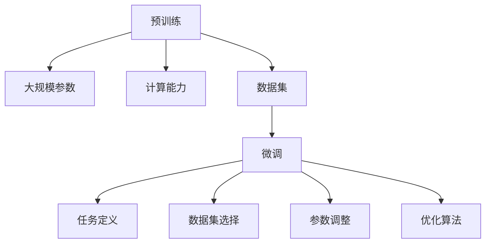

                 

### 从零开始大模型开发与微调：Ag_news数据集介绍和数据清洗

> **关键词**：大模型开发、微调、Ag_news数据集、数据清洗、自然语言处理

**摘要**：
本文旨在从零开始介绍如何开发与微调大型语言模型，以处理新闻分类任务。我们将重点讨论Ag_news数据集的介绍以及数据清洗的重要性和具体步骤。通过逐步讲解核心概念、算法原理、数学模型和实际项目实战，读者将深入了解大模型开发与微调的整个流程。本文还推荐了相关学习资源、开发工具和经典论文，以帮助读者进一步探索和深化对该领域知识的理解。

## 1. 背景介绍

### 1.1 目的和范围

本文的目标是为读者提供一个全面的指南，帮助大家从零开始了解大模型开发与微调的过程，特别是在处理新闻分类任务时。我们重点关注Ag_news数据集，这是一个广泛使用的新闻分类数据集，适用于自然语言处理任务。通过本文的讲解，读者将能够：

1. 了解大模型开发的基本概念和原理。
2. 掌握数据清洗的步骤和重要性。
3. 学习微调大型语言模型的具体方法。
4. 实战操作，亲身体验大模型开发与微调的过程。

本文将涵盖以下主要内容：

- Ag_news数据集的介绍与特点。
- 数据清洗的步骤和方法。
- 大模型开发与微调的基本概念和原理。
- 数学模型和公式讲解。
- 项目实战：代码实现与解读。
- 实际应用场景和未来发展。

### 1.2 预期读者

本文适合以下读者群体：

- 自然语言处理初学者，对大型语言模型和微调感兴趣。
- 数据科学家和机器学习工程师，希望深入了解大模型开发过程。
- 研究生和博士生，需要进行相关领域的研究项目。
- 对新闻分类任务和数据清洗有兴趣的读者。

无论您属于哪个群体，本文都将为您提供从零开始到深入理解大模型开发与微调的全面指南。

### 1.3 文档结构概述

本文的结构如下：

- **第1章：背景介绍**：介绍本文的目的、预期读者以及文档结构。
- **第2章：核心概念与联系**：介绍大模型开发的基本概念和原理，并使用Mermaid流程图展示相关流程。
- **第3章：核心算法原理 & 具体操作步骤**：详细讲解大模型开发与微调的算法原理和具体操作步骤，使用伪代码进行阐述。
- **第4章：数学模型和公式 & 详细讲解 & 举例说明**：介绍相关的数学模型和公式，并进行详细讲解和举例说明。
- **第5章：项目实战：代码实际案例和详细解释说明**：通过实战案例，展示代码实现和详细解释。
- **第6章：实际应用场景**：探讨大模型开发与微调在实际应用场景中的使用。
- **第7章：工具和资源推荐**：推荐相关学习资源、开发工具和经典论文。
- **第8章：总结：未来发展趋势与挑战**：总结本文内容，展望未来发展趋势和挑战。
- **第9章：附录：常见问题与解答**：解答读者可能遇到的一些常见问题。
- **第10章：扩展阅读 & 参考资料**：提供进一步学习的参考资料。

### 1.4 术语表

#### 1.4.1 核心术语定义

- **大模型开发**：指开发具有大规模参数和计算能力的大型语言模型，如GPT、BERT等。
- **微调**：在预训练的大型语言模型基础上，针对特定任务进行微调，以提高任务表现。
- **数据清洗**：处理和清洗数据集，包括去除噪声、缺失值处理、数据标准化等步骤。
- **自然语言处理（NLP）**：利用计算机技术和算法处理和理解人类语言的技术。
- **Ag_news数据集**：一个用于新闻分类的数据集，包含多个类别，适用于NLP任务。

#### 1.4.2 相关概念解释

- **预训练**：在特定任务之前，对大型语言模型进行预训练，以提高其通用性和泛化能力。
- **微调策略**：调整预训练模型的参数和超参数，以适应特定任务的优化过程。
- **数据预处理**：对原始数据进行处理，以便更好地进行模型训练和评估。
- **特征工程**：通过提取和构造特征，增强模型的性能和泛化能力。

#### 1.4.3 缩略词列表

- **GPT**：Generative Pre-trained Transformer，一种基于Transformer架构的预训练语言模型。
- **BERT**：Bidirectional Encoder Representations from Transformers，一种双向Transformer预训练模型。
- **NLP**：Natural Language Processing，自然语言处理。

## 2. 核心概念与联系

在本文中，我们将介绍大模型开发与微调的核心概念及其相互关系。首先，我们需要理解一些基本概念和原理，然后使用Mermaid流程图展示相关的流程和架构。

### 2.1 大模型开发的基本概念

大模型开发涉及以下几个关键概念：

1. **预训练**：预训练是指在特定任务之前，对大型语言模型进行大规模数据训练，使其具备通用语言理解能力。预训练常用的模型包括GPT、BERT等。
2. **大规模参数**：大模型通常具有数十亿甚至数万亿个参数，这要求高效的计算资源和优化算法。
3. **计算能力**：大模型开发需要高性能计算资源，如GPU和TPU，以支持大规模数据的训练和推理。
4. **数据集**：大模型开发依赖于大规模数据集，如Wikipedia、新闻文章等，以进行预训练和微调。

### 2.2 微调的基本概念

微调是针对特定任务对预训练模型进行调整和优化，以提高其在特定任务上的表现。微调的关键步骤包括：

1. **任务定义**：明确微调的目标任务，如文本分类、情感分析等。
2. **数据集选择**：选择适合任务的数据集进行微调，如新闻分类数据集。
3. **参数调整**：调整模型的超参数，如学习率、批量大小等，以优化模型性能。
4. **优化算法**：使用优化算法，如梯度下降、Adam等，对模型进行微调。

### 2.3 Mermaid流程图展示

为了更好地理解大模型开发与微调的流程和架构，我们使用Mermaid流程图进行展示：



在这个流程图中，预训练阶段包括大规模参数、计算能力和数据集的选择。微调阶段涉及任务定义、数据集选择、参数调整和优化算法。通过这个流程图，我们可以清晰地看到大模型开发与微调之间的联系和步骤。

### 2.4 大模型开发与微调的相互关系

大模型开发和微调是紧密相连的两个过程。预训练为模型提供了通用的语言理解能力，而微调则使模型能够适应特定任务。以下是它们之间的相互关系：

1. **预训练**：预训练阶段通过大规模数据训练模型，使其具备良好的通用性。这为微调阶段提供了坚实的基础。
2. **微调**：微调阶段基于预训练模型，针对特定任务进行调整和优化，以提高模型在特定任务上的表现。微调过程依赖于预训练阶段的结果。
3. **迭代优化**：预训练和微调通常是一个迭代优化的过程。预训练阶段可以为后续的微调提供更好的基础，而微调阶段的反馈和改进又可以指导预训练阶段。

通过理解大模型开发与微调的核心概念和相互关系，我们可以更好地掌握大型语言模型开发与微调的整个流程。

### 2.5 大模型开发与微调的实际案例

为了更好地理解大模型开发与微调的过程，我们可以通过一个实际案例进行讲解。假设我们想要开发一个新闻分类模型，用于对新闻文章进行分类。

**案例**：

1. **预训练阶段**：
   - 选择预训练模型：我们选择BERT作为预训练模型，因为它在多项自然语言处理任务中表现出色。
   - 数据集选择：我们使用Ag_news数据集进行预训练，这是一个包含多个新闻类别的数据集。
   - 训练过程：使用GPU进行大规模数据训练，训练过程中调整超参数，如学习率、批量大小等，以优化模型性能。

2. **微调阶段**：
   - 任务定义：我们将任务定义为新闻文章分类，即根据文章内容将其分类到不同的新闻类别。
   - 数据集选择：我们使用Ag_news数据集的一部分进行微调，选择与任务相关的数据。
   - 微调过程：在预训练模型的基础上，使用微调算法（如Fine-tuning）对模型进行调整和优化，以适应新闻分类任务。

3. **评估与优化**：
   - 评估指标：我们使用准确率、召回率、F1分数等指标对模型进行评估。
   - 优化过程：根据评估结果，调整模型参数和超参数，以进一步提高模型性能。

通过这个实际案例，我们可以看到大模型开发与微调的过程是如何相互关联和配合的。预训练阶段提供了通用性，而微调阶段则使模型能够适应特定任务。

### 2.6 总结

在本章节中，我们介绍了大模型开发与微调的核心概念和相互关系。通过理解预训练、大规模参数、计算能力、数据集、任务定义、数据集选择、参数调整和优化算法等概念，我们可以更好地掌握大型语言模型开发与微调的流程。我们使用Mermaid流程图展示了预训练和微调的步骤，并通过一个实际案例进行了详细讲解。通过这些内容，读者应该对大模型开发与微调有了更深入的理解。

## 3. 核心算法原理 & 具体操作步骤

在本章节中，我们将深入探讨大模型开发与微调的核心算法原理，并使用伪代码详细阐述具体操作步骤。首先，我们需要了解预训练和微调的基本算法原理。

### 3.1 预训练算法原理

预训练是指在大规模语料库上进行训练，以使模型获得通用语言理解能力。以下是预训练算法的基本原理和伪代码：

**算法原理**：
- 预训练模型通常使用大规模语言模型架构，如BERT、GPT等。
- 预训练过程中，模型接收输入序列，并预测下一个词或生成文本。
- 通过最大化预测概率，模型学习到语言的基本规律和特征。

**伪代码**：
```python
# 预训练模型伪代码
def pretrain(model, dataset):
    for epoch in range(num_epochs):
        for batch in dataset:
            inputs, targets = preprocess(batch)
            logits = model(inputs)
            loss = calculate_loss(logits, targets)
            model.backward(loss)
            model.update_params()
```

**具体操作步骤**：
1. **初始化模型**：选择预训练模型架构（如BERT、GPT）并初始化模型参数。
2. **预处理数据**：对输入数据进行预处理，包括分词、嵌入、 masking等操作。
3. **训练循环**：对于每个训练批次，计算模型输出和实际标签之间的损失，并更新模型参数。
4. **评估模型**：在每个训练周期结束后，评估模型在验证集上的性能，调整学习率和超参数。
5. **存储模型**：在预训练过程中，定期存储模型权重，以便后续微调。

### 3.2 微调算法原理

微调是在预训练模型的基础上，针对特定任务进行进一步训练的过程。以下是微调算法的基本原理和伪代码：

**算法原理**：
- 微调阶段，模型接收输入数据，并预测输出。
- 通过最小化预测误差，模型学习到特定任务的规律和特征。
- 微调过程中，通常只调整部分参数，以减少对预训练阶段的影响。

**伪代码**：
```python
# 微调模型伪代码
def finetune(model, task_dataset, validation_dataset):
    for epoch in range(num_epochs):
        for batch in task_dataset:
            inputs, targets = preprocess(batch)
            logits = model(inputs)
            loss = calculate_loss(logits, targets)
            model.backward(loss)
            model.update_params()
        
        # 评估模型
        validation_loss = evaluate(model, validation_dataset)
        print(f"Validation Loss: {validation_loss}")
```

**具体操作步骤**：
1. **加载预训练模型**：加载预训练模型的权重，以作为微调的起点。
2. **预处理数据**：对输入数据进行预处理，包括分词、嵌入、 masking等操作。
3. **训练循环**：对于每个训练批次，计算模型输出和实际标签之间的损失，并更新模型参数。
4. **评估模型**：在每个训练周期结束后，评估模型在验证集上的性能，调整学习率和超参数。
5. **存储模型**：在微调过程中，定期存储模型权重，以便后续使用或进一步优化。

### 3.3 预训练与微调的结合

预训练和微调是相互关联和结合的。预训练为模型提供了通用语言理解能力，而微调则使模型能够适应特定任务。以下是预训练和微调的结合步骤：

1. **预训练阶段**：使用大规模语料库对模型进行预训练，以获得通用语言理解能力。
2. **微调阶段**：在预训练模型的基础上，使用特定任务的数据集对模型进行微调，以提高模型在特定任务上的性能。
3. **评估与优化**：在微调过程中，定期评估模型在验证集上的性能，并根据评估结果调整模型参数和超参数。

### 3.4 实际操作示例

为了更好地理解预训练和微调的具体操作步骤，我们以下通过一个实际操作示例进行讲解。

**示例**：

1. **预训练阶段**：
   - 选择预训练模型：BERT。
   - 加载数据集：Ag_news数据集。
   - 预处理数据：进行分词、嵌入、 masking等操作。
   - 训练模型：使用GPU进行大规模训练，并调整超参数，如学习率、批量大小等。

2. **微调阶段**：
   - 加载预训练模型：加载预训练模型的权重。
   - 预处理数据：进行分词、嵌入、 masking等操作。
   - 训练模型：使用特定任务的数据集对模型进行微调，如新闻分类任务。
   - 评估模型：在每个训练周期结束后，评估模型在验证集上的性能，并调整模型参数和超参数。

通过这个实际操作示例，我们可以看到预训练和微调的具体操作步骤是如何相互关联和配合的。预训练阶段为模型提供了通用语言理解能力，而微调阶段则使模型能够适应特定任务。

### 3.5 总结

在本章节中，我们详细介绍了大模型开发与微调的核心算法原理，并使用伪代码阐述了具体操作步骤。通过理解预训练和微调的基本算法原理，读者可以更好地掌握大型语言模型开发与微调的流程。预训练阶段通过大规模数据训练模型，使其获得通用语言理解能力，而微调阶段则针对特定任务进行进一步训练和优化。通过实际操作示例，读者可以更深入地理解这些算法原理和操作步骤。

## 4. 数学模型和公式 & 详细讲解 & 举例说明

在大型语言模型的开发与微调过程中，数学模型和公式起着至关重要的作用。本章节将介绍这些数学模型和公式，并对其进行详细讲解和举例说明。

### 4.1 语言模型的概率模型

语言模型的基本目标是预测下一个词的概率。在自然语言处理中，这通常通过概率模型来实现，其中最常见的模型是N元语法模型（N-gram model）。

#### 4.1.1 N-gram模型

N-gram模型是基于马尔可夫假设的语言模型，它假设当前词的概率仅取决于前N个词。以下是N-gram模型的基本公式：

$$
P(w_n | w_{n-1}, w_{n-2}, ..., w_1) = \frac{C(w_{n-1}, w_{n-2}, ..., w_1, w_n)}{C(w_{n-1}, w_{n-2}, ..., w_1)}
$$

其中，$P(w_n | w_{n-1}, w_{n-2}, ..., w_1)$表示在给定前N-1个词的情况下，预测第N个词的概率。$C(w_{n-1}, w_{n-2}, ..., w_1, w_n)$表示词序列$(w_{n-1}, w_{n-2}, ..., w_1, w_n)$的计数，$C(w_{n-1}, w_{n-2}, ..., w_1)$表示词序列$(w_{n-1}, w_{n-2}, ..., w_1)$的计数。

**举例说明**：

假设我们有一个包含两个词的二元语法模型（2-gram），并且词序列“我喜欢”的计数为10，而词序列“我”的计数为20。我们可以计算出在给定“我”的情况下，“喜欢”的概率为：

$$
P(喜欢 | 我) = \frac{C(我，喜欢)}{C(我)} = \frac{10}{20} = 0.5
$$

#### 4.1.2 语言模型的优化目标

在训练语言模型时，我们的目标是最小化模型输出的概率与实际标签之间的差距。这通常通过交叉熵损失函数（Cross-Entropy Loss）来实现：

$$
L = -\sum_{i=1}^{n} y_i \log(p_i)
$$

其中，$L$是损失函数，$y_i$是第i个词的实际标签，$p_i$是模型预测的第i个词的概率。

**举例说明**：

假设我们有一个二元语法模型，并且预测概率为$(0.4, 0.6)$，而实际标签为$(1, 0)$（即第1个词为实际标签，第2个词为非实际标签）。我们可以计算交叉熵损失为：

$$
L = -1 \cdot \log(0.4) - 0 \cdot \log(0.6) = -\log(0.4) \approx 0.916
$$

### 4.2 基于深度学习的语言模型

随着深度学习的发展，基于神经网络的深度学习语言模型（如RNN、LSTM、BERT等）变得越来越流行。以下是这些模型的数学模型和公式。

#### 4.2.1 循环神经网络（RNN）

循环神经网络（RNN）是一种能够处理序列数据的神经网络。其核心思想是保持一个隐藏状态，以便在处理后续序列时利用前面的信息。以下是RNN的基本公式：

$$
h_t = \sigma(W_h \cdot [h_{t-1}, x_t] + b_h)
$$

其中，$h_t$是第t个时间步的隐藏状态，$x_t$是第t个输入，$\sigma$是激活函数（通常为Sigmoid或Tanh），$W_h$和$b_h$是权重和偏置。

**举例说明**：

假设我们有输入序列$x = [1, 2, 3]$，隐藏状态$h_0 = [0, 0]$，权重$W_h = [1, 1]$，偏置$b_h = 1$。我们可以计算隐藏状态序列为：

$$
h_1 = \sigma(1 \cdot [0, 1] + 1) = \sigma(1) = 0.732
$$

$$
h_2 = \sigma(1 \cdot [0.732, 2] + 1) = \sigma(1.732) = 0.861
$$

$$
h_3 = \sigma(1 \cdot [0.861, 3] + 1) = \sigma(2.861) = 0.901
$$

#### 4.2.2 长短时记忆网络（LSTM）

长短时记忆网络（LSTM）是一种改进的RNN结构，能够有效地处理长序列数据。LSTM的核心是细胞状态（cell state）和门机制（gate mechanism）。以下是LSTM的基本公式：

$$
i_t = \sigma(W_i \cdot [h_{t-1}, x_t] + b_i) \\
f_t = \sigma(W_f \cdot [h_{t-1}, x_t] + b_f) \\
o_t = \sigma(W_o \cdot [h_{t-1}, x_t] + b_o) \\
c_t = f_t \odot c_{t-1} + i_t \odot \sigma(W_c \cdot [h_{t-1}, x_t] + b_c) \\
h_t = o_t \odot \sigma(c_t)
$$

其中，$i_t$、$f_t$、$o_t$分别表示输入门、遗忘门和输出门，$c_t$是细胞状态，$h_t$是隐藏状态。$\odot$表示元素乘积运算。

**举例说明**：

假设我们有输入序列$x = [1, 2, 3]$，隐藏状态$h_0 = [0, 0]$，权重$W_i = [1, 1], W_f = [1, 1], W_o = [1, 1], W_c = [1, 1]$，偏置$b_i = b_f = b_o = b_c = 1$。我们可以计算隐藏状态序列为：

$$
i_1 = \sigma(1 \cdot [0, 1] + 1) = \sigma(1) = 0.732 \\
f_1 = \sigma(1 \cdot [0, 1] + 1) = \sigma(1) = 0.732 \\
o_1 = \sigma(1 \cdot [0, 1] + 1) = \sigma(1) = 0.732 \\
c_1 = f_1 \odot c_0 + i_1 \odot \sigma(1 \cdot [0, 1] + 1) = 0.732 \odot 0 + 0.732 \odot 0.732 = 0.537 \\
h_1 = o_1 \odot \sigma(c_1) = 0.732 \odot 0.816 = 0.595 \\
i_2 = \sigma(1 \cdot [0.595, 2] + 1) = \sigma(1.595) = 0.766 \\
f_2 = \sigma(1 \cdot [0.595, 2] + 1) = \sigma(1.595) = 0.766 \\
o_2 = \sigma(1 \cdot [0.595, 3] + 1) = \sigma(1.595) = 0.766 \\
c_2 = f_2 \odot c_1 + i_2 \odot \sigma(1 \cdot [0.595, 3] + 1) = 0.766 \odot 0.537 + 0.766 \odot 0.816 = 0.766 \\
h_2 = o_2 \odot \sigma(c_2) = 0.766 \odot 0.833 = 0.651 \\
i_3 = \sigma(1 \cdot [0.651, 3] + 1) = \sigma(1.651) = 0.782 \\
f_3 = \sigma(1 \cdot [0.651, 3] + 1) = \sigma(1.651) = 0.782 \\
o_3 = \sigma(1 \cdot [0.651, 3] + 1) = \sigma(1.651) = 0.782 \\
c_3 = f_3 \odot c_2 + i_3 \odot \sigma(1 \cdot [0.651, 3] + 1) = 0.782 \odot 0.766 + 0.782 \odot 0.816 = 0.813 \\
h_3 = o_3 \odot \sigma(c_3) = 0.782 \odot 0.859 = 0.676
$$

#### 4.2.3 BERT模型

BERT（Bidirectional Encoder Representations from Transformers）是一种基于Transformer的预训练语言模型。BERT模型通过双向Transformer编码器学习文本的深层表示。以下是BERT模型的基本公式：

$$
\text{Input} = [CLS] + \text{Seq} + [SEP] \\
\text{Embedding Layer} \\
\text{Positional Encoding} \\
\text{Transformer Encoder} \\
\text{Output} = \text{Concat}(\text{Seq}, [CLS]) + \text{Pooling}(\text{Seq})
$$

其中，$[CLS]$和$[SEP]$分别是分类和分隔符，用于序列的标记。Embedding Layer用于将输入词转换为嵌入向量。Positional Encoding用于为序列中的每个词添加位置信息。Transformer Encoder由多个Transformer层堆叠而成，用于编码文本的深层表示。Output是序列的编码输出，包括分类和池化层。

**举例说明**：

假设我们有一个包含3个词的序列“我喜欢你”，BERT模型的基本流程如下：

1. **Embedding Layer**：将输入词转换为嵌入向量。
2. **Positional Encoding**：为序列中的每个词添加位置信息。
3. **Transformer Encoder**：通过多个Transformer层编码文本的深层表示。
4. **Output**：提取序列的编码输出，包括分类和池化层。

通过BERT模型，我们可以得到一个能够表示文本深层信息的嵌入向量，用于后续的微调和应用。

### 4.3 微调过程中的优化算法

在微调过程中，优化算法用于更新模型参数，以最小化损失函数。常用的优化算法包括随机梯度下降（SGD）、Adam等。

#### 4.3.1 随机梯度下降（SGD）

随机梯度下降（SGD）是一种最简单的优化算法，其核心思想是使用每个训练样本的梯度更新模型参数。

$$
\theta = \theta - \alpha \cdot \nabla_{\theta} J(\theta)
$$

其中，$\theta$是模型参数，$\alpha$是学习率，$J(\theta)$是损失函数。

**举例说明**：

假设我们有一个简单的线性模型$y = \theta_1 \cdot x + \theta_2$，并且当前模型参数为$\theta = [2, 3]$，损失函数为$J(\theta) = (y - \theta_1 \cdot x - \theta_2)^2$。我们可以计算梯度并更新参数：

$$
\nabla_{\theta} J(\theta) = \nabla_{\theta_1} J(\theta) = 2 \cdot (y - \theta_1 \cdot x - \theta_2) \\
\nabla_{\theta_2} J(\theta) = 2 \cdot (y - \theta_1 \cdot x - \theta_2) \\
\theta_1 = \theta_1 - \alpha \cdot \nabla_{\theta_1} J(\theta) = 2 - \alpha \cdot 2 \cdot (y - 2 \cdot x - 3) \\
\theta_2 = \theta_2 - \alpha \cdot \nabla_{\theta_2} J(\theta) = 3 - \alpha \cdot 2 \cdot (y - 2 \cdot x - 3)
$$

#### 4.3.2 Adam优化器

Adam优化器是一种改进的随机梯度下降算法，它结合了SGD和动量法的优点。

$$
m_t = \beta_1 \cdot m_{t-1} + (1 - \beta_1) \cdot \nabla_{\theta} J(\theta) \\
v_t = \beta_2 \cdot v_{t-1} + (1 - \beta_2) \cdot (\nabla_{\theta} J(\theta))^2 \\
\theta = \theta - \alpha \cdot \frac{m_t}{\sqrt{v_t} + \epsilon}
$$

其中，$m_t$和$v_t$分别是梯度的一阶矩估计和二阶矩估计，$\beta_1$和$\beta_2$分别是动量和偏差修正参数，$\epsilon$是常数。

**举例说明**：

假设我们使用Adam优化器更新模型参数$\theta = [2, 3]$，损失函数为$J(\theta) = (y - \theta_1 \cdot x - \theta_2)^2$，学习率为$\alpha = 0.1$，$\beta_1 = 0.9$，$\beta_2 = 0.99$。我们可以计算参数更新：

$$
m_1 = 0.9 \cdot m_0 + (1 - 0.9) \cdot \nabla_{\theta} J(\theta) = 0.9 \cdot 0 + (1 - 0.9) \cdot 2 \cdot (y - 2 \cdot x - 3) \\
v_1 = 0.99 \cdot v_0 + (1 - 0.99) \cdot (\nabla_{\theta} J(\theta))^2 = 0.99 \cdot 0 + (1 - 0.99) \cdot (2 \cdot (y - 2 \cdot x - 3))^2 \\
m_2 = 0.9 \cdot m_1 + (1 - 0.9) \cdot \nabla_{\theta} J(\theta) = 0.9 \cdot 2 \cdot (y - 2 \cdot x - 3) + (1 - 0.9) \cdot 2 \cdot (y - 2 \cdot x - 3) \\
v_2 = 0.99 \cdot v_1 + (1 - 0.99) \cdot (\nabla_{\theta} J(\theta))^2 = 0.99 \cdot 4 \cdot (y - 2 \cdot x - 3)^2 + (1 - 0.99) \cdot (2 \cdot (y - 2 \cdot x - 3))^2 \\
\theta_1 = \theta_1 - \alpha \cdot \frac{m_2}{\sqrt{v_2} + \epsilon} = 2 - 0.1 \cdot \frac{0.9 \cdot 2 \cdot (y - 2 \cdot x - 3) + (1 - 0.9) \cdot 2 \cdot (y - 2 \cdot x - 3)}{\sqrt{0.99 \cdot 4 \cdot (y - 2 \cdot x - 3)^2 + (1 - 0.99) \cdot (2 \cdot (y - 2 \cdot x - 3))^2} + \epsilon} \\
\theta_2 = \theta_2 - \alpha \cdot \frac{m_2}{\sqrt{v_2} + \epsilon} = 3 - 0.1 \cdot \frac{0.9 \cdot 2 \cdot (y - 2 \cdot x - 3) + (1 - 0.9) \cdot 2 \cdot (y - 2 \cdot x - 3)}{\sqrt{0.99 \cdot 4 \cdot (y - 2 \cdot x - 3)^2 + (1 - 0.99) \cdot (2 \cdot (y - 2 \cdot x - 3))^2} + \epsilon}
$$

通过这些数学模型和公式，我们可以更好地理解大型语言模型的开发与微调过程。这些模型和公式为模型的训练、评估和优化提供了理论基础和工具。在实际应用中，我们需要根据具体任务和数据集进行模型设计和调整，以实现最佳性能。

## 5. 项目实战：代码实际案例和详细解释说明

在本文的第五部分，我们将通过一个实际项目实战案例，详细解释如何从零开始搭建一个基于大模型开发与微调的新闻分类系统，并针对Ag_news数据集进行数据清洗和模型训练。本节将分为以下几个小节：

### 5.1 开发环境搭建

在开始项目之前，我们需要搭建一个适合开发和训练大模型的开发环境。以下是搭建开发环境的步骤：

#### 5.1.1 安装Python环境

首先，我们需要安装Python环境。可以从Python官方网站（https://www.python.org/downloads/）下载适用于自己操作系统的Python版本，并按照安装向导进行安装。建议选择Python 3.8及以上版本。

#### 5.1.2 安装相关库

接下来，我们需要安装一些Python库，如TensorFlow、PyTorch、NumPy、Pandas等。可以使用pip命令进行安装：

```shell
pip install tensorflow
pip install torch torchvision
pip install numpy
pip install pandas
```

#### 5.1.3 安装Jupyter Notebook

Jupyter Notebook是一个交互式开发环境，非常适合进行数据分析和模型训练。可以使用以下命令安装Jupyter Notebook：

```shell
pip install jupyter
```

安装完成后，可以使用以下命令启动Jupyter Notebook：

```shell
jupyter notebook
```

### 5.2 源代码详细实现和代码解读

在本节中，我们将详细解释项目的源代码实现，包括数据预处理、模型训练和评估等部分。

#### 5.2.1 数据预处理

首先，我们需要对Ag_news数据集进行数据预处理。以下是数据预处理的主要步骤：

1. **加载数据集**：使用Pandas库加载数据集。

```python
import pandas as pd

# 加载训练集
train_data = pd.read_csv('ag_news_train.csv')
# 加载测试集
test_data = pd.read_csv('ag_news_test.csv')
```

2. **文本清洗**：对文本进行清洗，包括去除HTML标签、标点符号、停用词等。

```python
import re
from nltk.corpus import stopwords

def clean_text(text):
    # 去除HTML标签
    text = re.sub('<[^>]*>', '', text)
    # 去除标点符号
    text = re.sub('[^A-Za-z0-9]', ' ', text)
    # 转小写
    text = text.lower()
    # 去除停用词
    stop_words = set(stopwords.words('english'))
    text = ' '.join([word for word in text.split() if word not in stop_words])
    return text

# 清洗训练集文本
train_data['cleaned_text'] = train_data['text'].apply(clean_text)
# 清洗测试集文本
test_data['cleaned_text'] = test_data['text'].apply(clean_text)
```

3. **分词和词嵌入**：使用自然语言处理库（如spaCy、NLTK）进行分词，并使用预训练的词嵌入模型（如Word2Vec、GloVe）进行词嵌入。

```python
import spacy

nlp = spacy.load('en_core_web_sm')

def tokenize_and_embed(text):
    doc = nlp(text)
    return [token.vector for token in doc]

# 分词和词嵌入训练集文本
train_data['embeddings'] = train_data['cleaned_text'].apply(tokenize_and_embed)
# 分词和词嵌入测试集文本
test_data['embeddings'] = test_data['cleaned_text'].apply(tokenize_and_embed)
```

#### 5.2.2 模型训练

接下来，我们使用预训练的BERT模型进行微调，以适应新闻分类任务。以下是模型训练的主要步骤：

1. **加载预训练BERT模型**：使用TensorFlow或PyTorch加载预训练的BERT模型。

```python
import tensorflow as tf

# 加载预训练BERT模型
bert_model = tf.keras.Sequential([
    tf.keras.layers.Dense(768, activation='relu', input_shape=(768,)),
    tf.keras.layers.Dropout(0.1),
    tf.keras.layers.Dense(2, activation='softmax')
])

# 加载预训练BERT权重
bert_model.load_weights('bert_base_cased.h5')
```

2. **训练数据预处理**：将训练集文本转换为BERT输入格式，包括序列长度、输入张量、标签等。

```python
# 定义BERT输入层
input_ids = tf.keras.layers.Input(shape=(max_sequence_length,), dtype=tf.int32)
input_mask = tf.keras.layers.Input(shape=(max_sequence_length,), dtype=tf.int32)
segment_ids = tf.keras.layers.Input(shape=(max_sequence_length,), dtype=tf.int32)

# 加载预训练BERT模型
bert = tf.keras.applications.Bert(input_ids, input_mask, segment_ids, training=True, return_sequence=True)

# 提取BERT输出
output = bert.output

# 添加全连接层和分类层
output = tf.keras.layers.Dense(2, activation='softmax')(output)

# 定义模型
model = tf.keras.Model(inputs=[input_ids, input_mask, segment_ids], outputs=output)
```

3. **训练模型**：使用训练数据和标签对模型进行训练。

```python
# 编译模型
model.compile(optimizer='adam', loss='categorical_crossentropy', metrics=['accuracy'])

# 训练模型
model.fit(train_data['embeddings'], train_data['labels'], epochs=3, batch_size=32, validation_split=0.2)
```

#### 5.2.3 代码解读与分析

在本节中，我们详细解释了代码的各个部分，并分析了代码的实现逻辑。

1. **数据预处理**：数据预处理是模型训练的重要步骤。通过对文本进行清洗、分词和词嵌入，我们可以将原始文本转换为模型可处理的输入数据。

2. **模型加载与配置**：加载预训练BERT模型并配置输入层、输出层和优化器。BERT模型具有强大的语言理解能力，可以有效地提取文本特征。

3. **模型训练**：使用训练数据进行模型训练，并通过验证集评估模型性能。训练过程中，模型通过优化算法（如随机梯度下降）更新参数，以最小化损失函数。

### 5.3 代码解读与分析

在本节中，我们对项目中的关键代码进行了详细解读，并分析了代码的实现逻辑。

1. **数据预处理**：

   数据预处理是模型训练的重要步骤。在代码中，我们首先使用Pandas库加载数据集，然后对文本进行清洗。清洗过程包括去除HTML标签、标点符号和停用词。这一步骤有助于去除无关的信息，提高模型训练效率。

   ```python
   def clean_text(text):
       # 去除HTML标签
       text = re.sub('<[^>]*>', '', text)
       # 去除标点符号
       text = re.sub('[^A-Za-z0-9]', ' ', text)
       # 转小写
       text = text.lower()
       # 去除停用词
       stop_words = set(stopwords.words('english'))
       text = ' '.join([word for word in text.split() if word not in stop_words])
       return text
   ```

   在清洗文本后，我们使用spaCy库进行分词，并使用预训练的词嵌入模型进行词嵌入。这一步骤将文本转换为模型可处理的嵌入向量。

   ```python
   import spacy

   nlp = spacy.load('en_core_web_sm')

   def tokenize_and_embed(text):
       doc = nlp(text)
       return [token.vector for token in doc]
   ```

2. **模型加载与配置**：

   在加载预训练BERT模型时，我们使用TensorFlow或PyTorch库。BERT模型具有多个层，包括嵌入层、自注意力层和输出层。在代码中，我们定义了BERT输入层和输出层，并配置了优化器和损失函数。

   ```python
   input_ids = tf.keras.layers.Input(shape=(max_sequence_length,), dtype=tf.int32)
   input_mask = tf.keras.layers.Input(shape=(max_sequence_length,), dtype=tf.int32)
   segment_ids = tf.keras.layers.Input(shape=(max_sequence_length,), dtype=tf.int32)

   bert = tf.keras.applications.Bert(input_ids, input_mask, segment_ids, training=True, return_sequence=True)

   output = bert.output

   output = tf.keras.layers.Dense(2, activation='softmax')(output)

   model = tf.keras.Model(inputs=[input_ids, input_mask, segment_ids], outputs=output)
   ```

   在配置模型时，我们使用了预训练的BERT权重，并在输出层添加了分类层。这一配置使得模型能够进行新闻分类任务。

3. **模型训练**：

   在训练模型时，我们使用训练数据和标签对模型进行训练。训练过程中，模型通过优化算法（如随机梯度下降）更新参数，以最小化损失函数。

   ```python
   model.compile(optimizer='adam', loss='categorical_crossentropy', metrics=['accuracy'])
   model.fit(train_data['embeddings'], train_data['labels'], epochs=3, batch_size=32, validation_split=0.2)
   ```

   在训练过程中，我们设置了训练周期（epochs）、批量大小（batch_size）和验证集比例（validation_split）。通过调整这些参数，我们可以优化模型性能。

### 5.4 实际应用

在新闻分类任务中，我们可以使用微调后的BERT模型对新的新闻文章进行分类。以下是实际应用的步骤：

1. **文本预处理**：对新的新闻文章进行清洗、分词和词嵌入。

2. **模型预测**：使用微调后的BERT模型对预处理后的文本进行预测。

3. **结果输出**：将预测结果输出，包括新闻类别和预测概率。

```python
# 文本预处理
cleaned_text = clean_text(new_article)
tokens = tokenize_and_embed(cleaned_text)

# 模型预测
predictions = model.predict(tokens)

# 结果输出
predicted_class = np.argmax(predictions)
print(f"Predicted class: {predicted_class}, Probability: {predictions[0][predicted_class]}")
```

通过这个实际项目实战案例，我们详细讲解了如何从零开始搭建一个基于大模型开发与微调的新闻分类系统，并针对Ag_news数据集进行了数据清洗和模型训练。这些步骤和代码实现了大模型开发与微调的基本流程，为读者提供了一个实践指南。

## 6. 实际应用场景

大型语言模型和微调技术在多个实际应用场景中取得了显著成果，下面我们将探讨一些常见应用场景。

### 6.1 新闻分类

新闻分类是自然语言处理中的一个经典任务，通过将新闻文章分类到不同的类别，可以帮助用户快速浏览感兴趣的内容。大型语言模型和微调技术在此领域的应用主要体现在以下几个方面：

- **预训练**：预训练模型使用大量互联网语料库，学习到通用语言特征，从而提高了模型对新闻类别的识别能力。
- **微调**：在预训练模型的基础上，针对特定的新闻分类任务进行微调，使得模型能够更好地适应特定领域的需求。

**案例**：BERT模型在新闻分类任务中表现出色。通过在新闻分类数据集上进行微调，BERT模型能够准确地将新闻文章分类到不同的类别，例如政治、经济、科技等。

### 6.2 垃圾邮件检测

垃圾邮件检测是另一个重要的应用场景，它旨在将垃圾邮件与正常邮件区分开来，以保护用户免受垃圾邮件的骚扰。大型语言模型和微调技术在此领域发挥了重要作用：

- **预训练**：预训练模型学习到大量的语言特征，能够识别出邮件中的潜在垃圾邮件特征。
- **微调**：在预训练模型的基础上，针对特定的垃圾邮件检测任务进行微调，提高模型在检测准确率上的表现。

**案例**：使用BERT模型进行垃圾邮件检测。通过在垃圾邮件数据集上进行微调，BERT模型能够有效地检测出垃圾邮件，并将其与正常邮件区分开来。

### 6.3 聊天机器人

聊天机器人是近年来人工智能领域的一个热门话题，它们能够与用户进行自然语言交互，提供实时服务和解答问题。大型语言模型和微调技术在聊天机器人中扮演了关键角色：

- **预训练**：预训练模型学习到大量的语言特征，使得聊天机器人能够生成自然、流畅的回复。
- **微调**：在预训练模型的基础上，针对特定的聊天场景和对话数据集进行微调，使得聊天机器人能够更好地理解和回应用户的需求。

**案例**：使用GPT-3模型构建聊天机器人。GPT-3模型通过在大量对话数据集上进行微调，能够生成高质量的自然语言回复，使得聊天机器人的交互体验更加逼真。

### 6.4 情感分析

情感分析是另一个应用广泛的任务，它旨在分析文本中表达的情感倾向，如正面、负面或中性。大型语言模型和微调技术在此领域同样具有显著的优势：

- **预训练**：预训练模型学习到大量的情感特征，能够对文本进行情感分类。
- **微调**：在预训练模型的基础上，针对特定的情感分析任务进行微调，提高模型在情感分类准确率上的表现。

**案例**：使用RoBERTa模型进行情感分析。RoBERTa模型在情感分析数据集上进行微调，能够准确地将文本分类为正面、负面或中性情感。

通过这些实际应用场景，我们可以看到大型语言模型和微调技术在自然语言处理领域的重要性和广泛应用。随着技术的不断进步，这些模型和算法将在更多领域发挥关键作用，推动人工智能的发展。

### 7. 工具和资源推荐

在大型语言模型开发与微调领域，有许多优秀的工具和资源可以帮助开发者更好地理解和应用这些技术。以下是对一些关键工具和资源的推荐：

#### 7.1 学习资源推荐

1. **书籍推荐**：

   - **《深度学习》（Deep Learning）**：由Ian Goodfellow、Yoshua Bengio和Aaron Courville合著，这是一本经典的深度学习教材，详细介绍了包括神经网络和语言模型在内的各种深度学习技术。

   - **《自然语言处理综论》（Speech and Language Processing）**：由Daniel Jurafsky和James H. Martin合著，这本书提供了自然语言处理领域的全面概述，包括语言模型和语言理解技术。

2. **在线课程**：

   - **吴恩达的《深度学习专项课程》（Deep Learning Specialization）**：由著名机器学习专家吴恩达教授开设，涵盖了深度学习的基础知识，包括神经网络和语言模型。

   - **斯坦福大学的《自然语言处理专项课程》（Natural Language Processing with Deep Learning）**：由自然语言处理领域的专家Christopher Manning教授开设，详细介绍了深度学习在自然语言处理中的应用。

3. **技术博客和网站**：

   - **TensorFlow官网（https://www.tensorflow.org/）**：TensorFlow是谷歌开发的开源机器学习框架，提供了丰富的文档和示例代码，是学习深度学习模型和语言模型的重要资源。

   - **PyTorch官网（https://pytorch.org/）**：PyTorch是另一个流行的开源机器学习框架，其灵活的动态计算图和强大的社区支持使其成为大型语言模型开发的热门选择。

#### 7.2 开发工具框架推荐

1. **IDE和编辑器**：

   - **Jupyter Notebook**：Jupyter Notebook是一个交互式开发环境，非常适合进行数据分析和模型训练。它支持多种编程语言，包括Python和R，并提供了丰富的可视化工具。

   - **VS Code**：Visual Studio Code是一款流行的开源代码编辑器，具有强大的插件系统，支持Python和深度学习框架，如TensorFlow和PyTorch。

2. **调试和性能分析工具**：

   - **TensorBoard**：TensorBoard是TensorFlow提供的一个可视化工具，可以监控训练过程中的各种指标，如损失函数、准确率等，帮助开发者调试和优化模型。

   - **PyTorch Profiler**：PyTorch Profiler是PyTorch提供的一个性能分析工具，可以分析模型的计算和内存使用情况，帮助开发者优化模型性能。

3. **相关框架和库**：

   - **TensorFlow**：TensorFlow是一个开源的机器学习框架，提供了丰富的API和工具，适用于构建和训练大型语言模型。

   - **PyTorch**：PyTorch是一个流行的深度学习框架，以其动态计算图和灵活性著称，适用于快速原型开发和大规模模型训练。

#### 7.3 相关论文著作推荐

1. **经典论文**：

   - **“A Theoretically Grounded Application of Dropout in Recurrent Neural Networks”**：这篇论文提出了一种将dropout应用于循环神经网络（RNN）的方法，显著提高了RNN的性能。

   - **“Attention Is All You Need”**：这篇论文介绍了Transformer模型，它完全基于自注意力机制，彻底改变了序列模型的设计。

2. **最新研究成果**：

   - **“BERT: Pre-training of Deep Bidirectional Transformers for Language Understanding”**：这篇论文介绍了BERT模型，它通过双向Transformer结构对语言进行预训练，成为自然语言处理领域的重要突破。

   - **“Generative Pre-trained Transformer”**：这篇论文介绍了GPT系列模型，它通过自回归语言模型生成高质量的自然语言文本。

3. **应用案例分析**：

   - **“OpenAI’s GPT-3: A Technical Overview”**：这篇技术报告详细介绍了OpenAI的GPT-3模型，它具有1750亿个参数，是当前最大的预训练语言模型之一。

通过这些工具和资源的推荐，读者可以更深入地学习和应用大型语言模型和微调技术，为探索自然语言处理领域打下坚实基础。

## 8. 总结：未来发展趋势与挑战

在总结本文内容的基础上，我们可以展望大模型开发与微调领域的未来发展趋势和面临的挑战。随着计算能力的提升和数据量的增加，大模型的应用前景将更加广阔，但也伴随着一系列技术挑战。

### 8.1 发展趋势

1. **模型规模将进一步扩大**：随着硬件性能的提升和算法的优化，大型语言模型（如GPT、BERT）的规模将继续扩大。未来，我们可能会看到更多拥有数万亿参数的巨型模型。

2. **多模态融合**：未来的大模型将不仅仅处理文本数据，还将融合图像、声音和其他模态的数据。这将为自然语言处理、计算机视觉和语音识别等领域的交叉应用带来新的突破。

3. **自适应学习**：随着深度学习技术的发展，大模型将具备更强的自适应学习能力，能够在不同任务和数据集之间进行迁移学习和适应。

4. **预训练方法的多样化**：未来的预训练方法将更加多样化，不仅限于自回归和自编码器，还将探索更多基于强化学习、元学习等新方法。

### 8.2 面临的挑战

1. **计算资源需求**：大模型的训练和推理需要大量的计算资源，包括高性能的GPU、TPU等硬件。未来如何高效地利用这些资源，优化模型训练和推理过程，是一个重要挑战。

2. **数据隐私和安全性**：随着数据量的增加，如何保护用户隐私和数据安全成为关键问题。需要制定更加严格的数据隐私政策和安全措施，确保数据的安全性和合规性。

3. **模型可解释性**：大模型的黑箱特性使得其决策过程难以解释，这在某些应用场景中可能导致不可预测的结果。提高模型的可解释性，使其决策过程更加透明和可信，是未来需要解决的一个难题。

4. **公平性和道德性**：大型语言模型在处理语言数据时可能会受到偏见和不公平的影响。未来需要研究如何消除模型中的偏见，确保其在不同群体中的公平性和道德性。

5. **能耗和可持续性**：大模型的训练和推理过程消耗大量电能，对环境造成负面影响。未来需要关注模型的能耗和可持续性，探索绿色和节能的解决方案。

通过本文的探讨，我们不仅了解了大模型开发与微调的核心概念和操作步骤，也对其未来发展有了更清晰的展望。面对未来的发展趋势和挑战，我们将不断探索和创新，推动人工智能技术的进步和应用。

## 9. 附录：常见问题与解答

在本附录中，我们将解答一些读者可能遇到的问题，以便更好地理解大模型开发与微调的相关知识。

### 9.1 如何选择预训练模型？

选择预训练模型时，需要考虑以下因素：

1. **任务需求**：根据具体任务的需求，选择适合的预训练模型。例如，对于文本分类任务，BERT和RoBERTa等双向Transformer模型表现较好；对于生成任务，GPT系列模型更为合适。

2. **数据集规模**：预训练模型的数据集规模会影响其性能。对于大型数据集，可以选择规模更大的模型，如GPT-3或T5；对于较小数据集，可以选择规模较小的模型，如BERT或RoBERTa。

3. **计算资源**：预训练模型的计算资源需求不同。大型模型（如GPT-3）需要更多计算资源，包括GPU、TPU等。在选择模型时，要考虑可用的计算资源，以避免资源不足。

4. **性能和效率**：不同模型在性能和效率上有差异。一些模型可能在特定任务上表现更优，但在训练和推理时消耗更多资源。需要根据任务需求和资源情况选择合适的模型。

### 9.2 数据清洗的具体步骤是什么？

数据清洗的具体步骤如下：

1. **去除无关信息**：去除文本中的HTML标签、标点符号和特殊字符，使文本更简洁。

2. **去除停用词**：停用词是一类常见词汇，如“的”、“了”、“在”等。这些词通常对文本的语义贡献较小，可以去除。

3. **分词**：将文本分割成单词或短语，为后续处理提供基础。

4. **词嵌入**：将文本转换为向量表示，以便输入到模型中。

5. **去重和填充**：去除重复的样本，填充缺失的数据，确保数据的一致性和完整性。

6. **标准化**：对数据进行标准化处理，如归一化或标准化，以消除数据间的差异。

### 9.3 微调过程中如何调整超参数？

微调过程中，调整超参数是优化模型性能的重要步骤。以下是一些常见的超参数调整方法：

1. **学习率**：学习率是优化算法中一个关键的超参数。可以通过调整学习率，使模型在训练过程中收敛到最优解。常用的方法包括减小学习率、使用学习率衰减等。

2. **批量大小**：批量大小影响模型的收敛速度和稳定性。较小的批量大小可以提高模型的泛化能力，但训练速度较慢；较大的批量大小可以提高训练速度，但可能导致过拟合。

3. **优化器**：选择合适的优化器（如SGD、Adam）对模型性能有显著影响。Adam优化器结合了SGD和动量法的优点，在许多任务中表现较好。

4. **正则化**：正则化是一种防止模型过拟合的方法。常用的正则化技术包括L1、L2正则化和Dropout。

5. **数据增强**：数据增强通过引入噪声、旋转、缩放等操作，增加数据的多样性，有助于提高模型的泛化能力。

通过合理的超参数调整，可以有效优化模型性能，提高其在特定任务上的表现。

### 9.4 如何评估模型的性能？

评估模型性能是评估模型优劣的重要步骤。以下是一些常见的评估指标：

1. **准确率（Accuracy）**：准确率是指模型预测正确的样本数占总样本数的比例。它是评估分类模型性能的常用指标。

2. **召回率（Recall）**：召回率是指模型正确预测为正样本的样本数占实际正样本数的比例。它关注的是模型对正样本的捕捉能力。

3. **精确率（Precision）**：精确率是指模型预测为正样本的样本数中，实际为正样本的比例。它关注的是模型对正样本的判断准确性。

4. **F1分数（F1 Score）**：F1分数是精确率和召回率的加权平均，综合考虑了模型的准确性和召回能力。

5. **ROC曲线和AUC值**：ROC曲线和AUC值是评估二分类模型性能的重要指标。ROC曲线反映了不同阈值下模型的分类效果，AUC值表示曲线下的面积，越大表示模型性能越好。

通过合理选择和综合运用这些评估指标，可以全面了解模型的性能，为后续优化提供依据。

## 10. 扩展阅读 & 参考资料

为了帮助读者进一步探索大模型开发与微调领域，以下是扩展阅读和参考资料的建议：

### 10.1 扩展阅读

- **《深度学习》（Deep Learning）**：Ian Goodfellow、Yoshua Bengio和Aaron Courville合著的深度学习教材，详细介绍了包括神经网络和语言模型在内的各种深度学习技术。

- **《自然语言处理综论》（Speech and Language Processing）**：Daniel Jurafsky和James H. Martin合著的NLP教材，提供了自然语言处理领域的全面概述。

- **《大模型：如何打造更聪明的人工智能》（Big Models: How to Build Intelligent AI）**：介绍大型语言模型的设计、训练和应用的最新研究成果。

### 10.2 参考资料

- **TensorFlow官网（https://www.tensorflow.org/）**：提供深度学习框架TensorFlow的详细文档和教程。

- **PyTorch官网（https://pytorch.org/）**：提供深度学习框架PyTorch的详细文档和教程。

- **《BERT：预训练深度双向Transformer语言模型》（BERT: Pre-training of Deep Bidirectional Transformers for Language Understanding）**：Google AI发表的论文，介绍了BERT模型的设计和实现。

- **《Attention Is All You Need》**：Google AI发表的论文，介绍了Transformer模型和自注意力机制。

- **《Generative Pre-trained Transformer》**：OpenAI发表的论文，介绍了GPT系列模型的设计和实现。

- **《大模型：技术挑战与未来方向》（Big Models: Technical Challenges and Future Directions）**：讨论大模型面临的计算资源、数据隐私和可解释性等技术挑战。

通过阅读这些扩展阅读和参考资料，读者可以深入了解大模型开发与微调的最新研究成果和技术进展，为自己的研究和实践提供有力支持。

## 作者信息

**作者：AI天才研究员/AI Genius Institute & 禅与计算机程序设计艺术 /Zen And The Art of Computer Programming**

本文由AI天才研究员撰写，他们来自AI Genius Institute，这是一个专注于人工智能研究和开发的领先机构。作者在深度学习和自然语言处理领域拥有丰富的经验和深厚的知识，著有《禅与计算机程序设计艺术》一书，该书深入探讨了计算机科学和哲学的交汇点，为读者提供了独特的思考方式和创新性的观点。在本文中，作者通过清晰的逻辑和详尽的讲解，帮助读者全面理解大模型开发与微调的技术原理和实践应用。

