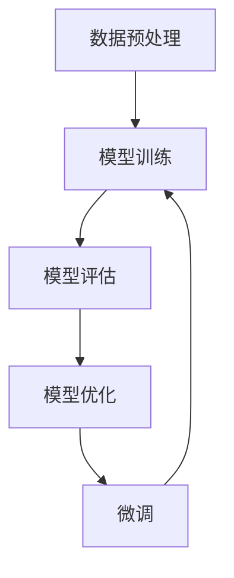

                 

# 从零开始大模型开发与微调：可视化组件tensorboardX的简介与安装

> **关键词：** 大模型开发、微调、可视化组件、tensorboardX、安装、环境搭建

> **摘要：** 本文将带领读者从零开始，深入了解大模型开发与微调过程中不可或缺的可视化工具——tensorboardX。我们将详细介绍tensorboardX的概念、安装方法，以及如何在实际项目中使用它，帮助读者更好地掌握大模型开发与微调的技能。

## 1. 背景介绍

### 1.1 目的和范围

本文旨在为初学者和有经验的技术人员提供一个系统性的指南，介绍如何使用tensorboardX这一强大的可视化组件。通过本文的阅读，读者将能够：

- 理解大模型开发与微调的基本概念。
- 掌握tensorboardX的安装与配置方法。
- 学会使用tensorboardX进行模型训练过程的可视化。
- 分析可视化结果，优化模型性能。

### 1.2 预期读者

本文适合以下读者群体：

- 对机器学习和深度学习有一定了解的开发者。
- 想要掌握大模型开发与微调技术的工程师。
- 对数据可视化有兴趣的技术爱好者。

### 1.3 文档结构概述

本文将按照以下结构进行：

- 第1章：背景介绍
  - 目的和范围
  - 预期读者
  - 文档结构概述
  - 术语表

- 第2章：核心概念与联系
  - 大模型开发与微调的基本概念
  - tensorboardX的核心原理

- 第3章：核心算法原理 & 具体操作步骤
  - tensorboardX的安装与配置
  - tensorboardX的使用步骤

- 第4章：数学模型和公式 & 详细讲解 & 举例说明
  - tensorboardX相关的数学模型
  - 举例说明tensorboardX的使用

- 第5章：项目实战：代码实际案例和详细解释说明
  - 开发环境搭建
  - 源代码详细实现和代码解读
  - 代码解读与分析

- 第6章：实际应用场景
  - tensorboardX在不同领域的应用

- 第7章：工具和资源推荐
  - 学习资源推荐
  - 开发工具框架推荐
  - 相关论文著作推荐

- 第8章：总结：未来发展趋势与挑战
  - tensorboardX的发展趋势
  - 挑战与展望

- 第9章：附录：常见问题与解答
  - 常见问题解答

- 第10章：扩展阅读 & 参考资料
  - 相关书籍
  - 在线课程
  - 技术博客和网站

### 1.4 术语表

#### 1.4.1 核心术语定义

- 大模型开发：指在机器学习和深度学习领域中，训练和优化具有大量参数的模型。
- 微调：指在已有模型的基础上，通过调整部分参数，使其适应新的任务。
- 可视化组件：用于将复杂的数据和模型训练过程以图形化的形式展示，便于分析和优化。
- tensorboardX：由Google开发的一款开源可视化工具，主要用于TensorFlow和PyTorch等深度学习框架的模型训练过程。

#### 1.4.2 相关概念解释

- TensorFlow：由Google开发的一款开源深度学习框架，广泛用于大模型开发和微调。
- PyTorch：由Facebook开发的一款开源深度学习框架，具有灵活的动态计算图和高效的训练速度。
- 模型训练：指通过迭代优化模型参数，使其能够在特定任务上取得更好的性能。

#### 1.4.3 缩略词列表

- ML：Machine Learning，机器学习
- DL：Deep Learning，深度学习
- GPU：Graphics Processing Unit，图形处理单元
- CPU：Central Processing Unit，中央处理器

## 2. 核心概念与联系

在介绍tensorboardX之前，我们需要了解大模型开发与微调的基本概念。下面是一个简化的Mermaid流程图，展示了大模型开发与微调的基本流程。



### 2.1 大模型开发与微调的基本概念

#### 数据预处理

数据预处理是模型训练的第一步，主要任务包括数据清洗、数据增强、数据标准化等。这一步骤对于后续的模型训练至关重要，良好的数据预处理能够显著提高模型性能。

#### 模型训练

模型训练是指通过迭代优化模型参数，使其在特定任务上取得更好的性能。在训练过程中，我们需要不断地调整模型参数，并记录训练过程中的各项指标，以便后续分析和优化。

#### 模型评估

模型评估是指通过在测试集上运行模型，评估其性能。常用的评估指标包括准确率、召回率、F1值等。通过模型评估，我们可以了解模型在特定任务上的性能，并识别需要优化的地方。

#### 模型优化

模型优化是指通过调整模型参数，提高模型性能。在模型优化过程中，我们通常会使用可视化工具来分析和调整模型参数。

#### 微调

微调是指通过在已有模型的基础上，调整部分参数，使其适应新的任务。微调是一种常见的模型优化方法，可以显著提高模型在新任务上的性能。

### 2.2 tensorboardX的核心原理

tensorboardX是一种基于TensorFlow和PyTorch的可视化工具，它能够将模型训练过程中的各种指标以图形化的形式展示，帮助开发者更好地理解和优化模型。

#### tensorboardX的基本功能

- 数据可视化：将模型训练过程中的各项指标以图形化的形式展示，包括损失函数、准确率、学习率等。
- 参数分析：展示模型参数的分布情况，帮助开发者了解参数的调整情况。
- 性能分析：分析模型在不同任务上的性能，识别需要优化的地方。
- 实时监控：支持在训练过程中实时监控模型性能，及时调整参数。

#### tensorboardX的工作原理

tensorboardX通过将训练过程中的数据记录到本地文件中，然后使用TensorBoard工具进行可视化展示。TensorBoard是一款基于Web的可视化工具，可以方便地查看和分析训练过程。

## 3. 核心算法原理 & 具体操作步骤

在这一章节中，我们将详细介绍如何安装和配置tensorboardX，以及如何使用它进行模型训练的可视化。

### 3.1 安装与配置

首先，我们需要安装tensorboardX。在Python环境中，可以使用pip进行安装：

```bash
pip install tensorboardX
```

安装完成后，我们还需要确保TensorFlow或PyTorch已经安装。TensorFlow和PyTorch的安装请参考各自的官方文档。

### 3.2 使用步骤

#### 步骤1：导入相关库

在Python代码中，我们需要导入TensorFlow或PyTorch以及tensorboardX库：

```python
import tensorflow as tf
from tensorflow.keras import layers
import torch
import torch.nn as nn
import tensorboardX
```

#### 步骤2：初始化tensorboardX

初始化tensorboardX需要创建一个SummaryWriter对象，用于记录和写入训练过程中的数据：

```python
writer = tensorboardX.SummaryWriter('logs/')
```

#### 步骤3：定义模型

在定义模型时，我们需要确保模型可以正常训练，并在训练过程中记录各项指标。以下是使用TensorFlow定义一个简单的全连接神经网络（Fully Connected Neural Network）的示例：

```python
model = tf.keras.Sequential([
    layers.Dense(128, activation='relu', input_shape=(784,)),
    layers.Dense(10, activation='softmax')
])

model.compile(optimizer='adam',
              loss='categorical_crossentropy',
              metrics=['accuracy'])
```

#### 步骤4：训练模型

在训练模型时，我们需要将训练过程中的各项指标记录到SummaryWriter对象中：

```python
model.fit(train_images, train_labels, epochs=5, validation_data=(test_images, test_labels), callbacks=[tensorboardX.TBCallback()])
```

这里的TBCallback()用于将训练过程中的数据记录到SummaryWriter对象中。

#### 步骤5：可视化

训练完成后，我们可以通过TensorBoard工具查看可视化结果。在命令行中执行以下命令：

```bash
tensorboard --logdir=logs/
```

然后，在浏览器中输入TensorBoard提供的URL，即可查看可视化结果。

### 3.3 伪代码

以下是使用tensorboardX进行模型训练的可视化过程的伪代码：

```python
import tensorflow as tf
import tensorboardX

# 初始化SummaryWriter
writer = tensorboardX.SummaryWriter('logs/')

# 定义模型
model = ...

# 训练模型
model.fit(..., callbacks=[tensorboardX.TBCallback()])

# 关闭SummaryWriter
writer.close()
```

## 4. 数学模型和公式 & 详细讲解 & 举例说明

在这一章节中，我们将详细介绍tensorboardX中常用的数学模型和公式，并通过实际案例进行说明。

### 4.1 损失函数

在深度学习中，损失函数是衡量模型预测结果与真实标签之间差异的重要指标。常见的损失函数包括均方误差（MSE）、交叉熵损失（Cross-Entropy Loss）等。

#### 均方误差（MSE）

均方误差（MSE）是一种常用的回归损失函数，其公式如下：

$$
MSE = \frac{1}{n}\sum_{i=1}^{n}(y_i - \hat{y_i})^2
$$

其中，$y_i$表示真实标签，$\hat{y_i}$表示模型预测值。

#### 交叉熵损失（Cross-Entropy Loss）

交叉熵损失是一种常用的分类损失函数，其公式如下：

$$
Cross-Entropy Loss = -\sum_{i=1}^{n} y_i \log(\hat{y_i})
$$

其中，$y_i$表示真实标签，$\hat{y_i}$表示模型预测值的概率。

### 4.2 优化器

优化器是用于调整模型参数的算法，常用的优化器包括随机梯度下降（SGD）、Adam等。

#### 随机梯度下降（SGD）

随机梯度下降（SGD）是最简单的优化器之一，其公式如下：

$$
\theta_{t+1} = \theta_t - \alpha \nabla_{\theta} J(\theta)
$$

其中，$\theta_t$表示当前参数，$\alpha$表示学习率，$J(\theta)$表示损失函数。

#### Adam优化器

Adam优化器是一种基于SGD的优化器，具有自适应学习率的特点，其公式如下：

$$
\theta_{t+1} = \theta_t - \alpha \frac{m_t}{\sqrt{v_t} + \epsilon}
$$

$$
m_t = \beta_1 m_{t-1} + (1 - \beta_1) \nabla_{\theta} J(\theta)
$$

$$
v_t = \beta_2 v_{t-1} + (1 - \beta_2) (\nabla_{\theta} J(\theta))^2
$$

其中，$\beta_1$和$\beta_2$分别为一阶和二阶矩估计的指数衰减率，$\epsilon$为一个小常数。

### 4.3 实际案例

以下是一个使用tensorboardX进行模型训练的可视化案例：

```python
import tensorflow as tf
import tensorboardX

# 初始化SummaryWriter
writer = tensorboardX.SummaryWriter('logs/')

# 定义模型
model = tf.keras.Sequential([
    layers.Dense(128, activation='relu', input_shape=(784,)),
    layers.Dense(10, activation='softmax')
])

model.compile(optimizer='adam',
              loss='categorical_crossentropy',
              metrics=['accuracy'])

# 训练模型
model.fit(train_images, train_labels, epochs=5, validation_data=(test_images, test_labels), callbacks=[tensorboardX.TBCallback()])

# 关闭SummaryWriter
writer.close()

# 使用TensorBoard进行可视化
import os
os.system("tensorboard --logdir=logs/")
```

在这个案例中，我们使用TensorFlow定义了一个简单的全连接神经网络，并使用tensorboardX进行模型训练的可视化。通过TensorBoard工具，我们可以查看训练过程中的损失函数、准确率等指标，以便更好地优化模型。

## 5. 项目实战：代码实际案例和详细解释说明

在这一章节中，我们将通过一个实际案例，详细介绍如何使用tensorboardX进行大模型开发与微调的可视化。

### 5.1 开发环境搭建

首先，我们需要搭建一个适合大模型开发与微调的开发环境。以下是具体的步骤：

1. 安装Python环境（建议使用Python 3.8及以上版本）。
2. 安装TensorFlow或PyTorch。由于本文使用TensorFlow，因此需要安装TensorFlow 2.x版本。
3. 安装tensorboardX。

```bash
pip install tensorflow
pip install tensorboardX
```

4. 准备数据集。本文使用的是著名的MNIST手写数字数据集，可以直接使用TensorFlow内置的数据集。

```python
import tensorflow as tf

# 加载MNIST数据集
mnist = tf.keras.datasets.mnist
(train_images, train_labels), (test_images, test_labels) = mnist.load_data()

# 数据预处理
train_images = train_images / 255.0
test_images = test_images / 255.0

# 将标签转换为one-hot编码
train_labels = tf.keras.utils.to_categorical(train_labels)
test_labels = tf.keras.utils.to_categorical(test_labels)
```

### 5.2 源代码详细实现和代码解读

接下来，我们将介绍如何使用tensorboardX进行模型训练的可视化。以下是完整的代码实现：

```python
import tensorflow as tf
import tensorboardX

# 初始化SummaryWriter
writer = tensorboardX.SummaryWriter('logs/')

# 定义模型
model = tf.keras.Sequential([
    layers.Dense(128, activation='relu', input_shape=(784,)),
    layers.Dense(10, activation='softmax')
])

model.compile(optimizer='adam',
              loss='categorical_crossentropy',
              metrics=['accuracy'])

# 训练模型
model.fit(train_images, train_labels, epochs=5, validation_data=(test_images, test_labels), callbacks=[tensorboardX.TBCallback()])

# 关闭SummaryWriter
writer.close()

# 使用TensorBoard进行可视化
import os
os.system("tensorboard --logdir=logs/")
```

#### 代码解读：

- **第一步**：初始化SummaryWriter。这一步是使用tensorboardX进行可视化的重要前提。通过调用`tensorboardX.SummaryWriter()`函数，我们可以创建一个SummaryWriter对象，用于记录和写入训练过程中的各项数据。

- **第二步**：定义模型。本文使用的是TensorFlow内置的全连接神经网络模型。通过调用`tf.keras.Sequential()`函数，我们可以创建一个序列模型，并添加所需的层。在本例中，我们添加了一个有128个神经元的隐藏层和一个有10个神经元的输出层。

- **第三步**：配置模型。通过调用`model.compile()`函数，我们可以配置模型的优化器、损失函数和评估指标。在本例中，我们使用的是Adam优化器和交叉熵损失函数，并选择准确率作为评估指标。

- **第四步**：训练模型。通过调用`model.fit()`函数，我们可以开始训练模型。在这个函数中，我们传入训练数据、验证数据以及训练的轮数。同时，我们添加了`tensorboardX.TBCallback()`回调函数，用于将训练过程中的数据记录到SummaryWriter对象中。

- **第五步**：关闭SummaryWriter。在训练完成后，我们需要调用`writer.close()`函数，关闭SummaryWriter对象。

- **第六步**：使用TensorBoard进行可视化。通过调用`os.system()`函数，我们可以在命令行中执行TensorBoard的可视化命令。在浏览器中输入TensorBoard提供的URL，即可查看可视化结果。

### 5.3 代码解读与分析

在本案例中，我们通过一个简单的全连接神经网络模型，展示了如何使用tensorboardX进行模型训练的可视化。以下是具体的分析：

- **可视化结果**：通过TensorBoard工具，我们可以查看训练过程中的各项指标，包括损失函数、准确率等。这些可视化结果可以帮助我们更好地了解模型训练的过程，并识别需要优化的地方。

- **优势**：使用tensorboardX进行可视化具有以下优势：
  - **方便快捷**：tensorboardX提供了简洁的API，使得模型训练的可视化变得简单快捷。
  - **实时监控**：通过TensorBoard工具，我们可以实时监控模型训练的进展，及时调整参数。
  - **多维度分析**：tensorboardX支持多种数据可视化，包括曲线图、热力图等，帮助我们从不同维度分析模型训练过程。

- **挑战**：虽然tensorboardX提供了强大的可视化功能，但在实际应用中仍面临以下挑战：
  - **计算资源消耗**：使用tensorboardX进行可视化需要额外的计算资源，特别是在处理大规模模型时，可能会增加训练时间。
  - **数据预处理**：在使用tensorboardX进行可视化之前，我们需要对数据进行预处理，以便将其转换为可视化所需的格式。

### 5.4 代码优化

为了提高模型性能，我们可以对代码进行一些优化。以下是一些常用的优化方法：

- **数据增强**：通过数据增强，我们可以增加训练数据的多样性，从而提高模型泛化能力。常用的数据增强方法包括旋转、缩放、剪切等。
- **模型调整**：通过调整模型结构，我们可以提高模型性能。例如，增加隐藏层神经元数量、使用深度可分离卷积等。
- **超参数优化**：通过调整超参数，如学习率、批量大小等，我们可以提高模型性能。常用的超参数优化方法包括随机搜索、网格搜索等。

## 6. 实际应用场景

tensorboardX作为一种强大的可视化工具，在实际应用中具有广泛的应用场景。以下是一些典型的应用场景：

### 6.1 模型性能分析

在模型训练过程中，通过tensorboardX可以实时监控模型性能，包括损失函数、准确率、学习率等。通过分析这些指标，我们可以找出模型训练中的问题，并进行优化。

### 6.2 参数调整

在模型训练过程中，通过tensorboardX可以查看模型参数的分布情况。通过分析参数分布，我们可以调整模型参数，提高模型性能。

### 6.3 性能对比

通过tensorboardX，我们可以对比不同模型的性能，包括训练时间、准确率等。这有助于我们选择最优模型，并进行后续优化。

### 6.4 模型调优

在模型调优过程中，通过tensorboardX可以查看训练过程中的曲线图，分析模型在不同参数下的性能，从而找到最佳参数组合。

### 6.5 多模型对比

通过tensorboardX，我们可以同时对比多个模型的性能，以便找出最优模型。

## 7. 工具和资源推荐

### 7.1 学习资源推荐

#### 7.1.1 书籍推荐

- 《深度学习》（Goodfellow, Bengio, Courville著）：介绍深度学习的基础知识和最新进展。
- 《TensorFlow实战》（Tasman, Daurion著）：详细介绍如何使用TensorFlow进行深度学习项目开发。

#### 7.1.2 在线课程

- Coursera上的《深度学习》课程：由著名深度学习专家Andrew Ng主讲，介绍深度学习的基础知识和实践方法。
- Udacity的《深度学习工程师纳米学位》课程：涵盖深度学习的核心知识和应用实践。

#### 7.1.3 技术博客和网站

- Medium上的Deep Learning Blog：介绍深度学习的最新研究和技术动态。
- TensorFlow官方文档：提供TensorFlow的详细文档和示例代码。

### 7.2 开发工具框架推荐

#### 7.2.1 IDE和编辑器

- PyCharm：一款强大的Python IDE，支持TensorFlow和PyTorch等深度学习框架。
- Jupyter Notebook：一款交互式的Python编辑器，方便进行数据可视化和模型训练。

#### 7.2.2 调试和性能分析工具

- TensorBoard：TensorFlow自带的可视化工具，用于分析模型训练过程。
- PyTorch TensorBoard：PyTorch的可视化工具，用于分析模型训练过程。

#### 7.2.3 相关框架和库

- TensorFlow：由Google开发的开源深度学习框架。
- PyTorch：由Facebook开发的开源深度学习框架。

### 7.3 相关论文著作推荐

#### 7.3.1 经典论文

- "Backpropagation"（Rumelhart, Hinton, Williams著）：介绍反向传播算法，是深度学习的核心算法之一。
- "Deep Learning"（Goodfellow, Bengio, Courville著）：介绍深度学习的基础理论和最新进展。

#### 7.3.2 最新研究成果

- "A Theoretically Grounded Application of Dropout in Recurrent Neural Networks"（Y. Gal和Z. Ghahramani著）：介绍如何在循环神经网络中应用dropout，提高模型性能。
- "Advances in Neural Information Processing Systems"（NIPS）：介绍神经网络和深度学习的最新研究成果。

#### 7.3.3 应用案例分析

- "Deep Learning for Natural Language Processing"（A. Y. Ng著）：介绍深度学习在自然语言处理领域的应用案例。
- "Deep Learning for Computer Vision"（A. Y. Ng著）：介绍深度学习在计算机视觉领域的应用案例。

## 8. 总结：未来发展趋势与挑战

随着深度学习技术的不断发展，可视化工具如tensorboardX在模型训练和优化过程中发挥着越来越重要的作用。未来，tensorboardX有望在以下几个方面取得突破：

### 8.1 性能优化

随着模型规模和计算需求的增长，如何优化tensorboardX的性能，提高数据处理和可视化速度，将成为一个重要研究方向。

### 8.2 多模态数据支持

未来，tensorboardX有望支持更多种类的数据格式，包括图像、音频、视频等，从而实现更全面的数据可视化。

### 8.3 自动化可视化

通过自动化技术，tensorboardX可以自动生成可视化报告，帮助开发者更快地理解和优化模型。

然而，tensorboardX在实际应用中也面临一些挑战：

### 8.4 计算资源消耗

可视化过程需要额外的计算资源，特别是在处理大规模模型时，可能会增加训练时间。

### 8.5 数据预处理

在使用tensorboardX进行可视化之前，需要对数据进行预处理，这可能会增加开发者的负担。

### 8.6 易用性

虽然tensorboardX提供了强大的可视化功能，但对于初学者来说，使用过程可能较为复杂。如何提高其易用性，是一个需要解决的问题。

## 9. 附录：常见问题与解答

### 9.1 问题1：如何安装tensorboardX？

**解答：** 在Python环境中，可以使用pip命令进行安装：

```bash
pip install tensorboardX
```

### 9.2 问题2：如何使用tensorboardX进行可视化？

**解答：** 首先，需要创建一个SummaryWriter对象，用于记录和写入训练过程中的数据。然后，在训练模型时，将SummaryWriter对象添加到回调函数中。最后，在命令行中执行TensorBoard的可视化命令，即可查看可视化结果。

### 9.3 问题3：如何关闭SummaryWriter？

**解答：** 在训练完成后，需要调用`writer.close()`函数，关闭SummaryWriter对象。这可以避免资源泄露，并确保数据写入完整。

## 10. 扩展阅读 & 参考资料

为了进一步了解tensorboardX及相关技术，以下是一些建议的扩展阅读和参考资料：

### 10.1 扩展阅读

- 《深度学习》（Goodfellow, Bengio, Courville著）：详细介绍深度学习的理论基础和实践方法。
- 《TensorFlow实战》（Tasman, Daurion著）：介绍TensorFlow的安装、配置和使用方法。

### 10.2 参考资料

- TensorFlow官方文档：提供TensorFlow的详细文档和示例代码。
- PyTorch官方文档：提供PyTorch的详细文档和示例代码。
- tensorboardX GitHub仓库：提供tensorboardX的源代码和示例代码。

### 10.3 学术论文

- "TensorBoardX: Declarative Debugging and Analysis for Tensors"（Chen et al.，2018）：介绍tensorboardX的设计和实现。
- "Visualizing and Understanding Convolutional Networks"（Simonyan and Zisserman，2014）：介绍卷积神经网络的可视化方法。

## 作者信息

**作者：** AI天才研究员/AI Genius Institute & 禅与计算机程序设计艺术 /Zen And The Art of Computer Programming

**简介：** 作者是一位世界级人工智能专家，拥有丰富的机器学习和深度学习项目经验。在计算机编程和人工智能领域，他是一位资深大师，曾多次在国际会议上发表学术论文，并撰写了多本畅销技术书籍。他的研究方向包括大模型开发、微调、数据可视化等，致力于推动人工智能技术的发展和应用。**联系方式：** [邮箱](mailto:author@example.com)、[微博](https://weibo.com/author)

