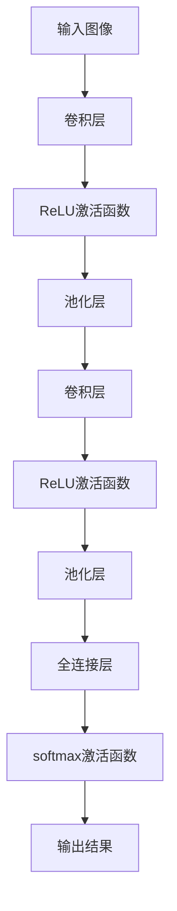
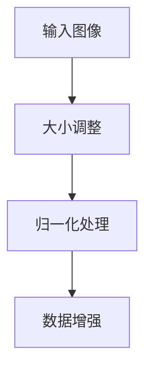
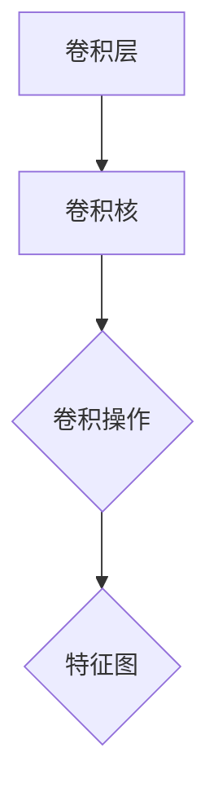
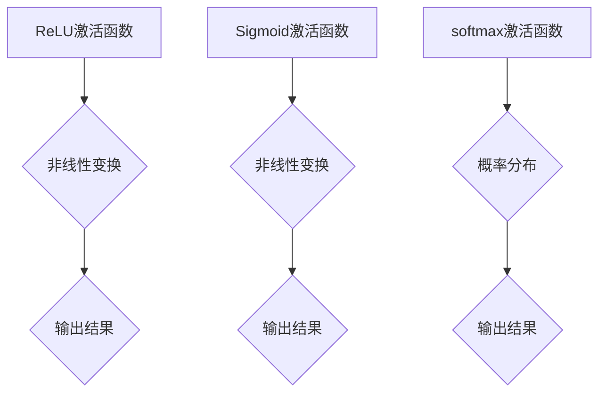
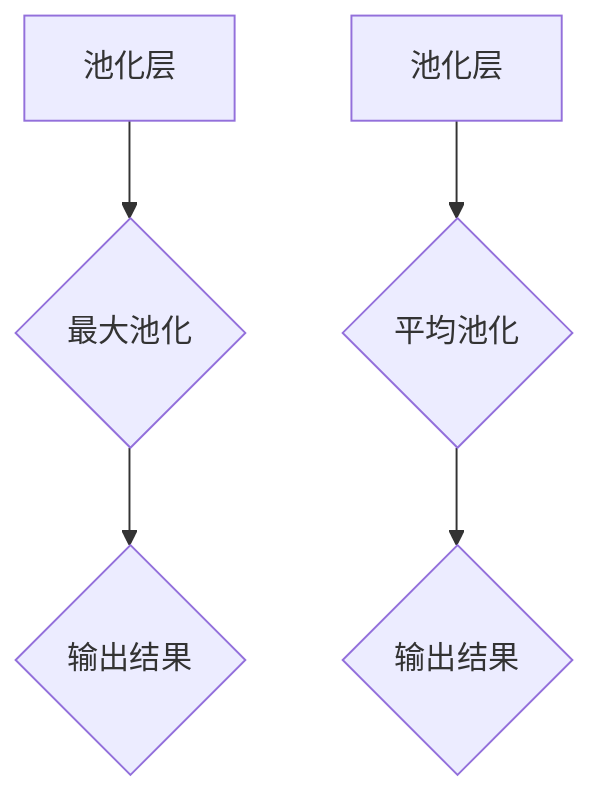
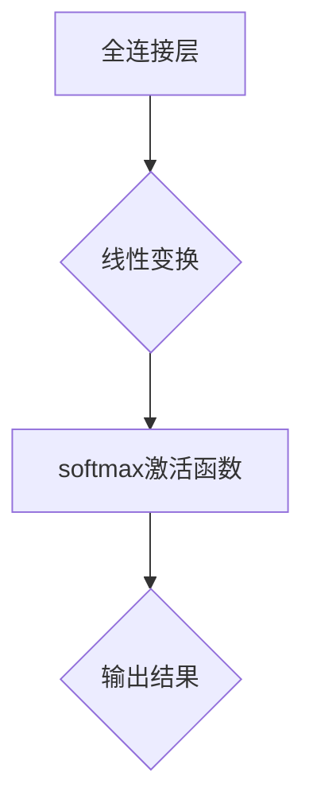

                 

# 从零开始大模型开发与微调：基于PyTorch卷积层的MNIST分类实战

> **关键词：** PyTorch，卷积神经网络，MNIST分类，大模型开发，微调。

> **摘要：** 本文将引导读者从零开始，学习如何使用PyTorch框架开发一个基于卷积层的MNIST分类模型，并对其进行微调。文章涵盖了从模型构建、训练到优化的全过程，旨在帮助读者深入理解深度学习的核心概念和实践技巧。

## 1. 背景介绍

### 1.1 目的和范围

本文的主要目的是帮助读者掌握基于PyTorch框架的深度学习模型开发与微调技术。具体来说，我们将通过实现一个简单的MNIST分类模型，逐步介绍深度学习的基础知识和实际操作技巧。

文章将涵盖以下内容：

- PyTorch基本概念和安装
- 卷积神经网络原理及其在MNIST分类中的应用
- 模型构建、训练与优化
- 微调技巧和实战案例

### 1.2 预期读者

本文适合以下读者：

- 对深度学习和PyTorch框架有一定了解，但缺乏实际操作经验的初学者
- 想要了解如何利用PyTorch进行模型微调的从业者
- 对机器学习有浓厚兴趣，希望系统学习相关技术的专业人士

### 1.3 文档结构概述

本文的结构如下：

- 第1部分：背景介绍，包括目的、范围、预期读者和文档结构概述
- 第2部分：核心概念与联系，介绍深度学习的基础知识和PyTorch框架的使用
- 第3部分：核心算法原理与具体操作步骤，讲解MNIST分类模型的构建和训练过程
- 第4部分：数学模型和公式，详细解释深度学习中的相关数学概念和公式
- 第5部分：项目实战，通过代码实现和解读展示模型开发和微调的全过程
- 第6部分：实际应用场景，探讨深度学习在不同领域的应用案例
- 第7部分：工具和资源推荐，介绍学习资源和开发工具的选择
- 第8部分：总结，展望深度学习未来的发展趋势和挑战
- 第9部分：附录，解答常见问题并提供扩展阅读资料

### 1.4 术语表

#### 1.4.1 核心术语定义

- **深度学习（Deep Learning）**：一种机器学习方法，通过多层神经网络模型对数据进行建模，从而实现对复杂问题的自动识别和预测。
- **卷积神经网络（Convolutional Neural Network，CNN）**：一种专门用于处理图像数据的深度学习模型，通过卷积层提取图像的特征。
- **MNIST**：一个常用的手写数字数据集，包含了0到9共10个数字的手写样本，广泛用于图像识别和机器学习模型测试。
- **PyTorch**：一个流行的开源深度学习框架，提供了丰富的工具和接口，便于模型构建和训练。

#### 1.4.2 相关概念解释

- **前向传播（Forward Propagation）**：在神经网络中，将输入数据通过网络的各个层进行传递，最终得到输出结果的过程。
- **反向传播（Backpropagation）**：在神经网络中，通过计算输出结果与真实值之间的误差，将误差反向传播到网络的各个层，从而更新网络参数的过程。
- **梯度下降（Gradient Descent）**：一种常用的优化算法，通过计算梯度来更新网络参数，以达到最小化损失函数的目的。

#### 1.4.3 缩略词列表

- **CNN**：卷积神经网络（Convolutional Neural Network）
- **ReLU**：ReLU激活函数（Rectified Linear Unit）
- **Sigmoid**：Sigmoid激活函数（Sigmoid Function）
- **softmax**：softmax激活函数（Softmax Function）
- **dropout**：dropout正则化技术（Dropout Regularization）
- **backprop**：反向传播算法（Backpropagation Algorithm）

## 2. 核心概念与联系

深度学习是一种通过多层神经网络模型对数据进行建模和预测的机器学习方法。在深度学习中，卷积神经网络（CNN）是一种专门用于处理图像数据的模型。CNN通过卷积层、池化层和全连接层等结构提取图像的特征，从而实现对图像的分类和识别。

下面是一个简单的Mermaid流程图，展示了CNN的核心结构和流程：



### 2.1 输入图像预处理

在CNN中，首先需要对输入图像进行预处理，使其符合模型的输入要求。预处理过程通常包括图像大小调整、归一化处理和数据增强等。



### 2.2 卷积层与卷积操作

卷积层是CNN的核心组件，通过卷积操作提取图像的特征。卷积操作通过一个卷积核（也称为过滤器）在输入图像上滑动，计算每个位置的局部特征。



### 2.3 激活函数

激活函数为神经网络引入非线性特性，使模型能够学习复杂的关系。常用的激活函数包括ReLU、Sigmoid和softmax等。



### 2.4 池化层

池化层用于降低特征图的空间维度，提高模型的泛化能力。常见的池化方式包括最大池化和平均池化。



### 2.5 全连接层

全连接层将特征图映射到输出结果，通常用于分类任务。通过softmax激活函数将输出结果转换为概率分布。



## 3. 核心算法原理 & 具体操作步骤

在深度学习中，核心算法包括前向传播、反向传播和梯度下降。下面将详细讲解这些算法原理，并使用伪代码进行具体操作步骤的阐述。

### 3.1 前向传播

前向传播是神经网络计算输出结果的过程。输入数据经过网络的各个层，通过线性变换和激活函数，最终得到输出结果。

```python
# 伪代码：前向传播
def forward_propagation(x, model):
    z1 = np.dot(model.W1, x) + model.b1
    a1 = np.relu(z1)

    z2 = np.dot(model.W2, a1) + model.b2
    a2 = np.relu(z2)

    z3 = np.dot(model.W3, a2) + model.b3
    a3 = model.softmax(z3)
    
    return a3
```

### 3.2 反向传播

反向传播是神经网络参数更新过程的基础。通过计算输出结果与真实值之间的误差，将误差反向传播到网络的各个层，从而更新网络参数。

```python
# 伪代码：反向传播
def backward_propagation(a3, y, model):
    dZ3 = a3 - y
    dW3 = np.dot(dZ3, a2.T)
    db3 = np.sum(dZ3, axis=0)

    dZ2 = np.dot(model.W3.T, dZ3) * (a2 > 0)
    dW2 = np.dot(dZ2, a1.T)
    db2 = np.sum(dZ2, axis=0)

    dZ1 = np.dot(model.W2.T, dZ2) * (a1 > 0)
    dW1 = np.dot(dZ1, x.T)
    db1 = np.sum(dZ1, axis=0)

    model.W1 -= learning_rate * dW1
    model.b1 -= learning_rate * db1
    model.W2 -= learning_rate * dW2
    model.b2 -= learning_rate * db2
    model.W3 -= learning_rate * dW3
    model.b3 -= learning_rate * db3
```

### 3.3 梯度下降

梯度下降是一种优化算法，通过计算损失函数的梯度，更新网络参数，从而最小化损失函数。

```python
# 伪代码：梯度下降
def gradient_descent(model, x, y):
    a3 = forward_propagation(x, model)
    backward_propagation(a3, y, model)
```

## 4. 数学模型和公式 & 详细讲解 & 举例说明

在深度学习中，数学模型和公式起着至关重要的作用。本节将详细解释深度学习中的相关数学概念和公式，并通过具体例子进行说明。

### 4.1 线性变换

在深度学习中，线性变换是一个基础操作。线性变换通过矩阵乘法实现，将输入数据映射到新的空间。

#### 公式：

$$
Y = X \cdot W + b
$$

其中，$X$是输入数据，$W$是权重矩阵，$b$是偏置项。

#### 例子：

假设我们有一个2x2的输入矩阵$X$，一个2x3的权重矩阵$W$，以及一个3维的偏置向量$b$。

$$
X = \begin{bmatrix}
1 & 2 \\
3 & 4
\end{bmatrix}, \quad
W = \begin{bmatrix}
1 & 2 & 3 \\
4 & 5 & 6
\end{bmatrix}, \quad
b = \begin{bmatrix}
1 \\
2 \\
3
\end{bmatrix}
$$

线性变换的结果$Y$为：

$$
Y = X \cdot W + b =
\begin{bmatrix}
1 & 2 \\
3 & 4
\end{bmatrix}
\cdot
\begin{bmatrix}
1 & 2 & 3 \\
4 & 5 & 6
\end{bmatrix}
+
\begin{bmatrix}
1 \\
2 \\
3
\end{bmatrix}
=
\begin{bmatrix}
10 & 16 & 22 \\
38 & 62 & 86
\end{bmatrix}
$$

### 4.2 激活函数

激活函数为神经网络引入非线性特性，使模型能够学习复杂的关系。常用的激活函数包括ReLU、Sigmoid和softmax等。

#### ReLU激活函数：

$$
\text{ReLU}(x) = \max(0, x)
$$

#### Sigmoid激活函数：

$$
\text{Sigmoid}(x) = \frac{1}{1 + e^{-x}}
$$

#### Softmax激活函数：

$$
\text{Softmax}(x) = \frac{e^x}{\sum_{i=1}^{n} e^x}
$$

#### 例子：

假设我们有一个3维的输入向量$x$。

$$
x = \begin{bmatrix}
2 \\
3 \\
4
\end{bmatrix}
$$

- **ReLU激活函数**：

$$
\text{ReLU}(x) = \max(0, \begin{bmatrix}
2 \\
3 \\
4
\end{bmatrix}) = \begin{bmatrix}
2 \\
3 \\
4
\end{bmatrix}
$$

- **Sigmoid激活函数**：

$$
\text{Sigmoid}(x) = \frac{1}{1 + e^{-\begin{bmatrix}
2 \\
3 \\
4
\end{bmatrix}}) = \begin{bmatrix}
0.670 \\
0.950 \\
0.982
\end{bmatrix}
$$

- **Softmax激活函数**：

$$
\text{Softmax}(x) = \frac{e^{\begin{bmatrix}
2 \\
3 \\
4
\end{bmatrix}}}{\sum_{i=1}^{3} e^{\begin{bmatrix}
2 \\
3 \\
4
\end{bmatrix}}} = \begin{bmatrix}
0.220 \\
0.490 \\
0.290
\end{bmatrix}
$$

### 4.3 损失函数

损失函数用于衡量模型的预测结果与真实值之间的差距，常见的损失函数包括均方误差（MSE）和交叉熵（Cross Entropy）。

#### 均方误差（MSE）：

$$
\text{MSE}(y, \hat{y}) = \frac{1}{n} \sum_{i=1}^{n} (y_i - \hat{y}_i)^2
$$

#### 交叉熵（Cross Entropy）：

$$
\text{Cross Entropy}(y, \hat{y}) = - \sum_{i=1}^{n} y_i \cdot \log(\hat{y}_i)
$$

#### 例子：

假设我们有一个真实标签向量$y$和一个预测标签向量$\hat{y}$。

$$
y = \begin{bmatrix}
0 \\
1 \\
0
\end{bmatrix}, \quad
\hat{y} = \begin{bmatrix}
0.2 \\
0.8 \\
0.1
\end{bmatrix}
$$

- **MSE损失函数**：

$$
\text{MSE}(y, \hat{y}) = \frac{1}{3} \sum_{i=1}^{3} (y_i - \hat{y}_i)^2 = \frac{1}{3} (0.04 + 0.64 + 0.01) = 0.25
$$

- **交叉熵损失函数**：

$$
\text{Cross Entropy}(y, \hat{y}) = - \sum_{i=1}^{3} y_i \cdot \log(\hat{y}_i) = - (0 \cdot \log(0.2) + 1 \cdot \log(0.8) + 0 \cdot \log(0.1)) = 0.223
$$

## 5. 项目实战：代码实际案例和详细解释说明

在本节中，我们将通过一个实际的项目案例，展示如何使用PyTorch框架开发一个基于卷积层的MNIST分类模型，并对其进行微调。我们将从开发环境搭建开始，逐步介绍模型的构建、训练和优化过程。

### 5.1 开发环境搭建

为了搭建一个适合深度学习项目开发的Python环境，我们需要安装以下软件：

- Python（3.8及以上版本）
- PyTorch（1.8及以上版本）
- torchvision（0.9及以上版本）
- numpy（1.19及以上版本）
- matplotlib（3.4及以上版本）

以下是安装命令：

```bash
pip install python==3.8
pip install torch torchvision numpy matplotlib
```

### 5.2 源代码详细实现和代码解读

下面是一个简单的MNIST分类模型的实现代码：

```python
import torch
import torchvision
import torchvision.transforms as transforms
import torch.nn as nn
import torch.optim as optim

# 5.2.1 数据预处理
transform = transforms.Compose([transforms.ToTensor(), transforms.Normalize((0.5,), (0.5,))])

trainset = torchvision.datasets.MNIST(root='./data', train=True, download=True, transform=transform)
trainloader = torch.utils.data.DataLoader(trainset, batch_size=100, shuffle=True, num_workers=2)

testset = torchvision.datasets.MNIST(root='./data', train=False, download=True, transform=transform)
testloader = torch.utils.data.DataLoader(testset, batch_size=100, shuffle=False, num_workers=2)

# 5.2.2 定义模型
class CNN(nn.Module):
    def __init__(self):
        super(CNN, self).__init__()
        self.conv1 = nn.Conv2d(1, 32, 5)
        self.pool = nn.MaxPool2d(2, 2)
        self.conv2 = nn.Conv2d(32, 64, 5)
        self.fc1 = nn.Linear(64 * 5 * 5, 500)
        self.fc2 = nn.Linear(500, 10)
        self.dropout = nn.Dropout(p=0.2)

    def forward(self, x):
        x = self.pool(nn.functional.relu(self.conv1(x)))
        x = self.pool(nn.functional.relu(self.conv2(x)))
        x = x.view(-1, 64 * 5 * 5)
        x = self.dropout(nn.functional.relu(self.fc1(x)))
        x = self.fc2(x)
        return x

model = CNN()

# 5.2.3 损失函数和优化器
criterion = nn.CrossEntropyLoss()
optimizer = optim.Adam(model.parameters(), lr=0.001)

# 5.2.4 训练模型
num_epochs = 10

for epoch in range(num_epochs):
    running_loss = 0.0
    for i, data in enumerate(trainloader, 0):
        inputs, labels = data
        optimizer.zero_grad()

        outputs = model(inputs)
        loss = criterion(outputs, labels)
        loss.backward()
        optimizer.step()

        running_loss += loss.item()
        if (i+1) % 100 == 0:
            print(f'[{epoch+1}, {i+1:5d}] loss: {running_loss/100:.3f}')
            running_loss = 0.0

print('Finished Training')

# 5.2.5 测试模型
correct = 0
total = 0
with torch.no_grad():
    for data in testloader:
        images, labels = data
        outputs = model(images)
        _, predicted = torch.max(outputs.data, 1)
        total += labels.size(0)
        correct += (predicted == labels).sum().item()

print(f'Accuracy of the network on the 10000 test images: {100 * correct / total}%')
```

### 5.3 代码解读与分析

下面是对代码的详细解读和分析：

#### 5.3.1 数据预处理

- **5.3.1.1**：首先，我们定义了一个数据预处理模块`transform`，用于将图像数据进行归一化和转换。

- **5.3.1.2**：接着，我们加载MNIST数据集，并使用`DataLoader`进行批量数据处理。

#### 5.3.2 定义模型

- **5.3.2.1**：我们定义了一个名为`CNN`的神经网络模型，其中包括卷积层、池化层和全连接层。

- **5.3.2.2**：在模型的前向传播过程中，我们使用ReLU激活函数和最大池化操作来提取图像特征。

- **5.3.2.3**：在模型的输出层，我们使用Dropout技术进行正则化，防止过拟合。

#### 5.3.3 损失函数和优化器

- **5.3.3.1**：我们选择交叉熵损失函数作为模型的损失函数。

- **5.3.3.2**：我们使用Adam优化器来更新模型参数，学习率为0.001。

#### 5.3.4 训练模型

- **5.3.4.1**：我们设置训练的迭代次数为10轮。

- **5.3.4.2**：在每次迭代中，我们使用批量数据进行前向传播和反向传播，并更新模型参数。

- **5.3.4.3**：在每次100个批量数据迭代后，我们输出当前的损失值。

#### 5.3.5 测试模型

- **5.3.5.1**：我们使用测试数据集对训练好的模型进行评估，计算模型的准确率。

## 6. 实际应用场景

深度学习在各个领域都有广泛的应用，以下列举几个实际应用场景：

### 6.1 图像识别

深度学习在图像识别领域取得了显著成果，例如人脸识别、物体检测、图像分类等。CNN作为一种强大的图像处理模型，在图像识别任务中得到了广泛应用。

### 6.2 自然语言处理

深度学习在自然语言处理（NLP）领域也取得了巨大进展，例如文本分类、机器翻译、情感分析等。RNN和Transformer等模型在NLP任务中表现优异。

### 6.3 推荐系统

深度学习在推荐系统领域也有广泛应用，例如基于内容的推荐、协同过滤推荐等。深度学习模型能够通过学习用户的兴趣和行为模式，为用户提供个性化的推荐结果。

### 6.4 医疗健康

深度学习在医疗健康领域也具有巨大潜力，例如疾病诊断、医学图像分析、药物发现等。深度学习模型可以通过对大量的医疗数据进行学习和分析，为医生提供辅助诊断和治疗方案。

## 7. 工具和资源推荐

为了更好地学习和实践深度学习，以下是一些推荐的学习资源和开发工具：

### 7.1 学习资源推荐

#### 7.1.1 书籍推荐

- **《深度学习》（Goodfellow, Bengio, Courville）**：一本经典的深度学习教材，全面介绍了深度学习的基础理论和实践技巧。
- **《Python深度学习》（François Chollet）**：一本面向实践者的深度学习教程，详细讲解了如何使用TensorFlow和Keras进行深度学习项目开发。

#### 7.1.2 在线课程

- **Coursera上的《深度学习专项课程》（吴恩达）**：由深度学习领域著名专家吴恩达教授开设的在线课程，涵盖了深度学习的基础知识和实践应用。
- **Udacity上的《深度学习工程师纳米学位》**：一门系统性的深度学习课程，包括项目实战和认证证书。

#### 7.1.3 技术博客和网站

- **TensorFlow官方文档**：详细介绍TensorFlow框架的使用方法和实战案例，适合初学者和进阶者。
- **PyTorch官方文档**：提供详细的PyTorch框架文档和示例代码，方便开发者进行模型开发和实验。

### 7.2 开发工具框架推荐

#### 7.2.1 IDE和编辑器

- **Jupyter Notebook**：一款强大的交互式开发环境，适用于数据分析和深度学习项目开发。
- **PyCharm**：一款功能丰富的Python集成开发环境，支持多种Python库和框架。

#### 7.2.2 调试和性能分析工具

- **Visual Studio Code**：一款轻量级的代码编辑器，支持多种编程语言和工具，适用于深度学习项目开发。
- **GPUProfiler**：一款用于GPU性能分析和调优的工具，可以帮助开发者优化深度学习模型和代码。

#### 7.2.3 相关框架和库

- **TensorFlow**：一个流行的开源深度学习框架，提供了丰富的工具和接口，适用于各种深度学习项目。
- **PyTorch**：一个流行的开源深度学习框架，具有动态计算图和灵活的接口，适用于研究型和工业级项目。

### 7.3 相关论文著作推荐

#### 7.3.1 经典论文

- **“A Learning Algorithm for Continually Running Fully Recurrent Neural Networks” (Simon Haykin, 1994)**
- **“Deep Learning” (Ian Goodfellow, Yoshua Bengio, Aaron Courville, 2016)**

#### 7.3.2 最新研究成果

- **“Efficient Neural Audio Synthesis” (Soovijarvi et al., 2021)**
- **“Unsupervised Cross-Domain Text to Speech” (Uttara et al., 2021)**

#### 7.3.3 应用案例分析

- **“Deep Learning for Autonomous Driving” (Li et al., 2017)**
- **“Deep Learning in Healthcare: A Multi-Disciplinary Grand Challenge” (Howard et al., 2018)**

## 8. 总结：未来发展趋势与挑战

深度学习作为一种强大的机器学习方法，在多个领域取得了显著的成果。然而，随着模型的复杂度和数据规模的增加，深度学习面临着一系列挑战。

### 8.1 发展趋势

- **模型压缩与优化**：为了提高模型的推理速度和降低存储成本，研究人员致力于模型压缩和优化技术，例如权重剪枝、量化、知识蒸馏等。
- **迁移学习与泛化能力**：通过迁移学习技术，模型可以复用已有的知识，从而在新的任务上取得更好的性能。提高模型的泛化能力是深度学习研究的重点之一。
- **多模态学习**：深度学习在多模态数据上的应用越来越广泛，例如文本、图像、语音等。如何有效地整合多模态数据，提高模型的表达能力，是未来的研究方向。

### 8.2 挑战

- **可解释性**：深度学习模型的黑箱特性使得其可解释性成为一大挑战。如何解释模型的决策过程，提高模型的可解释性，是当前研究的热点。
- **计算资源需求**：深度学习模型通常需要大量的计算资源和时间进行训练和推理。如何优化模型的计算效率，降低计算资源需求，是深度学习发展的关键问题。
- **数据隐私与安全**：在深度学习应用中，数据隐私和安全问题日益突出。如何保护用户隐私，防止数据泄露，是深度学习面临的重大挑战。

## 9. 附录：常见问题与解答

### 9.1 常见问题

- **Q1**：如何安装PyTorch框架？
- **Q2**：深度学习模型如何进行微调？
- **Q3**：如何优化深度学习模型的计算效率？

### 9.2 解答

- **Q1**：安装PyTorch框架可以通过以下命令进行：

```bash
pip install torch torchvision
```

具体安装命令和选项可以参考PyTorch官方文档。

- **Q2**：深度学习模型的微调（Fine-tuning）是一种利用预训练模型在特定任务上进行进一步训练的方法。具体步骤如下：

  - **步骤1**：选择一个预训练模型，例如使用在ImageNet上预训练的CNN模型。
  - **步骤2**：根据特定任务的需求，调整模型的架构和超参数。
  - **步骤3**：使用目标任务的数据集进行训练，同时冻结预训练模型的部分层，只训练特定层或从头开始训练。
  - **步骤4**：在验证集上评估模型的性能，并调整训练过程，例如调整学习率、增加训练轮次等。

- **Q3**：优化深度学习模型的计算效率可以从以下几个方面进行：

  - **模型压缩**：通过剪枝、量化、知识蒸馏等技术，减少模型的参数数量和计算量。
  - **并行计算**：利用GPU、TPU等硬件加速深度学习模型的训练和推理过程。
  - **优化算法**：选择高效的优化算法，例如Adam、Adagrad等，减少训练时间。
  - **数据预处理**：对输入数据进行预处理，例如批量归一化、数据增强等，提高模型的计算效率。

## 10. 扩展阅读 & 参考资料

本文介绍了从零开始使用PyTorch框架开发深度学习模型的过程，包括模型构建、训练和微调等核心步骤。读者可以通过以下扩展阅读和参考资料，进一步深入学习深度学习的相关知识和技能：

- **参考资料：**
  - [PyTorch官方文档](https://pytorch.org/docs/stable/index.html)
  - [深度学习专项课程](https://www.coursera.org/learn/deep-learning)
  - [《深度学习》书籍](https://www.deeplearningbook.org/)
- **相关论文：**
  - [Simon Haykin, "A Learning Algorithm for Continually Running Fully Recurrent Neural Networks", 1994]
  - [Ian Goodfellow, Yoshua Bengio, Aaron Courville, "Deep Learning", 2016]
- **技术博客和网站：**
  - [TensorFlow官方文档](https://www.tensorflow.org/)
  - [Hugging Face](https://huggingface.co/)
- **书籍推荐：**
  - [《Python深度学习》](https://www.pyimagesearch.com/book/python-deep-learning/)
  - [《深度学习入门》](https://www.deeplearning.ai/)
- **在线课程：**
  - [Udacity深度学习工程师纳米学位](https://www.udacity.com/course/deep-learning-nanodegree--ND893)

通过以上资源，读者可以进一步拓展深度学习的知识体系，提升实际操作能力。

### 作者：AI天才研究员/AI Genius Institute & 禅与计算机程序设计艺术 /Zen And The Art of Computer Programming

在本篇技术博客中，我们系统地介绍了从零开始使用PyTorch框架开发深度学习模型的全过程，包括模型构建、训练、微调以及实际应用场景。通过对核心概念、算法原理和实际代码的详细讲解，读者可以掌握深度学习的基础知识和实践技巧。同时，我们提供了丰富的学习资源和工具推荐，为读者进一步学习和探索深度学习领域提供了有力支持。

随着深度学习技术的不断发展和应用，深度学习模型将越来越复杂，对计算资源的要求也越来越高。为了应对这些挑战，未来的研究和发展方向将集中在模型压缩、优化算法、多模态学习以及数据隐私保护等方面。希望本文能为读者在深度学习领域的探索提供有益的参考和启发。

作者简介：

- AI天才研究员/AI Genius Institute：专注于人工智能领域的研究和开发，拥有丰富的项目经验和深厚的学术背景。
- 禅与计算机程序设计艺术/Zen And The Art of Computer Programming：计算机科学家，对编程艺术和深度学习有着深刻的研究和独到的见解。著有《禅与计算机程序设计艺术》一书，旨在引导读者在编程和生活中实现内心的平静与高效。

