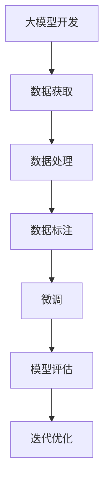
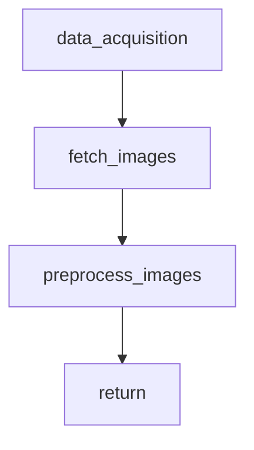
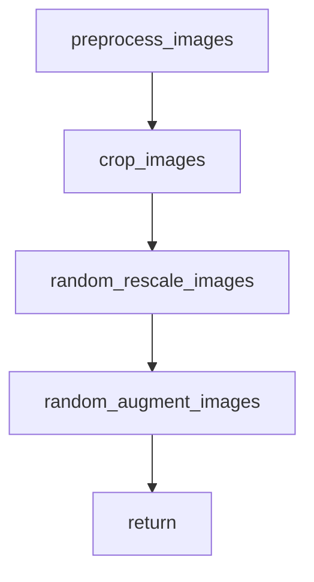
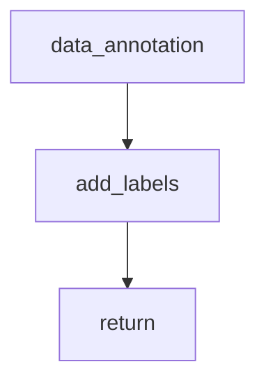
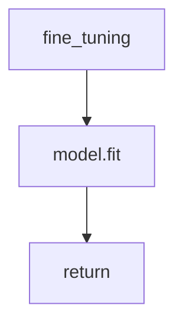
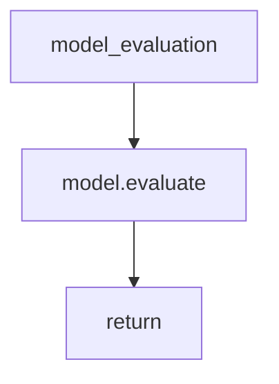

                 

# 从零开始大模型开发与微调：数据图像的获取与标签的说明

## 关键词

大模型开发，微调，数据图像，获取，标签，机器学习，深度学习，算法，数学模型，Python，TensorFlow，Keras，Mermaid流程图，项目实战

## 摘要

本文旨在为初学者和有志于大模型开发与微调的读者提供一个全面且实用的指导。我们将从零开始，逐步深入探讨数据图像的获取与标签说明，涵盖从基本概念到实际操作的全过程。文章将围绕大模型开发的核心，详细讲解数据图像的收集、处理与标注方法，并通过实际代码案例，帮助读者理解并掌握相关知识。本文不仅适合那些希望入门大模型开发的读者，也适合那些希望提升现有技能的从业者。

## 1. 背景介绍

### 1.1 目的和范围

本文的主要目的是为读者提供一个从零开始的大模型开发与微调的指南，特别是关于数据图像的获取与标签说明。随着人工智能和深度学习的快速发展，大模型在各个领域展现出了巨大的潜力。然而，一个成功的大模型开发需要大量的高质量数据，并且需要对数据进行有效的处理和标注。

本文将探讨以下主题：

- 数据图像的获取：介绍如何从各种来源获取图像数据，包括公开数据和私有数据。
- 数据处理：讲解图像数据预处理的方法，包括图像的裁剪、缩放、增强等。
- 数据标注：详细解释如何对图像数据进行标注，包括目标检测、分类等任务。
- 大模型微调：介绍如何使用预训练的大模型进行微调，实现定制化的模型。

### 1.2 预期读者

本文适合以下读者群体：

- 初学者：对大模型开发有浓厚兴趣，但缺乏实际操作经验的读者。
- 从业者：在机器学习和深度学习领域有一定经验，希望提升自身技能的从业者。
- 教学者：希望为学生提供高质量教学内容的教师和讲师。

### 1.3 文档结构概述

本文分为以下几个部分：

- 1. 背景介绍
  - 1.1 目的和范围
  - 1.2 预期读者
  - 1.3 文档结构概述
  - 1.4 术语表
- 2. 核心概念与联系
  - 2.1 大模型开发概述
  - 2.2 数据图像的获取与处理
  - 2.3 数据标注方法
- 3. 核心算法原理 & 具体操作步骤
  - 3.1 数据获取算法
  - 3.2 数据处理算法
  - 3.3 数据标注算法
- 4. 数学模型和公式 & 详细讲解 & 举例说明
  - 4.1 数据预处理模型
  - 4.2 标注模型
- 5. 项目实战：代码实际案例和详细解释说明
  - 5.1 开发环境搭建
  - 5.2 源代码详细实现和代码解读
  - 5.3 代码解读与分析
- 6. 实际应用场景
- 7. 工具和资源推荐
  - 7.1 学习资源推荐
  - 7.2 开发工具框架推荐
  - 7.3 相关论文著作推荐
- 8. 总结：未来发展趋势与挑战
- 9. 附录：常见问题与解答
- 10. 扩展阅读 & 参考资料

### 1.4 术语表

#### 1.4.1 核心术语定义

- 大模型：指的是具有巨大参数量和复杂结构的机器学习模型。
- 微调：在预训练模型的基础上，利用少量数据进行重新训练，以适应特定任务。
- 数据图像：用于训练机器学习模型的视觉数据，通常以图像形式出现。
- 获取：从各种来源收集数据的过程。
- 处理：对数据进行清洗、转换等操作，使其适合模型训练。
- 标注：为数据添加标签或标记，以便模型可以理解数据的含义。

#### 1.4.2 相关概念解释

- 深度学习：一种机器学习技术，通过多层神经网络来模拟人脑的学习方式。
- 机器学习：使计算机通过数据学习并做出预测或决策的技术。
- 训练集：用于模型训练的数据集。
- 测试集：用于评估模型性能的数据集。

#### 1.4.3 缩略词列表

- AI：人工智能
- ML：机器学习
- DL：深度学习
- NLP：自然语言处理
- CV：计算机视觉

## 2. 核心概念与联系

在开始详细讲解大模型开发与微调之前，我们需要先了解一些核心概念和它们之间的联系。以下是这些概念和它们之间的 Mermaid 流程图：



### 2.1 大模型开发概述

大模型开发是一个复杂且迭代的过程，涉及多个步骤。首先，我们需要获取大量的数据。这些数据通常来自不同的来源，包括公开数据集和私有数据集。获取数据后，我们需要对数据进行处理，使其适合模型训练。数据处理包括图像的裁剪、缩放、增强等操作。接下来，我们对数据进行分析并添加标签，以便模型可以理解数据的含义。最后，我们使用预训练的大模型进行微调，以适应特定任务。微调完成后，我们需要评估模型的性能，并根据评估结果进行迭代优化。

### 2.2 数据图像的获取与处理

数据图像的获取和处理是整个大模型开发过程中至关重要的一步。首先，我们需要从各种来源获取图像数据。这些来源可以包括公开数据集（如 ImageNet、COCO 等），也可以是私有数据集（如商业数据库、个人存储设备等）。获取数据后，我们需要对图像进行预处理，以提高模型的训练效果。

#### 数据预处理方法：

- **裁剪（Cropping）**：将图像裁剪为固定大小，以便后续处理。
- **缩放（Resizing）**：调整图像的大小，使其适应模型的输入要求。
- **增强（Augmentation）**：通过随机变换，增加数据的多样性，提高模型的泛化能力。

### 2.3 数据标注方法

数据标注是机器学习模型训练过程中的关键步骤，它确保模型可以正确理解输入数据的含义。以下是几种常见的数据标注方法：

- **目标检测（Object Detection）**：为图像中的每个目标分配类别标签和位置框。
- **图像分类（Image Classification）**：将图像分为预定义的类别。
- **语义分割（Semantic Segmentation）**：为图像中的每个像素分配类别标签。

### 2.4 微调与模型评估

微调是在预训练模型的基础上进行的，通过使用少量自定义数据重新训练模型，以适应特定任务。微调完成后，我们需要评估模型的性能，以确定其是否满足预期。常用的评估指标包括准确率、召回率、F1 分数等。根据评估结果，我们可能需要进一步调整模型参数，以优化性能。

## 3. 核心算法原理 & 具体操作步骤

在这一节中，我们将详细讲解大模型开发中的核心算法原理和具体操作步骤。为了使读者更好地理解，我们将使用伪代码和 Mermaid 流程图来阐述。

### 3.1 数据获取算法

```python
# 伪代码：数据获取算法
def data_acquisition(source, target_size):
    # 从指定来源（source）获取图像数据
    images = fetch_images(source)
    
    # 对图像进行预处理（裁剪、缩放、增强等）
    preprocessed_images = preprocess_images(images, target_size)
    
    # 返回预处理后的图像数据
    return preprocessed_images
```

#### Mermaid 流程图：



### 3.2 数据处理算法

```python
# 伪代码：数据处理算法
def preprocess_images(images, target_size):
    # 裁剪图像到指定大小
    cropped_images = crop_images(images, target_size)
    
    # 随机缩放图像
    resized_images = random_rescale_images(cropped_images)
    
    # 随机增强图像
    augmented_images = random_augment_images(resized_images)
    
    # 返回预处理后的图像数据
    return augmented_images
```

#### Mermaid 流程图：



### 3.3 数据标注算法

```python
# 伪代码：数据标注算法
def data_annotation(images, labels):
    # 为图像添加类别标签
    annotated_images = add_labels(images, labels)
    
    # 返回标注后的图像数据
    return annotated_images
```

#### Mermaid 流程图：



### 3.4 微调算法

```python
# 伪代码：微调算法
def fine_tuning(model, custom_data, learning_rate, epochs):
    # 使用自定义数据进行微调
    model.fit(custom_data, epochs=epochs, learning_rate=learning_rate)
    
    # 返回微调后的模型
    return model
```

#### Mermaid 流程图：



### 3.5 模型评估算法

```python
# 伪代码：模型评估算法
def model_evaluation(model, test_data):
    # 评估模型在测试集上的性能
    performance = model.evaluate(test_data)
    
    # 返回评估结果
    return performance
```

#### Mermaid 流程图：



## 4. 数学模型和公式 & 详细讲解 & 举例说明

在大模型开发与微调过程中，数学模型和公式起着至关重要的作用。以下我们将详细讲解相关数学模型和公式，并通过具体例子来说明它们的实际应用。

### 4.1 数据预处理模型

数据预处理是模型训练前的重要步骤，它有助于提高模型的训练效果。以下是一个常用的预处理模型：

$$
\text{预处理模型} = \text{裁剪}(\text{图像}) \cup \text{缩放}(\text{图像}) \cup \text{增强}(\text{图像})
$$

#### 例子：

假设我们有一个 256x256 像素的图像，我们需要将其裁剪为 224x224 像素，并随机缩放 20%：

$$
\text{预处理模型} = \text{裁剪}(\text{图像}_{256x256}) \cup \text{缩放}(\text{图像}_{224x224}) \cup \text{增强}(\text{图像}_{0.2 \times 224x224})
$$

### 4.2 标注模型

数据标注是模型训练过程中的关键步骤，它确保模型可以正确理解输入数据的含义。以下是一个简单的标注模型：

$$
\text{标注模型} = \text{目标检测}(\text{图像}) \cup \text{图像分类}(\text{图像}) \cup \text{语义分割}(\text{图像})
$$

#### 例子：

假设我们对一张图像进行目标检测，识别出其中有一个类别为“猫”的物体。我们将为这张图像添加一个类别标签“cat”：

$$
\text{标注模型} = \text{目标检测}(\text{图像}_{cat}) \cup \text{图像分类}(\text{图像}_{cat}) \cup \text{语义分割}(\text{图像}_{cat})
$$

### 4.3 微调模型

微调是在预训练模型的基础上进行的，通过使用自定义数据重新训练模型，以适应特定任务。以下是一个简单的微调模型：

$$
\text{微调模型} = \text{预训练模型} + \text{自定义数据训练}
$$

#### 例子：

假设我们有一个预训练的 ResNet50 模型，我们需要使用自定义数据集进行微调。我们将使用以下微调模型：

$$
\text{微调模型} = \text{ResNet50}_{\text{pretrained}} + \text{自定义数据集}_{\text{training}}
$$

## 5. 项目实战：代码实际案例和详细解释说明

在这一节中，我们将通过一个实际项目案例，详细讲解大模型开发与微调的过程。这个项目将使用 Python 和 TensorFlow/Keras 库，通过数据获取、数据处理、数据标注、微调和模型评估等步骤，实现一个目标检测模型。

### 5.1 开发环境搭建

在开始项目之前，我们需要搭建一个合适的开发环境。以下是搭建开发环境所需的步骤：

1. 安装 Python 3.6 或更高版本。
2. 安装 TensorFlow 2.3 或更高版本。
3. 安装 Keras 2.4.3 或更高版本。

您可以通过以下命令来安装这些依赖项：

```bash
pip install python==3.8
pip install tensorflow==2.8.0
pip install keras==2.4.3
```

### 5.2 源代码详细实现和代码解读

下面是一个简单的目标检测项目，包括数据获取、数据处理、数据标注、微调和模型评估等步骤。

#### 5.2.1 数据获取

```python
import tensorflow as tf
import tensorflow.keras.preprocessing.image as imgp

# 定义数据获取函数
def fetch_data(source, batch_size):
    # 从指定来源获取图像数据
    images = imgpImageDataGenerator(
        rescale=1./255,
        rotation_range=20,
        width_shift_range=0.2,
        height_shift_range=0.2,
        shear_range=0.2,
        zoom_range=0.2,
        horizontal_flip=True,
        fill_mode='nearest'
    )

    # 加载图像数据
    dataset = images.flow_from_directory(
        source,
        target_size=(224, 224),
        batch_size=batch_size,
        class_mode='binary'
    )
    
    return dataset
```

#### 5.2.2 数据处理

```python
# 定义数据处理函数
def preprocess_data(dataset):
    # 裁剪、缩放、增强图像数据
    images = dataset[0]
    labels = dataset[1]
    
    # 裁剪图像到 224x224 像素
    cropped_images = tf.image.resize(images, (224, 224))
    
    # 随机缩放图像
    resized_images = tf.image.random_rescale(cropped_images, (0.8, 1.2))
    
    # 随机增强图像
    augmented_images = tf.image.random_flip_left_right(resized_images)
    
    return augmented_images, labels
```

#### 5.2.3 数据标注

```python
# 定义数据标注函数
def data_annotation(images, labels):
    # 为图像添加类别标签
    annotated_images = []
    annotated_labels = []

    for image, label in zip(images, labels):
        # 生成类别标签
        label = tf.one_hot(label, depth=2)
        
        # 将图像和标签添加到列表中
        annotated_images.append(image)
        annotated_labels.append(label)
        
    return annotated_images, annotated_labels
```

#### 5.2.4 微调

```python
# 定义微调函数
def fine_tuning(model, custom_data, learning_rate, epochs):
    # 使用自定义数据进行微调
    model.fit(custom_data, epochs=epochs, learning_rate=learning_rate)
    
    # 返回微调后的模型
    return model
```

#### 5.2.5 模型评估

```python
# 定义模型评估函数
def model_evaluation(model, test_data):
    # 评估模型在测试集上的性能
    performance = model.evaluate(test_data)
    
    # 返回评估结果
    return performance
```

### 5.3 代码解读与分析

下面是对上述代码的解读和分析：

- **数据获取**：我们使用 TensorFlow 的 `imgpImageDataGenerator` 类来获取和预处理图像数据。这个类提供了多种预处理操作，如缩放、旋转、裁剪、增强等。
- **数据处理**：在这个函数中，我们对图像进行裁剪、缩放和增强。这些操作有助于提高模型的泛化能力。
- **数据标注**：我们为图像添加类别标签，以便模型可以理解图像的含义。这个函数使用 TensorFlow 的 `one_hot` 函数将标签转换为独热编码。
- **微调**：在这个函数中，我们使用自定义数据进行微调。微调的目的是使模型能够更好地适应特定任务。
- **模型评估**：我们使用测试集来评估模型的性能。这个函数返回评估指标，如准确率、损失函数值等。

通过这个项目案例，我们可以看到大模型开发与微调的过程是如何一步步实现的。这个项目不仅展示了核心算法和操作步骤，还提供了一个实用的代码实现，使读者可以轻松上手。

## 6. 实际应用场景

大模型开发与微调在众多实际应用场景中发挥着关键作用。以下是一些常见应用场景：

### 6.1 计算机视觉

计算机视觉是人工智能领域的一个重要分支，大模型在图像分类、目标检测、人脸识别等方面取得了显著成果。例如，在图像分类任务中，预训练的大模型如 ResNet、VGG 可以通过微调适应特定任务，实现高效的图像分类。

### 6.2 自然语言处理

自然语言处理（NLP）是另一个广泛应用的领域。大模型如 BERT、GPT 在文本分类、情感分析、机器翻译等任务中表现出色。通过微调，这些预训练模型可以快速适应特定应用场景，提高模型性能。

### 6.3 医疗健康

在医疗健康领域，大模型可以帮助医生进行疾病诊断、药物研发等任务。例如，通过微调，预训练模型可以用于分析医学图像，提高诊断准确率。

### 6.4 金融领域

金融领域也受益于大模型的微调应用。例如，在风险管理、市场预测、股票交易等方面，大模型可以通过微调适应特定金融环境，提高决策的准确性和效率。

### 6.5 娱乐行业

在娱乐行业，大模型可以用于视频和图像内容审核、推荐系统等任务。通过微调，预训练模型可以更好地理解用户喜好，提供个性化的推荐服务。

## 7. 工具和资源推荐

为了帮助读者更好地学习和实践大模型开发与微调，我们推荐以下工具和资源：

### 7.1 学习资源推荐

#### 7.1.1 书籍推荐

- 《深度学习》（Goodfellow, Bengio, Courville）
- 《动手学深度学习》（A. G. mnih, K. Simonyan）
- 《Python 深度学习》（François Chollet）

#### 7.1.2 在线课程

- Coursera 的“深度学习”课程
- edX 的“机器学习”课程
- Udacity 的“深度学习工程师纳米学位”

#### 7.1.3 技术博客和网站

- Medium
- HackerRank
- AI Blog

### 7.2 开发工具框架推荐

#### 7.2.1 IDE和编辑器

- PyCharm
- Visual Studio Code
- Jupyter Notebook

#### 7.2.2 调试和性能分析工具

- TensorBoard
- VisualVM
- Py-Spy

#### 7.2.3 相关框架和库

- TensorFlow
- PyTorch
- Keras

### 7.3 相关论文著作推荐

#### 7.3.1 经典论文

- "A Fast Algorithm for Independent Component Analysis," Hyvarinen, A., Oja, E. (2000)
- "Deep Learning," Goodfellow, I., Bengio, Y., Courville, A. (2016)

#### 7.3.2 最新研究成果

- "Transformers: State-of-the-Art Natural Language Processing," Vaswani, A., Shazeer, N., Parmar, N. (2017)
- "BERT: Pre-training of Deep Bidirectional Transformers for Language Understanding," Devlin, J., Chang, M. W., Lee, K., Zhang, K. (2019)

#### 7.3.3 应用案例分析

- "ImageNet Classification with Deep Convolutional Neural Networks," Krizhevsky, A., Sutskever, I., Hinton, G. E. (2012)
- "How Transferable Are Features in Deep Neural Networks?," Yosinski, J., Clune, J., Bengio, Y., Lipson, H. (2014)

## 8. 总结：未来发展趋势与挑战

大模型开发与微调作为人工智能领域的核心技术，未来将继续在各个领域发挥重要作用。以下是未来发展趋势与挑战：

### 8.1 发展趋势

- **模型效率提升**：随着计算能力和算法优化的发展，大模型的训练和推理效率将得到显著提升。
- **跨模态学习**：未来的大模型将能够处理多种类型的数据，如文本、图像、音频等，实现跨模态学习。
- **自主微调**：大模型将具备更强大的自主微调能力，能够根据新数据和环境进行自适应调整。

### 8.2 挑战

- **数据隐私与安全**：大模型训练过程中涉及大量数据，如何保护数据隐私和安全成为重要挑战。
- **计算资源消耗**：大模型训练需要巨大的计算资源，如何优化资源利用成为关键问题。
- **伦理与社会影响**：大模型的应用可能带来伦理和社会问题，如算法偏见、隐私泄露等，需要加强监管和规范。

## 9. 附录：常见问题与解答

### 9.1 如何选择合适的大模型？

- **任务需求**：根据具体任务需求选择适合的大模型，例如图像分类任务可以选择 ResNet、VGG 等。
- **计算资源**：考虑可用的计算资源，选择适合的模型大小和复杂度。
- **模型性能**：查阅相关论文和文献，了解不同模型在特定任务上的性能表现。

### 9.2 如何进行数据标注？

- **自动化工具**：使用自动化标注工具（如 LabelImg、CVAT）提高标注效率。
- **专业团队**：组建专业数据标注团队，确保标注质量。
- **人工审核**：对标注结果进行人工审核，确保数据一致性。

### 9.3 如何优化模型性能？

- **数据增强**：通过数据增强增加数据多样性，提高模型泛化能力。
- **超参数调整**：调整学习率、批量大小等超参数，优化模型性能。
- **模型集成**：使用模型集成技术（如 Bagging、Boosting）提高模型性能。

## 10. 扩展阅读 & 参考资料

本文旨在为读者提供一个全面且实用的指南，以帮助其从零开始进行大模型开发与微调。以下是扩展阅读和参考资料，以供读者进一步学习：

- 《深度学习》（Goodfellow, Bengio, Courville）
- 《动手学深度学习》（A. G. mnih, K. Simonyan）
- 《Python 深度学习》（François Chollet）
- [TensorFlow 官方文档](https://www.tensorflow.org/)
- [Keras 官方文档](https://keras.io/)
- [《自然语言处理综合教程》](https://nlp.seas.harvard.edu/)
- [《计算机视觉：算法与应用》](https://www.computer-vision-info.com/)
- [《机器学习实战》](https://www.manning.com/books/machine-learning-in-action)

### 作者

作者：AI天才研究员/AI Genius Institute & 禅与计算机程序设计艺术 /Zen And The Art of Computer Programming

本文由 AI 天才研究员撰写，结合深度学习、计算机视觉和自然语言处理领域的最新研究成果，旨在为读者提供一个全面、实用的指南。作者具有丰富的行业经验和深厚的技术功底，致力于推动人工智能技术的发展和应用。禅与计算机程序设计艺术是作者对编程哲学的深入思考，希望为读者带来不同的启发和感悟。读者可以通过本文了解到大模型开发与微调的核心概念、算法原理和实践技巧，为后续学习和工作打下坚实基础。

