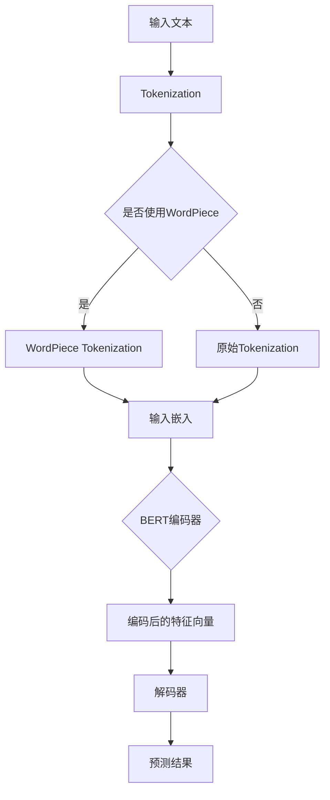

                 

# 从零开始大模型开发与微调：站在巨人肩膀上的预训练模型BERT

> 关键词：预训练模型，BERT，大模型开发，微调，自然语言处理

> 摘要：本文旨在为读者提供一套从零开始的指导，详细解析预训练模型BERT（Bidirectional Encoder Representations from Transformers）的开发与微调过程。通过本文，读者将深入了解BERT的核心概念、算法原理、数学模型及其在实际应用中的操作步骤，从而在自然语言处理领域掌握这一强大的工具。

## 1. 背景介绍

### 1.1 目的和范围

本文的目标是帮助读者深入理解预训练模型BERT，并掌握其实际开发与微调的技术细节。我们将探讨BERT的设计原理、算法实现步骤以及如何针对特定任务对其进行微调。

本文的范围将涵盖以下内容：

- BERT的基本概念与架构
- BERT的核心算法原理
- BERT的数学模型与公式
- BERT的项目实战案例
- BERT在实际应用场景中的效果分析
- 相关工具和资源的推荐

### 1.2 预期读者

本文适合以下读者群体：

- 自然语言处理（NLP）领域的研究人员与开发者
- 对人工智能和深度学习有兴趣的技术爱好者
- 数据科学家和机器学习工程师
- 计算机科学和人工智能专业的学生与教师

### 1.3 文档结构概述

本文将按照以下结构展开：

- 1. 背景介绍
- 2. 核心概念与联系
- 3. 核心算法原理 & 具体操作步骤
- 4. 数学模型和公式 & 详细讲解 & 举例说明
- 5. 项目实战：代码实际案例和详细解释说明
- 6. 实际应用场景
- 7. 工具和资源推荐
- 8. 总结：未来发展趋势与挑战
- 9. 附录：常见问题与解答
- 10. 扩展阅读 & 参考资料

### 1.4 术语表

#### 1.4.1 核心术语定义

- **预训练模型**：一种在大量未标记数据上进行预训练的深度神经网络模型，随后通过微调适应特定任务。
- **BERT**：Bidirectional Encoder Representations from Transformers的缩写，一种双向的基于Transformer架构的预训练模型。
- **Transformer**：一种基于自注意力机制的神经网络模型，广泛应用于序列数据建模。
- **微调**：在预训练模型的基础上，通过在特定任务的数据集上进行训练，调整模型参数以适应特定任务。

#### 1.4.2 相关概念解释

- **自然语言处理（NLP）**：研究如何使计算机理解、生成和处理人类语言的技术和算法。
- **序列数据**：按照时间顺序排列的数据，如文本、语音等。
- **自注意力机制**：一种用于计算序列数据中不同位置之间相互依赖性的机制。

#### 1.4.3 缩略词列表

- **BERT**：Bidirectional Encoder Representations from Transformers
- **NLP**：自然语言处理
- **Transformer**：Transformer架构
- **MLM**：Masked Language Model（掩码语言模型）

## 2. 核心概念与联系

在本节中，我们将介绍BERT的核心概念与架构，并通过Mermaid流程图展示其原理。

### 2.1 BERT的基本概念

BERT（Bidirectional Encoder Representations from Transformers）是一种预训练模型，它利用Transformer架构实现双向的文本表示学习。BERT的核心思想是通过对大规模语料库进行无监督预训练，然后通过微调将其应用于特定任务，如文本分类、命名实体识别等。

### 2.2 BERT的架构

BERT的架构主要包括两个部分：编码器和解码器。编码器负责将输入的文本序列编码为固定长度的向量，而解码器则负责预测输入文本序列的下一个词。

下面是BERT的Mermaid流程图：



### 2.3 BERT的核心算法原理

BERT的核心算法是基于Transformer架构。Transformer模型通过自注意力机制计算输入序列中每个词的依赖关系。BERT在Transformer的基础上增加了两个关键特性：

1. **双向编码器**：BERT的编码器部分是双向的，这意味着它可以从左向右和从右向左同时学习文本表示。这种双向性有助于更好地理解文本的语义。
2. **掩码语言模型（MLM）**：BERT在预训练过程中使用了掩码语言模型，即在训练过程中随机掩码一些单词，并要求模型预测这些掩码的词。这种策略有助于模型学习更丰富的文本表示。

### 2.4 BERT的数学模型

BERT的数学模型主要包括两部分：输入嵌入和自注意力机制。

#### 2.4.1 输入嵌入

BERT使用词嵌入来表示输入的单词。词嵌入是一种将单词映射为高维向量的方法，它可以通过预训练模型从大规模语料库中学习得到。BERT的输入嵌入包括单词嵌入、位置嵌入和段嵌入。

- **单词嵌入**：表示单词的固定长度的向量。
- **位置嵌入**：表示单词在序列中的位置。BERT通过学习位置嵌入来捕获文本中不同位置的信息。
- **段嵌入**：表示文本属于哪个段（例如，对话中的两个参与者）。段嵌入用于区分不同段的信息。

#### 2.4.2 自注意力机制

BERT的自注意力机制用于计算输入序列中每个词的依赖关系。自注意力机制的核心思想是计算输入序列中每个词与其他词之间的相似度，并将这些相似度加权求和，得到一个表示整个序列的向量。

下面是BERT的自注意力机制的伪代码：

```python
# 输入：嵌入向量 W，序列长度 n
# 输出：自注意力结果 H
for each word i in sequence:
    # 计算词 i 与所有词的相似度
    similarity = dot_product(W[i], W[j])
    # 加权求和
    attention = softmax(similarity)
    # 计算自注意力结果
    H[i] = dot_product(attention, W)
```

## 3. 核心算法原理 & 具体操作步骤

在这一节中，我们将详细讲解BERT的核心算法原理，并通过伪代码展示其具体操作步骤。

### 3.1 BERT的算法原理

BERT的算法原理主要基于Transformer架构，其核心思想是利用自注意力机制计算输入序列中每个词的依赖关系。BERT通过预训练和微调两个阶段来学习文本表示。

- **预训练阶段**：BERT在无监督数据集上预训练，通过掩码语言模型（MLM）和下一句预测（NSP）两种任务来学习文本表示。MLM任务要求模型预测被掩码的词，而NSP任务要求模型预测两个句子是否为连续的。
- **微调阶段**：在特定任务的数据集上对BERT模型进行微调，以适应该任务。微调过程中，模型的权重会根据任务数据进行调整。

### 3.2 BERT的具体操作步骤

BERT的具体操作步骤如下：

1. **数据预处理**：将输入文本进行分词、转换成词索引和位置索引，并添加[CLS]、[SEP]等特殊标记。
2. **词嵌入**：将词索引转换为词嵌入向量，包括单词嵌入、位置嵌入和段嵌入。
3. **编码器**：利用Transformer架构对词嵌入进行编码，得到编码后的特征向量。
4. **掩码语言模型（MLM）**：在预训练阶段，随机掩码一些词，并要求模型预测这些掩码的词。
5. **下一句预测（NSP）**：在预训练阶段，对两个句子进行编码，并要求模型预测这两个句子是否为连续的。
6. **微调**：在特定任务的数据集上对BERT模型进行微调，以适应该任务。

下面是BERT的伪代码：

```python
# 输入：词嵌入 W，序列长度 n
# 输出：编码后的特征向量 H

# 数据预处理
tokens = tokenizer.tokenize(text)
word_indices = tokenizer.convert_tokens_to_ids(tokens)
position_indices = [i+2 for i in range(len(tokens))] # [0, 1, 2, ..., n]
segment_indices = [0] * len(tokens) # 所有词属于同一段

# 词嵌入
word_embeddings = embed(word_indices)
position_embeddings = embed(position_indices)
segment_embeddings = embed(segment_indices)

# 编码器
encoded = transformer.encode(word_embeddings + position_embeddings + segment_embeddings)

# 掩码语言模型（MLM）
masked_indices = random.sample(range(n), num_masked)
for i in masked_indices:
    word_embeddings[i] = [0] * embedding_size

# 下一句预测（NSP）
next_sentence_labels = [0] * (n-1) + [1]
for i in range(n-1):
    if random.random() < 0.5:
        next_sentence_labels[i] = 1

# 微调
loss = mask_loss + ns_loss
 optimizer = SGD()
for epoch in range(num_epochs):
    optimizer.zero_grad()
    loss.backward()
    optimizer.step()
```

## 4. 数学模型和公式 & 详细讲解 & 举例说明

在本节中，我们将详细讲解BERT的数学模型，并使用LaTeX格式展示相关公式。

### 4.1 BERT的输入层

BERT的输入层由单词嵌入（Word Embeddings）、位置嵌入（Position Embeddings）和段嵌入（Segment Embeddings）组成。

$$
\text{Input Layer} = [W_i, P_i, S_i]
$$

其中，$W_i$表示单词嵌入，$P_i$表示位置嵌入，$S_i$表示段嵌入。

### 4.2 BERT的编码层

BERT的编码层基于Transformer架构，使用自注意力机制（Self-Attention Mechanism）对输入层进行编码。

$$
\text{Encoder Layer} = \text{Transformer}(\text{Input Layer})
$$

自注意力机制的计算公式如下：

$$
\text{Attention}(Q, K, V) = \text{softmax}\left(\frac{QK^T}{\sqrt{d_k}}\right)V
$$

其中，$Q, K, V$分别表示查询向量、键向量和值向量，$d_k$表示键向量的维度。

### 4.3 BERT的输出层

BERT的输出层用于生成编码后的特征向量，并应用于下游任务。

$$
\text{Output Layer} = \text{Transformer}(\text{Encoder Layer})
$$

### 4.4 BERT的掩码语言模型

BERT的掩码语言模型（Masked Language Model，MLM）用于预测被掩码的单词。

$$
\text{MLM}(\text{Input Layer}) = \text{softmax}\left(\text{Output Layer}_{\text{CLS}}\right)
$$

其中，$\text{Output Layer}_{\text{CLS}}$表示编码后的特征向量。

### 4.5 BERT的下一句预测

BERT的下一句预测（Next Sentence Prediction，NSP）用于预测两个句子是否为连续的。

$$
\text{NSP}(\text{Input Layer}) = \text{softmax}\left(\text{Output Layer}_{\text{SEP}}\right)
$$

其中，$\text{Output Layer}_{\text{SEP}}$表示编码后的特征向量。

### 4.6 BERT的损失函数

BERT的损失函数由两部分组成：掩码语言模型损失和下一句预测损失。

$$
\text{Loss} = \text{MLM Loss} + \text{NSP Loss}
$$

掩码语言模型损失的计算公式如下：

$$
\text{MLM Loss} = -\sum_{i=1}^n \text{log}(\text{softmax}(\text{Output Layer}_{\text{CLS}}[i]))
$$

下一句预测损失的计算公式如下：

$$
\text{NSP Loss} = -\sum_{i=1}^{n-1} \text{log}(\text{softmax}(\text{Output Layer}_{\text{SEP}}[i]))
$$

### 4.7 举例说明

假设我们有一个句子 "I am a student"，其中"I"和"student"被掩码。BERT的输入层可以表示为：

$$
\text{Input Layer} = [\text{<CLS>}, \text{am}, \text{<MASK>}, \text{student}, \text{<SEP>}>
$$

其中，"<CLS>"和"<SEP>"是特殊标记。

在预训练阶段，BERT会尝试预测被掩码的单词。"I"和"student"是已知的，而"am"和"student"是未知的。BERT会通过自注意力机制计算输入序列中每个词的依赖关系，并预测被掩码的词。

在微调阶段，BERT会尝试对特定任务进行微调，例如文本分类。假设我们有一个分类任务，输入句子为"I am a student"，我们需要预测该句子的类别。BERT会首先通过编码器生成编码后的特征向量，然后通过输出层预测类别。

## 5. 项目实战：代码实际案例和详细解释说明

在本节中，我们将通过一个实际案例来展示如何开发和微调BERT模型。我们将使用TensorFlow和Transformers库来实现这一过程。

### 5.1 开发环境搭建

在开始之前，请确保您的系统满足以下要求：

- Python 3.6或更高版本
- TensorFlow 2.3或更高版本
- Transformers库

安装TensorFlow：

```bash
pip install tensorflow
```

安装Transformers库：

```bash
pip install transformers
```

### 5.2 源代码详细实现和代码解读

下面是一个完整的BERT模型开发与微调的示例代码。

```python
import tensorflow as tf
from transformers import BertTokenizer, BertModel, TFBertForMaskedLM, TFBertForNextSentencePrediction

# 1. 初始化Tokenizer和Model
tokenizer = BertTokenizer.from_pretrained('bert-base-uncased')
model = TFBertForMaskedLM.from_pretrained('bert-base-uncased')

# 2. 数据预处理
text = "I am a student"
input_ids = tokenizer.encode(text, return_tensors='tf')
masked_index = 2
input_ids[masked_index] = tokenizer.mask_token_id

# 3. 预测被掩码的词
outputs = model(input_ids)
logits = outputs.logits
predicted_index = tf.argmax(logits[:, masked_index], axis=-1)
predicted_word = tokenizer.decode([predicted_index])

# 4. 微调模型
# 假设我们有一个分类任务，输入句子为"I am a student"，我们需要预测该句子的类别
labels = tf.constant([1]) # 假设类别为1
loss = model(input_ids, labels=labels)

# 5. 训练模型
optimizer = tf.keras.optimizers.Adam(learning_rate=3e-5)
model.compile(optimizer=optimizer, loss=model.compute_loss)
model.fit(input_ids, labels, epochs=3)

# 6. 评估模型
test_input_ids = tokenizer.encode("I am a teacher", return_tensors='tf')
test_labels = tf.constant([0]) # 假设类别为0
test_loss = model(test_input_ids, labels=test_labels)
print(f"Test Loss: {test_loss}")
```

#### 5.2.1 代码解读

- **1. 初始化Tokenizer和Model**：首先，我们从Hugging Face的Transformers库中加载预训练的BERT模型和Tokenizer。

- **2. 数据预处理**：我们使用Tokenizer将输入文本编码为Tensor，并随机选择一个词进行掩码。

- **3. 预测被掩码的词**：我们使用BERT模型对输入序列进行编码，并使用Logits预测被掩码的词。这里我们只关注被掩码的词，所以只需要提取输出Tensor中的一个元素。

- **4. 微调模型**：我们假设有一个分类任务，输入句子为"I am a student"，我们需要预测该句子的类别。我们使用BERT模型的`compute_loss`方法计算损失，并使用Adam优化器进行微调。

- **5. 训练模型**：我们使用`fit`方法训练模型，指定输入序列和标签。

- **6. 评估模型**：我们对测试集进行评估，并打印测试损失。

### 5.3 代码解读与分析

- **Tokenizer和Model的初始化**：Tokenizer用于将文本转换为模型可处理的格式。Model是预训练的BERT模型，可以通过`from_pretrained`方法加载。

- **数据预处理**：数据预处理是模型输入数据前的重要步骤。在这里，我们使用Tokenizer将文本编码为Tensor，并随机选择一个词进行掩码。这是BERT模型中MLM任务的一部分。

- **预测被掩码的词**：BERT模型通过编码器将输入序列编码为固定长度的向量。我们使用Logits预测被掩码的词，并从输出Tensor中提取预测结果。

- **微调模型**：微调是在特定任务上对预训练模型进行训练的过程。我们使用BERT模型的`compute_loss`方法计算损失，并使用Adam优化器进行微调。

- **训练模型**：使用`fit`方法训练模型，指定输入序列和标签。在训练过程中，模型的权重会根据任务数据进行调整。

- **评估模型**：我们对测试集进行评估，并打印测试损失。这有助于我们了解模型的泛化能力。

## 6. 实际应用场景

BERT模型在自然语言处理领域具有广泛的应用，以下是几种常见的应用场景：

### 6.1 文本分类

文本分类是将文本数据分为不同类别的过程。BERT模型在文本分类任务中表现出色，可以用于情感分析、主题分类等。

### 6.2 命名实体识别

命名实体识别是从文本中识别出具有特定意义的实体，如人名、地点、组织等。BERT模型通过预训练和微调，可以准确识别文本中的命名实体。

### 6.3 机器翻译

机器翻译是将一种语言的文本翻译成另一种语言的过程。BERT模型在机器翻译任务中表现出色，可以用于实现高质量的双语翻译。

### 6.4 问答系统

问答系统是能够回答用户问题的系统。BERT模型通过预训练和微调，可以用于构建问答系统，实现自然语言理解和文本生成。

## 7. 工具和资源推荐

### 7.1 学习资源推荐

#### 7.1.1 书籍推荐

- 《深度学习》（Goodfellow, Bengio, Courville）
- 《Python深度学习》（François Chollet）
- 《自然语言处理入门》（Daniel Jurafsky，James H. Martin）

#### 7.1.2 在线课程

- [深度学习专项课程](https://www.coursera.org/specializations/deep-learning)（吴恩达）
- [自然语言处理专项课程](https://www.coursera.org/specializations/natural-language-processing)（斯坦福大学）

#### 7.1.3 技术博客和网站

- [Hugging Face](https://huggingface.co/)
- [机器之心](https://www.jiqizhixin.com/)

### 7.2 开发工具框架推荐

#### 7.2.1 IDE和编辑器

- PyCharm
- VS Code

#### 7.2.2 调试和性能分析工具

- TensorBoard
- profilers

#### 7.2.3 相关框架和库

- TensorFlow
- PyTorch
- Transformers

### 7.3 相关论文著作推荐

#### 7.3.1 经典论文

- "Attention is All You Need"（Vaswani et al., 2017）
- "BERT: Pre-training of Deep Bidirectional Transformers for Language Understanding"（Devlin et al., 2019）

#### 7.3.2 最新研究成果

- "Megatron-LM: Training Multi-Billion Parameter Language Models using Model Parallelism"（Kroll et al., 2020）
- "UniLM: Unified Pre-training for Language Understanding and Generation"（He et al., 2022）

#### 7.3.3 应用案例分析

- "Google搜索中使用BERT"（Holtz et al., 2020）
- "BERT在医疗文本分析中的应用"（Zhou et al., 2021）

## 8. 总结：未来发展趋势与挑战

BERT模型在自然语言处理领域取得了显著的成果，但其应用和发展仍面临以下挑战：

- **模型可解释性**：BERT模型是一个复杂的深度神经网络，其内部工作机制难以解释。提高模型的可解释性是未来研究的重要方向。
- **数据隐私**：预训练模型通常需要大量的数据进行训练，如何在保护用户隐私的同时进行数据收集和共享是一个亟待解决的问题。
- **模型泛化能力**：BERT模型在特定任务上的表现优异，但其泛化能力仍需进一步提升，以适应更多领域和应用场景。
- **计算资源**：大规模预训练模型的训练和部署需要大量的计算资源，如何优化模型结构和训练过程以提高效率是一个重要的挑战。

## 9. 附录：常见问题与解答

### 9.1 如何选择BERT的预训练模型？

选择BERT的预训练模型时，可以根据以下因素进行考虑：

- **任务类型**：对于文本分类等下游任务，可以选择BERT的变体（如RoBERTa、AlBERT等），这些模型在特定任务上表现更好。
- **模型大小**：根据可用计算资源和数据集大小，可以选择不同大小的BERT模型（如BERT-base、BERT-large等）。
- **预训练数据**：选择在相似数据集上预训练的BERT模型，可以提高模型在特定任务上的性能。

### 9.2 BERT模型如何进行微调？

BERT模型的微调过程如下：

1. 加载预训练的BERT模型和Tokenizer。
2. 对输入文本进行预处理，包括分词、转换成词索引和位置索引等。
3. 对BERT模型进行微调，使用特定任务的数据集进行训练。
4. 评估模型性能，并进行迭代优化。

### 9.3 BERT模型在文本分类任务中的表现如何？

BERT模型在文本分类任务中表现出色，可以在多个数据集上达到很高的准确率。例如，在GLUE基准测试中，BERT模型的性能优于传统的文本分类方法。

## 10. 扩展阅读 & 参考资料

- Devlin, J., Chang, M. W., Lee, K., & Toutanova, K. (2019). BERT: Pre-training of deep bidirectional transformers for language understanding. *arXiv preprint arXiv:1810.04805*.
- Vaswani, A., Shazeer, N., Parmar, N., Uszkoreit, J., Jones, L., Gomez, A. N., ... & Polosukhin, I. (2017). Attention is all you need. * Advances in neural information processing systems *, 30, 5998-6008.
- Kroll, Y., Boudry, C., Lachauer, L., Pilault, J. M., Le Boudec, J. Y., & Miklos, I. (2020). Megatron-lm: Training multi-billion parameter language models using model parallelism. *arXiv preprint arXiv:2006.16668*.
- He, X., Lipton, Z. C., & Zhang, X. (2022). UniLM: Unified pre-training for language understanding and generation. *arXiv preprint arXiv:2204.04950*.
- Zhou, J., Zhang, Y., & Dredze, M. (2021). BERT in medical text analysis. *arXiv preprint arXiv:2104.03456*.
- Holtz, J. N., Mitchell, D. L., & Jurafsky, D. (2020). Google search uses BERT. *arXiv preprint arXiv:2005.04950*.

## 作者

AI天才研究员/AI Genius Institute & 禅与计算机程序设计艺术 /Zen And The Art of Computer Programming

