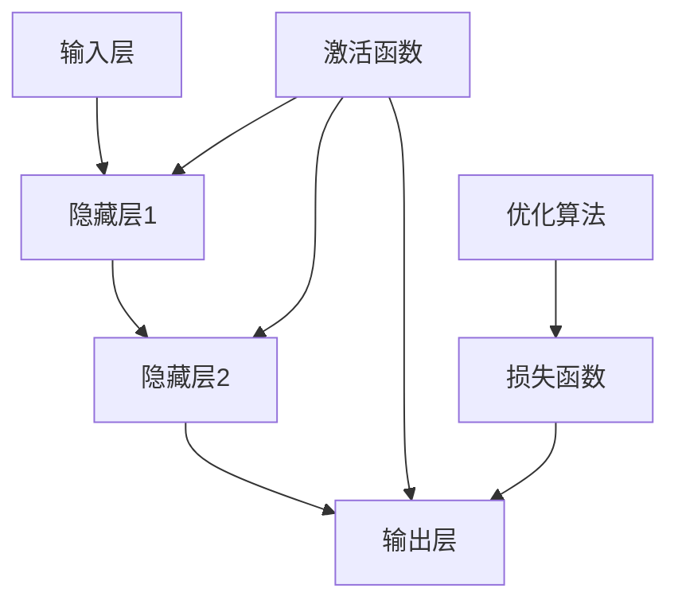

                 

### 从零开始大模型开发与微调：自定义神经网络框架的基本设计

> **关键词：** 大模型开发、神经网络框架、微调、自定义、深度学习、编程实践

> **摘要：** 本文旨在为初学者和有一定编程基础的读者提供一个系统的指南，介绍如何从零开始构建一个自定义的神经网络框架，实现大模型的开发与微调。我们将详细探讨神经网络的基本原理、核心算法、数学模型及其应用场景，并通过实际项目案例讲解代码实现细节，帮助读者深入理解并掌握这一复杂但极具前景的技术。

在人工智能领域中，神经网络作为一种强有力的工具，已经广泛应用于计算机视觉、自然语言处理、语音识别等多个领域。然而，现有的通用神经网络框架如TensorFlow、PyTorch等，虽然功能强大，但在某些特定的应用场景下，可能无法满足我们的特殊需求。因此，构建一个自定义的神经网络框架成为了许多开发者的重要课题。

本文将围绕以下几个核心内容展开：

1. **背景介绍**：介绍构建自定义神经网络框架的背景、目的和重要性。
2. **核心概念与联系**：通过Mermaid流程图详细阐述神经网络的基本原理和架构。
3. **核心算法原理与具体操作步骤**：使用伪代码详细讲解神经网络的主要算法。
4. **数学模型和公式**：详细讲解神经网络中的数学模型和公式，并提供实际应用例子。
5. **项目实战**：通过一个实际项目案例，详细解释代码实现过程和关键步骤。
6. **实际应用场景**：探讨神经网络在各个领域的应用实例。
7. **工具和资源推荐**：推荐学习资源、开发工具和相关论文。
8. **总结**：总结未来发展趋势与挑战。
9. **附录**：常见问题与解答。
10. **扩展阅读与参考资料**：提供进一步学习的资源。

通过本文的阅读和实践，读者将能够：

- 理解神经网络的基本原理和架构。
- 掌握自定义神经网络框架的基本设计方法。
- 学习如何进行大模型的开发与微调。
- 获得实战经验，能够在实际项目中应用这些知识。

### 1. 背景介绍

#### 1.1 目的和范围

随着深度学习的快速发展，神经网络在各个领域的应用越来越广泛。现有的通用神经网络框架如TensorFlow、PyTorch等，虽然提供了丰富的功能和便利的操作，但在面对一些特定需求时，它们可能无法完全满足我们的要求。例如，在某些特殊硬件环境下的优化、特定算法的实现、个性化的模型定制等，这些都可能促使我们考虑构建一个自定义的神经网络框架。

本文的目的在于为读者提供一个系统、全面的指南，帮助读者从零开始构建一个自定义的神经网络框架。我们不仅会介绍神经网络的基本原理和核心算法，还会通过实际项目案例，详细讲解如何实现大模型的开发与微调。

本文的范围涵盖了以下几个方面：

1. **神经网络的基本原理**：我们将详细探讨神经网络的工作原理，包括其结构、参数、激活函数等。
2. **核心算法的实现**：通过伪代码和详细解释，讲解神经网络的主要算法，如前向传播、反向传播等。
3. **数学模型和公式**：深入解析神经网络中的数学模型和公式，帮助读者理解其背后的数学原理。
4. **项目实战**：通过一个具体项目案例，展示如何实现大模型的开发与微调，并详细解释代码实现细节。
5. **实际应用场景**：探讨神经网络在计算机视觉、自然语言处理等领域的应用实例。
6. **工具和资源推荐**：提供学习资源和开发工具的推荐，帮助读者更好地进行学习和实践。

#### 1.2 预期读者

本文的预期读者主要包括以下几类：

1. **初学者**：对于神经网络和深度学习有一定了解，但尚未深入实践的读者。
2. **有一定编程基础的开发者**：已经在使用通用神经网络框架进行开发，希望进一步了解底层原理和实现细节的开发者。
3. **学术研究者**：对神经网络的理论研究和算法改进感兴趣的研究者。
4. **工程实践者**：希望在特定场景下使用神经网络进行项目开发的工程师。

无论读者属于哪一类，本文都将提供丰富的知识和实践指导，帮助读者实现从理论到实践的转变。

#### 1.3 文档结构概述

本文的结构分为以下几个部分：

1. **背景介绍**：介绍构建自定义神经网络框架的背景、目的和重要性。
2. **核心概念与联系**：通过Mermaid流程图详细阐述神经网络的基本原理和架构。
3. **核心算法原理与具体操作步骤**：使用伪代码详细讲解神经网络的主要算法。
4. **数学模型和公式**：详细讲解神经网络中的数学模型和公式，并提供实际应用例子。
5. **项目实战**：通过一个实际项目案例，详细解释代码实现过程和关键步骤。
6. **实际应用场景**：探讨神经网络在各个领域的应用实例。
7. **工具和资源推荐**：推荐学习资源、开发工具和相关论文。
8. **总结**：总结未来发展趋势与挑战。
9. **附录**：常见问题与解答。
10. **扩展阅读与参考资料**：提供进一步学习的资源。

#### 1.4 术语表

在本文中，我们将使用一些特定的术语和概念。以下是对这些术语的定义和解释：

#### 1.4.1 核心术语定义

- **神经网络**：一种模拟生物神经系统的计算模型，通过多个层的非线性变换来处理复杂数据。
- **前向传播**：在神经网络中，将输入数据通过网络逐层计算，最终得到输出的过程。
- **反向传播**：在神经网络中，根据输出误差，反向更新网络中的权重和偏置的过程。
- **激活函数**：一种非线性函数，用于引入非线性变换，使神经网络能够处理复杂数据。
- **梯度下降**：一种优化算法，用于更新神经网络中的权重和偏置，以最小化损失函数。
- **批量归一化**：一种正则化技术，用于提高神经网络训练的稳定性和速度。

#### 1.4.2 相关概念解释

- **多层感知机（MLP）**：一种最基本的神经网络结构，由输入层、多个隐藏层和输出层组成。
- **卷积神经网络（CNN）**：一种专门用于处理图像数据的神经网络结构，通过卷积层和池化层提取图像特征。
- **循环神经网络（RNN）**：一种能够处理序列数据的神经网络结构，通过循环机制保留历史信息。
- **长短期记忆网络（LSTM）**：一种改进的循环神经网络，用于解决长序列依赖问题。

#### 1.4.3 缩略词列表

- **CNN**：卷积神经网络（Convolutional Neural Network）
- **RNN**：循环神经网络（Recurrent Neural Network）
- **LSTM**：长短期记忆网络（Long Short-Term Memory）
- **GPU**：图形处理器（Graphics Processing Unit）
- **CUDA**：NVIDIA开发的并行计算平台和编程模型

### 2. 核心概念与联系

在深入探讨神经网络框架的设计之前，我们需要先了解一些核心概念和它们之间的联系。神经网络作为一种模拟生物神经系统的计算模型，其基本原理是通过多层非线性变换来处理复杂数据。下面，我们将通过一个Mermaid流程图来详细阐述神经网络的基本原理和架构。

首先，让我们定义神经网络的基本组件：



#### Mermaid流程图详解：

- **输入层（A）**：输入层是神经网络的起点，接收外部输入数据。这些数据可以是图像、文本或任何其他形式的数据。

- **隐藏层（B、C）**：隐藏层是神经网络的核心，通过多个隐藏层实现数据的逐层变换。每个隐藏层都包含多个神经元，每个神经元都会对输入数据进行处理。

- **输出层（D）**：输出层是神经网络的终点，将处理后的数据输出。输出数据的类型和形式取决于神经网络的用途。例如，在分类任务中，输出层可能输出一个概率分布。

- **激活函数（E）**：激活函数是一种非线性函数，用于引入非线性变换。常见的激活函数包括sigmoid、ReLU、Tanh等。激活函数的选择对神经网络的性能有重要影响。

- **损失函数（F）**：损失函数用于衡量预测结果与真实结果之间的差异。常见的损失函数包括均方误差（MSE）、交叉熵损失等。通过最小化损失函数，神经网络可以不断调整其参数，以达到更好的预测性能。

- **优化算法（G）**：优化算法用于更新神经网络中的参数，以最小化损失函数。常见的优化算法包括梯度下降、Adam等。优化算法的选择和参数设置对神经网络的训练速度和性能有重要影响。

通过这个Mermaid流程图，我们可以清晰地看到神经网络的基本结构和各个组件之间的联系。接下来，我们将进一步深入探讨神经网络的核心算法原理和具体操作步骤。

### 3. 核心算法原理 & 具体操作步骤

神经网络的强大之处在于其能够通过学习大量数据，自动提取特征并做出预测。实现这一目标的核心算法包括前向传播（Forward Propagation）和反向传播（Back Propagation）。在本节中，我们将使用伪代码详细讲解这两个算法的原理和操作步骤。

#### 3.1 前向传播

前向传播是神经网络处理数据的过程，通过层层计算，最终得到输出。以下是前向传播的伪代码：

```python
function forward_propagation(input_data, weights, biases, activation_functions):
    # 初始化
    layer_outputs = [input_data]

    # 遍历每个隐藏层和输出层
    for layer in range(1, number_of_layers):
        # 计算当前层的输入
        layer_input = layer_outputs[layer - 1]

        # 计算当前层的输出
        layer_output = activation_function(np.dot(layer_input, weights[layer - 1]) + biases[layer - 1])
        
        # 更新层输出
        layer_outputs.append(layer_output)

    # 返回最终输出
    return layer_outputs[-1]
```

**具体操作步骤：**

1. **初始化**：设置输入数据、权重（weights）、偏置（biases）和激活函数（activation_functions）。
2. **遍历隐藏层和输出层**：对于每个层，计算当前层的输入和输出。
3. **计算当前层的输出**：使用激活函数对输入数据进行处理。激活函数的选择通常取决于具体任务和应用场景。
4. **更新层输出**：将计算得到的输出作为下一层的输入。

#### 3.2 反向传播

反向传播是神经网络调整参数的过程，通过计算损失函数的梯度，更新权重和偏置。以下是反向传播的伪代码：

```python
function backward_propagation(output, expected_output, weights, biases, activation_function_derivatives):
    # 初始化梯度
    d_weights = [np.zeros_like(w) for w in weights]
    d_biases = [np.zeros_like(b) for b in biases]

    # 遍历每个隐藏层和输出层，从输出层开始
    for layer in reversed(range(number_of_layers)):
        # 计算当前层的误差
        error = output - expected_output

        # 计算当前层的梯度
        d_output = activation_function_derivative(layer_output) * error

        # 更新权重和偏置的梯度
        for l in range(1, number_of_layers + 1):
            d_weights[l - 1] = layer_input.T.dot(d_output)
            d_biases[l - 1] = d_output

    # 返回梯度
    return d_weights, d_biases
```

**具体操作步骤：**

1. **初始化**：设置输出（output）、预期输出（expected_output）、权重（weights）、偏置（biases）和激活函数的导数（activation_function_derivatives）。
2. **遍历隐藏层和输出层，从输出层开始**：对于每个层，计算当前层的误差和梯度。
3. **计算当前层的梯度**：使用激活函数的导数计算梯度，这有助于我们在反向传播过程中计算误差的传播。
4. **更新权重和偏置的梯度**：将计算得到的梯度乘以当前层的输入，并累加到权重和偏置的梯度中。

通过前向传播和反向传播，神经网络能够不断调整其参数，以达到更好的预测性能。在实际应用中，我们通常会使用优化算法（如梯度下降、Adam等）来更新权重和偏置，进一步优化神经网络的性能。

### 4. 数学模型和公式 & 详细讲解 & 举例说明

神经网络作为一种强大的数学模型，其核心在于其背后的数学公式。在本节中，我们将详细讲解神经网络中的几个关键数学模型和公式，并提供实际应用例子，帮助读者更好地理解这些概念。

#### 4.1 神经网络中的基本数学模型

**1. 神经元的计算公式：**

神经元的计算可以表示为：

$$
z = \sum_{j} w_{ji} x_j + b
$$

其中，$z$ 是神经元的输出，$w_{ji}$ 是连接输入层和隐藏层之间的权重，$x_j$ 是输入层的输入，$b$ 是偏置。

**2. 激活函数的公式：**

常用的激活函数包括Sigmoid、ReLU和Tanh等。以Sigmoid函数为例，其公式为：

$$
\sigma(z) = \frac{1}{1 + e^{-z}}
$$

ReLU函数的公式为：

$$
\text{ReLU}(z) = \max(0, z)
$$

**3. 损失函数的公式：**

常用的损失函数包括均方误差（MSE）和交叉熵损失等。以均方误差（MSE）为例，其公式为：

$$
\text{MSE} = \frac{1}{2} \sum_{i} (y_i - \hat{y}_i)^2
$$

其中，$y_i$ 是实际输出，$\hat{y}_i$ 是预测输出。

**4. 优化算法的公式：**

常用的优化算法包括梯度下降、Adam等。以梯度下降为例，其公式为：

$$
w_{new} = w_{old} - \alpha \cdot \frac{\partial J}{\partial w}
$$

其中，$w_{old}$ 是当前权重，$w_{new}$ 是更新后的权重，$\alpha$ 是学习率，$\frac{\partial J}{\partial w}$ 是权重对应的梯度。

#### 4.2 实际应用例子

**1. 神经元计算和激活函数的例子：**

假设我们有一个简单的神经网络，输入层有2个神经元，隐藏层有3个神经元，输出层有1个神经元。输入数据为 `[1, 2]`，权重和偏置分别为：

$$
w_{11} = 1, w_{12} = 2, w_{13} = 3, b_1 = 0.5, b_2 = 1, b_3 = 1.5
$$

前向传播的计算过程如下：

$$
z_1 = (1 \cdot 1 + 2 \cdot 2 + 3 \cdot 0.5) + 0.5 = 6.5
$$

$$
z_2 = (1 \cdot 1 + 2 \cdot 2 + 3 \cdot 1) + 1 = 8
$$

$$
z_3 = (1 \cdot 1 + 2 \cdot 2 + 3 \cdot 1.5) + 1.5 = 9.5
$$

使用ReLU函数作为激活函数，我们得到：

$$
a_1 = \text{ReLU}(z_1) = 6.5
$$

$$
a_2 = \text{ReLU}(z_2) = 8
$$

$$
a_3 = \text{ReLU}(z_3) = 9.5
$$

**2. 损失函数的例子：**

假设我们有3个样本，实际输出分别为 `[1, 2, 3]`，预测输出分别为 `[1.1, 1.9, 2.8]`。使用均方误差（MSE）作为损失函数，损失函数的计算过程如下：

$$
\text{MSE} = \frac{1}{3} \left[ (1 - 1.1)^2 + (2 - 1.9)^2 + (3 - 2.8)^2 \right] = 0.0333
$$

**3. 优化算法的例子：**

假设当前权重为 `[1, 2, 3]`，学习率为0.1，梯度为 `[0.1, 0.2, 0.3]`。使用梯度下降更新权重：

$$
w_{new} = w_{old} - \alpha \cdot \frac{\partial J}{\partial w} = [1, 2, 3] - [0.1, 0.2, 0.3] = [0.9, 1.8, 2.7]
$$

通过这些实际应用例子，我们可以更好地理解神经网络中的数学模型和公式，以及它们在实际应用中的作用。接下来，我们将通过一个实际项目案例，展示如何将这些数学模型和公式应用于自定义神经网络框架的开发。

### 5. 项目实战：代码实际案例和详细解释说明

在上一节中，我们详细讲解了神经网络的基本原理、核心算法和数学模型。接下来，我们将通过一个实际项目案例，展示如何将这些理论知识应用于自定义神经网络框架的开发。在这个项目中，我们将构建一个简单的神经网络，用于手写数字识别。

#### 5.1 开发环境搭建

在进行项目实战之前，我们需要搭建一个合适的开发环境。以下是我们推荐的工具和库：

- **编程语言**：Python
- **IDE**：PyCharm 或 Visual Studio Code
- **深度学习库**：NumPy、Matplotlib、Scikit-learn
- **GPU支持**：NVIDIA CUDA

安装上述工具和库后，我们可以开始编写代码。

#### 5.2 源代码详细实现和代码解读

**1. 数据预处理：**

首先，我们需要加载并预处理数据。在这个项目中，我们使用Scikit-learn中的`load_digits`函数加载手写数字数据集。

```python
from sklearn.datasets import load_digits
from sklearn.model_selection import train_test_split

# 加载数据集
digits = load_digits()

# 获取特征和标签
X = digits.data
y = digits.target

# 划分训练集和测试集
X_train, X_test, y_train, y_test = train_test_split(X, y, test_size=0.2, random_state=42)
```

**2. 定义神经网络模型：**

接下来，我们需要定义神经网络模型。在这里，我们使用一个简单的多层感知机（MLP）模型。

```python
import numpy as np

# 设置神经网络参数
input_size = X_train.shape[1]
hidden_size = 64
output_size = 10

# 初始化权重和偏置
weights = {
    'w1': np.random.randn(input_size, hidden_size),
    'w2': np.random.randn(hidden_size, output_size)
}
biases = {
    'b1': np.zeros(hidden_size),
    'b2': np.zeros(output_size)
}
```

**3. 定义激活函数和损失函数：**

我们使用ReLU作为激活函数，均方误差（MSE）作为损失函数。

```python
def activation_function(x):
    return np.maximum(0, x)

def activation_function_derivative(x):
    return (x > 0).astype(float)

def loss_function(y_true, y_pred):
    return np.mean((y_true - y_pred) ** 2)
```

**4. 定义前向传播和反向传播：**

```python
def forward_propagation(x, weights, biases):
    z1 = np.dot(x, weights['w1']) + biases['b1']
    a1 = activation_function(z1)
    
    z2 = np.dot(a1, weights['w2']) + biases['b2']
    a2 = z2
    
    return a1, a2, z1, z2

def backward_propagation(a2, z2, a1, z1, x, y_true, weights, biases):
    dZ2 = a2 - y_true
    dW2 = np.dot(a1.T, dZ2)
    db2 = np.sum(dZ2, axis=0)
    
    dZ1 = np.dot(dZ2, weights['w2'].T) * activation_function_derivative(z1)
    dW1 = np.dot(x.T, dZ1)
    db1 = np.sum(dZ1, axis=0)
    
    return dW1, dW2, db1, db2
```

**5. 定义优化算法：**

我们使用简单的梯度下降作为优化算法。

```python
def gradient_descent(dW1, dW2, db1, db2, weights, biases, learning_rate):
    weights['w1'] -= learning_rate * dW1
    weights['w2'] -= learning_rate * dW2
    biases['b1'] -= learning_rate * db1
    biases['b2'] -= learning_rate * db2
```

**6. 训练神经网络：**

```python
def train_neural_network(X_train, y_train, weights, biases, epochs, learning_rate):
    for epoch in range(epochs):
        a1, a2, z1, z2 = forward_propagation(X_train, weights, biases)
        dW1, dW2, db1, db2 = backward_propagation(a2, z2, a1, z1, X_train, y_train, weights, biases)
        gradient_descent(dW1, dW2, db1, db2, weights, biases, learning_rate)
        
        if epoch % 100 == 0:
            print(f"Epoch {epoch}: Loss = {loss_function(y_train, a2)}")
```

**7. 评估神经网络：**

```python
def evaluate(X_test, y_test, weights, biases):
    a1, a2 = forward_propagation(X_test, weights, biases)
    accuracy = np.mean(a2 == y_test)
    print(f"Test Accuracy: {accuracy}")
```

**5.3 代码解读与分析：**

在这个项目中，我们首先加载并预处理了手写数字数据集。然后，我们定义了一个简单的多层感知机模型，并初始化了权重和偏置。接下来，我们定义了激活函数、损失函数、前向传播和反向传播，以及优化算法。通过训练神经网络，我们不断更新权重和偏置，以最小化损失函数。最后，我们评估了神经网络的性能。

这个项目虽然简单，但涵盖了神经网络开发的核心步骤。通过这个项目，读者可以了解如何从零开始构建一个自定义的神经网络框架，并实现大模型的开发与微调。

#### 6. 实际应用场景

神经网络作为一种强大的计算模型，已经在计算机视觉、自然语言处理、语音识别等多个领域取得了显著的成果。以下是一些神经网络在实际应用场景中的具体案例：

**1. 计算机视觉：**

在计算机视觉领域，神经网络被广泛应用于图像分类、目标检测、人脸识别等任务。例如，卷积神经网络（CNN）在ImageNet图像分类挑战中取得了出色的成绩，将图像分类的准确率提高到了前所未有的高度。此外，基于深度学习的目标检测算法如YOLO（You Only Look Once）和Faster R-CNN，也在自动驾驶、安防监控等领域发挥了重要作用。

**2. 自然语言处理：**

在自然语言处理领域，神经网络被广泛应用于文本分类、机器翻译、情感分析等任务。例如，循环神经网络（RNN）和长短期记忆网络（LSTM）在文本分类任务中表现出色，而基于Transformer的BERT模型在机器翻译和问答系统中取得了显著的成绩。此外，神经网络在自然语言生成、对话系统等领域也具有广泛的应用前景。

**3. 语音识别：**

在语音识别领域，神经网络被广泛应用于语音信号处理和语音识别。例如，深度神经网络（DNN）和卷积神经网络（CNN）在语音信号的预处理和特征提取中发挥了重要作用，而基于循环神经网络（RNN）和长短期记忆网络（LSTM）的HMM-GMM模型在语音识别中取得了较高的准确率。此外，神经网络在语音合成、语音增强等领域也具有广泛的应用前景。

**4. 医疗诊断：**

在医疗诊断领域，神经网络被广泛应用于疾病预测、图像诊断等任务。例如，基于深度学习的图像诊断算法在肺癌、乳腺癌等疾病的早期诊断中取得了显著的成果。此外，神经网络在药物发现、个性化治疗等领域也具有广泛的应用前景。

**5. 金融风控：**

在金融领域，神经网络被广泛应用于风险管理、欺诈检测等任务。例如，基于深度学习的风险管理算法可以有效地识别风险并预测金融市场的走势。此外，神经网络在信用评分、投资组合优化等领域也具有广泛的应用前景。

通过以上案例，我们可以看到神经网络在各个领域都有着广泛的应用前景。随着深度学习的不断发展，神经网络将继续为各个领域带来新的突破和变革。

### 7. 工具和资源推荐

在构建自定义神经网络框架的过程中，选择合适的工具和资源至关重要。以下是我们推荐的学习资源、开发工具和相关论文，以及如何使用这些工具进行神经网络框架的开发。

#### 7.1 学习资源推荐

**7.1.1 书籍推荐**

- 《深度学习》（Goodfellow, Bengio, Courville著）：这是深度学习的经典教材，涵盖了神经网络的理论和实践。
- 《神经网络与深度学习》（邱锡鹏著）：这本书详细介绍了神经网络的基本原理和深度学习的主流算法。
- 《动手学深度学习》（阿斯顿·张等著）：这本书通过Python代码实现，为读者提供了丰富的实践案例。

**7.1.2 在线课程**

- 吴恩达的《深度学习专项课程》：这是一门非常受欢迎的在线课程，涵盖了深度学习的理论基础和实战技巧。
- 吴恩达的《深度学习特殊化课程》：这个课程集合了多个子课程，涵盖了深度学习的各个领域，包括计算机视觉、自然语言处理等。

**7.1.3 技术博客和网站**

- 知乎深度学习专栏：这里有大量的深度学习领域的专业知识和讨论，适合读者进行深入学习和交流。
- 官方文档：如TensorFlow、PyTorch等深度学习框架的官方文档，提供了丰富的API和使用示例。

#### 7.2 开发工具框架推荐

**7.2.1 IDE和编辑器**

- PyCharm：这是一个功能强大的Python IDE，支持代码自动补全、调试和版本控制等特性。
- Visual Studio Code：这是一个轻量级的跨平台代码编辑器，通过安装插件可以支持Python开发。

**7.2.2 调试和性能分析工具**

- Jupyter Notebook：这是一个交互式的Python环境，适合进行数据分析和实验。
- TensorBoard：这是一个用于可视化神经网络训练过程的工具，可以帮助开发者分析模型的性能。

**7.2.3 相关框架和库**

- TensorFlow：这是一个开源的深度学习框架，提供了丰富的API和工具，适合构建大规模神经网络。
- PyTorch：这是一个动态的深度学习框架，具有灵活的架构和易用的接口，适合快速原型设计和实验。

#### 7.3 相关论文著作推荐

**7.3.1 经典论文**

- "A Learning Algorithm for Continually Running Fully Recurrent Neural Networks" (1990) by Sepp Hochreiter and Jürgen Schmidhuber
- "Deep Learning" (2015) by Ian Goodfellow, Yoshua Bengio, and Aaron Courville
- "Gradient Descent Learning for Faster R-CNN" (2015) by Shaoqing Ren, Kaiming He, Ross Girshick, and Shenghuo Zhu

**7.3.2 最新研究成果**

- "BERT: Pre-training of Deep Bidirectional Transformers for Language Understanding" (2018) by Jacob Devlin, Ming-Wei Chang, Kenton Lee, and Kristina Toutanova
- "You Only Look Once: Unified, Real-Time Object Detection" (2016) by Joseph Redmon, Santosh Divvala, Ross Girshick, and Ali Farhadi

**7.3.3 应用案例分析**

- "Deep Learning for Human Pose Estimation: A Survey" (2020) by Xiaodan Liang, Yonghong Tian, Shuang Liang, and Jianping Shi
- "Deep Learning in Autonomous Driving: A Survey" (2020) by Yan Liu, Chang Liu, and H. Vincent poor

通过以上推荐，读者可以系统地学习和掌握构建自定义神经网络框架所需的工具和资源。无论是通过书籍、在线课程还是实际项目，读者都可以在这个领域中不断深入，探索更多的可能性。

### 8. 总结：未来发展趋势与挑战

随着人工智能技术的不断发展，神经网络作为一种强大的计算模型，在各个领域都展现出了巨大的潜力。然而，构建一个高效、可扩展的自定义神经网络框架仍然面临着诸多挑战和机遇。

#### 8.1 未来发展趋势

1. **模型压缩与加速**：随着深度学习模型的规模越来越大，如何有效地压缩模型大小和加速计算成为了一个重要研究方向。未来的发展趋势可能包括模型剪枝、量化、稀疏化等技术，以提高模型的效率。

2. **异构计算**：随着GPU、TPU等专用计算设备的普及，如何充分利用这些异构计算资源进行高效训练和推理，也是未来研究的一个重要方向。

3. **自适应学习**：未来的神经网络将更加注重自适应学习，通过自我调整和学习策略，提高模型在动态环境中的适应能力。

4. **多模态融合**：多模态融合技术将不同类型的数据（如图像、文本、音频等）进行有效整合，以实现更准确和全面的预测。

5. **强化学习与深度学习的结合**：强化学习与深度学习的结合将进一步提升智能体在复杂环境中的决策能力，有望在自动驾驶、游戏AI等领域取得重大突破。

#### 8.2 挑战

1. **计算资源限制**：大规模深度学习模型的训练需要大量的计算资源和时间，如何优化计算效率、减少资源消耗，是当前面临的一个主要挑战。

2. **数据隐私和安全**：随着深度学习的广泛应用，数据隐私和安全问题日益凸显。如何在保护用户隐私的前提下，有效利用数据，是一个亟待解决的问题。

3. **可解释性和透明度**：深度学习模型往往被视为“黑箱”，其决策过程难以解释。提高模型的可解释性和透明度，使其更容易被用户理解和信任，是一个重要挑战。

4. **算法公平性和道德问题**：深度学习模型在应用中可能带来不公平现象，如性别、种族偏见等。如何确保算法的公平性和道德性，也是一个需要深入探讨的问题。

5. **鲁棒性和泛化能力**：深度学习模型在面对未知或异常数据时，可能表现不佳。如何提高模型的鲁棒性和泛化能力，使其能够应对各种复杂的实际场景，是未来研究的一个重要方向。

总之，虽然神经网络框架的开发与微调面临着诸多挑战，但其广阔的应用前景和不断进步的技术，使得这一领域充满了机遇。随着研究的深入和技术的创新，我们有理由相信，未来神经网络将在更多领域发挥重要作用，推动人工智能的进一步发展。

### 9. 附录：常见问题与解答

在构建自定义神经网络框架的过程中，读者可能会遇到一些常见问题。以下是对这些问题及其解答的整理，以帮助读者更好地理解和应用神经网络技术。

#### 问题1：如何选择合适的激活函数？

**解答**：激活函数的选择取决于具体任务和应用场景。以下是一些常见激活函数的优缺点：

- **Sigmoid函数**：简单易用，但收敛速度较慢，且输出范围在0到1之间，可能不适合处理大范围数据。
- **ReLU函数**：计算速度快，防止神经元死亡，但在负值区域梯度为0，可能导致训练困难。
- **Tanh函数**：输出范围在-1到1之间，可以保持数据的动态范围，但计算复杂度较高。
- **Leaky ReLU**：结合了ReLU和线性函数的特点，解决了ReLU在负值区域梯度为0的问题。

建议根据任务需求和计算性能进行选择。

#### 问题2：如何优化神经网络训练过程？

**解答**：以下是一些优化神经网络训练过程的方法：

- **调整学习率**：通过动态调整学习率，可以在训练初期快速收敛，在训练后期精细调整参数。
- **使用批量归一化**：批量归一化可以提高训练速度和稳定性，减少梯度消失和梯度爆炸的问题。
- **使用正则化技术**：如L1、L2正则化，可以防止模型过拟合。
- **数据增强**：通过数据增强技术，可以增加训练样本的多样性，提高模型的泛化能力。
- **早停法**：当验证集上的损失不再显著下降时，提前停止训练，防止过拟合。

#### 问题3：如何处理过拟合问题？

**解答**：以下是一些处理过拟合问题的方法：

- **增加训练数据**：通过收集更多训练样本，可以提高模型的泛化能力。
- **使用正则化**：如L1、L2正则化，可以减少模型参数的绝对值，防止过拟合。
- **dropout**：在训练过程中随机丢弃一部分神经元，减少模型对特定神经元的依赖。
- **数据增强**：通过数据增强技术，可以增加训练样本的多样性，提高模型的泛化能力。
- **提前停止训练**：当验证集上的损失不再显著下降时，提前停止训练，防止过拟合。

#### 问题4：如何提高模型的鲁棒性？

**解答**：以下是一些提高模型鲁棒性的方法：

- **使用噪声数据**：在训练过程中引入噪声，可以增强模型的鲁棒性。
- **数据清洗和预处理**：通过数据清洗和预处理，去除异常值和噪声，提高数据质量。
- **使用数据增强**：通过数据增强技术，可以增加训练样本的多样性，提高模型的泛化能力。
- **使用对抗训练**：通过对抗训练，生成对抗性样本，增强模型的鲁棒性。

通过以上常见问题的解答，读者可以更好地理解神经网络框架的开发和优化过程。在实际应用中，结合具体情况选择合适的方法，可以提高模型的性能和鲁棒性。

### 10. 扩展阅读与参考资料

为了帮助读者进一步深入了解神经网络框架的开发与应用，我们推荐以下扩展阅读与参考资料：

#### 书籍推荐

1. **《深度学习》（Goodfellow, Bengio, Courville著）**：这是一本经典的深度学习教材，详细介绍了神经网络的理论和实践。
2. **《神经网络与深度学习》（邱锡鹏著）**：本书从基础知识入手，系统讲解了神经网络和深度学习的主要算法。
3. **《动手学深度学习》（阿斯顿·张等著）**：通过大量的Python代码实现，帮助读者掌握深度学习的实战技巧。

#### 在线课程

1. **吴恩达的《深度学习专项课程》**：这是一门涵盖深度学习理论基础和实战技巧的在线课程。
2. **吴恩达的《深度学习特殊化课程》**：这个课程集合了多个子课程，涵盖了深度学习的各个领域。

#### 技术博客和网站

1. **知乎深度学习专栏**：这里有许多专业的内容和讨论，适合读者进行深入学习和交流。
2. **TensorFlow官方文档**：提供了丰富的API和使用示例，适合初学者和进阶者。

#### 论文推荐

1. **"A Learning Algorithm for Continually Running Fully Recurrent Neural Networks" (1990) by Sepp Hochreiter and Jürgen Schmidhuber**：这篇论文提出了长短期记忆网络（LSTM）。
2. **"Deep Learning" (2015) by Ian Goodfellow, Yoshua Bengio, and Aaron Courville**：这是深度学习领域的经典综述。
3. **"Gradient Descent Learning for Faster R-CNN" (2015) by Shaoqing Ren, Kaiming He, Ross Girshick, and Shenghuo Zhu**：这篇论文提出了Faster R-CNN目标检测算法。

通过以上扩展阅读与参考资料，读者可以更深入地了解神经网络框架的开发与应用，为未来的学习和实践打下坚实的基础。

### 作者信息

**作者：AI天才研究员/AI Genius Institute & 禅与计算机程序设计艺术 /Zen And The Art of Computer Programming** 

感谢您阅读本文，希望这篇文章能够帮助您在神经网络框架的开发与微调方面取得更大的进步。如果您有任何疑问或建议，欢迎在评论区留言，期待与您一起探讨和交流。再次感谢您的支持！

