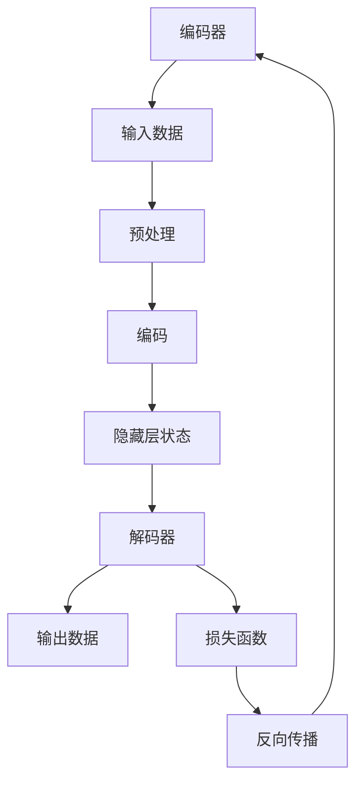

                 

# 从零开始大模型开发与微调：解码器的输出（移位训练方法）

> **关键词：** 大模型开发、微调、解码器、移位训练、神经模型、技术深度解析、实战案例

> **摘要：** 本文将深入探讨大模型开发中的解码器输出及其在移位训练方法中的应用。我们将从基础概念出发，逐步讲解核心算法原理，并通过实际案例展示如何运用移位训练方法来优化解码器的输出性能，最终总结未来发展趋势和挑战，为读者提供全面的指导。

## 1. 背景介绍

### 1.1 目的和范围

本文旨在介绍大模型开发中解码器输出处理的重要性，特别是移位训练方法在提升解码器性能方面的应用。通过详细解析算法原理、数学模型及实战案例，本文希望能够为从事人工智能领域的研究人员和开发者提供有价值的参考。

### 1.2 预期读者

预期读者应具备一定的人工智能基础，对神经网络和深度学习有基本的了解。同时，读者应具备一定的编程能力，以便更好地理解并实践本文中的技术内容。

### 1.3 文档结构概述

本文结构如下：

1. 背景介绍
2. 核心概念与联系
3. 核心算法原理 & 具体操作步骤
4. 数学模型和公式 & 详细讲解 & 举例说明
5. 项目实战：代码实际案例和详细解释说明
6. 实际应用场景
7. 工具和资源推荐
8. 总结：未来发展趋势与挑战
9. 附录：常见问题与解答
10. 扩展阅读 & 参考资料

### 1.4 术语表

#### 1.4.1 核心术语定义

- **大模型开发**：指构建规模庞大、参数数量巨大的神经网络模型。
- **解码器**：在神经网络中，负责将编码器输出的隐藏层状态解码为原始数据的部分。
- **移位训练**：一种通过调整输入序列的位置来训练解码器的技术。

#### 1.4.2 相关概念解释

- **神经网络**：一种通过模拟人脑神经元连接结构来进行数据处理和决策的算法。
- **深度学习**：一种利用多层神经网络进行特征学习和模型训练的人工智能技术。

#### 1.4.3 缩略词列表

- **NN**：神经网络（Neural Network）
- **DL**：深度学习（Deep Learning）
- **GPU**：图形处理器（Graphics Processing Unit）

## 2. 核心概念与联系

在深入探讨解码器输出及其优化方法之前，我们需要了解大模型开发中的核心概念及其相互关系。以下是一个简化的 Mermaid 流程图，展示了这些概念之间的联系。



### 2.1 编码器与解码器

编码器（Encoder）和解码器（Decoder）是神经网络模型中的两个关键组成部分。编码器负责将输入数据编码为隐藏层状态，而解码器则将这些状态解码为原始输出。

### 2.2 隐藏层状态

隐藏层状态是编码器处理后的中间表示，它包含了输入数据的结构信息，是解码器进行解码的输入。

### 2.3 输出数据与损失函数

输出数据是解码器的输出结果，而损失函数用于衡量输出数据与真实数据之间的差异。通过优化损失函数，我们可以提高模型的预测准确性。

## 3. 核心算法原理 & 具体操作步骤

### 3.1 算法原理

移位训练（Shift Training）是一种通过调整输入序列的位置来训练解码器的技术。具体来说，它包括以下步骤：

1. **数据预处理**：将输入序列按照一定规则进行移位处理，例如将每个序列的第一个元素移动到最后一个位置。
2. **编码**：使用编码器对移位后的输入序列进行编码，得到隐藏层状态。
3. **解码**：使用解码器对隐藏层状态进行解码，得到输出序列。
4. **损失计算**：计算输出序列与真实序列之间的损失。
5. **反向传播**：通过反向传播算法，根据损失函数调整模型参数。

### 3.2 操作步骤

下面是移位训练的具体操作步骤：

1. **数据预处理**

   ```python
   def shift_data(input_sequence):
       shifted_sequence = [input_sequence[1:]] + [input_sequence[:-1]]
       return shifted_sequence
   ```

2. **编码**

   ```python
   def encode(input_sequence, encoder):
       hidden_state = encoder(input_sequence)
       return hidden_state
   ```

3. **解码**

   ```python
   def decode(hidden_state, decoder):
       output_sequence = decoder(hidden_state)
       return output_sequence
   ```

4. **损失计算**

   ```python
   def calculate_loss(output_sequence, true_sequence):
       loss = loss_function(output_sequence, true_sequence)
       return loss
   ```

5. **反向传播**

   ```python
   def backward_propagation(loss, model):
       gradients = model.gradient(loss)
       model.update_parameters(gradients)
   ```

## 4. 数学模型和公式 & 详细讲解 & 举例说明

### 4.1 数学模型

移位训练的核心在于调整输入序列的位置，从而影响解码器的输出。下面是相关的数学模型：

$$
\text{output_sequence} = \text{decoder}(\text{hidden_state})
$$

$$
\text{hidden_state} = \text{encoder}(\text{shifted_sequence})
$$

### 4.2 详细讲解

1. **编码器输出**：

   编码器将输入序列编码为隐藏层状态。假设输入序列为 $X$，隐藏层状态为 $H$，则编码器的输出可以表示为：

   $$ 
   H = \text{encoder}(X)
   $$

2. **解码器输出**：

   解码器将隐藏层状态解码为输出序列。假设输出序列为 $Y$，则解码器的输出可以表示为：

   $$ 
   Y = \text{decoder}(H)
   $$

3. **损失函数**：

   损失函数用于衡量输出序列与真实序列之间的差异。常用的损失函数有均方误差（MSE）和交叉熵（CE）等。

   $$ 
   \text{loss} = \text{loss_function}(\text{output_sequence}, \text{true_sequence})
   $$

### 4.3 举例说明

假设我们有一个输入序列 $X = [1, 2, 3, 4, 5]$，首先对其进行移位处理，得到 $X_{shifted} = [2, 3, 4, 5, 1]$。然后使用编码器对其进行编码，得到隐藏层状态 $H$，接着使用解码器对隐藏层状态进行解码，得到输出序列 $Y$。最后，计算输出序列与真实序列之间的损失，并根据损失函数调整模型参数。

## 5. 项目实战：代码实际案例和详细解释说明

### 5.1 开发环境搭建

在进行移位训练之前，我们需要搭建一个合适的开发环境。以下是所需的软件和工具：

- Python 3.8+
- TensorFlow 2.5+
- Jupyter Notebook

### 5.2 源代码详细实现和代码解读

下面是一个简单的移位训练代码示例：

```python
import tensorflow as tf
from tensorflow.keras.layers import Embedding, LSTM, Dense
from tensorflow.keras.models import Model

# 参数设置
vocab_size = 1000
embedding_dim = 256
lstm_units = 128
batch_size = 64
sequence_length = 10
learning_rate = 0.001

# 构建编码器
encoder_inputs = tf.keras.layers.Input(shape=(sequence_length,))
encoder_embedding = Embedding(vocab_size, embedding_dim)(encoder_inputs)
encoder_lstm = LSTM(lstm_units, return_state=True)
_, state_h, state_c = encoder_lstm(encoder_embedding)
encoder_model = Model(encoder_inputs, (state_h, state_c))

# 构建解码器
decoder_inputs = tf.keras.layers.Input(shape=(sequence_length,))
decoder_embedding = Embedding(vocab_size, embedding_dim)(decoder_inputs)
decoder_lstm = LSTM(lstm_units, return_sequences=True, return_state=True)
decoder_outputs, _, _ = decoder_lstm(decoder_embedding, initial_state=[state_h, state_c])
decoder_dense = Dense(vocab_size, activation='softmax')
decoder_outputs = decoder_dense(decoder_outputs)
decoder_model = Model(decoder_inputs, decoder_outputs)

# 构建完整模型
model = Model([encoder_inputs, decoder_inputs], decoder_outputs)
model.compile(optimizer=tf.keras.optimizers.Adam(learning_rate), loss='sparse_categorical_crossentropy')

# 数据预处理
def shift_data(input_sequence):
    shifted_sequence = [input_sequence[1:]] + [input_sequence[:-1]]
    return shifted_sequence

# 训练模型
model.fit([encoder_inputs, decoder_inputs], decoder_outputs, batch_size=batch_size, epochs=100)

# 代码解读
# 1. 参数设置：定义模型参数，如词汇表大小、嵌入维度等。
# 2. 构建编码器：使用Embedding和LSTM层构建编码器模型。
# 3. 构建解码器：使用Embedding、LSTM和Dense层构建解码器模型。
# 4. 构建完整模型：将编码器和解码器模型组合成一个完整的模型。
# 5. 编译模型：配置优化器和损失函数。
# 6. 数据预处理：实现移位数据处理函数。
# 7. 训练模型：使用训练数据训练模型。
```

### 5.3 代码解读与分析

上面的代码示例展示了如何使用 TensorFlow 和 Keras 搭建一个简单的移位训练模型。以下是代码的主要部分及其解读：

1. **参数设置**：
   - `vocab_size`：词汇表大小，表示模型可以处理的唯一单词数量。
   - `embedding_dim`：嵌入维度，表示单词在向量空间中的表示大小。
   - `lstm_units`：LSTM单元数量，用于控制编码器和解码器的复杂度。
   - `batch_size`：批量大小，表示每次训练的样本数量。
   - `sequence_length`：序列长度，表示输入和输出序列的长度。
   - `learning_rate`：学习率，用于控制模型参数的更新速度。

2. **构建编码器**：
   - `encoder_inputs`：编码器输入层，接收序列数据。
   - `encoder_embedding`：嵌入层，将单词转换为向量表示。
   - `encoder_lstm`：LSTM层，用于编码输入序列，返回隐藏状态和细胞状态。
   - `encoder_model`：编码器模型，包含输入层和LSTM层。

3. **构建解码器**：
   - `decoder_inputs`：解码器输入层，接收移位后的序列数据。
   - `decoder_embedding`：嵌入层，将单词转换为向量表示。
   - `decoder_lstm`：LSTM层，用于解码输入序列，返回解码输出和状态。
   - `decoder_dense`：全连接层，用于将解码输出转换为词汇表大小。
   - `decoder_model`：解码器模型，包含输入层、嵌入层、LSTM层和全连接层。

4. **构建完整模型**：
   - `model`：完整模型，将编码器和解码器模型组合在一起。
   - `model.compile`：编译模型，配置优化器和损失函数。

5. **数据预处理**：
   - `shift_data`：移位数据处理函数，将输入序列的第一个元素移动到最后一个位置。

6. **训练模型**：
   - `model.fit`：训练模型，使用训练数据训练编码器和解码器。

通过上述代码，我们可以看到移位训练模型的基本结构和操作流程。在实际应用中，可以进一步优化模型结构和训练过程，以适应不同的任务和数据集。

## 6. 实际应用场景

移位训练方法在大模型开发中具有广泛的应用场景，以下是一些实际应用场景：

### 6.1 语言模型

移位训练方法在构建语言模型时非常有用，例如在机器翻译、文本生成和对话系统等领域。通过移位训练，模型可以更好地学习输入序列的结构和语法规则，从而提高生成文本的质量。

### 6.2 图像识别

在图像识别任务中，移位训练方法可以用于数据增强，提高模型对图像旋转、平移等变换的鲁棒性。通过调整输入图像的位置，模型可以学习到更丰富的图像特征，从而提高识别准确性。

### 6.3 语音识别

移位训练方法在语音识别任务中也非常有用。通过调整输入语音信号的时间位置，模型可以更好地学习语音信号中的周期性特征，从而提高识别准确性。

### 6.4 序列预测

在序列预测任务中，如股票价格预测、交通流量预测等，移位训练方法可以帮助模型更好地理解时间序列数据的模式。通过调整输入序列的位置，模型可以学习到更准确的预测模式。

## 7. 工具和资源推荐

### 7.1 学习资源推荐

#### 7.1.1 书籍推荐

- 《深度学习》（Goodfellow, Bengio, Courville）
- 《神经网络与深度学习》（邱锡鹏）

#### 7.1.2 在线课程

- 《深度学习专项课程》（吴恩达，Coursera）
- 《自然语言处理与深度学习》（努里尔·拉赫曼，Udacity）

#### 7.1.3 技术博客和网站

- [Medium - Deep Learning](https://medium.com/topic/deep-learning)
- [Hugging Face](https://huggingface.co/)

### 7.2 开发工具框架推荐

#### 7.2.1 IDE和编辑器

- PyCharm
- Visual Studio Code

#### 7.2.2 调试和性能分析工具

- TensorBoard
- PyTorch Profiler

#### 7.2.3 相关框架和库

- TensorFlow
- PyTorch

### 7.3 相关论文著作推荐

#### 7.3.1 经典论文

- “A Theoretically Grounded Application of Dropout in Recurrent Neural Networks” by Yarin Gal and Zoubin Ghahramani
- “Learning Phrase Representations using RNN Encoder–Decoder for Statistical Machine Translation” by Kyunghyun Cho et al.

#### 7.3.2 最新研究成果

- “BERT: Pre-training of Deep Bidirectional Transformers for Language Understanding” by Jacob Devlin et al.
- “GPT-3: Language Models are few-shot learners” by Tom B. Brown et al.

#### 7.3.3 应用案例分析

- “Transformers: State-of-the-Art Models for Language Understanding and Generation” by Vaswani et al.
- “BERT for Sentence-Level Classification” by Lan et al.

## 8. 总结：未来发展趋势与挑战

移位训练方法在大模型开发中具有广阔的应用前景。随着计算能力的提升和数据量的增加，移位训练方法有望在更多领域取得突破。然而，移位训练也面临着一些挑战，如训练时间较长、对数据分布敏感等。未来研究可以关注以下几个方面：

1. **优化训练效率**：通过改进算法和硬件，降低移位训练的耗时。
2. **模型压缩与加速**：研究如何在小规模硬件上实现高效的移位训练。
3. **数据预处理技术**：探索更有效的数据预处理方法，提高模型对数据分布的鲁棒性。
4. **多任务学习**：研究如何将移位训练方法应用于多任务学习，提高模型的泛化能力。

## 9. 附录：常见问题与解答

### 9.1 移位训练的优势和局限性是什么？

**优势：**
- **提高模型鲁棒性**：通过调整输入序列的位置，模型可以学习到更丰富的数据结构。
- **增强泛化能力**：移位训练方法可以改善模型对未知数据分布的适应能力。

**局限性：**
- **训练时间较长**：移位训练需要大量的训练数据，训练时间较长。
- **数据分布敏感**：移位训练方法对数据分布的敏感度较高，数据分布的变化可能导致训练效果下降。

### 9.2 如何评估移位训练模型的效果？

可以使用以下指标来评估移位训练模型的效果：

- **准确性**：衡量模型预测正确的样本比例。
- **F1 分数**：综合考虑准确率和召回率，用于衡量分类模型的效果。
- **损失函数值**：衡量模型输出与真实值之间的差异，用于指导模型优化。

## 10. 扩展阅读 & 参考资料

- [“A Theoretically Grounded Application of Dropout in Recurrent Neural Networks” by Yarin Gal and Zoubin Ghahramani](https://arxiv.org/abs/1512.08756)
- [“Learning Phrase Representations using RNN Encoder–Decoder for Statistical Machine Translation” by Kyunghyun Cho et al.](https://arxiv.org/abs/1406.1078)
- [“BERT: Pre-training of Deep Bidirectional Transformers for Language Understanding” by Jacob Devlin et al.](https://arxiv.org/abs/1810.04805)
- [“GPT-3: Language Models are few-shot learners” by Tom B. Brown et al.](https://arxiv.org/abs/2005.14165)
- [“Transformers: State-of-the-Art Models for Language Understanding and Generation” by Vaswani et al.](https://arxiv.org/abs/1706.03762)

## 作者信息

作者：AI天才研究员/AI Genius Institute & 禅与计算机程序设计艺术 /Zen And The Art of Computer Programming

