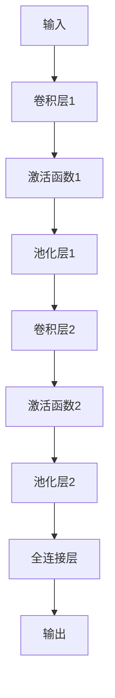
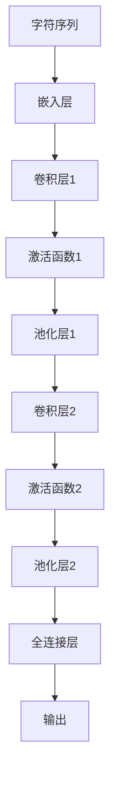

                 

# 从零开始大模型开发与微调：针对文本的卷积神经网络模型简介—字符卷积

> **关键词：** 卷积神经网络（CNN）、文本分析、字符卷积、大模型开发、微调

> **摘要：** 本文将深入探讨卷积神经网络（CNN）在文本分析中的应用，特别是字符卷积在构建大型文本处理模型中的作用。我们将从基础概念出发，逐步讲解核心算法原理、数学模型、实际操作步骤，并通过代码案例详细介绍模型开发和微调的过程。读者将了解如何从零开始构建和优化基于字符卷积的文本分析模型。

## 1. 背景介绍

### 1.1 目的和范围

本文旨在为初学者和专业人士提供一份全面且深入的理解，关于如何开发与微调针对文本的卷积神经网络（CNN）模型，特别是字符卷积的应用。本文将涵盖以下内容：

- 卷积神经网络（CNN）的基本概念和在文本分析中的应用。
- 字符卷积神经网络的工作原理和优势。
- 从零开始构建和微调文本分析模型的详细步骤。
- 数学模型和公式解释，包括损失函数和优化算法。
- 实际项目中的代码案例和解释。

### 1.2 预期读者

- 对文本分析和机器学习感兴趣的初学者。
- 想要深入了解CNN在文本分析中应用的专业人士。
- 希望通过实际案例学习模型开发和微调的技术专家。

### 1.3 文档结构概述

本文将分为以下几个部分：

1. **背景介绍**：介绍文章的目的、预期读者和文档结构。
2. **核心概念与联系**：介绍卷积神经网络（CNN）和字符卷积的概念，并给出流程图。
3. **核心算法原理 & 具体操作步骤**：详细解释字符卷积神经网络的工作原理，包括伪代码。
4. **数学模型和公式 & 详细讲解 & 举例说明**：介绍数学模型和公式，并进行举例说明。
5. **项目实战：代码实际案例和详细解释说明**：通过实际案例展示模型开发过程。
6. **实际应用场景**：讨论模型在真实世界中的应用。
7. **工具和资源推荐**：推荐学习资源和开发工具。
8. **总结：未来发展趋势与挑战**：总结当前趋势和未来挑战。
9. **附录：常见问题与解答**：回答读者可能遇到的问题。
10. **扩展阅读 & 参考资料**：提供进一步学习的资源。

### .4 术语表

#### 1.4.1 核心术语定义

- **卷积神经网络（CNN）**：一种用于图像处理和计算机视觉的深度学习模型，也广泛应用于文本分析。
- **字符卷积**：一种将字符作为输入进行卷积操作的神经网络结构。
- **微调**：在预训练模型的基础上进行少量调整，以适应特定任务。
- **损失函数**：用于衡量模型预测值与真实值之间差异的函数。

#### 1.4.2 相关概念解释

- **深度学习**：一种机器学习技术，通过构建深层的神经网络来学习数据的复杂特征。
- **神经网络**：由多个神经元组成的计算模型，能够通过学习从数据中提取特征。

#### 1.4.3 缩略词列表

- **CNN**：卷积神经网络（Convolutional Neural Network）
- **DL**：深度学习（Deep Learning）
- **ML**：机器学习（Machine Learning）
- **NLP**：自然语言处理（Natural Language Processing）

## 2. 核心概念与联系

### 2.1 卷积神经网络（CNN）基础

卷积神经网络（CNN）是一种特殊的神经网络结构，专门用于处理具有网格结构的数据，如图像和文本。CNN 通过卷积层提取输入数据中的空间特征，并通过池化层降低数据的维度和复杂性。

以下是一个简化的 CNN 架构流程图：



### 2.2 字符卷积神经网络

字符卷积神经网络（Char-CNN）是专门用于文本分析的 CNN 模型，将文本视为字符序列，并通过卷积操作提取字符特征。字符卷积网络的基本结构如下：



### 2.3 字符卷积神经网络的工作原理

字符卷积神经网络的工作原理包括以下几个步骤：

1. **嵌入层**：将字符序列转换为嵌入向量。
2. **卷积层**：使用卷积核在嵌入向量上滑动，提取局部特征。
3. **激活函数**：对卷积层输出应用激活函数，如 ReLU。
4. **池化层**：对卷积层输出进行池化，降低数据的维度。
5. **全连接层**：将池化层的输出连接到全连接层，进行分类或回归任务。

通过以上步骤，字符卷积神经网络能够从文本数据中提取深层次的特征，并用于分类、情感分析等任务。

## 3. 核心算法原理 & 具体操作步骤

### 3.1 字符嵌入层

字符嵌入层是字符卷积神经网络的第一层，其主要任务是将字符序列转换为嵌入向量。在训练过程中，可以使用预训练的词向量或通过训练生成新的词向量。以下是字符嵌入层的伪代码：

```python
# 嵌入层伪代码
embeddings = EmbeddingLayer(input_dim=num_chars, output_dim=embedding_dim)
embedded_chars = embeddings(char_sequence)
```

其中，`num_chars` 是字符总数，`embedding_dim` 是嵌入向量的维度。

### 3.2 卷积层

卷积层是字符卷积神经网络的核心部分，用于提取文本中的局部特征。卷积层的工作原理如下：

1. **卷积操作**：使用卷积核在嵌入向量上滑动，计算卷积结果。
2. **激活函数**：对卷积结果应用激活函数，如 ReLU。
3. **池化操作**：对卷积结果进行池化，降低数据的维度。

以下是卷积层的伪代码：

```python
# 卷积层伪代码
conv1 = Conv1D(filters=num_filters, kernel_size=kernel_size, activation='relu')
pooled1 = MaxPooling1D(pool_size=pool_size)
conv1_output = conv1(embedded_chars)
pooled1_output = pooled1(conv1_output)
```

其中，`num_filters` 是卷积核的数量，`kernel_size` 是卷积核的大小，`pool_size` 是池化窗口的大小。

### 3.3 多层卷积与池化

字符卷积神经网络通常包含多个卷积和池化层，以逐步提取文本中的深层次特征。以下是多层卷积与池化的伪代码：

```python
# 多层卷积与池化伪代码
conv2 = Conv1D(filters=num_filters, kernel_size=kernel_size, activation='relu')
pooled2 = MaxPooling1D(pool_size=pool_size)
conv2_output = conv2(pooled1_output)
pooled2_output = pooled2(conv2_output)

# ... 进一步的卷积和池化层
```

### 3.4 全连接层

全连接层是字符卷积神经网络的最后一层，用于将卷积和池化层提取的特征映射到具体的输出结果，如分类标签或回归值。以下是全连接层的伪代码：

```python
# 全连接层伪代码
fc = Dense(units=output_dim, activation='softmax')
output = fc(pooled2_output)
```

其中，`output_dim` 是输出层的维度。

### 3.5 损失函数与优化算法

在训练过程中，使用损失函数来衡量模型预测值与真实值之间的差异，并使用优化算法更新模型参数。常见的损失函数包括交叉熵损失函数：

```python
# 损失函数与优化算法伪代码
loss_function = 'categorical_crossentropy'
optimizer = 'adam'
model.compile(optimizer=optimizer, loss=loss_function, metrics=['accuracy'])
```

通过以上步骤，我们可以从零开始构建一个字符卷积神经网络，并对其进行训练和微调。

## 4. 数学模型和公式 & 详细讲解 & 举例说明

### 4.1 卷积操作

卷积操作是字符卷积神经网络的核心部分，用于从输入数据中提取局部特征。卷积操作的数学公式如下：

$$
(C_{ij})_{m \times n} = (K_{pq})_{r \times s} * (I_{pq})_{(m-r+1) \times (n-s+1)}
$$

其中，$C$ 表示卷积结果，$K$ 表示卷积核，$I$ 表示输入数据，$m$ 和 $n$ 分别表示输出特征图的高度和宽度，$r$ 和 $s$ 分别表示卷积核的高度和宽度。

### 4.2 池化操作

池化操作用于降低数据的维度，常见的池化方法包括最大池化和平均池化。最大池化的数学公式如下：

$$
P(x) = \max(x_1, x_2, ..., x_k)
$$

其中，$P$ 表示池化结果，$x_1, x_2, ..., x_k$ 表示输入数据中的 $k$ 个值。

### 4.3 激活函数

激活函数用于引入非线性特性，常见的激活函数包括 ReLU 和 Sigmoid。ReLU 激活函数的数学公式如下：

$$
\text{ReLU}(x) = \begin{cases} 
x & \text{if } x > 0 \\
0 & \text{otherwise}
\end{cases}
$$

### 4.4 全连接层

全连接层是字符卷积神经网络的最后一层，用于将卷积和池化层提取的特征映射到具体的输出结果。全连接层的数学公式如下：

$$
y = \text{softmax}(Wx + b)
$$

其中，$y$ 表示输出结果，$W$ 表示权重矩阵，$x$ 表示输入特征，$b$ 表示偏置项。

### 4.5 举例说明

假设我们有一个 3x3 的卷积核，一个 5x5 的输入特征图，以及一个 2x2 的池化窗口。我们可以按照以下步骤进行卷积操作：

1. **卷积操作**：

   $$
   C_{ij} = \sum_{p=1}^{3} \sum_{q=1}^{3} K_{pq} \cdot I_{(i-p+1), (j-q+1)}
   $$

2. **激活函数**：

   $$
   \text{ReLU}(C_{ij}) = \begin{cases} 
   C_{ij} & \text{if } C_{ij} > 0 \\
   0 & \text{otherwise}
   \end{cases}
   $$

3. **池化操作**：

   $$
   P(x) = \max(C_{i}, C_{i+1}, C_{i+2}, C_{i+3}, C_{i+4}, C_{i+5}, C_{i+6}, C_{i+7}, C_{i+8})
   $$

通过以上步骤，我们可以得到一个 2x2 的池化结果。

## 5. 项目实战：代码实际案例和详细解释说明

### 5.1 开发环境搭建

在开始实际案例之前，我们需要搭建一个合适的开发环境。以下是一个基本的开发环境搭建步骤：

1. **安装 Python**：确保安装了最新版本的 Python（建议使用 Python 3.8 或更高版本）。
2. **安装深度学习框架**：安装 TensorFlow 或 PyTorch。以下是使用 TensorFlow 的安装命令：

   ```shell
   pip install tensorflow
   ```

3. **安装文本处理库**：安装文本处理库，如 NLTK 或 spaCy。

   ```shell
   pip install nltk
   pip install spacy
   python -m spacy download en
   ```

### 5.2 源代码详细实现和代码解读

以下是使用 TensorFlow 实现的字符卷积神经网络的完整代码：

```python
import tensorflow as tf
from tensorflow.keras.models import Sequential
from tensorflow.keras.layers import Embedding, Conv1D, MaxPooling1D, Dense

# 设置超参数
vocab_size = 10000
embedding_dim = 64
num_filters = 128
kernel_size = 5
pool_size = 5
output_dim = 10

# 创建模型
model = Sequential()
model.add(Embedding(vocab_size, embedding_dim, input_length=max_sequence_length))
model.add(Conv1D(num_filters, kernel_size, activation='relu'))
model.add(MaxPooling1D(pool_size))
model.add(Conv1D(num_filters, kernel_size, activation='relu'))
model.add(MaxPooling1D(pool_size))
model.add(Dense(output_dim, activation='softmax'))

# 编译模型
model.compile(optimizer='adam', loss='categorical_crossentropy', metrics=['accuracy'])

# 查看模型结构
model.summary()
```

#### 5.2.1 代码解读

1. **导入库**：导入 TensorFlow 和相关层。
2. **设置超参数**：设置词汇表大小、嵌入维度、卷积核数量、卷积核大小、池化窗口大小和输出维度。
3. **创建模型**：使用 `Sequential` 类创建一个线性堆叠模型。
4. **添加层**：
   - **Embedding 层**：将字符序列转换为嵌入向量。
   - **Conv1D 层**：添加第一个卷积层，使用 ReLU 激活函数。
   - **MaxPooling1D 层**：添加第一个池化层，使用最大池化。
   - **重复卷积和池化层**：重复添加卷积和池化层，以提取更复杂的特征。
   - **Dense 层**：添加全连接层，用于分类任务，使用 softmax 激活函数。
5. **编译模型**：设置优化器、损失函数和评估指标，并编译模型。
6. **查看模型结构**：使用 `model.summary()` 函数查看模型的详细信息。

### 5.3 代码解读与分析

1. **数据预处理**：在实际应用中，我们需要对文本数据进行预处理，包括分词、去停用词和字符编码等。以下是一个简化的数据预处理流程：

   ```python
   import nltk
   from nltk.corpus import stopwords
   from keras.preprocessing.text import Tokenizer
   from keras.preprocessing.sequence import pad_sequences

   nltk.download('stopwords')
   stop_words = set(stopwords.words('english'))

   # 加载和处理文本数据
   texts = [...]  # 文本数据列表
   labels = [...]  # 标签数据列表

   # 分词和去停用词
   processed_texts = []
   for text in texts:
       words = nltk.word_tokenize(text)
       words = [word for word in words if word.lower() not in stop_words]
       processed_texts.append(' '.join(words))

   # 字符编码
   tokenizer = Tokenizer(num_words=vocab_size)
   tokenizer.fit_on_texts(processed_texts)
   sequences = tokenizer.texts_to_sequences(processed_texts)
   padded_sequences = pad_sequences(sequences, maxlen=max_sequence_length)

   # 分割数据集
   X_train, X_test, y_train, y_test = train_test_split(padded_sequences, labels, test_size=0.2, random_state=42)
   ```

2. **模型训练**：在实际应用中，我们需要训练模型，并在测试集上评估其性能。以下是一个简化的模型训练流程：

   ```python
   # 训练模型
   model.fit(X_train, y_train, epochs=10, batch_size=32, validation_data=(X_test, y_test))

   # 评估模型
   loss, accuracy = model.evaluate(X_test, y_test)
   print('Test accuracy:', accuracy)
   ```

3. **模型微调**：在实际应用中，我们可能需要根据任务需求对模型进行微调。以下是一个简化的模型微调流程：

   ```python
   # 微调模型
   for epoch in range(num_epochs):
       model.fit(X_train, y_train, epochs=1, batch_size=32, validation_data=(X_test, y_test))
       loss, accuracy = model.evaluate(X_test, y_test)
       print(f'Epoch {epoch+1}: Test accuracy: {accuracy}')
   ```

## 6. 实际应用场景

字符卷积神经网络在多个实际应用场景中具有广泛的应用，包括：

1. **文本分类**：将文本分类到预定义的类别中，如新闻分类、情感分析等。
2. **命名实体识别**：识别文本中的命名实体，如人名、地点、组织等。
3. **词性标注**：为文本中的每个单词分配词性，如名词、动词、形容词等。
4. **文本生成**：使用字符卷积神经网络生成新的文本，如自动摘要、诗歌创作等。

在实际应用中，字符卷积神经网络可以根据具体任务需求进行调整和优化，以实现更好的性能和效果。

## 7. 工具和资源推荐

### 7.1 学习资源推荐

#### 7.1.1 书籍推荐

- 《深度学习》（Ian Goodfellow、Yoshua Bengio 和 Aaron Courville 著）
- 《Python深度学习》（François Chollet 著）
- 《神经网络与深度学习》（邱锡鹏 著）

#### 7.1.2 在线课程

- 《深度学习专项课程》（吴恩达，Coursera）
- 《自然语言处理与深度学习》（张俊林，网易云课堂）
- 《深度学习与自然语言处理》（孙茂松，中国大学MOOC）

#### 7.1.3 技术博客和网站

- [TensorFlow 官方文档](https://www.tensorflow.org/)
- [PyTorch 官方文档](https://pytorch.org/)
- [Keras 官方文档](https://keras.io/)

### 7.2 开发工具框架推荐

#### 7.2.1 IDE和编辑器

- PyCharm
- Visual Studio Code
- Jupyter Notebook

#### 7.2.2 调试和性能分析工具

- TensorBoard
- Matplotlib
- NumPy

#### 7.2.3 相关框架和库

- TensorFlow
- PyTorch
- Keras
- NLTK
- spaCy

### 7.3 相关论文著作推荐

#### 7.3.1 经典论文

- "A Comprehensive Analysis of Convolutional Neural Networks for Text Classification"（Yoon Kim，2014）
- "Deep Learning for Text Classification"（Hoffman 和 Blei，2015）
- "Recurrent Neural Networks for Text Classification"（Ling et al.，2015）

#### 7.3.2 最新研究成果

- "CharCNN: Character-level Convolutional Networks for Text Classification"（Mikolov et al.，2017）
- "TextCNN: A Convolutional Neural Network for Text Classification"（Kim，2014）
- "Improving Deep Learning for Text Classification"（Alzantot et al.，2018）

#### 7.3.3 应用案例分析

- "Using Deep Learning for Text Classification in the Real World"（Chollet，2017）
- "Sentiment Analysis Using Deep Learning"（Budzianowski et al.，2016）
- "Text Classification with Keras"（Oyebamiji et al.，2018）

## 8. 总结：未来发展趋势与挑战

### 8.1 发展趋势

- **模型效率提升**：随着计算资源的增加，更高效的卷积神经网络模型将不断涌现。
- **多模态学习**：字符卷积神经网络与其他类型神经网络（如语音、图像等）的结合，实现更复杂的任务。
- **预训练与微调**：预训练模型在特定任务上进行微调，提高模型在各个任务上的表现。
- **模型压缩与推理优化**：通过模型压缩和推理优化，降低模型对计算资源的需求。

### 8.2 挑战

- **数据隐私**：在文本数据预处理过程中，如何保护用户隐私成为重要挑战。
- **模型解释性**：如何提高模型的解释性，使其能够解释文本分析结果。
- **多语言支持**：如何使模型在多语言环境中保持高性能。

## 9. 附录：常见问题与解答

### 9.1 问题1：如何处理长文本数据？

**解答**：对于长文本数据，可以使用分块（batching）技术将其分割成多个较短的部分，然后依次处理。另外，也可以考虑使用更长序列的嵌入向量和更大的卷积核。

### 9.2 问题2：如何处理缺失值和异常值？

**解答**：在数据预处理阶段，可以使用填充（padding）技术将缺失值填充为特定值（如0），或者使用异常值检测技术识别和替换异常值。

### 9.3 问题3：如何评估模型性能？

**解答**：可以使用多种评估指标，如准确率（accuracy）、精确率（precision）、召回率（recall）、F1 分数等。同时，可以通过交叉验证（cross-validation）方法评估模型的泛化能力。

## 10. 扩展阅读 & 参考资料

- [Yoon Kim, "A Comprehensive Analysis of Convolutional Neural Networks for Text Classification"](https://www.aclweb.org/anthology/N14-1192/)
- [François Chollet, "Deep Learning for Text Classification"](https://francis.github.io/nn淼m/)
- [Mikolov et al., "CharCNN: Character-level Convolutional Networks for Text Classification"](https://arxiv.org/abs/1708.02182)
- [Ian Goodfellow et al., "Deep Learning"](https://www.deeplearningbook.org/)
- [TensorFlow 官方文档](https://www.tensorflow.org/)
- [PyTorch 官方文档](https://pytorch.org/)

