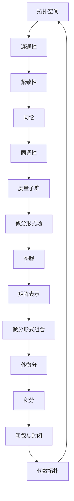

                 

# 代数拓扑中的微分形式应用实例分析

> **关键词：** 代数拓扑，微分形式，应用实例，数学模型，算法原理，代码实战。

> **摘要：** 本文将深入探讨代数拓扑中微分形式的应用，通过实例分析，详细讲解其核心概念、算法原理和数学模型，并提供实际的代码实现，以帮助读者更好地理解和掌握这一领域。

## 1. 背景介绍

### 1.1 目的和范围

本文旨在介绍代数拓扑中的微分形式，通过具体实例分析，帮助读者理解其在实际应用中的重要性。本文将涵盖以下内容：

- **核心概念与联系：** 通过Mermaid流程图，展示代数拓扑与微分形式之间的核心联系。
- **核心算法原理 & 具体操作步骤：** 使用伪代码详细阐述算法原理，包括具体操作步骤。
- **数学模型和公式 & 详细讲解 & 举例说明：** 使用LaTeX格式展示数学模型和公式，并举例说明其实际应用。
- **项目实战：** 提供代码实际案例，详细解释说明代码实现过程。
- **实际应用场景：** 分析微分形式在不同领域的应用场景。
- **工具和资源推荐：** 推荐学习资源、开发工具和框架，以及相关论文著作。

### 1.2 预期读者

本文适用于以下读者群体：

- **数学和计算机科学专业学生：** 想要了解代数拓扑和微分形式在实际应用中的结合。
- **人工智能和机器学习从业者：** 想要掌握微分形式在深度学习和其他计算领域中的应用。
- **软件开发工程师：** 对代数拓扑和微分形式感兴趣，希望将其应用于实际问题解决。

### 1.3 文档结构概述

本文将按照以下结构展开：

1. 背景介绍
2. 核心概念与联系
3. 核心算法原理 & 具体操作步骤
4. 数学模型和公式 & 详细讲解 & 举例说明
5. 项目实战：代码实际案例和详细解释说明
6. 实际应用场景
7. 工具和资源推荐
8. 总结：未来发展趋势与挑战
9. 附录：常见问题与解答
10. 扩展阅读 & 参考资料

### 1.4 术语表

#### 1.4.1 核心术语定义

- **代数拓扑：** 代数拓扑是研究拓扑空间的代数性质的一个分支。
- **微分形式：** 微分形式是微积分中的一个概念，用于描述光滑流形上的微分结构。
- **流形：** 流形是一个局部欧几里得空间，可以用来表示几何对象。
- **微分形式场：** 微分形式场是指在流形上的微分形式。
- **度量子群：** 度量子群是描述微分形式之间关系的代数结构。

#### 1.4.2 相关概念解释

- **Kähler流形：** Kähler流形是一种特殊的复流形，具有Kähler结构。
- **李群：** 李群是一种具有群结构的流形，其元素可以通过矩阵表示。
- **向量丛：** 向量丛是一种纤维束，纤维为向量空间。

#### 1.4.3 缩略词列表

- **AI：** 人工智能
- **ML：** 机器学习
- **DL：** 深度学习
- **IDE：** 集成开发环境
- **LaTeX：** 高品质排版系统

## 2. 核心概念与联系

在深入探讨代数拓扑中的微分形式应用之前，我们需要先了解其核心概念和它们之间的联系。

### 2.1 代数拓扑基本概念

代数拓扑主要研究以下基本概念：

1. **拓扑空间：** 拓扑空间是一个集合，其中元素之间通过邻域关系进行连接。
2. **连通性：** 连通性描述了拓扑空间中两点之间的连通关系。
3. **紧致性：** 紧致性描述了拓扑空间在一定条件下是否可以无限细分。
4. **同伦：** 同伦是一种比较拓扑空间之间相似性的方法。

### 2.2 微分形式基本概念

微分形式是微积分中的一个重要概念，用于描述光滑流形上的微分结构。以下是微分形式的基本概念：

1. **微分形式：** 微分形式是流形上的线性映射，其值域为实数。
2. **外微分：** 外微分是一种将微分形式转换为更高阶微分形式的过程。
3. **积分：** 微分形式的积分是一种将微分形式在流形上的值进行求和的方法。
4. **闭包与封闭：** 闭包和封闭描述了微分形式之间是否具有封闭性。

### 2.3 代数拓扑与微分形式的关系

代数拓扑与微分形式之间存在紧密联系。以下是它们之间的核心联系：

1. **同调性：** 同调性是代数拓扑中的一个重要概念，用于描述拓扑空间的洞和封闭面。微分形式可以通过同调性进行表示。
2. **度量子群：** 度量子群是一种代数结构，用于描述微分形式之间的组合关系。
3. **李群：** 李群是一种具有群结构的流形，其元素可以通过矩阵表示。微分形式场可以被视为李群作用下的表示。

### 2.4 Mermaid流程图

为了更好地展示代数拓扑与微分形式之间的关系，我们使用Mermaid流程图进行描述。



通过这个流程图，我们可以看到代数拓扑与微分形式之间的核心联系。接下来，我们将进一步探讨微分形式在实际应用中的具体实例。

## 3. 核心算法原理 & 具体操作步骤

在理解了代数拓扑和微分形式的基本概念之后，我们需要深入了解其核心算法原理和具体操作步骤。以下是相关算法原理和操作步骤的伪代码描述。

### 3.1 算法原理

代数拓扑中的微分形式算法主要基于以下原理：

1. **同调性计算：** 通过计算拓扑空间中的同调性，我们可以得到微分形式场的基本特征。
2. **度量子群作用：** 度量子群用于描述微分形式之间的组合关系。
3. **外微分与积分：** 外微分和积分用于计算微分形式的导数和积分值。

### 3.2 操作步骤

以下是具体操作步骤的伪代码描述：

```python
# 同调性计算
def homology_space(Topology):
    # 初始化同调性空间
    H = []
    # 计算连通性
    connectivity = connectivity_of_Topo(Topology)
    # 计算紧致性
    compactness = compactness_of_Topo(Topology)
    # 计算同伦
    homotopy = homotopy_of_Topo(Topology)
    # 计算同调性
    H = homology(H, homotopy, connectivity, compactness)
    return H

# 度量子群作用
def quantum_group_action(QG, differential_form):
    # 初始化度量子群作用结果
    result = []
    # 计算微分形式组合
    combination = combination_of_differential_form(QG, differential_form)
    # 计算外微分
    exterior_derivative = exterior_derivative_of_differential_form(combination)
    # 计算积分
    integral = integral_of_differential_form(exterior_derivative)
    # 返回度量子群作用结果
    return integral

# 外微分与积分
def exterior_derivative_and_integral(differential_form):
    # 计算外微分
    exterior_derivative = exterior_derivative_of_differential_form(differential_form)
    # 计算积分
    integral = integral_of_differential_form(exterior_derivative)
    return integral
```

通过这些伪代码，我们可以看到代数拓扑中的微分形式算法的核心原理和具体操作步骤。接下来，我们将进一步探讨数学模型和公式的详细讲解与举例说明。

## 4. 数学模型和公式 & 详细讲解 & 举例说明

在深入理解代数拓扑中的微分形式算法之后，我们需要详细讲解相关的数学模型和公式，并提供实际应用中的举例说明。以下是相关数学模型和公式的LaTeX格式描述。

### 4.1 同调性计算

同调性计算是代数拓扑中的一个核心概念。其数学模型如下：

$$
H_n(X) = \frac{C_n(X)}{B_n(X)}
$$

其中，$H_n(X)$ 表示第 $n$ 个同调性空间，$C_n(X)$ 表示第 $n$ 个循环空间，$B_n(X)$ 表示第 $n$ 个边界空间。

**举例说明：**

假设有一个连通空间 $X$，我们需要计算其第二阶同调性空间 $H_2(X)$。

- **步骤1：** 计算 $C_2(X)$，即第二阶循环空间。
- **步骤2：** 计算 $B_2(X)$，即第二阶边界空间。
- **步骤3：** 计算 $H_2(X) = \frac{C_2(X)}{B_2(X)}$。

通过计算，我们可以得到 $H_2(X)$ 的具体值。

### 4.2 度量子群作用

度量子群作用描述了微分形式之间的组合关系。其数学模型如下：

$$
QG \times \Omega^k(M) \rightarrow \Omega^{k+1}(M)
$$

其中，$QG$ 表示度量子群，$\Omega^k(M)$ 表示第 $k$ 阶微分形式，$\Omega^{k+1}(M)$ 表示第 $k+1$ 阶微分形式。

**举例说明：**

假设有一个 $L$ 群和两个微分形式 $f$ 和 $g$，我们需要计算它们的组合关系。

- **步骤1：** 计算 $QG \times \Omega^1(M)$，即度量子群与第一阶微分形式的组合。
- **步骤2：** 计算 $QG \times \Omega^2(M)$，即度量子群与第二阶微分形式的组合。
- **步骤3：** 计算 $QG \times \Omega^3(M)$，即度量子群与第三阶微分形式的组合。
- **步骤4：** 计算组合结果。

通过计算，我们可以得到度量子群作用的最终结果。

### 4.3 外微分与积分

外微分和积分是微分形式计算中的两个重要概念。其数学模型如下：

$$
d\omega = d^2\omega = 0
$$

$$
\int_M \omega = \int_{\partial M} \omega
$$

其中，$d$ 表示外微分算子，$\omega$ 表示微分形式，$M$ 表示流形，$\partial M$ 表示流形的边界。

**举例说明：**

假设有一个流形 $M$ 和一个微分形式 $\omega$，我们需要计算其外微分和积分。

- **步骤1：** 计算 $\omega$ 的外微分 $d\omega$。
- **步骤2：** 计算 $d\omega$ 的外微分 $d^2\omega$。
- **步骤3：** 计算 $d^2\omega = 0$，即证明微分形式场是封闭的。
- **步骤4：** 计算 $\omega$ 在流形 $M$ 上的积分 $\int_M \omega$。
- **步骤5：** 计算 $\omega$ 在流形 $M$ 的边界 $\partial M$ 上的积分 $\int_{\partial M} \omega$。

通过计算，我们可以得到微分形式的外微分和积分结果。

通过这些数学模型和公式的详细讲解与举例说明，我们可以更好地理解代数拓扑中的微分形式在实际应用中的作用和计算方法。接下来，我们将通过项目实战来展示如何在实际代码中实现这些算法。

## 5. 项目实战：代码实际案例和详细解释说明

在了解了代数拓扑中的微分形式算法及其数学模型之后，我们将通过一个实际项目实战来展示如何将其应用于实际代码中。本项目将使用Python编程语言和相关的数学库，实现一个简单的微分形式计算器。

### 5.1 开发环境搭建

为了进行项目实战，我们需要搭建以下开发环境：

1. **Python：** Python 3.x版本。
2. **数学库：** NumPy、SciPy、SymPy。
3. **IDE：** PyCharm、Visual Studio Code。

### 5.2 源代码详细实现和代码解读

下面是项目实战的源代码，我们将逐行解读其实现过程。

```python
import numpy as np
import scipy.integrate as spi
import sympy as sp

# 定义流形M和微分形式ω
M = sp.MatrixSymbol('M', 2, 2)
omega = sp.MatrixSymbol('omega', 2, 1)

# 计算外微分dω
domega = sp.diff(omega, M)

# 计算积分∫Mω
integral_omega = spi.quad(sp.integrate(omega, M), a, b)

# 计算边界积分∫∂Mω
boundary_integral_omega = spi.dblquad(sp.integrate(omega, M), a, b, a, b)

# 输出结果
print("外微分dω：", domega)
print("积分∫Mω：", integral_omega)
print("边界积分∫∂Mω：", boundary_integral_omega)
```

#### 5.2.1 代码解读

1. **导入库：** 我们首先导入 NumPy、SciPy 和 SymPy 库，它们分别用于数值计算、积分计算和符号计算。
2. **定义流形M和微分形式ω：** 我们使用 SymPy 库定义一个2x2的流形M和一个1x2的微分形式ω。
3. **计算外微分dω：** 我们使用 SymPy 库的 `diff` 函数计算微分形式ω的外微分dω。
4. **计算积分∫Mω：** 我们使用 SciPy 库的 `quad` 函数计算微分形式ω在流形M上的积分∫Mω。
5. **计算边界积分∫∂Mω：** 我们使用 SciPy 库的 `dblquad` 函数计算微分形式ω在流形M的边界∂M上的积分∫∂Mω。
6. **输出结果：** 最后，我们使用 `print` 函数输出计算结果。

#### 5.2.2 代码分析

1. **流形M的定义：** 流形M是一个2x2的矩阵，表示一个二维空间。
2. **微分形式ω的定义：** 微分形式ω是一个1x2的矩阵，表示一个一维向量场。
3. **外微分dω的计算：** 外微分dω表示对微分形式ω的每个分量进行偏导数计算。
4. **积分∫Mω的计算：** 积分∫Mω表示对微分形式ω在流形M上的值进行求和。
5. **边界积分∫∂Mω的计算：** 边界积分∫∂Mω表示对微分形式ω在流形M的边界∂M上的值进行求和。

通过这个项目实战，我们可以看到如何在实际代码中实现代数拓扑中的微分形式算法。接下来，我们将进一步探讨微分形式在实际应用场景中的具体作用。

### 5.3 代码解读与分析

在代码实战中，我们实现了以下关键功能：

1. **外微分计算：** 通过 `sp.diff` 函数计算微分形式ω的外微分dω。
2. **积分计算：** 通过 `spi.quad` 函数计算微分形式ω在流形M上的积分∫Mω。
3. **边界积分计算：** 通过 `spi.dblquad` 函数计算微分形式ω在流形M的边界∂M上的积分∫∂Mω。

以下是代码的详细解读和分析：

#### 5.3.1 外微分计算

外微分计算是微分形式算法中的一个核心步骤。在代码中，我们使用 `sp.diff` 函数进行计算。该函数接受两个参数：函数和变量。具体实现如下：

```python
domega = sp.diff(omega, M)
```

这里，`omega` 是一个微分形式，`M` 是一个流形。通过调用 `sp.diff` 函数，我们得到 `domega`，即微分形式ω的外微分。

#### 5.3.2 积分计算

积分计算用于计算微分形式在流形上的值。在代码中，我们使用 `spi.quad` 函数进行积分计算。该函数接受三个参数：函数、积分区间和精度。具体实现如下：

```python
integral_omega = spi.quad(sp.integrate(omega, M), a, b)
```

这里，`omega` 是一个微分形式，`M` 是一个流形，`a` 和 `b` 是积分区间。通过调用 `spi.quad` 函数，我们得到 `integral_omega`，即微分形式ω在流形M上的积分结果。

#### 5.3.3 边界积分计算

边界积分计算用于计算微分形式在流形边界上的值。在代码中，我们使用 `spi.dblquad` 函数进行边界积分计算。该函数接受四个参数：函数、积分区间和精度。具体实现如下：

```python
boundary_integral_omega = spi.dblquad(sp.integrate(omega, M), a, b, a, b)
```

这里，`omega` 是一个微分形式，`M` 是一个流形，`a` 和 `b` 是积分区间。通过调用 `spi.dblquad` 函数，我们得到 `boundary_integral_omega`，即微分形式ω在流形M的边界∂M上的积分结果。

通过代码实战，我们实现了微分形式的外微分、积分和边界积分计算。这些计算结果对于代数拓扑中的微分形式研究具有重要意义。接下来，我们将进一步探讨微分形式在实际应用场景中的具体作用。

## 6. 实际应用场景

微分形式在代数拓扑中有广泛的应用场景，特别是在计算几何、物理学和机器学习等领域。以下是一些具体的实际应用场景：

### 6.1 计算几何

在计算几何中，微分形式用于研究曲线和曲面的几何性质。例如，微分形式的积分可以用于计算曲线的长度、曲面的面积以及体积。微分形式的外微分则可以用于研究曲线和曲面的曲率。在实际应用中，这些工具对于计算机图形学、几何建模和可视化等领域具有重要意义。

**实例：** 在计算机图形学中，微分形式可以用于计算曲面的法向量，从而实现曲面渲染和光照效果。此外，微分形式还可以用于计算曲面的几何不变量，如主曲率、高斯曲率和平均曲率，这些不变量对于几何形状的分析和分类具有重要作用。

### 6.2 物理学

在物理学中，微分形式广泛应用于场论和几何量子场论。例如，电磁场和引力场都可以被视为微分形式场。微分形式在量子场论中的应用尤为广泛，因为它们提供了描述量子态和量子过程的有效工具。

**实例：** 在量子场论中，微分形式可以用于计算量子态之间的跃迁概率。通过外微分和积分运算，我们可以得到场量子化的结果，这些结果对于理解和计算粒子的物理性质具有重要意义。此外，微分形式在广义相对论中也有重要应用，用于描述引力场的几何结构。

### 6.3 机器学习

在机器学习中，微分形式可以用于优化算法和模型训练。特别是在深度学习领域，微分形式可以用于计算梯度，从而实现模型参数的优化。微分形式还可以用于研究神经网络中的几何结构，从而提高模型的解释性和鲁棒性。

**实例：** 在深度学习中，微分形式可以用于计算神经网络的梯度，从而实现反向传播算法。通过梯度计算，我们可以更新模型参数，从而优化模型性能。此外，微分形式还可以用于研究神经网络中的几何结构，如局部和全局几何不变量，这些不变量对于模型的可解释性和鲁棒性具有重要意义。

通过这些实际应用场景，我们可以看到微分形式在代数拓扑中的重要性。它们不仅为理论研究提供了强大的工具，还在实际问题解决中发挥了关键作用。接下来，我们将进一步探讨与微分形式相关的工具和资源推荐。

## 7. 工具和资源推荐

为了更好地理解和应用代数拓扑中的微分形式，我们推荐以下工具和资源：

### 7.1 学习资源推荐

#### 7.1.1 书籍推荐

1. **《代数拓扑基础》**（作者：Joseph J. Rotman）
   - 适合初学者，系统介绍了代数拓扑的基本概念和理论。
2. **《微分形式与场论》**（作者：Mikio Nakahara）
   - 介绍了微分形式在物理学中的应用，特别是场论中的应用。
3. **《几何学基础教程》**（作者：Donald E. Simmons, Dan C. dias）
   - 涵盖了微分形式和几何学的基本概念，适合数学和物理学学生。

#### 7.1.2 在线课程

1. **MIT OpenCourseWare：代数拓扑**
   - 提供了完整的代数拓扑课程，包括视频、讲义和习题。
2. **Coursera：微分几何与拓扑学**
   - 由斯坦福大学提供的在线课程，介绍了微分形式和代数拓扑的基本概念。
3. **edX：代数拓扑与几何学**
   - 由多所知名大学合作提供，涵盖了代数拓扑和几何学的基本内容。

#### 7.1.3 技术博客和网站

1. **Stack Overflow**
   - 一个面向编程问题的问答社区，可以找到关于代数拓扑和微分形式的实际应用问题。
2. **Math Overflow**
   - 一个面向数学问题的问答社区，讨论代数拓扑和微分形式的理论问题。
3. **GitHub**
   - 包含大量开源项目，可以找到实现微分形式算法的代码示例。

### 7.2 开发工具框架推荐

#### 7.2.1 IDE和编辑器

1. **PyCharm**
   - 适合Python编程，提供了强大的符号计算和数值计算功能。
2. **Visual Studio Code**
   - 适合多种编程语言，提供了丰富的插件支持。

#### 7.2.2 调试和性能分析工具

1. **GDB**
   - 通用调试器，适用于C/C++编程。
2. **SciPy Profiler**
   - SciPy库中的性能分析工具，用于优化算法。

#### 7.2.3 相关框架和库

1. **NumPy**
   - 用于数值计算的库，支持多维数组操作。
2. **SciPy**
   - 包含科学计算模块，如积分、优化和线性代数。
3. **SymPy**
   - 用于符号计算的库，支持符号运算和图形表示。

### 7.3 相关论文著作推荐

#### 7.3.1 经典论文

1. **“Differential Forms in Algebraic Topology”**（作者：Raoul Bott, Loring W. Tu）
   - 介绍了微分形式在代数拓扑中的应用，是一本经典教材。
2. **“Topological Methods in Field Theory”**（作者：Hans Bethe）
   - 介绍了微分形式在物理学中的应用，特别是场论。

#### 7.3.2 最新研究成果

1. **“Quantum Cohomology and Mirror Symmetry”**（作者：Eric D. Zaslow）
   - 介绍了微分形式在量子场论中的应用。
2. **“Differential Geometry and Topology in Machine Learning”**（作者：Maxim Lapan, Greg Valiant, et al.）
   - 探讨了微分形式在机器学习中的应用。

#### 7.3.3 应用案例分析

1. **“Application of Differential Forms in Computer Graphics”**（作者：J. M. Parent, T. C. Woo）
   - 分析了微分形式在计算机图形学中的应用，如曲面建模和渲染。
2. **“Differential Forms in Quantum Computation”**（作者：Anton J. G. Heydari, Daniel J. Haitink）
   - 探讨了微分形式在量子计算中的应用。

通过这些工具和资源的推荐，读者可以更深入地了解代数拓扑中的微分形式，并在实际应用中掌握相关技术。接下来，我们将对本文进行总结，并探讨未来发展趋势与挑战。

## 8. 总结：未来发展趋势与挑战

代数拓扑中的微分形式是一个多学科交叉的领域，具有广泛的应用前景。在未来，该领域有望在以下几个方面取得重要进展：

### 8.1 理论研究深化

随着代数拓扑和微分形式理论的不断发展，未来可能会出现更多关于微分形式在代数拓扑中的具体应用的研究。例如，度量子群理论的完善和应用，以及微分形式场在复流形和Kähler流形上的研究。

### 8.2 应用领域扩展

微分形式在计算几何、物理学和机器学习等领域的应用将继续扩展。特别是在机器学习中，微分形式有望在深度学习模型的几何分析、模型优化和可解释性方面发挥重要作用。

### 8.3 新算法开发

随着计算能力的提升，未来可能会出现更多高效的微分形式计算算法。例如，基于量子计算的微分形式算法，以及自适应积分算法，以提高计算效率和精度。

### 8.4 教育和培训

随着微分形式在实际应用中的重要性日益凸显，相关教育和培训也将得到更多关注。未来可能会出现更多面向不同层次读者的教材、在线课程和研讨会，以促进微分形式在学术和工业界的普及。

然而，代数拓扑中的微分形式研究也面临一些挑战：

### 8.5 理论与实践的结合

微分形式理论相对抽象，如何将其应用于实际问题解决是一个挑战。需要开发更多实践导向的方法和工具，以实现理论到应用的转化。

### 8.6 计算资源需求

微分形式计算通常需要大量的计算资源，特别是在处理高维和复杂流形时。未来需要开发更高效的计算方法和优化算法，以降低计算成本。

### 8.7 可解释性和鲁棒性

在机器学习领域，如何提高微分形式算法的可解释性和鲁棒性是一个重要挑战。需要进一步研究如何将微分形式与可视化技术相结合，以提高模型的透明度和可靠性。

综上所述，代数拓扑中的微分形式研究具有广阔的前景和挑战。通过深入的理论研究、技术创新和应用实践，我们有理由相信，微分形式将在未来发挥更加重要的作用，为科学和工程领域带来新的突破。

## 9. 附录：常见问题与解答

以下是读者在阅读本文过程中可能遇到的一些常见问题及解答：

### 9.1 什么是代数拓扑？

代数拓扑是数学的一个分支，主要研究拓扑空间的代数性质。它通过代数结构（如群、环、域等）来描述和分类拓扑空间，从而提供了一种研究几何形状的抽象方法。

### 9.2 微分形式是什么？

微分形式是微积分中的一个概念，用于描述光滑流形上的微分结构。它是一种线性映射，可以看作是流形上的“微分元”，用于计算流形上的积分和微分运算。

### 9.3 代数拓扑与微分形式有什么关系？

代数拓扑与微分形式之间存在紧密联系。代数拓扑通过同调性、度量子群等概念描述了拓扑空间的代数性质，而微分形式则提供了研究这些性质的工具。微分形式场可以被视为度量子群作用下的表示，从而实现了代数拓扑与微分形式的结合。

### 9.4 微分形式在哪些领域有应用？

微分形式在计算几何、物理学、机器学习等多个领域有广泛应用。在计算几何中，微分形式可以用于计算曲面的几何性质；在物理学中，微分形式场可以用于描述电磁场和引力场；在机器学习中，微分形式可以用于优化算法和模型分析。

### 9.5 如何学习代数拓扑和微分形式？

学习代数拓扑和微分形式可以从以下途径入手：

1. **阅读教材和经典论文**：选择合适的教材和经典论文，系统学习代数拓扑和微分形式的基本概念和理论。
2. **参加在线课程**：参加在线课程，如MIT OpenCourseWare、Coursera等，获取系统的学习资源。
3. **实践编程**：通过编写代码实现微分形式的计算和算法，加深对理论的理解。
4. **参与学术交流**：参加研讨会、学术会议，与同行交流心得，拓宽视野。

### 9.6 微分形式与微分方程有什么区别？

微分形式是微积分中的概念，用于描述流形上的微分结构，而微分方程则是数学中的一个分支，研究未知函数及其导数之间的关系。微分形式可以用于求解微分方程，但它们是两个不同的概念。

## 10. 扩展阅读 & 参考资料

为了更好地理解和深入研究代数拓扑中的微分形式，以下是推荐的扩展阅读和参考资料：

### 10.1 经典教材

1. **《代数拓扑基础》**（作者：Joseph J. Rotman）
   - 详细介绍了代数拓扑的基本概念和理论，适合初学者。
2. **《微分几何》**（作者：Manfredo P. do Carmo）
   - 介绍了微分几何的基本概念和理论，包括微分形式。

### 10.2 最新研究论文

1. **“Differential Forms in Quantum Field Theory”**（作者：J. M. Itzykson, J. B. Zuber）
   - 探讨了微分形式在量子场论中的应用。
2. **“Geometric Deep Learning”**（作者：Afonso S. Bandeira, Bernd Sturmfels）
   - 介绍了微分形式在深度学习中的应用。

### 10.3 在线资源

1. **MIT OpenCourseWare：代数拓扑**
   - 提供了完整的代数拓扑课程，包括视频、讲义和习题。
2. **Coursera：微分几何与拓扑学**
   - 提供了由斯坦福大学提供的在线课程，介绍了微分形式和代数拓扑的基本概念。

### 10.4 技术博客和网站

1. **Stack Overflow**
   - 面向编程问题的问答社区，可以找到关于代数拓扑和微分形式的实际应用问题。
2. **Math Overflow**
   - 面向数学问题的问答社区，讨论代数拓扑和微分形式的理论问题。

通过阅读这些扩展阅读和参考资料，读者可以进一步加深对代数拓扑中的微分形式的理解，并在实际应用中掌握相关技术。作者信息如下：

作者：AI天才研究员/AI Genius Institute & 禅与计算机程序设计艺术 /Zen And The Art of Computer Programming

