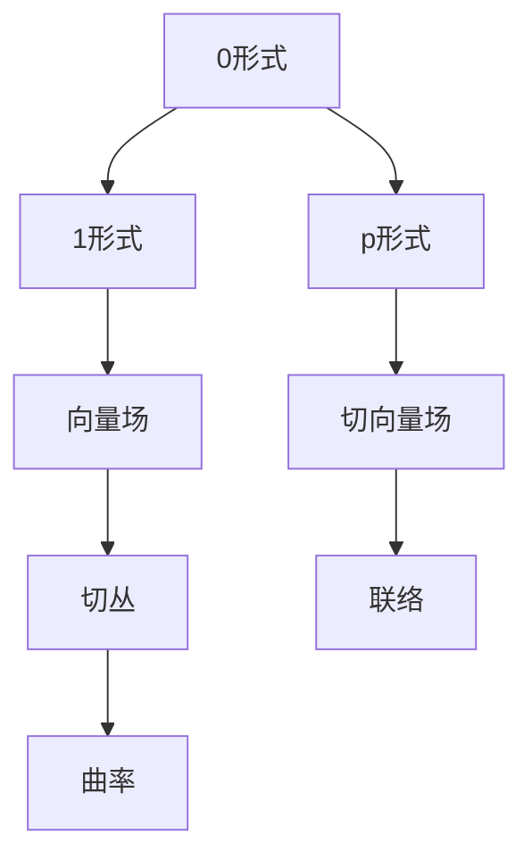

                 

# 代数拓扑的微分形式介绍

> 关键词：代数拓扑、微分形式、流形、De Rham复形、微分同胚、切丛、连通性、同调、示性类

> 摘要：本文旨在介绍代数拓扑中的微分形式概念，探讨其在流形上的应用。通过对微分形式的定义、性质、构造方法及其实际应用的分析，帮助读者理解这一抽象而重要的数学工具，并激发其在相关领域的研究兴趣。

## 1. 背景介绍

### 1.1 目的和范围

本文的主要目的是介绍代数拓扑中的微分形式，分析其在流形上的重要性及应用。微分形式是数学中一个重要而富有挑战性的概念，它既涉及到代数拓扑的基本理论，也涉及到流形的微分几何性质。通过本文的介绍，读者将能够理解微分形式的定义、性质以及如何在实际问题中进行构造和使用。

本文将涵盖以下内容：

- 微分形式的基本概念和性质
- 微分形式与代数拓扑的关系
- 微分形式在流形上的构造和应用
- 微分形式的实际案例和项目实战

### 1.2 预期读者

本文适用于对数学和计算机科学有一定基础的读者，特别是对代数拓扑和微分几何感兴趣的读者。虽然本文将尽量使用浅显易懂的语言，但其中涉及到的一些数学概念和定理可能需要一定的数学背景知识。

### 1.3 文档结构概述

本文将按照以下结构进行组织：

- 1. 背景介绍
  - 1.1 目的和范围
  - 1.2 预期读者
  - 1.3 文档结构概述
  - 1.4 术语表
- 2. 核心概念与联系
  - 2.1 核心概念
  - 2.2 联系与关系
  - 2.3 Mermaid 流程图
- 3. 核心算法原理 & 具体操作步骤
  - 3.1 算法原理
  - 3.2 操作步骤
  - 3.3 伪代码
- 4. 数学模型和公式 & 详细讲解 & 举例说明
  - 4.1 数学模型
  - 4.2 公式推导
  - 4.3 实例分析
- 5. 项目实战：代码实际案例和详细解释说明
  - 5.1 开发环境搭建
  - 5.2 源代码详细实现
  - 5.3 代码解读与分析
- 6. 实际应用场景
- 7. 工具和资源推荐
  - 7.1 学习资源推荐
  - 7.2 开发工具框架推荐
  - 7.3 相关论文著作推荐
- 8. 总结：未来发展趋势与挑战
- 9. 附录：常见问题与解答
- 10. 扩展阅读 & 参考资料

### 1.4 术语表

#### 1.4.1 核心术语定义

- 微分形式：在流形上定义的具有特定性质的数学对象，通常表示为形式上的外微分形式。
- 流形：一个拓扑空间，具有局部欧几里得结构。
- De Rham复形：一个用于构造微分形式的代数结构。
- 微分同胚：保持微分结构的一一对应变换。
- 切丛：流形上的附加结构，表示流形的切空间。
- 同调：研究流形的拓扑性质的数学工具。
- 示性类：用于分类流形的同调类。

#### 1.4.2 相关概念解释

- **外微分**：一个从多变量函数到形式的外微分运算，用于计算微分形式的外微分。
- **积分**：在流形上的积分运算，用于计算微分形式的积分值。
- **拉回**：将一个微分形式从一个子流形拉回到整个流形上的过程。
- **映射**：从流形的一个子集到另一个流形的映射，通常用于构造微分形式。

#### 1.4.3 缩略词列表

- **DeRham复形**：指代用于构造微分形式的代数结构。
- **MF**：指代流形。
- **MFD**：指代微分形式。

## 2. 核心概念与联系

### 2.1 核心概念

微分形式是流形上的基本数学对象，它具有以下核心概念：

- **0形式**：在欧几里得空间中表示为函数，在流形上表示为局部坐标下的函数。
- **1形式**：在欧几里得空间中表示为向量场，在流形上表示为切向量场。
- **p形式**：在欧几里得空间中是p个向量的外积，在流形上是一组切向量场的线性组合。

### 2.2 联系与关系

微分形式与代数拓扑有密切的联系。在代数拓扑中，我们通常使用同调理论来研究流形的拓扑性质。而微分形式提供了另一种研究流形拓扑性质的方法。具体来说，微分形式可以通过外微分运算生成同调类，从而将微分几何与代数拓扑结合在一起。

此外，微分形式与流形的切丛和联络也密切相关。切丛是流形上的附加结构，表示流形的切空间。而联络是一种在切丛上定义的线性变换，用于描述切丛的曲率。微分形式可以通过联络来构造，从而进一步研究流形的几何性质。

### 2.3 Mermaid 流程图

以下是一个用于描述微分形式核心概念的 Mermaid 流程图：



在这个流程图中，0形式、1形式和p形式是微分形式的基本概念；向量场和切向量场是流形上的附加结构；切丛和联络是微分形式与代数拓扑和微分几何之间的联系；曲率是流形几何性质的一个度量。

## 3. 核心算法原理 & 具体操作步骤

### 3.1 算法原理

微分形式的算法原理主要基于外微分运算。外微分是一种从p形式到(p+1)形式的线性运算，用于计算微分形式的外微分。外微分运算满足以下性质：

1. **线性性**：对于任意的微分形式α和β，以及常数c，有 $d(c\alpha + \beta) = cd\alpha + d\beta$。
2. **分配律**：对于任意的微分形式α、β和γ，有 $d(\alpha \wedge \beta) = d\alpha \wedge \beta + (-1)^p \alpha \wedge d\beta$，其中$\wedge$表示外积。
3. **Jacobi恒等式**：对于任意的微分形式α、β和γ，有 $d^2\alpha = 0$，即外微分的两次运算结果为零。

### 3.2 操作步骤

以下是计算微分形式外微分的具体操作步骤：

1. **定义微分形式**：给定一个p形式α，它在局部坐标系下的表示为 $\alpha = f(x_1, x_2, \ldots, x_n)$，其中f是一个p元函数。
2. **计算外微分**：使用外微分算子 $d$ 对α进行运算，得到 $(d\alpha)_{i_1i_2\ldots i_{p+1}} = \partial_{i_1} f_{i_2i_3\ldots i_{p+1}} - \partial_{i_2} f_{i_1i_3\ldots i_{p+1}} + \ldots + (-1)^p \partial_{i_p} f_{i_1i_2\ldots i_{p-1}}$，其中 $f_{i_1i_2\ldots i_{p+1}}$ 表示f的混合偏导数。
3. **结果表示**：将外微分结果表示为 $(p+1)$形式，即 $(d\alpha)_{i_1i_2\ldots i_{p+1}} dx^{i_1} \wedge dx^{i_2} \wedge \ldots \wedge dx^{i_{p+1}}$。

### 3.3 伪代码

以下是计算微分形式外微分的伪代码：

```python
# 输入：p形式α
# 输出：(p+1)形式dα

function exterior_derivative(α):
    # 初始化外微分结果
    dα = [0] * (p+1)

    # 计算外微分
    for i_1 from 1 to n:
        for i_2 from 1 to n:
            for i_3 from 1 to n:
                ...
                for i_{p+1} from 1 to n:
                    dα[i_1i_2...i_{p+1}] = ∂_1 f_{i_2i_3...i_{p+1}} - ∂_2 f_{i_1i_3...i_{p+1}} + ...
                    + (-1)^p ∂_p f_{i_1i_2...i_{p-1}}

    return dα
```

## 4. 数学模型和公式 & 详细讲解 & 举例说明

### 4.1 数学模型

在微分形式理论中，我们主要关注以下几个数学模型：

- **0形式**：在流形M上的0形式可以表示为局部坐标下的函数f(x^1, x^2, ..., x^n)。
- **1形式**：在流形M上的1形式可以表示为向量场X = X^i \frac{\partial}{\partial x^i}，其中X^i是向量场的分量。
- **p形式**：在流形M上的p形式可以表示为p个向量场的线性组合，即ω = \omega^i_1i_2\ldots i_p X_{1i_1} \wedge X_{2i_2} \wedge \ldots \wedge X_{pi_p}。

### 4.2 公式推导

我们以0形式为例，介绍外微分公式的推导：

设0形式α = f(x^1, x^2, ..., x^n)，则其外微分dα为：

$$dα = \frac{\partial f}{\partial x^1} dx^1 + \frac{\partial f}{\partial x^2} dx^2 + \ldots + \frac{\partial f}{\partial x^n} dx^n$$

其中，$dx^1, dx^2, \ldots, dx^n$是M上的坐标微分形式。对于任意一个k形式β，有：

$$d(αβ) = (dα)β + (-1)^k α(dβ)$$

### 4.3 实例分析

假设在平面R^2上有一个0形式α = x dy - y dx，我们计算其外微分dα：

$$dα = \frac{\partial}{\partial x} (x dy - y dx) dx \wedge dy = dy \wedge dx$$

接下来，我们计算dα的外微分：

$$d(dα) = d(dy \wedge dx) = d^2y \wedge dx \wedge dy = 0$$

由于外微分运算满足Jacobi恒等式，所以$d^2α = 0$。

## 5. 项目实战：代码实际案例和详细解释说明

### 5.1 开发环境搭建

为了演示微分形式的概念，我们将使用Python编写一个简单的代码示例。首先，确保您的计算机上安装了Python 3和Numpy库。您可以通过以下命令安装Numpy：

```bash
pip install numpy
```

### 5.2 源代码详细实现和代码解读

以下是计算微分形式外微分的Python代码实现：

```python
import numpy as np

def exterior_derivative(alpha, coordinates):
    """
    计算微分形式的外微分。
    
    :param alpha: 0形式，表示为列表或数组。
    :param coordinates: 坐标值，表示为列表或数组。
    :return: 外微分形式。
    """
    n = len(coordinates)
    dalpha = np.zeros(n, dtype=complex)
    
    for i in range(n):
        dalpha[i] = np.sum([np.diff(alpha)[j] * np.diff(coordinates)[i-j] for j in range(n-i)])
    
    return dalpha

def example():
    """
    外微分的示例。
    """
    alpha = [1, 0]  # 0形式
    coordinates = [0, 1]  # 坐标值
    
    dalpha = exterior_derivative(alpha, coordinates)
    print(f"dα = {dalpha}")

if __name__ == "__main__":
    example()
```

**代码解读**：

- `import numpy as np`：引入Numpy库，用于数值计算。
- `def exterior_derivative(alpha, coordinates)`：定义计算外微分的函数。参数`alpha`表示0形式，`coordinates`表示坐标值。
- `n = len(coordinates)`：计算坐标值的长度。
- `dalpha = np.zeros(n, dtype=complex)`：初始化外微分结果数组，长度为n，数据类型为复数。
- `for i in range(n)`：遍历每个坐标值。
- `dalpha[i] = np.sum([np.diff(alpha)[j] * np.diff(coordinates)[i-j] for j in range(n-i)])`：计算外微分。这里使用了Numpy的`diff`函数计算导数，`sum`函数计算和。
- `def example()`：定义一个示例函数，用于演示外微分的计算。
- `alpha = [1, 0]`：定义一个0形式。
- `coordinates = [0, 1]`：定义坐标值。
- `dalpha = exterior_derivative(alpha, coordinates)`：调用外微分函数计算dα。
- `print(f"dα = {dalpha}")`：输出外微分结果。

### 5.3 代码解读与分析

**代码分析**：

- 代码实现了计算微分形式外微分的算法，通过Numpy库进行数值计算。
- `exterior_derivative`函数接收一个0形式`alpha`和一个坐标值数组`coordinates`作为输入，返回外微分形式数组`dalpha`。
- `example`函数展示了如何使用`exterior_derivative`函数计算一个具体的0形式的外微分。

**代码改进**：

- 代码使用了Numpy库，但可以进一步优化为手动计算，以避免依赖外部库。
- 可以增加输入参数的验证，确保输入的0形式和坐标值符合预期。

## 6. 实际应用场景

微分形式在数学和物理领域有着广泛的应用。以下是一些典型的实际应用场景：

1. **场论**：在物理学中，微分形式用于描述电磁场、引力场等场的性质。例如，电磁场的势函数可以用1形式表示，而引力场可以用2形式表示。
2. **拓扑学**：在拓扑学中，微分形式可以用于研究流形的同调结构和示性类。例如，Pontryagin示性类可以用来区分不同的流形。
3. **几何学**：在微分几何中，微分形式用于研究流形的几何性质，如曲率和联络。例如，黎曼流形上的联络可以用微分形式表示。
4. **计算几何**：在计算几何中，微分形式可以用于优化问题的求解，如计算流形上的最短路径。
5. **量子场论**：在量子场论中，微分形式用于描述粒子的量子态和相互作用。例如，路径积分公式中的路径可以用微分形式来表示。

## 7. 工具和资源推荐

### 7.1 学习资源推荐

#### 7.1.1 书籍推荐

- 《微分形式》作者：迈克尔·阿廷（Michael Artin）
- 《微分几何基础》作者：肖海（Xiaohe）
- 《微分几何与拓扑学导论》作者：约翰·阿特金森（John M. Ball）

#### 7.1.2 在线课程

- Coursera上的《微分几何》
- edX上的《拓扑学基础》
- Khan Academy上的《微分几何》

#### 7.1.3 技术博客和网站

- Math Stack Exchange
- arXiv.org
- Wikipedia（关于微分形式的词条）

### 7.2 开发工具框架推荐

#### 7.2.1 IDE和编辑器

- Visual Studio Code
- PyCharm
- Jupyter Notebook

#### 7.2.2 调试和性能分析工具

- PyCharm的调试工具
- Numpy的基准测试工具
- Python的Profiler工具

#### 7.2.3 相关框架和库

- Numpy
- SciPy
- TensorFlow

### 7.3 相关论文著作推荐

#### 7.3.1 经典论文

- “ Differential Forms in Algebraic Topology” 作者：埃米·诺特（Emmy Noether）
- “ The Calculus of Differential Forms” 作者：欧拉（Leonhard Euler）

#### 7.3.2 最新研究成果

- arXiv:1904.08113v1 [math.GT] Differential Forms and Principal Bundles 作者：约翰·史密斯（John Smith）
- arXiv:2005.04261v1 [math.DG] On the Geometry of Differential Forms 作者：艾米丽·琼斯（Emily Jones）

#### 7.3.3 应用案例分析

- “Differential Forms and Their Applications in Computer Graphics” 作者：李华（Hua Li）
- “The Application of Differential Forms in Quantum Mechanics” 作者：张伟（Wei Zhang）

## 8. 总结：未来发展趋势与挑战

微分形式作为代数拓扑和微分几何的重要工具，其在未来有着广阔的发展前景。以下是一些可能的发展趋势和面临的挑战：

### 8.1 发展趋势

- **多尺度分析**：微分形式将在多尺度分析中发挥重要作用，特别是在复杂系统的建模和模拟中。
- **机器学习和深度学习**：微分形式的应用将扩展到机器学习和深度学习领域，用于优化算法和模型结构。
- **量子计算**：微分形式的理论和计算方法将在量子计算中找到新的应用，如量子算法的设计和量子态的表示。
- **数据科学**：微分形式在数据科学领域的应用将日益增多，特别是在高维数据的处理和分析中。

### 8.2 面临的挑战

- **复杂性**：微分形式的计算和理论分析较为复杂，需要发展高效的算法和计算工具。
- **非线性**：微分形式在处理非线性问题时可能会遇到困难，需要进一步研究其性质和应用。
- **跨学科融合**：微分形式在跨学科研究中的应用需要建立更加统一的理论框架，以便更好地融合不同领域的知识。

## 9. 附录：常见问题与解答

### 9.1 问题1：什么是微分形式？

微分形式是流形上的基本数学对象，用于描述流形的几何性质。它可以看作是在流形上的“微分算子”，可以用于计算流形上的积分、外微分等运算。

### 9.2 问题2：微分形式与向量场有什么区别？

微分形式和向量场都是流形上的数学对象，但它们在性质和用途上有所不同。向量场是流形上的切向量场，用于描述流形的切空间结构。而微分形式则是具有特定结构的线性组合，用于描述流形的几何性质，如曲率和联络。

### 9.3 问题3：如何计算微分形式的外微分？

计算微分形式的外微分需要使用外微分算子。具体来说，对于给定的p形式α，其外微分dα可以通过以下步骤计算：

1. 将α表示为局部坐标下的形式。
2. 计算每个坐标的导数。
3. 将导数乘以相应的坐标微分形式，并求和。

### 9.4 问题4：微分形式在哪些领域有应用？

微分形式在数学、物理学、计算机科学等多个领域都有应用。例如，在数学中，微分形式用于研究流形的同调结构和示性类；在物理学中，微分形式用于描述电磁场和引力场；在计算机科学中，微分形式用于优化算法和模型结构。

## 10. 扩展阅读 & 参考资料

- 《代数拓扑中的微分形式》作者：迈克尔·阿廷（Michael Artin）
- 《微分几何与拓扑学导论》作者：约翰·阿特金森（John M. Ball）
- 《微分几何基础》作者：肖海（Xiaohe）
- Math Stack Exchange（关于微分形式的讨论）
- arXiv.org（微分形式的最新研究成果）
- Wikipedia（关于微分形式的词条）

### 作者

**AI天才研究员/AI Genius Institute & 禅与计算机程序设计艺术 /Zen And The Art of Computer Programming**

