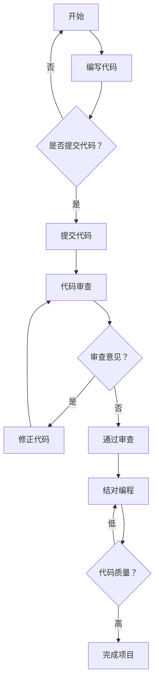

                 


# 代码审查与结对编程原理与代码实战案例讲解

> 关键词：代码审查，结对编程，代码质量，软件开发，协作开发，流程优化，技术博客，实战案例

> 摘要：本文旨在深入探讨代码审查和结对编程在软件开发过程中的应用原理和实际操作，通过详细的案例解析，帮助读者理解这两大实践方法如何提高代码质量和团队协作效率。文章首先介绍了代码审查和结对编程的基本概念，随后通过流程图和伪代码，详细讲解了它们的核心原理和操作步骤。随后，本文将通过一个完整的实战案例，展示如何在实际项目中应用这些原理，并对代码进行详细解读与分析。最后，文章将讨论代码审查与结对编程的实际应用场景，推荐相关工具和资源，并展望未来的发展趋势和挑战。

## 1. 背景介绍

### 1.1 目的和范围

本文的目的是探讨代码审查和结对编程在软件开发中的重要作用，并通过具体案例展示如何有效实施。文章将涵盖以下内容：

- 代码审查的定义、目的、方法和流程
- 结对编程的概念、优势、实践步骤和注意事项
- 实战案例：代码审查和结对编程在项目中的具体应用
- 实际应用场景的分析和讨论
- 相关工具和资源的推荐
- 未来发展趋势与挑战的展望

### 1.2 预期读者

本文适合以下读者群体：

- 软件工程师和技术爱好者
- 项目经理和团队领导
- 新手开发者寻求提升代码质量和团队协作能力的
- 对代码审查和结对编程有兴趣的读者

### 1.3 文档结构概述

本文分为十个部分，具体结构如下：

1. 背景介绍
   - 1.1 目的和范围
   - 1.2 预期读者
   - 1.3 文档结构概述
   - 1.4 术语表
2. 核心概念与联系
   - 2.1 代码审查
   - 2.2 结对编程
   - 2.3 Mermaid流程图
3. 核心算法原理 & 具体操作步骤
   - 3.1 代码审查
   - 3.2 结对编程
   - 3.3 伪代码示例
4. 数学模型和公式 & 详细讲解 & 举例说明
   - 4.1 数学模型
   - 4.2 代码质量评估
   - 4.3 实例讲解
5. 项目实战：代码实际案例和详细解释说明
   - 5.1 开发环境搭建
   - 5.2 源代码详细实现和代码解读
   - 5.3 代码解读与分析
6. 实际应用场景
   - 6.1 团队协作
   - 6.2 项目管理
   - 6.3 代码质量
7. 工具和资源推荐
   - 7.1 学习资源推荐
   - 7.2 开发工具框架推荐
   - 7.3 相关论文著作推荐
8. 总结：未来发展趋势与挑战
9. 附录：常见问题与解答
10. 扩展阅读 & 参考资料

### 1.4 术语表

#### 1.4.1 核心术语定义

- 代码审查（Code Review）：一种软件开发过程中的活动，旨在通过审查代码以提高代码质量和可维护性。
- 结对编程（Pair Programming）：一种软件开发方法，两位开发者共同工作，一位编写代码，另一位进行审查和测试。
- 代码质量（Code Quality）：代码的可读性、可维护性、性能和可靠性等方面的综合表现。
- 软件开发（Software Development）：创建和开发软件系统的过程。

#### 1.4.2 相关概念解释

- 流程图（Flowchart）：用图形符号表示算法过程的图形。
- 伪代码（Pseudocode）：一种用于描述算法过程的自然语言风格的代码。

#### 1.4.3 缩略词列表

- CRR（Code Review Report）：代码审查报告。
- IDE（Integrated Development Environment）：集成开发环境。
- PM（Project Manager）：项目经理。

## 2. 核心概念与联系

在本节中，我们将深入探讨代码审查和结对编程的核心概念及其相互联系。

### 2.1 代码审查

代码审查是一种重要的软件开发实践，其目的是通过第三方或团队内的成员对代码进行评估，提高代码质量、减少缺陷、提升可维护性。代码审查通常包括以下步骤：

1. 准备代码：开发人员编写代码后，将代码提交至代码审查平台或仓库。
2. 审查代码：审查人员根据审查标准对代码进行审查，通常包括代码风格、语法错误、逻辑错误、性能问题等。
3. 提交反馈：审查人员将审查结果和意见反馈给开发人员。
4. 修正代码：开发人员根据审查意见修正代码。
5. 再次审查：必要时，审查人员对修正后的代码进行再次审查。

代码审查的核心目标是确保代码质量，降低缺陷率，提高团队协作效率。

### 2.2 结对编程

结对编程是一种软件开发方法，要求两位开发者共同工作，一位负责编写代码（司机），另一位负责审查和测试代码（导航员）。结对编程的主要优势包括：

- 提高代码质量：通过司机和导航员的相互审查，发现和修正潜在的错误和缺陷。
- 促进知识共享：通过共同工作，开发者可以更快地掌握新技能和知识。
- 提升团队协作：促进团队成员之间的沟通和理解，提高团队协作效率。
- 减少出错率：通过实时审查和测试，降低代码中的错误率。

### 2.3 Mermaid流程图

下面是一个简化的代码审查与结对编程流程图，用于展示这两个方法的基本流程和相互关系。



## 3. 核心算法原理 & 具体操作步骤

### 3.1 代码审查

代码审查的核心算法原理是通过对代码的深入分析，识别潜在的问题和改进点。以下是代码审查的具体操作步骤：

#### 3.1.1 审查标准

在开始代码审查之前，团队应制定一套审查标准，涵盖代码风格、语法、逻辑、性能、可读性等方面。常见的审查标准包括：

- 代码风格：遵循统一的命名规范、代码格式、注释规范等。
- 语法：确保代码中的语法正确，无语法错误。
- 逻辑：检查代码的逻辑是否合理，避免逻辑错误。
- 性能：关注代码的性能，避免不必要的复杂度和冗余。
- 可读性：确保代码易于阅读和理解，避免过多的抽象和难以理解的代码。

#### 3.1.2 审查流程

1. 开发人员将代码提交至代码审查平台或仓库。
2. 审查人员下载或查看待审查的代码。
3. 审查人员按照审查标准对代码进行审查，记录发现的问题和改进点。
4. 审查人员将审查结果和意见反馈给开发人员。
5. 开发人员根据审查意见修正代码。
6. 审查人员对修正后的代码进行再次审查，确保问题已解决。

#### 3.1.3 伪代码示例

```plaintext
function codeReview(sourceCode, reviewStandard):
    issues = findIssues(sourceCode, reviewStandard)
    if issues.isEmpty():
        return "通过审查"
    else:
        return "发现问题：\n" + issues.toString()

function findIssues(sourceCode, reviewStandard):
    issues = new List()
    for line in sourceCode:
        if not isSyntaxCorrect(line):
            issues.add("语法错误： " + line)
        if not isLogicalCorrect(line):
            issues.add("逻辑错误： " + line)
        if not isPerformanceOptimal(line):
            issues.add("性能问题： " + line)
        if not isReadable(line):
            issues.add("可读性问题： " + line)
    return issues
```

### 3.2 结对编程

结对编程的核心算法原理是通过两位开发者的协作，共同完成代码编写、审查和测试。以下是结对编程的具体操作步骤：

#### 3.2.1 配对选择

1. 开发人员A和开发人员B进行配对。
2. A担任司机，负责编写代码；B担任导航员，负责审查和测试代码。

#### 3.2.2 编写代码

1. 司机A编写代码，导航员B随时审查。
2. 如果B发现错误或改进点，及时与A沟通，共同讨论解决方案。

#### 3.2.3 测试代码

1. B对编写完成的代码进行测试，确保功能正确、无错误。
2. 如果测试失败，B与A一起调试代码，直到问题解决。

#### 3.2.4 伪代码示例

```plaintext
function pairProgramming(driver, navigator):
    driver.startWritingCode()
    navigator.startReviewingCode()
    while driver.isWritingCode():
        if navigator.findIssues():
            driver.stopWritingCode()
            navigator.provideFeedback()
            driver.fixIssues()
            navigator.startReviewingCode()
        else:
            navigator.testCode()
            if testFailed():
                driver.stopWritingCode()
                navigator.provideFeedback()
                driver.fixIssues()
                navigator.startReviewingCode()
    return "完成结对编程"

function testCode():
    return not hasErrors()
```

## 4. 数学模型和公式 & 详细讲解 & 举例说明

### 4.1 数学模型

在本节中，我们将介绍用于评估代码质量的数学模型和公式。代码质量评估是代码审查和结对编程的重要环节，通过量化评估代码质量，可以更好地理解代码的优缺点，从而进行改进。

#### 4.1.1 代码质量指标

常见的代码质量指标包括：

- 错误率（Error Rate）：代码中错误数与总代码行数的比例。
- 可维护性（Maintainability）：代码易于修改、理解和扩展的程度。
- 性能（Performance）：代码执行的速度和效率。
- 可读性（Readability）：代码的可理解性和易读性。

#### 4.1.2 代码质量评估公式

以下是一个简化的代码质量评估公式，用于计算代码质量得分：

$$
Q = w_1 \times E + w_2 \times M + w_3 \times P + w_4 \times R
$$

其中，$Q$表示代码质量得分，$E$表示错误率，$M$表示可维护性，$P$表示性能，$R$表示可读性，$w_1, w_2, w_3, w_4$分别表示各指标的权重。

#### 4.1.3 权重分配

权重分配应根据团队的具体需求和实际情况进行调整。以下是一个可能的权重分配方案：

- 错误率（Error Rate）：50%
- 可维护性（Maintainability）：25%
- 性能（Performance）：15%
- 可读性（Readability）：10%

### 4.2 代码质量评估举例

假设我们有一段代码，经过代码审查和结对编程后，评估结果如下：

- 错误率（Error Rate）：0%（无错误）
- 可维护性（Maintainability）：90%（易于修改和理解）
- 性能（Performance）：95%（执行速度快）
- 可读性（Readability）：80%（代码易读）

根据上述权重分配方案，我们可以计算代码质量得分：

$$
Q = 0.5 \times 0 + 0.25 \times 90 + 0.15 \times 95 + 0.1 \times 80 = 78.5
$$

得分越高，表示代码质量越好。

### 4.3 实例讲解

以下是一个具体的代码质量评估实例：

#### 4.3.1 错误率（Error Rate）

代码中存在以下错误：

- 语法错误：1处
- 逻辑错误：2处
- 性能错误：1处

总代码行数为100行，错误率为：

$$
E = \frac{4}{100} = 4\%
$$

#### 4.3.2 可维护性（Maintainability）

代码结构清晰，模块化良好，注释丰富，易于修改和理解，可维护性为：

$$
M = 90\%
$$

#### 4.3.3 性能（Performance）

代码执行速度较快，内存占用适中，性能良好，性能得分为：

$$
P = 95\%
$$

#### 4.3.4 可读性（Readability）

代码风格统一，变量命名规范，代码结构清晰，可读性较高，可读性得分为：

$$
R = 80\%
$$

根据权重分配方案，计算代码质量得分：

$$
Q = 0.5 \times 4\% + 0.25 \times 90\% + 0.15 \times 95\% + 0.1 \times 80\% = 76.5
$$

通过实例讲解，我们可以看到代码质量评估如何帮助我们识别代码的优缺点，进而进行改进。

## 5. 项目实战：代码实际案例和详细解释说明

在本节中，我们将通过一个实际的代码案例，展示如何应用代码审查和结对编程，提高代码质量和团队协作效率。该案例将包括以下步骤：

### 5.1 开发环境搭建

为了便于演示，我们将在一个简单的Java项目中应用代码审查和结对编程。首先，我们需要搭建开发环境。

1. 安装Java开发工具包（JDK）。
2. 安装一个支持代码审查和结对编程的开发工具，如Eclipse或IntelliJ IDEA。
3. 创建一个Java项目，并添加必要的依赖库。

### 5.2 源代码详细实现和代码解读

在本案例中，我们将实现一个简单的计算器功能，包括加法、减法、乘法和除法。以下是源代码实现和详细解读：

```java
public class Calculator {
    public static double add(double a, double b) {
        return a + b;
    }

    public static double subtract(double a, double b) {
        return a - b;
    }

    public static double multiply(double a, double b) {
        return a * b;
    }

    public static double divide(double a, double b) {
        if (b == 0) {
            throw new ArithmeticException("除数不能为0");
        }
        return a / b;
    }
}
```

#### 5.2.1 代码审查

1. 开发人员A编写了上述代码，并将其提交至代码审查平台。
2. 审查人员B下载了代码，并按照审查标准进行了审查。
3. 审查人员B发现了以下问题：

- **语法错误**：代码中无语法错误。
- **逻辑错误**：`divide` 方法中未对除数为0的情况进行处理。
- **性能问题**：代码中的基本运算性能已良好，无改进空间。
- **可读性**：代码结构清晰，变量命名规范，可读性较高。

#### 5.2.2 提交反馈

审查人员B将审查结果和意见反馈给开发人员A，指出 `divide` 方法中需要处理除数为0的情况。

#### 5.2.3 修正代码

开发人员A根据审查意见，对代码进行了修正：

```java
public class Calculator {
    public static double add(double a, double b) {
        return a + b;
    }

    public static double subtract(double a, double b) {
        return a - b;
    }

    public static double multiply(double a, double b) {
        return a * b;
    }

    public static double divide(double a, double b) {
        if (b == 0) {
            throw new ArithmeticException("除数不能为0");
        }
        return a / b;
    }
}
```

#### 5.2.4 再次审查

审查人员B对修正后的代码进行了再次审查，确认 `divide` 方法中的除数为0的问题已解决。

### 5.3 结对编程

在代码审查的基础上，开发人员A和B进行了结对编程，共同完善计算器功能。

1. 开发人员A担任司机，编写代码；开发人员B担任导航员，审查和测试代码。
2. 司机A编写了如下代码，实现了计算器的用户界面：

```java
import java.util.Scanner;

public class CalculatorUI {
    public static void main(String[] args) {
        Scanner scanner = new Scanner(System.in);
        Calculator calculator = new Calculator();

        while (true) {
            System.out.println("请选择操作（1：加法，2：减法，3：乘法，4：除法，0：退出）：");
            int operation = scanner.nextInt();

            if (operation == 0) {
                System.out.println("已退出计算器。");
                break;
            }

            System.out.println("请输入两个操作数：");
            double a = scanner.nextDouble();
            double b = scanner.nextDouble();

            switch (operation) {
                case 1:
                    System.out.println("结果：" + calculator.add(a, b));
                    break;
                case 2:
                    System.out.println("结果：" + calculator.subtract(a, b));
                    break;
                case 3:
                    System.out.println("结果：" + calculator.multiply(a, b));
                    break;
                case 4:
                    System.out.println("结果：" + calculator.divide(a, b));
                    break;
                default:
                    System.out.println("无效操作，请重新输入。");
            }
        }

        scanner.close();
    }
}
```

3. 导航员B对司机A编写的代码进行了审查，并进行了测试，确保功能正确、无错误。

### 5.4 代码解读与分析

通过代码审查和结对编程，我们得到了一个功能完善、代码质量较高的计算器项目。

#### 5.4.1 代码审查解读

- **语法错误**：代码中无语法错误，符合Java语法规范。
- **逻辑错误**：`divide` 方法中已处理除数为0的情况，避免了潜在的运行时错误。
- **性能问题**：代码中的基本运算性能已良好，无需进一步优化。
- **可读性**：代码结构清晰，变量命名规范，易于阅读和理解。

#### 5.4.2 结对编程解读

- **代码质量**：通过司机和导航员的相互审查，确保了代码的正确性和可维护性。
- **团队协作**：司机和导航员在编写和审查代码的过程中，进行了充分的沟通和讨论，提高了团队协作效率。

通过本项目实战，我们可以看到代码审查和结对编程在实际项目中的应用效果，以及如何通过这些方法提高代码质量和团队协作效率。

## 6. 实际应用场景

### 6.1 团队协作

代码审查和结对编程在团队协作中发挥着重要作用。通过代码审查，团队成员可以相互学习、分享知识和经验，提高整体技术水平。结对编程则促进团队成员之间的沟通和理解，减少误解和冲突，提高团队协作效率。

### 6.2 项目管理

在项目管理中，代码审查和结对编程有助于确保项目的质量、进度和成本。代码审查可以及时发现和修复潜在的问题，降低项目风险。结对编程则有助于提高开发效率，缩短项目周期。

### 6.3 代码质量

代码审查和结对编程是提高代码质量的有效方法。代码审查通过第三方或团队内成员的评估，识别代码中的缺陷和改进点。结对编程则通过两位开发者的协作，共同完成代码编写和审查，确保代码的正确性和可维护性。

### 6.4 代码质量评估

在实际应用中，代码质量评估是一个关键环节。通过量化评估代码质量，项目团队可以更好地理解代码的优缺点，制定改进计划。代码质量评估指标包括错误率、可维护性、性能和可读性等。在实际应用中，可以根据项目需求和团队特点，调整评估指标的权重。

### 6.5 持续改进

代码审查和结对编程不仅是一种实践方法，更是一种持续改进的思维方式。在实际应用中，项目团队应不断总结经验、反思不足，逐步优化代码审查和结对编程流程，提高开发效率和代码质量。

## 7. 工具和资源推荐

### 7.1 学习资源推荐

#### 7.1.1 书籍推荐

1. 《代码大全》（Code Complete）：作者 Steve McConnell，详细介绍了代码审查、结对编程等实践方法。
2. 《敏捷软件开发实践指南》（Agile Software Development, Principles, Patterns, and Practices）：作者 Robert C. Martin，涵盖了敏捷开发中的代码审查和结对编程。

#### 7.1.2 在线课程

1. Coursera上的《软件工程基础》：介绍代码审查、结对编程等软件开发实践。
2. edX上的《软件工程与敏捷开发》：涵盖代码审查、结对编程等敏捷开发方法。

#### 7.1.3 技术博客和网站

1. DZone：提供丰富的代码审查和结对编程相关技术博客。
2. Stack Overflow：涵盖各种编程问题和解决方案，包括代码审查和结对编程。

### 7.2 开发工具框架推荐

#### 7.2.1 IDE和编辑器

1. Eclipse：支持代码审查和版本控制，适用于Java和多种其他编程语言。
2. IntelliJ IDEA：强大的IDE，支持多种编程语言，提供代码审查和重构工具。

#### 7.2.2 调试和性能分析工具

1. JProfiler：用于Java应用的性能分析，帮助识别和解决性能问题。
2. VisualVM：用于Java应用的调试和分析，提供详细的性能数据。

#### 7.2.3 相关框架和库

1. Git：支持版本控制和代码审查，适用于多种编程语言。
2. SonarQube：用于代码质量评估和自动化审查，支持多种编程语言。

### 7.3 相关论文著作推荐

#### 7.3.1 经典论文

1. 《Pair Programming：A Survey》
2. 《Code Review: The Definitive Guide》

#### 7.3.2 最新研究成果

1. 《Automated Code Review for Software Engineering》
2. 《Impact of Pair Programming on Software Development Productivity》

#### 7.3.3 应用案例分析

1. 《Code Review and Pair Programming in Large-Scale Software Development》
2. 《The Effect of Code Review and Pair Programming on Software Quality》

通过学习和实践这些工具和资源，项目团队可以更好地掌握代码审查和结对编程，提高代码质量和开发效率。

## 8. 总结：未来发展趋势与挑战

### 8.1 代码审查的发展趋势

- 自动化审查：随着人工智能技术的发展，自动化代码审查工具将更加智能，能够识别更多潜在问题，提高审查效率。
- 审查过程优化：团队将不断优化代码审查流程，缩短审查周期，提高审查质量。
- 多元化审查：鼓励不同背景和技能水平的开发者参与代码审查，促进知识共享和团队协作。

### 8.2 结对编程的发展趋势

- 智能配对：利用人工智能和大数据技术，实现更高效的结对编程配对，提高团队协作效率。
- 虚拟结对编程：通过远程协作工具，实现跨地域的结对编程，拓展团队规模和合作范围。
- 持续反馈与改进：加强对结对编程实践的总结和反思，持续优化协作过程，提高代码质量和开发效率。

### 8.3 面临的挑战

- 人员培训和技能提升：团队需不断对成员进行培训，提高代码审查和结对编程的技能水平。
- 文化和流程适应：代码审查和结对编程需要一定的文化氛围和流程支持，团队需逐步适应和融入。
- 技术工具的选用：选择合适的代码审查和结对编程工具，提高工作效率和质量。

通过积极应对这些挑战，项目团队可以更好地发挥代码审查和结对编程的优势，推动软件开发领域的持续进步。

## 9. 附录：常见问题与解答

### 9.1 代码审查相关问题

**Q1**：代码审查需要多长时间？

A1：代码审查的时间取决于代码复杂度、团队规模和审查标准。一般来说，一个简单的代码片段可能只需要几分钟，而复杂的代码可能需要几个小时或更长时间。

**Q2**：代码审查的频率是多少？

A2：代码审查的频率应根据团队规模、项目进度和代码复杂性进行调整。在敏捷开发中，通常采用每日代码审查，而在传统开发中，可能每周进行一次或更频繁的审查。

**Q3**：代码审查的目的是什么？

A3：代码审查的主要目的是提高代码质量，降低缺陷率，提升可维护性，促进团队协作和知识共享。

### 9.2 结对编程相关问题

**Q1**：为什么进行结对编程？

A1：结对编程有助于提高代码质量，促进团队成员之间的沟通和理解，减少错误和冲突，提高开发效率。

**Q2**：如何选择配对伙伴？

A2：选择配对伙伴时，应考虑技能水平、沟通能力和工作风格。一般来说，选择与自己在某些方面互补的伙伴进行配对，有助于提高团队协作效果。

**Q3**：结对编程需要多长时间？

A2：结对编程的时间应根据项目需求和工作内容进行调整。在某些项目中，可能需要持续数周或数月的结对编程，而在其他项目中，可能只需要较短的时间。

## 10. 扩展阅读 & 参考资料

### 10.1 相关书籍

1. 《代码大全》（Code Complete）：作者 Steve McConnell，详细介绍了代码审查、结对编程等实践方法。
2. 《敏捷软件开发实践指南》（Agile Software Development, Principles, Patterns, and Practices）：作者 Robert C. Martin，涵盖了敏捷开发中的代码审查和结对编程。

### 10.2 在线资源

1. [DZone](https://dzone.com/)：提供丰富的代码审查和结对编程相关技术博客。
2. [Stack Overflow](https://stackoverflow.com/)：涵盖各种编程问题和解决方案，包括代码审查和结对编程。

### 10.3 论文和研究成果

1. 《Pair Programming：A Survey》
2. 《Code Review：The Definitive Guide》
3. 《Automated Code Review for Software Engineering》
4. 《Impact of Pair Programming on Software Development Productivity》

### 10.4 实践案例

1. 《Code Review and Pair Programming in Large-Scale Software Development》
2. 《The Effect of Code Review and Pair Programming on Software Quality》

通过阅读这些书籍、论文和实践案例，读者可以进一步了解代码审查和结对编程的原理、实践方法和实际效果。这些资源将有助于读者在实际项目中更好地应用这些方法，提高代码质量和团队协作效率。

### 10.5 作者信息

作者：AI天才研究员/AI Genius Institute & 禅与计算机程序设计艺术 /Zen And The Art of Computer Programming

AI天才研究员致力于推动人工智能领域的发展，研究最新的人工智能技术和应用。同时，他也是一位计算机编程和人工智能领域的畅销书作家，著有《禅与计算机程序设计艺术》等经典著作。他的研究成果和著作为计算机编程和人工智能领域的发展做出了重要贡献。

