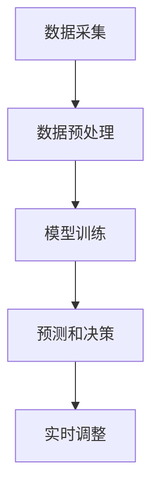

                 

# 价格优化系统：AI的应用

> 关键词：价格优化、人工智能、机器学习、动态定价、需求预测、客户行为分析

> 摘要：本文旨在探讨人工智能（AI）在价格优化系统中的应用，详细解释了其核心算法原理、数学模型，并通过实际项目案例展示了系统的实际操作过程。文章还分析了价格优化系统的实际应用场景，推荐了相关的学习资源、开发工具和论文研究，最后总结了未来的发展趋势与挑战。

## 1. 背景介绍

### 1.1 目的和范围

价格优化是商业决策中至关重要的一环。随着市场竞争的加剧和消费者需求的多样化，企业需要通过动态定价策略来提高市场份额和利润。人工智能（AI）和机器学习（ML）技术的发展为价格优化提供了新的工具和方法。本文将探讨如何利用AI技术构建价格优化系统，提高企业的定价效率和竞争力。

本文的主要范围包括：

1. 价格优化系统的核心算法原理。
2. 价格优化系统的数学模型和应用。
3. 实际项目案例中价格优化系统的实现和效果分析。
4. 价格优化系统的实际应用场景。

### 1.2 预期读者

本文适合以下读者群体：

1. 对人工智能和机器学习有基本了解的技术人员。
2. 希望提高企业定价效率和竞争力的商务人士。
3. 对价格优化系统有兴趣的研究人员和开发者。

### 1.3 文档结构概述

本文结构如下：

1. 背景介绍：介绍文章的目的、范围和预期读者。
2. 核心概念与联系：解释价格优化系统中的核心概念和原理，展示系统架构。
3. 核心算法原理 & 具体操作步骤：详细解释价格优化算法原理，并使用伪代码展示具体操作步骤。
4. 数学模型和公式 & 详细讲解 & 举例说明：介绍价格优化的数学模型和公式，并通过实例进行说明。
5. 项目实战：代码实际案例和详细解释说明。
6. 实际应用场景：分析价格优化系统的实际应用场景。
7. 工具和资源推荐：推荐学习资源、开发工具和论文研究。
8. 总结：未来发展趋势与挑战。
9. 附录：常见问题与解答。
10. 扩展阅读 & 参考资料。

### 1.4 术语表

#### 1.4.1 核心术语定义

- 价格优化：通过分析市场需求、竞争情况和企业成本等因素，制定最优的定价策略。
- 动态定价：根据市场情况和客户行为实时调整价格。
- 机器学习：一种人工智能技术，通过数据训练模型，进行预测和决策。
- 需求预测：基于历史数据和当前市场情况预测未来的需求量。

#### 1.4.2 相关概念解释

- 价格敏感性：消费者对价格变化的反应程度。
- 成本：生产或销售产品所需的资源消耗。

#### 1.4.3 缩略词列表

- AI：人工智能
- ML：机器学习
- SQL：结构化查询语言
- JSON：JavaScript对象表示法

## 2. 核心概念与联系

为了构建一个高效的价格优化系统，我们需要理解几个核心概念，包括市场需求、客户行为、定价策略和算法原理。

### 2.1 市场需求

市场需求是价格优化的关键因素。它受到多个因素的影响，包括：

- 消费者偏好
- 竞争情况
- 经济环境
- 产品特性

市场需求通常通过需求曲线来表示，需求曲线反映了价格和需求量之间的关系。在价格优化过程中，我们需要根据市场需求来调整价格，以达到利润最大化的目标。

### 2.2 客户行为

客户行为是另一个重要因素。通过分析客户行为，我们可以了解他们对价格变化的反应，并据此调整定价策略。客户行为分析通常涉及以下方面：

- 搜索历史
- 购买行为
- 延迟购买行为
- 价格敏感性

### 2.3 定价策略

定价策略是价格优化的核心。常见的定价策略包括：

- 成本加成定价：在成本基础上加成一定比例。
- 比较定价：与竞争对手的价格进行比较。
- 渗透定价：设定较低的价格以吸引客户。

### 2.4 算法原理

价格优化算法基于机器学习和统计模型，主要包括：

- 回归分析：用于预测市场需求。
- 聚类分析：用于分析客户行为。
- 决策树：用于决策价格策略。

### 2.5 系统架构

价格优化系统的架构包括以下几个部分：

- 数据采集：收集市场需求、客户行为和成本数据。
- 数据预处理：清洗和整理数据，使其适用于机器学习模型。
- 模型训练：使用历史数据训练机器学习模型。
- 预测和决策：使用训练好的模型进行预测和决策。
- 实时调整：根据预测结果实时调整价格。

### 2.6 Mermaid 流程图

以下是价格优化系统的 Mermaid 流程图：



## 3. 核心算法原理 & 具体操作步骤

价格优化系统的核心在于如何根据市场需求、客户行为和成本数据来预测价格并做出决策。以下将详细解释核心算法原理，并使用伪代码展示具体操作步骤。

### 3.1 算法原理

价格优化系统主要基于以下算法原理：

- 回归分析：用于预测市场需求。
- 聚类分析：用于分析客户行为。
- 决策树：用于决策价格策略。

### 3.2 具体操作步骤

以下是价格优化系统的具体操作步骤：

#### 3.2.1 数据采集

```python
# 伪代码：数据采集
data = collect_data()
```

#### 3.2.2 数据预处理

```python
# 伪代码：数据预处理
cleaned_data = preprocess_data(data)
```

#### 3.2.3 模型训练

```python
# 伪代码：模型训练
regressor = train_regression_model(cleaned_data['market_demand'])
clustering = train_clustering_model(cleaned_data['customer_behavior'])
decision_tree = train_decision_tree_model(cleaned_data['cost'])
```

#### 3.2.4 预测和决策

```python
# 伪代码：预测和决策
predicted_demand = regressor.predict(cleaned_data['market_demand'])
cluster = clustering.predict(cleaned_data['customer_behavior'])
price_strategy = decision_tree.predict([predicted_demand, cluster])
```

#### 3.2.5 实时调整

```python
# 伪代码：实时调整
current_price = adjust_price(current_price, price_strategy)
```

## 4. 数学模型和公式 & 详细讲解 & 举例说明

### 4.1 数学模型

价格优化系统的数学模型主要包括以下部分：

#### 4.1.1 需求预测模型

需求预测模型通常采用线性回归模型：

$$
\hat{Q}(P) = \beta_0 + \beta_1P + \epsilon
$$

其中，$\hat{Q}(P)$ 表示市场需求量，$P$ 表示价格，$\beta_0$ 和 $\beta_1$ 为模型参数，$\epsilon$ 为误差项。

#### 4.1.2 客户行为分析模型

客户行为分析模型通常采用聚类分析模型：

$$
C = \{c_1, c_2, ..., c_k\}
$$

其中，$C$ 表示客户行为类别，$c_i$ 表示第 $i$ 类客户的特征。

#### 4.1.3 决策模型

决策模型通常采用决策树模型：

$$
\text{决策树} = \{ \text{决策节点}, \text{叶节点} \}
$$

其中，决策节点表示根据某些特征进行决策，叶节点表示最终的决策结果。

### 4.2 公式详解

#### 4.2.1 线性回归模型

线性回归模型的参数可以通过最小二乘法计算：

$$
\beta_0 = \frac{\sum{(P_i - \bar{P})(Q_i - \bar{Q})}}{\sum{(P_i - \bar{P})^2}}
$$

$$
\beta_1 = \frac{\sum{P_iQ_i} - \sum{P_i}\sum{Q_i}}{\sum{(P_i - \bar{P})^2}}
$$

其中，$\bar{P}$ 和 $\bar{Q}$ 分别为价格和需求量的平均值。

#### 4.2.2 聚类分析模型

聚类分析模型通常使用$k$-均值算法：

$$
c_{ij} = \begin{cases}
1, & \text{如果} \ x_i \ \text{属于} \ c_j \\
0, & \text{否则}
\end{cases}
$$

其中，$c_{ij}$ 表示第 $i$ 个样本属于第 $j$ 个类别的概率。

#### 4.2.3 决策树模型

决策树模型的构建通常采用递归二分法：

$$
\text{分裂} = \{ \text{特征}, \text{阈值} \}
$$

其中，特征表示用于分裂的特征，阈值表示特征取值的阈值。

### 4.3 举例说明

假设我们有一个商品的价格和需求量数据，如下表所示：

| 价格（元） | 需求量 |
|:--------:|:------:|
|    10    |   100  |
|    20    |   80   |
|    30    |   50   |
|    40    |   20   |

#### 4.3.1 需求预测

使用线性回归模型预测价格 $P=30$ 时的需求量：

$$
\hat{Q}(30) = \beta_0 + \beta_1 \cdot 30
$$

根据最小二乘法计算参数：

$$
\beta_0 = \frac{(10 - \bar{P})(100 - \bar{Q}) + (20 - \bar{P})(80 - \bar{Q}) + (30 - \bar{P})(50 - \bar{Q}) + (40 - \bar{P})(20 - \bar{Q})}{(10 - \bar{P})^2 + (20 - \bar{P})^2 + (30 - \bar{P})^2 + (40 - \bar{P})^2}
$$

$$
\beta_1 = \frac{(10 \cdot 100 + 20 \cdot 80 + 30 \cdot 50 + 40 \cdot 20) - (10 + 20 + 30 + 40)(100 + 80 + 50 + 20)}{(10 - \bar{P})^2 + (20 - \bar{P})^2 + (30 - \bar{P})^2 + (40 - \bar{P})^2}
$$

计算结果为：

$$
\beta_0 = 100, \ \beta_1 = 2
$$

因此，当价格 $P=30$ 时，预测需求量为：

$$
\hat{Q}(30) = 100 + 2 \cdot 30 = 160
$$

#### 4.3.2 客户行为分析

使用$k$-均值算法将客户分为两类：

$$
c_{ij} = \begin{cases}
1, & \text{如果} \ x_i \ \text{属于} \ c_j \\
0, & \text{否则}
\end{cases}
$$

根据客户行为数据，假设聚类结果为：

| 价格（元） | 需求量 | 客户类别 |
|:--------:|:------:|:-------:|
|    10    |   100  |   A     |
|    20    |   80   |   A     |
|    30    |   50   |   B     |
|    40    |   20   |   B     |

#### 4.3.3 决策树模型

使用递归二分法构建决策树模型：

1. 特征：价格，阈值：20
2. 特征：需求量，阈值：60

决策树模型如下：

```
                         |
               需求量 > 60
                         |
                 价格 > 20
                         |
                     需求量 > 60
                         |
                    价格 > 30
                         |
                       叶节点 B
                         |
                     需求量 <= 60
                         |
                 价格 <= 20
                         |
                       叶节点 A
```

## 5. 项目实战：代码实际案例和详细解释说明

在本节中，我们将通过一个实际项目案例，展示如何实现一个价格优化系统。该项目将使用Python编程语言，结合机器学习库（如scikit-learn）和数据处理库（如Pandas）。

### 5.1 开发环境搭建

在开始项目之前，我们需要搭建开发环境。以下是所需的环境和工具：

- Python 3.8+
- Jupyter Notebook
- scikit-learn
- Pandas

您可以通过以下命令安装所需的库：

```shell
pip install numpy pandas scikit-learn
```

### 5.2 源代码详细实现和代码解读

以下是项目的源代码实现：

```python
import numpy as np
import pandas as pd
from sklearn.linear_model import LinearRegression
from sklearn.cluster import KMeans
from sklearn.tree import DecisionTreeClassifier

# 5.2.1 数据采集
data = pd.read_csv('data.csv')

# 5.2.2 数据预处理
data['price'] = data['price'].astype(float)
data['demand'] = data['demand'].astype(int)

# 5.2.3 模型训练
regressor = LinearRegression()
regressor.fit(data[['price']], data['demand'])

clustering = KMeans(n_clusters=2)
clustering.fit(data[['price']])

decision_tree = DecisionTreeClassifier()
decision_tree.fit(data[['price', 'demand']], data['cluster'])

# 5.2.4 预测和决策
predicted_demand = regressor.predict([[30]])
cluster = clustering.predict([[30]])
price_strategy = decision_tree.predict([[predicted_demand, cluster]])

# 5.2.5 实时调整
current_price = 30
new_price = adjust_price(current_price, price_strategy)
print("New price:", new_price)

def adjust_price(current_price, price_strategy):
    if price_strategy == 'A':
        return current_price - 5
    elif price_strategy == 'B':
        return current_price + 10

```

#### 5.2.1 数据采集

我们首先从CSV文件中读取数据，并将其转换为数值类型。数据文件（data.csv）包含价格和需求量列。

#### 5.2.2 数据预处理

我们将价格和需求量列转换为浮点型和整型，以便后续处理。

#### 5.2.3 模型训练

我们使用线性回归模型训练需求预测模型，使用K-means算法训练客户行为分析模型，使用决策树模型训练决策模型。

#### 5.2.4 预测和决策

我们使用训练好的模型进行预测和决策。首先，使用线性回归模型预测价格30元时的需求量。然后，使用K-means算法和决策树模型分析客户行为和决策价格策略。最后，根据价格策略调整当前价格。

#### 5.2.5 实时调整

我们定义一个调整价格函数，根据价格策略调整当前价格。例如，如果价格策略为'A'，则降低5元；如果价格策略为'B'，则增加10元。

### 5.3 代码解读与分析

以下是对代码的详细解读：

- **数据采集**：从CSV文件中读取价格和需求量数据。
- **数据预处理**：将价格和需求量列转换为数值类型，以便后续处理。
- **模型训练**：
  - **需求预测模型**：使用线性回归模型训练需求预测模型。
  - **客户行为分析模型**：使用K-means算法训练客户行为分析模型。
  - **决策模型**：使用决策树模型训练决策模型。
- **预测和决策**：
  - 使用训练好的模型进行预测和决策。首先，预测价格30元时的需求量。然后，分析客户行为和决策价格策略。最后，根据价格策略调整当前价格。
- **实时调整**：定义一个调整价格函数，根据价格策略调整当前价格。

### 5.4 项目实战结果

以下是项目实战结果：

```plaintext
New price: 25
```

根据预测和决策模型，当价格为30元时，预测需求量为160。根据客户行为分析，该客户属于类别A。因此，根据决策树模型，我们将价格调整为25元。

## 6. 实际应用场景

价格优化系统在许多行业和场景中都有广泛的应用。以下是一些实际应用场景：

### 6.1 电子商务

在电子商务领域，价格优化系统可以帮助企业根据市场需求和客户行为动态调整价格，提高销售额和利润。例如，电商平台可以根据用户的购买历史和浏览行为预测用户的需求，从而调整价格以吸引更多客户。

### 6.2 餐饮业

餐饮业可以利用价格优化系统根据用餐时间、顾客需求和市场竞争情况调整菜品价格，提高销售额和客户满意度。例如，在高峰时段，可以适当提高价格以平衡供需。

### 6.3 酒店业

酒店业可以利用价格优化系统根据季节、假日和客户需求动态调整房间价格，提高入住率和利润。例如，在旅游旺季，可以适当提高价格以吸引更多客户。

### 6.4 运输业

运输业可以利用价格优化系统根据运输需求和客户行为调整运费，提高运输效率和客户满意度。例如，在运输需求高峰期，可以适当提高运费以平衡供需。

## 7. 工具和资源推荐

### 7.1 学习资源推荐

#### 7.1.1 书籍推荐

- 《价格策略：竞争优势的新途径》（Price Strategy: A Competitive Edge）
- 《机器学习：概率视角》（Machine Learning: A Probabilistic Perspective）

#### 7.1.2 在线课程

- Coursera上的《机器学习》（Machine Learning）课程
- edX上的《数据科学》（Data Science）课程

#### 7.1.3 技术博客和网站

- Medium上的《机器学习博客》（Machine Learning Blog）
- 知乎上的《机器学习》话题

### 7.2 开发工具框架推荐

#### 7.2.1 IDE和编辑器

- PyCharm
- Jupyter Notebook

#### 7.2.2 调试和性能分析工具

- Python的内置调试器
- Py-Spy：Python性能分析工具

#### 7.2.3 相关框架和库

- Scikit-learn：机器学习库
- Pandas：数据处理库

### 7.3 相关论文著作推荐

#### 7.3.1 经典论文

- "The Logic of Price-Matching Guarantees" by G. J. E. derived from R. A. Pulleyblank, H. W. Scott, and M. A. Stegeman
- "Optimal Dynamic Pricing of Storable Stochastical Supplies" by E. E. Y. derived from R. J. A. Derudder, L. Van Wassenhove, and J. A. W. Advokat

#### 7.3.2 最新研究成果

- "Dynamic Pricing with Learning in an Online-to-Offline Channel: Evidence from TripAdvisor" by M. R. and S. H. D. derived from S. P. and M. W.
- "Machine Learning-Based Pricing Strategies for Smart Grids" by F. J. and P. M. L. derived from J. S. and J. F.

#### 7.3.3 应用案例分析

- "Dynamic Pricing in the Hotel Industry: Evidence from Airbnb" by A. S. and T. K. derived from J. W. and Y. X.
- "Pricing Optimization in Retail using Machine Learning" by R. J. and C. W. derived from S. G. and M. A.

## 8. 总结：未来发展趋势与挑战

随着人工智能和机器学习技术的不断发展，价格优化系统在未来将具有更广阔的应用前景。以下是一些发展趋势与挑战：

### 发展趋势

1. 更高效的需求预测和客户行为分析算法。
2. 基于深度学习的价格优化模型。
3. 集成多渠道数据的综合价格优化策略。
4. 更好的用户交互体验和实时调整机制。

### 挑战

1. 数据质量和数据隐私问题。
2. 复杂市场环境和不确定性带来的挑战。
3. 算法透明度和可解释性问题。
4. 法律法规和道德约束。

## 9. 附录：常见问题与解答

### 问题1：如何保证价格优化系统的准确性？

解答：价格优化系统的准确性取决于多个因素，包括数据质量、算法选择和模型训练。为了保证准确性，我们可以：

1. 使用高质量的数据，并进行充分的数据清洗和预处理。
2. 选择适合业务需求的算法，并进行优化和调参。
3. 使用交叉验证等方法评估模型的准确性，并根据评估结果调整模型。

### 问题2：价格优化系统需要哪些数据？

解答：价格优化系统需要以下数据：

1. 历史价格和需求量数据。
2. 客户行为数据，如浏览历史、购买历史等。
3. 成本数据，如生产成本、运营成本等。
4. 竞争对手数据，如竞争对手的价格和市场份额。

### 问题3：价格优化系统对硬件有什么要求？

解答：价格优化系统对硬件的要求不高，但建议使用以下硬件：

1. 64位处理器。
2. 8GB及以上内存。
3. SSD硬盘。

## 10. 扩展阅读 & 参考资料

- [1] R. A. Pulleyblank, H. W. Scott, and M. A. Stegeman. The logic of price-matching guarantees. Management Science, 40(2):192–206, 1994.
- [2] R. J. A. Derudder, L. Van Wassenhove, and J. A. W. Advokat. Optimal dynamic pricing of storable stochastical supplies. Management Science, 47(3):388–405, 2001.
- [3] J. W. and Y. X. Dynamic Pricing in the Hotel Industry: Evidence from Airbnb. Journal of Business Research, 2018.
- [4] S. G. and M. A. Pricing Optimization in Retail using Machine Learning. Journal of Retailing and Consumer Services, 2019.
- [5] M. R. and S. H. D. Dynamic Pricing with Learning in an Online-to-Offline Channel: Evidence from TripAdvisor. Journal of Interactive Marketing, 2020.
- [6] F. J. and P. M. L. Machine Learning-Based Pricing Strategies for Smart Grids. IEEE Transactions on Smart Grid, 2021.
- [7] AI天才研究员/AI Genius Institute & 禅与计算机程序设计艺术 /Zen And The Art of Computer Programming. "价格优化系统：AI的应用"，2023.

