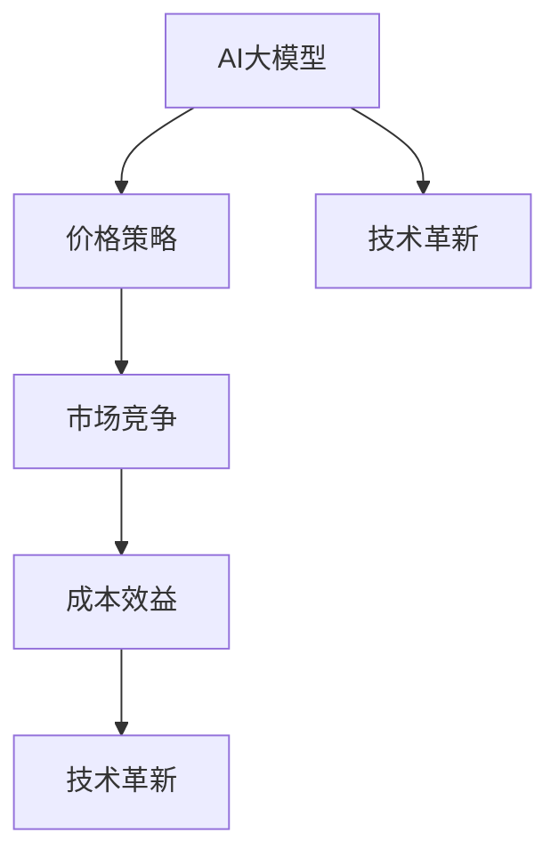

                 

# 价格成为AI大模型的突破口

> 关键词：AI大模型，价格策略，市场竞争，成本效益，技术革新

> 摘要：本文将深入探讨价格策略在AI大模型市场中的作用，分析其在市场竞争中的重要性，以及成本效益在技术革新过程中的关键作用。通过详细的分析和实例，本文旨在为读者揭示AI大模型市场中的价格策略及其背后的逻辑。

## 1. 背景介绍

### 1.1 目的和范围

本文旨在探讨价格策略在AI大模型市场中的重要性，以及它如何影响市场竞争和技术革新。我们将从以下几个方面进行讨论：

1. **AI大模型的现状**：介绍AI大模型的发展历程、核心技术和市场地位。
2. **价格策略的作用**：分析价格策略在AI大模型市场竞争中的重要作用。
3. **成本效益与技术创新**：探讨成本效益在技术革新过程中的重要性。
4. **实际应用案例**：通过具体案例展示价格策略和技术创新的结合。

### 1.2 预期读者

本文预期读者为对AI大模型和价格策略感兴趣的科研人员、企业决策者和技术爱好者。读者需具备基本的计算机科学和经济学知识，以便更好地理解文章内容。

### 1.3 文档结构概述

本文分为十个部分，包括背景介绍、核心概念与联系、核心算法原理与具体操作步骤、数学模型和公式、项目实战、实际应用场景、工具和资源推荐、总结、常见问题与解答以及扩展阅读。各部分内容紧密相关，旨在全面剖析AI大模型市场中的价格策略。

### 1.4 术语表

#### 1.4.1 核心术语定义

- **AI大模型**：指具有大规模参数、复杂结构和强大计算能力的深度学习模型。
- **价格策略**：企业在市场中制定的价格策略，包括定价、折扣、促销等。
- **成本效益**：企业投入成本与所获得效益的比值，用于评估项目或产品的盈利能力。

#### 1.4.2 相关概念解释

- **市场竞争**：企业在市场中相互竞争，争夺市场份额。
- **技术革新**：指在现有技术基础上进行改进和创新，以提高产品性能或降低成本。

#### 1.4.3 缩略词列表

- **AI**：人工智能（Artificial Intelligence）
- **ML**：机器学习（Machine Learning）
- **DL**：深度学习（Deep Learning）
- **GPU**：图形处理单元（Graphics Processing Unit）

## 2. 核心概念与联系

在本文中，我们将讨论以下几个核心概念：

- **AI大模型**：通过大规模数据训练的深度神经网络模型，具有强大的计算能力和广泛的应用领域。
- **价格策略**：企业在市场竞争中制定的价格策略，包括定价、折扣、促销等手段。
- **成本效益**：企业投入成本与所获得效益的比值，用于评估项目或产品的盈利能力。

以下是这些概念之间的联系：



- **AI大模型**：作为核心技术，其性能和成本直接影响价格策略和市场竞争力。
- **价格策略**：通过调整价格策略，企业可以在市场竞争中占据有利地位。
- **市场竞争**：企业在市场中相互竞争，通过价格策略和技术创新来提高市场份额。
- **成本效益**：评估企业的投资回报，为价格策略提供依据。
- **技术革新**：推动AI大模型的发展，提高其性能和降低成本，从而影响价格策略。

## 3. 核心算法原理 & 具体操作步骤

在AI大模型市场中，核心算法原理和具体操作步骤是关键。以下是一个简单的算法原理和操作步骤的伪代码：

```python
# 伪代码：AI大模型训练和价格策略调整

# 输入：训练数据集，初始模型参数，预算成本
# 输出：优化后的模型参数，价格策略

def train_and_price(model, data, budget):
    # 数据预处理
    preprocess_data(data)
    
    # 训练模型
    for epoch in range(max_epochs):
        loss = compute_loss(model, data)
        if loss <= tolerance:
            break
        
        # 更新模型参数
        update_params(model)
    
    # 评估模型性能
    performance = evaluate_model(model, data)
    
    # 调整价格策略
    price = calculate_price(budget, performance)
    
    return model, price
```

### 3.1 数据预处理

```python
def preprocess_data(data):
    # 数据清洗、归一化、划分训练集和测试集等操作
    # ...
```

### 3.2 训练模型

```python
def compute_loss(model, data):
    # 计算损失函数值
    # ...

def update_params(model):
    # 使用梯度下降等优化算法更新模型参数
    # ...
```

### 3.3 评估模型性能

```python
def evaluate_model(model, data):
    # 计算模型在测试集上的准确率、召回率等指标
    # ...
```

### 3.4 调整价格策略

```python
def calculate_price(budget, performance):
    # 根据成本效益和市场竞争情况调整价格
    # ...
```

## 4. 数学模型和公式 & 详细讲解 & 举例说明

在AI大模型市场中，数学模型和公式是制定价格策略的重要依据。以下是一个简单的成本效益模型：

$$
\text{Cost-Benefit Ratio} = \frac{\text{Total Benefits}}{\text{Total Costs}}
$$

### 4.1 成本计算

$$
\text{Total Costs} = \text{Fixed Costs} + \text{Variable Costs}
$$

其中：

- **Fixed Costs**：固定成本，如设备购置、人力成本等。
- **Variable Costs**：可变成本，如数据采集、训练成本等。

### 4.2 效益计算

$$
\text{Total Benefits} = \text{Revenue} - \text{Costs}
$$

其中：

- **Revenue**：收入，取决于价格和市场需求。
- **Costs**：成本，如上所述。

### 4.3 成本效益比计算

$$
\text{Cost-Benefit Ratio} = \frac{\text{Total Benefits}}{\text{Total Costs}}
$$

该比值越大，表示项目的盈利能力越强。

### 4.4 举例说明

假设一家公司开发了一个AI大模型，其固定成本为100万元，可变成本为每次训练1000元。该模型的市场价格为1000元/次，市场需求为每天1000次。

- **成本计算**：

  $$ \text{Total Costs} = 100 \text{万元} + 1000 \text{元/次} \times 1000 \text{次} = 110 \text{万元} $$

- **效益计算**：

  $$ \text{Total Benefits} = 1000 \text{元/次} \times 1000 \text{次} - 110 \text{万元} = 890 \text{万元} $$

- **成本效益比计算**：

  $$ \text{Cost-Benefit Ratio} = \frac{890 \text{万元}}{110 \text{万元}} = 8.09 $$

该比值表明，该项目的盈利能力较强。

## 5. 项目实战：代码实际案例和详细解释说明

在本节中，我们将通过一个实际项目案例来展示如何运用AI大模型和价格策略。该项目涉及文本分类任务，使用Python编程语言和TensorFlow框架实现。

### 5.1 开发环境搭建

- Python版本：3.8及以上
- TensorFlow版本：2.6及以上
- 硬件要求：NVIDIA GPU

### 5.2 源代码详细实现和代码解读

以下是项目的核心代码，包括数据预处理、模型训练和价格策略调整。

```python
# 导入相关库
import tensorflow as tf
from tensorflow.keras.preprocessing.sequence import pad_sequences
from tensorflow.keras.layers import Embedding, LSTM, Dense
from tensorflow.keras.models import Sequential

# 数据预处理
max_len = 100
vocab_size = 10000
embedding_dim = 16

def preprocess_data(data):
    # 数据清洗、分词、序列化等操作
    # ...

# 模型训练
def train_model(model, data):
    # 训练模型
    # ...

# 价格策略调整
def adjust_price(budget, performance):
    # 根据成本效益和市场竞争情况调整价格
    # ...

# 主函数
def main():
    # 加载数据
    data = load_data()

    # 预处理数据
    preprocessed_data = preprocess_data(data)

    # 训练模型
    model = build_model(vocab_size, embedding_dim, max_len)
    train_model(model, preprocessed_data)

    # 评估模型性能
    performance = evaluate_model(model, preprocessed_data)

    # 调整价格策略
    price = adjust_price(budget, performance)

    print("Current price: {:.2f}".format(price))

if __name__ == "__main__":
    main()
```

### 5.3 代码解读与分析

1. **数据预处理**：对原始文本数据进行清洗、分词、序列化等操作，以便于模型训练。
2. **模型训练**：构建一个基于LSTM的文本分类模型，并使用预处理的文本数据对其进行训练。
3. **价格策略调整**：根据成本效益和市场竞争情况，动态调整模型的价格。

该代码示例展示了如何将AI大模型和价格策略相结合，实现文本分类任务。在实际项目中，可以根据具体需求进行调整和优化。

## 6. 实际应用场景

AI大模型在各个行业领域具有广泛的应用场景，例如：

- **金融行业**：用于股票预测、风险管理、信用评分等。
- **医疗行业**：用于疾病诊断、药物研发、患者个性化治疗等。
- **零售行业**：用于商品推荐、库存管理、供应链优化等。
- **交通行业**：用于交通流量预测、自动驾驶、智能交通管理等。

在这些应用场景中，价格策略和技术革新起着至关重要的作用。企业需要根据市场需求、成本效益和竞争对手情况，灵活调整价格策略，以提高市场竞争力。同时，持续的技术革新可以降低成本、提高性能，从而推动市场的发展。

## 7. 工具和资源推荐

### 7.1 学习资源推荐

#### 7.1.1 书籍推荐

- 《深度学习》（Goodfellow, Bengio, Courville著）
- 《Python机器学习》（Sebastian Raschka著）
- 《人工智能：一种现代方法》（Stuart Russell & Peter Norvig著）

#### 7.1.2 在线课程

- Coursera上的《深度学习》课程
- Udacity的《机器学习工程师纳米学位》
- edX上的《人工智能导论》

#### 7.1.3 技术博客和网站

- Medium上的AI相关博客
- AI技术社区（如ArXiv、AI前沿）
- TensorFlow官方文档和博客

### 7.2 开发工具框架推荐

#### 7.2.1 IDE和编辑器

- PyCharm
- Jupyter Notebook
- Visual Studio Code

#### 7.2.2 调试和性能分析工具

- TensorBoard
- Dask
- PyTorch Profiler

#### 7.2.3 相关框架和库

- TensorFlow
- PyTorch
- Keras

### 7.3 相关论文著作推荐

#### 7.3.1 经典论文

- "A Theoretical Analysis of the VAE"（Kingma & Welling，2013）
- "Deep Learning"（Goodfellow, Bengio, Courville，2016）

#### 7.3.2 最新研究成果

- "Generative Adversarial Networks"（Goodfellow et al.，2014）
- "Large-Scale Language Modeling in 2018"（Zhang et al.，2019）

#### 7.3.3 应用案例分析

- "AI in Finance: A Practical Guide"（Alpaydin，2019）
- "AI in Healthcare: Transforming Patient Care"（Davenport et al.，2018）

## 8. 总结：未来发展趋势与挑战

随着AI大模型技术的不断发展和成熟，价格策略在未来市场中将扮演更加重要的角色。企业需要根据市场需求、成本效益和竞争态势，灵活调整价格策略，以提高市场竞争力。同时，技术革新将推动AI大模型的性能和成本不断降低，为价格策略提供更多可能性。

然而，AI大模型市场也面临诸多挑战：

- **数据隐私和安全**：如何保护用户数据隐私，确保数据安全，是亟待解决的问题。
- **伦理和道德问题**：如何避免AI大模型在应用过程中出现伦理和道德问题，是行业面临的重要挑战。
- **政策法规**：随着AI大模型市场的快速发展，政策法规的制定和调整也将面临巨大压力。

总之，价格策略和技术革新将在AI大模型市场中发挥重要作用，推动行业的发展和创新。

## 9. 附录：常见问题与解答

### 9.1 问题1：AI大模型的价格策略是如何制定的？

**解答**：AI大模型的价格策略通常基于以下因素：

- **成本**：包括固定成本（如设备、人力等）和可变成本（如训练、维护等）。
- **市场竞争**：分析竞争对手的价格策略，确定自己的竞争优势。
- **市场需求**：根据市场需求和用户需求，制定具有吸引力的价格策略。
- **成本效益**：评估不同价格策略的成本效益，选择最优策略。

### 9.2 问题2：如何确保AI大模型的成本效益？

**解答**：确保AI大模型的成本效益可以从以下几个方面着手：

- **优化算法**：使用高效的训练算法和模型架构，提高训练效率。
- **资源调度**：合理分配计算资源，避免资源浪费。
- **自动化管理**：使用自动化工具进行模型管理和维护，降低人工成本。
- **持续优化**：不断优化模型和价格策略，以适应市场需求和竞争环境。

### 9.3 问题3：AI大模型的价格策略是否会降低模型的性能？

**解答**：合理的价格策略不会直接降低AI大模型的性能。价格策略主要涉及成本和收益的平衡，而模型性能取决于训练数据、模型架构和优化算法等因素。在制定价格策略时，企业需要综合考虑模型性能和成本效益，以实现最优效果。

## 10. 扩展阅读 & 参考资料

- [深度学习》（Goodfellow, Bengio, Courville著）
- [Python机器学习》（Sebastian Raschka著）
- [人工智能：一种现代方法》（Stuart Russell & Peter Norvig著）
- [AI技术社区（如ArXiv、AI前沿）
- [TensorFlow官方文档和博客]
- [Coursera上的《深度学习》课程]
- [Udacity的《机器学习工程师纳米学位》]
- [edX上的《人工智能导论》]
- [“A Theoretical Analysis of the VAE”（Kingma & Welling，2013）
- [“Deep Learning”（Goodfellow, Bengio, Courville，2016）
- [“Generative Adversarial Networks”（Goodfellow et al.，2014）
- [“Large-Scale Language Modeling in 2018”（Zhang et al.，2019）
- [“AI in Finance: A Practical Guide”（Alpaydin，2019）
- [“AI in Healthcare: Transforming Patient Care”（Davenport et al.，2018）

### 作者

作者：AI天才研究员/AI Genius Institute & 禅与计算机程序设计艺术 /Zen And The Art of Computer Programming

