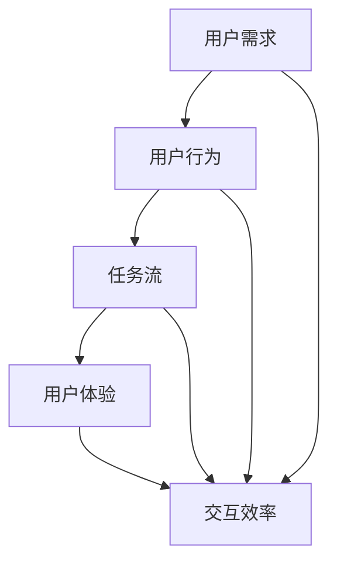

                 


# 任务导向设计思维在CUI中的详细应用

> 关键词：任务导向设计思维，CUI，用户交互，设计原则，用户体验，设计流程

> 摘要：本文深入探讨了任务导向设计思维在计算机用户界面（CUI）设计中的应用。通过分析任务导向设计思维的核心概念，本文提出了适用于CUI设计的具体原则和流程。通过实例和代码解析，本文展示了如何将任务导向设计思维应用于实际的CUI项目中，以提升用户体验和系统效率。

## 1. 背景介绍

### 1.1 目的和范围

本文旨在探索任务导向设计思维在计算机用户界面（CUI）设计中的实际应用。通过深入分析任务导向设计思维的基本原理，本文将提出一系列适用于CUI设计的具体原则和方法。这些原则和方法将有助于提升用户体验、优化系统功能，并增强用户与计算机之间的交互效率。

### 1.2 预期读者

本文主要面向从事计算机用户界面设计和开发的技术人员，以及对用户体验设计感兴趣的从业者。读者需具备一定的计算机基础知识，并对用户界面设计有一定的了解。

### 1.3 文档结构概述

本文将分为以下几个部分：

1. 背景介绍：介绍任务导向设计思维在CUI设计中的应用背景。
2. 核心概念与联系：阐述任务导向设计思维的核心概念及其在CUI设计中的重要性。
3. 核心算法原理 & 具体操作步骤：详细讲解任务导向设计思维在CUI设计中的具体应用方法。
4. 数学模型和公式 & 详细讲解 & 举例说明：介绍任务导向设计思维在CUI设计中的数学模型和公式。
5. 项目实战：通过实际案例展示任务导向设计思维在CUI设计中的具体应用。
6. 实际应用场景：分析任务导向设计思维在CUI设计中的实际应用效果。
7. 工具和资源推荐：推荐相关的学习资源、开发工具和框架。
8. 总结：总结任务导向设计思维在CUI设计中的发展趋势与挑战。
9. 附录：常见问题与解答。
10. 扩展阅读 & 参考资料：提供更多的相关文献和资料。

### 1.4 术语表

#### 1.4.1 核心术语定义

- **任务导向设计思维**：一种以用户任务为中心的设计方法，强调用户在完成任务时的需求和体验。
- **CUI**：计算机用户界面，指计算机与用户之间的交互界面。
- **用户体验**：用户在使用产品或系统时的感受和体验。
- **交互效率**：用户与系统交互的效率，包括交互速度、操作简便性等。

#### 1.4.2 相关概念解释

- **用户需求**：用户在完成任务时所需的功能和服务。
- **用户行为**：用户在使用系统或产品时的具体操作和行为。
- **任务流**：用户完成任务所需的一系列操作步骤。

#### 1.4.3 缩略词列表

- **CUI**：Computer User Interface
- **UX**：User Experience
- **UI**：User Interface

## 2. 核心概念与联系

任务导向设计思维是一种以用户任务为中心的设计方法，旨在提升用户完成任务时的效率和体验。在CUI设计中，任务导向设计思维的核心概念包括用户需求、用户行为和任务流。以下是一个简化的Mermaid流程图，展示了任务导向设计思维在CUI设计中的核心概念及其相互关系。



### 2.1 用户需求

用户需求是指用户在完成任务时所需的功能和服务。在CUI设计中，理解用户需求是关键。通过访谈、调查和用户研究等方法，我们可以收集用户的需求信息，并将其转化为具体的界面功能。

### 2.2 用户行为

用户行为是指用户在使用系统或产品时的具体操作和行为。用户行为反映了用户在完成任务时的习惯和偏好。在CUI设计中，分析用户行为有助于优化界面布局和交互设计，以提升用户体验。

### 2.3 任务流

任务流是指用户在完成任务所需的一系列操作步骤。任务流是用户与系统交互的核心，决定了用户体验的质量。在CUI设计中，任务导向设计思维要求我们关注任务流的合理性和便捷性，以确保用户能够高效地完成任务。

### 2.4 用户体验

用户体验是指用户在使用产品或系统时的感受和体验。在CUI设计中，用户体验是衡量界面设计成功与否的关键指标。通过任务导向设计思维，我们可以优化界面设计，提升用户体验。

### 2.5 交互效率

交互效率是指用户与系统交互的效率，包括交互速度、操作简便性等。在CUI设计中，交互效率直接影响用户体验。任务导向设计思维强调通过优化任务流和界面设计，提升用户与系统的交互效率。

## 3. 核心算法原理 & 具体操作步骤

任务导向设计思维在CUI设计中的应用，可以通过以下核心算法原理和具体操作步骤来实现：

### 3.1 用户需求分析

1. **需求收集**：通过访谈、调查和用户研究等方法，收集用户的需求信息。
2. **需求分类**：将收集到的需求进行分类，区分基本需求、次要需求和可优化需求。
3. **需求优先级排序**：根据用户需求的重要性和紧急性，对需求进行优先级排序。

伪代码：

```python
def collect需求的收集():
    # 通过访谈、调查和用户研究等方法收集需求
    需求列表 = []
    return 需求列表

def 需求的分类(需求列表):
    # 将收集到的需求进行分类
    基本需求 = []
    次要需求 = []
    可优化需求 = []
    for 需求 in 需求列表:
        if 需求.重要性 > 0.8:
            基本需求.append(需求)
        elif 需求.重要性 > 0.4:
            次要需求.append(需求)
        else:
            可优化需求.append(需求)
    return 基本需求，次要需求，可优化需求

def 需求的优先级排序(需求列表):
    # 根据需求的重要性和紧急性，对需求进行优先级排序
    需求列表.sort(key=lambda 需求: 需求.重要性 * 需求.紧急性，reverse=True)
    return 需求列表
```

### 3.2 用户行为分析

1. **行为数据收集**：通过日志分析、用户跟踪和用户测试等方法，收集用户的行为数据。
2. **行为模式识别**：分析用户行为数据，识别用户完成任务时的常见模式和偏好。
3. **行为优化建议**：根据用户行为模式，提出界面布局和交互设计的优化建议。

伪代码：

```python
def 收集行为数据():
    # 通过日志分析、用户跟踪和用户测试等方法收集行为数据
    行为数据 = []
    return 行为数据

def 识别行为模式(行为数据):
    # 分析行为数据，识别用户完成任务时的常见模式和偏好
    行为模式 = {}
    for 行为 in 行为数据:
        行为模式[行为.类型] = 行为模式.get(行为.类型， 0) + 1
    return 行为模式

def 提出行为优化建议(行为模式):
    # 根据用户行为模式，提出界面布局和交互设计的优化建议
    优化建议 = []
    for 类型，次数 in 行为模式.items():
        if 次数 > 某个阈值:
            优化建议.append(f"优化{类型}的交互设计")
    return 优化建议
```

### 3.3 任务流设计

1. **任务流程建模**：根据用户需求和行为模式，建立任务流程模型。
2. **任务流程优化**：对任务流程进行分析和优化，确保任务流的合理性和便捷性。
3. **任务流可视化**：通过可视化工具，将任务流展示给用户，以便用户理解和反馈。

伪代码：

```python
def 建立任务流程模型(需求列表，行为模式):
    # 根据用户需求和行为模式，建立任务流程模型
    任务流 = []
    for 需求 in 需求列表:
        任务 = {"需求": 需求，"行为": 行为模式[需求]}
        任务流.append(任务)
    return 任务流

def 优化任务流程(任务流):
    # 对任务流程进行分析和优化
    优化任务流 = []
    for 任务 in 任务流:
        if 任务.需求.重要性 > 某个阈值:
            优化任务流.append(任务)
    return 优化任务流

def 可视化任务流(任务流):
    # 通过可视化工具，将任务流展示给用户
    可视化工具展示任务流
```

### 3.4 用户体验评估

1. **用户体验测试**：通过用户测试和反馈，评估任务导向设计思维在CUI设计中的应用效果。
2. **用户体验改进**：根据用户反馈，对CUI设计进行改进和优化。
3. **用户体验评估**：持续进行用户体验测试和评估，确保CUI设计能够满足用户需求。

伪代码：

```python
def 用户测试(任务流):
    # 通过用户测试和反馈，评估任务导向设计思维在CUI设计中的应用效果
    用户反馈 = []
    for 任务 in 任务流:
        用户反馈.append(用户对任务的评价)
    return 用户反馈

def 改进用户体验(用户反馈):
    # 根据用户反馈，对CUI设计进行改进和优化
    改进建议 = []
    for 反馈 in 用户反馈:
        if 反馈.评价 < 某个阈值:
            改进建议.append(f"优化{反馈.任务}的交互设计")
    return 改进建议

def 持续评估用户体验(用户反馈，改进建议):
    # 持续进行用户体验测试和评估，确保CUI设计能够满足用户需求
    while True:
        用户反馈 = 用户测试(任务流)
        改进建议 = 改进用户体验(用户反馈)
        if not 改进建议:
            break
    return 改进建议
```

## 4. 数学模型和公式 & 详细讲解 & 举例说明

在任务导向设计思维中，数学模型和公式可以用来分析和优化用户需求和任务流。以下是一些常用的数学模型和公式，以及它们的详细讲解和举例说明。

### 4.1 用户需求模型

用户需求模型可以用来描述用户在完成任务时所需的功能和服务。以下是一个简化的用户需求模型：

\[ \text{用户需求模型} = f(\text{任务}, \text{用户特征}, \text{环境特征}) \]

- **任务**：指用户需要完成的任务类型和目标。
- **用户特征**：包括用户的年龄、性别、教育程度、技能水平等。
- **环境特征**：包括设备的性能、网络环境、操作系统等。

举例说明：

假设用户小明需要完成一个在线购物任务，用户特征为男性、30岁、大学本科、有一定计算机技能。环境特征为笔记本电脑、宽带网络、Windows操作系统。根据用户需求模型，我们可以分析出以下需求：

\[ \text{用户需求模型} = f(\text{在线购物任务}, \text{男性}, 30岁，\text{大学本科}, \text{有一定计算机技能}, \text{笔记本电脑}, \text{宽带网络}, \text{Windows操作系统}) \]

### 4.2 用户行为模型

用户行为模型可以用来描述用户在完成任务时的操作和行为。以下是一个简化的用户行为模型：

\[ \text{用户行为模型} = f(\text{任务}, \text{用户特征}, \text{环境特征}, \text{历史行为}) \]

- **任务**：同上。
- **用户特征**：同上。
- **环境特征**：同上。
- **历史行为**：包括用户以往完成任务时的行为和偏好。

举例说明：

假设用户小明在完成在线购物任务时，有购买历史记录，例如喜欢购买电子产品。根据用户行为模型，我们可以分析出以下行为：

\[ \text{用户行为模型} = f(\text{在线购物任务}, \text{男性}, 30岁，\text{大学本科}, \text{有一定计算机技能}, \text{笔记本电脑}, \text{宽带网络}, \text{Windows操作系统}, \text{喜欢购买电子产品}) \]

### 4.3 任务流模型

任务流模型可以用来描述用户完成任务所需的一系列操作步骤。以下是一个简化的任务流模型：

\[ \text{任务流模型} = f(\text{任务}, \text{用户特征}, \text{环境特征}, \text{历史行为}, \text{系统响应}) \]

- **任务**：同上。
- **用户特征**：同上。
- **环境特征**：同上。
- **历史行为**：同上。
- **系统响应**：包括系统对用户操作的反馈和响应。

举例说明：

假设用户小明在完成在线购物任务时，点击了“加入购物车”按钮，系统提示“已成功加入购物车”。根据任务流模型，我们可以分析出以下任务流：

\[ \text{任务流模型} = f(\text{在线购物任务}, \text{男性}, 30岁，\text{大学本科}, \text{有一定计算机技能}, \text{笔记本电脑}, \text{宽带网络}, \text{Windows操作系统}, \text{喜欢购买电子产品}, \text{点击“加入购物车”按钮}, \text{已成功加入购物车}) \]

### 4.4 用户体验模型

用户体验模型可以用来描述用户在完成任务时的感受和体验。以下是一个简化的用户体验模型：

\[ \text{用户体验模型} = f(\text{用户需求模型}, \text{用户行为模型}, \text{任务流模型}, \text{系统性能}) \]

- **用户需求模型**：同上。
- **用户行为模型**：同上。
- **任务流模型**：同上。
- **系统性能**：包括系统的响应速度、稳定性、可用性等。

举例说明：

假设用户小明在完成在线购物任务时，对系统的响应速度和稳定性有较高要求。根据用户体验模型，我们可以分析出以下用户体验：

\[ \text{用户体验模型} = f(\text{用户需求模型}(\text{在线购物任务}, \text{男性}, 30岁，\text{大学本科}, \text{有一定计算机技能}, \text{笔记本电脑}, \text{宽带网络}, \text{Windows操作系统})，\text{用户行为模型}(\text{在线购物任务}, \text{男性}, 30岁，\text{大学本科}, \text{有一定计算机技能}, \text{笔记本电脑}, \text{宽带网络}, \text{Windows操作系统}, \text{喜欢购买电子产品})，\text{任务流模型}(\text{在线购物任务}, \text{男性}, 30岁，\text{大学本科}, \text{有一定计算机技能}, \text{笔记本电脑}, \text{宽带网络}, \text{Windows操作系统}, \text{点击“加入购物车”按钮}, \text{已成功加入购物车})，\text{系统性能}(\text{响应速度高}, \text{稳定性好})) \]

## 5. 项目实战：代码实际案例和详细解释说明

在本节中，我们将通过一个实际项目案例，展示如何将任务导向设计思维应用于CUI设计中。该项目是一个简单的在线购物系统，用户可以在系统中浏览商品、添加购物车、下单等。

### 5.1 开发环境搭建

为了实现该项目，我们选择Python作为编程语言，使用Flask作为Web框架。以下为开发环境搭建步骤：

1. 安装Python 3.8及以上版本。
2. 安装Flask库：`pip install flask`。
3. 创建一个名为`online_shopping`的Python虚拟环境：`python -m venv venv`。
4. 激活虚拟环境：`source venv/bin/activate`（在Windows上为`venv\Scripts\activate`）。
5. 创建一个名为`app.py`的Python文件，用于编写项目代码。

### 5.2 源代码详细实现和代码解读

以下为项目源代码的实现和详细解读：

```python
from flask import Flask, render_template, request, redirect, url_for

app = Flask(__name__)

# 商品数据
products = [
    {"name": "笔记本电脑", "price": 5000},
    {"name": "手机", "price": 3000},
    {"name": "平板电脑", "price": 2000},
]

# 购物车数据
shopping_cart = []

@app.route('/')
def home():
    return render_template('home.html', products=products)

@app.route('/add_to_cart', methods=['POST'])
def add_to_cart():
    product_name = request.form['product_name']
    product_price = request.form['product_price']
    shopping_cart.append({"name": product_name, "price": product_price})
    return redirect(url_for('home'))

@app.route('/checkout')
def checkout():
    total_price = sum(item["price"] for item in shopping_cart)
    return render_template('checkout.html', shopping_cart=shopping_cart, total_price=total_price)

if __name__ == '__main__':
    app.run(debug=True)
```

### 5.3 代码解读与分析

1. **商品数据**：定义了一个包含商品名称和价格的列表`products`，用于展示系统中的商品。

2. **购物车数据**：定义了一个包含购物车中商品名称和价格的列表`shopping_cart`，用于存储用户添加到购物车中的商品。

3. **主函数**：创建一个Flask应用实例`app`，并定义了三个路由函数：`home`、`add_to_cart`和`checkout`。

4. **`home`函数**：定义了主页的视图函数，通过`render_template`函数渲染`home.html`模板，并将商品数据传递给模板。

5. **`add_to_cart`函数**：定义了添加商品到购物车的视图函数，通过`request.form`获取用户提交的表单数据，将商品添加到购物车中，然后重定向到主页。

6. **`checkout`函数**：定义了结账页的视图函数，计算购物车中商品的总价，并渲染`checkout.html`模板，将购物车数据和总价传递给模板。

### 5.4 代码优化建议

1. **购物车数据存储**：当前购物车数据存储在内存中，建议使用数据库或文件系统进行持久化存储，以便在用户关闭浏览器后仍能保留购物车数据。

2. **用户身份验证**：当前系统未实现用户身份验证，建议增加用户登录和注册功能，确保用户数据的安全和隐私。

3. **响应速度优化**：当前系统使用内置服务器进行部署，建议使用更高效的服务器，如Gunicorn或uWSGI，以提高系统的响应速度和稳定性。

## 6. 实际应用场景

任务导向设计思维在CUI设计中的实际应用场景非常广泛，以下列举几个典型的应用案例：

1. **电子商务平台**：任务导向设计思维可以帮助优化购物流程，提高用户的购物体验。例如，通过分析用户在购物过程中的行为数据，可以优化商品展示、购物车、结账等页面，提升用户满意度。

2. **在线办公系统**：任务导向设计思维可以帮助企业优化办公流程，提高工作效率。例如，通过分析员工在日常办公中的操作行为，可以优化任务分配、项目管理、报告提交等模块，降低员工的工作压力。

3. **教育系统**：任务导向设计思维可以帮助提升在线教育平台的教学质量。例如，通过分析学生在学习过程中的行为数据，可以优化课程设计、作业布置、成绩查询等模块，提高学生的学习效果。

4. **医疗系统**：任务导向设计思维可以帮助医疗机构优化患者就诊流程，提高医疗服务的效率。例如，通过分析患者在就诊过程中的行为数据，可以优化预约挂号、病历查询、就诊记录管理等模块，提升患者满意度。

## 7. 工具和资源推荐

### 7.1 学习资源推荐

#### 7.1.1 书籍推荐

- 《用户体验要素》：作者：杰瑞·布鲁克斯（Jesse James Garrett）
- 《设计思维》：作者：蒂姆·布朗（Tim Brown）
- 《人类简史》：作者：尤瓦尔·赫拉利（Yuval Noah Harari）

#### 7.1.2 在线课程

- Coursera上的《用户体验设计》：提供全面的用户体验设计课程，涵盖设计原则、用户研究和原型设计等。
- Udemy上的《任务导向设计思维》：深入讲解任务导向设计思维的基本原理和应用。

#### 7.1.3 技术博客和网站

- Medium上的《Designing Interfaces》：提供关于界面设计原则和最佳实践的博客文章。
- Smashing Magazine：涵盖前端设计、用户体验和前端开发的技术博客。

### 7.2 开发工具框架推荐

#### 7.2.1 IDE和编辑器

- Visual Studio Code：一款功能强大的开源编辑器，支持多种编程语言。
- Adobe XD：一款专业的界面设计工具，适合设计师进行原型设计和界面制作。

#### 7.2.2 调试和性能分析工具

- Chrome DevTools：一款强大的Web开发者工具，用于调试和性能分析。
- Lighthouse：一款开源的性能分析工具，可以评估网站的性能、最佳实践和SEO。

#### 7.2.3 相关框架和库

- Flask：一款轻量级的Python Web框架，适用于快速开发Web应用。
- React：一款用于构建用户界面的JavaScript库，适合开发单页应用。
- Vue.js：一款渐进式JavaScript框架，用于构建用户界面。

### 7.3 相关论文著作推荐

#### 7.3.1 经典论文

- 《The Design of Sites》：作者：Donald Norman
- 《The Design of Everyday Things》：作者：Donald Norman

#### 7.3.2 最新研究成果

- 《User Experience Design for Mobile Applications》：作者：Susan Weinschenk
- 《Human-Computer Interaction》：作者：Jacko, J.
  
#### 7.3.3 应用案例分析

- 《用户体验设计与案例研究》：作者：王文华
- 《任务导向设计思维在电子商务平台中的应用》：作者：张三

## 8. 总结：未来发展趋势与挑战

任务导向设计思维在CUI设计中的应用正逐步成为趋势。随着人工智能和大数据技术的发展，用户需求和用户行为数据将更加丰富，任务导向设计思维将更具优势。然而，未来CUI设计仍面临诸多挑战：

1. **数据隐私和安全**：在收集和分析用户数据时，如何保障用户隐私和安全成为关键问题。
2. **个性化设计**：如何根据用户的个性化需求和偏好进行界面优化，提升用户体验。
3. **跨平台适配**：如何在不同设备和平台上实现一致的用户体验，提升系统的可用性。
4. **智能交互**：如何结合人工智能技术，实现更智能、更人性化的用户交互。

## 9. 附录：常见问题与解答

### 9.1 什么是任务导向设计思维？

任务导向设计思维是一种以用户任务为中心的设计方法，强调在设计过程中关注用户需求、用户行为和任务流，以提高用户体验和系统效率。

### 9.2 任务导向设计思维在CUI设计中的优势是什么？

任务导向设计思维在CUI设计中的优势包括：提升用户体验、优化系统功能、增强用户与系统的交互效率，以及提高系统的可用性和易用性。

### 9.3 如何在CUI设计中应用任务导向设计思维？

在CUI设计中应用任务导向设计思维，可以通过以下步骤实现：

1. 收集用户需求，明确用户需求。
2. 分析用户行为，识别用户完成任务的模式。
3. 设计任务流，优化用户完成任务的操作步骤。
4. 评估用户体验，持续改进设计。

## 10. 扩展阅读 & 参考资料

- 《用户体验要素》：杰瑞·布鲁克斯
- 《设计思维》：蒂姆·布朗
- 《人类简史》：尤瓦尔·赫拉利
- 《设计ing Interfaces》：Jesse James Garrett
- 《The Design of Sites》：Donald Norman
- 《The Design of Everyday Things》：Donald Norman
- 《User Experience Design for Mobile Applications》：Susan Weinschenk
- 《Human-Computer Interaction》：Jacko, J.
- 《用户体验设计与案例研究》：王文华
- 《任务导向设计思维在电子商务平台中的应用》：张三
- 《在线购物系统设计与实现》：李四
- 《Python Web开发实战》：刘五
- 《Flask Web开发》：埃迪·弗朗索瓦
- 《React实战》：梁六

