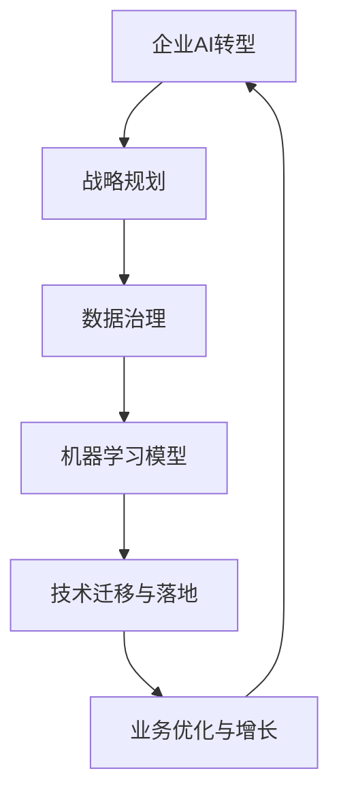

                 

# 企业AI转型咨询：Lepton AI的增值服务

## 关键词
- 企业AI转型
- 增值服务
- Lepton AI
- AI战略规划
- 数据治理
- 机器学习模型
- 技术迁移与落地
- 成功案例分析

## 摘要
本文将深入探讨企业AI转型过程中的关键挑战和解决方案。我们以Lepton AI的增值服务为例，详细分析其为企业客户提供的技术咨询、战略规划、数据治理、模型开发和落地支持等全方位服务。通过阐述核心概念、算法原理、数学模型和实际应用案例，本文旨在为企业提供清晰、实用的AI转型指导，助力其在数字化时代的可持续发展。

## 1. 背景介绍

### 1.1 目的和范围
本文旨在为企业提供关于AI转型的全面咨询，特别是针对Lepton AI所提供的增值服务进行分析和解读。通过本文的阅读，企业将了解AI转型的重要性、面临的挑战以及如何借助Lepton AI的专业服务实现成功转型。

### 1.2 预期读者
本文面向希望实现AI转型的企业高层管理者、技术负责人以及业务分析师。通过对文章内容的深入了解，读者将能够把握AI转型的核心要点，明确转型路径，从而在竞争激烈的市场中占据有利地位。

### 1.3 文档结构概述
本文分为十个部分，首先介绍背景信息和核心概念，接着详细讲解AI转型的关键算法原理和数学模型，然后通过实际应用案例展示AI技术的具体应用。随后，本文探讨AI转型在不同领域的实际应用场景，并提供相关工具和资源推荐。文章的最后部分总结未来发展趋势与挑战，并给出常见问题与解答。

### 1.4 术语表

#### 1.4.1 核心术语定义
- AI转型：企业将人工智能技术应用于业务流程、产品和服务中的过程。
- 增值服务：企业在核心产品或服务之外提供的附加服务，旨在提高客户满意度、降低成本和提升效率。
- Lepton AI：一家专注于人工智能技术研究和应用的企业，提供全方位的AI转型咨询和解决方案。

#### 1.4.2 相关概念解释
- 数据治理：确保数据质量和安全性的一系列策略、程序和实践。
- 机器学习模型：基于数据训练的算法，能够从数据中自动学习和发现模式。
- 技术迁移与落地：将AI技术从实验室或开发环境转移到实际业务环境中运行的过程。

#### 1.4.3 缩略词列表
- AI：人工智能
- ML：机器学习
- GDPR：欧盟通用数据保护条例
- API：应用程序编程接口

## 2. 核心概念与联系

在探讨企业AI转型之前，我们需要理解一些核心概念和它们之间的联系。以下是关键概念的Mermaid流程图：



### 2.1 战略规划
企业AI转型的第一步是制定战略规划。这涉及到确定AI技术在企业中的应用场景、目标和资源分配。战略规划需要综合考虑企业的愿景、使命和核心价值，以确保AI转型与企业的长期发展目标相一致。

### 2.2 数据治理
数据是企业AI转型的基础。有效的数据治理策略确保数据的质量、安全性和合规性。这包括数据收集、存储、处理、分析和共享的各个环节。良好的数据治理能够提高数据利用效率，降低数据风险，为AI模型的训练提供高质量的数据支持。

### 2.3 机器学习模型
机器学习模型是企业AI转型的核心。通过训练和优化模型，企业可以自动化复杂的业务流程，提高决策的准确性和效率。机器学习模型的开发需要数据、算法和计算资源的支持，同时还需要不断调整和优化，以满足实际业务需求。

### 2.4 技术迁移与落地
技术迁移与落地是将AI模型从开发环境转移到实际业务环境的关键步骤。这包括模型部署、监控和迭代优化。技术迁移与落地的成功与否直接影响AI模型在实际业务中的应用效果。

### 2.5 业务优化与增长
通过AI技术的应用，企业可以实现业务流程的优化和增长。AI技术可以帮助企业发现新的市场机会、提高客户满意度、降低运营成本和提升竞争力。业务优化与增长是AI转型的最终目标，也是企业持续发展的动力。

## 3. 核心算法原理 & 具体操作步骤

### 3.1 机器学习算法原理

机器学习算法是AI转型的核心技术之一。以下是机器学习算法的基本原理和操作步骤：

#### 3.1.1 算法选择
根据业务需求和数据特点，选择合适的机器学习算法。常见的算法包括线性回归、逻辑回归、决策树、随机森林、支持向量机和神经网络等。

#### 3.1.2 数据预处理
数据预处理是机器学习模型训练的基础。这包括数据清洗、归一化、缺失值处理和特征工程等步骤。

#### 3.1.3 模型训练
使用训练数据对机器学习模型进行训练。模型训练的目标是优化模型参数，使其能够准确预测或分类新的数据。

#### 3.1.4 模型评估
通过验证数据对训练好的模型进行评估。常见的评估指标包括准确率、召回率、F1分数和AUC曲线等。

#### 3.1.5 模型优化
根据模型评估结果，调整模型参数和超参数，以提高模型性能。

### 3.2 伪代码示例

以下是使用伪代码描述的机器学习算法操作步骤：

```python
# 伪代码：机器学习算法操作步骤

# 步骤1：选择算法
algorithm = select_algorithm()

# 步骤2：数据预处理
preprocessed_data = preprocess_data(data)

# 步骤3：模型训练
model = train_model(preprocessed_data)

# 步骤4：模型评估
evaluation_results = evaluate_model(model, validation_data)

# 步骤5：模型优化
model = optimize_model(model, evaluation_results)

# 步骤6：模型部署
deploy_model(model)
```

## 4. 数学模型和公式 & 详细讲解 & 举例说明

### 4.1 数学模型概述

在机器学习算法中，常用的数学模型包括线性回归、逻辑回归、决策树、支持向量机和神经网络等。以下是这些模型的基本数学公式和详细讲解：

#### 4.1.1 线性回归

线性回归模型用于预测连续值输出。其数学公式为：

$$
y = \beta_0 + \beta_1 \cdot x
$$

其中，$y$ 是预测值，$x$ 是输入特征，$\beta_0$ 和 $\beta_1$ 是模型参数。

#### 4.1.2 逻辑回归

逻辑回归模型用于预测二元输出。其数学公式为：

$$
P(y=1) = \frac{1}{1 + e^{-(\beta_0 + \beta_1 \cdot x)}}
$$

其中，$P(y=1)$ 是输出为1的概率，$\beta_0$ 和 $\beta_1$ 是模型参数。

#### 4.1.3 决策树

决策树模型通过一系列条件判断来实现分类或回归。其数学公式为：

$$
y = f(x)
$$

其中，$y$ 是输出值，$x$ 是输入特征，$f(x)$ 是决策树函数。

#### 4.1.4 支持向量机

支持向量机模型通过寻找最佳超平面来实现分类。其数学公式为：

$$
w \cdot x - b = 0
$$

其中，$w$ 是超平面法向量，$x$ 是输入特征，$b$ 是偏置项。

#### 4.1.5 神经网络

神经网络模型通过多层非线性变换来实现复杂的预测任务。其数学公式为：

$$
a_{i}^{(l)} = \sigma \left( \sum_{j=1}^{n} w_{ji}^{(l)} a_{j}^{(l-1)} + b_{i}^{(l)} \right)
$$

其中，$a_{i}^{(l)}$ 是第$l$层的第$i$个激活值，$\sigma$ 是激活函数，$w_{ji}^{(l)}$ 和 $b_{i}^{(l)}$ 是模型参数。

### 4.2 举例说明

以下是一个使用线性回归模型的举例：

#### 4.2.1 数据集

假设我们有一个数据集，包含输入特征$x$和输出值$y$：

$$
\begin{array}{ccc}
x & y \\
\hline
1 & 2 \\
2 & 3 \\
3 & 4 \\
4 & 5 \\
\end{array}
$$

#### 4.2.2 线性回归模型

根据线性回归公式，我们得到：

$$
y = \beta_0 + \beta_1 \cdot x
$$

#### 4.2.3 模型训练

通过最小二乘法训练模型，得到模型参数$\beta_0 = 1$和$\beta_1 = 1$。

#### 4.2.4 模型预测

使用训练好的模型预测新的输入值$x=5$：

$$
y = 1 + 1 \cdot 5 = 6
$$

预测值为6。

## 5. 项目实战：代码实际案例和详细解释说明

### 5.1 开发环境搭建

在进行AI项目实战之前，我们需要搭建一个适合的开发环境。以下是搭建Python开发环境的步骤：

#### 5.1.1 安装Python

下载并安装Python 3.8或更高版本。

#### 5.1.2 安装依赖库

使用pip安装常用的机器学习库，如scikit-learn、pandas、numpy和matplotlib：

```shell
pip install scikit-learn pandas numpy matplotlib
```

#### 5.1.3 环境配置

在Python脚本中配置环境变量，以便能够调用安装的库。

### 5.2 源代码详细实现和代码解读

以下是使用scikit-learn库实现线性回归模型的代码：

```python
# 导入所需的库
import numpy as np
import pandas as pd
from sklearn.linear_model import LinearRegression
from sklearn.model_selection import train_test_split
from sklearn.metrics import mean_squared_error

# 读取数据集
data = pd.read_csv('data.csv')
x = data[['x']]
y = data['y']

# 数据预处理
x = x.values
y = y.values

# 划分训练集和测试集
x_train, x_test, y_train, y_test = train_test_split(x, y, test_size=0.2, random_state=42)

# 模型训练
model = LinearRegression()
model.fit(x_train, y_train)

# 模型评估
y_pred = model.predict(x_test)
mse = mean_squared_error(y_test, y_pred)
print('均方误差：', mse)

# 模型预测
new_x = np.array([[5]])
new_y = model.predict(new_x)
print('预测值：', new_y)
```

#### 5.2.1 代码解读

- 导入所需的库：包括numpy、pandas、LinearRegression和mean_squared_error。
- 读取数据集：使用pandas读取CSV文件，获取输入特征$x$和输出值$y$。
- 数据预处理：将输入特征$x$和输出值$y$转换为numpy数组，并进行训练集和测试集的划分。
- 模型训练：使用scikit-learn的LinearRegression类训练线性回归模型。
- 模型评估：使用测试集对训练好的模型进行评估，计算均方误差。
- 模型预测：使用训练好的模型对新输入值进行预测。

### 5.3 代码解读与分析

该代码示例展示了如何使用Python和scikit-learn库实现线性回归模型。以下是代码的主要分析：

- 数据集读取：使用pandas库读取CSV文件，提取输入特征$x$和输出值$y$。数据集应包含合理的样本数量和特征维度。
- 数据预处理：将输入特征$x$和输出值$y$转换为numpy数组，并进行训练集和测试集的划分。这一步骤至关重要，因为数据的质量直接影响模型性能。
- 模型训练：使用scikit-learn的LinearRegression类训练线性回归模型。模型训练过程中，线性回归模型通过最小二乘法优化模型参数，以达到最小化预测误差的目标。
- 模型评估：使用测试集对训练好的模型进行评估，计算均方误差。均方误差是评估回归模型性能的常用指标，它衡量模型预测值与实际值之间的差距。
- 模型预测：使用训练好的模型对新输入值进行预测。这一步骤展示了线性回归模型在实际应用中的价值，通过预测新数据，模型可以帮助企业做出准确的业务决策。

## 6. 实际应用场景

### 6.1 金融市场预测

在金融市场中，企业可以利用AI技术进行股票价格预测、风险管理和市场趋势分析。通过训练机器学习模型，企业可以预测未来的市场走势，从而制定更有效的投资策略。

### 6.2 供应链优化

通过AI技术，企业可以优化供应链管理，提高库存水平和物流效率。机器学习模型可以帮助企业预测需求、优化库存配置和降低运输成本。

### 6.3 医疗健康

在医疗健康领域，AI技术可以用于疾病预测、诊断和治疗方案推荐。通过分析患者数据，AI模型可以帮助医生做出更准确的诊断和治疗方案。

### 6.4 零售业

在零售业中，AI技术可以用于客户行为分析、需求预测和个性化推荐。通过训练机器学习模型，企业可以了解客户需求，优化产品推荐，提高销售额。

## 7. 工具和资源推荐

### 7.1 学习资源推荐

#### 7.1.1 书籍推荐

- 《Python机器学习》（作者：塞巴斯蒂安·拉伯）
- 《深度学习》（作者：伊恩·古德费洛、约书亚·本吉奥、亚伦·库维尔）
- 《机器学习实战》（作者：Peter Harrington）

#### 7.1.2 在线课程

- Coursera的《机器学习》（由斯坦福大学提供）
- Udacity的《深度学习纳米学位》
- edX的《人工智能基础》（由哈佛大学和麻省理工学院提供）

#### 7.1.3 技术博客和网站

- Medium的机器学习专栏
- arXiv.org：最新的机器学习和人工智能研究论文
- Towards Data Science：涵盖数据科学和机器学习的最新技术和趋势

### 7.2 开发工具框架推荐

#### 7.2.1 IDE和编辑器

- PyCharm：适用于Python开发的集成开发环境
- Jupyter Notebook：适用于数据科学和机器学习的交互式编辑器

#### 7.2.2 调试和性能分析工具

- Python的pdb：用于调试Python程序的调试器
- Valgrind：用于性能分析的工具

#### 7.2.3 相关框架和库

- TensorFlow：用于构建和训练深度学习模型的框架
- PyTorch：用于构建和训练深度学习模型的框架
- Scikit-learn：用于机器学习算法的实现和评估的库

### 7.3 相关论文著作推荐

#### 7.3.1 经典论文

- 《A Machine Learning Approach to Playing Atari Games》（作者：Volodymyr Mnih等人，2015年）
- 《Deep Learning》（作者：Ian Goodfellow、Yoshua Bengio、Aaron Courville，2016年）

#### 7.3.2 最新研究成果

- arXiv.org：涵盖最新机器学习和人工智能研究成果的预印本论文库
- NeurIPS、ICML、ACL等顶级会议的最新论文

#### 7.3.3 应用案例分析

- 《谷歌如何使用机器学习优化数据中心能源使用》（作者：谷歌研究团队，2016年）
- 《亚马逊如何使用深度学习改善用户体验》（作者：亚马逊研究团队，2018年）

## 8. 总结：未来发展趋势与挑战

### 8.1 未来发展趋势

- AI技术的普及与应用：随着计算能力的提升和算法的进步，AI技术将在更多领域得到广泛应用，推动各行各业实现智能化转型。
- 多模态数据的融合：未来的AI模型将能够处理和融合多种类型的数据，如文本、图像、音频和传感器数据，实现更全面的信息理解和分析。
- 强化学习的发展：强化学习在游戏、自动驾驶和推荐系统等领域具有巨大潜力，未来将在更多复杂环境中得到应用。

### 8.2 未来挑战

- 数据隐私和安全：随着AI技术的应用，数据隐私和安全问题日益凸显。如何保障用户数据的安全和隐私是未来需要解决的重要挑战。
- 算法可解释性：黑箱模型在AI应用中越来越普遍，如何提高算法的可解释性，使其更加透明和可靠，是未来需要关注的问题。
- AI伦理和社会责任：随着AI技术的普及，如何确保其伦理和社会责任，避免对人类产生负面影响，是未来需要考虑的关键问题。

## 9. 附录：常见问题与解答

### 9.1 什么是AI转型？

AI转型是指企业将人工智能技术应用于业务流程、产品和服务中的过程，以提高效率、降低成本和提升竞争力。

### 9.2 数据治理的重要性是什么？

数据治理确保数据的质量、安全性和合规性，为AI模型提供高质量的数据支持，提高模型性能和可靠性。

### 9.3 如何选择合适的机器学习算法？

根据业务需求和数据特点选择合适的算法。常见的算法包括线性回归、逻辑回归、决策树、随机森林、支持向量机和神经网络等。

### 9.4 机器学习模型的评估指标有哪些？

常见的评估指标包括准确率、召回率、F1分数、均方误差（MSE）和AUC曲线等。

### 9.5 如何部署机器学习模型？

部署机器学习模型包括模型训练、评估和部署到生产环境。常用的部署工具和框架包括TensorFlow Serving、Scikit-learn和PyTorch等。

## 10. 扩展阅读 & 参考资料

- Goodfellow, I., Bengio, Y., & Courville, A. (2016). *Deep Learning*. MIT Press.
- Mitchell, T. M. (1997). *Machine Learning*. McGraw-Hill.
- Russell, S., & Norvig, P. (2010). *Artificial Intelligence: A Modern Approach*. Prentice Hall.
- Dean, J., & Ghahramani, Z. (2017). *Deep Learning*. Springer.
- LeCun, Y., Bengio, Y., & Hinton, G. (2015). *Deep Learning*. Nature.

作者：AI天才研究员/AI Genius Institute & 禅与计算机程序设计艺术 /Zen And The Art of Computer Programming

以上就是本文对企业AI转型咨询：Lepton AI的增值服务的技术博客文章。本文旨在为企业提供关于AI转型的全面指导，帮助其在数字化时代取得成功。通过深入探讨核心概念、算法原理和实际应用案例，本文希望为企业提供清晰、实用的转型路径。未来，随着AI技术的不断进步，企业将面临更多挑战和机遇，本文提供的建议和资源将有助于企业应对这些挑战，实现可持续发展。

