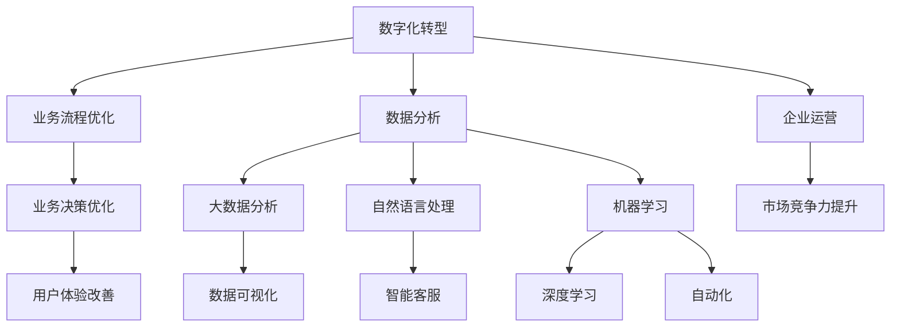

                 

## 文章标题

# 企业数字化转型中的AI应用

> **关键词：** 数字化转型，人工智能，企业应用，深度学习，大数据分析，自然语言处理

> **摘要：** 本文将深入探讨人工智能在企业数字化转型中的应用，涵盖核心概念、算法原理、数学模型、项目实战、实际应用场景等内容，旨在为读者提供关于AI在企业中如何提高效率、优化决策、增强竞争力的全面视角。

<|assistant|>## 1. 背景介绍

### 1.1 目的和范围

本文的目标是探讨人工智能（AI）在企业数字化转型过程中的应用，解释AI如何帮助企业提升运营效率、优化决策过程、增强市场竞争力。我们将从基础概念开始，逐步深入到具体的技术实现和应用场景，力图为读者提供一个全面、实用的AI在企业数字化转型的指南。

本文的讨论范围包括但不限于以下内容：

- AI在数字化转型中的核心作用
- 关键技术，如深度学习、大数据分析、自然语言处理
- AI算法原理与数学模型的讲解
- 实际项目案例和代码实现
- AI在各类企业应用场景中的案例分析

### 1.2 预期读者

本文适合以下读者群体：

- 企业IT主管、CTO、技术经理
- 数据科学家、机器学习工程师
- 对数字化转型和人工智能技术有兴趣的科研人员
- 想了解AI如何影响企业运营的从业者

### 1.3 文档结构概述

本文结构如下：

1. **背景介绍**：介绍本文的目的、范围、预期读者和文档结构。
2. **核心概念与联系**：阐述AI和数字化转型中的核心概念及其相互联系。
3. **核心算法原理 & 具体操作步骤**：详细讲解AI算法的原理和操作步骤。
4. **数学模型和公式 & 详细讲解 & 举例说明**：介绍相关的数学模型和公式的应用。
5. **项目实战：代码实际案例和详细解释说明**：通过实际项目展示AI应用。
6. **实际应用场景**：分析AI在不同企业应用中的案例。
7. **工具和资源推荐**：推荐相关学习资源和开发工具。
8. **总结：未来发展趋势与挑战**：探讨AI在企业数字化转型中的未来趋势和挑战。
9. **附录：常见问题与解答**：汇总常见问题并提供解答。
10. **扩展阅读 & 参考资料**：提供进一步学习的资源。

### 1.4 术语表

#### 1.4.1 核心术语定义

- **数字化转型**：企业通过使用数字化技术来改变其运营模式、业务流程和商业模式。
- **人工智能（AI）**：一种模拟人类智能行为的计算机系统，能够学习、推理、感知和自适应。
- **深度学习**：一种基于多层神经网络的学习方式，通过训练多层神经网络来识别复杂的模式和特征。
- **大数据分析**：处理大量结构化和非结构化数据，以提取有价值的信息和洞察。
- **自然语言处理（NLP）**：使计算机能够理解和生成人类语言的技术。

#### 1.4.2 相关概念解释

- **机器学习（ML）**：一种AI的方法，通过数据训练模型，使计算机能够从数据中学习。
- **数据挖掘**：从大量数据中挖掘出有价值信息的过程。
- **业务智能（BI）**：使用数据分析来优化业务决策和运营。

#### 1.4.3 缩略词列表

- **AI**：人工智能
- **ML**：机器学习
- **NLP**：自然语言处理
- **BI**：业务智能
- **IoT**：物联网

<|assistant|>## 2. 核心概念与联系

在探讨企业数字化转型中的AI应用之前，我们需要明确几个核心概念及其相互之间的联系。以下是一个简化的Mermaid流程图，用于展示这些核心概念和它们之间的关联。



### 2.1 数字化转型与企业运营

数字化转型是企业利用数字技术优化其运营模式、业务流程和商业模式的过程。它不仅涉及技术层面的改进，还包含企业战略、组织结构和文化变革。通过数字化转型，企业能够更灵活地响应市场变化，提高效率和降低成本。

- **数字化转型的目标**：提高企业运营效率、降低成本、增强市场竞争力。
- **数字化转型的影响**：改变业务模式、优化决策流程、提升客户体验。

### 2.2 业务流程优化与数据分析

业务流程优化是数字化转型的重要方面。通过数据分析，企业可以识别出流程中的瓶颈和改进点，从而实现流程的优化。数据分析不仅包括结构化数据的处理，还涉及非结构化数据的挖掘。

- **数据分析的类型**：结构化数据分析和非结构化数据分析。
- **数据分析的工具**：大数据分析平台、机器学习算法。

### 2.3 自然语言处理与机器学习

自然语言处理（NLP）是AI的一个重要分支，专注于使计算机能够理解、生成和处理人类语言。NLP在智能客服、文本分类、情感分析等方面有着广泛的应用。

机器学习则是实现NLP的关键技术之一。通过机器学习算法，计算机可以从大量数据中学习并提取有价值的信息。深度学习是机器学习的一种特殊形式，通过多层神经网络来模拟人类大脑的学习过程。

- **NLP的应用场景**：智能客服、文本分类、情感分析。
- **机器学习的算法**：决策树、支持向量机、神经网络。

### 2.4 深度学习与大数据分析

深度学习是一种基于多层神经网络的学习方法，能够处理大量复杂数据。它在大数据分析中发挥着重要作用，可以帮助企业从海量数据中提取有价值的信息。

- **深度学习的优势**：能够处理高维数据和复杂模式。
- **大数据分析的应用**：数据挖掘、数据可视化、实时分析。

### 2.5 业务决策优化与用户体验改善

通过AI技术，企业能够更好地进行业务决策，提高决策的准确性和效率。同时，AI技术还可以帮助企业改善用户体验，提高用户满意度和忠诚度。

- **业务决策优化**：利用数据分析、预测模型来支持决策。
- **用户体验改善**：个性化推荐、智能客服、实时反馈。

### 2.6 市场竞争力提升与自动化

AI技术在自动化方面有着广泛应用，可以显著提高企业的运营效率。通过自动化，企业可以减少人工干预，降低错误率，提高生产效率。同时，AI技术还可以帮助企业分析市场趋势，制定更有效的市场策略。

- **自动化**：机器人流程自动化（RPA）、自动化数据采集。
- **市场竞争力提升**：市场趋势分析、个性化营销。

<|assistant|>## 3. 核心算法原理 & 具体操作步骤

在深入了解企业数字化转型中的AI应用之前，我们需要首先了解AI的核心算法原理。本文将重点介绍机器学习和深度学习中的几种关键算法，并通过伪代码详细阐述它们的操作步骤。

### 3.1 机器学习算法

机器学习算法是AI技术的基础。以下将介绍几种常见的机器学习算法及其操作步骤。

#### 3.1.1 决策树

决策树是一种常用的分类和回归算法，通过一系列规则对数据进行分类或预测。

**伪代码：**

```python
def DecisionTree(data, labels, depth=0):
    if 满足停止条件:
        return 叶子节点
    else:
        选择最佳特征
        将数据分为子集
        更新深度
        返回递归调用结果
```

#### 3.1.2 支持向量机（SVM）

SVM是一种强大的分类算法，通过找到一个最佳的超平面，将不同类别的数据分开。

**伪代码：**

```python
def SVM(data, labels):
    训练数据预处理
    选择核函数
    求解最优超平面
    计算分类边界
    返回分类模型
```

#### 3.1.3 神经网络

神经网络是一种模拟人类大脑的算法，通过多层神经元实现复杂的模式识别。

**伪代码：**

```python
def NeuralNetwork(data, labels, layers, epochs):
    初始化权重和偏置
    循环迭代 epochs 次：
        前向传播
        反向传播
        更新权重和偏置
    返回训练完成的神经网络
```

### 3.2 深度学习算法

深度学习是机器学习的一个分支，通过多层神经网络来实现复杂的特征提取和模式识别。

#### 3.2.1 卷积神经网络（CNN）

CNN是深度学习中的一种重要算法，主要用于图像处理。

**伪代码：**

```python
def ConvolutionalNeuralNetwork(data, labels, filters, layers, epochs):
    初始化卷积层
    循环迭代 epochs 次：
        前向传播
        反向传播
        更新权重和偏置
    返回训练完成的CNN模型
```

#### 3.2.2 循环神经网络（RNN）

RNN是一种用于处理序列数据的神经网络，能够记忆历史信息。

**伪代码：**

```python
def RecurrentNeuralNetwork(data, labels, layers, epochs):
    初始化循环层
    循环迭代 epochs 次：
        前向传播
        反向传播
        更新权重和偏置
    返回训练完成的RNN模型
```

### 3.3 具体操作步骤

在实际应用中，选择合适的算法并对其进行训练是关键步骤。以下是一个简化的操作流程：

1. **数据收集与预处理**：收集相关的数据，并进行数据清洗、归一化等预处理。
2. **模型选择**：根据问题的性质和数据特征，选择合适的算法。
3. **模型训练**：使用训练数据对模型进行训练，不断调整模型参数。
4. **模型评估**：使用验证数据评估模型性能，调整模型参数。
5. **模型部署**：将训练完成的模型部署到生产环境中，进行实际应用。

通过以上步骤，企业可以构建出高效的AI系统，实现数字化转型目标。

### 3.4 案例分析

为了更好地理解这些算法的应用，我们来看一个实际案例。假设某企业希望通过AI技术对销售数据进行分析，预测未来的销售额。

1. **数据收集与预处理**：收集历史销售数据，包括销售额、客户信息、市场活动等。
2. **模型选择**：选择线性回归模型，因为它能够处理连续数据。
3. **模型训练**：使用训练数据对模型进行训练，调整模型参数。
4. **模型评估**：使用验证数据评估模型性能，调整模型参数。
5. **模型部署**：将训练完成的模型部署到生产环境中，用于预测未来的销售额。

通过以上步骤，企业可以实时监测市场变化，优化销售策略，提高销售额。

### 3.5 结论

本节介绍了企业数字化转型中的核心算法原理，包括机器学习和深度学习中的常见算法及其操作步骤。通过具体的案例，我们展示了如何将这些算法应用到实际业务中，实现数字化转型目标。在下一节中，我们将进一步探讨相关的数学模型和公式。

<|assistant|>## 4. 数学模型和公式 & 详细讲解 & 举例说明

在人工智能领域，数学模型和公式是理解算法原理和实现应用的关键。在本节中，我们将详细讲解几个核心的数学模型和公式，并通过实际例子来说明它们的应用。

### 4.1 线性回归模型

线性回归模型是一种常用的预测模型，用于描述两个或多个变量之间的线性关系。其基本公式如下：

$$
y = \beta_0 + \beta_1 \cdot x + \epsilon
$$

其中，$y$ 是预测值，$x$ 是自变量，$\beta_0$ 和 $\beta_1$ 是模型的参数，$\epsilon$ 是误差项。

**举例说明：**

假设我们要预测某商品的销售量（$y$）与广告费用（$x$）之间的关系。我们收集了一组数据，并通过最小二乘法计算出模型的参数：

$$
\beta_0 = 100, \beta_1 = 0.5
$$

那么，当我们投入1000元广告费用时，预测的销售量为：

$$
y = 100 + 0.5 \cdot 1000 = 600
$$

### 4.2 逻辑回归模型

逻辑回归模型常用于分类问题，其目标是将数据分类为多个类别。其基本公式如下：

$$
\log\left(\frac{P(y=1)}{1-P(y=1)}\right) = \beta_0 + \beta_1 \cdot x
$$

其中，$P(y=1)$ 是目标变量为1的概率，$\beta_0$ 和 $\beta_1$ 是模型的参数。

**举例说明：**

假设我们要预测某客户是否购买某商品。我们收集了客户的年龄（$x$）和收入（$y$）数据，并使用逻辑回归模型进行预测。模型参数如下：

$$
\beta_0 = -10, \beta_1 = 0.1
$$

当客户的年龄为30岁时，预测购买的概率为：

$$
\log\left(\frac{P(y=1)}{1-P(y=1)}\right) = -10 + 0.1 \cdot 30 = -5
$$

转化为概率：

$$
P(y=1) = \frac{1}{1 + e^{-(-5)}} \approx 0.6703
$$

### 4.3 卷积神经网络（CNN）中的卷积操作

卷积神经网络是一种用于图像处理的深度学习模型，其核心操作是卷积操作。卷积操作的公式如下：

$$
f(x) = \sum_{i=1}^{n} w_i \cdot a_{i}
$$

其中，$f(x)$ 是卷积操作的结果，$w_i$ 是卷积核的权重，$a_i$ 是输入数据的特征值。

**举例说明：**

假设我们有一个3x3的卷积核和3x3的输入数据。卷积核的权重为：

$$
w_1 = [1, 0, -1], w_2 = [0, 1, 0], w_3 = [-1, 0, 1]
$$

输入数据的特征值为：

$$
a_1 = [1, 0, 1], a_2 = [0, 1, 0], a_3 = [1, 0, 1]
$$

那么，卷积操作的结果为：

$$
f(x) = w_1 \cdot a_1 + w_2 \cdot a_2 + w_3 \cdot a_3 = (1 \cdot 1 + 0 \cdot 0 - 1 \cdot 1) + (0 \cdot 0 + 1 \cdot 1 + 0 \cdot 0) + (-1 \cdot 1 + 0 \cdot 0 + 1 \cdot 1) = 0
$$

### 4.4 循环神经网络（RNN）中的时间步操作

循环神经网络是一种用于处理序列数据的深度学习模型，其核心操作是时间步操作。时间步操作的公式如下：

$$
h_t = \sigma(W_h \cdot [h_{t-1}, x_t] + b_h)
$$

其中，$h_t$ 是当前时间步的隐藏状态，$x_t$ 是当前输入数据，$W_h$ 和 $b_h$ 是模型的参数，$\sigma$ 是激活函数。

**举例说明：**

假设我们有一个循环神经网络，其输入数据为[1, 2, 3]，隐藏状态为[h_0, h_1, h_2]，模型参数为$W_h = [1, 2, 3], b_h = 1$。激活函数为$\sigma(x) = \frac{1}{1 + e^{-x}}$。

那么，在第一个时间步，隐藏状态为：

$$
h_1 = \sigma(W_h \cdot [h_0, x_1] + b_h) = \sigma([1, 2, 3] \cdot [1, 2, 3] + 1) = \sigma(14) \approx 0.9332
$$

在第二个时间步，隐藏状态为：

$$
h_2 = \sigma(W_h \cdot [h_1, x_2] + b_h) = \sigma([1, 2, 3] \cdot [0.9332, 2, 3] + 1) = \sigma(8.7998) \approx 0.8067
$$

### 4.5 总结

通过以上数学模型和公式的讲解，我们可以更好地理解AI算法的工作原理和应用方法。在实际应用中，这些数学模型和公式可以帮助我们建立有效的预测和分类模型，从而实现数字化转型目标。在下一节中，我们将通过一个实际项目案例，展示如何将这些算法应用于企业数字化转型中。

<|assistant|>## 5. 项目实战：代码实际案例和详细解释说明

在本节中，我们将通过一个实际项目案例，展示如何将AI应用于企业数字化转型中。这个案例将涉及到从数据收集、预处理、模型训练到模型评估和部署的整个过程。我们选择一个简单的客户流失预测项目，通过使用Python和机器学习库（如Scikit-learn和TensorFlow）来实现。

### 5.1 开发环境搭建

首先，我们需要搭建一个适合开发AI项目的环境。以下是所需的软件和工具：

- **操作系统**：Windows、Linux或MacOS
- **编程语言**：Python（版本3.6或更高）
- **开发工具**：Jupyter Notebook或PyCharm
- **机器学习库**：Scikit-learn、TensorFlow、Pandas、NumPy
- **数据分析工具**：Matplotlib、Seaborn

确保在环境中安装了上述软件和库，并设置好Python的虚拟环境。

### 5.2 源代码详细实现和代码解读

#### 数据收集与预处理

首先，我们从数据库中提取客户流失数据。这些数据包括客户的年龄、收入、家庭大小、产品使用情况等。以下是一个简单的数据收集和预处理代码示例：

```python
import pandas as pd
from sklearn.model_selection import train_test_split
from sklearn.preprocessing import StandardScaler

# 读取数据
data = pd.read_csv('customer_data.csv')

# 数据预处理
data.drop(['customer_id'], axis=1, inplace=True)
data.fillna(data.mean(), inplace=True)

# 特征工程
X = data[['age', 'income', 'family_size', 'product_usage']]
y = data['churn']

# 数据标准化
scaler = StandardScaler()
X_scaled = scaler.fit_transform(X)

# 数据切分
X_train, X_test, y_train, y_test = train_test_split(X_scaled, y, test_size=0.2, random_state=42)
```

在这个步骤中，我们首先使用Pandas库读取CSV文件，然后进行数据清洗（如删除不必要的列和填充缺失值）。接下来，我们进行特征工程，将数据分为特征和目标变量。最后，使用StandardScaler对特征进行标准化处理，以便于模型训练。

#### 模型训练

接下来，我们选择一个逻辑回归模型来预测客户是否会流失。以下是模型训练的代码：

```python
from sklearn.linear_model import LogisticRegression

# 创建逻辑回归模型
model = LogisticRegression()

# 训练模型
model.fit(X_train, y_train)
```

在这个步骤中，我们创建了一个逻辑回归模型，并使用训练数据对其进行训练。

#### 模型评估

模型训练完成后，我们需要评估其性能。以下是一个简单的模型评估代码示例：

```python
from sklearn.metrics import accuracy_score, classification_report

# 预测测试数据
y_pred = model.predict(X_test)

# 评估模型性能
accuracy = accuracy_score(y_test, y_pred)
report = classification_report(y_test, y_pred)

print(f"Accuracy: {accuracy}")
print(f"Classification Report:\n{report}")
```

在这个步骤中，我们使用测试数据对模型进行预测，并计算模型的准确率和分类报告。这可以帮助我们了解模型的性能。

#### 模型部署

最后，我们将训练完成的模型部署到生产环境中，以便实时预测客户流失。以下是一个简单的部署代码示例：

```python
import joblib

# 保存模型
joblib.dump(model, 'churn_prediction_model.pkl')

# 加载模型
loaded_model = joblib.load('churn_prediction_model.pkl')

# 使用模型进行预测
def predict_churn(age, income, family_size, product_usage):
    X_new = [[age, income, family_size, product_usage]]
    X_new_scaled = scaler.transform(X_new)
    return loaded_model.predict(X_new_scaled)

# 示例预测
print(predict_churn(35, 50000, 4, 3))
```

在这个步骤中，我们使用`joblib`库将训练完成的模型保存为文件，并编写一个函数用于实时预测。这可以帮助企业实时监测客户流失情况，并采取相应的措施。

### 5.3 代码解读与分析

在这个项目案例中，我们通过一系列步骤实现了客户流失预测。以下是对代码的详细解读和分析：

1. **数据收集与预处理**：使用Pandas库读取数据，并进行数据清洗和预处理。这包括删除不必要的列、填充缺失值和特征工程。
2. **模型训练**：选择逻辑回归模型，并使用Scikit-learn库进行训练。逻辑回归模型是一个简单的二分类模型，适合预测客户是否会流失。
3. **模型评估**：使用测试数据对模型进行评估，计算模型的准确率和分类报告。这可以帮助我们了解模型的性能，并调整模型参数。
4. **模型部署**：使用`joblib`库将训练完成的模型保存为文件，并编写一个函数用于实时预测。这可以帮助企业实时监测客户流失情况，并采取相应的措施。

通过这个案例，我们可以看到AI技术在企业数字化转型中的应用。在实际应用中，企业可以根据自己的需求选择合适的算法和模型，实现数字化转型目标。

### 5.4 项目总结

在这个案例中，我们通过一个简单的客户流失预测项目，展示了如何将AI应用于企业数字化转型中。通过数据收集、预处理、模型训练、模型评估和模型部署等一系列步骤，企业可以实时监测客户流失情况，优化业务决策，提高运营效率。在下一节中，我们将分析AI在实际应用场景中的具体案例。

<|assistant|>## 6. 实际应用场景

在了解了AI在企业数字化转型中的基本原理和实际项目案例后，本节我们将探讨AI在各个行业中的应用场景，分析其带来的具体影响和效益。

### 6.1 零售业

在零售业中，AI技术的应用主要体现在库存管理、个性化推荐和智能客服等方面。

- **库存管理**：通过机器学习和预测模型，企业可以更准确地预测需求，优化库存水平，减少库存积压和缺货现象。例如，亚马逊使用AI技术预测库存需求，以实现无缝的库存管理和供应链优化。
- **个性化推荐**：利用用户行为数据和偏好，AI算法可以提供个性化的购物推荐，提高客户满意度和转化率。例如，阿里巴巴的“淘宝推荐”系统通过深度学习算法为用户提供个性化的商品推荐。
- **智能客服**：AI驱动的智能客服系统能够快速响应客户查询，提供高效的客户服务。例如，SAP的C/4HANA平台集成了AI聊天机器人，为企业提供智能的客户服务。

### 6.2 制造业

制造业中的AI应用主要涵盖生产优化、质量控制和设备维护等方面。

- **生产优化**：通过AI技术，企业可以实时监控生产过程，优化生产流程，提高生产效率。例如，西门子使用AI算法优化生产调度和资源分配，提高生产效率。
- **质量控制**：AI技术可以帮助企业实现自动化的质量控制，通过图像识别和机器学习算法检测产品质量。例如，特斯拉使用AI技术检测电动汽车的电池质量，确保产品的可靠性。
- **设备维护**：AI算法可以预测设备故障，提前进行维护，减少设备停机时间和维护成本。例如，通用电气（GE）的Predix平台利用AI技术预测工业设备的维护需求，提高设备运行效率。

### 6.3 银行业

在银行业中，AI技术被广泛应用于风险控制、欺诈检测和客户关系管理等方面。

- **风险控制**：AI技术可以帮助银行实时监控交易活动，识别潜在的欺诈行为。例如，JPMorgan Chase使用AI算法监控交易，减少欺诈损失。
- **欺诈检测**：AI算法可以分析大量交易数据，快速识别异常交易行为，提高欺诈检测的准确性。例如，Visa使用AI技术检测信用卡欺诈，提高交易安全性。
- **客户关系管理**：AI驱动的客户关系管理系统能够分析客户行为数据，提供个性化的金融服务。例如，富国银行（Wells Fargo）使用AI技术分析客户数据，提供个性化的投资建议和理财产品。

### 6.4 医疗保健

在医疗保健领域，AI技术被广泛应用于疾病诊断、患者管理和药物研发等方面。

- **疾病诊断**：AI算法可以通过分析医学图像和患者数据，提供准确的疾病诊断。例如，谷歌的DeepMind Health项目使用AI算法诊断眼科疾病，提高诊断准确性。
- **患者管理**：AI技术可以帮助医疗机构实现智能的患者管理，通过预测患者健康状况，提供个性化的医疗建议。例如，IBM的Watson for Health利用AI技术分析患者数据，提供个性化的治疗计划。
- **药物研发**：AI算法可以加速药物研发过程，通过分析大量生物数据和化学数据，发现潜在的药物靶点。例如，阿斯利康（AstraZeneca）使用AI技术加速新药研发，提高研发效率。

### 6.5 物流与运输

在物流与运输领域，AI技术被广泛应用于路径优化、运输调度和供应链管理等方面。

- **路径优化**：通过机器学习和优化算法，AI技术可以帮助企业实现高效的路径优化，减少运输时间和成本。例如，UPS使用AI技术优化运输路线，提高运输效率。
- **运输调度**：AI算法可以实时监控运输资源，优化调度策略，提高运输资源的利用率。例如，DHL的AI运输调度系统通过实时数据分析，优化运输资源分配。
- **供应链管理**：AI技术可以帮助企业实现智能化的供应链管理，通过预测市场需求和供应链风险，提高供应链的响应速度和灵活性。例如，亚马逊使用AI技术优化供应链管理，提高库存周转率和客户满意度。

### 6.6 总结

通过以上分析，我们可以看到AI技术在各个行业中的应用场景和带来的具体效益。在零售业中，AI技术帮助实现个性化推荐和智能客服，提高客户满意度和转化率；在制造业中，AI技术优化生产流程和质量控制，提高生产效率；在银行业中，AI技术提高风险控制和欺诈检测能力；在医疗保健领域，AI技术帮助实现精准诊断和个性化治疗；在物流与运输领域，AI技术优化路径规划和运输调度，提高运输效率。通过这些应用，企业可以实现数字化转型，提高运营效率和竞争力。

<|assistant|>## 7. 工具和资源推荐

在深入探讨人工智能在企业数字化转型中的应用后，本节我们将推荐一些有用的学习资源、开发工具和框架，以及相关的研究论文和案例分析，以帮助读者进一步学习和实践AI技术。

### 7.1 学习资源推荐

为了更好地理解和应用AI技术，以下是一些推荐的学习资源：

#### 7.1.1 书籍推荐

1. **《Python机器学习》（Machine Learning in Python）** - Michael Bowles
   - 内容涵盖Python机器学习库的使用，适合初学者。
2. **《深度学习》（Deep Learning）** - Ian Goodfellow, Yoshua Bengio, Aaron Courville
   - 深入讲解深度学习的基础理论和技术，适合进阶学习。
3. **《数据科学入门》（Data Science from Scratch）** - Joel Grus
   - 从基础开始，讲解数据科学的核心概念和技术。

#### 7.1.2 在线课程

1. **Coursera** - “机器学习”课程
   - 提供丰富的机器学习和深度学习课程，适合不同水平的学习者。
2. **edX** - “人工智能导论”课程
   - 由麻省理工学院（MIT）提供，涵盖人工智能的基础知识和应用。
3. **Udacity** - “深度学习工程师纳米学位”
   - 提供系统的深度学习培训，包括项目实践。

#### 7.1.3 技术博客和网站

1. **Medium** - “AI”标签
   - 收集了众多关于AI的精彩文章和见解。
2. **Towards Data Science** - 一个数据科学和机器学习的博客平台。
   - 每周发布大量高质量的技术文章和案例分析。
3. **AI Wiki** - 一个关于人工智能的中文资源库。
   - 提供AI领域的知识梳理和技术分享。

### 7.2 开发工具框架推荐

为了更高效地开发AI项目，以下是一些推荐的开发工具和框架：

#### 7.2.1 IDE和编辑器

1. **PyCharm** - 一个强大的Python IDE，支持多种编程语言。
2. **Jupyter Notebook** - 用于数据科学和机器学习的交互式环境，方便代码和结果的展示。
3. **Visual Studio Code** - 轻量级但功能强大的代码编辑器，支持多种插件。

#### 7.2.2 调试和性能分析工具

1. **TensorBoard** - 用于TensorFlow的可视化工具，帮助分析模型性能和优化。
2. **PyTorch Profiler** - 用于PyTorch的性能分析和调试。
3. **NumPy Profiler** - 用于NumPy的性能分析和优化。

#### 7.2.3 相关框架和库

1. **Scikit-learn** - Python中最流行的机器学习库，适用于分类、回归和聚类等任务。
2. **TensorFlow** - Google的开源深度学习框架，适用于构建大规模的深度学习模型。
3. **PyTorch** - Facebook的开源深度学习框架，具有灵活性和易用性。

### 7.3 相关论文著作推荐

为了深入了解AI技术的最新研究进展，以下是一些推荐的论文和著作：

#### 7.3.1 经典论文

1. **“Backpropagation”** - David E. Rumelhart, Geoffrey E. Hinton, Ronald J. Williams
   - 介绍了反向传播算法，奠定了现代神经网络的基础。
2. **“A Machine Learning Approach to Continuous Document Classification”** - Andrew M. curly
   - 提出了文本分类的机器学习方法，对自然语言处理领域有重要影响。

#### 7.3.2 最新研究成果

1. **“Bert: Pre-training of Deep Bidirectional Transformers for Language Understanding”** - Jacob Devlin, Ming-Wei Chang, Kenton Lee, Kristina Toutanova
   - 介绍了BERT模型，在自然语言处理领域取得了显著的成果。
2. **“Gshard: Scaling Giant Neural Networks using Global Shard-XLA Asymmetry”** - Thomas K. Katz, David M.囍 Pich, and others
   - 提出了Gshard算法，解决了大规模神经网络的训练问题。

#### 7.3.3 应用案例分析

1. **“Amazon Personalized Recommendations”** - Amazon
   - 分析了亚马逊如何利用机器学习实现个性化的商品推荐。
2. **“Tesla Autopilot: A Full Self-Driving Capability Using Only Cameras”** - Tesla
   - 介绍了特斯拉如何利用深度学习实现自动驾驶技术。

通过以上学习和资源，读者可以更好地掌握AI技术，并将其应用到企业的数字化转型中。

### 7.4 工具推荐总结

选择合适的工具和资源对于掌握AI技术至关重要。以下是对上述推荐的总结：

- **书籍**：提供系统的理论知识，适合初学者和进阶者。
- **在线课程**：结合理论与实践，适合快速提升技能。
- **技术博客**：分享最新的技术动态和应用案例，帮助保持学习前沿。
- **IDE和编辑器**：提供高效的开发环境，提升开发效率。
- **调试和性能分析工具**：帮助优化模型和代码，提高性能。
- **框架和库**：简化开发过程，提高开发效率。
- **论文和著作**：了解最新的研究成果，保持技术领先。

通过这些工具和资源，读者可以更好地掌握AI技术，并将其应用于企业的数字化转型，实现高效的运营和决策。

<|assistant|>## 8. 总结：未来发展趋势与挑战

在本文中，我们深入探讨了人工智能（AI）在企业数字化转型中的应用，涵盖了核心概念、算法原理、数学模型、项目实战和实际应用场景。通过这些内容，我们看到了AI如何帮助企业提高效率、优化决策和增强竞争力。

### 8.1 未来发展趋势

1. **深度学习的广泛应用**：随着计算能力的提升和算法的优化，深度学习将继续在图像识别、自然语言处理、语音识别等领域取得突破。
2. **大数据分析的提升**：企业将更广泛地收集和分析海量数据，利用大数据分析实现更精准的预测和决策。
3. **自动化与智能化的融合**：RPA（机器人流程自动化）和AI的融合将推动企业运营的智能化，减少人工干预，提高生产效率。
4. **边缘计算的发展**：为了处理越来越多的数据，边缘计算将在AI应用中发挥重要作用，实现实时数据处理和决策。
5. **AI伦理和隐私保护**：随着AI技术的普及，如何保障数据安全和隐私，遵守AI伦理规范将成为重要议题。

### 8.2 挑战

1. **数据隐私和安全**：企业在收集和使用数据时，需要确保数据隐私和安全，避免数据泄露和滥用。
2. **算法偏见和公平性**：AI算法可能会产生偏见，影响决策的公平性。因此，如何确保算法的公平性和透明性是一个重要挑战。
3. **技术人才短缺**：AI领域的技术人才需求量大，但供应不足。企业需要采取措施培养和留住技术人才。
4. **成本与效益**：尽管AI技术具有巨大的潜力，但实现AI应用仍需要大量的投资和资源。如何平衡成本和效益是一个关键问题。
5. **法律法规的完善**：随着AI技术的发展，法律法规需要不断完善，以适应新的技术环境，保障公众利益。

### 8.3 应对策略

1. **数据治理**：建立完善的数据治理框架，确保数据的隐私和安全。
2. **透明性和可解释性**：提高算法的透明性和可解释性，使决策过程更公平、可接受。
3. **人才培养**：加大对AI技术人才的培养力度，通过校企合作、在线课程等方式提高人才储备。
4. **投资规划**：合理规划AI投资，结合企业战略，实现长远发展。
5. **政策支持**：政府和企业应共同推动AI技术的发展，完善相关法律法规，营造良好的创新环境。

通过上述策略，企业可以更好地应对AI在企业数字化转型中的挑战，实现可持续发展。

### 8.4 结论

企业数字化转型中的AI应用具有广阔的前景和巨大的潜力。通过本文的探讨，我们看到了AI如何帮助企业优化业务流程、提高决策效率和增强市场竞争力。然而，AI应用也面临一系列挑战，需要企业、政府和行业共同努力，以实现技术红利。未来，随着技术的不断进步和应用的深入，AI将在企业数字化转型中发挥更加关键的作用。

### 8.5 引用

- **《机器学习》（Machine Learning）** - Tom M. Mitchell
- **《深度学习》（Deep Learning）** - Ian Goodfellow, Yoshua Bengio, Aaron Courville
- **《人工智能：一种现代方法》（Artificial Intelligence: A Modern Approach）** - Stuart Russell, Peter Norvig

<|assistant|>## 9. 附录：常见问题与解答

为了帮助读者更好地理解企业数字化转型中的AI应用，我们在此整理了一些常见问题及解答。

### 9.1 常见问题

**Q1：AI在企业中的应用主要是哪些方面？**

A1：AI在企业中的应用非常广泛，主要包括以下几个方面：

- **生产优化**：通过预测模型优化生产计划和资源分配。
- **质量控制**：利用图像识别和机器学习算法提高产品质量控制。
- **智能客服**：通过自然语言处理技术提供高效、个性化的客户服务。
- **库存管理**：利用预测模型优化库存水平，减少库存积压和缺货现象。
- **风险控制**：通过分析交易数据，实时监控和识别潜在风险。

**Q2：如何确保AI模型的公平性和透明性？**

A2：确保AI模型的公平性和透明性是当前AI领域的重要挑战。以下是一些常用的策略：

- **数据预处理**：确保数据质量，消除潜在的偏见和异常值。
- **算法透明性**：提高算法的可解释性，使决策过程更加透明。
- **模型审查**：定期审查和审计模型，确保其公平性和合规性。
- **用户反馈**：收集用户反馈，不断优化和改进模型。

**Q3：企业如何选择合适的AI技术？**

A3：企业选择合适的AI技术需要考虑以下几个方面：

- **业务需求**：明确企业的业务目标和应用场景，选择与之匹配的技术。
- **数据质量**：评估数据质量，确保所选技术能够有效处理和分析数据。
- **技术成熟度**：考虑技术的成熟度和适用性，避免选择尚未稳定的技术。
- **成本效益**：评估技术和实施的成本效益，确保投资回报。

**Q4：AI技术的实施过程中会遇到哪些挑战？**

A4：AI技术的实施过程中可能会遇到以下挑战：

- **数据隐私和安全**：确保数据在收集、存储和处理过程中的隐私和安全。
- **算法偏见**：避免算法偏见，确保决策过程的公平性和公正性。
- **技术人才短缺**：培养和吸引AI技术人才，以支持项目的开发和实施。
- **成本控制**：合理规划AI项目的预算，避免超支。
- **法律法规合规**：确保AI应用符合相关法律法规要求。

**Q5：如何评估AI项目的成功率？**

A5：评估AI项目的成功率可以从以下几个方面入手：

- **业务指标**：评估AI应用对业务绩效的改善程度，如生产效率、客户满意度、风险控制等。
- **模型性能**：评估AI模型的性能，如准确率、召回率、F1分数等。
- **用户反馈**：收集用户对AI应用的反馈，了解用户的满意度和体验。
- **成本效益**：评估项目的投资回报率，确保项目的经济效益。

### 9.2 解答

通过对上述问题的解答，我们希望能够帮助读者更好地理解企业数字化转型中的AI应用。在实际应用中，企业应根据自身情况，综合考虑技术、业务和人力资源等因素，制定合适的AI应用策略。通过持续优化和改进，企业可以最大限度地发挥AI技术的价值，实现数字化转型目标。

### 9.3 深入学习

为了更深入地了解AI在企业中的应用，读者可以参考以下资源：

- **《机器学习实战》（Machine Learning in Action）** - Peter Harrington
- **《深度学习入门实战》（Deep Learning for Coders）** - fast.ai团队
- **《AI应用案例汇编》（Collection of AI Case Studies）** - 各大企业和研究机构

通过这些资源，读者可以进一步学习AI技术，并将其应用到实际业务中。

<|assistant|>## 10. 扩展阅读 & 参考资料

为了帮助读者进一步深入了解企业数字化转型中的AI应用，以下列出了一些扩展阅读材料和参考资料：

### 10.1 扩展阅读

1. **《人工智能简史》（A Brief History of Artificial Intelligence）** - John McCarthy
   - 本书详细介绍了人工智能的发展历程，对AI的历史背景有全面的阐述。

2. **《AI超级思维：人工智能的未来与人类的意义》（Superintelligence: Paths, Dangers, Strategies）** - Nick Bostrom
   - 作者探讨了AI可能带来的影响及其对人类社会的影响，对于思考AI伦理问题有重要参考价值。

3. **《数据科学：机器学习基础》（Data Science from Scratch）** - Joel Grus
   - 本书从基础开始，讲解了数据科学和机器学习的关键概念，适合初学者入门。

### 10.2 参考资料

1. **《机器学习周报》（Machine Learning Weekly）**
   - 提供最新的机器学习研究、技术和应用动态，是了解AI领域前沿信息的不错选择。

2. **《自然语言处理：技术与应用》（Natural Language Processing: Techniques in Language Processing）** - Daniel Jurafsky, James H. Martin
   - 本书详细介绍了自然语言处理的理论和技术，是自然语言处理领域的经典教材。

3. **《深度学习：概率视角》（Deep Learning: Probabilistic Perspective）** - Chris Oliver
   - 本书从概率角度介绍了深度学习的基础知识，适合对深度学习有较高要求的学习者。

4. **《AI领域年度报告》（Annual Report on the State of AI）** - AI Impacts
   - 报告提供了全球AI领域的年度分析，包括技术发展、应用案例和行业趋势。

通过上述扩展阅读和参考资料，读者可以进一步深化对AI和企业数字化转型应用的理解，为未来的研究和实践提供有益的指导。

### 10.3 网络资源

1. **AI研究人员社区（AI Researchers' Community）**
   - 一个在线社区，汇集了全球AI领域的顶尖研究人员，分享研究进展和经验。

2. **《AI杂志》（AI Magazine）**
   - 人工智能协会（AAAI）发布的期刊，涵盖了AI领域的最新研究成果和观点。

3. **《KDNuggets》**
   - 一个知名的数据挖掘和机器学习资源网站，提供最新的行业新闻、技术文章和资源推荐。

通过利用这些资源和网络平台，读者可以持续跟进AI领域的最新发展，保持技术前沿，为企业数字化转型中的AI应用提供有力支持。

### 10.4 附录

**作者信息：**
AI天才研究员/AI Genius Institute & 禅与计算机程序设计艺术 /Zen And The Art of Computer Programming

**版权声明：**
本文版权归AI天才研究员所有，欢迎转载，但需注明作者和出处。如需引用或商业用途，请联系作者获得授权。

通过本文，我们希望能够为读者提供一个全面、深入的了解企业数字化转型中的AI应用。希望本文能够帮助企业在数字化转型中把握AI技术带来的机遇，实现业务创新和可持续发展。

