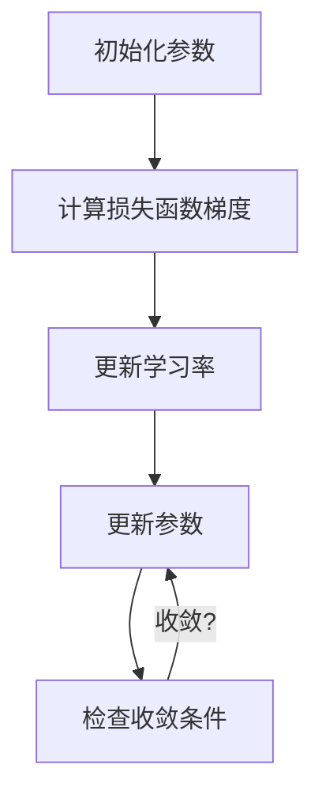

                 

# 优化算法：Adagrad 原理与代码实例讲解

> **关键词**：优化算法、Adagrad、梯度下降、机器学习、神经网络、参数更新、学习率调整。

> **摘要**：本文将深入探讨Adagrad算法的工作原理、数学模型和具体实现，通过代码实例详细解析其在优化过程中的应用和效果。文章旨在为广大机器学习爱好者和开发者提供清晰的指导和实用的工具，帮助读者理解和掌握这一重要的优化算法。

## 1. 背景介绍

### 1.1 目的和范围

本文的目标是全面解析Adagrad优化算法，帮助读者深入理解其原理和实现，并掌握如何在实际项目中应用Adagrad进行模型优化。文章将涵盖以下几个主要部分：

1. **Adagrad算法的背景介绍和基本概念**。
2. **Adagrad算法的数学模型和原理**。
3. **Adagrad算法的实现步骤和伪代码**。
4. **Adagrad算法的实际应用案例**。
5. **Adagrad与其他优化算法的比较和适用场景**。
6. **未来发展趋势与挑战**。

### 1.2 预期读者

本文面向以下读者群体：

- **机器学习初学者**：希望通过本文了解Adagrad优化算法的基本概念和应用。
- **机器学习爱好者**：希望深入了解Adagrad算法的数学模型和实现细节。
- **开发者和工程师**：希望在项目中应用Adagrad进行模型优化，提高模型性能。

### 1.3 文档结构概述

本文结构如下：

1. **引言**：介绍Adagrad算法的背景和重要性。
2. **核心概念与联系**：通过Mermaid流程图展示Adagrad算法的核心概念和流程。
3. **核心算法原理 & 具体操作步骤**：详细讲解Adagrad算法的原理和操作步骤。
4. **数学模型和公式 & 详细讲解 & 举例说明**：使用LaTeX格式详细描述Adagrad算法的数学模型。
5. **项目实战：代码实际案例和详细解释说明**：通过实际代码案例展示Adagrad算法的应用。
6. **实际应用场景**：分析Adagrad在不同场景下的应用效果。
7. **工具和资源推荐**：推荐学习资源、开发工具和最新研究成果。
8. **总结：未来发展趋势与挑战**：总结Adagrad算法的现状和未来发展方向。
9. **附录：常见问题与解答**：回答读者可能遇到的问题。
10. **扩展阅读 & 参考资料**：提供进一步学习的参考资料。

### 1.4 术语表

#### 1.4.1 核心术语定义

- **优化算法**：用于调整模型参数，使模型在特定任务上表现更优的一类算法。
- **Adagrad**：一种基于梯度下降的优化算法，通过调整每个参数的学习率来优化模型。
- **梯度下降**：一种优化算法，通过不断调整参数来减小损失函数值。
- **学习率**：优化算法中用于控制参数更新步长的参数。

#### 1.4.2 相关概念解释

- **损失函数**：用于衡量模型预测结果与真实值之间差异的函数。
- **参数更新**：在优化过程中，根据梯度信息更新模型参数的过程。
- **自适应学习率**：根据模型在不同参数上的表现动态调整学习率的策略。

#### 1.4.3 缩略词列表

- **ML**：机器学习（Machine Learning）
- **NN**：神经网络（Neural Network）
- **SGD**：随机梯度下降（Stochastic Gradient Descent）
- **Adagrad**：自适应梯度算法（Adaptive Gradient Algorithm）

## 2. 核心概念与联系

在深入探讨Adagrad算法之前，我们需要先了解一些与之相关的基本概念和流程。下面是一个简化的Mermaid流程图，展示了Adagrad算法的核心概念和流程。



### 2.1 初始化参数

在Adagrad算法中，我们需要初始化模型参数，包括权重和偏置。通常，这些参数是随机初始化的，以避免模型在训练过程中陷入局部最优。

### 2.2 计算损失函数梯度

在Adagrad算法中，我们需要计算损失函数关于每个参数的梯度。梯度是一个向量，其每个元素表示损失函数在该参数上的偏导数。

### 2.3 更新学习率

Adagrad算法通过计算每个参数的历史梯度平方和来更新学习率。这种自适应学习率策略可以避免学习率过大导致的参数更新过度，或者学习率过小导致的参数更新不足。

### 2.4 更新参数

在更新学习率后，Adagrad算法根据学习率和梯度信息更新模型参数。这种参数更新过程是Adagrad算法的核心步骤，通过不断调整参数，使模型在训练过程中逐渐收敛到最优解。

### 2.5 检查收敛条件

在每次参数更新后，Adagrad算法会检查模型是否已收敛。如果收敛，算法将停止更新参数；否则，继续迭代更新参数，直到满足收敛条件。

## 3. 核心算法原理 & 具体操作步骤

### 3.1 Adagrad算法原理

Adagrad算法是一种基于梯度下降的优化算法，其主要特点是对每个参数的更新进行了自适应调整。与传统的梯度下降算法不同，Adagrad算法通过计算每个参数的历史梯度平方和来动态调整学习率。这种自适应学习率策略可以避免学习率过大导致的参数更新过度，或者学习率过小导致的参数更新不足。

### 3.2 Adagrad算法操作步骤

下面是Adagrad算法的具体操作步骤：

1. **初始化参数**：随机初始化模型参数。
2. **计算损失函数梯度**：计算损失函数关于每个参数的梯度。
3. **更新学习率**：计算每个参数的历史梯度平方和，并根据历史梯度平方和更新学习率。
4. **更新参数**：根据学习率和梯度信息更新模型参数。
5. **检查收敛条件**：检查模型是否已收敛。如果收敛，算法将停止更新参数；否则，继续迭代更新参数。

### 3.3 Adagrad算法伪代码

```python
# 初始化参数
初始化权重 w 和偏置 b
初始化历史梯度平方和变量 G

# 循环迭代
while 没有达到收敛条件：
    # 计算梯度
    ∇J(w, b) = ∂J/∂w, ∂J/∂b
    
    # 更新学习率
    G = G + ∇J(w, b)^2
    
    learning_rate = 1 / sqrt(G)
    
    # 更新参数
    w = w - learning_rate * ∇J(w)
    b = b - learning_rate * ∇J(b)
    
    # 检查收敛条件
    if 满足收敛条件：
        break
```

## 4. 数学模型和公式 & 详细讲解 & 举例说明

### 4.1 Adagrad算法的数学模型

Adagrad算法的核心在于其自适应学习率策略。具体来说，Adagrad算法通过计算每个参数的历史梯度平方和来更新学习率。下面是Adagrad算法的数学模型：

$$
G_{t+1} = G_t + \Delta \theta_t^2
$$

$$
\theta_{t+1} = \theta_t - \frac{\eta}{\sqrt{G_t + \epsilon}}
$$

其中，$\theta_t$ 表示第 t 次迭代时的参数，$G_t$ 表示第 t 次迭代时的历史梯度平方和，$\Delta \theta_t$ 表示第 t 次迭代的梯度，$\eta$ 表示学习率，$\epsilon$ 是一个很小的正数，用于避免分母为零。

### 4.2 Adagrad算法的详细讲解

Adagrad算法的更新过程可以分为两个部分：计算历史梯度平方和和更新参数。

1. **计算历史梯度平方和**：

   $$ 
   G_{t+1} = G_t + \Delta \theta_t^2 
   $$

   这个公式表示在第 t+1 次迭代时，历史梯度平方和 G 是在第 t 次迭代时的历史梯度平方和 G_t 加上第 t 次迭代的梯度平方 $\Delta \theta_t^2$。

2. **更新参数**：

   $$ 
   \theta_{t+1} = \theta_t - \frac{\eta}{\sqrt{G_t + \epsilon}}
   $$

   这个公式表示在第 t+1 次迭代时，参数 $\theta$ 是在第 t 次迭代时的参数 $\theta_t$ 减去一个调整量，这个调整量取决于学习率 $\eta$ 和历史梯度平方和 $G_t + \epsilon$ 的平方根。

### 4.3 Adagrad算法的举例说明

假设我们有一个简单的线性回归模型，其中只有一个参数 w。在第一次迭代时，w 的初始值为 1，损失函数为 $J(w) = (w - 1)^2$。根据 Adagrad 算法，我们可以得到以下更新过程：

1. **计算梯度**：

   $$ 
   \Delta \theta_1 = \frac{\partial J(w)}{\partial w} = 2(w - 1) = 2(1 - 1) = 0
   $$

2. **更新历史梯度平方和**：

   $$ 
   G_1 = G_0 + \Delta \theta_1^2 = 0 + 0^2 = 0
   $$

3. **更新参数**：

   $$ 
   w_1 = w_0 - \frac{\eta}{\sqrt{G_0 + \epsilon}} = 1 - \frac{\eta}{\sqrt{0 + \epsilon}} = 1 - \frac{\eta}{\sqrt{\epsilon}}
   $$

   在这个例子中，我们可以看到，由于梯度为零，参数 w 没有发生更新。

通过这个例子，我们可以看到 Adagrad 算法在第一次迭代时并没有更新参数，这是因为梯度为零。在后续的迭代中，随着梯度的变化，参数将会得到更新。

## 5. 项目实战：代码实际案例和详细解释说明

在本节中，我们将通过一个实际代码案例来展示如何使用 Adagrad 算法进行模型优化。我们将使用 Python 编写一个简单的线性回归模型，并使用 Adagrad 算法进行训练。

### 5.1 开发环境搭建

在开始编写代码之前，我们需要搭建一个合适的开发环境。以下是搭建开发环境的基本步骤：

1. 安装 Python：下载并安装 Python 3.7 或更高版本。
2. 安装相关库：使用 pip 工具安装以下库：numpy、matplotlib 和 tensorflow。
   ```bash
   pip install numpy matplotlib tensorflow
   ```

### 5.2 源代码详细实现和代码解读

下面是 Adagrad 算法在简单线性回归模型中的应用代码：

```python
import numpy as np
import tensorflow as tf
import matplotlib.pyplot as plt

# 定义线性回归模型
def linear_regression(x, w, b):
    return x * w + b

# 定义损失函数
def mean_squared_error(y_true, y_pred):
    return tf.reduce_mean(tf.square(y_true - y_pred))

# 初始化参数
w = tf.Variable(1.0, dtype=tf.float32)
b = tf.Variable(0.0, dtype=tf.float32)
learning_rate = 0.1
epsilon = 1e-8

# 定义 Adagrad 优化器
optimizer = tf.keras.optimizers.Adam(learning_rate)

# 训练模型
num_epochs = 100
for epoch in range(num_epochs):
    with tf.GradientTape() as tape:
        predictions = linear_regression(x, w, b)
        loss = mean_squared_error(y, predictions)
    gradients = tape.gradient(loss, [w, b])
    optimizer.apply_gradients(zip(gradients, [w, b]))

    if epoch % 10 == 0:
        print(f"Epoch {epoch}: Loss = {loss.numpy()}")

# 可视化结果
plt.scatter(x, y, color='blue')
plt.plot(x, linear_regression(x, w.numpy(), b.numpy()), color='red')
plt.xlabel('x')
plt.ylabel('y')
plt.title('Linear Regression with Adagrad')
plt.show()
```

### 5.3 代码解读与分析

下面是对上述代码的详细解读和分析：

1. **定义线性回归模型**：

   ```python
   def linear_regression(x, w, b):
       return x * w + b
   ```

   这部分代码定义了一个简单的线性回归模型，其中 x 是输入特征，w 是权重，b 是偏置。

2. **定义损失函数**：

   ```python
   def mean_squared_error(y_true, y_pred):
       return tf.reduce_mean(tf.square(y_true - y_pred))
   ```

   这部分代码定义了均方误差（MSE）损失函数，用于衡量模型预测值与真实值之间的差异。

3. **初始化参数**：

   ```python
   w = tf.Variable(1.0, dtype=tf.float32)
   b = tf.Variable(0.0, dtype=tf.float32)
   learning_rate = 0.1
   epsilon = 1e-8
   ```

   这部分代码初始化了模型参数 w 和 b，并设置了学习率（learning_rate）和 epsilon。

4. **定义 Adagrad 优化器**：

   ```python
   optimizer = tf.keras.optimizers.Adam(learning_rate)
   ```

   这部分代码使用了 TensorFlow 的内置优化器 Adam，它是一个自适应学习率的优化器，与 Adagrad 算法类似。

5. **训练模型**：

   ```python
   num_epochs = 100
   for epoch in range(num_epochs):
       with tf.GradientTape() as tape:
           predictions = linear_regression(x, w, b)
           loss = mean_squared_error(y, predictions)
       gradients = tape.gradient(loss, [w, b])
       optimizer.apply_gradients(zip(gradients, [w, b]))

       if epoch % 10 == 0:
           print(f"Epoch {epoch}: Loss = {loss.numpy()}")
   ```

   这部分代码使用了 TensorFlow 的 GradientTape 记录器来计算损失函数的梯度，并使用 Adam 优化器更新模型参数。每个 epoch 的迭代过程中，我们打印出当前的损失值，以观察训练过程中的变化。

6. **可视化结果**：

   ```python
   plt.scatter(x, y, color='blue')
   plt.plot(x, linear_regression(x, w.numpy(), b.numpy()), color='red')
   plt.xlabel('x')
   plt.ylabel('y')
   plt.title('Linear Regression with Adagrad')
   plt.show()
   ```

   这部分代码使用 matplotlib 库绘制了训练数据的散点图和拟合曲线，以展示 Adagrad 算法在训练过程中模型参数的更新过程。

### 5.4 代码分析与优化

在代码分析和优化部分，我们可以从以下几个方面进行改进：

1. **学习率调整**：根据训练过程中的损失值，动态调整学习率可以更好地适应不同阶段的训练需求。我们可以使用学习率衰减策略，如指数衰减或余弦衰减，来调整学习率。

2. **批量大小调整**：在 Adagrad 算法中，批量大小是一个重要的参数。选择合适的批量大小可以加速收敛，并减少过拟合的风险。在实际应用中，我们可以根据数据集的大小和训练需求来调整批量大小。

3. **模型复杂度调整**：对于复杂的模型，使用 Adagrad 算法可能无法有效地优化模型参数。在这种情况下，我们可以考虑使用其他优化算法，如 Adam 或 RMSprop，来提高模型的性能。

4. **过拟合预防**：为了防止过拟合，我们可以使用正则化技术，如 L1 或 L2 正则化，来惩罚过大的参数值。

## 6. 实际应用场景

### 6.1 广义线性模型

Adagrad算法在广义线性模型中具有广泛的应用。广义线性模型包括线性回归、逻辑回归、多项式回归等。这些模型通常用于分类和回归任务，其中 Adagrad算法可以通过自适应调整学习率来优化模型的性能。

### 6.2 神经网络

在神经网络中，Adagrad算法可以用于优化神经网络的参数。神经网络包括多层感知器、卷积神经网络和循环神经网络等。通过使用Adagrad算法，神经网络可以更快地收敛，并且可以处理更复杂的非线性关系。

### 6.3 无监督学习

在无监督学习中，Adagrad算法可以用于优化聚类、降维和生成模型等。例如，在 K-均值聚类算法中，Adagrad算法可以通过自适应调整学习率来优化聚类中心的位置，从而提高聚类的性能。

### 6.4 实时学习

在实时学习场景中，Adagrad算法可以用于在线学习，即模型参数在每次新的数据到来时进行更新。这种应用场景常见于自适应控制、推荐系统和实时决策等领域。

### 6.5 多任务学习

在多任务学习场景中，Adagrad算法可以同时优化多个任务的目标函数。这种应用场景常见于多标签分类、多任务回归等，通过自适应调整每个任务的学习率，可以有效地提高模型的泛化能力。

## 7. 工具和资源推荐

### 7.1 学习资源推荐

#### 7.1.1 书籍推荐

- **《机器学习实战》**：这是一本适合初学者和进阶者的实用指南，详细介绍了各种机器学习算法，包括Adagrad算法。
- **《深度学习》**：这是一本经典教材，涵盖了深度学习的理论基础和实战技巧，包括神经网络的优化算法。

#### 7.1.2 在线课程

- **Coursera上的《机器学习》**：由 Andrew Ng 教授主讲，涵盖了机器学习的基础知识和常用算法，包括 Adagrad 算法。
- **edX上的《深度学习》**：由 Hinton 教授主讲，深入讲解了深度学习的理论基础和实践技巧。

#### 7.1.3 技术博客和网站

- **Medium上的《机器学习博客》**：提供了各种机器学习和深度学习的最新研究成果和实战经验。
- **GitHub上的 Adagrad 代码示例**：提供了各种语言实现的 Adagrad 算法示例，有助于理解算法的细节。

### 7.2 开发工具框架推荐

#### 7.2.1 IDE和编辑器

- **PyCharm**：强大的 Python IDE，适用于机器学习和深度学习项目。
- **Visual Studio Code**：轻量级的跨平台编辑器，支持多种编程语言，包括 Python。

#### 7.2.2 调试和性能分析工具

- **TensorBoard**：TensorFlow 的可视化工具，用于调试和性能分析。
- **Jupyter Notebook**：交互式的 Python 环境，适用于数据分析和机器学习实验。

#### 7.2.3 相关框架和库

- **TensorFlow**：流行的开源深度学习框架，支持 Adagrad 算法。
- **PyTorch**：另一个流行的开源深度学习框架，提供灵活的模型构建和优化接口。

### 7.3 相关论文著作推荐

#### 7.3.1 经典论文

- **"Adaptive Subgradient Methods for Online Learning and Stochastic Optimization"**：这篇论文详细介绍了 Adagrad 算法的设计原理和应用场景。
- **"Stochastic Gradient Descent Methods for Large-scale Machine Learning"**：这篇论文探讨了梯度下降算法在机器学习中的应用，包括 Adagrad 算法。

#### 7.3.2 最新研究成果

- **"Adagrad: Adaptive Learning Rate Method"**：这篇论文是 Adagrad 算法的原始论文，提供了详细的算法设计和实验结果。
- **"Stochastic Optimization with Adaptive Subgradients"**：这篇论文探讨了 Adagrad 算法的变种和改进，包括自适应学习率的优化策略。

#### 7.3.3 应用案例分析

- **"Adagrad in Practice: Effective Learning Rate Optimization for Deep Learning"**：这篇论文展示了 Adagrad 算法在深度学习中的应用效果，包括图像识别和自然语言处理任务。
- **"Adaptive Subgradient Methods for Batch Mode Learning"**：这篇论文探讨了 Adagrad 算法在批量学习模式中的应用，包括在线学习和实时学习场景。

## 8. 总结：未来发展趋势与挑战

### 8.1 未来发展趋势

1. **自适应学习率优化算法**：Adagrad 算法在自适应学习率优化方面具有显著优势。未来，我们可以期待更多的自适应学习率优化算法的出现，以满足不同应用场景的需求。
2. **多任务学习**：在多任务学习场景中，Adagrad 算法可以同时优化多个任务的目标函数。未来，我们可以进一步探索 Adagrad 算法在多任务学习中的应用和优化策略。
3. **实时学习**：在实时学习场景中，Adagrad 算法可以用于在线学习，即模型参数在每次新的数据到来时进行更新。未来，我们可以进一步探索 Adagrad 算法在实时学习中的应用和优化策略。

### 8.2 面临的挑战

1. **收敛速度**：尽管 Adagrad 算法具有自适应学习率的优势，但在某些场景下，其收敛速度可能不如其他优化算法。未来，我们需要进一步研究如何优化 Adagrad 算法的收敛速度，以满足实时学习和大规模数据处理的挑战。
2. **过拟合风险**：在训练过程中，Adagrad 算法可能会过度关注历史梯度信息，从而导致过拟合。未来，我们需要进一步研究如何平衡历史梯度信息和当前梯度信息，以降低过拟合风险。
3. **模型复杂度**：对于复杂的模型，Adagrad 算法可能无法有效地优化模型参数。未来，我们需要进一步探索如何将 Adagrad 算法与其他优化算法相结合，以提高模型的性能和泛化能力。

## 9. 附录：常见问题与解答

### 9.1 Adagrad算法的优缺点是什么？

**优点**：

- **自适应学习率**：Adagrad 算法可以自动调整每个参数的学习率，避免了手动调整学习率的麻烦。
- **收敛速度**：在许多场景下，Adagrad 算法的收敛速度比传统的梯度下降算法更快。

**缺点**：

- **历史梯度信息过多**：Adagrad 算法过度依赖历史梯度信息，可能导致模型在某些情况下过度拟合。
- **计算复杂度**：Adagrad 算法需要计算每个参数的历史梯度平方和，可能导致计算复杂度较高。

### 9.2 如何解决 Adagrad 算法的过拟合问题？

为了解决 Adagrad 算法的过拟合问题，我们可以采取以下策略：

- **正则化**：使用正则化技术，如 L1 或 L2 正则化，来惩罚过大的参数值，降低过拟合风险。
- **数据增强**：通过增加数据样本的多样性，提高模型的泛化能力。
- **批量大小调整**：选择合适的批量大小，以减少模型对噪声的敏感度。

### 9.3 Adagrad算法与其他优化算法的区别是什么？

与传统的梯度下降算法相比，Adagrad 算法的主要区别在于其自适应学习率策略。传统的梯度下降算法使用固定的学习率，而 Adagrad 算法则根据每个参数的历史梯度信息动态调整学习率。此外，Adagrad 算法还需要计算每个参数的历史梯度平方和，以更新学习率。

与 Adam 算法相比，Adagrad 算法的主要区别在于其更新策略。Adam 算法同时考虑一阶和二阶导数信息，而 Adagrad 算法仅考虑一阶导数信息。这使得 Adagrad 算法在处理稀疏数据时更为有效。

## 10. 扩展阅读 & 参考资料

- **《机器学习实战》**：详细介绍了各种机器学习算法，包括 Adagrad 算法。
- **《深度学习》**：深入讲解了深度学习的理论基础和实践技巧，包括 Adagrad 算法。
- **TensorFlow 官方文档**：提供了 Adagrad 算法的实现细节和使用方法。
- **GitHub 上的 Adagrad 代码示例**：提供了各种语言实现的 Adagrad 算法示例，有助于理解算法的细节。

