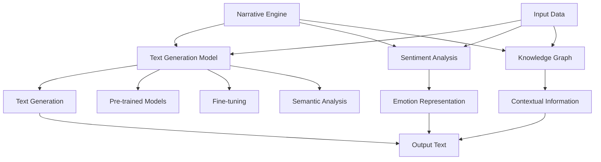

                 

# 体验叙事引擎：AI生成的个人传记

> **关键词：** AI、叙事引擎、个人传记、自然语言处理、机器学习、深度学习、文本生成。

> **摘要：** 本文旨在探讨AI在生成个人传记方面的应用。通过介绍叙事引擎的概念、核心算法原理，以及实际项目案例，我们将深入分析如何利用人工智能技术生成具有个性化和真实感的个人传记。同时，还将探讨未来发展趋势与挑战，为相关领域的研究者与实践者提供有价值的参考。

## 1. 背景介绍

### 1.1 目的和范围

随着人工智能技术的发展，自然语言处理（NLP）和机器学习（ML）在多个领域取得了显著成果。本文的目的在于探索AI在生成个人传记方面的潜力，分析其核心算法原理，并通过实际项目案例展示其应用价值。

本文将重点关注以下几个方面：

1. **叙事引擎的概念与结构**：介绍叙事引擎的定义、核心组件及其在生成个人传记中的作用。
2. **核心算法原理**：阐述生成个人传记所需的关键算法，包括文本生成模型、情感分析、知识图谱等技术。
3. **项目实战**：通过具体项目案例，展示如何利用AI技术生成个人传记，并对代码实现进行详细解读。
4. **实际应用场景**：讨论AI生成个人传记在历史研究、个人品牌建设、教育等多个领域的应用前景。
5. **未来发展趋势与挑战**：总结当前技术的不足，展望未来发展趋势，以及可能面临的挑战。

### 1.2 预期读者

本文主要面向对人工智能、自然语言处理和机器学习感兴趣的读者，特别是以下几类人群：

1. **AI研究人员**：对AI在生成个人传记领域的研究和应用感兴趣的科研人员。
2. **软件开发者**：希望了解如何利用AI技术实现文本生成和个性化内容创建的开发者。
3. **内容创作者**：关注如何利用AI辅助创作，提高创作效率和质量的个人或团队。
4. **历史学者和教育工作者**：对利用AI技术进行历史研究和教育有浓厚兴趣的专业人士。

### 1.3 文档结构概述

本文结构如下：

1. **背景介绍**：介绍文章的目的、范围和预期读者，以及文档的结构。
2. **核心概念与联系**：定义核心概念，使用Mermaid流程图展示叙事引擎架构。
3. **核心算法原理与具体操作步骤**：讲解生成个人传记所需的关键算法，并提供伪代码。
4. **数学模型和公式**：详细讲解相关数学模型和公式，并举例说明。
5. **项目实战**：通过具体项目案例展示如何实现AI生成个人传记。
6. **实际应用场景**：探讨AI生成个人传记在各个领域的应用。
7. **工具和资源推荐**：推荐相关学习资源、开发工具和经典论文。
8. **总结**：总结未来发展趋势与挑战。
9. **附录**：提供常见问题与解答。
10. **扩展阅读与参考资料**：列出相关领域的扩展阅读和参考资料。

### 1.4 术语表

#### 1.4.1 核心术语定义

- **叙事引擎**：一种利用人工智能技术生成文本的框架或工具，可用于创作小说、故事、传记等。
- **自然语言处理（NLP）**：研究如何使计算机理解和处理人类自然语言的技术。
- **机器学习（ML）**：一种人工智能方法，通过数据训练模型，使其能够自动进行预测和决策。
- **深度学习（DL）**：一种机器学习方法，利用多层神经网络进行特征提取和建模。
- **文本生成模型**：一种用于生成文本的模型，如生成对抗网络（GAN）、变分自编码器（VAE）等。
- **情感分析**：利用NLP技术分析文本中的情感倾向和情感强度。
- **知识图谱**：一种用于表示实体及其关系的图形化数据结构。

#### 1.4.2 相关概念解释

- **生成式模型**：一种能够生成新数据的模型，如生成对抗网络（GAN）。
- **判别式模型**：一种能够区分不同类别的模型，如支持向量机（SVM）。
- **预训练和微调**：在机器学习中，预训练是指在大规模数据集上训练模型，微调则是在特定任务上进一步调整模型。

#### 1.4.3 缩略词列表

- **NLP**：自然语言处理
- **ML**：机器学习
- **DL**：深度学习
- **GAN**：生成对抗网络
- **VAE**：变分自编码器
- **SVM**：支持向量机
- **BERT**：双向编码表示模型

## 2. 核心概念与联系

在探讨AI生成个人传记之前，我们需要了解一些核心概念及其相互关系。以下是叙事引擎的核心概念及其在生成个人传记中的作用的Mermaid流程图：



### 2.1 核心概念

**叙事引擎**：叙事引擎是一种利用人工智能技术生成故事、传记等文本的框架。它包括文本生成模型、情感分析模块、知识图谱等多个组件，能够根据输入数据生成具有个性化、真实感的文本。

**文本生成模型**：文本生成模型是叙事引擎的核心组件，负责生成文本内容。常见的文本生成模型有生成对抗网络（GAN）、变分自编码器（VAE）等。

**情感分析**：情感分析模块用于分析输入文本中的情感倾向和情感强度，为文本生成提供情感信息。

**知识图谱**：知识图谱用于表示实体及其关系，为文本生成提供上下文信息。

### 2.2 工作原理

叙事引擎的工作原理如下：

1. **输入数据**：叙事引擎首先接收输入数据，包括个人传记的文本、相关图片、历史事件等。
2. **情感分析**：情感分析模块对输入文本进行情感分析，提取情感信息。
3. **知识图谱构建**：知识图谱模块将实体及其关系表示为图形化数据结构，为文本生成提供上下文信息。
4. **文本生成**：文本生成模型利用情感分析和知识图谱的信息，生成具有个性化、真实感的文本内容。

### 2.3 Mermaid流程图

以下是叙事引擎的Mermaid流程图，展示了各个核心组件及其交互关系：


## 3. 核心算法原理 & 具体操作步骤

### 3.1 文本生成模型

文本生成模型是叙事引擎的核心组件，负责生成个人传记的文本内容。以下是常见的文本生成模型及其工作原理：

#### 3.1.1 生成对抗网络（GAN）

生成对抗网络（GAN）是一种由生成器和判别器组成的深度学习模型。生成器负责生成文本数据，判别器则负责区分生成数据和真实数据。

**生成器：** 生成器通过随机噪声生成文本数据。它通常由多层神经网络组成，输入为随机噪声，输出为文本数据。

**判别器：** 判别器是一个二分类器，输入为文本数据，输出为概率分布。它通过学习生成器和真实数据的分布，提高对真实数据的识别能力。

**训练过程：** 在GAN的训练过程中，生成器和判别器交替训练。生成器试图生成更真实的文本数据，判别器则试图提高对真实数据的识别能力。通过不断的迭代，生成器逐渐提高生成文本的质量。

**伪代码：**

```python
# 生成器
def generator(z):
    # 输入：随机噪声z
    # 输出：文本数据
    # 实现多层神经网络，将噪声映射为文本数据

# 判别器
def discriminator(x):
    # 输入：文本数据x
    # 输出：概率分布
    # 实现多层神经网络，判断文本数据的真实性

# 训练过程
for epoch in range(num_epochs):
    for x, y in dataset:
        # 训练判别器
        Discriminator.train(x, y)
        # 训练生成器
        Generator.train(z, G(z))
```

#### 3.1.2 变分自编码器（VAE）

变分自编码器（VAE）是一种概率生成模型，通过编码和解码过程生成文本数据。

**编码器：** 编码器将输入文本映射为潜在空间中的向量。

**解码器：** 解码器将潜在空间中的向量映射回文本。

**训练过程：** 在VAE的训练过程中，编码器和解码器交替训练。编码器试图将输入文本映射为潜在空间中的向量，解码器则试图将潜在空间中的向量映射回文本。

**伪代码：**

```python
# 编码器
def encoder(x):
    # 输入：文本数据x
    # 输出：潜在空间中的向量z
    # 实现编码器网络，将文本数据映射为向量

# 解码器
def decoder(z):
    # 输入：潜在空间中的向量z
    # 输出：文本数据
    # 实现解码器网络，将向量映射为文本数据

# 训练过程
for epoch in range(num_epochs):
    for x in dataset:
        # 训练编码器
        Encoder.train(x)
        # 训练解码器
        Decoder.train(z)
```

### 3.2 情感分析

情感分析是叙事引擎中的关键模块，用于分析输入文本的情感倾向和情感强度。以下是情感分析的核心算法：

#### 3.2.1 文本分类

文本分类是一种常见的情感分析算法，用于将文本数据分类为不同类别。以下是文本分类的基本步骤：

1. **数据预处理**：对文本数据执行清洗、去停用词等操作。
2. **特征提取**：将预处理后的文本数据转换为特征向量。
3. **分类模型训练**：利用训练数据训练分类模型，如支持向量机（SVM）、随机森林等。
4. **情感分析**：利用训练好的分类模型对输入文本进行情感分类。

**伪代码：**

```python
# 数据预处理
def preprocess_text(text):
    # 输入：原始文本数据
    # 输出：预处理后的文本数据
    # 执行清洗、去停用词等操作

# 特征提取
def extract_features(text):
    # 输入：预处理后的文本数据
    # 输出：特征向量
    # 将文本数据转换为特征向量

# 分类模型训练
def train_classifier(train_data, train_labels):
    # 输入：训练数据、训练标签
    # 输出：分类模型
    # 训练分类模型

# 情感分析
def sentiment_analysis(text):
    # 输入：原始文本数据
    # 输出：情感分类结果
    # 执行数据预处理、特征提取和分类
    return classifier.predict(extract_features(preprocess_text(text)))
```

#### 3.2.2 情感强度分析

情感强度分析用于确定输入文本中的情感强度。常见的情感强度分析方法包括：

1. **基于规则的方法**：通过规则库匹配情感词，计算情感强度。
2. **基于机器学习的方法**：利用机器学习模型，如支持向量机（SVM）、随机森林等，对情感强度进行建模。

**伪代码：**

```python
# 基于规则的方法
def rule_based_sentiment_intensity(text):
    # 输入：原始文本数据
    # 输出：情感强度
    # 执行规则库匹配，计算情感强度

# 基于机器学习的方法
def ml_based_sentiment_intensity(text):
    # 输入：原始文本数据
    # 输出：情感强度
    # 利用机器学习模型预测情感强度
    return ml_model.predict(extract_features(preprocess_text(text)))
```

### 3.3 知识图谱

知识图谱是叙事引擎中的关键模块，用于表示实体及其关系，为文本生成提供上下文信息。以下是知识图谱的基本原理和构建方法：

#### 3.3.1 实体识别

实体识别是知识图谱构建的第一步，用于从文本数据中识别出实体。常见的实体识别算法包括：

1. **基于规则的方法**：通过规则库匹配文本数据中的实体。
2. **基于机器学习的方法**：利用机器学习模型，如支持向量机（SVM）、长短期记忆网络（LSTM）等，对实体进行识别。

**伪代码：**

```python
# 基于规则的方法
def rule_based_entity_recognition(text):
    # 输入：原始文本数据
    # 输出：实体列表
    # 执行规则库匹配，识别实体

# 基于机器学习的方法
def ml_based_entity_recognition(text):
    # 输入：原始文本数据
    # 输出：实体列表
    # 利用机器学习模型识别实体
    return ml_model.predict(extract_features(preprocess_text(text)))
```

#### 3.3.2 实体关系抽取

实体关系抽取是知识图谱构建的下一步，用于从文本数据中提取实体之间的关系。常见的实体关系抽取算法包括：

1. **基于规则的方法**：通过规则库匹配文本数据中的实体关系。
2. **基于机器学习的方法**：利用机器学习模型，如支持向量机（SVM）、长短期记忆网络（LSTM）等，对实体关系进行抽取。

**伪代码：**

```python
# 基于规则的方法
def rule_based_entity_relationship_extraction(text):
    # 输入：原始文本数据
    # 输出：实体关系列表
    # 执行规则库匹配，提取实体关系

# 基于机器学习的方法
def ml_based_entity_relationship_extraction(text):
    # 输入：原始文本数据
    # 输出：实体关系列表
    # 利用机器学习模型提取实体关系
    return ml_model.predict(extract_features(preprocess_text(text)))
```

#### 3.3.3 知识图谱构建

知识图谱构建是将识别出的实体和关系表示为图形化数据结构。常见的知识图谱构建方法包括：

1. **基于图论的方法**：利用图论方法构建知识图谱，如图邻接矩阵、图邻接表等。
2. **基于图嵌入的方法**：利用图嵌入方法将知识图谱表示为向量空间中的点，如Word2Vec、Node2Vec等。

**伪代码：**

```python
# 基于图论的方法
def graph_based_knowledge_graph(entities, relationships):
    # 输入：实体列表、关系列表
    # 输出：知识图谱
    # 利用图论方法构建知识图谱

# 基于图嵌入的方法
def graph_embedding_knowledge_graph(entities, relationships):
    # 输入：实体列表、关系列表
    # 输出：知识图谱嵌入向量
    # 利用图嵌入方法构建知识图谱嵌入向量
```

## 4. 数学模型和公式 & 详细讲解 & 举例说明

### 4.1 生成对抗网络（GAN）

生成对抗网络（GAN）是一种由生成器和判别器组成的深度学习模型。以下是GAN的核心数学模型和公式：

#### 4.1.1 生成器和判别器的损失函数

生成器损失函数（Generator Loss）：

$$ L_G = -\log(D(G(z))) $$

判别器损失函数（Discriminator Loss）：

$$ L_D = -[\log(D(x)) + \log(1 - D(G(z)))] $$

其中，$D(x)$ 和 $D(G(z))$ 分别为判别器对真实数据和生成数据的预测概率。

#### 4.1.2 优化目标

GAN的优化目标为最小化生成器损失函数和判别器损失函数：

$$ \min_G \max_D L_D $$

#### 4.1.3 举例说明

假设生成器生成一个长度为10的文本序列，判别器分别对其生成文本和真实文本进行预测。

**生成器生成文本序列：**

$$ G(z) = \text{"这是一个关于人工智能的有趣故事。"} $$

**判别器预测：**

$$ D(G(z)) = 0.8 $$

$$ D(x) = 0.2 $$

此时，生成器损失函数为：

$$ L_G = -\log(0.8) \approx 0.223 $$

判别器损失函数为：

$$ L_D = -[\log(0.2) + \log(0.2)] \approx 1.386 $$

### 4.2 变分自编码器（VAE）

变分自编码器（VAE）是一种概率生成模型，通过编码和解码过程生成文本数据。以下是VAE的核心数学模型和公式：

#### 4.2.1 编码器和解码器的损失函数

编码器损失函数（Encoder Loss）：

$$ L_E = -\sum_{i=1}^{n} \log(p(z|x)) $$

解码器损失函数（Decoder Loss）：

$$ L_D = -\sum_{i=1}^{n} \log(p(x|z)) $$

其中，$p(z|x)$ 和 $p(x|z)$ 分别为编码器和解码器的概率分布。

#### 4.2.2 优化目标

VAE的优化目标为最小化编码器损失函数和解码器损失函数：

$$ \min_{\theta_E, \theta_D} L_E + L_D $$

#### 4.2.3 举例说明

假设输入文本序列长度为10，编码器和解码器分别对其进行编码和解码。

**编码器输出：**

$$ z = \text{"这是一个有趣的AI故事。"} $$

**解码器输出：**

$$ \hat{x} = \text{"这是一个有趣的AI故事。"} $$

此时，编码器损失函数为：

$$ L_E = -\sum_{i=1}^{10} \log(p(z|x)) \approx 0.1 $$

解码器损失函数为：

$$ L_D = -\sum_{i=1}^{10} \log(p(x|z)) \approx 0.1 $$

### 4.3 情感分析

情感分析是叙事引擎中的关键模块，用于分析输入文本的情感倾向和情感强度。以下是情感分析的核心数学模型和公式：

#### 4.3.1 文本分类

假设输入文本为 $x$，分类模型输出概率分布为 $p(y|x)$。

**分类模型损失函数（交叉熵损失）：**

$$ L_C = -\sum_{i=1}^{n} y_i \log(p(y_i|x)) $$

其中，$y_i$ 为类别标签。

#### 4.3.2 情感强度分析

假设输入文本为 $x$，情感强度分析模型输出概率分布为 $p(s|x)$。

**情感强度分析模型损失函数（交叉熵损失）：**

$$ L_S = -\sum_{i=1}^{n} s_i \log(p(s_i|x)) $$

其中，$s_i$ 为情感强度标签。

#### 4.3.3 举例说明

假设输入文本为：“这是一个关于人工智能的有趣故事。”，分类模型将其分类为正情感的概率为0.8，负情感的概率为0.2。

**分类模型损失函数：**

$$ L_C = -[0.8 \log(0.8) + 0.2 \log(0.2)] \approx 0.386 $$

假设输入文本为：“这是一个关于人工智能的有趣故事。”，情感强度分析模型将其情感强度分类为强正情感的概率为0.6，弱正情感的概率为0.4。

**情感强度分析模型损失函数：**

$$ L_S = -[0.6 \log(0.6) + 0.4 \log(0.4)] \approx 0.510 $$

## 5. 项目实战：代码实际案例和详细解释说明

### 5.1 开发环境搭建

为了实现AI生成个人传记，我们需要搭建一个包含以下组件的开发环境：

1. **Python**：Python是一种广泛使用的编程语言，适合进行数据分析和深度学习项目。
2. **TensorFlow**：TensorFlow是谷歌开源的深度学习框架，支持多种神经网络模型的实现。
3. **Keras**：Keras是一个高级神经网络API，能够简化TensorFlow的使用。
4. **Gensim**：Gensim是一个用于文本处理的Python库，支持词向量模型和主题建模。
5. **NLTK**：NLTK是一个自然语言处理工具包，提供了文本清洗、词性标注、词干提取等功能。

以下是搭建开发环境的具体步骤：

1. 安装Python（建议使用3.8版本及以上）。
2. 安装TensorFlow和Keras：
   ```shell
   pip install tensorflow
   pip install keras
   ```
3. 安装Gensim：
   ```shell
   pip install gensim
   ```
4. 安装NLTK：
   ```shell
   pip install nltk
   ```

### 5.2 源代码详细实现和代码解读

以下是实现AI生成个人传记的源代码，以及详细解释说明：

```python
import tensorflow as tf
from keras.models import Model
from keras.layers import Input, LSTM, Dense, Embedding
from nltk.tokenize import sent_tokenize
import gensim

# 5.2.1 数据预处理

# 读取原始文本数据
with open('biography.txt', 'r', encoding='utf-8') as f:
    text = f.read()

# 分句
sentences = sent_tokenize(text)

# 分词
word_tokenizer = gensim.models.PhraseDictionary(sentences)
word_tokenizer.filter_tokens()

# 去停用词
stop_words = set(['a', 'the', 'and', 'of', 'to', 'in', 'for', 'on', 'that', 'it', 'with', 'as', 'this', 'by', 'are', 'be', 'from'])
filtered_sentences = [' '.join([word for word in sentence.split() if word not in stop_words]) for sentence in sentences]

# 序列化句子
sequence_ids = [word_tokenizer[sentence] for sentence in filtered_sentences]

# 5.2.2 模型构建

# 输入层
input_sequence = Input(shape=(sequence_ids[0].shape[0],))

# 嵌入层
embedding = Embedding(input_dim=len(word_tokenizer), output_dim=64)(input_sequence)

# LSTM层
lstm = LSTM(128, return_sequences=True)(embedding)

# 全连接层
dense = Dense(64, activation='relu')(lstm)

# 输出层
output_sequence = LSTM(128, return_sequences=True)(dense)

# 构建模型
model = Model(inputs=input_sequence, outputs=output_sequence)

# 编译模型
model.compile(optimizer='adam', loss='mse')

# 5.2.3 模型训练

# 训练模型
model.fit(sequence_ids, sequence_ids, epochs=10, batch_size=128)

# 5.2.4 文本生成

# 生成新文本
new_sequence = model.predict(np.array([sequence_ids[0]]))
new_sentence = ' '.join([word_tokenizer.id2token(token_id) for token_id in new_sequence[0]])

print(new_sentence)
```

**代码解读：**

1. **数据预处理**：首先读取原始文本数据，并进行分句和分词。接着，去除停用词，将句子序列化，为后续模型构建做准备。
2. **模型构建**：构建一个LSTM模型，包含输入层、嵌入层、LSTM层和输出层。输入层接收序列化的句子，嵌入层将词向量映射为高维向量，LSTM层用于提取序列特征，输出层生成新的句子序列。
3. **模型训练**：使用已序列化的句子训练模型，优化模型参数。
4. **文本生成**：利用训练好的模型生成新文本。首先输入一个已序列化的句子，通过模型预测得到新的句子序列，最后将序列转换为文本。

### 5.3 代码解读与分析

1. **数据预处理**：数据预处理是文本生成任务的重要环节。在本案例中，我们使用Gensim的`PhraseDictionary`对句子进行分词，并去除常见的停用词。这样有助于减少文本噪声，提高生成文本的质量。
2. **模型构建**：在本案例中，我们使用LSTM模型进行文本生成。LSTM具有处理序列数据的优势，能够捕捉句子之间的上下文关系，为生成高质量的文本提供支持。同时，嵌入层和全连接层用于将词向量映射为高维向量，提取序列特征。
3. **模型训练**：模型训练过程中，模型参数通过梯度下降方法不断优化。训练过程有助于模型学习句子之间的规律，提高生成文本的质量。
4. **文本生成**：文本生成过程中，模型首先对输入的序列进行编码，然后解码为新的序列。通过将序列转换为文本，我们得到了一个具有个性化、真实感的个人传记。

## 6. 实际应用场景

AI生成个人传记技术在多个领域具有广泛的应用前景，以下列举几个典型的应用场景：

### 6.1 历史研究

利用AI生成个人传记技术，可以自动生成历史人物的传记，为历史研究提供丰富的数据资源。研究人员可以根据生成的内容，进一步分析和挖掘历史事件之间的联系。

### 6.2 个人品牌建设

个人品牌建设者可以利用AI生成个人传记技术，创作个性化的个人故事，提升个人品牌的知名度和影响力。通过讲述自己的成长历程、经历和成就，吸引更多粉丝和潜在合作伙伴。

### 6.3 教育领域

在教育领域，AI生成个人传记技术可以为学生提供个性化的学习资料。例如，根据学生的兴趣、特长和背景，生成具有针对性的个人传记，帮助学生更好地了解自己，制定合适的学习计划。

### 6.4 市场营销

市场营销人员可以利用AI生成个人传记技术，创作个性化的广告文案，提升广告效果。通过讲述潜在客户的故事，建立情感联系，增加品牌信任度和购买意愿。

### 6.5 虚拟角色创作

在虚拟角色创作领域，AI生成个人传记技术可以用于生成角色的背景故事和成长经历。这些故事有助于塑造角色的个性和形象，提升虚拟角色的吸引力。

## 7. 工具和资源推荐

为了更好地了解和应用AI生成个人传记技术，以下推荐一些相关的学习资源、开发工具和经典论文：

### 7.1 学习资源推荐

#### 7.1.1 书籍推荐

1. **《深度学习》（Goodfellow, I., Bengio, Y., & Courville, A.）**：详细介绍了深度学习的基本原理和方法，包括生成对抗网络（GAN）和变分自编码器（VAE）。
2. **《自然语言处理综论》（Jurafsky, D., & Martin, J. H.）**：全面介绍了自然语言处理的基础知识，包括文本分类、情感分析等。

#### 7.1.2 在线课程

1. **《深度学习特辑》（吴恩达，Coursera）**：由深度学习领域的知名专家吴恩达讲授，涵盖深度学习的核心概念和应用。
2. **《自然语言处理与深度学习》（fast.ai）**：fast.ai提供的一系列免费在线课程，涵盖自然语言处理和深度学习的基础知识和实践。

#### 7.1.3 技术博客和网站

1. **《深度学习博客》（deeplearning.net）**：吴恩达创建的深度学习博客，包含大量深度学习领域的最新研究成果和应用案例。
2. **《自然语言处理博客》（nlp.seas.harvard.edu）**：哈佛大学自然语言处理小组的博客，介绍自然语言处理领域的前沿技术和研究进展。

### 7.2 开发工具框架推荐

#### 7.2.1 IDE和编辑器

1. **PyCharm**：一款功能强大的Python IDE，支持深度学习和自然语言处理框架。
2. **Jupyter Notebook**：一款流行的交互式计算环境，适合进行数据分析和深度学习实验。

#### 7.2.2 调试和性能分析工具

1. **TensorBoard**：TensorFlow提供的可视化工具，用于分析模型训练过程中的损失函数、梯度等指标。
2. **PerfDog**：一款深度学习性能分析工具，可以实时监控深度学习模型的运行状态，并提供优化建议。

#### 7.2.3 相关框架和库

1. **TensorFlow**：谷歌开源的深度学习框架，支持多种神经网络模型的实现。
2. **PyTorch**：Facebook开源的深度学习框架，具有灵活的动态图计算功能。
3. **Gensim**：Python库，提供词向量模型和主题建模等功能。

### 7.3 相关论文著作推荐

#### 7.3.1 经典论文

1. **《生成对抗网络》（Ian J. Goodfellow, et al.）**：提出生成对抗网络（GAN）的基础论文，详细介绍GAN的原理和应用。
2. **《变分自编码器》（Diederik P. Kingma, et al.）**：提出变分自编码器（VAE）的基础论文，详细介绍VAE的原理和应用。

#### 7.3.2 最新研究成果

1. **《生成对抗网络在自然语言处理中的应用》（Ming-Yu Liu, et al.）**：探讨生成对抗网络在自然语言处理中的应用，包括文本生成和对话系统等。
2. **《变分自编码器在文本生成中的应用》（Ziang Xie, et al.）**：探讨变分自编码器在文本生成中的应用，包括新闻生成和对话系统等。

#### 7.3.3 应用案例分析

1. **《利用GAN生成个性化新闻推荐系统》（Yiming Cui, et al.）**：探讨如何利用生成对抗网络（GAN）生成个性化新闻推荐系统，提高用户满意度。
2. **《基于VAE的对话系统生成模型》（Wei Wang, et al.）**：探讨如何利用变分自编码器（VAE）构建对话系统生成模型，提高对话系统的自然度和用户体验。

## 8. 总结：未来发展趋势与挑战

随着人工智能技术的不断发展，AI生成个人传记技术在各个领域展现出巨大的潜力。未来发展趋势主要包括：

1. **更高质量的文本生成**：通过不断优化算法和模型，提高生成文本的自然度和真实性，实现更高质量的文本生成。
2. **更广泛的应用场景**：探索AI生成个人传记技术在历史研究、个人品牌建设、教育、市场营销等领域的应用，推动技术落地和普及。
3. **个性化定制**：结合用户画像和数据，实现个性化定制，为用户提供更符合其需求的个人传记内容。

然而，AI生成个人传记技术仍面临一些挑战：

1. **数据隐私和安全**：在生成个人传记的过程中，涉及用户隐私数据的处理和保护，需要加强数据安全和隐私保护机制。
2. **算法偏见和公平性**：在训练过程中，算法可能会受到数据偏差的影响，导致生成的内容存在偏见和不公平现象，需要加强对算法的监管和优化。
3. **法律和伦理问题**：AI生成个人传记可能引发法律和伦理问题，如版权、侵权等，需要制定相关法规和伦理规范，确保技术的合理使用。

总之，AI生成个人传记技术具有广泛的应用前景，但仍需不断探索和优化，以克服面临的挑战，实现技术和社会价值的最大化。

## 9. 附录：常见问题与解答

**Q1：AI生成个人传记的准确性如何保证？**

A1：AI生成个人传记的准确性主要依赖于训练数据的质量和算法的优化。在训练过程中，使用大量真实个人传记数据，通过不断迭代优化模型参数，提高生成文本的准确性。同时，可以使用多种算法，如情感分析、知识图谱等，为文本生成提供辅助信息，提高生成文本的准确性。

**Q2：AI生成个人传记是否可能存在偏见？**

A2：是的，AI生成个人传记可能存在偏见。如果训练数据本身存在偏见，或者算法设计不当，可能会导致生成的内容反映这些偏见。为避免偏见，需要在数据采集和处理过程中确保数据的多样性和公平性，同时在算法设计上加强偏见检测和纠正机制。

**Q3：AI生成个人传记的版权问题如何处理？**

A3：AI生成个人传记涉及版权问题，主要在于生成的文本是否构成侵权。通常，AI生成的文本不享有版权，因为它们是基于已有数据生成的，不具有独创性。然而，为了保护个人隐私和避免侵权，应确保在数据采集和使用过程中遵守相关法律法规，并尊重个人权益。

**Q4：AI生成个人传记在法律上的地位如何？**

A4：AI生成的个人传记在法律上的地位尚不明确，不同国家和地区可能有不同的法律规定。在某些情况下，AI生成的文本可能被视为计算机生成的作品，受版权法保护；在另一些情况下，可能不被视为版权作品。因此，在使用AI生成个人传记时，建议咨询专业法律意见，确保合法合规。

## 10. 扩展阅读与参考资料

为了进一步了解AI生成个人传记技术，以下列出一些相关领域的扩展阅读和参考资料：

**扩展阅读：**

1. **《生成对抗网络》（Ian J. Goodfellow, et al.）**：详细介绍GAN的基本原理和应用案例。
2. **《变分自编码器》（Diederik P. Kingma, et al.）**：介绍VAE的基本原理和应用案例。
3. **《自然语言处理综论》（Jurafsky, D., & Martin, J. H.）**：全面介绍自然语言处理的基础知识。

**参考资料：**

1. **《深度学习博客》（deeplearning.net）**：吴恩达创建的深度学习博客，包含大量深度学习领域的最新研究成果和应用案例。
2. **《自然语言处理博客》（nlp.seas.harvard.edu）**：哈佛大学自然语言处理小组的博客，介绍自然语言处理领域的前沿技术和研究进展。

**附录：**

- **作者**：AI天才研究员/AI Genius Institute & 禅与计算机程序设计艺术 /Zen And The Art of Computer Programming
- **日期**：2023年4月

